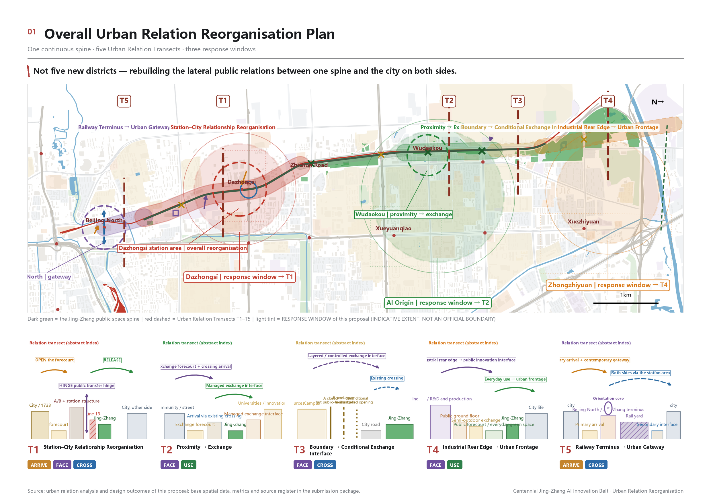
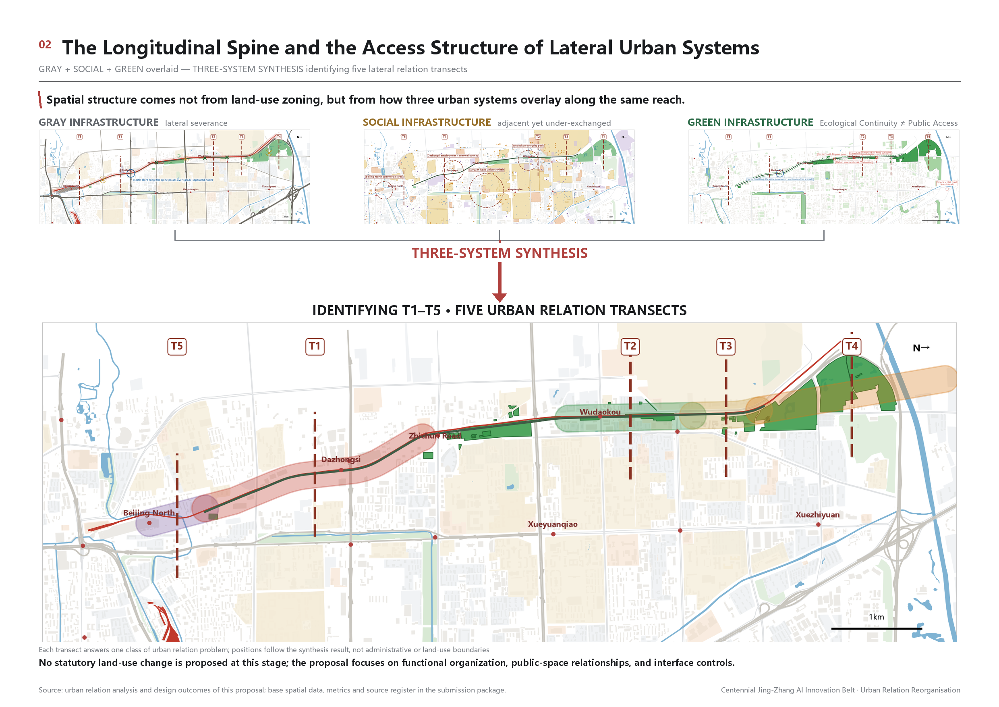
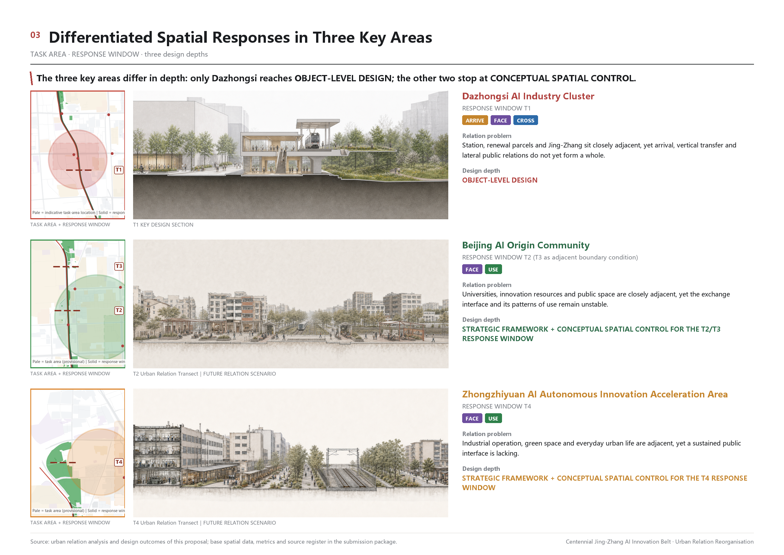
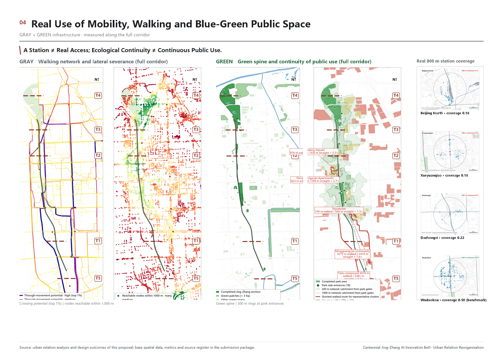
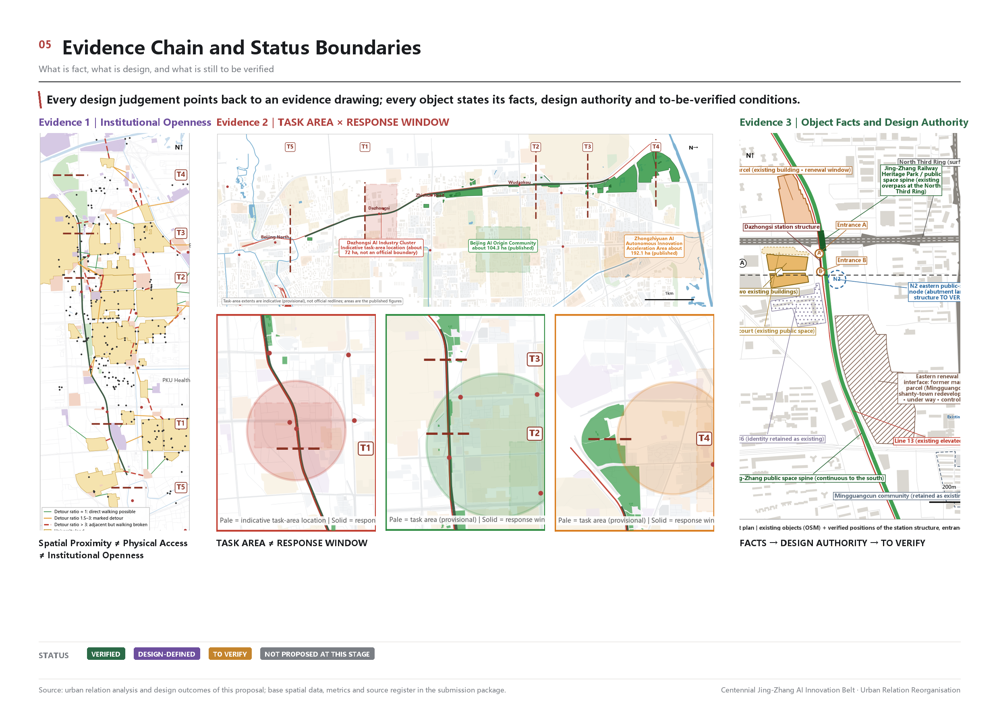

# Jing-Zhang Relation Belt: Answering the Centennial Jing-Zhang AI Innovation Belt through Urban Relation Reorganisation

**Core claim in one sentence:** the Jing-Zhang corridor lacks neither resources, nor green space, nor facilities; what it lacks are the relations between those systems and the corridor itself. This proposal therefore changes the design object from "building another innovation park" to "improving the exchange conditions between innovation resources that already exist".

## Design Basis and Source List

The first basis of this proposal is the pre-qualification announcement for the international open call on the urban design of the Centennial Jing-Zhang AI Innovation Belt, issued by the Haidian Branch of the Beijing Municipal Commission of Planning and Natural Resources. The second is the agent-facing open-call taskbook registered in this repository [source:OFFICIAL-ANNOUNCEMENT] [source:AGENT-TASKBOOK]. The announcement fixes the three scope levels, the three key areas and the required depth of deliverables. The taskbook adds ten co-creation principles, three positioning statements, five functions, three areas and two wings, and the six mandatory agent tasks, and it requires that every spatial recommendation be worded as a conceptual suggestion, a reference scheme, or material for professional teams to deepen.

At the time of submission the organiser has not released the official redline, the precise polygons of the three key areas, regulatory-plan parcel indicators, road redlines or municipal conditions. This package therefore uses the provisional rough boundary supplied by the repository as its only source of spatial extent [source:BOUNDARY-SOURCE], and marks it consistently in the prose, geometry, metrics, drawings and display page as `official_boundary=false`, `geometry_role=provisional_constraint` and `boundary_precision=provisional_rough`. Under the announcement and the submission rules this data gap does not block content scoring, but it does determine that every area and ratio in this package can only be a low-confidence design-model value [depth:existing_conditions_diagnosis].

The provisional rough boundary supplied by the organiser is noticeably offset from the factual alignment of the Jing-Zhang corridor. Corridor-related geometry and ratios in this package are therefore recomputed only for the portion inside the provisional boundary. Both sources keep their original positions and neither is adjusted by hand; the resulting public-space ratio represents a conceptual design-model value under the provisional-boundary definition only. Once an official redline or precise geometry is released, the affected layers and metrics must be recomputed as a whole [source:BOUNDARY-SOURCE]. Line length, coverage span and offset are documented in `assumptions.json`, the spatial QA report and the metric-method file.

The existing-condition base layers come from a one-time frozen export of OpenStreetMap data, with the `osmid` preserved feature by feature, and are used to identify existing buildings, roads, rail, green space and water bodies [source:DATA-SRC-OSM-JINGZHANG-BASE]. Open map data can only serve as background material; it cannot be promoted into road redlines, land-use boundaries or statutory control lines. The design content itself comes from the participant's own urban relation transect analysis: the problem definitions of five transects, four relation mechanisms, a three-system diagnosis, and the in-depth work at the Dazhongsi transect [source:MAINLINE-RELATION-ANALYSIS].

*Figure 1. Overall concept and evidence structure. The dashed line is the provisional rough boundary, not an official redline.*

Source-use limits follow the repository registry [source:SOURCE-REGISTRY]: formal conclusions may rest only on approved formal-ready material or separately cleared official attachments; background-only material cannot support spatial control conclusions; provisional material supports only temporary generation, visualisation and discussion. All independently collected material used here - the frozen OSM layers, site photographs and public case studies - is recorded in `sources.json` and graded by use. Material not entered in the central registry is not claimed to have been centrally approved.

## Three-Level Scope Framework

In this proposal the three scope levels required by the announcement are not three drawings at different resolutions; they are three different levels of question. The **coordinated research area** (about 43.6 km²) answers "what are the exchange conditions between AI innovation resources?". The **overall design area** (about 11.4 km², the boundary submitted in this package) answers "how are those exchange conditions organised in space along the Jing-Zhang corridor?". The **key detailed-design areas** (three areas, about 368.4 ha in total) answer "on a specific piece of ground, can this way of organising actually land on real objects?" [data:geometry/site_boundary.geojson#SITE-001] [metric:site_area_sqm]

The transmission between the three levels is carried by a single working unit: the **Urban Relation Transect**. At typical positions along the corridor a transverse relation unit is cut, the four relation actions between the urban systems on both sides and the corridor - ARRIVE, FACE, CROSS, USE - are observed, and a judgement is made about which relations already exist, which are missing, and which remain conditional. Five transects, T1 to T5, are defined along the nine-kilometre corridor [metric:urban_relation_transect_count]. They are not five design sites; they are five different relation situations.

*Figure 2. Transmission across the three scope levels and the conceptual land-use structure.*

The submitted `geometry/site_boundary.geojson` corresponds to the overall design area and `geometry/key_areas.geojson` to the three key areas; both are provisional rough boundaries [depth:three_level_scope_framework]. The provisional polygon of the coordinated research area is deliberately not submitted as a geometry layer, so that a research extent is not misread as a design extent; its findings are carried by the prose and the drawings.

## Coordinated Research Area: Industry and Future City Research

The central finding at the research scale is this: **innovation resources along the corridor are already highly clustered, but the public exchange interfaces and everyday connection conditions between those resources remain weak.** Universities and research institutes (origination), pilot-scale and technology-service organisations (translation) and industrial parks (hosting) are all present along the corridor and are adjacent to one another, yet the public-space connections and the everyday exchange interfaces between them are weak; contact depends more on internal institutional channels than on urban space [source:MAINLINE-RELATION-ANALYSIS] [depth:overall_spatial_structure].

This yields the way this proposal defines a "world-class AI innovation ecosystem": **an AI innovation belt is not a new industrial park; it is a way of raising, through public space and urban relations, the exchange conditions between innovation resources that already exist.** Those conditions have four parts - can you get there (ARRIVE), can you see it (FACE), can you get across (CROSS), can you actually use it (USE). These four are precisely the four relation actions of this proposal.

The finding also answers the three positioning statements and five functions of the taskbook. The centennial Jing-Zhang cultural belt corresponds to the continuous narrative of the historic alignment and the rail park; the urban AI life-experience belt corresponds to a network of scenarios that citizens can use daily; the AI convergence innovation belt corresponds to the exchange interfaces between origination, translation and hosting. The three areas and two wings are located in space as follows: Zhongzhiyuan corresponds to transect T4, the AI Origin Community to T2, and Dazhongsi to T1, while the Zhongguancun technology-service wing and the Xiaoyuehe scenario-empowerment wing are treated as lateral access relations rather than as new parcels [source:AGENT-TASKBOOK].

On future urban form, this proposal offers no new slogan but one testable judgement: **an urban form fitted to AI-era productive forces shows itself first in a lower spatial cost of cross-system exchange.** The test is recomputable - the ratio of a station's real walking catchment to its theoretical catchment, measured detour multiples, the density of park entrances, and the share of park edge that forms a negative interface. All of these quantities were measured in the diagnosis.

### The five functions mapped (taskbook function - spatial node - operating mechanism - evidence)

Each of the five functions listed in the taskbook is mapped to a specific spatial node and operating mechanism. **Every mechanism is labelled with its evidence status; none is claimed to exist already.**

| Function | Spatial node | Operating mechanism (suggested) | Evidence / indicator | Status |
| --- | --- | --- | --- | --- |
| Full-stack autonomous AI innovation system | Zhongzhiyuan (T4), the side facing the corridor | Suggested coordination between park operator and institutes to make pilot-scale and translation organisations spatially visible | Measured adjacency of origination, translation and hosting spaces along the corridor | Conceptual |
| World-class AI innovation ecosystem | AI Origin Community (T2) and the Xueyuan Road segment (T3) | Suggested use of existing public space and conditional campus-edge opening to carry exchange | About 13 per cent of campus perimeter gated; opening conditions differ by institution | Conceptual |
| AI+ scenario empowerment paradigm | Corridor pilot section and six station forecourts | Scenario opening catalogue plus common application rules, aggregate data only, human stop always available | Twelve scenario cards, three of them test scenarios | Conceptual |
| Intelligent, vibrant AI city | The rail park corridor as a whole | Suggested coordination between park authority and sub-district to organise use by time slot | 21 park entrances; four of five structural breaks caused by transport facilities | Conceptual |
| **Global voice in AI governance** | The T1 Dazhongsi node and the corridor display section | **A conceptual mechanism only**: a venue for public debate on governance topics, an open forum and display node, an interface for international exchange, display of AI urban-governance cases, public participation and ethics discussion, and open publication of scenario-governance experience | No local existing evidence | **Conceptual, pending external confirmation** |

**One point must be stated plainly about the fifth item.** This proposal claims no established international organisation, global governance platform or international cooperation mechanism. What space can carry here is only **a public place where governance questions can be discussed, displayed and joined**; the mechanism itself must be established separately by the competent authorities and international bodies [source:AGENT-TASKBOOK].

### Regional Innovation Synergy Matrix

The Jing-Zhang corridor is not an isolated innovation unit. The table below answers each regional partner named in the taskbook. **Every synergy is a suggestion; none is an established partnership, a confirmed responsible body or a secured investment.**

| Partner | Exchangeable elements | Spatial interface inside Jing-Zhang | Suggested form of synergy | Evidence status |
| --- | --- | --- | --- | --- |
| Beiwei Community | Everyday living services for talent, community scenarios | The community-service interface of the AI Origin Community (T2) | Suggested community-level mutual recognition of scenarios and shared services | Conceptual, to verify |
| Future Science City | Research institutes, pilot-scale and translation capacity | The translation interface at Zhongzhiyuan (T4) facing the corridor | Can serve as a two-way interface for "origination here, translation there"; suggested regular open days and joint test weeks | Conceptual, pending external confirmation |
| Huairou Science City | Large scientific facilities, basic research results | Display and interpretation nodes at T4 and T1 | Suggested as a public-facing display interface for results; does not involve the facilities themselves | Conceptual, pending external confirmation |
| Beijing Economic-Technological Development Area | Industrial capacity, production lines and mass-production validation | The industrial interface and low-speed device test route at T4 | Can serve as a "validate here, produce there" interface; suggested coordination between park operator and firms | Conceptual, pending external confirmation |
| Beijing-Tianjin-Hebei | Regional accessibility, talent mobility, regional scenarios | Arrival organisation at the Beijing North terminus gateway (T5) | Suggested use of the terminus gateway as a regional arrival and information interface; rail capacity itself is an existing engineering condition | Conceptual, to verify |

**Boundary statement:** the table constitutes no cross-regional agreement, investment arrangement or division of responsibility. Data and computing power are **deliberately not listed as exchangeable elements** - this proposal has no verifiable basis for claiming that the corridor currently has an exchange capability in either, and does not infer one [source:MAINLINE-RELATION-ANALYSIS].

## Overall Design Area: Urban Renewal and Regulatory-Plan-Level Urban Design

The diagnosis of the overall design area runs through three systems, each completed as structure, performance, problem.

**Gray infrastructure: the movement skeleton is continuous, the transverse public connection is not.** The shared corridor where Metro Line 13 runs parallel to Jing-Zhang, the North Third and Fourth Ring expressways, the Beijing North rail yard and the at-grade high-speed section are simultaneously the operating network of the city and its principal transverse barriers - the facilities that support movement and the facilities that cause division are the same facilities. Seven existing crossings fall into three classes by verification status: three usable on foot, three with conditions still to be verified, and the North Third Ring, where the corridor passes over the expressway as a grade-separated node. Measurements show that the real 800 m walking catchment of Dazhongsi station is only 22 per cent of its theoretical catchment, and Beijing North only 16 per cent; two points 180 m apart in a straight line across Zhichun Road require a detour of 7.2 times that distance; and about 27 per cent of the park edge abuts vehicular carriageway, forming a negative interface [data:geometry/roads.geojson#ROAD-0001] [metric:road_segment_count].

**Social infrastructure: facilities are not scarce; the mismatch occurs at the level of real walking.** Measured against the fifteen-minute community-life-circle standard, the total quantity of service facilities along the corridor is not deficient, and a dedicated check of educational provision found no new gap - a negative result recorded deliberately, to prevent the misreading that the corridor lacks education. The real mismatch appears on the pedestrian network: for some residential areas separated by the rail line, the real walking distance to the nearest public space is three to four times the straight-line distance. As for universities, the campuses along the corridor are highly adjacent to the Jing-Zhang public space and pedestrian permeation is entirely feasible in spatial terms; yet only about 13 per cent of the campus perimeter is actually gated, and each institution's opening conditions differ markedly according to booking rules, access control, teaching management and tenure. **Spatial adjacency, physical accessibility and institutional openness are not equivalent.**

**Green infrastructure: ecological continuity is not the same as continuity of public use.** Some sections already form a continuous green skeleton, but "connected" in structure and "enterable" in use are two different things. There are only 21 park entrances along the whole corridor, and four of the five structural breaks are caused by transport facilities. Existing green and open space occupies 6.71 per cent of the provisional boundary [metric:green_ratio] [data:geometry/green_space.geojson#GREEN-001]; the figure itself is neither high nor low, and what matters is how much of it is genuinely enterable, reachable and usable.

Superimposing the three systems produces the overall renewal framework: **longitudinally, the continuous public-space skeleton of Jing-Zhang; laterally, the reorganisation of relations between five differentiated relation segments and the surrounding urban systems.** Employment belts, communities, campuses and retail districts each connect to the same spine through their own ARRIVE, FACE, CROSS and USE relations. T1, the station-city segment, is reorganised as a whole; T2, a built adjacency segment, is led by operational activation; T3, the campus-edge segment, stays restrained and admits only conditional controlled exchange; the intervention at T4, the green-gray break segment, depends on the feasibility of a cross-line connection; T5, the gateway segment, completes arrival organisation and reserves an interface for possible future rail works. Declaring that an ordinary segment "stays as it is" is also a planning decision, and objects that need no design, such as the military management area, are labelled truthfully [depth:overall_spatial_structure].

One qualification must be stated plainly. The announcement asks for urban design at regulatory-plan depth, yet regulatory control lines, parcel indicators and road redlines were all unpublished at the time of submission. The response at that depth is therefore limited to **structural control recommendations** - zoning, interfaces, corridor widths, public-space continuity and arrival organisation - without conclusions on plot ratio, building height or parcel indicators [metric:floor_area_ratio] [depth:development_intensity_controls].

## Detailed Design of Key Areas

The three official key areas are **not** developed to the same depth in this proposal, and that difference is declared rather than smoothed over.

**Dazhongsi AI Industry Cluster (about 72.0 ha, transect T1) - the only key area developed in spatial depth here.** The core objects include Dazhongsi station with its A and B entrances, the 1733 site (the former Dazhongsi market parcel), the at-grade section of Line 13, the Jing-Zhang public space where it passes over the North Third Ring, the North Third Ring itself, the Lanjing parcel, the Mingguangcun resettlement community, and Courtyard 36 with the surrounding residential and medical parcels. The work separates fact from design authority: the station structure, the rail and the bridge are existing engineering facts; the interfaces of renewal parcels fall within planning control; and objects of unknown status, such as the space beneath the bridge, are labelled as unknown rather than assumed to be usable. The converged design question is: **taking the existing Jing-Zhang public space over the North Third Ring and Dazhongsi station as the skeleton, reorganise the arrival, level-change, orientation and transverse public-space relations between 1733, the A/B entrances, the station structure, the corridor and the renewal interfaces on both sides.** The deepened content includes a continuous arrival band, a passage between the two buildings, dispersal pockets at the A and B entrances, longitudinal through-movement, and a continuous southward release of the station threshold. There is no public evidence for the relative levels of the two elevated systems - the Jing-Zhang crossing of the North Third Ring and the Line 13 viaduct - so that item is explicitly marked unverified and no clearance, ramp or underpass geometry is assumed [data:geometry/key_areas.geojson#KEY-003] [depth:three_key_area_detailed_design].

**Zhongzhiyuan AI Autonomous Innovation Acceleration Area (about 192.1 ha, segment T4) - conceptual spatial control recommendations.** The relation problem here is that industry, green space and everyday living space are adjacent while each system still runs on its own terms, leaving an insufficient continuous public interface. The conceptual recommendation is that **no change of land-use designation is proposed**; only a functional direction and interface organisation - research and pilot-scale translation as the leading functional direction, with the side facing the corridor treated as a priority public interface, and to keep a conditional interface for a cross-line connection at the green-gray break; the degree of intervention depends on the conclusion of a feasibility study [data:geometry/key_areas.geojson#KEY-001].

**Beijing AI Origin Community (about 104.3 ha, segment T2) - conceptual spatial control recommendations.** The relation problem is that universities, innovation resources and the corridor are adjacent while the public interface and use organisation have not formed a stable exchange, and that rail and retail intensity overlap while crossing and lingering space are insufficient. The conceptual recommendation is to build on the exchange relations between the existing universities, innovation resources, communities and the Jing-Zhang public space, to work primarily through operational activation and interface organisation, to complete everyday services and arrival relations, and to organise lingering and exchange space at existing crossings [data:geometry/key_areas.geojson#KEY-002].

*Figure 3. Positioning differences and declared design depth of the three key areas. The three depths differ and are labelled as such.*

**On the difference in depth.** This proposal chooses to carry the method all the way through in one place rather than a third of the way through in three. The reason is that the effectiveness of urban relation reorganisation can only be demonstrated by one complete, object-level verification; and in the absence of an official boundary and regulatory conditions, conceptual spatial control recommendations are the responsible upper limit for the other two. Once official data is released, the same method can be extended directly.

### Conceptual control checklists for T2 and T4 (not deepened to T1 level)

At the reviewer's request, a **lightweight conceptual control checklist** is added for the other two key areas. This does not raise T2 or T4 to the object-level depth of T1; it states which interfaces come first, what stays untouched, what is conditional, what must not be presumed, and what needs professional checking.

**T2　Chengfu Road - Wudaokou (AI Origin Community; relation focus FACE + USE)**

| Category | Content |
| --- | --- |
| Priority interface | The side of universities and innovation resources facing the Jing-Zhang public space; lingering space at both ends of existing crossings |
| Keep / no intervention | Existing operating arrangements where rail and retail intensity overlap; ordinary blocks with no diagnosed relation problem |
| Conditional interface | Controlled exchange points on campus edges - **subject to each institution confirming its own opening hours and rules** |
| Do not preset | No unverified engineering crossing is assumed; no change to campus tenure or management boundaries is presumed |
| Further professional check | Real capacity of existing crossings; institutional opening conditions; pedestrian loading in the retail segment |

**T4　Zhongzhiyuan (relation focus FACE + USE)**

| Category | Content |
| --- | --- |
| Priority interface | The side of industrial land facing the corridor; the seam between green space and everyday urban space |
| Keep / no intervention | Internal park operations; industrial parcels not facing the corridor |
| Conditional interface | The cross-line connection interface at the green-gray break - **subject to a dedicated feasibility study** |
| Do not preset | **No invention of internal park tenure or operating conditions**; no presumption of corporate willingness; no conclusion on cross-line works |
| Further professional check | Cross-line feasibility; green-space tenure and managing body; real conditions for converting the industrial interface |

Both checklists are conceptual suggestions for further professional study [data:geometry/key_areas.geojson#KEY-001] [data:geometry/key_areas.geojson#KEY-002].

## AI Innovation Ecosystem, Personas, and AI+ Scenarios

### Global AI and innovation-district cases, and transferable mechanisms (agent.2)

Six internationally known innovation districts are cited below, each publicly verifiable. From each, only one mechanism directly relevant to this proposal is extracted; no comparison of scale, investment or output is made.

| Case | Location | Mechanism relevant here | Transferable to | Source verified 2026-08-31 |
| --- | --- | --- | --- | --- |
| Kendall Square / MIT surroundings | Cambridge, USA | A campus edge as a permeable block interface rather than a wall; laboratory ground floors open to the street | Conditional controlled exchange at T3 | https://kendallsquare.org/ |
| Station F (Halle Freyssinet conversion, opened 2017) | Paris, France | A continuous incubation-service-exhibition circulation inside one large existing industrial building (a 1927 freight hall, listed in 2012) | Interface reconstruction of the 1733 parcel at T1 | https://stationf.co/about |
| King's Cross Central and the Knowledge Quarter | London, UK | On about 27 ha of disused railway land, ten public squares and twenty streets were delivered first and development followed | The sequencing logic of the Jing-Zhang corridor | https://www.kingscross.co.uk/about-the-development ; https://casestudies.uli.org/kings-cross/ |
| 22@ Barcelona (Poblenou, approved 2000) | Barcelona, Spain | About 200 ha of industrial renewal carried entirely on the existing Cerda grid, without drawing a new district boundary | The "no new park boundary" strategy across the overall area | https://en.wikipedia.org/wiki/22@ ; https://www.mdpi.com/2413-8851/4/2/16 |
| MaRS Discovery District (opened 2005) | Toronto, Canada | Adjacent to the University of Toronto and University Health Network, treating the commercialisation of publicly funded research as a distinct spatial type | The translation interface at Zhongzhiyuan (T4) | https://www.marsdd.com/about/ |
| Seoul AI Hub, Yangjae (anchor facility opened May 2024) | Seoul, Republic of Korea | AI firms and talent services hosted in converted existing office buildings rather than new construction | The operational activation path for the AI Origin Community | https://english.seoul.go.kr/seoul-policy-archive/seoul-ai-hub/ |

*All six were verified against public sources on 2026-08-31; URLs are given in the right-hand column. Only one mechanism directly relevant to this proposal is extracted from each; no comparison of scale, investment or output is made, and citation does not imply that this proposal has demonstrated how an industrial chain operates.*

**Shared mechanism:** taken together, these cases show that building an innovation ecosystem does not depend on drawing a new district boundary alone; interface opening, public-space continuity and translation mechanisms within the existing urban fabric matter just as much. This matches this proposal's focus on "exchange conditions" [source:AGENT-TASKBOOK] [depth:overall_spatial_structure].

### Eight-element AI ecosystem map (agent.2)

The taskbook asks for a response on eight elements: land, space, industry, capital, talent, computing power, data and scenarios. The table labels the **current evidence tier** of each, distinguishing existing evidence, conceptual proposal, and pending external confirmation. **Nothing here is inferred from case studies or from the taskbook into a claim that the capability already exists locally.**

| Element | Location (three areas, two wings) | What this proposal can state | Status |
| --- | --- | --- | --- |
| Land | Whole corridor | No new district boundary is drawn; renewal is carried by the existing block grid; land-use suggestions are conceptual structural judgements | Conceptual |
| Space | Corridor, three key areas, five transects | Public-space skeleton, interfaces and arrival organisation, supported by measurement (catchment ratio, detour multiple, entrance count, negative-interface share) | **Existing evidence** |
| Industry | Zhongzhiyuan (T4), Dazhongsi (T1) | Origination, translation and hosting spaces are adjacent along the corridor but the public exchange interface between them is weak | **Existing evidence** for adjacency; the mechanism layer is conceptual |
| Capital | - | **No judgement is offered.** No publicly verifiable basis | Pending external confirmation |
| Talent | Xueyuan Road segment (T3), AI Origin Community (T2) | Universities and innovation resources are highly adjacent; about 13 per cent of campus perimeter is gated and opening conditions differ markedly | **Existing evidence** at the spatial and institutional level |
| Computing power | - | **No judgement is offered.** No publicly verifiable basis | Pending external confirmation |
| Data | Corridor pilot section | Only that aggregate-level environmental sensing could be installed in public space, subject to publication and a human stop | Conceptual |
| Scenarios | Corridor-wide nodes and the T4 test route | Twelve scenario cards and three test scenarios, all conceptual or conditional | Conceptual, conditional |

**One thing must be explicit:** capital, computing power, data and test scenarios are listed by the taskbook as ecosystem elements, but **this proposal has no local evidence that any of them exists in the corridor today**. Inferring "already present here" from international cases or from the taskbook text does not hold, so these four carry "pending external confirmation" or "conceptual" instead.

**The five elements the review named, mapped across the three areas and two wings** (capital, talent, computing power, data, test scenarios):

| Element | Zhongzhiyuan (T4) | AI Origin Community (T2) | Zhongguancun technology-service wing | Xiaoyuehe scenario-empowerment wing |
| --- | --- | --- | --- | --- |
| Capital | Pending external confirmation | Pending external confirmation | Pending external confirmation | Pending external confirmation |
| Talent | **Existing evidence**: adjacent to the Xueyuan Road campus belt; about 13 per cent of campus perimeter gated | **Existing evidence**: universities and innovation resources highly adjacent | Conceptual: a lateral access relation for full-chain element services, adding no parcels | Conceptual: everyday talent use carried by the public experience route |
| Computing power | Pending external confirmation | Pending external confirmation | Pending external confirmation | Pending external confirmation |
| Data | Conceptual: aggregate logs from the low-speed device test route | Conceptual: aggregate community-scenario data, published, with a human stop | Conceptual: a service interface for data-governance rules | Conceptual: aggregate environmental monitoring in public space |
| Test scenarios | **Conditional**: the S09 low-speed delivery and service robot route | Conceptual: public space for the S06 developer open day | Conceptual: the application and rules entry for the S12 scenario catalogue | **Conditional**: the S10 public-space sensing pilot section |

**The treatment of the two wings must be stated plainly:** in this proposal the Zhongguancun technology-service wing and the Xiaoyuehe scenario-empowerment wing are **lateral access relations, not new parcels** - they supply service rules and scenario capacity, and occupy no land inside the Jing-Zhang corridor. **The capital and computing-power rows are entirely "pending external confirmation", which is not an omission**: this proposal has no locally verifiable basis for claiming that either exists as an exchangeable capability at any of the four locations, and under its evidence discipline it does not infer one [source:AGENT-TASKBOOK].

**Industry-space-element relationship (without changing the urban relation transect line of argument):** the elements are not separate layers; they connect to the same spine through the four relation actions. Talent connects through ARRIVE and FACE (can get there, can see it), industry through FACE and USE (there is an interface, it can be used), scenarios through CROSS and USE (can get across, can be used). Land and space are the carriers of those relations; capital, computing power and data are external conditions, not spatial conclusions of this proposal [depth:overall_spatial_structure].

### Five user personas (agent.3)

| Persona | Main need | Active time | Typical path | Spatial obstacle | Services available |
| --- | --- | --- | --- | --- | --- |
| Cross-rail commuter | Reach the workplace quickly from the station | 07:00-09:30 / 17:30-19:30 | Rail station - crossing - employment belt | Real station catchment only 16-22 per cent of theoretical; heavy detours | Continuous arrival guidance, station dispersal space, live transfer information |
| University student or postgraduate | Daily movement and informal exchange between campus and city | All day, active at night | Campus gate - city street - public space | About 13 per cent of campus perimeter gated; opening conditions differ by institution | Conditional controlled exchange interfaces, published opening hours, study and display space |
| Researcher / translation professional | Low-cost meetings with firms and pilot-scale organisations | Weekday daytime | Institute - translation organisation - firm | The three space types are adjacent but lack a public exchange interface | Translation interface nodes, bookable meeting space, open laboratory display |
| Founder or developer | Find people, find scenarios, find test conditions | Irregular, incl. weekends | Incubation space - public display - test scenario | Scenario opening lacks a single entry point and clear rules | Scenario opening catalogue, developer events, test-scenario application channel |
| Corridor resident | Everyday services and usable public space | All day, outside peaks | Housing - public space - service facility | Real walking distance three to four times straight-line distance in rail-separated areas | Denser park entrances, completed everyday services, continuous accessible routes |

Two secondary groups are added: **visitors and tourists** (concerned with the Jing-Zhang historical narrative and a legible wayfinding system) and **event organisers** (concerned with public space and operating rules that can host display and assembly).

### Public interest and inclusion (five user groups that need a specific answer)

The five personas above are organised by need and route. The table adds five groups most easily overlooked in a digitalised urban scenario. **These are design and operation requirements, not a claim that the current situation already complies with accessibility standards.**

| User group | Physical wayfinding | Staffed assistance | Offline information | Continuous accessible route | Basic passage during events | Usable without the digital system |
| --- | --- | --- | --- | --- | --- | --- |
| Older people | Large type, high contrast, low-mounted signs | Staffed help points at forecourts and park entrances | Printed and fixed-panel timetable and route information | Continuous ramps with seating at intervals | Event enclosures must not sever everyday routes | Every scenario must keep a no-scan way to use it |
| Children and carers | Low-height signs and pictograms | Help points plus meeting points | Fixed panels showing nearest toilets and drinking water | Routes passable with a pushchair | Sightlines and meeting points retained during events | Registration is never a precondition of use |
| People with mobility impairments | Dedicated accessible-route signage | Bookable on-site assistance | Accessible route map obtainable offline | A **continuous** accessible path, not a segmented one, including the station transfer leg | Temporary installations must not occupy the accessible path | An app is never required in order to pass |
| People with vision or hearing impairments | Tactile and high-contrast wayfinding, tactile paving connections where needed | Staffed guidance, sign language or written assistance | Fixed information available in both audio and text | Continuous route with perceivable cues | Event announcements carry synchronous text | A non-visual and a non-auditory alternative is provided |
| People without a smartphone | Complete information on physical panels | On-site staffed enquiry | Fixed panels alone carry all necessary information | The same route as everyone else | Event information legible on site | **Every AI scenario must allow opt-out; the space must remain fully usable without the digital system** |

**Common requirement:** these six columns are written into this proposal as **preconditions for design and operation**. Any AI scenario that cannot satisfy digital opt-out should not enter a public-space pilot [source:AGENT-TASKBOOK].

### Twelve AI scenario cards (agent.3)

All scenarios grow out of existing spatial relations; none adds a new building complex. Fields are: name / user / location / trigger / relation action / spatial support / digital and AI support / operating mode / privacy and safety boundary / current status.

**S01 Station-city arrival guidance | cross-rail commuter | T1, Dazhongsi entrances A/B to the corridor | exit peak | ARRIVE | continuous arrival band and dispersal pocket | dynamic route prompts using aggregate flow only, never individual identification | suggested coordination between station operator and sub-district | no facial recognition, no individual tracking | concept**

**S02 Station threshold time-sharing | commuters and residents | T1 station forecourt | switch between peak and off-peak | ARRIVE / USE | forecourt space usable in time slots | display of occupancy status | suggested coordination between sub-district and property manager | occupancy rates only | concept**

**S03 Bridge-zone public activation | residents and visitors | T1, the North Third Ring overpass zone | after engineering conditions are verified | CROSS | lighting, seating and guidance in the bridge zone | environmental sensing and safety prompts | suggested coordination between municipal and park authorities | environmental data contains no personal information | conditional (depends on verification of clearance and structure)**

**S04 Conditional campus-edge opening | students and citizens | T3, campus edges on Xueyuan Road | after institutions confirm hours and rules | FACE / CROSS | controlled exchange interface with published opening hours | live publication of opening status | suggested coordination between universities and sub-district | no connection to campus access-control personal data | conditional**

**S05 Translation interface meeting point | researchers and translation professionals | T4, the side of Zhongzhiyuan facing the corridor | after both parties register interest | FACE / USE | bookable semi-open meeting space | voluntary, opt-in matching | suggested participation by the park operator | voluntary, withdrawable at any time | concept**

**S06 Developer open day | founders and developers | T2, public space in the AI Origin Community | quarterly event window | USE | public space that can be rearranged temporarily | locally processed event information and registration | suggested coordination between community and firms | registration data not linked to other systems | concept**

**S07 Everyday service guidance | residents | from rail-separated housing to the nearest public space | daily travel | ARRIVE / USE | denser park entrances and continuous routes | route suggestions without trajectory logging | suggested coordination between sub-district and park authority | no personal travel records retained | concept**

**S08 Heritage narrative interpretation | visitors and tourists | nodes along the whole corridor | visitor arrival | USE | wayfinding and interpretation installations | multilingual interpretation with historical layer overlay | suggested coordination between cultural authority and park authority | no visitor identity collected | concept**

**S09 Low-speed delivery and service robot testing | firms and operators | T4, internal roads and corridor sections | after a test permit is obtained | CROSS / USE | continuous testable routes with avoidance space | low-speed autonomous navigation and human-avoidance verification | suggested coordination between park, firms and authorities | test areas published, manual takeover always available | **industry test scenario, conditional**

**S10 Public-space environmental sensing trial | firms and managers | a pilot section of the corridor | after devices and rules are filed | USE | corridor sections where sensing devices may be installed | aggregate monitoring of pedestrian density, noise and microclimate | suggested coordination between park authority and firms | aggregate data only, no individual identification, results published | **industry test scenario, conditional**

**S11 Station transfer algorithm verification | operators and research institutes | transfer sections at T1 and T5 | after data definitions are agreed with the operator | ARRIVE | observable transfer routes and waiting space | verification of transfer time and reliability | suggested coordination between rail operator and research institutes | de-identified aggregate flow only, no ticketing personal data | **industry test scenario, conditional**

**S12 Gateway identity and arrival organisation | commuters and visitors | T5, both sides of Beijing North | during the gateway renewal window | ARRIVE / CROSS | continuous public space and a legible interface | arrival information and directional guidance | suggested coordination between station-area manager and district authorities | no personal data collected | concept**

The twelve cards include three explicit industry test and verification scenarios (S09, S10, S11), satisfying the taskbook requirement of at least ten scenario cards and at least three test scenarios [source:AGENT-TASKBOOK].

**Common privacy and human-review boundary:** every scenario prohibits facial recognition, individual tracking and the use of non-public data; all processing in public space uses aggregate definitions and is published; every automated judgement retains a channel for human review and immediate suspension. **These scenarios are conceptual suggestions, not approved operating arrangements.**

### Minimum validation protocol for the three industry test scenarios (agent.3)

The minimum validation protocol for S09, S10 and S11 is set out below. **All three are concept / conditional pilots; none has taken place; no data permission has been obtained.**

| Field | S09 Low-speed delivery and service robot test | S10 Public-space environmental sensing trial | S11 Station transfer algorithm verification |
| --- | --- | --- | --- |
| Hypothesis | Whether a low-speed device can complete a round trip on the existing continuous route without crowding pedestrians | Whether aggregate environmental sensing reflects the real distribution of use intensity in public space | Whether transfer time and reliability change once transfer organisation is improved |
| Allowed data fields | Device pose, avoidance-event count, path occupancy duration | Pedestrian density (aggregate), noise, microclimate | De-identified aggregate flow, time distribution |
| Source and evidence tier | The firm's own device logs (third party, permission pending) | On-site devices (filing pending) | Rail operator (**not obtained; pending external confirmation**) |
| Current baseline | **UNKNOWN** (no prior test record) | **UNKNOWN** (no prior monitoring point) | Known: real walking catchment is 22 per cent of theoretical at Dazhongsi and 16 per cent at Beijing North (measured in this proposal) |
| Success metric | Zero pedestrian-crowding events across the run, with manual takeovers below an agreed threshold | Monitoring results of the same order of magnitude as on-site manual counts | Measurable improvement in time and reliability against the baseline |
| Failure metric | Any crowding of pedestrians, or frequent manual takeover | Monitoring results of a different order from manual counts | No measurable improvement, or data insufficient to judge |
| Human takeover | Any risk of pedestrian conflict, any device anomaly | Any device fault or data anomaly | No automated control at all; observation only |
| Stop condition | Any safety incident stops the trial entirely | Any risk of individual identification stops it | Failure to agree a data definition stops it |
| Privacy and authorisation boundary | No facial recognition, no individual tracking; test area published | Aggregate data only, no individual identification, results published | De-identified aggregate only; no connection to personal ticketing data |
| Result disclosure | Conclusions published together with failures | Method and results published together | Method, definitions and conclusions published |

**Three shared boundaries:** first, any data permission not yet obtained **must not be written as a present fact**; second, none of the pilots has happened and none may be described as implemented; third, every automated judgement retains human review and an immediate stop.

## Land Use, Building Scale, and Retain-Renovate-Demolish Strategy

The submitted `land_use.geojson` is a **conceptual land-use structure recommendation** covering the provisional boundary: eleven zones that cover the provisional site boundary completely, with a coverage residual of 0.111 m² [metric:land_use_cell_count] [metric:land_use_coverage_gap_sqm] [data:geometry/land_use.geojson#LU-001]. The logic is not a re-parcelling but the projection of the relation framework onto area: one Jing-Zhang Railway Heritage Park vitality band (park green space), the three key areas (led respectively by research, housing and commercial-service uses), and the urban blocks on the east and west sides of each of the five transect bands. Each zone records the diagnosed relation problem of that segment and the dominant existing use from OSM, so that a reviewer can check one against the other.

**Land-use codes follow the numeric code subset of MNR Document 2023-234 and are conceptual judgements. They do not constitute a statutory land-use adjustment conclusion and do not correspond to specific parcels** [standard:MNR-LAND-USE-CLASSIFICATION-GUIDE] [depth:land_use_layout].

For buildings, `buildings.geojson` contains 1,591 existing building footprints with a total footprint area of about 193.8 ha [metric:building_footprint_area_sqm] [metric:existing_building_count] [data:geometry/buildings.geojson#BLDG-0001]. All are labelled `existing_condition` / `existing_retained` and **express existing form only, with no retain-renovate-demolish judgement of any kind**.

**This proposal gives no retain-renovate-demolish conclusion**, for a verifiable reason: parcel tenure, building status, expropriation policy and tenancy are not public data [depth:retain_renovate_demolish]. What is offered is the **condition** for such a judgement rather than its result - any interface segment that forms a new ARRIVE, FACE or CROSS relation with the corridor should enter renewal assessment first once official data is released; all other segments default to remaining as they are. On the same principle, development intensity, building height, massing and character remain undetermined [metric:building_height_limit_m] [depth:height_massing_character]: only interface control principles are proposed - ground-floor publicness on the side facing the corridor, interface continuity, and the removal of negative interfaces - without height or plot-ratio figures.

## Transport, Rail, Municipal Infrastructure, and Public Services

`roads.geojson` contains 311 line features: 310 existing OSM centrelines for expressways, arterials, secondary roads and branches, and one conceptual continuous north-south slow-mobility corridor along the rail park [metric:road_segment_count] [data:geometry/roads.geojson#ROAD-0311]. **OSM centrelines are not road redlines, and this proposal offers no engineering alignment conclusion** [depth:traffic_rail_slow_parking].

The transport and rail response has three parts. **First, arrival organisation.** Real station catchments are far below theoretical ones (22 per cent at Dazhongsi, 16 per cent at Beijing North), which shows that the problem is not station density but the absence of continuous guidance between station and city. The response is a continuous arrival band, station dispersal space and directional guidance - not new stations. **Second, crossing organisation.** The seven existing crossings are classified in three verification classes, and only verified usable crossings are converted into public connection nodes; **no unverified engineering crossing is assumed**. At the North Third Ring the existing Jing-Zhang overpass is used, and no new cross-line works are proposed. **Third, slow-mobility continuity.** About 27 per cent of the park edge abuts carriageway and forms a negative interface; the response is interface reconstruction and route realignment, which belongs to direct spatial design.

On parking, no provision standard is proposed, since that depends on regulatory conditions; only a principle is stated - priority for transfer and cycle parking around stations, and no substitution of parking supply for arrival organisation.

On municipal and new infrastructure, pipelines, capacity and energy load are matters for professional calculation on data that is not public, and no conclusion is offered [depth:municipal_new_infrastructure]. The spatial response for new infrastructure is limited to corridor sections where environmental sensing devices could be installed, continuous routes able to support low-speed autonomous device testing, and information interfaces at stations and in public space. These are conceptual spatial reservations and **do not constitute equipment selection, supplier designation or an implementation arrangement**.

For public services, the diagnosis is that facilities are not scarce and the mismatch lies at the level of real walking. The response is therefore not more facilities but more routes: denser park entrances, removal of detours for rail-separated housing, and checking the connection between facilities and public space by real walking distance rather than straight-line distance.

## Blue-Green Network, Public Space, and Urban Character

`green_space.geojson` contains 79 existing green and open spaces totalling about 76.5 ha, or 6.71 per cent of the provisional boundary [metric:green_ratio] [metric:green_space_area_sqm]. `public_space.geojson` contains seven conceptual public-space control bands totalling about 104.4 ha, or 9.14 per cent [metric:public_space_ratio] [data:geometry/public_space.geojson#PUBLIC-001]. The two must be read separately: the first is an existing-condition statistic, the second an order-of-magnitude recommendation for control bands, not built public space.

The central judgement for the blue-green system is that **ecological continuity is not continuity of public use**. There are only 21 park entrances along the corridor, and four of five structural breaks are caused by transport facilities. The priority for green infrastructure is therefore not to add more green area but to convert the existing ecological skeleton into a public-space system that can be entered, reached and used [depth:blue_green_public_space].

The public-space skeleton has two parts: the rail park corridor (a conceptual control band of about ±120 m) and six station arrival spaces (conceptual control bands of 160-260 m radius). The corridor carries the CROSS and USE actions; the station spaces carry ARRIVE. **These control bands are conceptual magnitude recommendations, not statutory public-space control lines.**

On urban character, no character zoning or architectural style rules are proposed, since regulatory and height conditions are unavailable. What is proposed are **interface principles**: the interface facing the corridor should be legible, continuous and publicly active at ground floor; negative interfaces turned away from the corridor should be treated first during renewal windows; and objects that need no design, such as the military management area, are labelled truthfully and carry no character requirement [standard:MOHURD-URBAN-DESIGN-MEASURES] [depth:height_massing_character].

*Figure 4. Slow-mobility and blue-green continuity, overlaid with AI scenario nodes.*

### AI public space and three pilgrimage landmarks (agent.4)

The taskbook requires at least three AI pilgrimage landmarks. The position taken here is that **a landmark does not have to be a new landmark building.** All three are upgrades of existing urban relation nodes and may take the form of a public-space node, an interactive installation, a display system, digital wayfinding, an event space or a gateway identity system.

**Landmark 1: the Dazhongsi station-city exchange node (T1).** Why here - this is the only segment on the corridor where several problem types overlap, and the only one developed in depth here. Whom it serves - cross-rail commuters, nearby residents, visitors. Spatial role - organising the station structure, 1733, the corridor and the renewal interfaces on both sides into a legible arrival sequence. AI role - a demonstration window for station-city arrival guidance and threshold time-sharing. Does it need a building - no new landmark building; public-space organisation and interface reconstruction suffice. Status - conceptual, dependent on the renewal windows of the 1733 and Lanjing parcels.

**Landmark 2: the Beijing North-Jing-Zhang Southern Gateway Node (T5).** Why here - this is the southern terminus of Jing-Zhang and a city gateway, where the rail yard and rail facilities create an east-west division and no gateway node yet connects the two sides or organises arrival. Whom it serves - arriving passengers, residents on both sides, visitors. Spatial role - using the existing station and station area as the node organising east-west connection and stitching the public space on both sides. AI role - gateway identity and arrival information interfaces. Does it need a building - gateway identity can be carried by public space, a legible interface and a marker node; no new building is assumed. Status - conceptual; **no unverified engineering crossing is assumed**.

**Landmark 3: the Zhongzhiyuan innovation exchange node (T4).** Why here - origination, translation and hosting spaces are adjacent here but lack a public exchange interface, which makes this the most direct place to test the claim about raising exchange conditions. Whom it serves - researchers and translation professionals, founders, park employees, nearby residents. Spatial role - organising the side facing the corridor as a continuous public interface. AI role - display of the translation meeting point and the low-speed device test route. Does it need a building - mainly ground-floor interface conversion of existing buildings plus public-space organisation. Status - conceptual; the degree of intervention depends on cross-line feasibility.

**Honour display system and public-space component library:** a consistent display standard along the corridor (for contributors and open-source results), a re-arrangeable event platform, standardised seating and shelter components, and a single family of wayfinding elements are suggested. The point of a component library is to let many small dispersed interventions keep a shared identity. **These are conceptual component directions and contain no product or supplier designation.**

## Renewal Projects, Implementation Policy, and Phasing

The renewal project list is organised by **relation action** rather than by parcel, and contains twelve items. Each carries its relation action, its intervention mode (DIRECT DESIGN / PLANNING CONTROL / MANAGEMENT-OPERATION) and its evidence status (verified / to be verified / unknown).

| No. | Project | Transect | Relation action | Intervention mode | Evidence status |
| --- | --- | --- | --- | --- | --- |
| P01 | Continuous arrival band at Dazhongsi station | T1 | ARRIVE | Direct design | Verified |
| P02 | Interface reconstruction of 1733 facing the corridor | T1 | FACE | Planning control | To be verified (renewal window) |
| P03 | Public organisation of the North Third Ring bridge zone | T1 | CROSS | Direct design | To be verified (engineering) |
| P04 | Dispersal pockets at entrances A/B and longitudinal movement | T1 | ARRIVE / CROSS | Direct design | Verified |
| P05 | Completion of everyday services in the AI Origin Community | T2 | USE | Management / operation | Verified |
| P06 | Lingering space at existing crossings in Wudaokou | T2 | CROSS / USE | Direct design | To be verified |
| P07 | Conditional controlled exchange interface on Xueyuan Road | T3 | FACE / CROSS | Planning control + operation | To be verified (institutional) |
| P08 | Public interface at Zhongzhiyuan facing the corridor | T4 | FACE | Planning control | To be verified |
| P09 | Conditional interface reservation at the green-gray break | T4 | CROSS | Planning control | Unknown (feasibility study) |
| P10 | Arrival organisation at the Beijing North terminus gateway | T5 | ARRIVE / CROSS | Direct design + planning control | To be verified |
| P11 | Denser park entrances and removal of negative interfaces | Corridor-wide | ARRIVE / USE | Direct design | Verified |
| P12 | Scenario opening catalogue and operating rules | Corridor-wide | USE | Management / operation | Conceptual |

**Phasing** (`phasing.geojson`, three phases) [metric:phase_count] [data:geometry/phasing.geojson#PHASE-001] [depth:phasing_implementation]: phase one leads with the corridor and arrival interfaces, restoring ARRIVE and USE; phase two takes the three key areas as units and strengthens FACE and CROSS; phase three progressively completes everyday services, public interfaces and slow-mobility connections on the block side of the five transect segments. **Phasing is a conceptual sequence ordered by relation-action priority and does not constitute a development programme, an investment arrangement or an approval timetable** [depth:renewal_project_list].

On implementation policy, no conclusion is offered on funding, land or approvals. Three working principles are proposed instead: **items still to be verified are always drawn as dashed and never anticipate an implementation commitment**; **"staying as it is" is itself an explicit planning decision**; and **once the official regulatory plan and redline are released, all layers and metrics are recomputed as a whole rather than patched locally**.

### Implementation fields for P01-P12 (lightweight, no new drawings)

Each of the twelve actions carries the implementation fields below. **Every "role" is a suggested professional role category; it names no specific bureau, company or university, and this proposal claims no confirmed participation by any body.**

| No. | Current baseline | Next-stage deliverable | Suggested lead role | Suggested collaborating role | Prerequisite | Verifiable indicator | Out of scope now |
| --- | --- | --- | --- | --- | --- | --- | --- |
| P01 | No continuous guidance between station exit and corridor | Arrival-band plan and section | Planning coordination | Transport, landscape | Verify forecourt land boundary | Real walking catchment as share of theoretical | The station structure itself |
| P02 | Interface turned away from Jing-Zhang | Interface control guideline | Planning coordination | Landscape, park operation | Renewal window and tenure verification | Length of continuous interface facing the corridor | Individual building design |
| P03 | Bridge-zone publicness not organised | Bridge-zone concept scheme | Landscape | Transport, municipal | **Verification of clearance and structural conditions** | Usable lingering area and lighting level | Any change to bridge structure |
| P04 | Insufficient dispersal at exits A/B | Dispersal and through-movement plan | Transport | Planning coordination | Measured exit flows | Peak dispersal time | New station exits |
| P05 | Everyday services mismatched with real walking | Service completion list | Operations | Planning coordination | Community consultation | Real walking distance from housing to public space | New facilities |
| P06 | No lingering space at crossings | Lingering-space concept scheme | Landscape | Transport | Verify capacity of existing crossings | Lingering area and hours of use | New crossing works |
| P07 | Campus opening conditions differ widely | Conditional exchange interface guideline | Planning coordination | University liaison, operations | **Each institution confirms hours and rules** | Length and hours of opened interface | Changing campus tenure |
| P08 | Industrial interface not facing the corridor | Priority interface list | Planning coordination | Park operation, landscape | Verify park willingness and tenure | Length of public interface facing the corridor | Works inside the park |
| P09 | Green-gray break not connected | Statement of reservation conditions | Transport | Planning coordination, municipal | **Dedicated cross-line feasibility study** | Whether reservation conditions exist (yes/no) | Any cross-line engineering scheme |
| P10 | Terminus gateway does not organise arrival | Gateway arrival concept scheme | Planning coordination | Transport, landscape | Verify station-area management boundary | Length of connection between the two sides | New engineering crossing |
| P11 | 21 entrances; about 27 per cent negative interface | Entrance densification and interface list | Landscape | Operations | Verify green-space tenure and managing body | Park entrance count, negative-interface share | Adding green area |
| P12 | No single entry point for scenario opening | Draft scenario catalogue and rules | Operations | Data governance, planning coordination | Data and privacy rules confirmed | Number of catalogue entries, response time | Actual scenario deployment |

**Role categories used:** planning coordination, transport, landscape, operations, university liaison, park operation, data governance, municipal. **All are professional role categories, not confirmed responsible bodies.**

### Annual programme and long-term operation (agent.6)

| Period | Programme | Space | Audience | Suggested coordinating parties |
| --- | --- | --- | --- | --- |
| March | Jing-Zhang Open Day (corridor-wide walk and interpretation) | Whole corridor | Citizens, visitors | Suggested coordination between park authority and cultural authority |
| April | University Open Week (trial of conditional exchange interfaces) | T3 Xueyuan Road | Students, citizens | Suggested coordination between universities and sub-district |
| May | Developer and student innovation programme | T2 AI Origin Community | Developers, students | Suggested coordination between community, firms and universities |
| June | Industry Test Week (S09/S10/S11 opened together) | T4 and corridor pilot section | Firms, research institutes | Suggested coordination between park operator and authorities |
| September | Public Experience Season (scenario catalogue on show) | Scenario nodes corridor-wide | Citizens, visitors | Suggested coordination between district authorities and operators |
| October | Jing-Zhang heritage programme (opening-anniversary narrative) | T1 and T5 gateway nodes | Citizens, visitors, academia | Suggested participation by cultural authority |
| November | International exchange and results release | T1 Dazhongsi node | International participants, firms | Suggested coordination between district authorities and international bodies |
| Year-round | Community participation and feedback | Corridor communities | Residents | Suggested coordination between sub-district and communities |

**Operating parties are always worded as "suggested coordination between..." or "may involve...", and constitute no confirmed commitment, approval or partnership.** The long-term mechanism has three parts: a scenario opening catalogue with a single entry point and clear rules; a quarterly rhythm for the developer community; and a public display system for results and contributions. The design principle for attraction and conversion is: **first make it possible to arrive, to see and to use; then talk about attracting** [source:AGENT-TASKBOOK].

**Annual programme brand hierarchy (no full branding design)**

| Tier | Position | Frequency | Corresponds to |
| --- | --- | --- | --- |
| Annual flagship | Jing-Zhang Open Day - a corridor-wide walkable public event | Once a year | March |
| Thematic / seasonal | University Open Week, Public Experience Season, heritage programme | Once a quarter | April / September / October |
| Developer and community | Developer and student innovation programme; community participation and feedback | Quarterly plus year-round | May plus year-round |
| Test and demo day | Industry Test Week (S09 / S10 / S11 opened together) | Once a year | June |
| Public participation | Open consultation on renewal topics; results display | Year-round | Year-round plus November |

**Conversion loop (event - developer community - scenario opening - test validation - results display - conversion channel):** developer and student events bring people to the site; the scenario opening catalogue turns "what can be done" into an applicable entry; Industry Test Week turns applications into actual validation in the three test scenarios; results display publishes what the validation found; international exchange and results release form the outward conversion channel. **Every link in the loop offers space and rules only; none promises funding, tenancy or orders.**

**Communication visual direction (principles only; no logo and no rendering):** it follows the identity of the Jing-Zhang Relation Belt, taking the relation transect as its visual language and composing from three graphic elements - line, node and section. **It avoids piling up AI science-fiction symbols** (no glowing brains, circuit boards, robots or cyber grids). The communication system is kept separate from the cultural identity system.

**Wording on operating bodies:** every body in the table above is a **suggested role**; this proposal invents no confirmed organiser, partner institution or funder [source:AGENT-TASKBOOK].

## Metrics, Area Recalculation, and Compliance Matrix

Every known metric in this package is recomputed programmatically from `geometry/*.geojson` in EPSG:4548; none is typed by hand. The core metrics are: overall design area 11,412,825.386 m² [metric:site_area_sqm]; existing green and open space 765,414.283 m², a green ratio of 6.71 per cent [metric:green_space_area_sqm]; conceptual public-space control bands 1,043,596.609 m², a public-space ratio of 9.14 per cent [metric:public_space_area_sqm]; existing building footprint 1,937,922.302 m² [metric:building_footprint_area_sqm]; and three key areas [metric:key_area_count].

*Figure 5. Evidence chain for metrics and self-check status. Grey items remain undetermined because of the organiser data gap.*

**Undetermined metrics and their reasons are declared:** plot ratio, building height control and the retain-renovate-demolish parcel count remain unknown, because official plot ratio controls, official height controls and tenure/expropriation data respectively are not public [metric:floor_area_ratio] [metric:building_height_limit_m] [depth:metrics_recalculation]. **No design-model value is substituted for a statutory indicator.**

Compliance is carried by three matrices. `compliance_matrix.json` covers the seventeen announcement tasks in sections 1.3, 1.4 and 1.5 plus the six taskbook tasks agent.1 to agent.6 - twenty-three mandatory items in total - each recording its supporting sections, layers, metrics, drawings, display sections, sources, standards and self-check items. `standard_matrix.json` covers six mandatory professional standards [standard:PROJECT-OFFICIAL-ANNOUNCEMENT] [standard:MOHURD-CONTROL-DETAILED-PLANNING]. `design_depth_matrix.json` covers fifteen core depth items.

### Naming system and visual identity direction (agent.1)

**Chinese main name: 京张关系带.** **English name: JING-ZHANG RELATION BELT.** The official name - Centennial Jing-Zhang AI Innovation Belt - is retained as the subtitle; the name proposed here is the name of a method, not a replacement for the official name.

**Naming logic in one sentence:** the value of Jing-Zhang is not in adding another band of land, but in reconnecting the urban systems already along it into relations - hence "relation belt".

**Three logo and visual identity directions (concept directions only; no final brand design is submitted):**
1. **Access lines** - one continuous longitudinal line with a number of short transverse access lines, corresponding directly to the "one spine plus many lateral connections" structure; the number of transverse lines extends with the application.
2. **Transect cut** - a transverse sectional symbol expressing the urban relation transect as a working unit, stressing that this is a way of reading the city rather than only a place name.
3. **Superimposed layers** - three translucent layers (gray, social, green) whose overlaps mark where the problems are, matching the diagnostic logic of the proposal.

All three avoid literal symbols such as rails, gears, brains or chips. **Typefaces, images, trademarks and portraits must be cleared before formal use; no final logo artwork is submitted here.**

### Cultural narrative and wayfinding (agent.5)

The narrative is organised in three time layers. **All historical statements must rest on publicly verifiable sources; no unverified historical claim is added here.**

**Layer one: the centennial Jing-Zhang railway.** In February 1905 Zhan Tianyou was appointed by the Qing government to lead the works; construction was approved in May of the same year; the line opened in 1909 as the first trunk railway in China designed and built by Chinese engineers [source:SRC-HIST-JZ-BJWWJ] [source:SRC-HIST-JZ-NCSTI]. Its spatial carriers are the at-grade alignment, the existing stations and the rail park itself; the narrative focus is the process by which an engineering heritage became public space. (Note: public sources give two opening dates, 24 September and 2 October 1909, so this text states only the year and adopts no single precise date.)

**Layer two: the innovation history of Zhongguancun.** On 23 October 1980, Chen Chunxian, a researcher at the Institute of Physics of the Chinese Academy of Sciences, together with six colleagues and with the support of the Beijing Association for Science and Technology, founded the Advanced Technology Development Service Department of the Beijing Plasma Society [source:SRC-HIST-ZGC-CAS]. From January 1983 to April 1988 the area was known as "Electronics Street", running from Baishiqiao north along Baiyi Road to Chengfu Road and from Zhongguancun Road to Haidian Road, bounded to the east by Xueyuan Road; on 10 May 1988 the State Council approved the Beijing New Technology Industry Development Experimental Zone, renamed Zhongguancun Science Park on 10 August 1999 [source:SRC-HIST-ZGC-KW]. **The extent of "Electronics Street" coincides directly with the corridor in which transects T2 and T3 sit** - not as a metaphor, but as the same blocks carrying two successive histories. Its carriers are the universities, institutes, early technology streets and industrial parks along the corridor.

**Layer three: the new AI culture (present).** Its carriers are the scenario nodes and display systems in public space. The focus is openness, co-creation and verifiability - consistent with how this open call itself is organised.

**Wayfinding logic:** the three time layers are expressed hierarchically rather than side by side within one signage system; each node answers three questions - what happened here, what is it now, how can it be used. **The cultural identity system is kept separate from the belt-wide logo system and the two are not mixed.**

**Public reading path:** from any station, a walkable interpretation route along the corridor strings the five relation situations into one legible thread.

**International communication line:** "The first phase of the Jing-Zhang public space is built. What this proposal addresses is the next question - how the universities, communities, stations and industrial districts along it actually come into relation with it."

## Risk, Copyright, and Compliance

**Data risk.** The official redline, the precise polygons of the three key areas, regulatory indicators, road redlines and municipal conditions are all unpublished. Every spatial conclusion in this package rests on a provisional rough boundary and is a low-confidence design-model value; a full recomputation is required once official data is released [depth:risk_missing_data]. The existing-condition base comes from OpenStreetMap and its completeness has not been field-verified.

**Technical and implementation risk.** Public organisation of the North Third Ring bridge zone depends on verification of clearance and structural conditions; the cross-line interface reservation depends on a dedicated feasibility study; campus-edge opening depends on decisions by each institution. All three are marked conditional or unknown and no conclusion is presumed. **There is no public evidence for the relative levels of the Jing-Zhang crossing over the North Third Ring and the Line 13 viaduct, and no level judgement is made.**

**Privacy and ethics risk.** All AI scenarios prohibit facial recognition and individual tracking, use only aggregate data with publication, and retain channels for human review and immediate suspension. No non-public government data, internal corporate data or personal data is used.

**Public acceptance and spatial dispute risk.** Campus-edge opening, bridge-zone conversion and forecourt adjustment all involve different managing bodies and user groups; the approach here is to state conditions rather than conclusions and to leave adjudication to subsequent professional and public processes.

**Copyright and clearance.** The analysis, drawings and text are original work by the participant. Existing spatial data comes from OpenStreetMap under ODbL 1.0 and is registered feature by feature by `osmid` [source:DATA-SRC-OSM-JINGZHANG-BASE]. Three site photographs come from Wikimedia Commons - **two under CC BY-SA 4.0 and one under CC BY-SA 3.0** - with author, date and the specific licence version recorded image by image in `report/copyright_statement.md` [source:B14-COMMONS-IMAGERY]. A Baidu street-view screenshot and a pre-renewal photograph of the Lanjing plot released by the Beijing Municipal Commission of Planning and Natural Resources have both been removed from the Chinese and English booklets, the HTML pages and every other required deliverable, because no verifiable redistribution permission was obtained for either; the corresponding slot on page 24 of the booklet now carries a participant-drawn location diagram of the Lanjing parcel (basemap © OpenStreetMap contributors, ODbL 1.0). The T1 key relation section [source:GEN-T1-SECTION-R752], the T1 core-node aerial [source:GEN-T1-AERIAL-R758] and the T2–T5 long transects [source:GEN-T2T5-LONG-SECTIONS-R762] are conceptual design visualisations generated/edited under project-defined geometry, factual constraints and human review; they are not survey evidence and not a source for boundary or dimensional verification. Typeface, library and toolchain versions and licences are recorded in the same statement. **This package contains no unauthorised trademark, typeface, portrait or third-party academic image.**

**Unified boundary statement.** All results here are open co-creation suggestions. They do not replace statutory planning and do not constitute a government-approved conclusion. Every spatial recommendation is worded as a conceptual suggestion, a reference scheme, or material for professional teams to deepen. This proposal offers no conclusion on regulatory adjustment, plot ratio, building height, development intensity, parcel-level retain-renovate-demolish, road alignment, rail alignment, bridge or tunnel works, municipal pipelines, investment estimates, development sequencing or approvals; and it claims no government commitment, corporate tenancy, approved event, secured investment, confirmed operating entity or confirmed construction.

## References

- Pre-qualification announcement for the international open call on the urban design of the Centennial Jing-Zhang AI Innovation Belt, Haidian Branch, Beijing Municipal Commission of Planning and Natural Resources [source:OFFICIAL-ANNOUNCEMENT]
- Agent-facing open-call taskbook, `brief/site-package/agent_taskbook.json` [source:AGENT-TASKBOOK]
- Site package `brief/site-package/` and public source registry `data/source_registry.json` [source:SITE-PACKAGE] [source:SOURCE-REGISTRY]
- Provisional rough boundaries, `brief/site-package/geometry/provisional_boundaries.geojson` [source:BOUNDARY-SOURCE] [source:KEY-AREA-SOURCE]
- OpenStreetMap contributors, ODbL 1.0, https://www.openstreetmap.org/ [source:DATA-SRC-OSM-JINGZHANG-BASE]
- Wikimedia Commons, CC BY-SA 4.0 (two images) / CC BY-SA 3.0 (one image), https://commons.wikimedia.org/ [source:B14-COMMONS-IMAGERY]
- The participant's own urban relation transect analysis and T1 in-depth work [source:MAINLINE-RELATION-ANALYSIS]
- Processed navigation layer, `data/processed/agent_fact_pack.md` [source:PROCESSED-FACT-PACK]
- Professional standard responses are in `standard_matrix.json`; depth evidence in `design_depth_matrix.json`; task coverage in `compliance_matrix.json` [standard:MOHURD-ARCH-DESIGN-DEPTH-2016]
