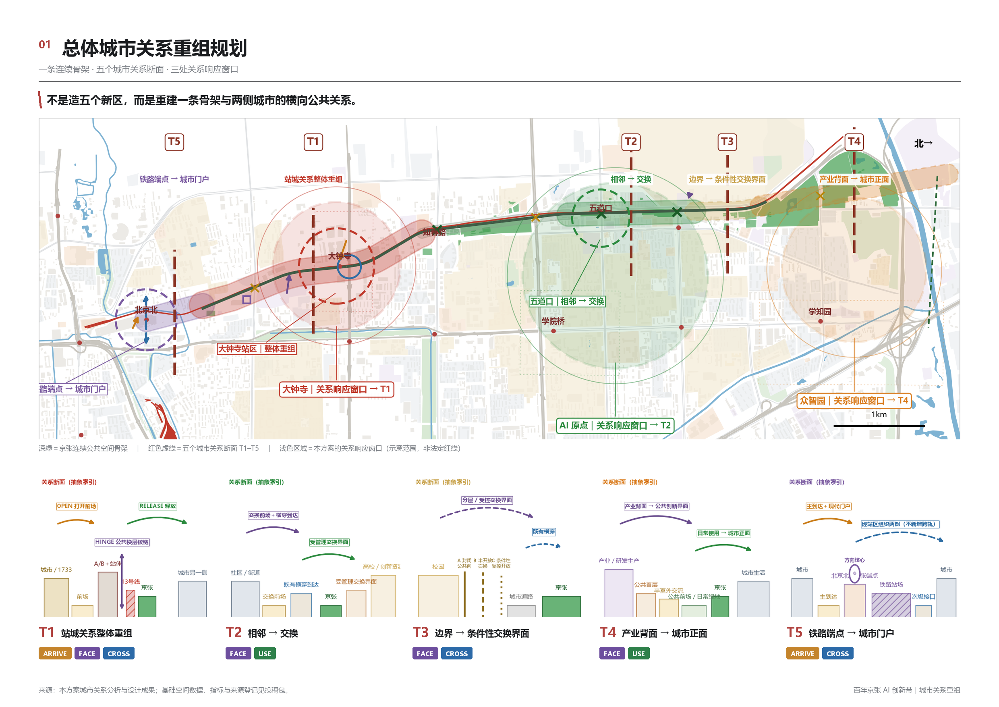
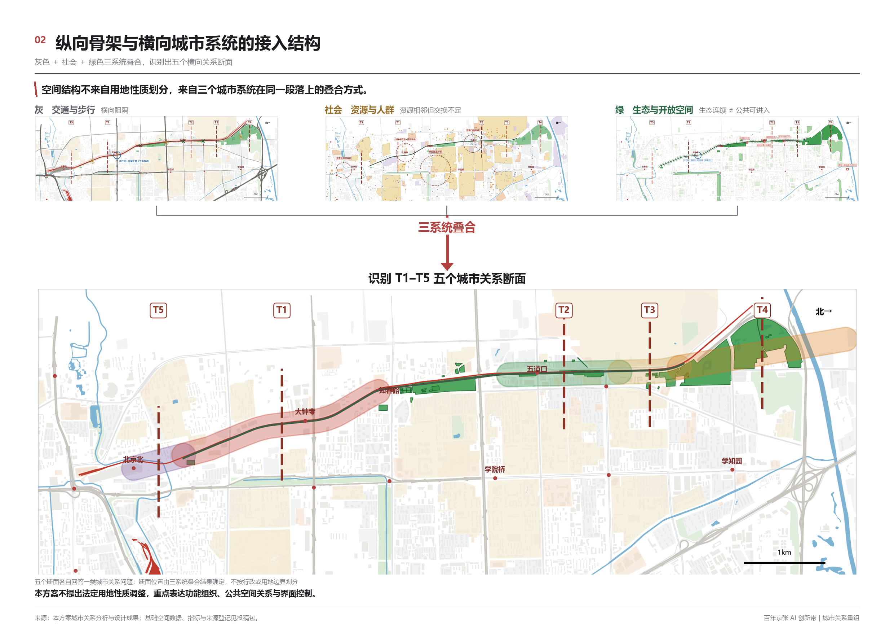
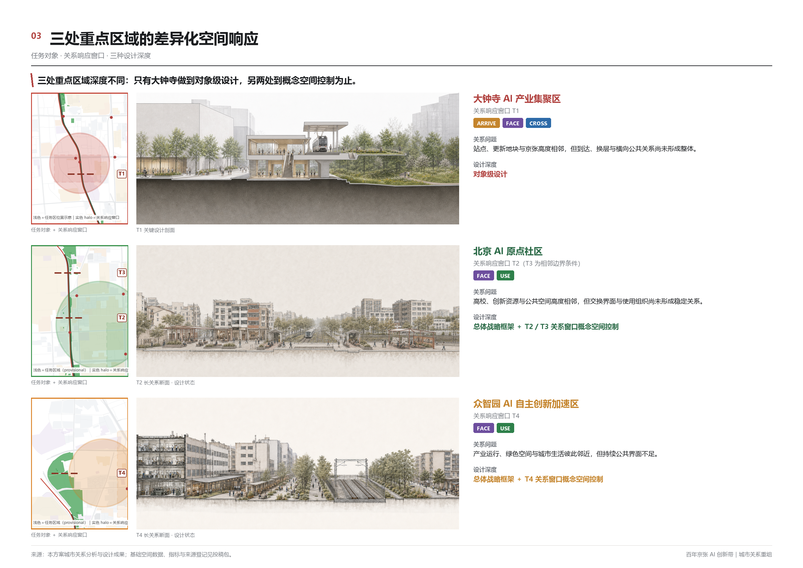
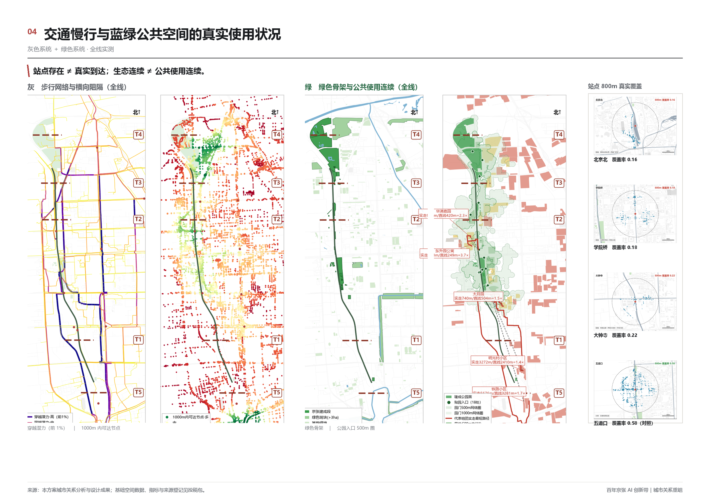
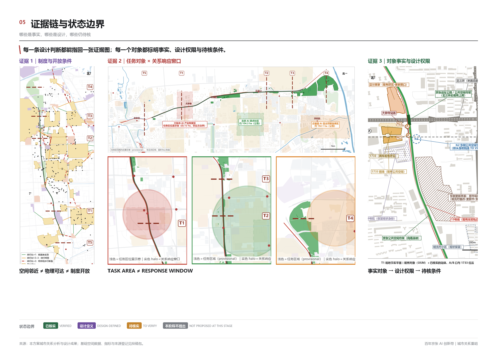

# 京张关系带：以城市关系重组回应百年京张AI创新带

**一句话主张：** 京张沿线不缺资源、不缺绿地、不缺设施，缺的是这些系统与京张之间的关系；本方案把设计对象从"再造一个园区"改为"提高既有创新资源之间的交换条件"。

## 设计依据与资料清单

本方案的第一依据是北京市规划和自然资源委员会海淀分局发布的《百年京张AI创新带城市设计国际方案征集资格预审公告》，第二依据是仓库内经维护者登记的面向智能体任务书 [source:OFFICIAL-ANNOUNCEMENT] [source:AGENT-TASKBOOK]。公告确定三层范围、三处重点区域和成果深度；任务书补充十条共创原则、三大定位、五大功能、三区两翼与 agent.1–agent.6 六项必答任务，并规定所有空间落地建议只能表述为概念建议、参考方案或可供专业团队深化研究。

截至提交时，组织方尚未公开官方红线、三处重点区域精确 polygon、控规地块指标、道路红线与市政条件。本方案因此使用仓库提供的临时粗略边界作为唯一空间范围来源 [source:BOUNDARY-SOURCE]，并在正文、几何、指标、图纸与展示页中一律标注 `official_boundary=false`、`geometry_role=provisional_constraint`、`boundary_precision=provisional_rough`。这一数据缺口按公告与投稿规则不阻断内容评分，但它决定了本包中所有面积与比例只能是低置信度设计模型值 [depth:existing_conditions_diagnosis]。

组织方提供的临时粗略边界与京张走廊事实轴线存在明显偏移，因此本包中与廊道相关的 geometry 和比例仅按临时边界内部分复算。两套来源均保留原始位置，不人为修正；由此得到的公共空间比例只代表临时边界口径下的概念设计模型值。官方红线或精确几何发布后，相关图层与指标须整体复算 [source:BOUNDARY-SOURCE]。详细线长、覆盖跨度和偏移量见 `assumptions.json`、空间 QA 与指标方法文件。

现状底层来自 OpenStreetMap 的一次性冻结导出，逐要素保留 `osmid`，用于识别现状建筑、道路、轨道、绿地与水体 [source:DATA-SRC-OSM-JINGZHANG-BASE]。开放地图只能作为背景资料，不能升级为道路红线、用地边界或法定控制线。设计内容本身来自参赛方自有的城市关系断面分析：五个断面的问题定义、四类关系机制、三系统诊断与大钟寺段深化 [source:MAINLINE-RELATION-ANALYSIS]。

*图 1．总体概念与证据结构。虚线为临时粗略边界，不是官方红线。*

资料使用边界按仓库登记表执行 [source:SOURCE-REGISTRY]：formal 结论只能来自已批准的 formal 可用资料或另有清权附件；背景资料不支撑空间控制结论；provisional 资料只支撑临时生成、可视化与讨论。本方案的自采资料（OSM 冻结层、现场影像、公开案例）全部记录在 `sources.json`，并按用途分级；未登记进中央表的自采源不据此声称已获批准。

## 三层范围工作框架

公告的三层范围在本方案中不是三张分辨率不同的图，而是三个不同的问题层级。**统筹研究范围**（约 43.6 平方公里）回答"AI 创新资源之间的交换条件是什么"；**总体设计范围**（约 11.4 平方公里，本包提交边界）回答"这些交换条件在京张沿线的空间上如何组织"；**重点区域范围**（三处共约 368.4 公顷）回答"在具体地段上，这套组织方式能不能落到真实对象上" [data:geometry/site_boundary.geojson#SITE-001] [metric:site_area_sqm]。

三层之间的传导由一个统一工作单元完成：**城市关系断面（Urban Relation Transect）**。在沿线典型位置切出横向的关系单元，观察两侧城市系统与京张之间的到达、面向、穿越、使用四类关系，判断哪些关系已经建立、哪些缺失、哪些属于条件未定。本方案在 9 公里走廊上确定五个断面 T1–T5 [metric:urban_relation_transect_count]，它们不是五个设计点，而是五种不同的关系情境。

*图 2．三层范围传导与概念性用地结构。*

本包提交的 `geometry/site_boundary.geojson` 对应总体设计范围，`geometry/key_areas.geojson` 对应三处重点区域，两者均为临时粗略边界 [depth:three_level_scope_framework]。统筹研究范围的临时 polygon 未纳入本包提交图层，其研究结论以正文与图纸表达，避免把研究范围误读为设计范围。

## 统筹研究范围产业与未来城市研究

统筹研究范围的核心判断是：**沿线创新资源已经高度集聚，但资源之间的公共交换界面与日常联系条件仍然薄弱。** 高校院所（策源）、中试与科技服务机构（转化）、产业园区（承载）三类空间沿线俱全且相互邻近，但相互之间的公共空间联系与日常交换界面薄弱，联系更多依赖机构内部渠道而不是城市空间 [source:MAINLINE-RELATION-ANALYSIS] [depth:overall_spatial_structure]。

由此得到本方案对"世界级 AI 创新生态"的定义方式：**AI 创新带不是重新造一个产业园，而是通过公共空间和城市关系，提高已有创新资源之间的交换条件。** 交换条件包括四项——能不能到（到达）、看不看得见（面向）、过不过得去（穿越）、用不用得上（使用）。这四项正是本方案的四类关系动作。

这一判断也回应任务书的三大定位与五大功能：百年京张文化带对应沿线历史线位与遗址公园的连续叙事；都市 AI 生活体验带对应可被市民日常使用的场景网络；AI 融合创新带对应策源—转化—承载之间的交换界面。三区两翼在空间上落位为：众智园对应 T4 段、AI 原点社区对应 T2 段、大钟寺对应 T1 段，中关村科技服务翼与小月河场景赋能翼作为横向接入关系而非新增地块 [source:AGENT-TASKBOOK]。

未来城市形态方面，本方案不提出新的城市形态口号，而提出一个可检验的形态判断：**适配 AI 新质生产力的城市形态，首先表现为跨系统交换的空间成本更低。** 检验方式是可复算的——站点实际步行腹地与理论腹地的比值、真实绕行倍数、公共空间入口密度、界面消极长度占比。这些量在本方案的诊断中均已实测。

### 五大功能对应关系（任务书五大功能 → 空间节点 → 运营机制 → 证据）

任务书列出的五大功能，在本方案中逐项对应到具体空间节点与运营机制。**凡属机制建议一律标注证据状态，不声称已具备。**

| 五大功能 | 空间节点 | 运营机制（建议） | 证据／指标 | 状态 |
| --- | --- | --- | --- | --- |
| AI 全栈自主创新体系 | 众智园（T4）面向廊道一侧 | 建议由园区运营方与院所协同，把中试与转化机构的界面显性化 | 策源—转化—承载三类空间沿线邻近的实测分布 | 概念建议 |
| 世界级 AI 创新生态 | AI 原点社区（T2 核心段；学院路段 T3 仅为相邻边界条件背景） | 建议以既有公共空间与校园边界的条件性开放承载交换 | 园缘设门段落约 13%、开放条件因校而异 | 概念建议 |
| AI+ 场景赋能新范式 | 廊道试点段与六处站前空间 | 场景开放目录＋统一申请规则，聚合口径、人工可停 | 12 张场景卡，其中 3 个测试验证场景 | 概念建议 |
| 智能化 AI 活力城市 | 京张遗址公园廊道全线 | 建议由公园管理方与街道协同，按时段组织使用 | 公园入口 21 个、五处结构断点中四处由交通设施造成 | 概念建议 |
| **AI 治理全球话语权** | T1 大钟寺节点＋廊道展示段 | **仅作为概念机制**：公共讨论与治理议题载体、开放论坛与展示节点、国际交流接口、AI 城市治理案例展示、公众参与与伦理讨论、场景治理经验公开 | 无本地既有证据 | **概念建议·待外部主体确认** |

**关于第五项必须讲清楚：** 本方案不声称已建立任何国际组织、全球治理平台或国际合作机制。这一项在空间上能承担的，只是**让治理议题有可讨论、可展示、可参与的公共场所**；机制本身须由主管部门与国际机构另行建立 [source:AGENT-TASKBOOK]。

### 区域创新协同关系矩阵（Regional Innovation Synergy Matrix）

京张走廊不是孤立的创新单元。下表逐项回应任务书提及的区域协同对象。**所有协同方式均为建议，无一已建立合作、已确定责任单位或已落实投资。**

| 协同对象 | 可交换要素 | 京张内部空间接口 | 建议协同方式 | 证据状态 |
| --- | --- | --- | --- | --- |
| 北纬社区 | 人才日常生活服务、社区场景 | T2 AI 原点社区的社区服务界面 | 建议建立社区级场景互认与服务共享路径 | 概念建议·待核实 |
| 未来科学城 | 科研机构、中试与转化能力 | T4 众智园面向廊道的转化界面 | 可作为「策源在此、转化在彼」的双向接口；建议以定期开放日与联合测试周承载 | 概念建议·待外部主体确认 |
| 怀柔科学城 | 大科学装置、基础研究成果 | T4 与 T1 的成果展示与公共解说节点 | 建议作为面向公众的成果展示接口，不涉及装置本身 | 概念建议·待外部主体确认 |
| 北京经开区 | 产业承载、产线与量产验证 | T4 的产业界面与低速设备测试路径 | 可作为「验证在此、量产在彼」的接口；建议由园区运营方与企业协同 | 概念建议·待外部主体确认 |
| 京津冀 | 区域交通可达、人才流动、区域场景 | T5 北京北端点门户的到达组织 | 建议以端点门户作为区域到达与信息接口；轨道能力本身属既有工程条件 | 概念建议·待核实 |

**边界声明：** 上表不构成任何跨区域合作协议、投资安排或责任分工。数据与算力两项要素**未列入本表可交换要素**——本方案没有可核验依据证明沿线具备这两项的对外交换条件，不作反推 [source:MAINLINE-RELATION-ANALYSIS]。

## 总体设计范围城市更新与控规深度城市设计

总体设计范围的诊断分三个系统展开，每个系统都完成"结构—性能—问题"三步。

**灰色基础设施：交通骨架连续，横向公共联系并不同步。** 13 号线与京张并行的共廊段、北三环与北四环快速路、北京北站场和高铁地面段，既是城市运行网络，也是主要的横向阻隔——支撑运行的设施与造成分割的设施是同一批。七处既有横穿按核实程度分为三类：三处步行可用、三处条件待核、北三环为京张上跨快速路的立体节点。实测显示，大钟寺站 800 米实际步行腹地只有理论范围的 22%，北京北为 16%；知春路两侧直线 180 米的两点，实际要绕行 7.2 倍距离；公园边缘约 27% 的长度紧贴车行道路，形成消极界面 [data:geometry/roads.geojson#ROAD-0001] [metric:road_segment_count]。

**社会基础设施：设施不少，错位发生在"真实步行"这一层。** 按 15 分钟生活圈口径，沿线服务设施总量并不匮乏，教育服务专项核查未发现新缺口（这是一个负结论，用于防止误判"沿线缺教育"）。真正的错位出现在步行网络上——部分隔轨居住区到最近公共空间的实际步行距离达到直线距离的三到四倍。高校方面，沿线高校与京张公共空间高度邻近，步行渗透在空间上完全可行；但园缘真正设门的段落仅约 13%，各校开放条件受预约、门禁、教学管理与产权状况影响，差异明显。**空间邻近、物理可达与制度开放并不等价。**

**绿色基础设施：生态连续，不等于公共使用连续。** 沿线部分区段已形成连续绿色骨架，但结构上的"连着"与使用上的"能进"是两回事。全线公园入口仅 21 个，五处结构断点中四处由交通设施造成。现状绿地与开敞空间占临时边界的比例为 6.71% [metric:green_ratio] [data:geometry/green_space.geojson#GREEN-001]，这一数字本身不低不高，关键在于其中有多少是真正可进入、可到达、可使用的。

三系统叠加后，本方案的更新总体框架是：**纵向是京张连续公共空间骨架，横向是五个差异化关系段与周边城市系统之间的关系重组。** 就业带、社区、校园、商圈经各自的到达、面向、穿越、使用关系接入同一条脊柱。其中 T1 站城关系段整体重组，T2 建成邻接段以运营激活为主，T3 高校边界段保持克制、仅设条件性受控交换，T4 产业界面段的命题是「产业背面 → 城市正面」，以面向与使用为主要机制，绿灰断点处的跨线通道接口只是条件性次级注记；T5 端点段的命题是「铁路端点 → 城市门户」，以既有北京北站区为方向核心组织到达与穿越，不新增跨轨工程。普通段明确"保持现状"也是规划决定；军事管理区等无需设计对象如实标注 [depth:overall_spatial_structure]。

需要说明的是：公告要求控规深度的城市设计，但控规地块控制线、指标与道路红线截至提交时均未公开。本方案因此把控规深度的响应限定为**结构性控制建议**——分区、界面、廊道宽度、公共空间连续性与到达组织，而不给出容积率、建筑高度与地块指标结论 [metric:floor_area_ratio] [depth:development_intensity_controls]。

## 重点区域详细设计

三处官方重点区域在本方案中的设计深度**不相同**，这一差异如实声明，不作平均包装。

本节所称「重点区域」是组织方公告的任务区（TASK AREA），本包以临时边界表达（`official_boundary=false`）。它不等同于本方案在图纸中识别的「关系响应窗口」（RESPONSE WINDOW）：后者是本方案按关系问题划定的重点设计位置，既不是任务范围，也不替代官方边界；两者在图纸中分层表达，不互相冒充。

**大钟寺 AI 产业聚集区（约 72.0 公顷，对应 T1 断面）——本方案唯一完成空间深化的重点区域。** 核心对象包括大钟寺站及 A/B 口、1733（原大钟寺市场地块）、13 号线地面线、京张公共空间跨北三环上跨段、北三环、蓝景地块、明光村回迁社区、36 号院及周边居住与医疗地块。本方案区分"事实"与"设计权限"：站体、轨道、桥梁为既有工程事实；更新地块界面属规划控制范围；桥下空间等状态未知对象如实标注，不预设为可利用空间。收敛后的设计问题是：**以既有京张跨三环公共空间和大钟寺站为骨架，重组 1733—A/B 口—站体—京张—两侧更新界面之间的到达、换层、面向与横向公共空间关系。** 深化内容包括连续到达带、两楼之间的通道、A/B 口集散袋、纵向穿行组织与站前阈值向南的连续释放。站城之间的竖向公共关系按「地面到达 → 站体两层公共换层 → 上层公共转换 → 13 号线站台与京张遗址公园平台」组织；各层精确标高与垂直交通设施待核实，本方案不虚构坡道、楼梯或电梯。本方案对大钟寺任务区的图面表达是围绕大钟寺站的位置示意（约 72 公顷，非官方边界），只用于定位阅读，不构成边界数据，也不替代本包 `key_areas.geojson` 中的临时边界。京张跨三环公共空间与 13 号线高架两套立体系统的相对高程无公开证据，本方案明确标注该项未核实，不预设桥下净空、坡道或地下通道几何 [data:geometry/key_areas.geojson#KEY-003] [depth:three_key_area_detailed_design]。

**众智园 AI 自主创新加速区（约 192.1 公顷，对应 T4 段）——概念级空间控制建议。** 该段的关系问题是：产业、绿色空间与日常生活空间相邻，各系统仍以自身运行为主，持续公共界面不足。该段命题为**「产业背面 → 城市正面」**，关系重点为面向与使用（FACE + USE）。概念建议为：**本方案不建议改变用地性质**，只提出功能方向与界面组织——以科研与中试转化为主导功能方向，把面向京张廊道的一侧由产业背面转为持续的城市正面；绿灰断点处的跨线通道接口仅作为条件性次级注记保留，其介入程度取决于跨线通道可行性研究结论 [data:geometry/key_areas.geojson#KEY-001]。

**北京 AI 原点社区（约 104.3 公顷，对应 T2 段）——概念级空间控制建议。** 该段命题为**「相邻 → 交换」**，关系重点为面向与使用（FACE + USE）；核心为 T2 成府路—五道口段，学院路段（T3）只作为相邻边界条件背景，不并入本区。该段的关系问题是：高校、创新资源与京张相邻，公共界面与使用组织尚未形成稳定交换；轨道与商业高强度叠加，横穿与停留空间不足。概念建议为：以既有高校、创新资源、社区与京张公共空间之间的交换关系为基础，以运营激活和界面组织为主要方式，补足日常服务与到达关系，并在既有横穿设施处组织停留与交换空间 [data:geometry/key_areas.geojson#KEY-002]。

*图 3．三处重点区域的定位差异与设计深度声明。三处深度不同，如实标注。*

**深度差异的说明：** 本方案选择在一处（大钟寺）把方法走完，而不是在三处各做三分之一。理由是：城市关系重组的有效性只能通过一处完整的对象级验证来证明；另两处在没有官方边界与控规条件的情况下，做到概念级空间控制建议已是可负责的上限。官方数据发布后，同一方法可直接向另两处展开。

### T2 与 T4 概念控制清单（不深化为 T1 同等深度）

应评审要求，为另两处重点区域各补一张**轻量概念控制清单**。这不是把 T2／T4 深化到 T1 的对象级深度，而是把「哪里优先、哪里不动、哪里有条件、哪里禁止预设、哪里需专业核查」讲清楚。

**T2　成府路—五道口（AI 原点社区，关系重点 FACE + USE）**

| 类别 | 内容 |
| --- | --- |
| 优先界面 | 高校与创新资源面向京张公共空间的一侧；既有横穿设施两端的停留空间 |
| 保持现状 | 轨道与商业高强度叠加段的既有运行组织；未出现关系问题的普通街区 |
| 条件性接口 | 校园边界的受控交换点——**取决于各校自行确认开放时段与规则** |
| 禁止预设 | 不假设新增未经核实的工程穿越；不预设校园产权与管理边界可变更 |
| 后续专业核查 | 既有横穿设施的实际通行能力；校方开放条件；商业段人流承载 |

**T4　众智园（关系重点 FACE + USE）**

| 类别 | 内容 |
| --- | --- |
| 优先界面 | 产业用地面向京张廊道的一侧；绿地与城市日常空间的交界段 |
| 保持现状 | 园区内部运行组织；未面向廊道的产业地块 |
| 条件性接口 | 绿灰断点处的跨线通道接口——**取决于专项可行性研究结论** |
| 禁止预设 | **不臆造园区内部产权或运营条件**；不预设企业配合意愿；不给跨线工程结论 |
| 后续专业核查 | 跨线通道可行性；绿地权属与管理主体；产业界面改造的实际条件 |

两张清单均为概念建议，可供专业团队深化研究 [data:geometry/key_areas.geojson#KEY-001] [data:geometry/key_areas.geojson#KEY-002]。

## AI 创新生态、人才画像与 AI+ 场景

### 全球 AI 与创新生态案例及可转化机制（agent.2）

本节选取六个可公开核验的国际创新区案例，每个案例只提取一条与本方案直接相关的可转化机制，不作规模、投资或产值比较。

| 案例 | 所在地 | 与本方案相关的机制 | 可转化到 | 核验来源（2026-08-31 访问） |
| --- | --- | --- | --- | --- |
| Kendall Square / MIT 周边 | 美国剑桥市 | 高校边界不是围墙而是可穿越的街区界面，实验室临街首层向城市开放 | T3 学院路段的条件性受控交换 | https://kendallsquare.org/ |
| Station F（Halle Freyssinet 改造，2017 开放） | 法国巴黎 | 单一大跨度既有工业建筑（1927 年货运站，2012 年列入历史建筑）内部形成"孵化—服务—展示"连续动线 | T1 的 1733 地块界面重构 | https://stationf.co/about |
| King's Cross Central 与 Knowledge Quarter | 英国伦敦 | 约 27 公顷废弃铁路用地转型中，先建成 10 处公共广场与 20 条街道，开发随后跟进 | 京张遗址公园廊道的时序逻辑 | https://www.kingscross.co.uk/about-the-development ；https://casestudies.uli.org/kings-cross/ |
| 22@ Barcelona（Poblenou，2000 年批准） | 西班牙巴塞罗那 | 约 200 公顷产业更新完全承载在既有 Cerdà 网格上，不新划园区边界 | 总体范围内"不新增园区边界"的策略 | https://en.wikipedia.org/wiki/22@ ；https://www.mdpi.com/2413-8851/4/2/16 |
| MaRS Discovery District（2005 年开放） | 加拿大多伦多 | 紧邻多伦多大学与 University Health Network，把"公共资助研究的转化"作为一种独立空间类型 | T4 众智园的转化界面 | https://www.marsdd.com/about/ |
| 서울 AI 양재 허브 Seoul AI Hub（良才，2024-05 主体设施启用） | 韩国首尔 | 以既有办公建筑（韩国教职员共济会大楼、Highbrand、熙庆大厦）改造承载 AI 企业与人才服务，避免新建 | AI 原点社区的运营激活路径 | https://english.seoul.go.kr/seoul-policy-archive/seoul-ai-hub/ |

*上表六条均于 2026-08-31 经公开来源核验，URL 见右列。本表只提取一条与本方案直接相关的机制，不作规模、投资或产值比较；引用不代表本方案已证明产业链运行机制。*

**共同机制提炼：** 上述案例共同表明，创新生态建设并不只依赖新划园区边界；既有城市结构中的界面开放、公共空间连续和转化机制同样关键。这与本方案关注"交换条件"的核心主张一致 [source:AGENT-TASKBOOK] [depth:overall_spatial_structure]。

### 八要素 AI 生态图谱（agent.2）

任务书要求回应土地、空间、产业、资金、人才、算力、数据、场景八类要素。下表逐项标注**当前证据等级**，区分「已有证据」「概念建议」「待外部确认」三态。**不得由案例或任务书反推出本地已具备。**

| 要素 | 落位（三区两翼） | 本方案能说什么 | 状态 |
| --- | --- | --- | --- |
| 土地 | 全走廊 | 不新划园区边界，用既有街区网格承载更新；用地建议为概念性结构判断 | 概念建议 |
| 空间 | 廊道＋三处重点区＋五断面 | 公共空间骨架、界面与到达组织；有实测支撑（腹地比、绕行倍数、入口数、消极界面占比） | **已有证据** |
| 产业 | 众智园（T4）、大钟寺（T1） | 策源—转化—承载三类空间沿线邻近但公共交换界面薄弱 | **已有证据**（空间邻近性），机制层为概念建议 |
| 资金 | — | **本方案不作判断。** 无公开可核验依据 | 待外部确认 |
| 人才 | 学院路段（T3）、AI 原点社区（T2） | 高校与创新资源高度邻近；园缘设门段落约 13%、开放条件差异明显 | **已有证据**（空间与制度层） |
| 算力 | — | **本方案不作判断。** 无公开可核验依据 | 待外部确认 |
| 数据 | 廊道试点段 | 只能说公共空间中可布设聚合口径的环境感知，且须公示与人工可停 | 概念建议 |
| 场景 | 全线节点＋T4 测试路径 | 12 张场景卡与 3 个测试验证场景，均为概念或条件性 | 概念建议·条件性 |

**必须明确的一条：** 资金、算力、数据、测试场景四项，任务书列为生态要素，但**本方案没有任何本地证据证明其当前已具备**。把国际案例或任务书表述反推成"本地已有"是不成立的，故上表对这四项分别标注「待外部确认」或「概念建议」。

**评审点名要求的五类要素 × 三区两翼映射**（资金、人才、算力、数据、测试场景）：

| 要素 | 众智园（T4） | AI 原点社区（T2） | 中关村科技服务翼 | 小月河场景赋能翼 |
| --- | --- | --- | --- | --- |
| 资金 | 待外部确认 | 待外部确认 | 待外部确认 | 待外部确认 |
| 人才 | **已有证据**：与学院路高校带邻近，园缘设门段落约 13% | **已有证据**：高校与创新资源高度邻近 | 概念建议：作为要素全链服务的横向接入关系，不新增地块 | 概念建议：以公共体验路径承载人才日常使用 |
| 算力 | 待外部确认 | 待外部确认 | 待外部确认 | 待外部确认 |
| 数据 | 概念建议：低速设备测试路径的聚合口径日志 | 概念建议：社区场景的聚合口径，须公示且人工可停 | 概念建议：作为数据治理规则的服务接口 | 概念建议：公共空间环境感知的聚合监测 |
| 测试场景 | **条件性**：S09 低速配送与服务机器人测试路径 | 概念建议：S06 开发者开放日的公共空间 | 概念建议：S12 场景开放目录的申请与规则入口 | **条件性**：S10 公共空间环境感知试点段 |

**两翼的处理口径必须讲清楚：** 中关村科技服务翼与小月河场景赋能翼在本方案中**是横向接入关系，不是新增地块**——它们提供的是服务规则与场景承载，不占用京张走廊内的用地。**资金与算力两行整行为「待外部确认」，不是遗漏**：本方案没有任何本地可核验依据证明这两项在四个位置中的任何一处已具备对外交换条件，按证据纪律不作反推 [source:AGENT-TASKBOOK]。

**产业—空间—要素关系（不改变城市关系断面主线）：** 要素不是独立图层，而是通过四类关系动作接入同一条脊柱——人才靠 ARRIVE 与 FACE 接入（能到、看得见），产业靠 FACE 与 USE 接入（有界面、用得上），场景靠 CROSS 与 USE 接入（过得去、用得上）。土地与空间是这些关系的载体，资金、算力、数据是外部条件而不是本方案的空间结论 [depth:overall_spatial_structure]。

### 五类用户画像（agent.3）

| 画像 | 主要需求 | 活动时间 | 典型路径 | 空间障碍 | 可获得的服务 |
| --- | --- | --- | --- | --- | --- |
| 跨轨通勤者 | 从站点快速到达工作地 | 07:00–09:30 / 17:30–19:30 | 轨道站→横穿设施→就业带 | 站点实际腹地仅为理论值的 16%–22%，绕行显著 | 连续到达引导、站前集散、实时换乘信息 |
| 高校学生与研究生 | 校园与城市之间的日常往返与非正式交流 | 全天，夜间活跃 | 校门→城市街道→公共空间 | 园缘设门段落约 13%，开放条件因校而异 | 条件性受控交换界面、开放时段公示、自习与展示空间 |
| 科研与转化人员 | 与企业、中试机构的低成本见面 | 工作日日间 | 院所→转化机构→企业 | 策源—转化—承载三类空间邻近但缺公共交换界面 | 转化界面节点、可预约会面空间、开放实验展示 |
| 创业者与开发者 | 找到人、找到场景、找到验证条件 | 不规则，含周末 | 孵化空间→公共展示→测试场景 | 场景开放缺乏统一入口与规则 | 场景开放目录、开发者活动、测试场景申请通道 |
| 沿线社区居民 | 日常服务与可用的公共空间 | 全天，早晚高峰外 | 住区→公共空间→服务设施 | 部分隔轨住区实际步行距离为直线距离三到四倍 | 公园入口加密、日常服务补足、无障碍连续路径 |

补充两类次要人群：**访客与游客**（关注京张历史叙事与可读的导视系统）、**活动组织者**（关注可承载展示与集会的公共空间与运营规则）。

### 公共利益与包容性补充（五类需要专门回应的使用者）

前述五类画像按需求与路径组织。下表补充五类在数字化城市场景中最易被忽略的使用者。**这些是设计与运营的要求，不是"现状已符合无障碍规范"的事实宣称。**

| 使用者 | 实体导视 | 人工服务 | 离线信息 | 无障碍连续通行 | 活动期间基本通行 | 不使用数字系统仍可用 |
| --- | --- | --- | --- | --- | --- | --- |
| 老年人 | 大字号、高对比、低位置标识 | 站前与公园入口设可求助岗位 | 纸质与固定牌面的时刻与路线信息 | 连续坡道与休息座椅间距 | 活动围合不得切断日常通行路径 | 全部场景须保留无须扫码的使用方式 |
| 儿童及照护者 | 低视高标识与图形化指引 | 可求助岗位＋集合点 | 固定牌面标注最近卫生间与饮水 | 推车可通行的连续路径 | 活动期间保留看护视线与集合点 | 不以注册为使用前提 |
| 行动障碍者 | 无障碍路线专门标识 | 可预约的到场协助 | 离线可取的无障碍路线图 | **连续**而非分段的无障碍路径，含站前接驳段 | 临时设施不得占用无障碍路径 | 不以 App 为通行必要条件 |
| 视听障碍者 | 触感与高对比导视、必要处盲道衔接 | 人工引导与手语／笔谈协助 | 语音与文字双通道的固定信息 | 路径连续且提示可感知 | 活动广播须有同步文字 | 提供非视觉／非听觉的替代方式 |
| 无智能手机用户 | 完整的实体牌面信息 | 现场人工问询 | 固定牌面即可获得全部必要信息 | 与其他人群同等的路径 | 活动信息在现场可读 | **所有 AI 场景必须可 opt-out，不使用数字系统仍能正常使用空间** |

**统一要求：** 上述六项在本方案中作为**设计与运营的前置条件**写入，任何 AI 场景若不能满足「digital opt-out」一项，即不应进入公共空间试点 [source:AGENT-TASKBOOK]。

### 十二张 AI 场景卡（agent.3）

以下场景全部从既有空间关系生长，不新增建筑群。字段统一为：场景名／用户／空间位置／触发条件／关系动作／空间支持／数字与 AI 支持／运营方式／隐私与安全边界／当前状态。

**S01 站城到达引导｜跨轨通勤者｜T1 大钟寺站 A/B 口至京张廊道｜出站人流高峰｜ARRIVE｜连续到达带与集散袋｜到达路径动态提示（仅聚合客流，不识别个人）｜建议由站点运营方与街道协同｜不采集人脸、不做个体追踪｜concept**

**S02 站前阈值时段管理｜通勤者与周边居民｜T1 站前广场｜早晚高峰与非高峰切换｜ARRIVE / USE｜可分时使用的站前空间｜时段占用状态显示｜建议由街道与物业协同｜仅统计空间占用率｜concept**

**S03 桥区公共性激活｜居民与访客｜T1 北三环上跨段桥区｜工程条件核实通过后｜CROSS｜桥区空间的照明、坐憩与引导｜环境感知与安全提示｜建议由市政与公园管理方协同｜环境数据不含个人信息｜conditional（依赖桥下净空与结构条件核实）**

**S04 高校界面条件性开放｜学生与市民｜T3 学院路段校园边界｜学校确认开放时段与规则后｜FACE / CROSS｜受控交换界面与开放时段标识｜开放状态实时公示｜建议由高校与街道协同｜不接入校园门禁个人数据｜conditional**

**S05 转化界面会面点｜科研与转化人员｜T4 众智园面向廊道一侧｜双方均登记意向后｜FACE / USE｜可预约的半开放会面空间｜供需匹配（自愿登记，非强制）｜建议由园区运营方参与｜自愿参与、可随时退出｜concept**

**S06 开发者开放日｜创业者与开发者｜T2 AI 原点社区公共空间｜季度性活动窗口｜USE｜可临时改变布置的公共空间｜活动信息与报名（本地化处理）｜建议由社区与企业协同｜报名信息不与其他系统关联｜concept**

**S07 日常服务补足指引｜社区居民｜隔轨住区至最近公共空间｜居民日常出行｜ARRIVE / USE｜加密的公园入口与连续路径｜步行路径建议（不记录轨迹）｜建议由街道与公园管理方协同｜不保存个人出行记录｜concept**

**S08 遗产叙事解说｜访客与游客｜京张廊道全线节点｜访客到达节点｜USE｜导视与解说装置｜多语种解说与历史图层叠加｜建议由文化主管部门与公园管理方协同｜不采集访客身份｜concept**

**S09 低速配送与服务机器人测试｜企业与运营方｜T4 众智园内部道路与廊道段｜取得测试许可后｜CROSS / USE｜可测试的连续路径与避让空间｜低速自主导航与人机避让验证｜建议由园区、企业与主管部门协同｜测试区域公示、可随时人工接管｜**产业测试验证场景 · conditional**

**S10 公共空间环境感知验证｜企业与管理方｜京张廊道试点段｜设备与规则备案后｜USE｜可安装环境感知设备的公共空间段｜人流密度、噪声、微气候的聚合监测｜建议由公园管理方与企业协同｜仅聚合数据、不做个体识别、结果公示｜**产业测试验证场景 · conditional**

**S11 站点接驳算法验证｜运营方与研究机构｜T1 与 T5 站点接驳段｜与运营方达成数据口径后｜ARRIVE｜可观测的接驳路径与候车空间｜接驳时耗与换乘可靠性验证｜建议由轨道运营方与研究机构协同｜使用脱敏聚合客流，不接入个人票务数据｜**产业测试验证场景 · conditional**

**S12 门户识别与到达组织｜通勤者与访客｜T5 北京北站东西两侧｜端点门户改造窗口期｜ARRIVE / CROSS｜连续公共空间与可识别界面｜到达信息与方向引导｜建议由站区管理方与区级部门协同｜不采集个人信息｜concept**

十二张场景卡中包含三个明确的产业测试验证场景（S09、S10、S11），满足任务书不少于 10 张场景卡、不少于 3 个测试验证场景的要求 [source:AGENT-TASKBOOK]。

**统一隐私与人工复核边界：** 全部场景禁止人脸识别、个体追踪与非公开数据接入；所有涉及公共空间的数据处理只使用聚合口径并公示；任何自动化判断都必须保留人工复核与随时停止的通道。**这些场景是概念建议，不是已批准运营安排。**

### 三个产业测试验证场景的最小验证协议（agent.3）

S09、S10、S11 三个测试场景各自的最小验证协议如下。**三者均为 concept / conditional pilot，均未发生，均未取得数据许可。**

| 字段 | S09 低速配送与服务机器人测试 | S10 公共空间环境感知验证 | S11 站点接驳算法验证 |
| --- | --- | --- | --- |
| 待验证假设 | 在既有连续路径上，低速设备能否在不挤占行人通行的前提下完成往返 | 聚合口径的环境感知能否反映公共空间的实际使用强度分布 | 站点到目的地的接驳组织改善后，换乘时耗与可靠性是否变化 |
| 允许的数据字段 | 设备自身位姿、避让事件计数、路径占用时长 | 人流密度（聚合）、噪声、微气候 | 脱敏聚合客流、时耗分布 |
| 数据来源与等级 | 企业自有设备日志（第三方，待授权） | 现场设备（待备案） | 轨道运营方（**尚未取得，待外部确认**） |
| 当前基线 | **UNKNOWN**（无既有测试记录） | **UNKNOWN**（无既有监测点） | 已知：大钟寺站实际步行腹地为理论值 22%、北京北 16%（本方案实测） |
| 成功判据 | 全程零挤占行人事件，且人工接管次数低于约定阈值 | 监测结果与现场人工计数在同一量级 | 时耗与可靠性较基线有可测量改善 |
| 失败判据 | 出现挤占行人或需频繁人工接管 | 监测结果与人工计数量级不符 | 无可测量改善，或数据不足以判断 |
| 人工接管条件 | 任何行人冲突风险、任何设备异常 | 任何设备故障或数据异常 | 全程无自动控制，仅为观测 |
| 停止条件 | 出现安全事件即全面停止 | 出现个体可识别风险即停止 | 数据口径不能达成一致即停止 |
| 隐私与授权边界 | 禁止人脸识别与个体追踪；测试区域公示 | 仅聚合数据、不做个体识别、结果公示 | 仅脱敏聚合，不接入个人票务数据 |
| 结果公开方式 | 测试结论与失败情况一并公开 | 监测方法与结果同时公开 | 方法、口径与结论公开 |

**三条共同边界：** ① 任何未取得的数据许可**不得写成现状**；② 试点均未发生，不得表述为已实施；③ 任何自动化判断都保留人工复核与随时停止的通道。

## 用地、建筑规模与拆改留方案

本包提交的 `land_use.geojson` 是覆盖临时边界的**概念性用地结构建议**，共 11 个分区，完整覆盖临时 site_boundary，覆盖残差 0.111 平方米 [metric:land_use_cell_count] [metric:land_use_coverage_gap_sqm] [data:geometry/land_use.geojson#LU-001]。分区逻辑不是重新划分地块，而是把本方案的关系框架落到面上：一条京张遗址公园活力带（公园绿地）、三处重点区域（分别以科研、居住、商业服务业为主导）、五个断面段各分东西两侧的城市街区。每个分区都记录了该段已诊断的关系问题与 OSM 现状主导用途，便于评审对照。

**用地代码依据自然资发〔2023〕234 号数字代码子集，为概念判断，不构成法定用地调整结论，也不对应具体地块** [standard:MNR-LAND-USE-CLASSIFICATION-GUIDE] [depth:land_use_layout]。

建筑方面，本包提交的 `buildings.geojson` 为 1591 个现状建筑基底，基底面积合计约 193.8 公顷 [metric:building_footprint_area_sqm] [metric:existing_building_count] [data:geometry/buildings.geojson#BLDG-0001]。它们全部标注为 `existing_condition` / `existing_retained`，**只表达现状形态，不含任何拆改留判定**。

**拆改留：本方案不给出拆改留结论。** 理由是可核验的：地块权属、房屋性质、征收政策与企业入驻情况均非公开数据 [depth:retain_renovate_demolish]。本方案给出的是拆改留的**判定条件**而非判定结果——凡是与京张形成新到达、新面向、新穿越关系的界面段，应在官方数据发布后优先进入更新评估；其余段落默认保持现状。同理，开发强度与建筑高度体量风貌一律保持待定 [metric:building_height_limit_m] [depth:height_massing_character]：本方案只提出界面控制原则（面向京张一侧的首层公共性、界面连续性与消极界面消除），不提出高度与容积率数值。

## 交通、轨道、市政与公共服务设施

`roads.geojson` 提交 311 段线要素，其中 310 段为 OSM 现状快速路、主干路、次干路与支路中心线，1 段为概念性的京张遗址公园南北连续慢行主廊道 [metric:road_segment_count] [data:geometry/roads.geojson#ROAD-0311]。**OSM 中心线不是道路红线，本方案不提出任何工程线位结论** [depth:traffic_rail_slow_parking]。

交通与轨道的设计响应集中在三点。**其一，到达组织。** 站点实际步行腹地远低于理论腹地（大钟寺 22%、北京北 16%），说明问题不在站点密度而在站点与城市之间的连续引导。响应方式是连续到达带、站前集散空间与方向引导，而不是新增站点。**其二，穿越组织。** 七处既有横穿按核实程度分三类，本方案只把已核实可用的横穿设施转化为公共联系节点，**不默认新增未经验证的工程穿越**；北三环处采用既有京张上跨段，不新增跨线工程。**其三，慢行连续。** 公园边缘约 27% 的长度紧贴车行道路形成消极界面，响应方式是界面重构与路径改线，属直接空间设计范畴。

停车方面，本方案不提出停车配建指标（依赖控规条件），只提出原则：站点周边以接驳与非机动车停放为优先，避免以停车供给替代到达组织。

市政与新型基础设施方面，管线、容量与能源负荷均属专业测算范畴且数据不公开，本方案不作结论 [depth:municipal_new_infrastructure]。新型基础设施的空间响应限于：公共空间中可安装环境感知设备的段落、可支持低速自主设备测试的连续路径、以及站点与公共空间中的信息发布界面。这些均为概念性空间预留建议，**不构成设备选型、供应商指定或工程实施安排**。

公共服务设施方面，诊断结论是"设施不少、错位在真实步行这一层"，因此响应不是补设施，而是补路径：加密公园入口、消除隔轨住区的绕行、把服务设施与公共空间的连接从直线距离改为真实步行距离来校核。

## 蓝绿空间、公共空间与城市风貌

`green_space.geojson` 提交 79 处现状绿地与开敞空间，合计约 76.5 公顷，占临时边界 6.71% [metric:green_ratio] [metric:green_space_area_sqm]。`public_space.geojson` 提交 7 个概念性公共空间控制带，合计约 104.4 公顷，占临时边界 9.14% [metric:public_space_ratio] [data:geometry/public_space.geojson#PUBLIC-001]。两个数字必须分开读：前者是现状统计，后者是概念控制带的量级建议，不是已建成公共空间。

蓝绿系统的核心判断是**生态连续不等于公共使用连续**。全线公园入口仅 21 个，五处结构断点中四处由交通设施造成。因此绿色基础设施的更新重点不是继续增加绿色面积，而是把已有生态骨架转化为可进入、可到达、可使用的公共空间系统 [depth:blue_green_public_space]。

公共空间骨架由两部分构成：京张遗址公园廊道（概念控制带 ±120 米）与六处站前到达空间（160–260 米半径的概念控制带）。廊道承担穿越与使用两类关系动作，站前空间承担到达关系动作。**这些控制带是概念性量级建议，不是法定公共空间控制线。**

城市风貌方面，本方案不提出风貌分区与建筑形式规定（缺乏控规与高度条件）。提出的是**界面原则**：面向京张一侧的界面应可读、连续、有首层公共性；背对京张的消极界面应在更新窗口期优先处理；军事管理区等无需设计对象如实标注、不作风貌要求 [standard:MOHURD-URBAN-DESIGN-MEASURES] [depth:height_massing_character]。

*图 4．交通慢行与蓝绿公共空间连续性，叠加 AI 场景节点位置。*

### AI 公共空间与三个朝圣地标（agent.4）

任务书要求不少于 3 个 AI 朝圣地标。本方案的立场是：**地标不等于必须新建地标建筑。** 三个地标全部由既有城市关系节点升级而来，可以是公共空间节点、交互装置、展示系统、数字导视、事件空间或门户识别系统。

**地标一：大钟寺站城交换节点（T1）。** 为什么在这里——这是全线唯一多类问题在同一段叠合的位置，也是本方案唯一完成深化的地段。服务谁——跨轨通勤者、周边居民、访客。空间作用——把站体、1733、京张公共空间与两侧更新界面组织成一个可读的到达序列。AI 体验作用——站城到达引导与站前阈值时段管理的展示窗口。是否需要建筑——不需要新建标志性建筑，以公共空间组织与界面重构为主。现阶段状态——概念建议，依赖 1733 与蓝景地块的更新窗口。

**地标二：北京北—京张南端门户节点（T5）。** 为什么在这里——京张的南端点与城市门户，站场与铁路设施造成东西向分隔，端点尚未形成连接两侧城市、组织到达的门户节点。服务谁——到站旅客、东西两侧居民、访客。空间作用——命题为「铁路端点 → 城市门户」（ARRIVE + CROSS），以既有北京北站区为方向核心组织到达，并在既有穿越条件下组织两侧联系，不新增跨轨工程。AI 体验作用——门户识别与到达信息界面。是否需要建筑——门户形象可由公共空间、可识别界面与标志性节点承担，不预设新建建筑。现阶段状态——概念建议，**不假设新增未经核实的工程穿越**。

**地标三：众智园创新交换节点（T4）。** 为什么在这里——策源—转化—承载三类空间在此邻近但缺公共交换界面，是"提高交换条件"这一主张最直接的验证位置。服务谁——科研与转化人员、创业者、园区就业人群、周边居民。空间作用——把面向京张廊道的一侧组织为持续公共界面。AI 体验作用——转化界面会面点与低速设备测试路径的展示。是否需要建筑——以既有建筑首层界面改造与公共空间组织为主。现阶段状态——概念建议；界面组织不以跨线工程为前提，跨线通道接口仅为条件性次级注记。

**荣誉展示体系与公共空间组件库：** 建议在廊道沿线设置统一规格的展示位（贡献者与开源成果展示）、可变布置的活动平台、标准化坐憩与遮蔽组件、以及统一的导视构件。组件库的意义是让分散的小规模介入保持整体识别度，**属概念性组件方向，不含具体产品与供应商指定**。

## 更新项目清单、实施政策与分期计划

本方案的更新项目清单按**关系动作**而非按地块组织，共 12 项。每项标注关系动作、干预方式（直接空间设计 DIRECT DESIGN／规划控制 PLANNING CONTROL／管理运营 MANAGEMENT-OPERATION）与证据状态（已核实／待核实／未知）。

| 编号 | 项目 | 断面 | 关系动作 | 干预方式 | 证据状态 |
| --- | --- | --- | --- | --- | --- |
| P01 | 大钟寺站前连续到达带 | T1 | ARRIVE | 直接空间设计 | 已核实 |
| P02 | 1733 面向京张界面重构 | T1 | FACE | 规划控制 | 待核实（更新窗口） |
| P03 | 北三环桥区公共性组织 | T1 | CROSS | 直接空间设计 | 待核实（工程条件） |
| P04 | A/B 口集散袋与纵向穿行 | T1 | ARRIVE / CROSS | 直接空间设计 | 已核实 |
| P05 | AI 原点社区日常服务补足 | T2 | USE | 管理运营 | 已核实 |
| P06 | 五道口既有横穿处停留空间 | T2 | CROSS / USE | 直接空间设计 | 待核实 |
| P07 | 学院路高校条件性受控交换界面 | T3 | FACE / CROSS | 规划控制＋管理运营 | 待核实（各校开放条件） |
| P08 | 众智园面向廊道公共界面 | T4 | FACE | 规划控制 | 待核实 |
| P09 | 绿灰断点跨线通道条件性接口预留 | T4 | CROSS | 规划控制 | 未知（依赖可行性研究） |
| P10 | 北京北端点门户到达组织 | T5 | ARRIVE / CROSS | 直接空间设计＋规划控制 | 待核实 |
| P11 | 公园入口加密与消极界面消除 | 全线 | ARRIVE / USE | 直接空间设计 | 已核实 |
| P12 | 场景开放目录与运营规则 | 全线 | USE | 管理运营 | 概念建议 |

**分期建议**（`phasing.geojson`，三期）[metric:phase_count] [data:geometry/phasing.geojson#PHASE-001] [depth:phasing_implementation]：一期以京张廊道与到达界面为先，恢复 ARRIVE 与 USE 两类关系；二期以三处重点区域为单元，补强 FACE 与 CROSS；三期在五个断面段的街区侧逐步补足日常服务、公共界面与慢行连接。**分期是按关系动作优先级排列的概念时序建议，不构成开发时序、投资安排或审批时间表** [depth:renewal_project_list]。

实施政策方面，本方案不提出资金、土地或审批政策结论。提出的是三条工作原则：**待核实事项一律虚线表达、不预支实施承诺**；**"保持现状"也是明确的规划决定**；**官方控规与红线发布后，全部图层与指标整体复算而不是局部修补**。

### P01–P12 的实施字段（轻量，不新增图纸）

上表 12 项行动各自补充实施字段。**「角色」一律为建议的角色类别，不指向任何具体单位、企业或高校；本方案不声称任何主体已确认参与。**

| 编号 | 当前基线 | 下一阶段可交付物 | 建议牵头角色类别 | 建议协同角色类别 | 前置依赖 | 可核验指标 | 当前不做 |
| --- | --- | --- | --- | --- | --- | --- | --- |
| P01 | 站口与廊道间无连续引导 | 到达带方案图与断面 | 规划统筹 | 交通专业、景观专业 | 站前用地边界核实 | 站点实际步行腹地占理论值比例 | 站体本身改造 |
| P02 | 界面背对京张 | 界面控制导则 | 规划统筹 | 景观专业、园区运营 | 更新窗口与权属核实 | 面向廊道的连续界面长度 | 建筑单体设计 |
| P03 | 桥区公共性未组织 | 桥区空间概念方案 | 景观专业 | 交通专业、市政专业 | **桥下净空与结构条件核实** | 桥区可停留面积、照度 | 任何桥梁结构改动 |
| P04 | A/B 口集散不足 | 集散与穿行组织图 | 交通专业 | 规划统筹 | 站口客流实测 | 高峰集散时耗 | 新增站口 |
| P05 | 日常服务与真实步行错位 | 服务补足清单 | 运营团队 | 规划统筹 | 社区意见征询 | 住区到公共空间实际步行距离 | 新建设施 |
| P06 | 横穿处无停留空间 | 停留空间概念方案 | 景观专业 | 交通专业 | 既有横穿通行能力核实 | 停留面积与使用时段 | 新增穿越工程 |
| P07 | 校园开放条件差异大 | 条件性交换界面导则 | 规划统筹 | 高校协同、运营团队 | **各校确认开放时段与规则** | 开放界面段落长度与时段 | 改变校园产权 |
| P08 | 产业界面未面向廊道 | 界面优先段清单 | 规划统筹 | 园区运营、景观专业 | 园区意愿与权属核实 | 面向廊道的公共界面长度 | 园区内部改造 |
| P09 | 绿灰断点未连接 | 接口预留条件说明 | 交通专业 | 规划统筹、市政专业 | **跨线通道专项可行性研究** | 是否具备预留条件（是/否） | 任何跨线工程方案 |
| P10 | 端点门户未组织到达 | 门户到达组织概念方案 | 规划统筹 | 交通专业、景观专业 | 站区管理边界核实 | 东西两侧公共空间连接段长度 | 新增工程穿越 |
| P11 | 入口 21 个、消极界面约 27% | 入口加密与界面改造清单 | 景观专业 | 运营团队 | 绿地权属与管理主体核实 | 公园入口数量、消极界面占比 | 增加绿地面积 |
| P12 | 场景开放无统一入口 | 场景开放目录与规则草案 | 运营团队 | 数据治理团队、规划统筹 | 数据与隐私规则确认 | 目录条目数、申请响应时长 | 场景实际部署 |

**角色类别口径：** 规划统筹／交通专业／景观专业／运营团队／高校协同／园区运营／数据治理团队／市政专业。**以上均为专业角色类别，不是已确定的责任单位。**

### 年度活动体系与长期运营（agent.6）

| 时段 | 活动 | 空间 | 人群 | 建议协同主体 |
| --- | --- | --- | --- | --- |
| 3 月 | 京张开放日（廊道全线徒步与解说） | 京张廊道全线 | 市民、访客 | 建议由公园管理方与文化主管部门协同 |
| 4 月 | 高校开放周（条件性受控交换界面试运行） | T3 学院路段 | 学生、市民 | 建议由沿线高校与街道协同 |
| 5 月 | 开发者与学生创新活动 | T2 AI 原点社区 | 开发者、学生 | 建议由社区、企业与高校协同 |
| 6 月 | 产业测试周（S09/S10/S11 三类测试场景集中开放） | T4 众智园、廊道试点段 | 企业、研究机构 | 建议由园区运营方与主管部门协同 |
| 9 月 | 公共体验季（场景开放目录集中展示） | 全线场景节点 | 市民、访客 | 建议由区级部门与运营方协同 |
| 10 月 | 京张历史文化活动（通车纪念叙事） | T1、T5 门户节点 | 市民、访客、学界 | 建议由文化主管部门参与 |
| 11 月 | 国际交流与成果发布 | T1 大钟寺节点 | 国际参与者、企业 | 建议由区级部门与国际机构协同 |
| 全年 | 社区参与与反馈（更新议题公开征询） | 沿线社区 | 居民 | 建议由街道与社区协同 |

**运营主体一律表述为"建议由……协同""可由……参与"，不构成已确定的承诺、审批或合作安排。** 长期运营机制包括三条：场景开放目录（统一入口与申请规则）、开发者社区的季度活动节律、以及成果与贡献的公开展示体系。招引转化路径的设计原则是：**先让人能到、能看见、能用上，再谈引进** [source:AGENT-TASKBOOK]。

**年度活动品牌层级（不做完整品牌设计）**

| 层级 | 定位 | 频次 | 对应上表 |
| --- | --- | --- | --- |
| 年度旗舰 | 京张开放日——全线可步行的公共活动 | 每年一次 | 3 月 |
| 专题／季度 | 高校开放周、公共体验季、历史文化活动 | 每季一次 | 4／9／10 月 |
| 开发者与社区 | 开发者与学生创新活动、社区参与与反馈 | 季度节律＋全年 | 5 月＋全年 |
| 测试与 demo day | 产业测试周（S09／S10／S11 集中开放） | 每年一次 | 6 月 |
| 公共参与 | 更新议题公开征询、成果展示 | 全年 | 全年＋11 月 |

**转化闭环（活动 → 开发者社区 → 场景开放 → 测试验证 → 成果展示 → 转化通道）：** 开发者与学生活动把人带到现场；场景开放目录把「能做什么」变成可申请的条目；产业测试周把申请变成三个测试场景的实际验证；成果展示把验证结果公开；国际交流与成果发布形成对外的转化通道。**闭环的每一环都只提供空间与规则，不承诺资金、落位或订单。**

**传播视觉方向（只写原则，不做 Logo 与效果图）：** 沿用京张关系带的识别——以关系断面（relation transect）为视觉语言，用线性、节点、断面三类图形要素构成；**避免堆砌 AI 科幻符号**（发光大脑、电路板、机器人、赛博网格一律不用）。视觉系统与文化标识系统分开设置。

**运营主体口径：** 上表全部主体均为**建议角色**，本方案不虚构任何已确认的承办单位、合作机构或资助方 [source:AGENT-TASKBOOK]。

## 指标体系、面积复算与合规矩阵

本包全部 known 指标由 `geometry/*.geojson` 在 EPSG:4548 下程序复算得到，未手工填写。核心指标为：总体设计范围面积 11,412,825.386 平方米 [metric:site_area_sqm]；现状绿地与开敞空间面积 765,414.283 平方米、绿地率 6.71% [metric:green_space_area_sqm]；概念性公共空间控制带面积 1,043,596.609 平方米、公共空间比例 9.14% [metric:public_space_area_sqm]；现状建筑基底面积 1,937,922.302 平方米 [metric:building_footprint_area_sqm]；重点区域数量 3 [metric:key_area_count]。

*图 5．指标证据链与自检状态。灰色为因官方数据缺口保持待定的指标。*

**待定指标及其原因如实声明**：容积率、建筑高度控制、拆改留地块数量三项保持 unknown，原因分别是官方控规容积率未公开、官方高度控制条件未公开、权属与征收政策非公开数据 [metric:floor_area_ratio] [metric:building_height_limit_m] [depth:metrics_recalculation]。**本方案不以设计模型值替代法定指标。**

合规响应由三个矩阵承载：`compliance_matrix.json` 覆盖公告 1.3、1.4、1.5 共 17 条与任务书 agent.1–agent.6 共 6 条，合计 23 条必选任务，每条记录支撑章节、图层、指标、图纸、展示页、来源、标准与自检项；`standard_matrix.json` 覆盖 6 项强制专业标准 [standard:PROJECT-OFFICIAL-ANNOUNCEMENT] [standard:MOHURD-CONTROL-DETAILED-PLANNING]；`design_depth_matrix.json` 覆盖 15 项核心成果深度项。

### 命名体系与视觉识别方向（agent.1）

**中文主名称：京张关系带。** **英文名称：JING–ZHANG RELATION BELT。** 副名沿用官方名称"百年京张AI创新带／Centennial Jing-Zhang AI Innovation Belt"，本方案名称是方法名而非替代官方名称。

**命名逻辑一句话：** 京张的价值不在于再增加一条带状用地，而在于把沿线已有的城市系统重新连成关系——所以叫"关系带"。

**Logo 与视觉识别方向（三条，只做概念方向，不做最终品牌设计）：**
1. **接入线型**——以一条连续纵向线与若干横向接入短线构成，直接对应"一条骨架＋多个横向接入"的空间结构；延展方式为横线数量随场景变化。
2. **断面切口**——以一个横向剖切符号表达"城市关系断面"这一工作单元，强调这是一种看城市的方法而不只是一个地名。
3. **叠合层**——以半透明的灰、社会、绿三层叠合表达三系统交互，交叠处即问题所在，对应本方案的诊断逻辑。

三条方向都避免使用铁轨、齿轮、大脑、芯片等直译符号。**字体、图片、商标与人物肖像均须在正式使用前完成授权，本方案不提交最终 Logo 成图。**

### 文化叙事与导视（agent.5）

文化叙事按三个时间层组织，**全部历史事实须以公开可核验来源为准，本方案不新增未经核实的史实陈述**。

**层一：百年京张铁路。** 1905 年 2 月詹天佑受清政府委任主持筑路，同年 5 月清政府批准始建，1909 年建成通车，是中国自主设计建造的第一条铁路干线 [source:SRC-HIST-JZ-BJWWJ] [source:SRC-HIST-JZ-NCSTI]。空间载体是地面线位、既有站点与遗址公园本身；叙事重点是这条线从工程遗产变成公共空间的过程。（说明：公开资料对通车日存在 1909 年 9 月 24 日与 10 月 2 日两说，本方案因此只写 1909 年通车，不采用单一精确日期。）

**层二：中关村创新史。** 1980 年 10 月 23 日，中国科学院物理研究所研究员陈春先与 6 名科技人员在北京市科学技术协会支持下成立北京等离子体学会先进技术发展服务部 [source:SRC-HIST-ZGC-CAS]。1983 年 1 月至 1988 年 4 月为「电子一条街」阶段，其范围自白石桥起沿白颐路向北至成府路和中关村路至海淀路一带、东至学院路；1988 年 5 月 10 日国务院批准设立北京市新技术产业开发试验区，1999 年 8 月 10 日更名为中关村科技园区 [source:SRC-HIST-ZGC-KW]。**「电子一条街」的四至与本方案 T2、T3 两个断面所在走廊直接重合**——这不是比喻，是同一片街区先后承担了两段历史。空间载体是沿线高校院所、早期科技街区与产业园区。

**层三：AI 新文化（当前）。** 空间载体是公共空间中的场景节点与展示体系。叙事重点是开源、共创与可核验——与本次征集本身的组织方式一致。

**导视与标识逻辑：** 三层时间在同一套导视系统中以层级而非并列方式表达；每个节点回答三个问题——这里发生过什么、现在是什么、可以怎么用。**文化标识系统与一带整体 Logo 系统分开设置，不混用。**

**公众理解路径：** 从任一站点出发，沿廊道形成一条可步行的解说路径，把五个断面的关系情境串成一条可读的线索。

**国际传播短文案（英文见 `proposal.en.md` 对应段落）：** "京张的一期公共空间已经建成；本方案处理的是下一个问题——沿线的大学、社区、车站与产业区，如何真正与它发生关系。"

## 风险、版权与合规说明

**数据风险。** 官方红线、三处重点区域精确 polygon、控规指标、道路红线与市政条件均未公开。本包全部空间结论建立在临时粗略边界之上，属低置信度设计模型值；官方数据发布后必须整体复算 [depth:risk_missing_data]。现状底层来自 OpenStreetMap，覆盖完整性未经实测核校。

**技术与实施风险。** 北三环桥区的公共性组织依赖桥下净空与结构条件核实；跨线通道预留依赖专项可行性研究；高校界面开放依赖各校管理决定。以上三项在本方案中均标注为条件性或未知，不预设结论。**京张跨三环公共空间与 13 号线高架两套立体系统的相对高程无公开证据，本方案不作任何高程判断。**

**隐私与伦理风险。** 全部 AI 场景禁止人脸识别与个体追踪，只使用聚合数据并公示，保留人工复核与随时停止的通道。不使用非公开政府数据、企业内部数据与个人隐私数据。

**公众接受度与空间争议风险。** 高校边界开放、桥区改造与站前空间调整均涉及不同管理主体与使用群体，本方案的处理方式是提出条件而非提出结论，把裁决留给后续的专业与公众程序。

**版权与授权。** 本方案的分析、图纸与文本为参赛方原创。现状空间数据来自 OpenStreetMap，遵循 ODbL 1.0，已按 `osmid` 逐要素登记 [source:DATA-SRC-OSM-JINGZHANG-BASE]。现场影像三张来自 Wikimedia Commons，**两张为 CC BY-SA 4.0、一张为 CC BY-SA 3.0**，已在 `report/copyright_statement.md` 中逐张登记作者、拍摄日期与各自许可版本 [source:B14-COMMONS-IMAGERY]。百度全景截图与北京市规划和自然资源委员会公开发布的蓝景丽家改造前照片，因再分发许可均未取得可核验证明，已从中英文册、HTML 与全部必交成果中移除；文册第 24 页对应位置改用参赛方自绘的蓝景地块区位示意图（底图 © OpenStreetMap contributors，ODbL 1.0）。本方案的 T1 关键关系剖面 [source:GEN-T1-SECTION-R752]、T1 核心节点鸟瞰 [source:GEN-T1-AERIAL-R758] 与 T2–T5 长断面 [source:GEN-T2T5-LONG-SECTIONS-R762] 为生成式模型在项目自定几何、事实约束与人工复核下生成／编辑的概念设计示意图，属概念表达，不是测绘证据，不用于边界或尺寸核验。字体、依赖库与构建工具链的版本与许可同样登记在版权声明中。**本包不包含任何未经授权的商标、字体、人物肖像或第三方论文图像。**

**统一边界声明。** 本方案全部成果为开放共创建议，不替代正式规划，不构成政府审定结论。所有空间落地建议均表述为概念建议、参考方案或可供专业团队深化研究。本方案不给出控规调整、容积率、建筑高度、建筑强度、具体地块拆改留、道路线形、轨道线位、桥隧工程、市政管线、投资测算、开发时序或审批判断；不声称任何政府承诺、企业入驻、已批准活动、已落实投资、已确定运营单位或已确定工程建设。

## 参考资料

- 北京市规划和自然资源委员会海淀分局《百年京张AI创新带城市设计国际方案征集资格预审公告》 [source:OFFICIAL-ANNOUNCEMENT]
- 面向智能体的开源征集任务书 `brief/site-package/agent_taskbook.json` [source:AGENT-TASKBOOK]
- 场地资料包 `brief/site-package/` 与公开资料登记表 `data/source_registry.json` [source:SITE-PACKAGE] [source:SOURCE-REGISTRY]
- 临时粗略边界 `brief/site-package/geometry/provisional_boundaries.geojson` [source:BOUNDARY-SOURCE] [source:KEY-AREA-SOURCE]
- OpenStreetMap contributors，ODbL 1.0，https://www.openstreetmap.org/ [source:DATA-SRC-OSM-JINGZHANG-BASE]
- Wikimedia Commons，CC BY-SA 4.0（2 张）／CC BY-SA 3.0（1 张），https://commons.wikimedia.org/ [source:B14-COMMONS-IMAGERY]
- 参赛方自有城市关系断面分析与 T1 深化成果 [source:MAINLINE-RELATION-ANALYSIS]
- 处理资料导航层 `data/processed/agent_fact_pack.md` [source:PROCESSED-FACT-PACK]
- 专业标准响应见 `standard_matrix.json`；成果深度证据见 `design_depth_matrix.json`；任务覆盖见 `compliance_matrix.json` [standard:MOHURD-ARCH-DESIGN-DEPTH-2016]
