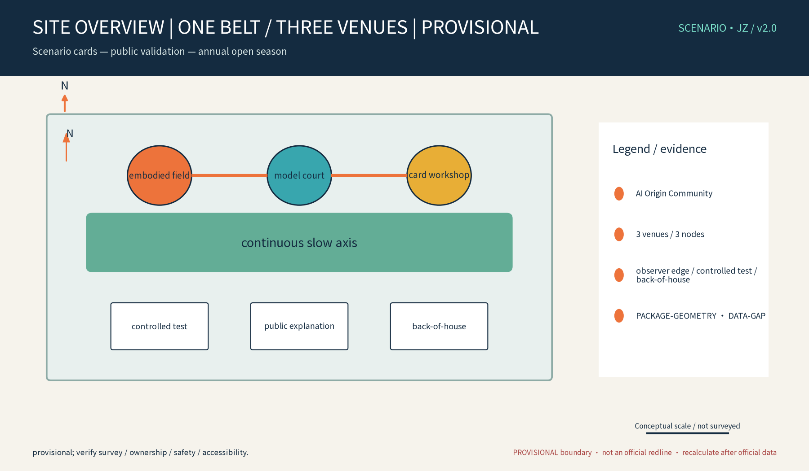
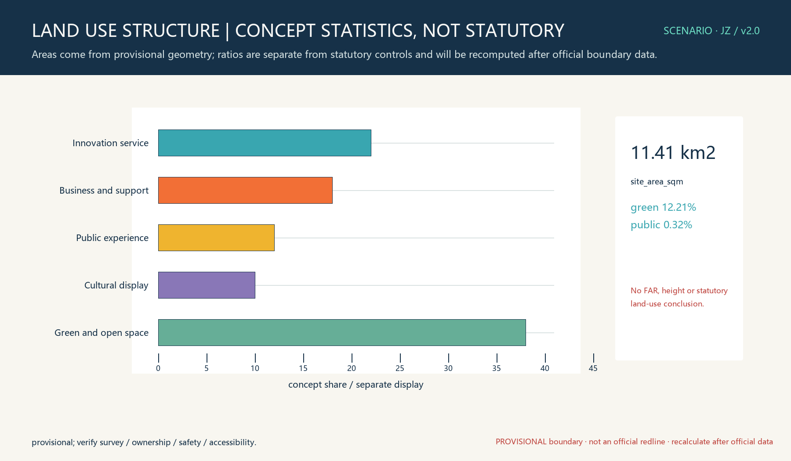
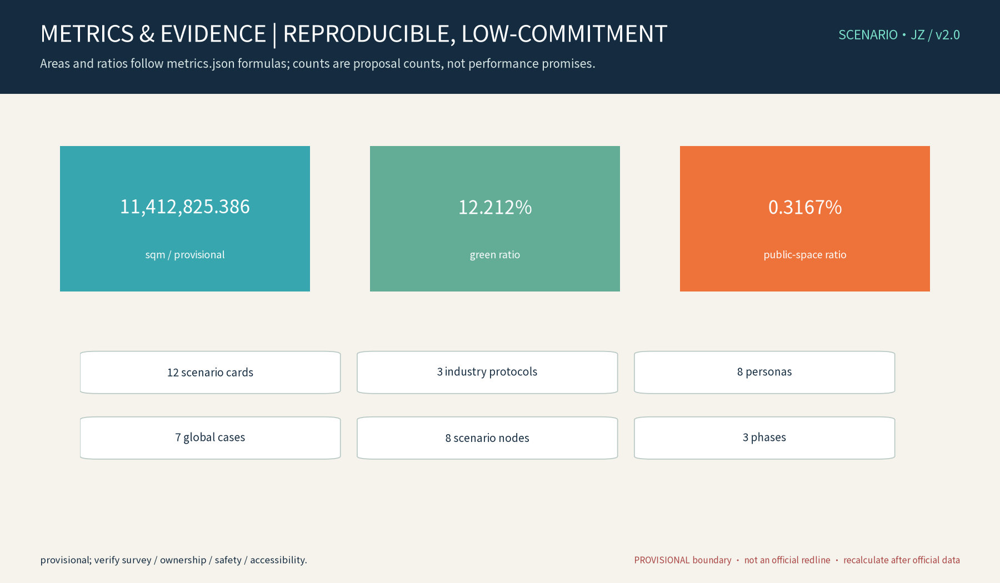

This proposal deepens the idea of an AI scenario-card, public validation-space and annual-open-event loop into “one belt, three venues.” A card connects a user problem, a spatial touchpoint, a test protocol and evidence. All spatial suggestions are concept proposals on provisional geometry. They do not assert a site condition, official boundary, heritage asset, ownership, road line, approval or operating partnership. Missing survey, ownership, rail, fire, accessibility, utility, heritage and visitor-flow evidence remains a data gap.

## Design Basis and Source List

Design intent: use the brief’s three positions, five functions, three areas, two wings and agent.1–6 outputs to build a traceable chain: write a card, place it in a space, review it, stop it safely and hand it over. The geometry layers are participant-authored conceptual layers; they are not surveys or statutory controls. Public sources and standards are methods and boundary references only. Every claim is tied to source, standard, depth, data and metric anchors. [source:DATA-SRC-OFFICIAL-ANNOUNCEMENT-20260509] [standard:PROJECT-AGENT-OPEN-CALL-TASKBOOK] [depth:existing_conditions_diagnosis] [data:DATA-GAP-SITE-FACTS] [metric:site_area_sqm]

## Three-Level Scope Framework

Level 1 connects Qinghe–Shangdi–Zhongguancun and unconfirmed regional interfaces; Level 2 connects the green corridor, three venues, streets/stations and three areas/two wings; Level 3 specifies reversible components, scenario cards and testing interfaces. Gates are G0 public-source screening, G1 survey/ownership/safety evidence, G2 low-risk small sample, and G3 human-reviewed expansion. A failed gate means stop, remove the exhibit or return to paper service. [source:DATA-SRC-PROVISIONAL-BOUNDARIES-20260605] [standard:MOHURB-URBAN-DESIGN-MEASURES] [depth:three_level_scope_framework] [data:DATA-GAP-OFFICIAL-CONTROLS] [metric:scenario_card_count]

## Coordinated Research Area: Industry and Future City Research

The response matrix is spatial, industrial and operational, but every interface is pending confirmation:

|Position/function|Spatial carrier|Mechanism and output|Operator/measure|Boundary|
|---|---|---|---|---|
|Jingzhang culture belt / public explanation|Narrative interface and verified resource points|Rights-checked captions and methods|Curator/community operator; traceability and complaints|Heritage and ownership pending|
|Urban AI life belt / active city|Workshop, paper service and observation points|Low-risk public experience, no individual identification|Community/park operator; completion and accessibility|Facilities and flows pending|
|AI innovation belt / autonomous innovation|Embodied and model validation venues|Application, review, anonymized aggregate, human release|Test operator/evaluator; tests and stops|No partnership assumed|
|World AI ecosystem|Zhongzhiyuan interface and two wings|Land, space, industry, funding, talent, compute, data, scenario|Typed institutions; response time|External interfaces pending|
|Global AI governance|Evaluation venue, honors wall, annual review|Methods and failures, no individual ranking|Review committee; review and appeal time|Not a regulatory certification|

Regional interface matrix: Beiwai Community, Future Science City, Huairou Science City, E-Town and Jing-Jin-Ji are proposed interfaces only. Each must confirm a contact, space, data authorization, safety rule and agreement before any exchange. Possible inputs are needs, methods and schema; outputs are anonymized aggregates, reproducible records or paper feedback. No cooperation is claimed. [source:DATA-SRC-AGENT-TASKBOOK-20260518] [standard:PROJECT-AGENT-OPEN-CALL-TASKBOOK] [depth:overall_spatial_structure] [data:DATA-GAP-REGIONAL-INTERFACES] [metric:industry_protocol_count]

Three positions, five functions, three areas and two wings are connected as one spatial–industry–operations loop:

|Position/function|Spatial carrier|Industry interface|Operational loop|
|---|---|---|---|
|Centennial Jingzhang culture belt|AI Origin Community and verified heritage/resource interfaces|Rights-checked history, rail culture and public explanation|Curator checks source → community tests caption → publish or withdraw|
|Urban AI life-experience belt|Scenario-card Workshop and Xiaoyuehe Scenario-Enablement Wing|Residents, caregivers, older adults, disabled visitors and nontechnical participants|Paper/digital intake → staffed co-creation → accessible service or paper fallback|
|AI integrated innovation belt|Zhongzhiyuan AI Autonomous Innovation Acceleration Area and Embodied Validation Field|Robotics, data, model evaluation and enterprise test applicants|Application → professional review → controlled test → anonymized evidence → stop/handover|
|World-class AI innovation ecosystem|Dazhongsi AI Industry Cluster Area and Zhongguancun Technology-Service Wing|Space, industry, funding, talent, compute, data and scenarios|Typed interface → confirm resources → pilot → review conversion or exit|
|Global AI governance and discourse|Model Evaluation Court, public explanation and annual review|Benchmark, risk, red-team and appeal methods|Version task set → two-person review → public aggregate → appeal and annual withdrawal|

The three areas are task interfaces, not statutory zoning: AI Origin Community, Zhongzhiyuan AI Autonomous Innovation Acceleration Area and Dazhongsi AI Industry Cluster Area. The two wings are Zhongguancun Technology-Service Wing and Xiaoyuehe Scenario-Enablement Wing. All regional exchanges remain `to_verify`; a contact, venue, authorization, safety rule and review date are required before a pilot.

### agent.1–agent.6 delivery index

|Agent|Substantive deliverable|Evidence in this package|Responsible role|
|---|---|---|---|
|agent.1|SCENARIO·JZ identity, three positions/five functions/three areas/two wings and system map|this proposal, site overview, compliance matrix|lead coordinator, design reviewer and human review chair|
|agent.2|seven global AI ecosystem mechanisms and eight-factor graph|this section, `sources.json`, ecosystem map record|ecosystem researcher, developer and data steward|
|agent.3|12 readable cards, three industry protocols and eight personas|card matrix, `metrics.json`, `risk.json`|scenario initiator, test operator, accessibility adviser and public participants|
|agent.4|three venues, east–west stitching, north–south connection and Dazhongsi interface|key-area geometry, implementation matrix and drawings|space coordinator, safety officer and operations curator|
|agent.5|Jingzhang history → innovation culture → AI public culture, wayfinding and international copy|culture/signage workflow and rights ledger|curator, translator/proofreader and rights administrator|
|agent.6|annual open season, developer community, conversion path and withdrawal review|annual programme and operations matrix|event operator, community interface and evaluation committee|

## Overall Design Area: Urban Renewal and Regulatory-Plan-Level Urban Design

The concept is a continuous slow-mobility axis plus three venues and five interface types. Streets, stations and surrounding communities are context, not red lines. Public, observer, test, back-of-house and emergency flows are separated by time or reversible barriers. Each venue requires a verified entrance, accessible path, observation distance, safety buffer, storage, temporary power, emergency access and wet-weather shutdown point. These are professional review conditions, not completed facilities.

## Detailed Design of Key Areas

The three venues are concept units: the embodied field has a controlled test surface, observer edge, back-of-house access and physical emergency stop; the evaluation court has an explainable display, reviewer worktable, version log and paper results cabinet; the workshop has accessible tables, paper cards, staffed help and storage. Operators are typed roles. Prerequisites are survey, ownership, safety and insurance review. Maintenance is daily/event inspection, takedown and deletion. Stop actions are power-off, removal, closure, deletion and complaint escalation. Handover includes equipment, logs, deletion proof, maintenance and complaint records. The KEY-ZHON, KEY-BEIJ and KEY-DAZH polygons remain rough and provisional. [data:PACKAGE-GEOMETRY] [standard:PROJECT-OFFICIAL-ANNOUNCEMENT] [depth:three_key_area_detailed_design] [data:DATA-GAP-NODE-SITING] [metric:landmark_count]

### Three-node implementation decision cards

|Node|Known concept and unknowns to verify on site|Decision gate and responsible roles|Process measures and stop/withdraw action|
|---|---|---|---|
|N1 Embodied Validation Field|Controlled surface, observer edge, back-of-house, temporary power and physical stop; verify entrance, ownership, fire/rail protection, insurance, equipment liability and viewing distance|R1 document set; R2 safety officer + traffic/fire/accessibility advisers; R3 small sample release by test operator|Boundary crossings, emergency-stop response, equipment fault and observer conflict; power off, clear, close and remove on risk|
|N2 Model Evaluation Court|Low-noise worktable, version log, paper results cabinet and expert review; verify room, task rights, data authorization, access control, expertise and evacuation|R1 task/rights/fields; R2 two-person review; R3 grouped result and public explanation sign-off by evaluation committee|Explanation consistency, subgroup error and traceability; delete unauthorized/raw output and do not publish if unexplained|
|N3 Scenario-card Workshop|Accessible tables, paper cabinet, staffed desk, storage and display wall; verify community operator, child/older-adult safeguards, language service, time and takedown space|R1 co-creation rule and human fallback; R2 operator + community + accessibility adviser; R3 anonymous card display|Participation coverage, human fallback rate, complaint closure and removal time; limit flow, remove card and return to paper on crowding, mistranslation or unclear rights|

The continuous east–west stitching is the slow-mobility and card-display spine; the north–south connection links station/community entrances to the three nodes. Dazhongsi is a proposed smart-native consumption and business interface, while Xiaoyuehe is the public experience and scenario-empowerment wing; both require field verification and no existing partnership is claimed.

## AI Innovation Ecosystem, Personas, and AI+ Scenarios

The eight-element ecosystem is land, space, industry, funding, talent, compute, data and scenarios. Its loop is application → small sample → human review → controlled opening → evaluation → annual review → conversion or exit. Generative AI is limited to drafting card language, version comparison and explainable summaries. It is not used for identity recognition, automatic release, approval, safety adjudication or fact generation.

Seven first-party global AI ecosystem cases are used for mechanism comparison only. The source date is stated where the official page states one; otherwise `not_stated_on_source` is retained, with access date 2026-09-01. Each row is cite/link only; no partnership or asset reuse is implied.

|Case/source|Mechanism translated into SCENARIO·JZ|Applicability and rights boundary|
|---|---|---|
|CASE-GLOBAL-01 Mcity, University of Michigan|Controlled autonomous-vehicle test environment → N1 test/observer/safety chain|Cite/link only; no site, equipment, image, data or partnership claim; source date not stated|
|CASE-GLOBAL-02 AstaZero, RISE/Chalmers|Multi-scenario transport testing → T1 obstacle/weather/time/failure fields|Do not copy certification, conditions, procedures or results; source date not stated|
|CASE-GLOBAL-03 CETRAN, Singapore|Urban test and evaluation interface → application/observation/expert/responsibility roles|Singapore rules are not local approval; no image, data or cooperation reuse; source date not stated|
|CASE-GLOBAL-04 MLCommons/MLPerf|Versioned benchmark, task set and comparable results → N2 version/metric/group/review chain|No external ranking, hardware result, task data or mark reuse; source date not stated|
|CASE-GLOBAL-05 NIST AI RMF/AI Resource Center (2023-01-26)|Govern/map/measure/manage → card risk/evidence/human review/appeal/stop fields|Method reference only; no NIST certification or legal equivalence claim|
|CASE-GLOBAL-06 Hugging Face Hub|Model/data/Space provenance and developer collaboration → schema clinic and withdrawable card|Every asset has its own license; public visibility is not reuse or processing permission; source date not stated|
|CASE-GLOBAL-07 UK AI Security Institute|Safety evaluation, red-team and failure explanation → N2 desktop test and withdrawal record|No institutional cooperation, security certification, report/data/image reuse; source date not stated|

The twelve cards use the same fields: user/problem, input/source, AI or rule, spatial touchpoint, operator, human review, baseline/sample/window, success formula, error groups, privacy/retention, paper fallback, complaint and exit.

|ID|User/problem|Input → AI/rule → space|Baseline, review, threshold and stop|
|---|---|---|---|
|SC-01|Resident repair priority|Input paper themes → N3 workshop → output issue card|Community operator; confirmation rate = confirmed issues / sampled issues|No identity; misclassification/leak deletes card and stops publication|
|SC-02|Older adult wayfinding|Staff query → slow axis → explainable route order|Volunteer escort; completion = completed journeys / started journeys|No trajectory; blocked route switches to staff guidance and exits AI|
|SC-03|Disabled visitor booking|Staff-entered service need → N3 → confirmed accessible time slot|Accessibility adviser confirms; accessible completion = completed services / requests|Only service fields; unresolved complaint suspends card and keeps staffed fallback|
|SC-04|Caregiver safe stay|Public time/weather → observer edge → capacity prompt|Event lead controls; conflict count and removal time|No child identification; crowd/weather failure closes and removes equipment|
|SC-05|Temporary visitor translation|Authorized text → caption → multilingual sign|Curator/translator reviews; mistranslation rate = wrong sampled entries / sampled entries|No identity; wrong or uncleared text is removed immediately|
|SC-06|Researcher card version|Need/source → N3 → versioned card and diff|Author + editor sign; source coverage = sourced fields / total fields|No personal prompt data; untraceable card remains unpublished and exits|
|SC-07|Robot path test|Aggregate sensor fields → N1 → boundary/stop/completion summary|Safety officer leads; 20-run pilot, zero boundary crossings proposed|No bystander identity; boundary/sensor failure triggers physical stop and removal|
|SC-08|Model explainability|Authorized task/version → N2 → grouped metrics and confidence interval|Two experts score; per-class sample size ≥30 proposed|No personal data; unexplained or unauthorized output is deleted and not published|
|SC-09|Visitor flow|Manual counts/reservations → observer edge → capacity prompt|Venue lead counts; conflict rate = conflict events / observation sessions|No person tracking; over-capacity closes observation and exits card|
|SC-10|Content safety prompt|Submission fields → N3 → non-decisive warning|Two-person review and appeal; log response days and false positives|No automatic decision; uncertain content stays unpublished and raw input is deleted|
|SC-11|Developer schema|Field allowlist → developer desk → schema result|Data steward checks; extra-field count and version completeness|Minimum fields only; excess fields are rejected, deleted and recorded|
|SC-12|Annual review|Aggregate logs/complaints → N2 → grouped failure/appeal summary|Evaluation committee signs; appeal closure = timely closures / received appeals|Aggregate only; fairness or explainability deterioration removes the card|

Three industry protocols: T1 tests a mobile robot in the controlled field using speed, trajectory, obstacle class and weather, outputting boundary crossing, emergency stop and completion. Human leading is the baseline; 20 runs are a small-sample proposal; groups are weather, obstacle and time; the safety officer can take manual control; crossing or sensor failure exits. T2 evaluates a text/multimodal model in the court using an authorized task set, version and prompt class, outputting accuracy, refusal, explanation consistency and confidence intervals. Human scoring is the baseline; group by language and difficulty; experts review; personal data or unexplained output is deleted. T3 co-creates cards in the workshop using problem, place type, role, constraint and authorization, outputting a versioned card, spatial interface and metric. A two-reviewer pass rate of 90% is a pilot suggestion; group by user, language and digital ability; paper records are the fallback; no authorization or unresolved complaint means no opening. All protocols require minimization, re-identification testing, retention/deletion proof, access logs, appeal and accident responsibility. These are participant proposals, not official standards. [source:DATA-SRC-GENERATIVE-AI-INTERIM-MEASURES] [standard:PROJECT-AGENT-OPEN-CALL-TASKBOOK] [depth:three_key_area_detailed_design] [data:DATA-GAP-TEST-SAMPLES] [metric:scenario_card_count]

## Land Use, Building Scale, and Retain-Renovate-Demolish Strategy

No statutory land-use, FAR, height or demolition/retention conclusion is made. Land-use areas are aggregated from geometry features, divided by the calculated site boundary, reported with raw sqm, formula, confidence and rounded display. Green and public-space ratios are provisional reproducible metrics, not planning targets. Existing space may be prioritized only after survey, ownership, heritage, fire, structure and rail review. Unsupported labels such as “old industrial buildings” or “retained railway industrial heritage” are not treated as facts; use “existing space or linear cultural resource to be prioritized for renovation/protection after survey confirmation.” [source:DATA-SRC-MNR-LAND-USE-CLASSIFICATION-202311] [standard:MNR-LAND-USE-CLASSIFICATION-GUIDE] [depth:retain_renovate_demolish] [data:DATA-GAP-EXISTING-BUILDINGS] [metric:land_use_area_sqm]

## Transport, Rail, Municipal Infrastructure, and Public Services

Slow mobility, scheduled testing and staff guidance are the default. Rail protection, entrances, fire lanes, utilities and temporary electricity require confirmation. Paper cards, phone/staff registration, multilingual captions, high contrast, tactile and staffed help are non-digital alternatives. Accessibility acceptance should check continuous paths, reachable tables, rest/turning areas, readable type, audio/visual cues and staff response; exact values follow professional site measurement. [source:DATA-SRC-MOHURB-URBAN-DESIGN-MEASURES] [standard:MOHURB-URBAN-DESIGN-MEASURES] [depth:traffic_rail_slow_parking] [data:DATA-GAP-TRANSIT-UTILITIES] [metric:accessible_service_completion]

## Blue-Green Network, Public Space, and Urban Character

The component library includes removable card rails, rain cover, movable barriers, low-glare wayfinding, paper service cabinets, accessible tables, emergency-stop signs and recyclable panels. Three original landmark concepts are SCENARIO Gate, Explainable Loop and Co-create Bell. Honors are for card authors, safety stewards, public contributors and replication partners; they are not official certification. The visual system uses ink blue, rail orange, validation cyan and paper white, with a continuous-track and square-card motif. The font and rights boundary are recorded in the ledger. [source:DATA-SRC-MOHURB-URBAN-DESIGN-MEASURES] [standard:MOHURB-URBAN-DESIGN-MEASURES] [depth:blue_green_public_space] [data:DATA-GAP-CULTURAL-ASSETS] [metric:public_space_component_count]

## Renewal Projects, Implementation Policy, and Phasing

Phase 0 verifies survey, ownership, rail, fire, heritage, accessibility and visitor-flow conditions; Phase 1 runs paper cards, captions and T3; Phase 2 runs scheduled T1/T2 with observation and safety drills; Phase 3 maintains annual open season, developer community and honors wall. Operators are typed roles; resources are professional services, reversible components, safety equipment and approved digital services. A failed gate removes the exhibit or returns to paper service. Handover includes versions, devices, logs, deletion proof, maintenance and complaint records.

### Implementation, operations and withdrawal matrix

|Horizon|Operating package and preconditions|Process measures|Stop, withdrawal and maintenance|
|---|---|---|---|
|0–1 year|Survey/ownership/rail/fire/accessibility/heritage verification; N3 paper cards and T3; staffed help and translations|Source coverage, human fallback, participation coverage, complaint response and removal time|No authorization/source/accessible fallback → no display; event inspection, paper archive and deletion proof|
|1–3 years|N2 controlled evaluation and N1 small T1/T2 sample; task rights, insurance, safety drill, observation/logistics/power checks|Boundary crossings, emergency stop, accident, subgroup error, explanation consistency and access-log completeness|Incident, rights gap or sensor failure → power off, clear, delete, close and remove; daily and event inspection|
|3–5 years|Annual open season, developer schema clinic, public aggregate review; voluntary enterprise/talent conversion|Annual complaints, appeal closure, reproducibility, conversions and withdrawals|No guaranteed funding/resource; committee can pause, return to paper or retire a card; yearly maintenance audit|

Annual programme: spring scenario-card open call; summer AI industry test open week; autumn scenario evaluation day and winter public review/withdrawal report. The developer community uses a quarterly schema clinic, bilingual field dictionary, paper submission and office hours. Conversion means a voluntary, separately reviewed handover to a qualified operator; it is not an investment, procurement or employment promise. International dissemination uses the proposed line “Write the scenario. Walk the test. Keep the human in charge.” with a human-reviewed Chinese counterpart.

Long-term operation uses an open application with user, problem, input, minimization, space, baseline, window, metric, human review, exit and responsibility. A quarterly schema clinic supports developers; annual review publishes aggregates, failures and deletion proof. Enterprise and talent conversion requires voluntary agreements and professional review. Funding, talent, compute and specialist services are external interfaces, not secured resources. [source:DATA-SRC-AGENT-TASKBOOK-20260518] [standard:PROJECT-AGENT-OPEN-CALL-TASKBOOK] [depth:phasing_implementation] [data:DATA-GAP-OPERATORS-FUNDING] [metric:annual_program_count]

## Metrics, Area Recalculation, and Compliance Matrix

site_area_sqm = area(site_boundary); green_ratio = union(green_space)/site_area; public_space_ratio = union(public_space)/site_area. Each is provisional, reproducible from geometry and has a trigger for recomputation when official geometry arrives. Land-use areas and ratios are separate displays. Process counts are 12 cards, 3 protocols, 8 personas, 3 venues, 3 landmarks, 7 global cases and 3 phases; they are concept counts, not performance promises. The compliance matrix covers minimization, anonymization, re-identification tests, retention/deletion, access logs, third-party devices, model bias, human judgment, appeals, accident responsibility, accessibility, fire/rail/heritage/ownership review and asset permissions. [source:PACKAGE-GEOMETRY] [standard:PROJECT-OFFICIAL-ANNOUNCEMENT] [depth:metrics_recalculation] [data:DATA-GAP-METRIC-VALIDATION] [metric:scenario_card_count]

Formula contract: `green_ratio = green_space_area_sqm / site_area_sqm = 1,393,756.159 / 11,412,825.386 = 0.122122`; `public_space_ratio = public_space_area_sqm / site_area_sqm = 36,150 / 11,412,825.386 = 0.003167`. These exact values are low/medium-confidence conceptual geometry outputs; figures and HTML may round for legibility but must retain `provisional`, unit and source. Do not put ratios, square metres and counts on one axis. Counts are 12 cards, 3 protocols, 8 personas, 7 global cases, 8 scenario nodes and 3 phases.

## Risk, Copyright, and Compliance

This is not an approval, government commitment, official partnership, existing-condition proof or safety certification. AI uses only minimum, anonymized aggregates; no face or individual trajectory identification, automatic safety judgment or fact generation. Each pilot requires a re-identification attack test, deletion proof, access audit, error groups, human review, appeal and accident responsibility. Robots require a physical stop. Copyright is asset-level: SCENARIO·JZ and the three landmark names are original concept proposals; the local redistributable Noto Sans SC font is used under its license; figures are self-drawn deterministic outputs; geometry is participant-authored conceptual geometry; external cases are cited, not copied. The ledger records author/method, date, URL, license, allowed/prohibited use and pending verification. Citation does not grant reuse permission. [source:DATA-SRC-OFFICIAL-ANNOUNCEMENT-20260509] [standard:PROJECT-OFFICIAL-ANNOUNCEMENT] [depth:risk_missing_data] [data:DATA-GAP-RIGHTS-AND-LIABILITY] [metric:complaint_close_rate]

## References

Sources.json contains auditable task, method, standards and first-party case references with dates and use boundaries. No site fact, ownership, heritage asset, partnership or investment is inferred from them. The 13 fixed sections map to agent.1–6; figures, HTML and A0/A3 share IDs, numbers, provisional warnings and data gaps. [source:DATA-SRC-AGENT-TASKBOOK-20260518] [standard:PROJECT-OFFICIAL-ANNOUNCEMENT] [depth:reference_traceability] [data:DATA-GAP-SOURCE-ACCESS] [metric:source_count]
