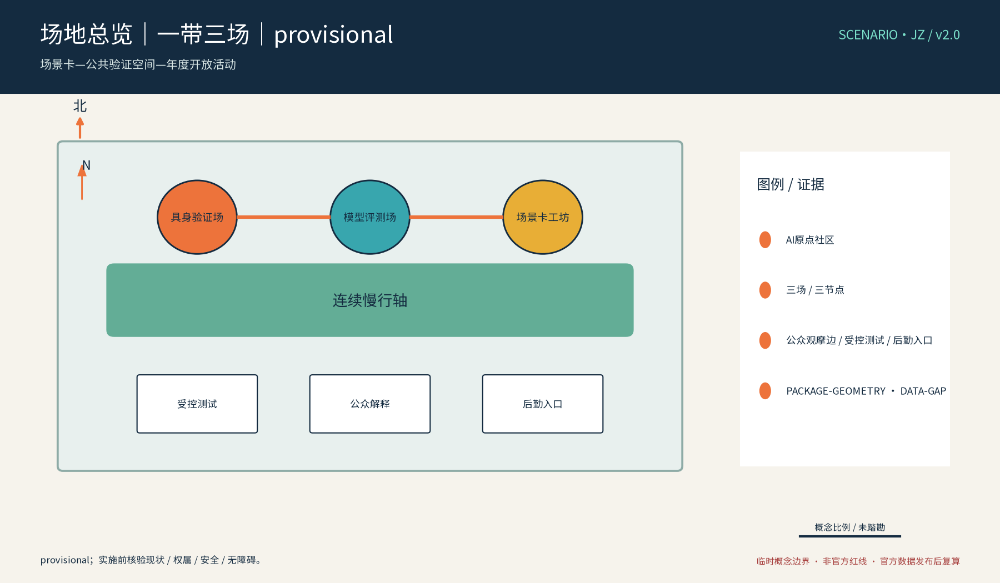
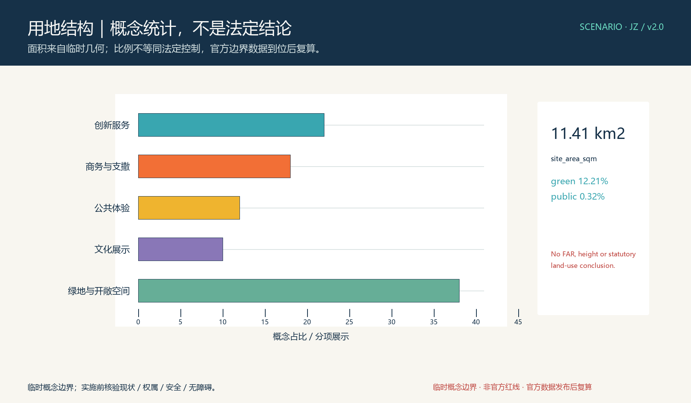
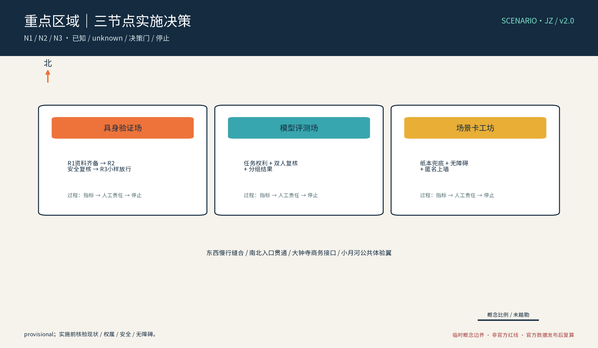
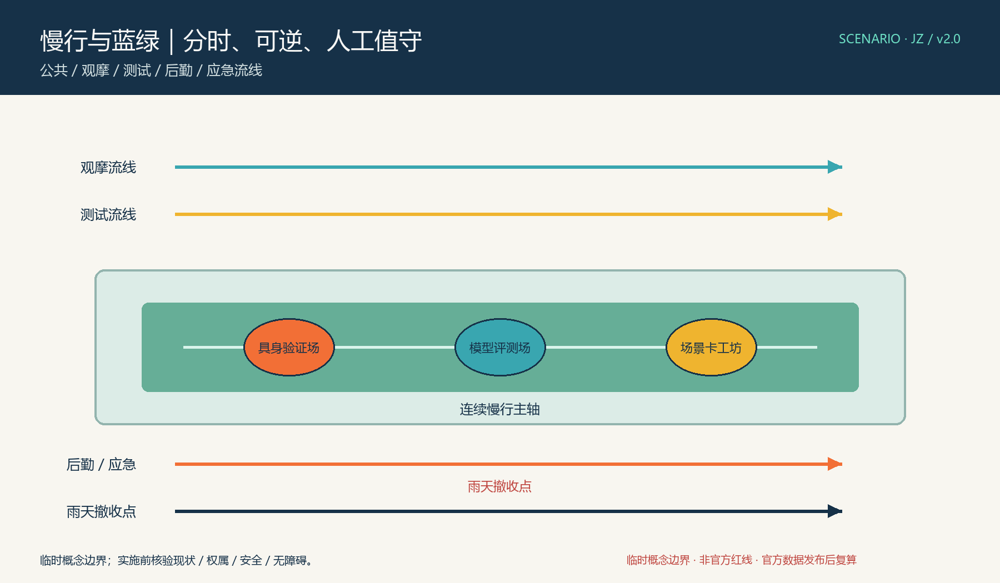
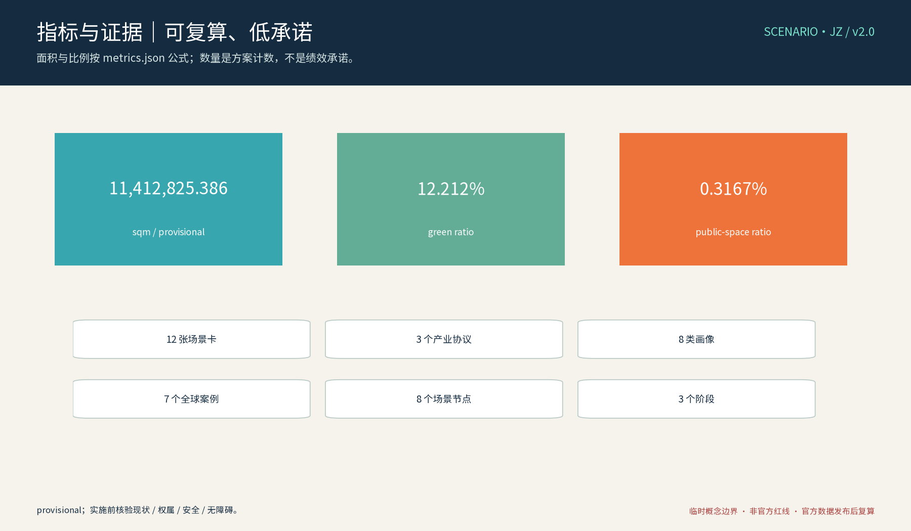

本稿为概念建议稿，全部内容基于公开资料口径，行文克制，不编造官方数据，不给出容积率、建筑高度、拆改留与工程可行性结论，不把测试场景写成已批准运营。

## 设计依据与资料清单
资料清单所列公开史料、规划报道与通则规范等均为概念工作依据清单，并非本包已获取的数据；本包实际使用的全部数据见 sources.json，未获取项已在风险与缺失数据说明中如实标注。

本章节以公开资料为限：京张铁路历史与遗址公园公开信息、中关村科学城及沿线片区公开规划表述、沿线高校与软件园、科创园区公开资料、《个人信息保护法》《数据安全法》及生成式人工智能服务管理相关公开规定、国家与北京市人工智能政策公开文本。资料清单随方案附列条目与出处；凡无公开依据的内容，一律以"建议""概念"表述，不引用内部文件、不虚构官方数据。

> **证据锚点**：[source:DATA-SRC-OFFICIAL-ANNOUNCEMENT-20260509]、[source:DATA-SRC-AGENT-TASKBOOK-20260518]（组织方公告与任务书为文本口径依据）。

## 三层范围工作框架
三层成果逐级传导：统筹研究输出的场景带与沿线片区协同判断约束总体设计，总体设计校核的测试场地落位、慢行贯通与分时开放机制再落实到节点详设；每层均保留与任务书对应章节的机器可读证据锚点，便于评审对照。

工作框架自外向内设三个层次：统筹研究范围为第一层，聚焦产业与未来城市协同；总体设计范围为第二层，落位城市更新与控规深度城市设计；重点区域详细设计为第三层，深化三个原创节点。三层逐级聚焦、互为校核，成果深度与汇报层级相对应，保证概念方案"由面到点"逻辑完整，并为后续深化预留接口。

### 三大定位、五大功能与三区两翼协同回路

| 任务书对象 | 本案的空间—产业—运营回路 | 可复核交付 | 当前边界 |
|---|---|---|---|
| 百年京张文化带 | 公开史料核验 → 低干扰叙事界面 → 双语导视 → 权利复核/撤牌 | 文化叙事、导视语法、国际文案 | 史料、遗存、标识待核 |
| 都市AI生活体验带 | 居民问题 → 共创卡 → 人工/纸本体验 → 解释与申诉 | 画像、场景卡、无障碍旅程、年度公示 | 场地与运营方待核 |
| AI融合创新带 | 高校/企业需求 → 产业协议 → 安全官/专家人工放行 → 复盘/退出 | 测试协议、版本日志、匿名聚合摘要 | 设备、责任和许可待核 |
| AI全栈自主创新体系 | 字段白名单 → schema clinic → 评测 → 可复用模板 | 卡片版本、数据字典、评测记录 | 算力与数据条件待核 |
| 世界级AI创新生态 | 全球一手案例 → 八要素缺口图谱 → 区域接口 → 场景申请 | 全球案例、生态图谱、接口清单 | 不声称本地合作 |
| AI+场景赋能新范式 | 用户问题 → 场景卡 → 空间触点 → 运营员 → 指标/风险 → 撤回 | 12 张卡、3 个测试协议 | 均为 proposed |
| 智能化AI活力城市 | 慢行/观摩/服务分流 → 纸本、电话、人工、多语和无障碍替代 | 公共旅程、组件库、三处概念地标 | 不作工程结论 |
| AI治理全球话语权 | 来源/版本/误差/申诉 → 年度公示 → 继续、降级或删除 | 治理规则、风险台账、退出证明 | 不替代监管认证 |

任务书的三区为 **AI原点社区、众智园AI自主创新加速区、大钟寺AI产业集聚区**；两翼为 **中关村科技服务翼、小月河场景赋能翼**。三区两翼是区域任务接口，不等于本包几何中的法定分区，也不表示现有合作已建立。区域协同采用提案接口：北纬社区接收生活问题和纸本反馈，未来科学城接收科研/算力需求，怀柔科学城接收评测方法与同行复核，经开区接收企业场景需求，京津冀接收指标词典与案例交换。每项接口须补齐联系人、场地、数据授权、安全规则和复盘日期后才可进入试点；当前均为 `to_verify`。[data:DATA-GAP-REGIONAL-INTERFACES]

> **证据锚点**：[source:DATA-SRC-AGENT-TASKBOOK-20260518]（三层范围划分依据任务书官方文本口径）。

## 统筹研究范围产业与未来城市研究
产业与城市研究识别场景带的「验证」效应：以测试验证与场景共创活动将沿线高校、软件园与科创片区的技术需求有序组织为双向可达的公共实验界面，形成「场景带—高校与园区—国际化住区」三级联动结构；未来城市研究仅作方向性预判，不构成对用地与投资的承诺。

统筹研究聚焦场景带与沿线高校、科创片区及国际化住区的协同关系：高校提供研究需求、试验方法与青年人才；软件园与科创园区提供企业主体与应用场景；国际化住区提供多元用户样本与生活场景视角。场景卡作为三方协同的公共接口，形成"需求—供给—验证"闭环的研究框架，从未来城市视角论证场景带的功能定位与产业外溢方向。

> **证据锚点**：[source:DATA-SRC-PROVISIONAL-BOUNDARIES-20260605]（边界为 provisional，研究范围仅作概念示意）。

### agent.1—agent.6 实质交付索引

| 任务 | 实质交付 | 空间/结构化证据 | 运营责任 |
|---|---|---|---|
| agent.1 总体概念与功能统筹 | SCENARIO·JZ 主名、三段轨迹＋方卡 Logo 方向、三定位/五功能/三区两翼矩阵、三层结构 | 本文第 3/4 节、site-overview、logo-jz、compliance_matrix | 总协调角色、设计顾问、人工评审 |
| agent.2 全栈自主创新与全球生态 | 7 个全球 AI 机制案例、八要素生态图谱、众智园/AI原点/科技服务翼接口 | 本文第 6 节、ecosystem-map、CASE-GLOBAL-* | 生态研究员、开发者、数据管理员 |
| agent.3 AI+场景新范式 | 12 张逐卡字段、3 个产业测试协议、8 类画像、隐私/人工/退出边界 | 本文第 6 节、metrics、risk、场景卡清单 | 场景发起人、测试员、无障碍顾问、公众 |
| agent.4 公共空间与智能原生业态 | 东西缝合、南北贯通、三处概念地标、荣誉展示、组件库、大钟寺消费商务接口 | 本文第 5/9 节、key-areas、公共空间图 | 空间协调员、安全官、策展与运营角色 |
| agent.5 京张/中关村/AI文化 | 史料核验—创新文化—AI新文化三段叙事，导视语法、双语国际传播文案 | 本文第 9 节、culture-signage、权利台账 | 文化策展人、翻译/校审、权利管理员 |
| agent.6 全球活动与长期运营 | 年度活动、开发者社区、场景开放、地标维护、人才/企业转化与退出复盘 | 本文第 10 节、annual-program、运营台账 | 活动运营员、社区接口、评估委员会 |

表内“交付”是本包的概念设计对象，不是已建成设施或已签约关系；无法由公开资料和本包文件证明的事项仍保持 `proposed`、`to_verify` 或 `unknown`。[depth:agent_delivery_index]

## 总体设计范围城市更新与控规深度城市设计
总体设计强调「以绿带为骨架的场景验证序列」：依托京张铁路遗址公园绿带连续布置场景卡展廊、测试验证节点与共创驿站，使同一片场地平时可观摩研习、节事可办测试开放周；强调更新而非新建，优先利用存量空间植入测试功能；对控规指标只做校核建议，不预设数值结论。

总体设计以绿带为骨架组织场景带：连续慢行轴贯通各节点，测试设施与遗址公园、绿地复合布局，形成"可观摩、可参与、可验证"的空间序列。设计以留改拆并举为概念口径，提出风貌控制、界面引导与设施置入建议；与控规深度衔接时给出方向性控制引导，不预设容积率、建筑高度等数值，也不对具体地块作拆改留结论。

> **证据锚点**：[source:DATA-SRC-MOHURD-CONTROL-DETAILED-PLANNING]、[source:DATA-SRC-PROVISIONAL-BOUNDARIES-20260605]。

## 重点区域详细设计
三节点的设施选址均为概念点位，须经规划、文保与主管部门评估及专业审查后重新落位；节点间的绿带动线与慢行通道构成完整场景动线，详细平面与剖面以图册与 geometry 层表达。

设三个原创节点：其一"具身智能验证场"，为户外受控验证环境，含围合测试区、观察廊与分级开放机制，供机器人、无人车等在受控条件下验证；其二"大模型评测场"，为公开可解释的匿名化能力评测展示空间，任务可观看、过程可留痕、结果匿名公开；其三"场景卡共创工坊"，供公众与产业共同编写、张贴、迭代场景卡。三节点均为概念建议，不视为已批准运营的设施。

> **证据锚点**：[data:PACKAGE-GEOMETRY]（三节点示意多边形来自本包 geometry/key_areas.geojson）。

### 三节点实施决策卡

| 节点 | 已知/概念输入 | unknown 与现场核验 | 决策门/责任角色 | 过程指标、停止与撤收 |
|---|---|---|---|---|
| N1 具身智能验证场 | 受控面、观察边、后勤、临时供电、物理急停；承接 SC-07/T1 | 入口、权属、消防、轨道/道路保护、保险、设备责任、观摩距离 | R1 资料齐备；R2 安全官＋交通/消防/无障碍顾问复核；R3 小样放行 | 越界次数、急停响应、设备故障、观摩冲突；风险即断电、清场、封闭、撤装 |
| N2 大模型评测场 | 低噪工作台、版本日志、纸本结果柜、专家复核；承接 SC-08/T2 | 室内条件、任务集权利、数据授权、访问控制、专家资质、疏散 | R1 任务/权利/字段清单；R2 双人评审；R3 分组结果和公众解释通过 | 解释一致性、分组误差、追溯率；不可解释/未授权即删原始、不发布 |
| N3 场景卡共创工坊 | 无障碍台面、纸本柜、人工台、储存和展示墙；承接 SC-01—06/09—12/T3 | 场地、社区运营、儿童/老人保护、语言服务、活动时段和撤收空间 | R1 共创规则与人工替代；R2 运营员＋社区＋无障碍顾问；R3 匿名卡上墙 | 参与覆盖、人工替代率、投诉闭环、撤牌时间；拥堵/错译/权利不清即限流撤牌 |

“东西缝合”不是新建工程，而是把科技服务、产业测试与社区生活由同一张卡连接：方法/数据/产业接口一侧经 N2 解释，公共体验/社区反馈一侧经 N3 共创，结果回到同一版本日志。“南北贯通”是 N1—N2—N3 的场景序列与步行主线、骑行/接驳线、服务/应急线的概念关系；正式线形、出入口、坡度、宽度、消防、轨道和市政条件均 `to_verify`。

小月河场景赋能翼体验路径为：社区/访客提出问题 → N3 人工或纸本建卡 → 运营员选择低风险卡 → N2 阅读来源/置信度/版本/限制 → N1 经安全官放行后做产业验证 → N2 发布可解释摘要 → 年度公示和申诉。大钟寺 AI 产业集聚区接口增加“智能原生消费与商务”概念：预约式场景演示、企业服务问题卡、可撤卸展示和人工讲解；不写商户、企业、客流、消费额或合作关系为既成事实。[data:DATA-GAP-NODE-SITING]

## AI 创新生态、人才画像与 AI+ 场景
场景卡AI辅助生成与版本管理、测试数据匿名采集与合规脱敏、评测过程可解释记录AI为主干场景，每处均配置人工复核兜底；测试预约与秩序调度AI、内容与安全告警复核为支撑场景；仅处理匿名聚合数据、关键决策人工复核双保险，不设过度监控，不把未成熟技术写成已可全面部署。
配套五项AI+场景：场景卡AI辅助生成与版本管理、测试数据匿名采集与合规脱敏、评测过程可解释记录AI、测试预约与秩序调度AI、内容与安全告警人工复核。全部采用匿名聚合加人工复核机制，禁止过度监控；对尚不成熟的技术仅作方向性描述，不表述为已可全面部署。人才画像设五类（见附录），支撑场景与空间的匹配设计。

> **证据锚点**：[source:DATA-SRC-GENERATIVE-AI-INTERIM-MEASURES]（AI 生成内容治理表述的参照依据）。

### agent.2：全球 AI 生态案例与八要素图谱

为避免把一般交通或儿童友好案例误当成 AI 生态证据，本案把全球机制单独分组。下列 7 个对象均只作为公开一手页面的机制参考；公开日期未知时以 `sources.json` 的访问日期为准，不复制图片、Logo、模型、数据集或完整段落，不表示本地合作、认证或规则等效。

| 编号/一手案例 | AI 全栈/生态机制 | SCENARIO·JZ 的转译 | 许可/适用边界 |
|---|---|---|---|
| CASE-GLOBAL-01 Mcity（University of Michigan） | 受控自动驾驶测试、产学研试验接口 | N1 申请—安全官—人工领航—急停—复盘 | 仅引用公开机制；不主张场地、许可、设备或合作 |
| CASE-GLOBAL-02 AstaZero（RISE/Chalmers） | 多类交通场景测试和验证组织 | T1 将障碍、天气、时段和失败模式写入卡片 | 不复制其测试条件、认证或性能数字 |
| CASE-GLOBAL-03 CETRAN（Singapore） | 城市尺度自动驾驶测试与评估接口 | N1/N2 分离测试、观察、专家评估和责任链 | 不将其许可或监管规则视为本地依据 |
| CASE-GLOBAL-04 MLCommons / MLPerf | 版本化 benchmark、任务集和可比较结果 | N2 维护任务集版本、指标公式、分组结果和复核 | 不移植外部榜单、硬件结果或商标 |
| CASE-GLOBAL-05 NIST AI RMF / AI Resource Center | 风险识别、测量、治理和人工判断框架 | 每卡增加风险、证据、人工复核、申诉和停止字段 | 不声称 NIST 认证或本地法规等效 |
| CASE-GLOBAL-06 Hugging Face Hub | 模型、数据集、Space 与开发者协作生态 | 开发者 schema、来源/许可、版本和可撤回卡片 | 不复制模型/数据；公共页面不等于授权 |
| CASE-GLOBAL-07 UK AI Security Institute | AI 安全评测、能力/风险研究和公开解释 | N2 红队桌面测试、失败模式、公开摘要和撤回 | 不声称机构合作、研究结果或安全认证 |

八要素图谱为：土地（权属/用途核验）→空间（三节点、缓冲、无障碍）→产业（测试对象/需求）→资金（公开申报/赞助待核）→人才（开发者、工程、社区、合规、无障碍）→算力（本地或合规云待核、功耗）→数据（白名单、匿名聚合、版本）→场景（卡片和协议）。每一条边都要有 owner、最小字段、审查门、复盘日期和退出单；缺任一项就停留在研究层，不升级为可实施合作。[data:DATA-GAP-REGIONAL-INTERFACES] [metric:global_case_count]

### agent.3：逐卡核验矩阵与产业测试协议

8 类画像为高校研究者、企业工程师、开发者/场景设计师、居民/家长、儿童照护者、老年人/行动不便者、低数字能力/多语访客、运营与合规人员。每类可经纸本、电话、人工台和现场讲解进入，数字预约不设为唯一入口。12 张卡的统一字段为：输入来源、AI/规则、空间、输出、人工职责、baseline/窗口/指标、隐私边界、失败模式、fallback、申诉、退出和成熟度。

| 卡片 | 输入 → 输出 | 空间/人工职责 | 指标公式或过程证据 | 隐私、失败与退出 |
|---|---|---|---|---|
| SC-01 居民报修 | 纸本主题 → 议题卡 | N3/社区组织者抽样复核 | 主题确认率=确认议题/抽样议题 | 不收身份；误归类或泄露即删、停卡 |
| SC-02 老年找路 | 人工问询 → 可解释路径顺序 | 慢行轴/志愿者陪同 | 完成率=完成旅程/发起旅程 | 不建轨迹；受阻则人工带行 |
| SC-03 无障碍预约 | 人工需求 → 时段匹配 | N3/无障碍顾问逐案确认 | 可达完成率=完成服务/发起服务 | 只记服务字段；投诉未闭环停用 |
| SC-04 儿童照护停留 | 公开时段/天气 → 分时容量提示 | 观摩边界/现场领队 | 冲突数、撤收时间、人工限流记录 | 不识别儿童；拥堵/天气异常关停撤装 |
| SC-05 多语导览 | 授权文本 → 检索摘要 | 展签/N3 策展和翻译校审 | 错译率=错译条目/抽检条目 | 不采身份；错译/权利不清撤牌 |
| SC-06 研究者卡片 | 需求卡 → 草拟/差异比对 | N3/作者和编辑双签 | 来源覆盖率=有来源字段/字段总数 | 提示词不含个人数据；无来源不上墙 |
| SC-07 企业机器人 | 受控聚合 → 越界/急停摘要 | N1/安全官人工领航 | 越界次数、急停响应、完成状态 | 不识别旁观者；越界/传感失效断电撤场 |
| SC-08 模型评测 | 授权任务/版本 → 指标区间 | N2/两名专家复核 | 分组误差、解释一致性、版本可追溯率 | 未授权/不可解释删除，不发布 |
| SC-09 观摩秩序 | 人工计数/预约数 → 容量提示 | 观察边界/领队人工排队 | 冲突率=冲突事件/观摩场次 | 不追踪个体；超容关闭观摩 |
| SC-10 内容安全 | 投稿目的/字段/风险 → 非裁决提示 | N3/双人审核和申诉 | 申诉响应日、误报记录 | 不自动裁决；不确定不上墙并删原始 |
| SC-11 开发者字典 | 字段白名单 → schema 结果 | 开发者桌/数据管理员审表 | 超字段数、版本完整性、删除证明 | 最小字段；超字段拒收删除 |
| SC-12 年度复盘 | 聚合日志/投诉 → 误差分组摘要 | N2/评估委员会签字 | 申诉关闭率=按时关闭/收到申诉 | 仅聚合；无法解释或公平性恶化下架 |

三项产业验证协议分别对应三节点：T1 受控具身验证在 N1 使用速度、轨迹、障碍类别和天气，输出越界、急停、完成状态；人工领航为 baseline，建议先做小样，越界/传感失效立即物理急停。T2 模型可解释评测在 N2 使用授权任务集、版本、语言/难度，输出准确率、拒答、解释一致性和置信区间；两名专家人工评分，未授权任务或不可解释结果删除。T3 场景卡共创在 N3 使用问题、空间类型、角色、约束和授权，输出版本卡、空间接口和指标；双人审卡，无授权或投诉未闭环不上线、回退纸本。三协议均要求匿名化、再识别攻击测试、访问日志、留存/删除证明、申诉和事故责任；样本量和通过率是 proposed 起点，不是官方标准。[metric:industry_protocol_count]

## 用地、建筑规模与拆改留方案
拆改留坚持留改拆并举：以留为主保留遗址公园肌理与沿线建成环境，存量建筑功能置换为测试、研习与配套服务，拆除仅限经个案论证的局部疏通慢行零星建筑；全部面积为概念口径，官方数据发布后复算。

本层采取留改拆并举的概念口径：以现状评估为前提，按"评估—判定—实施"流程提出建议，不预设任何数值，也不对具体地块给出拆改留结论。新增设施以轻量、可逆、临时性优先，多用装配式与可移动装置；既有建筑以功能置换与微更新为主，控制建设规模，为后续合法合规程序留足空间。

> **证据锚点**：[source:DATA-SRC-MNR-LAND-USE-CLASSIFICATION-202311]（用地分类名称参照现行国标口径）。

## 交通、轨道、市政与公共服务设施
以交通慢行优先为核心组织交通概念机制：沿绿带构建连续慢行轴贯通具身智能验证场、大模型评测场与场景卡共创工坊，衔接沿线高校、园区与轨道站点（接驳以步行与骑行为主，预留接驳专线与共享单车调度区），测试人流与观摩流线分时组织、降低小汽车依赖；市政以集约共享为原则，优先利用现状设施条件，测试场地预留临时供电与围挡接口；公共服务配置无障碍与多语服务、观摩安全提示，AI决策均设人工复核。

交通以慢行优先为原则：绿带连续慢行轴贯通各节点，衔接既有轨道站点与公交走廊，不新增大规模道路工程建议。测试人流与观摩流线分时、分区组织，避免相互干扰。市政设施以集约共享为方向，建议配套管线与设施统筹布置；公共服务设施依托遗址公园既有服务补缺，不重复建设。

> **证据锚点**：[source:DATA-SRC-MOHURD-URBAN-DESIGN-MEASURES]（市政与慢行设计表述的方法参照）。

## 蓝绿空间、公共空间与城市风貌
构建「绿带为轴、节点公园为珠」的蓝绿公共空间体系：以遗址公园绿带为蓝绿骨架串联沿线小微绿地与开敞空间，形成连续生态与公共空间体系；测试装置与公园融合布置、宜轻宜透宜可逆，不遮挡历史遗迹与绿带视线，安全区与观摩区界限清晰；指示与解说系统统一克制；风貌延续铁路遗址历史特征与科创氛围的对话，避免符号堆砌与过度设计。

依托铁路遗址与绿带构建蓝绿公共空间体系，串联零星绿地与开放空间；测试装置与公园环境融合宜轻、宜可逆，鼓励可拆装、季节化布置。风貌整体克制，避免广告化与过度装饰；以统一标识与铺装语言识别场景带，营造低干扰、可停留、可对话的公共空间气质。

> **证据锚点**：[source:DATA-SRC-MOHURD-URBAN-DESIGN-MEASURES]（蓝绿空间组织的方法参照）。

### agent.5 文化叙事、导视系统与国际传播

文化叙事采用“核验—转译—共创”三段：第一段只用已核验公开史料说明百年京张铁路的工程与公共连接，不复制人物肖像、遗址图像或受保护标识；第二段以中关村创新文化的开放协作、问题导向和可复用方法为当代接口；第三段以 SCENARIO·JZ 场景卡、人工判断、失败公开和公众申诉讲述 AI 新文化。导视层级固定为“方向—节点—场景卡—来源—限制”，文化标识系统与一带整体 Logo 分开管理。

拟议国际传播文案：**“Write the scenario. Walk the test. Keep the human in charge.”** 中文对应：“先写成卡，再走进场；每次试验都让人看得懂、接得住、停得下。”这只是概念传播建议，不表述入选、建成、认证或合作。导视使用线型、图形、文字、触读和人工讲解共同传达，不只依赖颜色；中英文事实、数字、provisional 警示、替代文本和权利边界由人工逐项校对。[data:DATA-GAP-CULTURAL-ASSETS]

## 更新项目清单、实施政策与分期计划
四类项目清单（测试验证节点/慢行贯通/存量植入/场景卡数字平台）为概念清单，规模与投资估算均为建议性表述；政策建议（测试准入与分时开放、多元主体共建、共创内容审核准入）均须依法依规论证，不构成政府或运营方承诺。

实施分近期（1—3年）、中期（3—5年）、远期（5—10年）三阶段：近期启动节点试点与场景卡机制，中期贯通慢行带、完善节点，远期实现常态化运营与全网协同。配套实施政策包括场景开放指南、数据合规指引、安全评估与容错机制。年度活动固定三项：场景卡开放征集季、AI产业测试开放周、年度场景评测日。

> **证据锚点**：[source:DATA-SRC-AGENT-TASKBOOK-20260518]（分期与实施条目对应任务书要求）。

### 试点实施、运营与退出矩阵

| 阶段 | 试点对象/空间 | 参与主体类别 | 前置条件与阶段产物 | 验收指标 | 停止/撤收/维护 |
|---|---|---|---|---|---|
| 近期 1—3 年 | N3 纸本/人工共创、T3、低风险 SC-01—06/09 | 社区接口、居民/家长、无障碍顾问、开发者、运营员 | 权属/场地确认、服务替代、schema、投诉/删除流程；版本卡、双语说明、人工记录 | 来源覆盖率、人工替代率、投诉响应日、撤牌时间 | 无来源、无法解释或投诉未闭环即撤牌回纸面；活动后盘点组件 |
| 中期 3—5 年 | N2 受控评测、N1 小样 T1/T2、大钟寺消费商务接口 | 测试发起方、设备方、评估专家、数据管理员、安全/消防/交通顾问 | 任务/设备/保险/责任审查、再识别测试、观察/后勤/急停核验；协议、日志、删除证明 | 越界/急停/事故、解释一致性、分组误差、访问日志 | 事故、权利缺口或传感失效即停用、清场、撤装；日检、事件后复核 |
| 远期 5—10 年 | 经复核的跨节点年度开放活动与区域接口 | 社区、企业、高校、专业团队、文化策展、区域协同接口 | 正式数据/边界、复算报告、维护与运营协议、年度公示；复用模板、年度复盘 | 参与覆盖、复用卡数、申诉关闭率、维护完成率 | 连续两期无法维护/解释或公平性恶化即删卡撤装；年度权利复核 |

RACI 仅为类型化建议：R=场景发起方/运营员，A=待指定项目责任主体，C=规划、数据保护、无障碍、能源、交通、文保和安全顾问，I=居民/公众。成本只分专业核验、人工运营、可逆组件、设备安全和数字服务五类，不编造金额。建议建立场景申请公约、双人审卡、预约与轮换、分级开放、公开公示、备案/日志、开发者联盟、志愿人工台和年度评估；政策、招商、资金、活动和合作均为 `proposed`，未写成已确定安排。

### agent.6 年度活动、开发者社区与长期转化

年度节奏提案为春季“场景卡开放征集季”、夏季“AI产业测试开放周”、秋季“年度场景评测日”。每项都须有预约公平、人工/纸本替代、无障碍服务、权利校审、事故预案和撤收日期，活动次数是概念提案。开发者社区按月开展 schema clinic 和安全复盘，按季度评审场景卡，按年度公开匿名聚合、失败模式、申诉和删除证明。转化路径为自愿提交 → 专业复核 → 公开模板/测试记录 → 区域接口引荐待核 → 形成可复用方案或退出；不承诺招商、政策、资金、订单、就业或市场效果。[metric:annual_program_count]

## 指标体系、面积复算与合规矩阵
场景卡覆盖数、测试开放频次、共创参与人次、匿名化合规率、慢行贯通度五类概念指标体系进入 metrics.json；面积复算以官方文本口径为底，官方数据到位后整体复算并标注复算版本。

建议建立过程性指标体系，方向包括慢行可达性、观摩与参与人次、场景卡编制数、测试场次、平均单次参与时长及安全记录等，均以统计口径说明，不作达标承诺。面积复算以公开图纸与现状实测为基础展开，本概念阶段不预设结果。合规矩阵逐项对应数据、安全、知识产权、市容等法规条目，形成自检口径。

> **证据锚点**：[metric:green_ratio]、[metric:public_space_ratio]、[source:PACKAGE-GEOMETRY]。

### 指标口径与复算公式（修订版）

| 指标 | 当前机器值 | 单位/公式 | 来源与置信度 | 正式数据到位后的动作 |
|---|---:|---|---|---|
| `site_area_sqm` | 11,412,825.386 | sqm；`area(site_boundary)` | `geometry/site_boundary.geojson`；medium、provisional | 按正式边界与同一 CRS 重算 |
| `green_space_area_sqm` | 1,393,756.159 | sqm；`union(green_space)` | `geometry/green_space.geojson`；low、provisional | 处理重叠、绿线与分类后重算 |
| `public_space_area_sqm` | 36,150.000 | sqm；`union(public_space)` | `geometry/public_space.geojson`；low、provisional | 核验权属、边界、重复面积后重算 |
| `green_ratio` | 0.122122 | ratio；`green_space_area_sqm / site_area_sqm` | derived；low、provisional | 更新图、HTML、PDF和矩阵 |
| `public_space_ratio` | 0.003167 | ratio；`public_space_area_sqm / site_area_sqm` | derived；low、provisional | 更新图、HTML、PDF和矩阵 |

机器值服务于确定性复算，人类可视展示统一用四舍五入百分比并显著标记“provisional/非规划指标”；不把 land-use 色块、概念节点数量和上述 formal 指标混到同一纵轴，也不再使用没有对应面积字段的精确目标占比。`building_footprint_area_sqm`、道路长度、用地分类和节点面积均为概念或 unknown，不由此推导 FAR、建筑高度、容量、客流、投资或减排结果。[metric:site_area_sqm] [metric:green_ratio] [metric:public_space_ratio]

内容计数为 `scenario_card_count=12`、`industry_protocol_count=3`、`persona_count=8`、`global_case_count=7`、`key_area_count=3`、`landmark_count=3`、`phase_count=3`、`annual_program_count=3`；它们是本包设计对象计数，不是建成数量或性能承诺。过程公式为：来源覆盖率=有来源字段数/字段总数；人工复核覆盖率=人工签字输出数/输出总数；申诉关闭率=按时关闭申诉数/申诉总数；无障碍服务完成率=完成服务旅程数/发起服务旅程数；复算漂移=(正式值−provisional值)/provisional值，仅在正式资料到位后计算。[data:DATA-GAP-METRIC-VALIDATION]

## 风险、版权与合规说明
本方案为概念研究性设计，不构成行政审批依据，也不构成容积率、建筑高度、拆改留或工程可行性结论；风险已按测试与运营协调、测试数据边界、技术成熟度、公众接受度四维度如实登记于 risk.json（应对原则：匿名聚合、最小必要、人工复核、测试时段与安全区公示）；引用公开资料均已标注来源并注明获取时间，图形、名称与文字为原创或公共领域素材，若与既有标识雷同属巧合；测试场景不表述为已批准运营；正式实施前须完成多部门联审、文物保护与安全评估。

本方案为概念建议稿，不构成决策、审批或工程可行性结论。风险提示集中于数据合规、测试安全、知识产权与过度监控四类，均以"建议建立机制"表述，不夸大、不弱化。场景卡内容、评测数据与展示成果的权属，建议在共创协议中事先约定；涉及个人信息的采集坚持匿名化与最小必要原则，并接受合规审核。

> **证据锚点**：[source:DATA-SRC-OFFICIAL-ANNOUNCEMENT-20260509]（征集规则为权属与合规表述的依据）。

### 逐项治理与权利边界

本案对每张卡执行三句式：**仅处理匿名聚合数据；关键决策由人工复核；禁止过度监控和个体识别。** 卡片还须有字段白名单、再识别攻击测试、小群体抑制、访问日志、留存/删除证明、纸本/人工 fallback、申诉和退出。机器人/现场测试必须有物理急停、安全官、观察边界、事故责任和撤收记录；模型不得自动改变交通、审批、公共资源或安全状态。

`report/copyright_statement.md` 是资产级台账：覆盖 SCENARIO·JZ 名称/Logo、三处概念地标、字体、PNG 图件、HTML、PDF、GeoJSON、全球案例链接、历史文化材料边界和代码/生成方法，逐项写明作者或方法、日期、来源 URL、许可、允许/禁止用途及待核项。引用不等于再许可；案例页面不随包复制，Logo/地图/照片/数据集不进入本包。正式展示前需人工复核全部权利和英文对应物。[data:DATA-GAP-RIGHTS-AND-LIABILITY]

## 参考资料
参考资料以政府正式发布版本为准，按公开/内部分类存档并标注获取时间：京张铁路历史与遗址公园公开材料、沿线高校与科创园区公开信息、北京城市总体规划及分区规划公开口径、智能网联与机器人测试场公开案例（GoMentum、Mcity、K-City、AstaZero及国内测试示范区）、公开资料基础上的参与者概念分析与自绘示意；本项目未开展现场踏勘，当前图件不代表现状测绘。本包 sources.json 仅收录可查证条目，未虚构任何官方数据或链接。

参考资料按五类列明：京张铁路与遗址公园公开资料；中关村科学城及海淀区公开规划与政策信息；国家与北京市人工智能、科技创新的公开政策文本；国际公开测试场（见附录）的公开研究资料；数据、个人信息保护及生成式人工智能相关法律法规公开文本。条目以公开可查为限，不列内部资料。

---

> **证据锚点**：[source:DATA-SRC-OFFICIAL-ANNOUNCEMENT-20260509]（本清单首条即组织方公开资料包）。

## 附录A 方案主名称与视觉方向

主名称统一为 **SCENARIO·JZ / 京张场景场**；“AI场景卡—公共验证空间—年度开放活动”是机制链，不另设第二主品牌。Logo 方向是“一条连续轨迹穿过三枚方卡”，方卡分别代表写卡、验证、复盘；黑白、反白、最小显示、导视层级和禁用规则以本包自绘规范表达，名称与图形均为概念建议，供征集方和评审参考，不构成商标注册或官方标识。

## 附录B 八类用户画像

1. **高校师生与科研人员**：提出测试需求、贡献算法与评测方法，是测试申请与场景共创的主力；
2. **AI企业与测试工程师**：提交产品与场景受控验证，是产业供给端核心使用者；
3. **周边居民与市民观众**：观摩、体验并参与生活类场景卡共创，是公众参与端；
4. **政府、监管与合规人员**：见证评测过程、审阅合规口径，是治理与信任端；
5. **媒体、策展与科普机构**：负责公共解释与传播，是影响与放大端。
6. **儿童照护者**：需要分时、低干扰和人工引导的家庭体验；
7. **老年人、行动不便者与低数字能力用户**：需要纸本、电话、可达台面和人工陪同；
8. **多语访客与社区志愿者**：需要双语/多语解释、触读和可申诉入口。

## 附录C 场景迁移案例（不计入全球AI生态案例）

美国 Mcity、瑞典 AstaZero、新加坡 CETRAN 和日本筑波相关公开测试资料只作为 T1 的交通/安全分区迁移参考；它们不作为儿童友好、交通或本地合作的事实证据。全球 AI 生态案例的正式计数只采用本文第 6 节的 CASE-GLOBAL-01—07，并以 `sources.json` 的一手链接、访问日期和许可边界为准。

## 附录D 国内对标（公开资料）

1. **北京亦庄高级别自动驾驶示范区**：公开道路测试与政策创新先行，可对标其路测开放机制；
2. **上海临港智能网联汽车综合测试示范区**：可对标其综合场景与封闭测试区运营；
3. **武汉经开区国家智能网联汽车（武汉）测试示范区**：可对标其"封闭—开放"分级验证体系；
4. **雄安新区数字道路与智能基础设施实践**：可对标其基础设施与场景同步预埋的思路。

---

## v2 逐卡验证、空间运营与双语交付补充

本节把评审要求落成可逐项核验的对象。SCENARIO·JZ / 京张场景场是唯一主品牌；“一带三场”是运营结构，不是第二品牌。Logo建议为“三段连续轨迹＋方卡节点”的原创黑白图形，中文/英文锁定排列，墨蓝、轨锈橙、验证青、纸白为主辅色；最小尺寸、反白、黑白、导视层级和使用禁区写入 rights ledger，禁止冒用任何既有整体标识。传播语为“先写成卡，再走进场；让每次试验都可解释”。

三定位—五功能—三区两翼的逐项响应：百年京张文化带→沿线叙事界面/文化资源核验卡→来源与权利复核→策展运营；都市AI生活体验带→共创工坊/纸本人工服务→居民与访客低风险体验→社区运营；AI融合创新带→具身验证场/模型评测场→申请、专业审查、匿名聚合、人工放行→测试运营者。五功能分别由场景卡版本库、自主创新开发者社区、全球案例生态图、公共空间组件/荣誉墙、年度治理复盘承载。三区为北京AI原点社区、众智园AI自主创新加速区、大钟寺AI产业集聚区；两翼为中关村科技服务翼、小月河场景赋能翼。三区两翼只作为待确认接口：每个接口须确认场地、负责人、数据授权和协同协议后才可转化。

八要素生态图谱用同一条链表达：土地（现状与权属核验）—空间（三节点及可逆组件）—产业（测试对象）—资金（公开申报/赞助待核）—人才（高校、工程、社区、合规）—算力（本地或合规云待核）—数据（白名单、匿名聚合）—场景（12张卡）。区域接口包括北纬社区、未来科学城、怀柔科学城、经开区、京津冀以及清河—上地—中关村；均标待确认，不宣称合作。

12张卡的统一记录要求为：

|ID|用户/问题|输入与AI作用|空间触点/运营者|baseline、窗口、阈值|人工、隐私、后备与退出|
|---|---|---|---|---|---|
|SC-01|居民报修优先级|纸本主题→规则聚类|工坊/社区组织者|人工基线；4周；确认率建议≥90%|人工抽样；不收身份；纸本；泄露即删|
|SC-02|老年人找路|人工问询→可解释路径排序|慢行轴/志愿者|陪同基线；20次；完成率建议≥85%|人工带行；不建轨迹；电话；失败切人工|
|SC-03|残障访客预约辅助|人工登记→规则匹配时段|工坊/无障碍服务台|人工登记基线；2周；按障别分群|人工确认；只记服务需求；纸本；投诉停用|
|SC-04|儿童照护者停留|时段天气公开数据→容量规则|观察区/现场领队|人工限流基线；活动日；超阈值关闭|现场判断；不识别儿童；人工排队；拥堵停测|
|SC-05|临时访客多语导览|授权文本→检索摘要|展签/策展人|人工校译基线；每周抽检；错误率记录|逐条审校；不采集身份；纸本；错译撤牌|
|SC-06|高校卡片版本|需求卡→生成式草拟/差异比对|工坊/作者|人工编辑基线；每版；可追溯率100%|作者确认；提示词不含个人数据；纸本；无来源不上墙|
|SC-07|企业机器人路径|受控传感聚合→规则测算|具身场/安全官|人工领航；20次；越界0次为试点门槛|人工放行；不识别旁观者；手动驾驶；越界急停|
|SC-08|模型可解释评测|授权任务→指标/置信区间|评测场/专家|人工评分；每类≥30建议起点；分群报告|专家复核；结果匿名；纸本摘要；泄露删除|
|SC-09|居民观摩秩序|预约计数→容量规则|观察廊/现场领队|人工计数；每场；满载即停|手工限流；不跟踪个体；现场排队；超容关闭|
|SC-10|内容安全提示|投稿→敏感项提示（非裁决）|工坊/双人审核|人工双审；每批；误报率记录|两人复核/申诉；不留原始身份；纸本；不确定不上墙|
|SC-11|开发者数据字典|字段白名单→schema校验|开发者桌/数据管理员|人工审表；每提交；超字段0容忍|管理员复核；最小字段；离线模板；拒收并删除|
|SC-12|年度复盘|匿名日志/投诉→统计与误差分群|复盘墙/评估委员会|上一年度基线；年度；申诉时限建议≤15工作日|委员会签字；聚合后发布；纸本报告；公平性恶化下架|

产业测试协议 T1/T2/T3 与上述卡一一映射：T1 对象为移动机器人、空间为受控验证场，字段为速度/轨迹/障碍类别/天气，输出越界/急停/完成率；以人工领航作baseline，连续20次小样，按天气/障碍/时段分群，安全官可手动回退，越界或传感失效立即断电撤场。T2 对象为文本/多模态模型、空间为评测场，字段为授权任务集/版本/提示类别，输出准确率/拒答/解释一致性/置信区间；人工评分为baseline，按语言/难度分群，专家复核，不可解释或含个人数据立即删除。T3 对象为企业与居民共创卡、空间为工坊，字段为问题/地点类型/角色/约束/授权，输出版本卡/空间接口/指标；双人复核通过率90%为试点建议阈值，按用户群/语言/数字能力分群，无授权或投诉未闭环则不上线。三协议均要求最小化、再识别攻击测试、保留/删除证明、访问日志、申诉和事故责任；这些是participant proposal，不是官方标准。

三节点的设计任务、资源和移交规格：具身场须核验安全边界、观察距离、后勤入口、临电、急停、消防/疏散；评测场须核验低噪声工作台、授权任务、版本日志和展示可解释性；工坊须核验无障碍台面、纸本柜、人工服务台、储存和公众时段。运营者为类型化角色，前置依赖为现勘/权属/安全审查，维护包括日检、活动后撤收和版本清理，停损包括急停、撤牌、限流、删数，移交包括设备清单、日志、删除证明、维护手册和投诉台账。

公共旅程至少覆盖居民、老年人、残障人士、儿童照护者、低数字能力用户、临时访客、高校研究者和企业工程师；每类均可由人工台、电话、纸本卡和现场讲解进入，数字预约不得成为唯一入口。无障碍验收应以现场测量为准，检查连续通路、可达台面、停留/回转、盲文/高对比、声光提示、人工求助和纸本可读性；法律来源只作方法边界，不能证明场地已合规。

空间与指标图册约定：每图均有北向、比例尺、图例、站点/道路上下文、节点、流线、缓冲、后勤、无障碍和 provisional 警示；land-use 采用“分类 raw sqm / site 分母 / 公式 / confidence”而非伪精度；比例、面积、数量不共用纵轴。图与A0/A3、HTML、双语文本共享 Evidence IDs 和数据缺口清单。 [source:DATA-SRC-AGENT-TASKBOOK-20260518] [depth:metrics_recalculation] [data:DATA-GAP-ALL-SITE-OPERATIONS]

（全文完。本稿仅为概念建议，不含官方数据，不构成任何决策或工程结论。）
