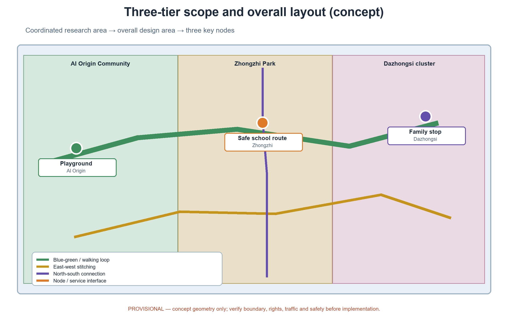
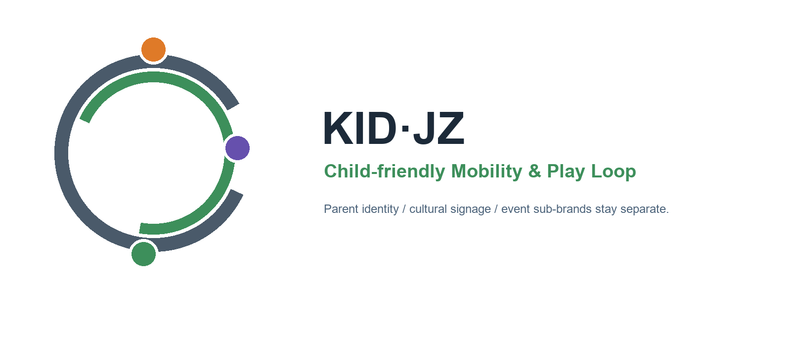
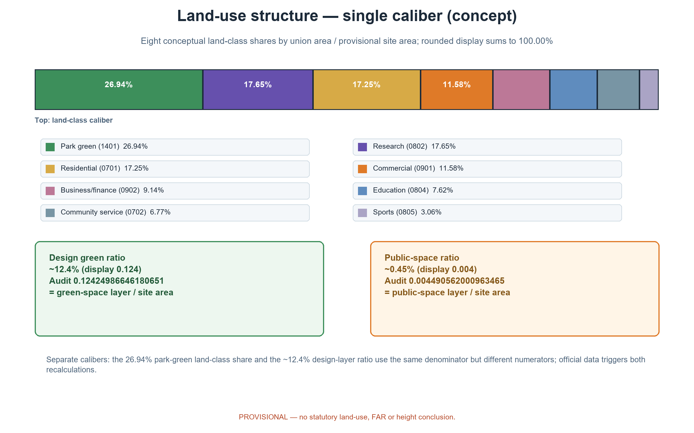
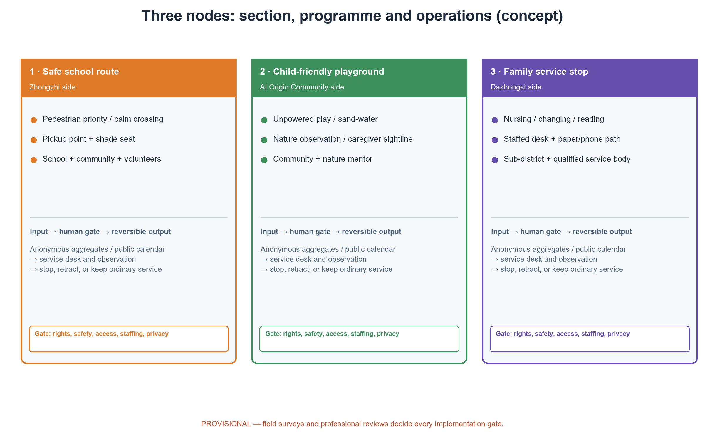
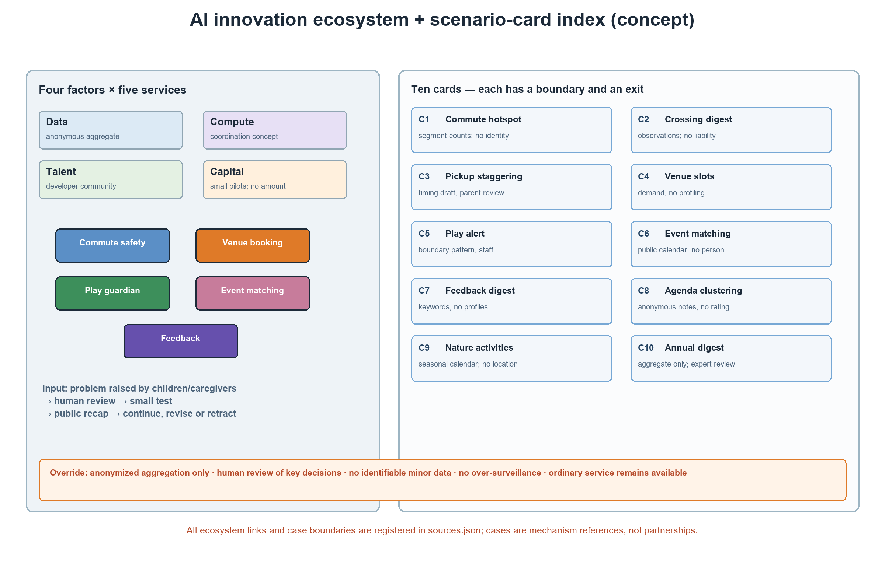
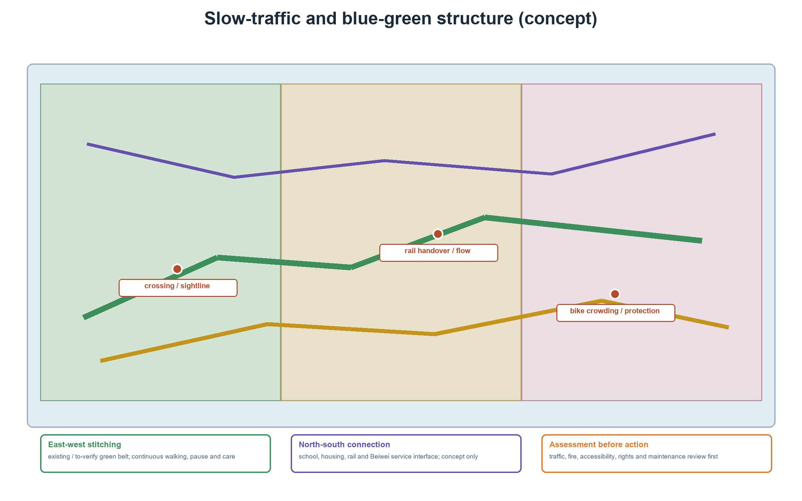
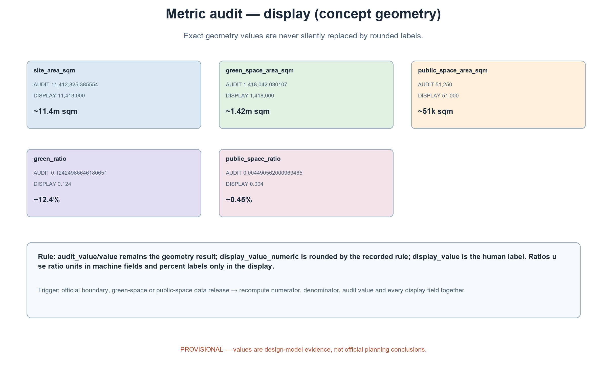

> Let children walk to school on their own; let families live in the city at ease.
> One school route - one playground - one family stop.

This is the English convenience translation of package No. 46 (Chinese original: Child-friendly Loop, KID.JZ). It targets the all-age friendly and public service dimension of the Centennial Jingzhang AI Innovation Belt open call, plus the family dimension of the youth-friendly public-space track, and responds to the public policy direction of child-friendly cities. The whole document is an open co-creation concept: it does not replace statutory planning, carries no government-confirmed conclusion, and all areas and metrics rest on provisional geometry to be recalculated when official data are published. Minor personal-information protection is a hard boundary: monitoring and guardianship are anonymized-aggregation only, no individually identifiable information is collected, no individual-identification tracking is performed, and every key decision is reviewed by a human.

## Design Basis and Source List

The governing references are, in order: the official announcement (the three-positioning, five-functions, three-areas-two-wings and the three-tier scope textual caliber), the agent taskbook excerpt (agent.1-6 tasks and boundary clauses), the site package, the public reference registry, the professional standards matrix, and the call's prohibited-statement list. The official textual caliber states: coordinated research area about 43.6 km2, overall design area about 11.4 km2, key areas about 368.4 hectares; this plan only cites that caliber in its narrative and never replaces official geometry. Policy and statutory references include the national guidance on building child-friendly cities (NDRC 2021, doc. [2021] No. 1380) and the Beijing Urban Renewal Regulation; only direction is paraphrased, official releases govern.

| Category | List item | Use |
| --- | --- | --- |
| Announcement & taskbook | Open-call announcement, agent.1-6 taskbook excerpt | Positioning, scopes, three-tier frame, task-coverage basis |
| Site package | Site materials, reference pack, standards matrix | Site conditions and urban-design depth reference |
| Policy & statute | Child-friendly city guidance, Beijing Urban Renewal Regulation | Direction reference only |
| Recomputable geometry | This package's geometry layer (nine GeoJSON files) | Provisional design recomputation and machine checks |
| International cases | Six public-channel cases (see case table) | Mechanism transfer only; no scale or outcome data |

> Evidence anchors: [source:DATA-SRC-OFFICIAL-ANNOUNCEMENT], [source:DATA-SRC-AGENT-TASKBOOK].

## Three-Level Scope Framework

The three-tier scope is linked by a single responsibility chain of problem-space-operation-evidence-exit. The official three tiers (about 43.6 km2 / about 11.4 km2 / about 368.4 ha) are the frame; this package's own recomputable sub-scope sits inside the overall design area, and its three nodes sit inside the key-area scope. The package's geometry and metrics are declared under that positioning only and introduce no separate caliber.

| Tier | Core problem | Child-friendly Loop answer | Main outputs |
| --- | --- | --- | --- |
| Coordinated research area (about 43.6 km2) | How do child and family needs become belt-wide public value and talent ecology | Child-friendly ecosystem map, six personas, ten AI+ scenario cards, regional interfaces | Ecology, industry and operation mechanisms |
| Overall design area (about 11.4 km2) | How does stock urban fabric let children walk safely and families obtain services nearby | One school route - one playground - one family stop, slow-traffic linkage, blue-green base | Land use, roads, blue-green, public space, phasing |
| Key areas (about 368.4 ha) | How do the three areas differentiate | Three prototypes: school route, playground, family stop | Node design, cross-sections, component library, operation mapping |

Regional cooperation: under the announcement's textual caliber, the belt relates to the Beiwei community, Future Science City, Huairou Science City, the economic development zone and the Beijing-Tianjin-Hebei region. This concept takes no statutory interface responsibility in either wing but reserves "service interfaces" as concepts: time-shared slots for school-route safety walks with surrounding parks, time-shared family services with neighboring communities, and annual safety-assessment disclosure open to comparison with Beijing-Tianjin-Hebei child-friendly practice. All are suggestions pending cross-area mechanism research.

> Evidence anchors: [source:DATA-SRC-AGENT-TASKBOOK].

## Coordinated Research Area: Industry and Future City Research

Industry dimension: child-friendliness is not separated from AI innovation. The five AI-augmented services (commute safety hints, venue booking, play supervision, family event matchmaking, feedback summarization) are themselves samples of the AI+ scenario enabling paradigm in family life, and scenario-based public goods for young-family talent; the open rule direction of child-friendly governance (annual safety-assessment disclosure, children's council) echoes the AI-governance global-discourse function. The ecosystem dimension is organized as an "AI innovation ecosystem map": data factors (anonymized aggregation only), computation (a future data-and-computation coordination mechanism, concept), capital (small pilot budgets only, no amount conclusions) and talent (a developer community) form loops with the five scenario services; see the scenario section and the ecosystem figure.

Benchmark cases are registered per item from public channels and summarized for mechanism only, without outcome data or scale transfer:

| Case | Source (institution & year) | Mechanism | Our transfer |
| --- | --- | --- | --- |
| UNICEF Child Friendly Cities Initiative (CFCI) | UNICEF / 2022 | Local councils, child participation, disaggregated data in local planning | Children's council, annual assessment disclosure, child participation |
| Japan joint school-route inspections | Japan Ministry of Education, MLIT, NPA / 2021 | Schools, parents, road managers, police joint inspection and measure lists | School-route co-governance and annual safety assessment disclosure |
| Woonerf residential yard streets | CROW / 2023 | 15 km/h residential yards, design elements and choice framework | Calmed cross-sections and low-speed child experience |
| Seoul School Zones | Seoul Metropolitan Government / 2021 | Speed limits, staggered pickup, parent volunteer escorts | Pickup organization and volunteer rotation (their camera practices are not cited) |
| Walking Buses | BBC (UK) / 2000 | Adult volunteer rota, fixed stops, high-visibility escort | Volunteer rotation and escort scheduling |
| Barcelona Superblocks | Barcelona City Council / 2015 | Street calming, 200 m concept walking ring, green-hub network | Green-belt node network and child-facility accessibility concepts |

Industry testing is not presented as approved operation: the "test scenarios" are conceptual interfaces inviting enterprises, communities and universities to co-solve (see the test scenario table). The international-communication system is likewise conceptual: bilingual content templates, case links and open-page design suggestions, with no promise of external publication.

### Global AI innovation-ecosystem cases (mechanism research, not child-friendly cases)

The six child-friendly/slow-mobility cases above are background references for public-space and co-governance mechanisms; they do not evidence AI ecosystem capability. To answer agent.2, six additional cases cover AI full-stack collaboration, compute, data/scenario opening, or technology testing. Each row transfers only an organisational mechanism verifiable on the public page. No scale, funding, performance, membership or outcome is transferred, and no partnership or compute access is implied.

| Case | Source / date | Verifiable mechanism | Eight-factor relevance | KID·JZ transfer | Claim / reuse boundary |
| --- | --- | --- | --- | --- | --- |
| CERN openlab | [source:DATA-SRC-CERN-OPENLAB]; CERN openlab, publication date not stated, accessed 2026-08-31 | Structured co-development by CERN, research bodies and technology providers; new computing, AI and data technologies tested under real research constraints | Industry, talent, compute, test scenarios | Translate “problem—co-development—controlled test—public review” into the three-node developer co-solving loop | Mechanism paraphrase only; no CERN/partner support or technology transfer is claimed; no page marks/assets copied |
| AIST ABCI | [source:DATA-SRC-AIST-ABCI]; AIST, launched 2018 and page notes 2025 update, accessed 2026-08-31 | Large-scale AI computing infrastructure with application, usage rules and operations boundaries | Compute, data, talent, industry | Translate “compute request—anonymous dataset—queue—result review” into a future coordination-interface concept | No local capacity, free access or eligibility is claimed; no brand/page material copied |
| Singapore AI Verify / AI Verify Foundation | [source:DATA-SRC-IMDA-AI-VERIFY]; IMDA, 2022/2023, accessed 2026-08-31 | Open-source AI-governance testing toolkit and collaboration community; claims can be compared with test results | Data, test scenarios, talent, governance | Each child-service card declares claim, test, human review and stop condition before scenario opening | It is not a safety certification or bias-free guarantee; no pass claim or toolkit code reuse |
| EuroHPC AI Factories | [source:DATA-SRC-EUROHPC-AI-FACTORIES]; European Commission / EuroHPC JU, publication date not stated, accessed 2026-08-31 | Layered access to AI-optimised supercomputing and support for startups and the innovation community | Compute, data, industry, funding, test scenarios | Concept funnel: problem call—eligibility/privacy check—compute or substitute—scenario test—withdrawal | No EU resource, free time, capacity or eligibility is claimed; no programme scale or outcomes transferred |
| Vector Institute | [source:DATA-SRC-VECTOR-INSTITUTE]; Vector Institute, publication date not stated, accessed 2026-08-31 | Research, talent development, engineering support and industry partnerships connect discovery to adoption | Talent, industry, funding, data, compute | Make KID·JZ Developer Community a bridge among researchers, students, enterprises and public-service operators, starting with paper/low-tech service | Institutional statistics and partnerships are not project commitments; no name/mark copied |
| Mila / Quebec AI Institute | [source:DATA-SRC-MILA-ECOSYSTEM]; Mila, publication date not stated, accessed 2026-08-31 | Research community, venture support, industry partners and applied teams share translation interfaces | Talent, industry, funding, space, test scenarios | Translate “community problem bank—mentor/developer—small prototype—human review—enterprise/professional handoff” into parent-child services | No collaboration, investment, admission or co-location is claimed; only the mechanism is paraphrased |

The common transfer is not “copy an innovation district” but a reversible loop: the children’s council and service staff pose the problem; inputs pass source, licence, privacy and usability checks; outputs pass human review and small-sample tests; failure of safety, eligibility, privacy or public value returns the service to paper/manual operation and removes the component. New case rights and boundaries are recorded in sources.json. The six older cases remain background references for mobility, child participation and public space and are not counted in global_case_count.

> Evidence anchors: [source:DATA-SRC-PROVISIONAL-BOUNDARIES].

## Overall Design Area: Urban Renewal and Regulatory-Plan-Level Urban Design

The overall structure is "one school route - one playground - one family stop": a child-priority school route on the Zhongzhi Park side (linking schools and residential areas, separated pedestrian priority, calmed crossings, parent pickup points); a children's playground on the AI Origin Community side (unpowered equipment, sand-and-water play, nature observation along the green belt); and a parent-child service stop on the Dazhongsi side (nursing, changing, parent-child reading, and a temporary-care intention zone). The three nodes are linked by a continuous slow-traffic and blue-green network, with connection intentions to rail stations and school entrances.

### Substantive traceability: three positionings - five functions - three areas/two wings - agents 1-6

This is a design responsibility chain, not a repetition of taskbook keywords. Each row states input, output, spatial interface, responsible actors and exit action. The three nodes and two wings are provisional concept interfaces, not statutory boundaries,招商 conclusions or engineering design.

| Agent | Positioning / five-function landing | Three areas / two wings / node | Input | Output | Spatial interface | Actors | Exit / verification gate |
| --- | --- | --- | --- | --- | --- | --- | --- |
| agent.1 overall | Centennial Jingzhang cultural belt + intelligent AI vitality city; full-stack coordination and city form | AI Origin Community, Zhongzhi Park accelerator, Dazhongsi AI industry cluster | Notice text, taskbook, provisional geometry, children’s-council questions | One-route/one-park/one-stop structure, node relation and positioning-function chain | Continuous green-belt slow traffic; Beiwèi interface remains service coordination only | Author; planning/transport/child-service advisors (to verify) | If official boundary, rights or transport conditions conflict, no implementation; return to concept map and unknown list |
| agent.2 ecosystem | AI-integrated innovation belt + AI innovation ecosystem; world-class ecosystem, full stack and scenario enabling | Zhongzhi Park accelerator ↔ Zhongguancun Technology Service Wing; shared node resources | Six global AI mechanisms, source/licence records, anonymous problem set, developer capacity | Six-case transfer, eight-factor matrix, compute/data/test application and substitute paths | Developer community + paper service desk as twin entrances; no server room assumed | Ecosystem coordinator, data steward, community/university/enterprise co-solving group | No lawful data/licence, human owner or public-value evidence: do not open; withdraw API/data, keep public service |
| agent.3 scenarios | AI-integrated innovation belt + intelligent vitality city; AI+ enabling and governance discourse | Safe route, playground, family stop and Xiaoyuehe Scenario Empowerment Wing | Anonymous aggregates, caregiver/child feedback, public calendars, human observation | Ten scenario cards, three test cards, errors and exit records | Scenarios span all three nodes; no individual-tracking system | Community/school/site staff first; technical team assists only | Identification risk, bias, complaint, qualification or missing human: kill switch + paper/phone alternative |
| agent.4 space | Centennial Jingzhang cultural belt + AI-integrated belt; public space, smart-native activity and landmarks | Playground—school route—family stop; Zhongguancun Service Wing interface | Green belt, roads, node geometry, public-history items to verify, service periods | East-west stitching, north-south connection, three landmarks, reversible kit and Dazhongsi interface | Green-belt slow traffic east-west; school/residential/rail connections north-south; Dazhongsi interface does not become招商 | Spatial/operations team; transport, landscape and access advisors (to verify) | If traffic, fire, heritage, green-space or safety gate fails: relocate/delete component |
| agent.5 culture | Centennial Jingzhang cultural belt + AI governance global discourse; AI culture and international narrative | Cultural cues, node honour displays, Zhongguancun Service Wing communication interface | Verifiable history, council stories, bilingual case links, visual motif | Bilingual copy, audience-channel-owner matrix, brand boundary | Belt logo is parent mark; cultural signage and event sub-brands remain distinct | Author/community editor, children’s council, international-communication advisor (to verify) | Unverified history, unclear portrait/trademark right or unequal translation: withdraw/rewrite as placeholder |
| agent.6 operations | AI-integrated belt + intelligent vitality city; global events, long-term operation and conversion | Three-node rotation + Zhongguancun Service Wing + Xiaoyuehe Scenario Wing | Decision cards, event feedback, developer contributions, enterprise/professional interest | Three annual programmes, developer community, graded opening and conversion chain | Events in public space; developers in service wing; enterprises receive verified briefs only | Sub-district/community operator, developer community, enterprise/professional team (concept roles) | Safety, qualification, fairness or staffing failure: stop event; remove event assets and disclose |

### Agent.4 east-west stitching, north-south connection, and Dazhongsi interface

East-west is not an unverified new road. It is a continuous “walk—pause—care” sequence along an existing/to-be-verified green belt: nature play and observation at AI Origin Community—safe school route at Zhongzhi Park—parent-child stop at Dazhongsi, using one low-glare, tactile-wayfinding, seating and paper-information kit. North-south connections use school entrances, residential interfaces, rail stations and the Beiwèi community service direction; crossings are conceptual links only until flows, rights, access and traffic organisation are checked on site.

The Dazhongsi “smart consumption/business” interface is a service study, not招商: the family stop may connect a public event calendar, voluntary parent-friendly business information, paper service vouchers and a staffed help desk to the Zhongguancun Technology Service Wing. No merchant list, rent,招商 result, commercial scale or family-consumption trail is assumed. The business side outputs consented public-service time/resource lists; the stop outputs available services and an equal human path. If qualification, privacy, child-friendliness or staffing fails, smart recommendation closes while ordinary stop service remains.

### Brand and visual identity direction (concept)

Naming: Chinese "Child-friendly Loop"; English "Child-friendly Mobility & Play Loop (KID.JZ)", meaning "children walk on the loop, families form a loop in the city". The package provides a logo artwork and visual rules (see the logo figure): a "route ring plus child-heart nodes" motif - a closed path ring holding three colored child nodes - with the Jingzhang railway grey (#4A5A6A), green-belt green (#3E8E5A) and warm orange (#E8863A); font: Noto Sans SC (OFL licensed, registered); signage direction: high contrast, large type and large tactile identifiers serving young and non-Chinese-speaking users; specific signage furniture styles remain for later deepening. Prior rights and use boundary: no trademark search was completed at the concept stage; all names and marks are treated as internal working codenames, and until rights are cleared they may not be used externally, registered or entered into any licensing process.

The renewal path is stock-first, small-scale, reversible: priority to existing green belts, street spaces and public-service facilities, no pre-set retain-renovate-demolish, no demolition areas claimed. Regulatory-plan depth is expressed as problem-spatial object-metric-data gap-recalculation path: geometry-recomputable metrics are given; statutory intensity and engineering conclusions remain pending; the concept never replaces regulatory-plan approval.

> Evidence anchors: [source:DATA-SRC-MOHURD-CONTROL-DETAILED-PLANNING], [source:DATA-SRC-PROVISIONAL-BOUNDARIES].

## Detailed Design of Key Areas

The three nodes are reference schemes for professional teams to deepen; function, scale and interface follow field survey and official data. The relationship to surrounding elements (school entrances, residential entrances, rail stations, green-belt interfaces, key intersections, slow-traffic breaks) is expressed as a "concept plus to-verify" two-column approach, with no placement conclusions.

| Node | Function | Space | Public experience interface |
| --- | --- | --- | --- |
| Safe school route (Zhongzhi Park side) | Child-priority path linking schools and homes | Separated pedestrian-priority cross-section, calmed crossings, pickup points, shaded seats | Children's independent walking is protected; parents may briefly stop; community volunteers and a human help point exist |
| Children's playground (AI Origin Community side) | Play and nature-education ground | Unpowered equipment, sand-water zone, nature-observation corner, parent rest gallery | Low-threshold bookable playground; nature classroom for four seasons; parents rest and supervise beside |
| Family service stop (Dazhongsi side) | Nursing and parent-child service point | Nursing room, changing table, reading corner, temporary-care intention zone, service desk | Pushchair access, basics first; staffed service with paper and phone equivalent paths |

Element relations (concept, pending field verification): calmed crosswalk and pickup point at the school-route school entrance; waiting platform reserved at residential entrances crossing the route; accessible slow-traffic corridor between the rail station and the service stop; low open boundaries and plant transitions at green-belt interfaces; "be seen, be slowed, can wait" calming at key intersections; slow-traffic breaks listed by intersection and crosswalk for walking protection; traffic impact assessment must precede official implementation.

Three pilgrimage landmarks (concept catalogue; everyday child-friendly marvels, not megastructures):

| Landmark | Type | Concept design | Family ritual |
| --- | --- | --- | --- |
| Play Tree House | Nature observation | Reversible timber observation deck, birdwatching points, seasonal boards | Nature classes and child-hosted tours |
| Loop Lighthouse | Safety narrative | A light-and-shadow cue on the route echoing Jingzhang signal sheds | Collect light marks to light the children's map |
| Warm House | Service friendly | Warm-orange soft eave and breastfeeding-friendly seat at the stop porch | Family service stop and honour wall |

Honour display system (concept): under the name "Honour Roll of the Loop", an honour wall in the stop and a monthly honour gallery in the park display children's proposals, community builders and annual safety guards; all honour information is published with anonymized names and project titles only, no identifiable minor details; selection is co-hosted by the children's council and the community. Reversible component library (concept): "Play Kit" library - every component carries an asset number, material intention, maintenance owner, inspection cycle and removal condition; safety demonstration precedes implementation; no electric or screen dependence.

> Evidence anchors: [data:PACKAGE-GEOMETRY] (node polygons from geometry/key_areas.geojson).

## AI Innovation Ecosystem, Personas, and AI+ Scenarios

Six personas: primary-school children (protagonists of independent commuting and play), parents with children (commute pickup and parenting-service users), grandparent caregivers (less digitally reliant; paper and human paths needed), school teachers (after-school order and safety education collaborators), young families (innovation talent choosing a home by family livability), community and children-service volunteers (co-governance participants).

Ten scenario cards (each lists inputs, outputs, model boundary, failure modes, human duties and exit mechanism; all use anonymized aggregation only, human review of key decisions, no over-surveillance):

| Scenario card | Audience | Inputs (anonymized aggregation) | Output | Model boundary & failure modes | Human duty & exit |
| --- | --- | --- | --- | --- | --- |
| Commute hotspot hint | Schools, parents | Anonymous segment counts by period | Peak-period hints | Segment statistics only; stop if identification suspected | Community review before release; no human, no service |
| Crossing-risk digest | Schools, district | Anonymous crossing observations | Risk-point digest | No liability judgements; degrade if data missing | Transport-department review; assessment precedes |
| Pickup staggering hint | Parents, volunteers | Anonymous timing statistics at pickup points | Staggering drafts | Suggestions only, no conclusions | Parent representatives confirm; satisfaction follow-up |
| Venue slot booking | Families, community | Slot demand registrations | Booking drafts | No personal profiling; waiting list on overflow | Human counter and manual scheduling first |
| Play anomaly alert | Site staff, parents | Anonymized boundary-pattern classes | Anomaly alert (no identification) | Caregiver-attention cue only; no identity recognition | Staff on site; retract on deviation |
| Family event matchmaking | Community, operators | Public calendar aggregation | Draft proposals | No personal recommendation; cancel if under-subscribed | Community staff publish; liability and exit clauses |
| Feedback clustering | Children's council, managers | Keyword clustering of opinions | Topic digests | No personal profiles; degrade for small samples | Council human discussion; public briefing |
| Council agenda clustering | Children's council | Anonymized meeting notes | Topic ranking suggestions | No individual assessment of children | Adult facilitators moderate; minutes transcribed by hand |
| Nature-activity recommendation | Families, teachers | Public seasonal calendar | Nature-class suggestions | No location collection; cancel on weather failure | Nature tutor confirms; on-site manual signup |
| Annual assessment digest | Managers, residents | Anonymous annual assessments | Draft digest summaries | Aggregate only; unknown if key data missing | Expert and resident double check; disclosure |

AI runtime quality control (concept protocol): data quality (source registration, two-signer labelling, monthly data-quality report), model evaluation (benchmark tests, human spot checks and confusion-point review), error stratification (false-alarm-rate clustering by block and time of day, anonymous groups only), runtime monitoring (human-review-rate statistics, one-click kill switch, annual re-audit and disclosure). Test scenarios and industrial co-solving are listed in the table: "test scenarios" are process interfaces, not approved operation.

| Test scenario | Invited parties | Test objective (concept) | Success criteria (concept) | Relation to AI+ services |
| --- | --- | --- | --- | --- |
| School-route safety co-governance trial | District, schools, parent volunteers | Verify "be seen, be slowed, can wait" calming and joint-inspection workflow | Participant satisfaction and walk-completion rate (anonymous) | Commute-hint AI assists behind anonymized aggregation |
| Playground playfulness trial | Community, residents, children's council, universities | Verify unpowered and nature-education list play duration and supervision ease | Anonymous stay-duration sample, parent and non-user satisfaction | Play-guardian AI alerts only |
| Family stop basic-service trial | District, professional bodies, volunteers | Verify nursing, changing, reading and human-staffed service workflow | Service registration rate, waiting time, fairness review (anonymous) | Booking AI runs parallel to paper paths |

Scenario-spatial-operation mapping: commute hints and play guardianship land on the school route and playground, co-governed by community, schools and operator; venue booking and event matchmaking land on the playground and stop, feeding time-sharing and points mechanisms; feedback crosses all three nodes, serving the children's council and annual safety-assessment disclosure. Transport-wise the services only enter commuting and transfer flows through the anonymized aggregation caliber; industry-wise the five services form product samples for young-family talent, parallel to park public-service interfaces (service stop, library-style reading corner, volunteer station); culture-wise nature observation and parent-child reading supply child-friendly cultural content; governance-wise all services follow the published direction of AI governance (anonymized aggregation only, human review of key decisions, no over-surveillance), supervised by community and authorities. All AI runs behind ordinary human service first, AI as retractable assistance: no vendor lock-in, no non-public or personal data, no immature technology presented as deployable.

### Three areas / two wings AI-ecosystem and industry-support matrix (concept interfaces)

The eight factors below are not secured resources. Each row states source, recipient, public value, failure mode, human responsibility and exit. Where there is no official, rights or budget input, the field remains unknown; no row is a land, quota, funding or compute promise.

| Factor | Possible source / present evidence | Recipient and space | Public value | Failure mode | Human responsibility | Exit |
| --- | --- | --- | --- | --- | --- | --- |
| Land | Official regulatory plan/rights data unknown; [data:PACKAGE-GEOMETRY] is a temporary layer | Current users of the three areas and two wings | Verify rights before child-friendly public service | Rights conflict, redline/heritage conflict, wrong siting | Planning, rights, heritage and community representatives verify | No implementation; remove node labels and retain unknown list |
| Space | Existing green belt/public-space layers are concept geometry; official condition unknown | AI Origin playground, Zhongzhi route, Dazhongsi stop | Low-impact, accessible, offline service and reversible parts | Inaccessible space, fire/safety/maintenance deficit | Designer plus landscape/access/fire advisors and site staff | Relocate/remove parts, restore and disclose |
| Industry | Six global AI cases are mechanism evidence; local enterprise list unknown | Zhongguancun Technology Service Wing, developer community | Turn public problems into auditable co-solving briefs, not招商 | Vendor lock-in or commercial interest displaces children’s rights | Open call, conflict-of-interest register, human review | Close enterprise interface; paper service continues |
| Funding | Funding, budget and subsidy are unknown; no amount is set | Sub-district/community operator and public programmes | Keep basic service ahead of AI procurement | No budget, short project cycle, staffing gap | Finance and supervising authority verify formal process | No event commitment; remove funding language |
| Talent | Taskbook and six personas; actual posts/headcount unknown | School, community, developer community, professional advisors | Children, caregivers and technical staff share decisions | Missing human review or invisible care labour | Name duty staff and council facilitator; log rota | No AI launch; return to human/phone/paper |
| Compute | ABCI, EuroHPC and CERN openlab are public mechanism cases; local capacity unknown | Future data-and-compute coordination mechanism (concept) | Explainable access path for small-sample testing | No eligibility, cost/energy or queue control | Check eligibility, data minimisation, resource/result audit | Use low-tech/offline rules; withdraw compute task |
| Data | Public calendars, human observation and anonymous aggregates; identifiable minor data prohibited | Scenario cards, children’s council and annual assessment | Group-level safety and service improvement only | Re-identification, sample bias, leak, purpose creep | Data steward + children’s council dual review; retention log | Delete data/interface, stop AI, disclose reason |
| Test scenarios | Three concept trials and AI Verify testing mechanism; formal site/eligibility unknown | Three nodes and Xiaoyuehe Scenario Wing | Test technology against public problems, not demos | No safety, qualification or public value; nuisance | Site safety lead, human spot checks, complaint path | Kill switch, remove component, restore ordinary service |

The receiving order is fixed: basic public service → human review → small test → public review → expand, revise or exit. The three areas and two wings must not turn a “possible source” into a signed agreement, supplied land, approval or resource allocation; Beiwèi and other external interfaces receive only verified anonymous mechanisms and public material, never personal data or unapproved planning conclusions.

> Evidence anchors: [source:DATA-SRC-GENERATIVE-AI-INTERIM-MEASURES].

## Land Use, Building Scale, and Retain-Renovate-Demolish Strategy

Land use follows the codes allowed by the call and fully covers the provisional overall scope; "one school route - one playground - one family stop" is an inter-district service responsibility structure that does not alter statutory land use; once the official regulatory plan arrives, the same algorithm re-cuts and recalculates. Single-caliber note: the shares below are class-by-class union areas over the site union area from land_use.geojson (rounded to 0.01%; deviation from 100% is rounding, under 0.05%); this caliber and the design calibers of green_ratio / public_space_ratio are two non-confusable calibers - the latter two are design-layer calibers of green_space and public_space (same denominator, site area); official data trigger recalculation by the same formulas.

| Land class (guide code) | Conceptual share | Note |
| --- | --- | --- |
| Park green space (1401) | 26.94% | Green-belt and park polygons incl. Jingzhang heritage park vibrant-belt concept segment |
| Research land (0802) | 17.65% | Park research polygons |
| Urban residential (0701) | 17.25% | Residential polygons |
| Commercial (0901) | 11.58% | Commercial polygons |
| Business & finance (0902) | 9.14% | Business polygons |
| Education/research/design (0804) | 7.62% | School and education polygons |
| Community service facilities (0702) | 6.77% | Community facility polygons |
| Sports (0805) | 3.06% | Sports facility polygons |

Building scale: all three nodes follow stock-first reversible renovation; no base area, total scale, FAR or height is given; the temporary-care intention zone scale is pending qualification and safety demonstration. Retain-renovate-demolish in four steps: verify current condition and rights first; retain when safety, heritage and function are satisfied; light renovation for accessibility, fire and family-service interfaces; relocate or delete conceptual components when unsafe or conflicting. Without survey, no demolition area is claimed; demolition volume stays unknown, no placeholder value. Character continues the Jingzhang railway plain industrial scale and Zhongguancun everyday innovation temperament: continuous eave space, low-glare lighting, durable replaceable elements, clear public entrances; formal heights, setbacks, density and fire control follow professional design.

> Evidence anchors: [source:DATA-SRC-MNR-LAND-USE-CLASSIFICATION-202311].

## Transport, Rail, Municipal Infrastructure, and Public Services

The school-route direction is "pedestrian priority with traffic calming": a separated pedestrian-priority cross-section, calmed crossings, deceleration and sight conditions, and human organization at pickup points. The slow-traffic system links the three nodes and connects to school entrances and rail stations, encouraging "rail plus walking" family trips. No road alignments, section dimensions, quantities or rail-interchange engineering conclusions are given; all traffic measures are directional concepts; traffic impact assessment (safety, calming design, capacity) must precede implementation, with transport-authority approval. Slow-traffic breaks are expressed as a concept list:

| Break type | Concept measure | On-site verification items |
| --- | --- | --- |
| Excessive crossing spacing | Calmed crossing intention | Crosswalk placement, signal timing, measured volumes |
| Poor intersection sight lines | Low open boundaries and speed cues | Sight triangles, parking and vegetation blocking |
| Rail-interchange pedestrian conflict | Separation of pickup and station flows | Station exits, measured flows, accessible routes |
| Cycle crowding on footways | Slow-space hierarchy intention | Peak cycle volumes, parking conditions |

Municipal and public services use small, replaceable, offline components: shaded seats, drinking information, night lighting and large tactile signage along the route; weather-resistant play elements and nature-observation signs at the playground; nursing, changing, reading and a human service desk at the stop. All components enter the "Play Kit" component library with asset number, maintenance owner and inspection cycle. Public-service provision follows "nearby, low threshold, staffed"; no facility counts, scales or service radii are concluded; opening times and staff schedules remain with the operator given safety and staffing conditions.

> Evidence anchors: [source:DATA-SRC-MOHURD-URBAN-DESIGN-MEASURES].

## Blue-Green Network, Public Space, and Urban Character

The blue-green network uses the existing green belt as its skeleton: shaded school route, playground unfolding along the belt, stop softening the city edge with courtyard and plants. The playground stays unpowered, nature-friendly and playable in all seasons: sand-and-water play close to nature, a nature-observation corner for local plants and migratory birds, durable repairable natural materials, no screens or electric devices. Public space prioritizes five basic provisions: tree shade, rain canopy, seats, drinking information, night-readable signage; play and rest grounds balance age-banded zoning and accessible reach, with caregiver sightlines open - all-age, elder-friendly, accessible and disability-friendly for children; pushchair families and wheelchair users share one place. Urban character fuses three narratives: Jingzhang railway memory (cultural cue points along the route, public history only), Zhongguancun everyday innovation (youth-family vitality) and child-friendly detail (low viewpoint, rounded corners, safe materials). No conflict with heritage, green-line or blue-line constraints; no internet-famous or entertainment-driven staging.

> Evidence anchors: [source:DATA-SRC-MOHURD-URBAN-DESIGN-MEASURES].

## Renewal Projects, Implementation Policy, and Phasing

Three project categories (concept direction, no quantities or investment estimates; cost expressed in qualitative tiers only):

| Category | Project direction | Main location | Cost tier (estimation method, price basis, coverage, confidence, recompute trigger) |
| --- | --- | --- | --- |
| Commute safety | Route cross-section and crossing calming, pickup organization, safety assessment disclosure | School-route corridor | Medium (rough unit prices of similar calming works; public-document year basis; facilities and signage; low confidence; recompute on official estimates) |
| Play & nature | Playground play field, nature classroom, rest facilities | AI Origin Community green belt | Medium (market average of unpowered equipment; public-document year basis; excludes utilities; low confidence; recompute on official estimates) |
| Family service | Stop basics, slot booking and time sharing, reading corner | Dazhongsi side | Low (micro-renovation of existing space; public-document year basis; furniture and service desk; low confidence; recompute on official estimates) |

Phasing is a conceptual rhythm (not a settled arrangement): near-term 1-3 years - school-route safety walk-through, playground micro-renovation and family-stop basic-service trial, establishing co-governance and safety-assessment mechanisms; mid-term 3-5 years - deepening the three nodes, slow-traffic linkage and phased trial operation of the ten scenario cards; long-term 5-10 years - a belt-wide child-friendly service network, developer community and annual assessment disclosure. Each phase assumes "assessment first, implementation after"; projects failing traffic-impact, safety or qualification conditions do not enter implementation. The RACI matrix (concept division of labour, to be confirmed by authorities before implementation) and stop/exit conditions follow:

| Task | Accountable (A) | Consulted (C) lead | Collaborators | Informed (I) |
| --- | --- | --- | --- | --- |
| School-route walk-through and disclosure | District authority | Local sub-district | Schools, PTA, volunteers | Transport specialists |
| Playground micro-renovation | Greening authority | Community, operator | Residents, children's council, universities | Landscape experts |
| Family-stop basics | Civil affairs & health authorities | Sub-district | Professional bodies, volunteers | Child-friendly research institutes |
| Scenario trial operation | Supervising authority | Operator | Enterprises, developer community | Data-compliance bodies |

Stop conditions and exit mechanisms: traffic-impact or safety assessment fails; trial misses targets two periods in a row without effective remediation; resident-support threshold reached (threshold pending hearings); compliance, qualification or privacy risk events - immediate suspension of the AI service and removal of components; all concept components are reversible, sites restored and results published after removal. Annual programme system (concept):

| Programme | Cycle | Content | Evaluation |
| --- | --- | --- | --- |
| Play Week | Annual | Unpowered-play open days and family workshops | Anonymous participant survey and council review |
| Safe Commute Day | Annual | Joint route walk-through and safety disclosure | Walk-through completion and disclosure rate (anonymous) |
| Family Nature Season | Annual | Nature-classroom four seasons and birdwatching | On-site registration and tutor feedback |

### Three-node implementation decision cards (concept gates, not implementation approval)

Each card separates what is known from this package, what must be checked in the field, the decision gate, roles, process indicators and stop/removal action. Formal targets are not invented here; supervising authorities set them only after verification.

| Node | Known in package | Unknown / field check | Decision gate | Roles | Process indicators (no target invented) | Stop / removal |
| --- | --- | --- | --- | --- | --- | --- |
| Zhongzhi-side safe school route | Concept route, pickup points and pedestrian-priority principle; Japan inspection is mechanism-only | School entrances, road rights, time-of-day flows, fire/accessibility and parent need | Traffic-impact and safety walk-through pass; human rota available; child/caregiver feedback traceable | Transport authority A; sub-district/school C; parent volunteers and design advisors | Walk-through completion, issue closure, human-review rate, complaint response, anonymous safety feedback | Any safety/rights/access gate fails: no road works; remove hint AI, keep human pickup organisation |
| AI Origin Community playground | Green-belt concept space, unpowered play, nature observation and caregiver sightlines; reversible kit | Green-space status, trees/utilities, equipment safety, age bands, seasonal maintenance, resident acceptance | Landscape/fire/access/safety review passes; nature mentor and staff available; no child identity collection | Greening authority A; community/operator C; council and landscape advisors | Site inspection, component maintenance, anonymous stay observation, council feedback, incident/near-miss log | Safety incident, maintenance gap or monitoring overreach: close/remove affected parts; ordinary park service continues |
| Dazhongsi family stop | Nursing, changing, reading, staffed desk and temporary-care intention; no qualification claimed | Building rights, health/fire, care qualification, accessibility, voluntary business info and staffing | Qualification/privacy review passes; paper/phone path first; smart-consumption interface does not track people | Civil-affairs/health authority A; sub-district C; professional bodies, businesses and volunteers | Open hours, staff presence, waiting log, service availability, anonymous fairness feedback | Qualification, privacy or staffing fails: no care/recommendation feature; close interface, keep basic stop service |

### Agent.5-6 international communication, developer community and enterprise conversion

Communication does not turn cases into endorsements. “Centennial Jingzhang AI Innovation Belt” and KID·JZ are the project narrative/work codename; the belt logo is the parent identity, cultural signage only carries verified public history, and Play Week / Safe Commute Day / Family Nature Season are separate event sub-brands. None substitutes for a government or commercial mark.

| Audience | Bilingual communication copy (concept) | Channel | Owner | Fact / rights gate |
| --- | --- | --- | --- | --- |
| Children and caregivers | “Safety first, smart assistance second: children speak, adults listen, AI can be withdrawn.” | Paper at the stop, on-site signs, children’s council | Community editor + council facilitator | Large type/tactile/equal human path; no identifiable story or photo |
| City and AI researchers | “KID·JZ tests a child-friendly, human-reviewed service loop on provisional geometry.” | Bilingual open page, research exchange | Author + research advisor (to verify) | Every number is provisional; source and licence traceable |
| Developers | “Build the smallest safe helper: anonymous input, human decision, reversible output.” | KID·JZ Developer Community, versioned interface notes | Technical-documentation owner (concept role) | Synthetic/anonymous aggregate examples only; no identifiable minor data |
| Enterprises and professional teams | “A public-problem brief is an invitation to test, not a procurement promise.” | Scenario-opening session, professional review, co-solving workshop | Zhongguancun Technology Service Wing coordinator (concept role) | Eligibility/conflict/privacy checks first; no招商, procurement or funding promise |

The conversion chain is: annual events pose a public problem → the developer community receives a verified scenario brief and joins human review/small test → an enterprise or professional team receives only a brief that passes safety, privacy, public-value and maintenance gates → community feedback and annual disclosure decide continue, revise or exit. Failure at any step returns to ordinary human service. “Conversion” means conceptual transfer of knowledge, prototype and professional collaboration, not a contract,招商 result or implementation promise.

Developer community and long-term conversion (concept): under the name "KID.JZ Developer Community", open the five scenarios' interface documentation and human-review mechanism explanations, and run periodic co-creation events; scenario opening follows graded registration (concept): internal trial first, community trial second, and the minors-assessment class limited to anonymized aggregation with human review; honours disclosure (concept: annual selection and public-display conditions, no award amounts); via points, rotation and volunteer mechanisms to sustain long-term staffing, forming a convertible-asset catalogue of "child-friendly public goods" (concept).

> Evidence anchors: [source:DATA-SRC-AGENT-TASKBOOK].

## Metrics, Area Recalculation, and Compliance Matrix

The conceptual metric system has three classes: safety (route calming completion, crossing compliance, annual assessment disclosure rate), service (stop basic-service availability, booking fairness, point-system transparency) and vitality (anonymized park-use heat, council participation, feedback closure rate). These are monitoring directions only, without target values or performance commitments. The three formal core metrics follow the contract and are recomputable from this package's geometry:

| Metric | Formula and denominator | Data source | Confidence | Use restriction | Recompute trigger |
| --- | --- | --- | --- | --- | --- |
| site_area_sqm | Site union area (EPSG:4548) | geometry/site_boundary.geojson | low (provisional) | Not an official redline or planning-area basis | Immediately on official boundary release |
| green_ratio | Green union area / site union area | geometry/green_space.geojson and site_boundary | low (provisional) | Design-model value only | On official green-space data release |
| public_space_ratio | Public-space union area / site union area | geometry/public_space.geojson and site_boundary | low (provisional) | Design-model value only | On official public-space data release |

Human-facing displays intentionally use only low-precision approximations, with the machine display numbers registered separately: site area about 11.4 million sqm (display_value_numeric=11,413,000 sqm), design green ratio about 12.4% (display_value_numeric=0.124; display_value_percent=12.4), and public-space ratio about 0.45% (display_value_numeric=0.004; display_value_percent=0.45). These are provisional design-model displays, not planning precision. Geometry-derived audit values and display values are separate fields in metrics.json: audit_value/value retains the exact geometry result, while display_value_numeric/display_value and display_rounding define the human-facing caliber; site_area_sqm, green_space_area_sqm, green_ratio and public_space_ratio are recomputed from this package's geometry in EPSG:4548, and official boundary/green/public-space data will update both audit values and all displays. The difference between the land-class caliber and the design calibers and its citation rules are in the land-use section; ratios and counts are charted on separate axes to avoid misleading visual comparison (see the metrics evidence figure). FAR, heights and other metrics depending on unpublished official controls remain unknown, values cleared, with reasons; no placeholders. The compliance matrix connects agent.1-6, the three positionings, five functions, three areas and two wings and boundary clauses item by item (see compliance_matrix.json), self-checked against the prohibited-statement list.

> Evidence anchors: [source:DATA-SRC-PROVISIONAL-BOUNDARIES], [data:PACKAGE-GEOMETRY].

## Risk, Copyright, and Compliance

| Risk | Mitigation |
| --- | --- |
| Provisional boundary misread as statutory redline | Provisional stamps on every figure and page; no area or redline conclusions |
| Concept mistaken for implementation scheme | Assessment precedes all measures; no implementation without traffic-impact assessment |
| Minors' personal-information protection breached | Anonymized aggregation only; no collectable identifiable minor information; no identification tracking; human review of key decisions; no over-surveillance |
| Concepts presented as settled arrangements | "Intention", "trial direction", "concept suggestion" wording throughout |
| Mass surveillance-style governance | Segment-level anonymous statistics only; any individual-identification approach is excluded |

Copyright and compliance: text, tables, logo and visual identity are original works by the author with AI assistance; benchmark cases are registered per item from public channels and summarized for mechanisms only, with no copying of protected images, marks or long passages; no unauthorized real trademarks, portraits or copyrighted material; public policies and statutes are paraphrased for direction, official releases govern. Generation disclosure: drafted and revised with AI assistance under human verification and finalization. Asset rights: Noto Sans SC under OFL, registered; icons, logo, map geometry and figures are original or self-generated assets, reuse boundaries in sources.json and manifest notes; no invented government bodies, all data-and-computation organisation expressed as "future data-and-computation coordination mechanism (concept)". Prior rights: no trademark search completed at concept stage; names and marks are internal working codenames pending clearance before external use or registration. This proposal is no government endorsement, implementation approval, statutory plan, construction document, investment promise or safety certification; before formal deepening, official boundaries, ownership, terrain, transport, heritage, fire and public-service surveys plus full metric recalculation are required. No definite unopen-source components; any future open-source scope must await the rights clearance above.

> Evidence anchors: [source:DATA-SRC-OFFICIAL-ANNOUNCEMENT].

## References

The following is the public-channel reference index; publisher, link, access date, licence and reuse boundary are registered in sources.json.

| Category | Item | Use |
| --- | --- | --- |
| Taskbook & site package | Agent taskbook excerpt, call site package, public reference registry, professional standards matrix | Task coverage, boundary clauses and design depth |
| Announcement | Centennial Jingzhang AI Innovation Belt open-call announcement | Three positionings, five functions, three areas / two wings, three-tier scope textual caliber |
| Policy | National guidance on building child-friendly cities (2021, No. 1380) | Growth-space friendliness and child-adapted public space direction |
| Statute | Beijing Urban Renewal Regulation | Stock renewal and urban-design linkage direction |
| Beijing practice | Public introduction of the Jingzhang Railway Heritage Park | Heritage protection, green openness, stitching the two sides |
| International framework | UNICEF Child Friendly Cities Initiative | Child participation, sector coordination, indicator monitoring |
| International cases | Japan joint school-route inspections, Dutch woonerf, Seoul school zones, UK walking bus, Barcelona superblocks | Mechanism transfer (public channels) |
| Tools & fonts | Noto Sans SC (OFL), Python ecosystem and map projection tools | Self-drawn graphics and geometry recomputation |

Before formal deepening: official boundaries, ownership, terrain, building and utility surveys, traffic-impact assessment, heritage and fire control, regulatory-plan and public-facility data, then full metric recalculation per official data.

> Evidence anchors: [source:DATA-SRC-OFFICIAL-ANNOUNCEMENT].
