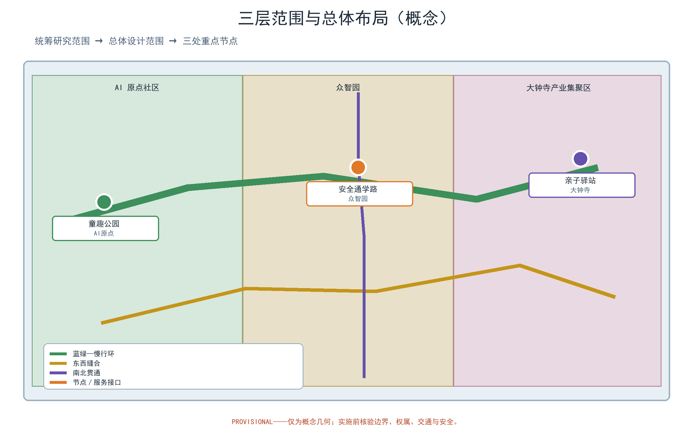
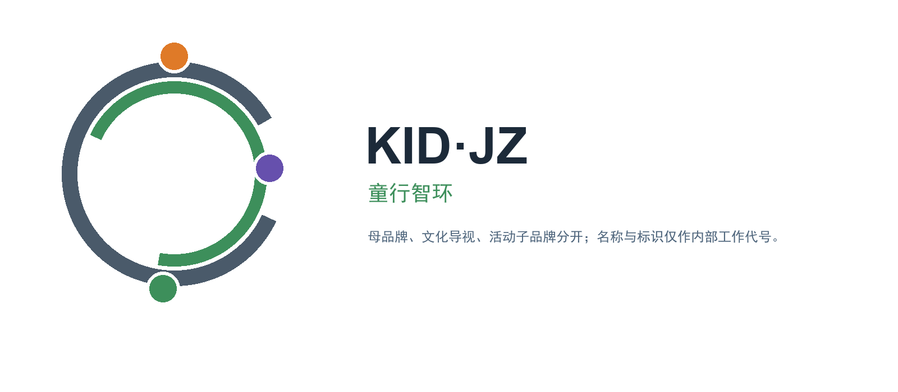
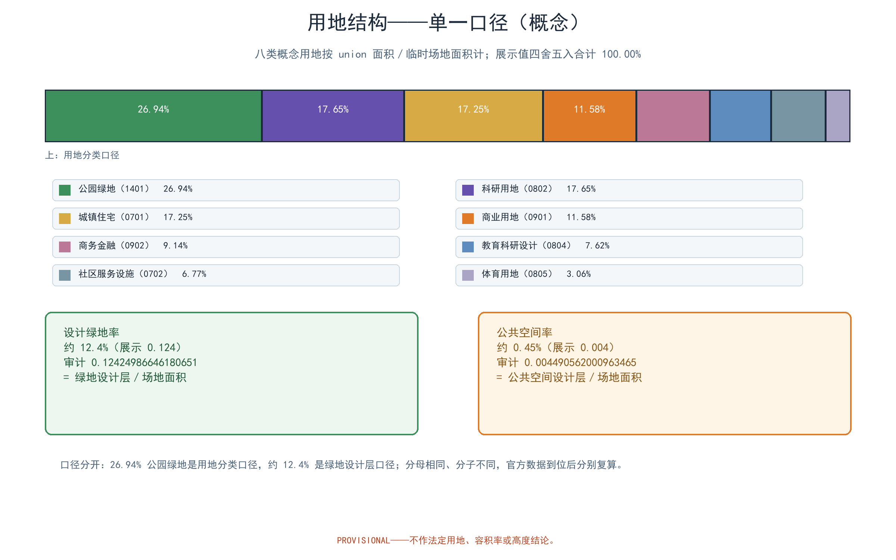
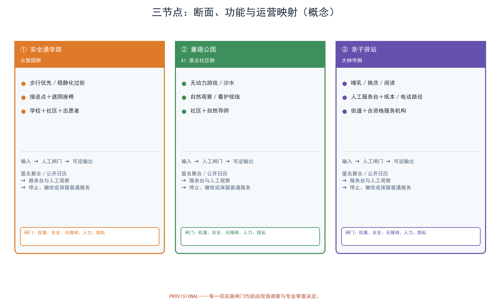
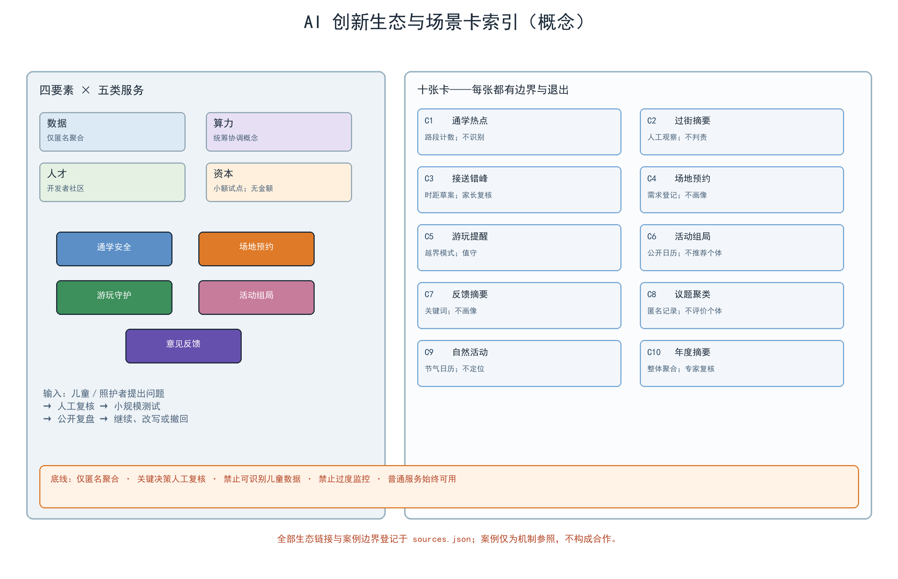
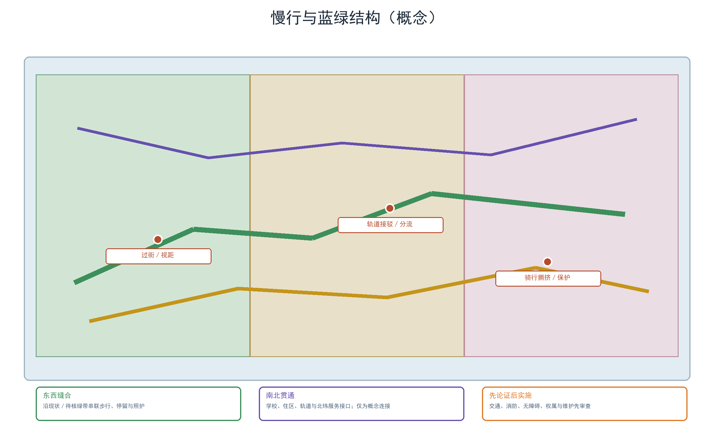
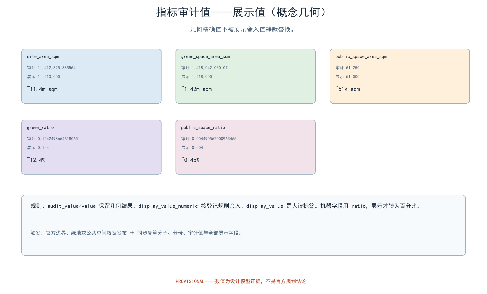

> 让孩子能自己走路上学，让家庭在城市里安心生活。
> 一学一园一角：安全通学路 · 童趣公园 · 亲子驿站。

本提案为第 46 号方案包的中文设计提案草案，面向百年京张 AI 创新带城市设计开源征集，聚焦全龄友好与公共服务设施维度、青年友好公共空间 track 的家庭维度，并回应儿童友好城市公开政策方向。方案以「一学一园一角」为空间骨架：众智园侧的儿童优先通学路、AI 原点社区侧的童趣公园、大钟寺侧的亲子驿站；以十张 AI+ 场景卡为服务触角；以「童行智环」要素机制为治理纽带。全篇为开放共创概念建议，不替代正式规划，不构成政府审定结论；所有面积与指标基于临时几何，待官方数据发布后复算。未成年人信息保护为刚性边界：一切监测与守护仅匿名聚合，严格不采集可识别未成年人的信息，不作个体识别式追踪，关键决策一律人工复核。

## 设计依据与资料清单

主控依据依次为：征集公告（三大定位、五大功能、三区两翼与三层范围的官方文本口径）、智能体任务书摘录（agent.1—6 任务与边界条款）、场地包、公开资料登记表、专业标准矩阵与本征集的禁止性表述清单。官方文本口径明确：统筹研究范围约 43.6 平方公里、总体设计范围约 11.4 平方公里、重点区域约 368.4 公顷；本方案的正文字面定位只引用该口径，不替代官方几何。政策与法规参照包括国家发展改革委等部门的《关于推进儿童友好城市建设的指导意见》（发改社会〔2021〕1380 号）与《北京市城市更新条例》，仅转述立法与政策方向，细节以官方发布为准。

对照清单如下（具体条目见本方案公开资料登记表与 sources.json）：

| 类别 | 清单项目 | 用途说明 |
| --- | --- | --- |
| 公告与任务书 | 征集公告、agent.1—6 任务书摘录 | 定位、范围、三大定位、五大功能、三区两翼与任务覆盖依据 |
| 场地包 | 场地资料、参照材料与专业标准矩阵 | 场地条件与城市设计深度参照 |
| 政策与法规 | 儿童友好城市指导意见、北京市城市更新条例 | 政策方向与法规条文方向参照 |
| 可复算几何 | 本包 geometry 层（九类 GeoJSON） | provisional 范围内的设计复算与机器校验 |
| 国际案例 | 六项公开渠道案例（见本方案案例表） | 机制转译参照，不搬尺度与成效数据 |

> **证据锚点**：[source:DATA-SRC-OFFICIAL-ANNOUNCEMENT]、[source:DATA-SRC-AGENT-TASKBOOK]（公告与任务书为文本口径依据）。

## 三层范围工作框架

三层范围以「问题—空间—运营—证据—退出」责任链贯通，避免宏观生态、总图与节点设计各说各话。官方三层范围（约 43.6 平方公里 / 约 11.4 平方公里 / 约 368.4 公顷）是总纲；本方案自身的可复算子范围落在总体设计范围之内，三处节点落在重点区域范围之内，本包 geometry 与全部指标按此定位声明，不再另设口径。

| 层级 | 核心问题 | 童行智环的回答 | 主要成果 |
| --- | --- | --- | --- |
| 统筹研究范围（约 43.6 平方公里） | 儿童与家庭需求如何转化为一带公共价值与人才生态 | 儿童友好生态图谱、六类人才、十张 AI+ 场景卡、区域接口 | 生态、产业与运营机制 |
| 总体设计范围（约 11.4 平方公里） | 存量城市如何让孩子安全上学、家庭就近获得服务 | 一学一园一角、慢行贯通、蓝绿基底 | 用地、道路、蓝绿、公共空间与分期 |
| 重点区域范围（约 368.4 公顷） | 三处片区如何差异化落地 | 通学路、童趣公园、亲子驿站三个原型 | 节点详设、断面、组件库与运营映射 |

区域协同：按公告文本口径，一带与北纬社区、未来科学城、怀柔科学城、经开区及京津冀城市群存在协同关系。本方案在两翼方向上不承担正式规划接口，但预留「服务接口」概念：通学路安全走查与周边园区共享时段、亲子驿站服务网络与周边社区的错时共享、年度安全评估公示向京津冀儿童友好实践开放比对口径——均为概念建议，待跨区机制研究后另行论证。

> **证据锚点**：[source:DATA-SRC-AGENT-TASKBOOK]（三层范围划分依据任务书官方文本口径）。

## 统筹研究范围产业与未来城市研究

产业维度：儿童友好不与 AI 创新割裂。五类 AI+ 服务（通学安全提示、场地预约、游玩守护、亲子活动组局、意见反馈）本身即是 AI+ 场景赋能新范式在家庭生活中的样本，也是面向青年家庭人才的场景化公共产品；儿童友好治理的公开规则方向（年度安全评估公示、儿童议事会）与「AI 治理全球话语权」功能相呼应。生态维度以「AI 创新生态图谱」组织：数据要素（仅匿名聚合口径）、算力（公共算力统筹协调机制，概念）、资本（试点性小额预算，无具体金额结论）、人才（开发者社区）四类要素与五个场景服务形成回路，详见 AI 场景节与生态图谱图件。

对标案例仅按公开渠道逐项登记来源、按机制概述，不引用成效数据、不搬尺度：

| 案例 | 来源（机构与年份） | 机制要点 | 本方案转译 |
| --- | --- | --- | --- |
| 联合国儿童基金会儿童友好城市倡议（CFCI） | UNICEF / 2022 | 地方理事会、儿童参与、分类数据与地方规划响应 | 儿童议事会、年度评估公示与儿童参与机制 |
| 日本通学路合同点检 | 文部科学省等三省厅 / 2021 | 学校、家长、道路管理、警方联合点检与对策清单 | 通学路共建共治与年度安全评估公示 |
| 荷兰 Woonerf 居住庭院街道 | CROW / 2023 | 15 公里/小时居住庭院、设计要素与选择框架 | 稳静化断面与低车速儿童体验 |
| 首尔儿童保护区（School Zone） | 首尔市政府 / 2021 | 限速与错峰接驳、家长志愿看护 | 接送点组织与志愿轮换（不引用其监控做法） |
| 英国步行巴士（Walking Bus） | BBC / 2000 | 成人志愿轮值、定点乘客、高可视装备 | 通学路志愿者轮换与值守编排 |
| 巴塞罗那超级街区（Superblock） | 巴塞罗那市政府 / 2015 | 街道宁静化、200 米概念步行圈、绿网串联 | 绿带节点网络与儿童设施可达性概念 |

产业测试不表述为已批准运营：本方案以「测试场景」作为邀请企业、社区与高校参与的概念接口，仅作共解流程建议（详见产业测试表）。国际传播体系同样为概念方向：双语内容模板、国际案例链接与公开资料页设计建议，不承诺任何境外发布结果。

### 全球 AI 创新生态案例（机制研究，不是儿童友好案例）

上表六项儿童友好/慢行案例只承担公共空间与共治的背景机制参照，不能证明 AI 生态能力。为回应 agent.2，另设六项真正涉及 AI 全栈、算力、数据/场景开放或技术测试的全球案例。每项只转译公开页面可核验的组织机制；不搬用其规模、资金、性能、成员数量或成效，也不暗示本方案已获得合作或算力。

| 案例 | 来源 / 日期 | 可核验机制 | 对八要素的启发 | KID·JZ 转译 | claim boundary / reuse boundary |
| --- | --- | --- | --- | --- | --- |
| CERN openlab | [source:DATA-SRC-CERN-OPENLAB]；CERN openlab，页面未标出版日期，访问 2026-08-31 | CERN、科研机构与技术提供者以结构化协作研发，在真实科研约束下测试新计算、AI 与数据技术 | 产业、人才、算力、测试场景 | 把“场景问题—共同研发—受控测试—公开复盘”转成三个节点的开发者共解流程 | 只陈述公开协作机制；不主张 CERN、企业伙伴或技术可直接导入；页面与标识不复制 |
| AIST ABCI | [source:DATA-SRC-AIST-ABCI]；AIST，2018 启动、2025 更新，访问 2026-08-31 | 面向开放使用的大规模 AI 计算基础设施，有申请、使用规则与运维边界 | 算力、数据、人才、产业 | 将“算力申请—匿名数据集—任务排队—结果审查”设为未来统筹协调机制的概念接口 | 不写本地可获得算力、容量或免费资格；仅转译治理流程；不复制品牌/页面材料 |
| Singapore AI Verify / AI Verify Foundation | [source:DATA-SRC-IMDA-AI-VERIFY]；IMDA，2022/2023，访问 2026-08-31 | 开源 AI 治理测试框架、工具包与开放协作社群，强调声明与测试结果可对照 | 数据、测试场景、人才、治理 | 每个儿童服务卡先写声明、测试项、人工复核、停止条件，再决定是否开放场景 | 不是安全认证、不保证无偏差；本方案不把测试结果写成通过证明，不复制工具代码 |
| EuroHPC AI Factories | [source:DATA-SRC-EUROHPC-AI-FACTORIES]；European Commission / EuroHPC JU，页面未标出版日期，访问 2026-08-31 | AI 优化超算与支持服务向初创企业及创新社群提供分层访问，强调计算、数据与支持的组合 | 算力、数据、产业、资金、测试场景 | 形成“问题征集—资格/隐私核验—算力或替代资源—场景评测—撤回”的概念漏斗 | 不声称获得欧盟资源、免费时长或资格；不搬用访问量、设备规模和结果数据 |
| Vector Institute | [source:DATA-SRC-VECTOR-INSTITUTE]；Vector Institute，页面未标出版日期，访问 2026-08-31 | 以研究、人才培养、工程支持和产业伙伴关系连接发现到应用 | 人才、产业、资金、数据、算力 | 把童行开发者社区设为研究者—学生—企业—公共服务方的转化中介，先做纸本/低技术版本 | 机构数据与伙伴关系不作为本项目承诺；只转译“研究到应用”的角色链，不复制商标 |
| Mila / Quebec AI Institute | [source:DATA-SRC-MILA-ECOSYSTEM]；Mila，页面未标出版日期，访问 2026-08-31 | 研究社群、创业支持、产业伙伴和应用团队共享交流/转化接口 | 人才、产业、资金、空间、测试场景 | 以“社区问题库—导师/开发者—小规模原型—人工评审—企业/专业团队接力”承接亲子公共服务场景 | 页面所述社群与伙伴规模不移植；不宣称合作、融资或入驻；只作机制概述 |

六项全球案例的共同转译不是“复制一个园区”，而是建立可撤回的闭环：问题由儿童议事会和服务人员提出，输入先做来源、许可、隐私与可用性核验；输出必须经过人工复核和小样本测试；不满足安全、资格、隐私或公共价值门槛就回到纸本服务并撤收组件。新增案例及许可/边界记录见 sources.json；旧六项背景案例仍只用于慢行、儿童参与和公共空间机制，不计入 global_case_count。

> **证据锚点**：[source:DATA-SRC-PROVISIONAL-BOUNDARIES]（边界为 provisional，研究范围仅作概念示意）。

## 总体设计范围城市更新与控规深度城市设计

总体结构为「一学一园一角」：一条儿童优先通学路（众智园侧，串联学校与住区，人车分离、过街安全保障、家长接送点）；一座童趣公园（AI 原点社区侧，沿绿带布置无动力器械、沙水游戏与自然观察）；一处亲子驿站（大钟寺侧，提供哺乳、换洗、亲子阅读与临时托管意向服务）。三者由连续慢行与蓝绿网络贯通，并与轨道站点、学校出入口形成接驳意向。

### 三大定位—五大功能—三区两翼—agent.1–6 实质追踪表

下表是设计责任链，不是把任务书关键词重复一遍。每行给出输入、输出、空间接口、责任主体和退出动作；三节点与两翼均为 provisional 概念接口，不能替代法定边界、招商或工程设计。

| agent | 三大定位 / 五大功能落点 | 三区两翼 / 节点 | 输入 | 输出 | 空间接口 | 主体 | 退出 / 验证门槛 |
| --- | --- | --- | --- | --- | --- | --- | --- |
| agent.1 总体统筹 | 百年京张文化带 + 智能化 AI 活力城市；统筹全栈体系、城市形态 | AI 原点社区、众智园加速区、大钟寺产业集聚区 | 公告文本口径、任务书、provisional geometry、儿童议事会问题 | 一学一园一角总图、三节点关系、定位—功能链 | 绿带连续慢行；北纬接口只保留服务协同方向 | 方案作者、规划/交通/儿童服务顾问（待核） | 官方边界/权属/交通条件不符时不进入实施；回退为概念图与待核清单 |
| agent.2 生态与全栈 | AI 融合创新带 + AI 创新生态；世界级生态、全栈自主创新、场景赋能 | 众智园加速区 ↔ 中关村科技服务翼；三节点共享资源 | 六项全球 AI 机制案例、来源许可、匿名问题集、开发者能力 | 六案例转译、八要素矩阵、算力/数据/测试的申请与替代路径 | 开发者社区和纸本服务台为双入口，不预设设备机房 | 生态协调人、数据合规人、社区/高校/企业共解组 | 无合法数据/许可、人工责任或公共价值证据即不开放；撤回 API/数据，不撤回公共服务 |
| agent.3 场景与治理 | AI 融合创新带 + 智能化活力城市；AI+ 场景赋能、治理话语权 | 安全通学路、童趣公园、亲子驿站及小月河场景赋能翼 | 匿名聚合计数、儿童/照护者反馈、公开日历、人工观察 | 十张场景卡、三项测试卡、错误与退出记录 | 场景跨三个节点横向挂接，不建设个体轨迹系统 | 社区/学校/值守人员先行，技术团队只作辅助 | 识别风险、偏差、投诉、资质或人工缺位即 kill-switch + 纸本/电话替代 |
| agent.4 空间与新业态 | 百年京张文化带 + AI 融合创新带；公共空间、智能原生业态与朝圣地标 | AI 原点社区童趣公园—众智园通学路—大钟寺亲子驿站 | 绿带、道路、节点 geometry、京张公开史实待核项、服务时段 | 东西缝合/南北贯通策略、三地标、可逆组件与大钟寺服务界面 | 东西向以绿带慢行连续，南北向以学校/住区/轨道接驳缝合；大钟寺消费界面接驳驿站但不招商 | 空间设计与运营团队、交通/园林/无障碍顾问（待核） | 交通影响、消防、文保、绿地或安全条件不通过即移位/删除组件 |
| agent.5 文化与传播 | 百年京张文化带 + AI 治理全球话语权；AI 新文化与国际叙事 | 文化提示点、三节点荣誉展示；中关村科技服务翼传播接口 | 可核公开史实、儿童议事会故事、双语案例链接、视觉母题 | 双语传播文案、受众—渠道—责任人矩阵、品牌边界 | 京张带 logo 为母品牌；文化标识与活动子品牌分开 | 作者/社区编辑、儿童议事会、国际传播顾问（待核） | 史实无法核验、肖像/商标权不清或翻译不等价即撤稿/改为 placeholder |
| agent.6 活动与转化 | AI 融合创新带 + 智能化活力城市；全球活动、长期运营、产业转化 | 三节点轮换 + 中关村科技服务翼 + 小月河场景赋能翼 | 三节点决策卡、活动反馈、开发者贡献、企业/专业团队意向 | 年度三活动、开发者社区、场景开放分级与转化链 | 活动在公共空间，开发者在服务翼，企业/专业团队只接收经核验的场景包 | 街道/社区运营方、开发者社区、企业/专业团队（均为概念角色） | 活动安全/资质/公平或持续人力不满足即停办；撤下活动资产并公示 |

### agent.4 东西缝合、南北贯通与大钟寺接口

东西向不是一条未经核验的新道路，而是沿既有/待核绿带连续布置“可步行、可停留、可照护”的串联：AI 原点社区的自然游戏与观察点—众智园的安全通学路—大钟寺的亲子驿站，使用同一套低眩光、触觉导视、座椅和纸本信息组件。南北向通过学校出入口、住区生活界面、轨道站点与北纬社区方向的服务接口做接驳；交叉口只画概念连接，现场流量、权属、无障碍与交通组织核验后才决定是否实施。

大钟寺侧的“智能消费/商务”只作为服务接口研究：亲子驿站可把公开活动日历、母婴友好商户自愿信息、纸本服务券与人工咨询接入中关村科技服务翼；不预设商户名单、租金、招商结果或商业规模，不采集家庭消费轨迹。商务主体的输出是经同意的公共服务时段/资源清单，驿站主体的输出是可用服务与等价人工路径；当资质、隐私、儿童友好性或运营人力不满足时，关闭智能推荐，保留普通驿站服务。

### 品牌与视觉识别方向（概念）

命名体系：中文「童行智环」，英文「Child-friendly Mobility & Play Loop（KID·JZ）」，取「儿童在环上行走、家庭在城市中成环」之意。本方案提供 Logo 成品与视觉规范（见 Logo 图件）：母题为「路环+童心点」——一条首尾相接的路径环带托起三个彩色儿童节点，色彩取京张铁路的青灰（#4A5A6A）、绿带之绿（#3E8E5A）与暖橙（#E8863A）；字体使用 Noto Sans SC（OFL 开源许可，已登记）；导视系统建议高对比、大字与大触觉标识，服务低龄与非中文用户，具体导视设施样式属后续深化内容，不在此给出成品排布图。品牌在先权利与使用边界：概念阶段未做过商标检索，全部名称与标识仅作为内部工作代号（internal working codenames），在权利澄清完成前不对外使用、不申请注册、不进入任何品牌授权流程。

城市更新路径为存量优先、小微更新、可逆改造：优先利用现状绿地、沿街空间与公共服务设施植入，不预设拆改留，不提出拆除面积。控规深度按「问题—空间对象—指标—资料缺口—复算路径」表达：已知几何可复算的指标给出，法定强度与工程结论保持待确认，不以概念方案替代控规审批。

> **证据锚点**：[source:DATA-SRC-MOHURD-CONTROL-DETAILED-PLANNING]、[source:DATA-SRC-PROVISIONAL-BOUNDARIES]。

## 重点区域详细设计

三个节点均为可供专业团队深化的参考方案，功能、规模与界面以现场调查与正式数据为准。节点与周边要素关系（学校出入口、住区入口、轨道站点、绿带界面、关键路口、慢行断点）按现状未核验基线以「概念+待核」两栏表达，不作落位结论。

| 节点 | 功能 | 空间 | 公共体验界面 |
| --- | --- | --- | --- |
| 安全通学路（众智园侧） | 串联学校与住区的儿童优先通学路径 | 人车分离的步行优先断面、稳静化过街点、家长接送点、遮阴座椅 | 孩子独立行走被保障；家长可在接送点放心短停；有社区志愿者与人工求助点 |
| 童趣公园（AI 原点社区侧） | 儿童游戏与自然教育场地 | 沿绿带布置无动力器械、沙水游戏区、自然观察角、亲子休憩廊 | 可预约的低门槛游戏场地；自然教室观察四季；家长在旁可休憩、可看护 |
| 亲子驿站（大钟寺侧） | 母婴与亲子服务点 | 哺乳室、换洗台、亲子阅读角、临时托管意向区及服务台 | 家庭推车可达、基础服务先行；服务有人值守、有纸本与电话等价路径 |

节点要素关系（概念，待现场核实）：通学路学校出入口处设置稳静化过街点与接送点；住区入口与通学路交会处预留等待平台；轨道站点与驿站之间以无障碍慢行走廊连接；绿带界面以低矮通透围护与植物过渡；关键路口执行「被看见、被减速、可等待」的稳静化处理；慢行断点以清单形式列明其中哪些路口与过街点需要补充步行保护，正式实施前必须完成交通影响论证。

三处朝圣地标（概念目录，均为儿童友好的日常奇观而非巨型构筑）：

| 地标 | 类型 | 概念设计 | 亲子打卡方式 |
| --- | --- | --- | --- |
| 「童趣树屋」 | 自然观察型 | 可逆木构观察架、鸟类观察位与四季主题牌 | 自然观察课与小主人导览 |
| 「环上灯塔」 | 安全叙事型 | 隐于通学路的光影提示点，呼应京张铁路灯房记忆 | 集齐灯号点亮儿童地图 |
| 「暖屋」 | 服务友好型 | 驿站门廊的暖橙色软檐与母乳友好座 | 亲子家庭服务站与荣誉墙 |

荣誉展示体系（概念）：以「童行荣耀榜」为名，在驿站设荣誉墙、公园设月度荣誉廊，展示小主人提案、社区共建之星与年度安全卫士；全部荣誉信息仅公开匿名化名称与项目，不公示未成年人可识别细节，荣誉评定由儿童议事会与社区共同主持。组件库（概念）：以「童趣组合件」为名的可逆公共空间组件库——所有组件具备资产编号、材质意向、维护责任人、巡检周期与撤收条件，实施前须完成组件安全性论证且不设置任何电动与屏幕依赖。

> **证据锚点**：[data:PACKAGE-GEOMETRY]（三节点示意多边形来自本包 geometry/key_areas.geojson）。

## AI 创新生态、人才画像与 AI+ 场景

六类人才画像：小学生（独立通学与游戏的主体）、带娃家长（通勤接送与育儿服务使用者）、隔代照护者（非数字依赖较重，需纸本与人工路径）、学校教师（放学秩序与安全教育协作者）、青年家庭（以家庭宜居性选择居住地的创新人才）、社区与儿童服务志愿者（共治参与者）。

十张场景卡（每卡列明输入、输出、模型边界、失败模式、人工职责与退出机制；全部仅处理匿名聚合数据，关键决策人工复核，禁止过度监控）：

| 场景卡 | 面向人群 | 主要输入（匿名聚合） | 输出 | 模型边界与失败模式 | 人工职责与退出机制 |
| --- | --- | --- | --- | --- | --- |
| 通学热点提示卡 | 学校、家长 | 通行路段匿名计数与时段 | 高位通行时段提示 | 仅路段级统计；个体识别失败需关闭 | 社区复核后发布；无人工即停用 |
| 过街风险摘要卡 | 学校、街道 | 匿名过街观察摘要 | 风险点摘要列表 | 不判定责任；数据缺失即降级 | 交通部门复核；论证前置 |
| 接送点错峰建议卡 | 家长、志愿者 | 接送点匿名时距统计 | 错峰建议草案 | 只出建议不出结论 | 家长代表确认；满意度回访 |
| 场地时段预约卡 | 家庭、社区 | 时段需求登记 | 推荐方案草案 | 不引用个人画像；超量即候补 | 现场登记与人工排班先行 |
| 游玩异常提醒卡 | 场地值守、家长 | 匿名越界模式归类 | 异常提醒（不涉及个体识别） | 仅提示照顾者视线；相机不识别个体 | 值班人员到场；偏离即撤回 |
| 亲子活动组局卡 | 社区、运营方 | 公开日历活动聚合 | 组局草案 | 不推荐个体；人数不足即取消 | 社区工作人员发布；免责与退出 |
| 意见反馈分类卡 | 儿童议事会、管理部门 | 意见关键词聚类 | 分类摘要与议题 | 不做个人画像；样本少即降层 | 议事会人工讨论；简报公示 |
| 儿童议事会议题聚类卡 | 儿童议事会 | 议事记录匿名文本 | 议题簇排序建议 | 不评少年儿童个体 | 成人社工主持；决议手工誊记 |
| 自然观察活动推荐卡 | 亲子家庭、教师 | 节气与物候公开日历 | 自然教室活动建议 | 不采集定位；天气失效即撤 | 自然导师确认；现场人工报名 |
| 年度安全评估摘要卡 | 管理部门、居民 | 年度匿名评估数据 | 评估摘要草案 | 仅整体层；关键数据缺即未知 | 专家与居民双抽检；公示 |

AI 运行质量控制（概念协议）：数据质量（来源登记、标注双签、数据质量月报）、模型评测（基准测试与人工抽检、混淆单点复核）、误差分群（按小区与时段对误报率分群分析，仅保留匿名群组）、运行监测（人工复核率统计、一键撤回开关、年度复核与公示）。测试场景与产业共解见表：以「测试场景」作为共解流程接口，不表述为已批准运营。

| 测试场景 | 邀请对象 | 测试目标（概念） | 成功与否判据（概念） | 与 AI+ 服务的关系 |
| --- | --- | --- | --- | --- |
| 通学路安全共治试点 | 街道、学校、家长志愿者 | 验证「被看见、被减速、可等待」稳静化与联合点检流程 | 参与者主观满意度与安全走查完成度（匿名问卷） | 通学安全提示 AI 仅作匿名聚合辅助 |
| 童趣公园无动力游戏试点 | 社区、居民、儿童议事会、高校 | 验证无动力与自然教育清单的游玩时长与看护便利 | 匿名观察的停留时长、家长与非参与居民满意度 | 游玩守护 AI 仅作异常提醒辅助 |
| 亲子驿站基础服务试点 | 街道、专业机构、志愿团队 | 验证哺乳换洗、阅读与人工值守服务流程 | 基础服务登记率、等候时间与公平性评估（匿名） | 场地预约 AI 与人工等价路径并行 |

场景与空间运营映射：通学安全提示与游玩守护落在通学路与童趣公园，由社区、学校与运营方共建共治；场地预约与亲子活动组局落在童趣公园与亲子驿站，接入错时共享与积分机制；意见反馈横贯三个节点，服务于儿童议事会与年度安全评估公示。交通维度上，场景服务只从匿名聚合口径接入通学与接驳流程；产业维度上，五类服务构成面向青年人才家庭的产品样本，与园区公共服务接口（驿站、图书馆式阅读角、志愿服务站）并行；文化维度上，自然观察与亲子阅读提供儿童友好的文化内容；治理维度上，全部服务遵循 AI 治理的公开方向（仅匿名聚合、关键决策人工复核、禁止过度监控），并由社区与主管部门共同监督。所有 AI 场景均以普通服务先行、AI 仅作可撤回的辅助为底线：不依赖指定供应商，不使用非公开数据与个人隐私，不把未成熟技术写成已可全面部署。

### 三区两翼 AI 生态与产业支撑矩阵（概念接口）

八要素不是已落实资源清单。下表把“来源—接收方—公共价值—失败模式—人工责任—退出”逐项写明；凡没有官方、权属或预算输入的地方均标为 unknown，不能被理解为供地、配额、融资或算力承诺。

| 要素 | 可能来源 / 当前证据 | 接收方与空间 | 公共价值 | 失败模式 | 人工责任 | 退出 |
| --- | --- | --- | --- | --- | --- | --- |
| 土地 | 官方控规/权属资料 unknown；[data:PACKAGE-GEOMETRY] 仅为临时图层 | 三区节点与两翼的现状空间使用方 | 先厘清权利再做儿童友好公共服务 | 权属冲突、红线/文保冲突、错误选址 | 规划、权属、文保与社区代表核验 | 不得进入实施；撤回节点标注，保留问题清单 |
| 空间 | 现状绿带、公共空间图层为概念 geometry；官方现状 unknown | AI 原点公园、众智园通学路、大钟寺驿站 | 低干预、无障碍、离线服务与可逆部件 | 空间不可达、消防/安全/维护不足 | 设计师、园林/无障碍/消防顾问与值守人员 | 移位或撤收组件，恢复原状并公示 |
| 产业 | 六项全球生态案例为机制证据；本地企业清单 unknown | 中关村科技服务翼、开发者社区 | 让公共问题成为可审计的共解题，而非招商口号 | 供应商锁定、商业利益挤压儿童权益 | 公开征集、利益冲突登记、人工评审 | 取消企业接口，纸本服务继续 |
| 资金 | 资金来源、预算、补贴均 unknown；不设金额 | 街道/社区运营方与公益活动 | 保障基础服务先于 AI 采购 | 无预算、短期项目化、人员断档 | 财务与主管部门按正式程序核验 | 不承诺活动；删除成本与融资表述 |
| 人才 | 任务书要求与六类 persona；实际岗位/人数 unknown | 学校、社区、开发者社区、专业顾问 | 让儿童、照护者和技术人员共同决策 | 人工复核缺席、照护劳动不可见 | 指定值守和儿童议事会主持人，记录轮值 | AI 不上线，退回人工/电话/纸本 |
| 算力 | ABCI、EuroHPC、CERN openlab 仅为公开机制案例；本地容量 unknown | 未来数据与算力统筹协调机制（概念） | 让小样本测试有可解释的资源申请路径 | 无资格、成本/能耗不可控、排队延迟 | 申请资格、数据最小化、资源与结果审计 | 使用本地低技术/离线规则，撤回算力任务 |
| 数据 | 公开日历、人工观察、匿名聚合；未成年人可识别数据禁止 | 场景卡、儿童议事会与年度评估 | 只支持群体级安全与服务改进 | 重新识别、样本偏差、泄露、目的外使用 | 数据保护责任人 + 儿童议事会双审，记录留存期限 | 删除数据与接口，停止 AI，公开原因 |
| 场景 | 三项概念测试场景、AI Verify 测试机制；正式场地/资格 unknown | 三节点与小月河场景赋能翼 | 以真实公共问题检验技术而非追逐演示 | 无安全/资质/公共价值，测试扰民 | 现场安全负责人、人工抽检、公众投诉通道 | kill-switch、撤下组件、恢复普通服务 |

矩阵的接收顺序固定为“基础公共服务—人工复核—小规模测试—公开复盘—是否扩大”。三区两翼不得把上述“可能来源”写成已签约、已供地或已获批；北纬社区等外部接口只接收可核验的匿名机制与公开资料，不输出个人数据或未审定规划结论。

> **证据锚点**：[source:DATA-SRC-GENERATIVE-AI-INTERIM-MEASURES]（AI 生成内容治理表述的参照依据）。

## 用地、建筑规模与拆改留方案

用地表达采用征集允许的分类代码，并完整覆盖临时总体范围；「一学一园一角」是跨区服务责任结构，不改变法定用地性质，官方控规到位后以同一算法重切复算。单一口径说明：下表分类占比按 land_use.geojson 各用地图斑 union 面积除以场地 union 面积计算（占比四舍五入至 0.01%，合计与 100% 的偏差源于舍入，偏差小于 0.05%）；该口径与 green_ratio、public_space_ratio 并列为两个互不混淆的口径——后两者为 green_space、public_space 设计图层口径（分母同为场地面积），官方数据发布后按同一公式触发复算。

| 用地分类（分类指南代码） | 概念占比 | 说明 |
| --- | --- | --- |
| 公园绿地（1401） | 26.94% | 绿带与公园类图斑，含京张遗址公园活力带概念段 |
| 科研用地（0802） | 17.65% | 园区科研类图斑 |
| 城镇住宅用地（0701） | 17.25% | 住区类图斑 |
| 商业用地（0901） | 11.58% | 商业类图斑 |
| 商务金融用地（0902） | 9.14% | 商务金融类图斑 |
| 教育科研设计用地（0804） | 7.62% | 学校与教育设施类图斑 |
| 城镇社区服务设施用地（0702） | 6.77% | 社区服务设施类图斑 |
| 体育用地（0805） | 3.06% | 体育设施类图斑 |

建筑规模：三个节点均以存量优先、可逆轻改造为方向，不给出基底面积、总建筑规模、容积率或建筑高度；亲子驿站的临时托管意向区规模须在资质与安全论证后确定。拆改留执行四步：先核实现状与权利；满足安全、文保与功能时保留；需要无障碍、消防与家庭服务界面时轻改；不满足安全或冲突时移位或删除概念部件。没有调查就不提出拆除面积，拆除量保持 unknown，不设占位值。建筑风貌延续京张铁路的朴素工业尺度与中关村的日常创新气质：连续檐下空间、低眩光照明、耐久易换部件与清晰的公共入口；正式高度、退线、密度与消防由后续专业设计确定。

> **证据锚点**：[source:DATA-SRC-MNR-LAND-USE-CLASSIFICATION-202311]（用地分类名称参照现行国标口径）。

## 交通、轨道、市政与公共服务设施

通学路方向为「人车分离与交通稳静化」：分离明确的步行优先断面、被稳静化的过街点、减速与瞭望条件、以及家长接送点的人性化组织。慢行系统贯通三个节点，并形成与学校出入口、轨道站点的接驳意向，鼓励「轨道+步行」的家庭出行。本方案不给出道路线形、断面尺寸、工程量与轨道接驳工程结论；所有交通措施均为方向性概念，正式实施前必须完成交通影响论证（含交通安全、稳静化设计与通行能力专业论证），并通过交通主管部门审定。慢行断点以概念清单表达：

| 断点类型 | 概念对策 | 现状核实项 |
| --- | --- | --- |
| 过街间距过长 | 增设稳静化过街点意向 | 人行横道位置、信号配时、实测过街流量 |
| 路口视距不佳 | 低矮通透界面与减速提示 | 视距三角、现状停车与绿植遮挡 |
| 轨交接驳人流交叉 | 接送点与站体步行流线分离意向 | 站体出入口、人流实测、无障碍路径 |
| 非机动车挤占步行 | 慢行空间分级意向 | 高峰骑行流量、停放现状 |

市政与公共服务设施采用小而可换的离线组件：通学路沿线的遮阴座椅、饮水信息、夜间照明与大字触觉导视；童趣公园的耐候游戏部件与自然观察标识；亲子驿站的哺乳、换洗、阅读与人工服务台。所有组件进入「童趣组合件」组件库，具备资产编号、维护责任人与巡检周期。公共服务设施配套以「就近、低门槛、有人值守」为原则，不给出设施数量、规模与服务半径结论；驿站与公园的开放时段、值守安排由运营方在安全与人员条件明确后确定。

> **证据锚点**：[source:DATA-SRC-MOHURD-URBAN-DESIGN-MEASURES]（市政与慢行设计表述的方法参照）。

## 蓝绿空间、公共空间与城市风貌

蓝绿网络以现有绿带为骨架：通学路林荫化、童趣公园沿绿带展开游戏与自然教育、亲子驿站以庭院与植物软化城市界面。「童趣公园」坚持无动力、自然友好与四季可玩：沙水游戏亲近自然，自然观察角让孩子认识本地植物与候鸟，游戏设施采用耐久可修的自然材料，不设屏幕与电动设备。公共空间优先做五项基本配置：树荫、雨棚、座椅、饮水信息、夜间可读导视；游戏与休憩场地兼顾高低龄分区与无障碍触达，家长看护视线通透——面向全龄、适老、无障碍与残障儿童友好，推婴儿车家庭与轮椅使用者同享一处。城市风貌融合三层叙事：京张铁路的历史记忆（沿路的文化提示点，以公开史实为准）、中关村的创新日常（青年家庭的活力界面）、儿童友好的细节（低矮视角、圆角、安全材料）。不与文保、绿地与蓝线约束冲突，不以网红化、娱乐化手法包装节点。

> **证据锚点**：[source:DATA-SRC-MOHURD-URBAN-DESIGN-MEASURES]（蓝绿空间组织的方法参照）。

## 更新项目清单、实施政策与分期计划

三类项目清单（概念方向，不含工程量与投资测算；成本仅按定性级表达）：

| 类别 | 项目方向 | 主要落点 | 成本级别（概算方法、价格基期、包含范围、置信等级、复算触发） |
| --- | --- | --- | --- |
| 通学安全类 | 通学路断面与过街稳静化、接送点组织、安全评估公示 | 通学路沿线 | 中（按同类道路稳静化案例单价粗估；基期为公开资料年份；含设施与标识；低置信；官方概算发布后复算） |
| 游戏自然类 | 童趣公园游戏场、自然教室、亲子休憩设施 | AI 原点社区侧绿带 | 中（按无动力设施市场均价粗估；基期为公开资料年份；不含管线；低置信；概算发布后复算） |
| 亲子服务类 | 亲子驿站基础服务、场地预约与错时共享、阅读角 | 大钟寺侧 | 低（按既有空间微改造粗估；基期为公开资料年份；含家具与人工台；低置信；概算发布后复算） |

分期实施为概念节奏（非已确定安排）：近期 1—3 年，先行通学路安全走查、童趣公园小微改造与亲子驿站基础服务试点，建立共建共治与安全评估机制；中期 3—5 年，完成三节点空间深化、慢行贯通与十张场景卡的分阶段测试运营；远期 5—10 年，形成覆盖一带的儿童友好服务网络、开发者社区与年度评估公示制度。每期以「先论证、后实施」为前提，交通影响论证、安全与资质条件不满足的项目不进入实施。RACI 责任矩阵（概念分工，实施前须经主管部门确认）与停止/退出条件如下：

| 任务 | 主管部门（A） | 试点牵头单位（C） | 协作方 | 咨询方（I） |
| --- | --- | --- | --- | --- |
| 通学路安全走查与公示 | 区级主管部门 | 属地街道 | 学校、PTA、志愿者 | 交通专业团队 |
| 童趣公园小微改造 | 绿化主管部门 | 社区、运营方 | 居民、儿童议事会、高校 | 园林专家 |
| 亲子驿站基础服务 | 民政与卫生部门 | 街道 | 专业机构、志愿者 | 儿童友好研究机构 |
| 场景测试运营 | 主管部门审计 | 运营方 | 企业、开发者社区 | 数据合规机构 |

停止条件与退出机制：交通影响论证或设施安全评估不通过；试点连续两期目标未达标且整改无效；居民意见不支持度达阈值（具体阈值待听证定）；遇合规、资质或隐私风险事件时立即停用相应 AI 服务并撤收组件——全部概念部件必须可逆，撤收后场地恢复原状并公示结果。年度活动体系（概念）：

| 活动品牌 | 周期 | 内容 | 评估方式 |
| --- | --- | --- | --- |
| 童玩周 | 每年 | 无动力游戏开放日与亲子工作坊 | 参与者匿名问卷与儿童议事会复盘 |
| 安全通学日 | 每年 | 通学路联合走查与安全评估公示 | 走查完成度与整改公示率（匿名） |
| 家庭自然季 | 每年 | 自然教室四季活动与候鸟观察 | 现场登记与自然导师反馈 |

### 三节点实施决策卡（概念闸门，不是实施批准）

每张卡先列已知与未知，再列现场核验、决策门槛、角色、过程指标和停止撤收动作；数值指标只在正式核验后由主管部门设定，本表不创造目标值。

| 节点 | 已知（包内） | 未知 / 现场核验 | 决策闸门 | 角色 | 过程指标（不设目标值） | 停止 / 撤收 |
| --- | --- | --- | --- | --- | --- | --- |
| 众智园侧安全通学路 | 概念路线、接送点和人车分离原则；日本点检只作机制参照 | 学校出入口、道路权属、时段流量、消防/无障碍、家长真实需求 | 交通影响与安全走查通过；人工值守可排班；儿童/照护者意见可追踪 | 交通主管部门 A；街道/学校 C；家长志愿者与设计顾问协作 | 走查完成、问题闭环、人工复核率、投诉响应、匿名安全感反馈 | 任一安全/权属/无障碍门槛不通过即不改路；撤下提示 AI，保留人工接送组织 |
| AI 原点社区童趣公园 | 绿带概念空间、无动力游戏、自然观察与看护视线；组件可逆 | 绿地性质、树木/管线、设施安全、年龄分区、四季维护与居民接受度 | 园林/消防/无障碍/安全审查通过；自然导师与值守到位；不采集儿童身份 | 绿化主管部门 A；社区/运营方 C；儿童议事会和园林顾问协作 | 现场巡检、部件维护、匿名停留观察、议事会反馈、事故/近失事件记录 | 出现安全事故、维护断档或监测越界即封闭相关部件并撤收；普通公园服务继续 |
| 大钟寺侧亲子驿站 | 哺乳、换洗、阅读、人工服务台与临时托管意向；不承诺资质 | 房屋权属、卫生/消防、托育资质、无障碍、商户自愿信息和人员班次 | 资质与隐私审查通过；纸本/电话等价路径先行；智能消费接口不追踪个体 | 民政/卫生等主管部门 A；街道 C；专业机构、商户和志愿者协作 | 开放时段、人工在岗、等候记录、服务可用性、匿名公平反馈 | 资质、隐私或人力不足即不开放托管/推荐；关闭接口，保留基础驿站服务 |

### agent.5–6 国际传播、开发者社区与企业转化链

传播不把案例包装成荣誉背书。母品牌“百年京张 AI 创新带”与 KID·JZ 是项目叙事/工作代号；京张带 logo 负责母品牌识别，文化导视标识只讲经核公开史实，童玩周/安全通学日/家庭自然季是活动子品牌，三者不混用，不代替任何政府或商业商标。

| 受众 | 双语传播文案（概念） | 渠道 | 责任人 | 事实/权利门槛 |
| --- | --- | --- | --- | --- |
| 儿童与照护者 | “先有安全路，再有聪明服务：孩子能说、成人能听、AI 可撤回。” | 驿站纸本、现场导视、儿童议事会 | 社区编辑 + 儿童议事会主持人 | 大字/触觉/人工等价路径；不放个体故事或照片 |
| 城市与 AI 研究者 | “KID·JZ tests a child-friendly, human-reviewed service loop on provisional geometry.” | 双语公开资料页、研究分享会 | 作者 + 研究顾问（待核） | 每个数字带 provisional 标签；来源与许可可追溯 |
| 开发者 | “Build the smallest safe helper: anonymous input, human decision, reversible output.” | 童行开发者社区、版本化接口文档 | 技术文档负责人（概念角色） | 只开放合成/匿名聚合样例；不开放未成年人可识别数据 |
| 企业与专业团队 | “A public-problem brief is an invitation to test, not a procurement promise.” | 场景开放会、专业评审、企业共解工作坊 | 中关村科技服务翼协调人（概念角色） | 先验资/利益冲突/隐私审查；不承诺招商、采购或融资 |

转化链为：年度活动提出公共问题 → 童行开发者社区领取经核验的场景 brief、参加人工评审和小规模测试 → 企业/专业团队接收通过安全、隐私、公共价值与维护能力门槛的场景包 → 以社区反馈和年度公示决定继续、改写或退出。任何一步失败都回到普通人工服务；“转化”只指知识、原型和专业协作的概念转移，不是合同、招商或落地承诺。

开发者社区与长期转化（概念）：以「童行开发者社区」为名，开放五类场景的接口文档与人工复核机制说明，定期开办场景共创活动；场景开放遵循分级备案（概念）：先内部试点、再社区试点、最后一类（涉未成年人评估类）仅限匿名聚合口径并由人工复核；获奖与荣誉公示（概念：年度评选与公开展示条件，不承诺任何奖项额度）；通过积分、轮换与志愿机制保障长期运营人力，形成「儿童友好公共产品」的可转化资产目录（概念）。

> **证据锚点**：[source:DATA-SRC-AGENT-TASKBOOK]（分期与实施条目对应任务书要求）。

## 指标体系、面积复算与合规矩阵

概念指标体系分三类：安全类（通学路段稳静化完成度、过街点达标情况、年度安全评估公示率）、服务类（驿站基础服务可用性、场地预约公平性、亲子服务积分透明度）、活力类（公园使用热度的匿名聚合、儿童议事会参与度、反馈闭环率）。上述为概念监测方向，不含具体目标数值与绩效承诺。三项 formal 核心指标按征集合同执行，均可在本包 geometry 上复算：

| 指标 | 公式与分母 | 数据来源 | 置信等级 | 用途限制 | 复算触发 |
| --- | --- | --- | --- | --- | --- |
| site_area_sqm | 场地 union 面积（EPSG:4548 投影） | geometry/site_boundary.geojson | 低（provisional） | 不作正式红线或规划面积依据 | 官方边界发布后立即复算 |
| green_ratio | 绿地 union 面积 / 场地 union 面积 | geometry/green_space.geojson 与 site_boundary | 低（provisional） | 仅作设计模型值 | 官方绿地数据发布后复算 |
| public_space_ratio | 公共空间 union 面积 / 场地 union 面积 | geometry/public_space.geojson 与 site_boundary | 低（provisional） | 仅作设计模型值 | 官方公共空间数据发布后复算 |

人读显示只保留低精度约数，并在机器字段中单独登记展示数值：场地面积约 11.4 百万平方米（display_value_numeric=11,413,000 sqm）、设计绿地率约 12.4%（display_value_numeric=0.124；display_value_percent=12.4）、公共空间率约 0.45%（display_value_numeric=0.004；display_value_percent=0.45）。这些是临时几何的设计模型显示，不是规划精度。机器审计值与展示值分别记录在 metrics.json 的 audit_value/value 与 display_value_numeric/display_value 字段，且每项有 display_rounding；site_area_sqm、green_space_area_sqm、green_ratio、public_space_ratio 均由本包 geometry 按 EPSG:4548 复算，官方边界/绿地/公共空间数据到位后按同一公式更新审计值与全部显示。用地分类占比与设计绿地率两个口径的差异及其引用规则见用地章节；比例与计数分轴作图，避免视觉等效误导（见指标证据图）。容积率、建筑高度等依赖未公开官方控制条件的指标保持 unknown、数值置空并说明原因，不以占位值替代。合规矩阵逐条连接任务书 agent.1—6、三大定位、五大功能、三区两翼与边界条款（见 compliance_matrix.json），并对照禁止性表述清单自查。

> **证据锚点**：[source:DATA-SRC-PROVISIONAL-BOUNDARIES]、[data:PACKAGE-GEOMETRY]（本包几何按 provisional 口径复算）。

## 风险、版权与合规说明

| 风险 | 应对措施 |
| --- | --- |
| 临时边界被误读为法定红线 | 全图全篇 provisional 标注；不出现面积与红线结论 |
| 概念被当作实施方案 | 通学路与设施论证前置、交通影响论证未过不实施 |
| 未成年人信息保护底线被突破 | 仅匿名聚合、严格不采集可识别未成年人信息、不作个体识别式追踪、关键决策人工复核、禁止过度监控 |
| 设想被表述为已确定安排 | 一律使用「意向」「试点方向」「概念建议」表述 |
| 批量监控式治理 | 只保留路段级匿名统计；任何个体识别做法不予采用 |

版权与合规：本提案文字、表格、Logo 与视觉识别方向由投稿者与 AI 协作原创；对标案例仅按公开渠道逐一登记来源并概述机制，不复制受版权保护的图片、标识与大段文本；未经授权不提及真实企业商标、不使用人物肖像与版权材料；引用公开政策与法规时仅转述方向并注明以官方发布为准。生成方式披露：本草案由 AI 辅助撰写与修订，人类作者负责事实核验与定稿。资产权利说明：字体 Noto Sans SC 为 OFL 开源许可并已登记；图标、Logo、地图几何与图件均为本包原创或自生成资产，重新绘制使用边界见 sources.json 与 manifest 备注；不设置任何拟设政府部门，涉及数据与算力的组织表达统一为「未来数据与算力统筹协调机制（概念）」。品牌在先权利：概念阶段未完成商标检索，名称与标识仅作内部工作代号，检索澄清前不对外使用与注册。本方案不构成政府背书、实施批准、法定规划、施工图、投资承诺或安全认证；正式深化前须补齐官方边界、权属、地形、交通、文保、消防与公共服务调查，并复算全部指标。暂无明确无法开源成分；若后续放开开源范围，需先完成上述权利澄清。

> **证据锚点**：[source:DATA-SRC-OFFICIAL-ANNOUNCEMENT]（征集规则为权属与合规表述的依据）。

## 参考资料

以下为按公开渠道登记的来源索引，发布者、链接、获取日期、许可与复用边界以 sources.json 正式登记表为准。

| 类别 | 条目 | 用途说明 |
| --- | --- | --- |
| 任务书与场地包 | 面向智能体任务书摘录、征集场地包、公开资料登记表与专业标准矩阵 | 任务覆盖、边界条款与设计深度依据 |
| 公告 | 百年京张AI创新带城市设计征集公告 | 三大定位、五大功能、三区两翼与三层范围文本口径 |
| 政策 | 关于推进儿童友好城市建设的指导意见（发改社会〔2021〕1380号） | 成长空间友好与公共空间适儿化方向 |
| 法规 | 北京市城市更新条例 | 存量更新与城市设计衔接方向 |
| 北京实践 | 京张铁路遗址公园公开介绍 | 遗产保护、绿色开放与缝合两侧方向 |
| 国际框架 | 联合国儿童基金会儿童友好城市倡议（CFCI） | 儿童参与、部门协作、指标监测框架 |
| 国际案例 | 日本通学路合同点检、荷兰 Woonerf、首尔儿童保护区、英国步行巴士、巴塞罗那超级街区 | 机制转译参照（公共渠道概述） |
| 工具与字体 | Noto Sans SC（OFL）、Python 生态与地图投影工具 | 自绘图文与几何复算工具链 |

正式深化前须补充官方边界、权属、地形、建筑与管线调查、交通影响论证、文保与消防控制、控规与公共设施专项数据，并按官方数据复算全部指标。

> **证据锚点**：[source:DATA-SRC-OFFICIAL-ANNOUNCEMENT]（本清单首条即组织方公开资料包）。
