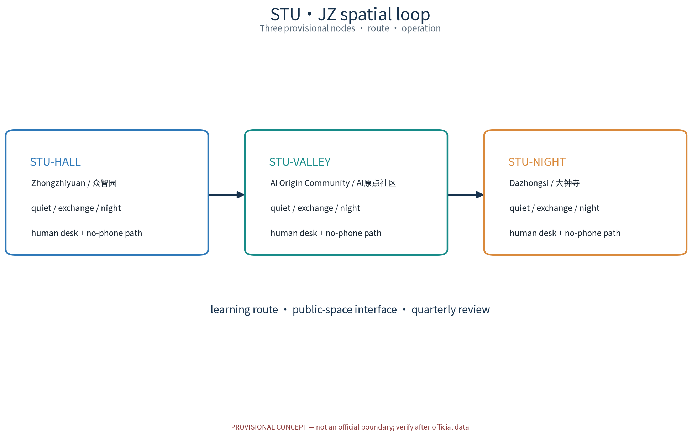
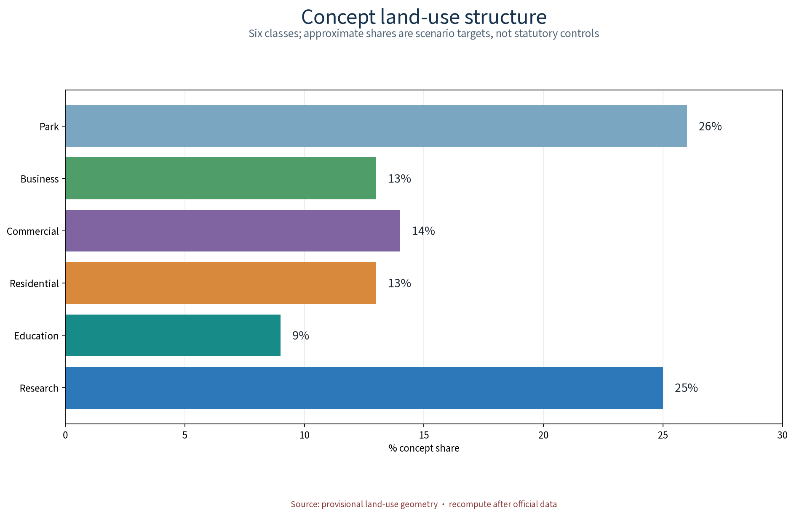
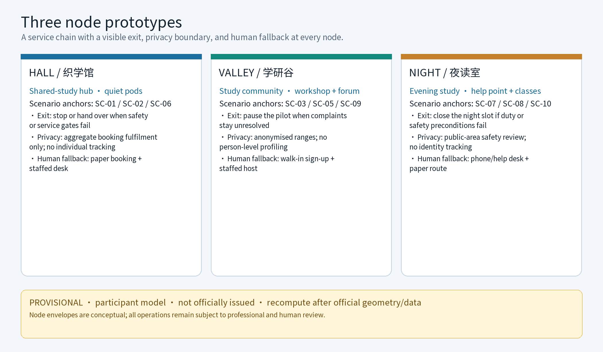
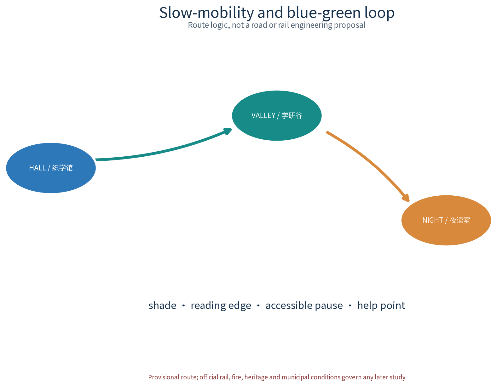
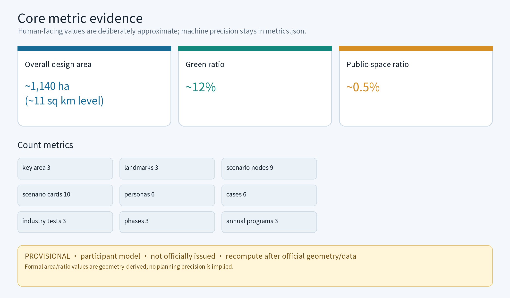

> One hall, one valley, one night room: weave a city of study; one moment, one key, one ledger: loop a belt of wisdom.

This proposal responds to the taskbook's public-service facilities, youth-friendly public space and university innovation-belt dimensions with the "WEAVE-STUDY LOOP STU·JZ" concept: three learning anchors (STU-HALL near Zhongzhiyuan, STU-VALLEY near the AI Origin Community, STU-NIGHT Room near Dazhongsi), a learning route as the loop, six persona profiles and ten AI+ scenario cards as the enabling layer, and mechanisms including Timed Study-Pod Reservation, Study-Space Usage Covenant, Study Credits, Joint Deliberation and Annual Study-Activity Disclosure as operating rules. All spatial proposals are concept suggestions and reference material for professional teams; they are not statutory plans, engineering feasibility, investment estimates, or confirmed implementation arrangements.

## Design Basis and Source List

The governing basis is, in order: the agent-open-call taskbook extract (three major positions, five major functions, three zones and two wings, agent.1-6 tasks, boundary clauses and the prohibited-expression list), the submission skill (proposal structure, provisional geometry and indicator rules, honest phrasing and no-outward-inference requirements), reference sample 007xf (chapter organisation and the known-to-be-supplemented/do-not-infer information layering method), and six groups of public-source reference material (Tokyo and Shanghai paid study rooms, Nordic public libraries, Singapore shared study space, New York Public Library, and the Chinese university-library social-open direction). The subject, source level and reuse boundary of each public source are registered item by item in sources.json; the structured source list is the basis for formal review.

Data status must be stated first: this workspace does not contain the official overall boundary or key-area geometry, and this draft does not claim official redlines, ownership or regulatory-control conditions; any expression involving area, indicators or location follows a provisional-geometry recompute path with an explicit marker, triggering replacement after official boundary and formal data are released. No FAR, building height, specific retain-renovate-demolish, seat count, ridership or investment conclusion is given. All area, indicator, ridership and capacity figures in this proposal are participant provisional model data, marked low confidence and displayed at reduced precision as approximate values; they are not called authoritative data and are not mutually confirmed with the announcement - when consistent with the announcement caliber, they are written as "recomputed by the participant from the announcement, not officially issued". Reference cases are summarised from public channels only, with no fabricated detail. All outputs are open co-creation suggestions; they do not replace professional planning or bypass government approval and statutory procedures.

> **Evidence anchor**: \[source:DATA-SRC-OFFICIAL-ANNOUNCEMENT-2026-0509\], \[source:DATA-SRC-AGENT-TASKBOOK-2026-0518\] (organiser announcement and taskbook are the textual-caliber basis).

## Three-Level Scope Framework

The three tiers are linked by a responsibility chain of "problem - space - operation - evidence - exit" so that macro research, overall design and node design do not talk past each other. Per the official announcement's textual caliber, the three tiers from top to bottom are: the ~43.6 square-kilometre coordinated research scope (belt-wide industry and future-city research), the ~11.4 square-kilometre overall design scope (urban renewal and regulatory-plan-level urban design), and the ~368.4-hectare key detailed-design scope (three key areas from north to south: Zhongzhiyuan AI Independent-Innovation Acceleration Area, Beijing AI Origin Community, Dazhongsi AI Industry Cluster). This package corresponds to the shared-study special theme sub-scope under the official key-area framework: the three learning nodes (STU-HALL, STU-VALLEY, STU-NIGHT Room) and the slow-study route linking them. The sub-scope clearly sits below the official three tiers; no provisional geometry is passed off as an official redline.

The coordinated research scope answers "how learning resources form a network": research on lifelong-learning industry trends, user personas and regional-coordination mechanisms, producing the learning-network structure and case benchmarking. The overall design scope answers "how a stock city carries learning": it places the three nodes, learning route, blue-green and public space and the mechanism set at regulatory-plan-depth concept level. The key-area scope answers "how the three nodes serve differently": it gives each node's function, space and public-experience interface, plus the AI+ scenario location and operation mapping. Each layer retains reproducible evidence and stop/exit conditions; concept richness never replaces verifiability.

| Tier | Official-caliber scale | Core question | WEAVE-STUDY LOOP answer | Main output |
| --- | --- | --- | --- | --- |
| Coordinated research scope | ~43.6 sq km | How learning resources form a network | Lifelong-learning network, AI-innovation ecosystem and regional-coordination mechanism | Ecosystem mechanism & case benchmarking |
| Overall design scope | ~11.4 sq km | How a stock city carries learning | Three nodes, learning route, blue-green public space, mechanism set | Land use, structure, regulatory-plan-depth concept |
| Key-area scope | ~368.4 ha | How the three nodes serve differently | STU-HALL / STU-VALLEY / STU-NIGHT Room prototypes | Detailed design, AI+ scenario location |

All three tiers are expressed as concept suggestions; area expressions rely on provisional geometry, and the recompute caliber is in the "Metrics, Area Recalculation, and Compliance Matrix" section. This package's node sub-scope neither expands nor rewrites any official area caliber.

> **Evidence anchor**: \[source:DATA-SRC-AGENT-TASKBOOK-2026-0518\], \[source:DATA-SRC-PROVISIONAL-BOUNDARIES-2026-0605\] (three-tier scope per announcement textual caliber; geometry is provisional).

## Coordinated Research Area: Industry and Future City Research

This theme is an interpretive translation of the three major positions: the Centennial Jingzhang culture belt becomes "learning culture" - turning the railway's pursuit-of-study, work-study and manufacturing spirit into study places open to all; the urban AI-lifestyle belt becomes "AI+ learning scenarios" - making seat reservation, resource recommendation and similar features perceivable daily experiences; the AI-integration belt becomes "university innovation belt fused with the learning network" - bringing university intelligence into community learning through mentor pairing and community registration. Of the five major functions this proposal emphasises the public-facility expression of the "intelligent, AI-driven vibrant city", linked to the other functions at the mechanism level without changing the meaning of the positions.

Naming and identity system (conceptual direction): the Chinese name "织学智环" (weave-study smart loop) means "weave a net into study, form a ring of knowledge", with the three-node learning ring as a metaphor for knowledge flow within the belt; the English name STU·JZ plays on study/shared duality for STU and Jing-Zhang for JZ for international communication. The Logo is the original "three interlocking study-node rings" graphic identity system with primary/secondary colours, wordmark and minimum-usage rules, per assets/figures/logo-brand.png and the brand page in visual/index.html. Trademark and prior-rights boundary must be stated honestly: no official trademark search has been completed at concept stage; the names "织学智环", "STU·JZ" and related marks are treated as internal working codenames and are restricted from external use/registration until clearance; the matter is registered in the sources.json asset list and the "Risk, Copyright, and Compliance" section.

Reference cases borrow mechanisms, never scales, and are summarised from public channels only with no fabricated detail; the six cases' item-by-item sources (publisher, page, published date, cited claim and reuse boundary) are registered in sources.json, and anything unverified is demoted to a research hypothesis:

| Reference case | Public source level | Borrowed mechanism | WEAVE-STUDY LOOP translation | Not copied |
| --- | --- | --- | --- | --- |
| Tokyo paid study rooms | Nikkei etc. public reports (decade of doubling stores, office workers as main users, monthly tiers) | paid environment, compartmentalised, timed operation | timed study-pod reservation & quiet zones | fee model & business scale |
| Shanghai paid study rooms | Xinhua, People's Daily Overseas etc. (2019 dubbed "paid study-room year") | quiet-first zoning & reservation management | quiet reading, layered seminar pods | commercial expansion & rent levels |
| Nordic public libraries | Helsinki & Oslo official pages (free opening, reading rooms, bookable group rooms, community classes) | free public study, bookable group rooms, lifelong-learning activities | seminar-pod reservation, community-class mechanism | individual scale & organisation system |
| Singapore National Library system | official pages (study-seat & discussion-room booking) | seat booking supports reading/study demand | seat reservation for service fulfilment only | system platform & quota details |
| New York Public Library | official pages & releases (free quiet study, adult lifelong-learning, Sunday expansion) | free quiet study & tiered learning programmes | time-shared study & senior digital learning | collection system & institutional levels |
| University-library social-open direction | MOE Library Regulations + public pilot reports | conditional social sharing of university resources | mentor pairing, study-community registration | direct collection access & property arrangements |

Regional coordination is mechanism-level only: the Zhongguancun technology-service wing provides mechanism interfaces for learning resources, mentors and capital; the Xiaoyue River scenario-empowerment wing carries the public learning-experience path. Coordination with the North Latitude Community, Future Science City, Huairou Science City, Economic-Technological Development Area and the Beijing-Tianjin-Hebei region is expressed as mechanism directions for professional teams, not new construction scale or confirmed arrangements.

> **Evidence anchor**: \[source:DATA-SRC-PROVISIONAL-BOUNDARIES-2026-0605\] (boundary provisional; research scope is conceptual only).

## Overall Design Area: Urban Renewal and Regulatory-Plan-Level Urban Design

The overall structure is "three nodes + one learning route + a mechanism set": STU-HALL, STU-VALLEY and STU-NIGHT Room anchor the north, middle and south respectively, serving Zhongzhiyuan innovation talent, AI-Origin-Community youth and surrounding universities, and Dazhongsi and corridor residents. The learning route connects rail stations, universities and communities, forming a west-east suture (Zhongzhiyuan - AI Origin) and a north-south corridor (AI Origin - Dazhongsi) at concept level; orientation labels and geometry are schematic pending the official boundary and geometry release; the structure reserves shiftability and places no irreversible projects on disputed positions.

Regulatory-plan depth is expressed as "problem - spatial object - indicator - data gap - recompute path": each spatial object states the problem served, the conceptual envelope, the corresponding indicator (or why it remains unknown), the data gap and the recompute trigger after official data release. This draft makes no regulatory-plan adjustment, FAR or building-height judgment and does not replace the regulatory-plan approval. Spatial organisation follows reuse-first, reversible-light-refurbishment principles; all envelopes are conceptual parts, not confirmed building footprints; public components (wayfinding, seating, lighting, help points, notice boards, book-borrowing shelf) form a reducible, replaceable public-space component library, each component with an asset number and a maintenance owner.

The mechanism set is the network's operating rule (all conceptual, none a confirmed arrangement), extended with two extra operational mechanisms:

| Mechanism (original concept name) | Concept points |
| --- | --- |
| "Timed Study-Pod Reservation" | reservation for service fulfilment only; no-phone paths coexist (on-site registration, phone, service desk) |
| "Study-Space Usage Covenant" | quiet/sharing/safety covenant drafted by users and operator, publicly posted and regularly revised |
| "Study Credits" | points from volunteer duty/community activities only for light benefits such as reservation priority; no cash, no personal privacy |
| "Joint Deliberation" | operator, user representatives, community and university co-build committee meets quarterly; agenda and minutes disclosed |
| "Study-Community Registration & Mentor Pairing" | study groups register voluntarily; university staff/students pair as volunteers; all advisory |
| "Annual Study-Activity Disclosure" | annual plan, outputs and funding disclosed; schedules follow actual approvals |

> **Evidence anchor**: \[source:DATA-SRC-MOHURD-CONTROL-DETAILED-PLANNING\], \[source:DATA-SRC-PROVISIONAL-BOUNDARIES-2026-0605\].

## Detailed Design of Key Areas

The three nodes share the principles of "mostly free, layered service, day/night time-share" and each plays a differentiated role; all buildings assume reuse-first, reversible-light-refurbishment and no floor count, height or floor-area conclusion is given. The three nodes are the three AI landmarks (see the landmark directory below); together they form a perceivable study-pilgrimage chain, each with a scenario-open-operation interface and a set of night-safety and fire preconditions.

### STU-HALL (Zhongzhiyuan side): Integrated shared-study centre

Functions combine study pods, seminar pods, quiet reading and 24-hour time-shared study, serving long-duration study by Zhongzhiyuan innovation talent and corridor university students; "24-hour time-shared study" is a conceptual direction referencing public-channel all-night study services and conditional all-day opening, with actual hours set by operation and safety conditions. The space uses a concept of layered quiet/active: study pods and public tables along the street, quiet reading and seminar pods inside, with dual reservation pick-up and on-site registration. The public-experience interface stresses the perceivability of a "city study room": street study windows show atmosphere and real-time availability (anonymised aggregation); no-gate public tables, paper booking and a service desk keep no-phone users fully usable. Operational RACI (concept): operator as responsible (R), design/engineering team as accountable/consulted (A/C), volunteers as supported (S); night time-share is prefaced by safety duty, one-touch help, compliant lighting and public-area-only sightline facilities, with fire/evacuation design recorded as a planning-approval precondition gap in the node envelope. Honour-display system (concept): an entrance honour wall shows annual study-community achievements, volunteer contributions and co-build list at large type and accessible height; honour information is de-identified and respects individual consent.

### STU-VALLEY (AI Origin Community side): Youth study community & shared workshop

Functions include study-group booking, shared desks, exam-prep station and skill workshop, serving exam-prep youth, working learners and start-up people in community-based study. The space uses a community-level courtyard concept: shared-desk zone, multi-purpose workshop and community notice wall organised around a courtyard, group rooms opened by reservation; an accessible continuous route links the zones and connects to the existing walking system without level changes. The public-experience interface stresses "open and display": a plaza-style entrance receives campus and community flows, a youth co-creation wall shows learning outcomes, and mentor pairing and community registration are published on the notice wall; all community activity presupposes voluntary registration and is never a confirmed arrangement. Modular pilot layout and phase KPIs (concept): a "study-pod + seminar-pod" minimal module pilots first, with monthly re-allocation rate, reservation fulfilment rate and complaint-handling time as KPIs; reaching the stop threshold (several consecutive periods below threshold, or unresolved safety complaints) triggers removal or redesign review.

### STU-NIGHT Room (Dazhongsi side): Community evening study & lifelong-learning point

Functions include extended-hours study, community classes and senior digital learning, serving commuters, night workers and community elders. The space uses a community living-room layout: large-type wayfinding, accessible route and low-glare lighting throughout, plus a family study zone for exam-prep families and children; night guidance, fire preconditions and evacuation paths are reserved as enclosed concepts. The public-experience interface puts night safety first: graded lighting, safe night routes and one-touch help linkage, duty per rota, sightline facilities only in public areas and compliant, never for individual-identifying tracking; it also connects to a Dazhongsi native-AI consumption-bureau scenario (concept) - evening study and light night consumption linked, on-site learning and smart-retail experience adjacent but never hard-bound, none of it a commercial-layout or recruitment commitment; a resident feedback channel (suggestion box, phone, on-site desk) is always open, and the complaint/appeal flow is "on-site registration - duty-desk transfer - joint-deliberation review - result disclosure"; night hours and class schedules follow actual operation approvals. Demand validation (concept): on-site intent registration, suggestion boxes and public event sign-ups are aggregated anonymously only, never as individual profiles.

> **Evidence anchor**: \[data:PACKAGE-GEOMETRY\] (node schematic polygons from geometry/key_areas.geojson).

## AI Innovation Ecosystem, Personas, and AI+ Scenarios

The learning network's service objects are grouped into six persona profiles (conceptual, not research conclusions): exam-prep youth, university students, remote workers and freelancers, working skill-upgraders, senior learners, and exam-prep families. Each profile maps to differentiated needs and spatial anchors:

| Persona | Main needs | Space & scenario anchor |
| --- | --- | --- |
| Exam-prep youth | long quiet hours, exam atmosphere, peer accountability | STU-HALL pods, STU-VALLEY exam-prep station, timed reservation |
| University students | seminars, group work, overflow when library is saturated | seminar-pod booking, group rooms, shared desks |
| Remote workers & freelancers | stable desks, quiet call windows | time-shared desks, meeting pods |
| Working skill-upgraders | evening/weekend classes, digital skills | skill workshop, community classes, resource recommendation |
| Senior learners | digital onboarding, large-type UI, companion teaching | senior digital-learning corner, volunteer pairing |
| Exam-prep families | parent-child co-study, family tutoring | family study zone, weekend family study |

The AI innovation ecosystem is organised by seven factor types (conceptual atlas, agent.2): compute, data, models, talent, capital, space and governance, all linked by the learning network as a public carrier - compute and data on demand from existing public resources, models and technology supported by university open research and the developer community, talent and capital connected through mentor pairing and study-community registration to the Zhongguancun technology-service wing mechanism interfaces, space carried by the three nodes and the component library, and governance bounded by anonymised aggregation, human review and annual disclosure. The seven-factor atlas is assets/figures/ai-ecosystem-atlas.png; it is a capability map, not an engineering or investment list.

Ten shared-study AI+ scenario cards, all conceptual and bounded by anonymised aggregation + human review, as illustrations not deployed systems:

| Card ID | Scenario points | Spatial anchor | Operation mapping | Privacy & human-review boundary |
| --- | --- | --- | --- | --- |
| SC-01 Seat Reservation AI | timed pod booking, release & availability cue | STU-HALL pods, STU-VALLEY desks | reservation for fulfilment only; on-site & phone paths | no unnecessary personal data, no individual profiling |
| SC-02 Study Atmosphere AI | anonymised environment sensing, zone cues | quiet vs seminar boundary at three nodes | zone suggestions to operator, effective after human confirmation | anonymised aggregation only, no identifying tracking |
| SC-03 Resource Recommendation AI | recommendation from public catalogues & explicit choice | STU-VALLEY station, STU-NIGHT classes | recommendations are candidates; humans decide | purpose, source, retention approved in advance |
| SC-04 Energy Optimisation AI | operating advice from existing meter data | lighting & equipment at three nodes | advice to operator only, no direct device control | no energy/works conclusion, no personal data |
| SC-05 Activity Matching AI | study-group & activity information matching | STU-VALLEY notice wall, annual disclosure | posts human-reviewed; schedules per actual approval | de-identified aggregation, no participant disclosure |
| SC-06 Seat-Release Cue AI | anonymised pre-peak flow & queue cue | STU-HALL entrance, pick-up zone | volume brackets relayed to operator only | volume brackets only, no individual trajectory |
| SC-07 Accessible Voice Guide AI | voice guidance for seniors & vision-impaired | STU-NIGHT Room & accessible routes | voice human-checked, can be switched off anytime | no recording, no voice identity stored |
| SC-08 Community-Class Scheduling AI | match classes to sign-ups & instructor slots | STU-NIGHT classes, skill workshop | schedule published after human review | sign-ups anonymised, statistics only |
| SC-09 Volunteer Rostering AI | match duty modules & shifts to volunteers | duty desks at three nodes | roster suggestions run after human confirmation | voluntary-registration data only, no extra collection |
| SC-10 Learning-Route Guide AI | peak-shift route advice from aggregated reservations | transition points of the learning route | advice reference only, no forced diversion | aggregate brackets only, no individual trajectory |

Nine scenario-node list (consistent with geometry/public_space.geojson: three AI landmarks plus six scenario nodes):

| Node ID | Type | Location anchor | Scenarios hosted |
| --- | --- | --- | --- |
| STU-HALL | AI landmark | STU-HALL | SC-01, SC-02, SC-06 |
| STU-VALLEY | AI landmark | STU-VALLEY | SC-03, SC-05, SC-09 |
| STU-NIGHT | AI landmark | STU-NIGHT Room | SC-07, SC-08 |
| SN-01 ... SN-06 | scenario node | around the three nodes and the route | composite SC-02/04/06 etc. |
| Total | 9 | nodes + route | ten cards reusable across nodes |

Three industry test-validation scenarios (matching metric:industry_test_scenario_count; all conceptual test protocols, not approved production), each with test hypothesis, technical maturity, input-output, spatial condition, human review, evaluation threshold, risk isolation and exit mechanism:

| Test scenario | Hypothesis | Maturity | Input→Output | Spatial condition | Evaluation threshold | Risk isolation & exit |
| --- | --- | --- | --- | --- | --- | --- |
| IT-01 Availability sensing & fulfilment | anonymised availability cues reduce perceived peak queues | medium | meter→seat bracket (aggregate) | STU-HALL pilot pods | fulfilment & complaint rates at disclosed thresholds | anonymised only; stop on boundary breach; mandatory stop under threshold |
| IT-02 Volunteer rostering recommendation | structured rosters reduce duty gaps | low-medium | duty registration+slots→roster advice | STU-VALLEY duty desk | gap reduction & volunteer retention thresholds | advice human-confirmed; stop model after consecutive misses |
| IT-03 Night safety linkage alert | one-touch help + lighting shorten response | low | help signal+point→duty-desk alert | STU-NIGHT Room & night route | response-rate & false-alarm dual thresholds | human duty is the fallback; false-alarm breach stops use |

All are conceptual test protocols; every test keeps a no-phone equivalent path, human review and instant-stop conditions, and no test/imagined scenario is written as approved operation. AI technical protocols (concept) cover four types: model evaluation (per-scenario baseline test sets with disclosed criteria), data quality (existing metered/public-catalogue data only; missing data is flagged and excluded), error stratification (aggregate results stratified by period, area, weather etc. with confidence labels), and runtime monitoring (monitor false-alarm rate and resource usage; thresholds trigger human review or shutdown). The AI-governance three-sentence rule runs throughout: scenarios operate on anonymised aggregation only, key decisions get human review, and over-surveillance is banned (no individual-identifying tracking). Privacy and environment-sensing collection is anonymised-aggregation only, fully human-reviewable, revocable and deletable.

> **Evidence anchor**: \[source:DATA-SRC-GENERATIVE-AI-INTERIM-MEASURES\] (governance wording reference), \[metric:persona_count\], \[metric:scenario_node_count\], \[metric:industry_test_scenario_count\].

## Land Use, Building Scale, and Retain-Renovate-Demolish Strategy

Land use is expressed as concept suggestions: STU-HALL, STU-VALLEY and STU-NIGHT Room correspond to the service-location logic of the Zhongzhiyuan, AI Origin Community and Dazhongsi areas, changing no statutory land use and constituting no land-supply suggestion. Building scale is "conceptual envelope" only - organisational relationships of functional parts (study-pod groups, seminar-pod groups, desk zones, class zones), with no total floor area, floor count, height or seat-count conclusion. FAR, height and demolition volume remain unknown, with reasons and data gaps in metrics.json and design_depth_matrix.json.

Retain-renovate-demolish follows a four-step concept logic: (1) verify existing conditions, ownership and safety; (2) keep what can be kept; (3) where safety, fire, accessibility or functional improvement genuinely requires it, make compliant light refurbishment; (4) where conflicts or non-compliance arise, conceptually relocate or delete. No demolition area or concrete retain-renovate-demolish conclusion is proposed before an existing-conditions survey.

Land-use classification uses a single caliber (identical in land-use-structure figures, HTML, PDFs and metrics.json): six conceptual classes named per the current national land/sea use classification guide - R&D (0802), education & R&D design (0804), residential (0701), commercial (0901), business/finance (0902), park/green (1401). Ratios are recomputed from geometry/land_use.geojson in EPSG:4548, with the aggregation rule "sum of class footprints / overall design area"; currently low-confidence provisional model values shown at reduced precision; after official boundary and land data release the same caliber is fully recomputed and replaced (see "Metrics, Area Recalculation, and Compliance Matrix").

| Land class (national code) | Concept share (approx) | Note |
| --- | --- | --- |
| R&D (0802) | ~25% | Zhongzhiyuan-area concept carrier |
| Education & R&D design (0804) | ~9% | university innovation-belt connection |
| Residential (0701) | ~13% | mostly existing communities retained |
| Commercial (0901) | ~14% | Dazhongsi-area concept carrier |
| Business/finance (0902) | ~13% | AI Origin Community concept carrier |
| Park/green (1401) | ~26% | Jingzhang heritage-park vitality belt concept |

Green-caliber note (not interchangeable): the "park/green (1401)" class above is the land-class share (~26%); the green ratio green_ratio is computed from the separate green_space layer as a share of the overall design area (~12%). The two have different codes, different layers and different calibers and never replace each other; formula and recompute trigger are in the metrics section.

> **Evidence anchor**: \[source:DATA-SRC-MNR-LAND-USE-CLASSIFICATION-202311\] (classification names per current national caliber).

## Transport, Rail, Municipal Infrastructure, and Public Services

The learning route is the network's skeleton (concept schematic, not a road-engineering plan): it links the three nodes by slow mobility and connects to existing rail stations, universities and community walking systems. Rail connection is concept-level only - study stay-over spaces right at stations and rain-sheltered station-city links, both subject to official lines and engineering conditions, with no alignment, bridge/tunnel or engineering-feasibility conclusion. The route forms a walking-circle concept with universities and communities: "study right out of campus" toward the university belt and a 15-minute walking study circle for communities are conceptual judgments, to be confirmed by measured walking conditions. Municipal and public services use small, replaceable public components: learning wayfinding, seating, lighting, help points, notice boards and book-shelf shelves form a component library, each component with an asset number, maintenance owner, maintenance frequency (e.g. monthly patrol, quarterly replacement) and complaint-handling flow; no pipe, capacity or engineering-volume conclusion is given.

Night lighting and safety routes are integrated by design as a concept: graded lighting (route-node-entrance), one-touch help and duty posts linked, sightline facilities only in public areas and compliant, aimed at safety guardianship not individual identification, with a resident feedback channel disclosed; no energy figures or engineering-implementation conclusion is given. Operational RACI (concept): responsible operator, supported duty, professional technical review and resident oversight roles are defined; all roles are mechanism concepts. Accessibility and age-friendly design: accessible continuous routes are reserved throughout, node entrances are engineered to accessible standards conceptually, and the replacement cycle of large-type wayfinding and low-glare lighting is recorded in the component ledger.

> **Evidence anchor**: \[source:DATA-SRC-MOHURD-URBAN-DESIGN-MEASURES\] (municipal and slow-mobility wording reference).

## Blue-Green Network, Public Space, and Urban Character

Blue-green space is the "outdoor extension" of the learning network: based on public material on the heritage-park green space and the Xiaoyue River waterfront, it forms concept links of shaded study corners, waterfront reading strips and a slow rest loop; blue lines, green lines and heritage-control lines follow official releases only and never cross them. Public space stresses layered "study in, sit down, talk openly": dedicated study areas stay quiet; outdoor and semi-outdoor spaces carry exchange, exhibition and family learning; public learning components (seating, lighting, wayfinding, shelf) are combinable and replaceable.

Urban character takes railway-industrial heritage and academic-humanist texture as the base: durable materials, low-glare night lighting, clear public entrances and high-contrast wayfinding, rejecting slogan-style "AI architecture"; the future feel comes from order and comfort, not neon skins. The green ratio and public-space ratio are defined with concept formulas here: green_ratio is green_space area / site_boundary area; public_space_ratio is public_space area / site_boundary area. Current values rely on provisional geometry, are low-confidence provisional model data shown as approximate values, and are recomputed after the official boundary release (see the metrics section).

> **Evidence anchor**: \[source:DATA-SRC-MOHURD-URBAN-DESIGN-MEASURES\] (blue-green organisation wording reference).

## Renewal Projects, Implementation Policy, and Phasing

Renewal projects are organised in three lists (conceptual projects, no investment estimate): comprehensive-centre type - STU-HALL (concept lead: public operator and design/engineering team); study-community type - STU-VALLEY (concept lead: youth organisations and community co-build, supported by a university volunteer alliance); community evening-study type - STU-NIGHT Room (concept lead: sub-district community and volunteer organisations in rota duty). All three are reuse-first, reversible-light-refurbishment, each retaining stop and handover conditions, pilot KPIs (e.g. re-allocation rate, complaint-handling time, event fulfilment rate) and stop thresholds (several consecutive periods below threshold, or unresolved safety complaints, triggers removal/redesign). Scenario-open operation and talent/enterprise follow-on pathways (concept): annual event brands are open to university clubs, start-up teams and the developer community for co-hosting; outstanding study groups advance to the Zhongguancun technology-service wing incubation, financing and hiring mechanism interfaces after mentor pairing and community registration; all pathways presuppose public application, human review and disclosure and constitute no recruitment commitment. Implementation policy is conceptual: stock-renewal priority, co-build-co-governance-sharing, public disclosure of activities and finances, resident feedback channel plus reversible/retractable mechanisms; funding support is given only as qualitative tiers (low/medium/high) with estimation method, price base period, scope, confidence and recompute trigger columns, never concrete amounts.

Phasing is a conceptual rhythm, not a development sequence or approval judgment:

To make a threshold auditable rather than rhetorical, the pilot uses a baseline-period-owner loop. Before launch, the operating lead records four consecutive weeks of arrival registrations, booking fulfilment, complaints, response records and cancelled activities. The duty desk aggregates monthly; the joint forum reviews and discloses ranges quarterly, never personal data. The near-term gate is a completed four-week baseline plus signed fire-safety, accessibility and night-duty prerequisites. The medium-term gate is two consecutive quarters with booking fulfilment at least 90% of baseline, median complaint closure within three working days, and 100% traceable night-help responses. The long-term gate is four consecutive quarters with activity fulfilment at least 80%, volunteer-duty gaps no higher than 20%, and a human review with residents, older learners and disabled users. Any unresolved safety event, purpose breach or two consecutive periods below threshold immediately disables the relevant AI recommendation, preserves human/paper service, returns to the prior phase, and requires the operating lead to record an exit or redesign proposal within ten working days. These are conceptual pilot observation rules, not promises of real operating results.

| Phase | Concept focus | Milestone delivery |
| --- | --- | --- |
| Near term 1-3 yrs | Pilot one node as a standing anchor (concept suggests STU-HALL first); other two open elastically by schedule; first route segment through | usage covenant, community registration & annual disclosure established |
| Medium term 3-5 yrs | three nodes networked; ten AI+ cards and three test cards piloted in stages | mentor pairing & skill workshops routinised; AI anonymisation rules & technical protocols consolidated |
| Long term 5-10 yrs | network extends into communities and universities, into the belt public system | annual events systematised; developer community & data opening accumulated |

Annual event brands (matching metric:annual_program_count, conceptual):

| Annual event brand | Concept content | Public & operation mechanism |
| --- | --- | --- |
| Study Marathon Week | a week of focused co-study challenge | public registration; results & outputs anonymised-disclosed |
| Skills Workshop Season | quarterly digital-skills & career-transition workshops | university volunteer instructors; syllabus disclosed in advance |
| Lifelong-Learning Open Day | three nodes open together with course experience | all-age participation; annual suggestion collection |

> **Evidence anchor**: \[source:DATA-SRC-AGENT-TASKBOOK-2026-0518\] (phasing & implementation entries map to taskbook requirements).

## Metrics, Area Recalculation, and Compliance Matrix

Metrics are managed in three tiers: provisional values recomputable from submitted geometry, unknown values depending on official data, and non-target indicators with no conclusion. The three formal core visual metrics are currently recomputed from provisional geometry and shown at reduced precision; each indicator states data source, formula, confidence, use restriction and recompute trigger:

| Metric | Formula (EPSG:4548) | Geometry source | Confidence | Current state & use restriction | Recompute trigger |
| --- | --- | --- | --- | --- | --- |
| site_area_sqm | PolygonArea(site_boundary) | package provisional site_boundary | medium | participant provisional model value, ~11.4 sq-km level, not an official redline | immediate recompute/replace after official boundary release |
| green_ratio | Area(green_space) / Area(site_boundary) | package provisional green_space | low | concept green share, approximate, display only | recompute after official green & boundary data |
| public_space_ratio | Area(public_space) / Area(site_boundary) | package provisional public_space | low | concept public-space share, approximate, display only | recompute after official public-space & boundary data |

The three metrics may not be replaced by unknown, not_applicable or geometry-free placeholders; if a workspace lacks provisional geometry files, clearly marked temporary geometry must first be created, then low-confidence values produced by the above formulas with provisional marks, source and formula retained. FAR, height and other indicators depending on unpublished official control conditions stay unknown with null values and stated reasons. The remaining conceptual indicator system (node count, scenario-card count, persona count, phase count, etc.) is registered as count metrics: key_area_count=3, landmark_count=3, scenario_node_count=9, scenario_card_count=10, industry_test_scenario_count=3, persona_count=6, global_case_count=6, phase_count=3, annual_program_count=3, all supported by visible text and lists and updated as design iterations proceed.

The compliance matrix covers agent.1-6 line by line plus the prohibited-expression list: naming/identity, AI innovation ecosystem and atlas, scenario cards and industry-test scenarios, public space and nodes, culture narrative, activities and operation all have conceptual responses in the corresponding sections; agent.4's honour display, component library and three AI landmark directory, agent.5's heritage resources and wayfinding system and international-communication copy, and agent.6's developer community, scenario-open operation and talent/enterprise pathways each have subsections and matrix entries. The boundary clause's "concept suggestion, reference material, open to professional deepening" phrasing runs throughout; prohibited conclusions (regulatory-plan adjustment, retain-renovate-demolish, bridge/tunnel engineering, investment estimate, policy commitment) are always avoided.

> **Evidence anchor**: \[metric:green_ratio\], \[metric:public_space_ratio\], \[data:PACKAGE-GEOMETRY\].

## Risk, Copyright, and Compliance

Four main risks: the provisional boundary being misread as an official redline; seat reservation or environment sensing drifting into over-surveillance; a night-period safety-responsibility gap; and concept suggestions being phrased as confirmed arrangements. Corresponding baselines: area and metrics are always marked provisional, displayed as approximate values, with recompute triggers declared; seat reservation serves fulfilment only; AI scenarios use anonymised aggregation only, with no individual-identifying tracking, and remain human-reviewable, revocable and deletable; night opening is preconditioned on safety duty, one-touch help, compliant lighting and public-area-only sightline facilities, plus a resident feedback channel and complaint/appeal flow; all imagined activities and policy mechanisms are phrased as concept suggestions. **Data lifecycle by purpose:** booking fulfilment collects only time slot, node, anonymous order ID and arrival/cancellation status; the operator uses it for reconciliation and deletes the detail within 30 days after the service period. Activity registration keeps only course, time, headcount range and an optional contact for rescheduling, deleted 30 days after the activity. Volunteer registration keeps available periods, role qualifications and contact, deleted 90 days after the roster ends. The roster AI receives only de-identified period-role availability and produces a candidate schedule; the duty lead confirms each shift manually. AI inputs and public data are separated: models read only de-identified fulfilment aggregates and public course catalogues; monthly aggregate statistics are retained for one year and disclosed only as ranges. Withdrawal, deletion and offline-equivalent requests are recorded at the service desk and handled within ten working days. Fields, purpose, role and retention are disclosed before activation; a model or supplier change triggers review. Copyright and prior rights: author/AI-generated text and structure, self-produced figures, font licence, code and generation provenance are itemised in sources.json and the copyright statement. No official trademark search is complete; "织学智环" and "STU·JZ" remain internal working codenames and are restricted from external use or registration until clearance.

This proposal is an open co-creation suggestion: it is not a government approval, statutory plan, construction drawing, engineering feasibility or investment commitment, nor a confirmed implementation arrangement; it may be screened and sorted, and the final judgment is made by humans and professional teams.

> **Evidence anchor**: \[source:DATA-SRC-OFFICIAL-ANNOUNCEMENT-2026-0509\] (solicitation rules as the basis for ownership and compliance wording).

## References

Material is registered by category here; each item's publisher, page, published date, access date, cited claim, licence/reuse condition and prior-rights status are in the sources.json item-by-item registration and the report asset list:

| Category | Material & use |
| --- | --- |
| Taskbook | open-call taskbook extract (three zones/two wings, agent.1-6, boundary clauses, prohibited list) |
| Announcement | Centennial Jingzhang AI Innovation Belt urban-design qualification announcement (official textual caliber: 43.6/11.4 sq km, 368.4 ha) |
| Skill | urban-design AI submission skill (proposal structure, provisional geometry & three core metric rules) |
| Sample | reference 007xf (chapter style & honest-phrasing method) |
| Case · Tokyo/Shanghai | paid study-room public reports (Nikkei, Xinhua, People's Daily Overseas etc., 2019-2024, overview only, itemised in sources.json) |
| Case · Nordic | Helsinki & Oslo public-library official pages (opening hours, reading rooms, bookable group rooms, community classes) |
| Case · Singapore | Singapore National Library official pages (study-seat & discussion-room booking) |
| Case · New York | New York Public Library official pages & public releases (free quiet study, adult lifelong learning, Sunday expansion) |
| Case · policy | MOE Library Regulations (Jiao Gao [2015] No.14) and public pilot reports |
| Legal background | personal-information protection, data security and generative-AI-governance regulation directions (background only, not legal advice) |

Per the taskbook's continuous-participation requirement this draft iterates with repository material updates: each revision re-reads the latest material, re-checks source registration and review feedback, and re-runs self-check before release. Before formal deepening, the following must be completed: official boundary and key-area geometry, existing-conditions and ownership survey, regulatory-plan and heritage-control lines, transport and municipal conditions, and operator and resident opinions; all spatial proposals retain a recompute-and-correct obligation after official data release and are not treated as final.

> **Evidence anchor**: \[source:DATA-SRC-OFFICIAL-ANNOUNCEMENT-2026-0509\] (first entry is the organiser public package).
