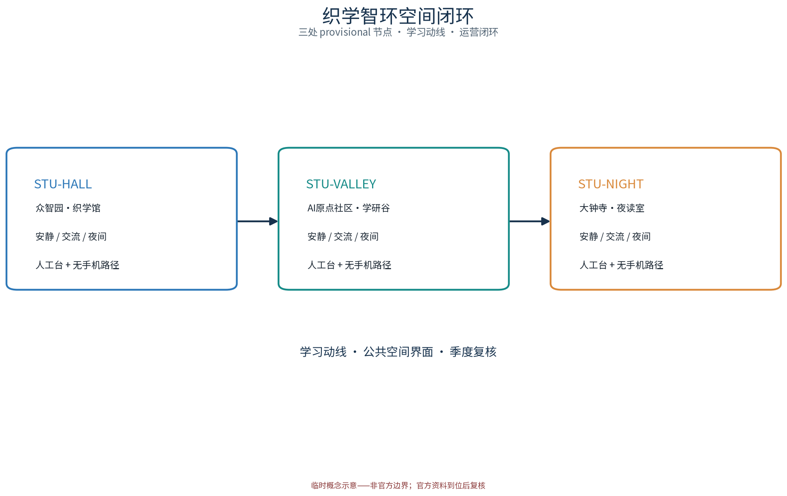
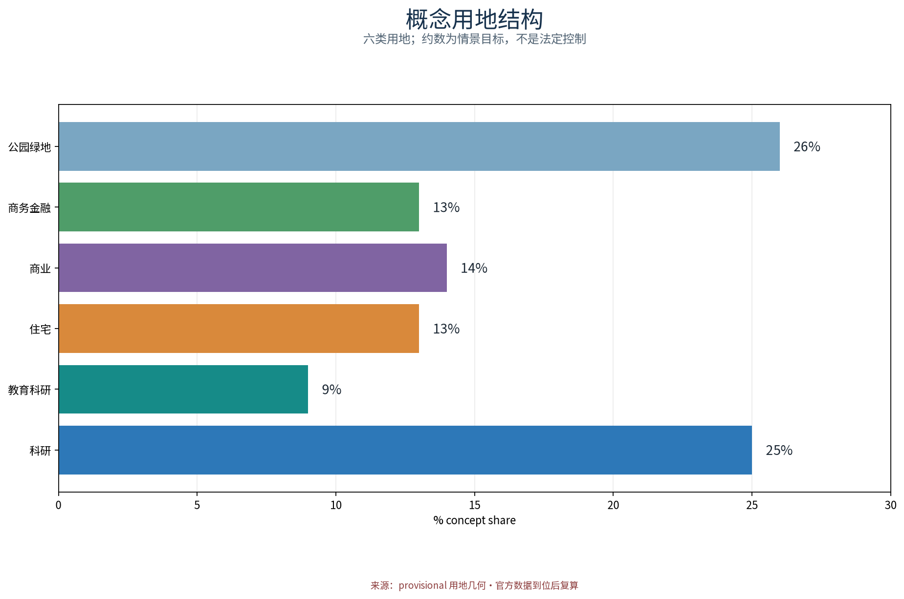
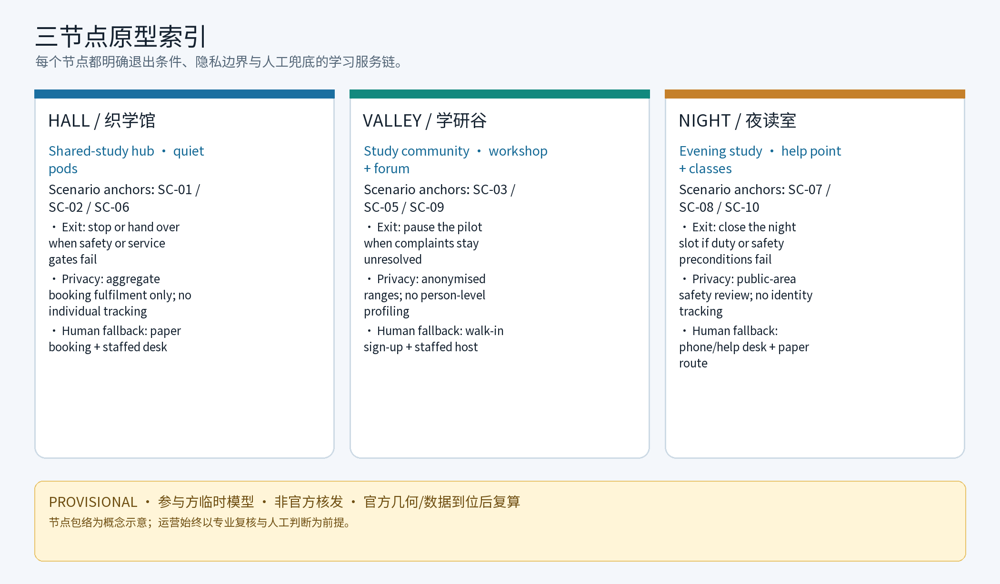
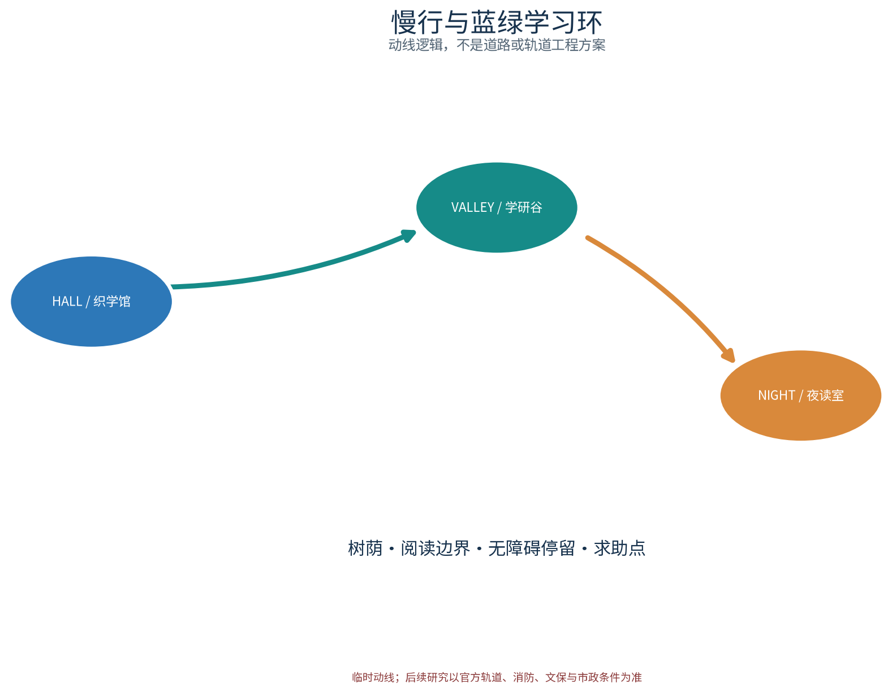
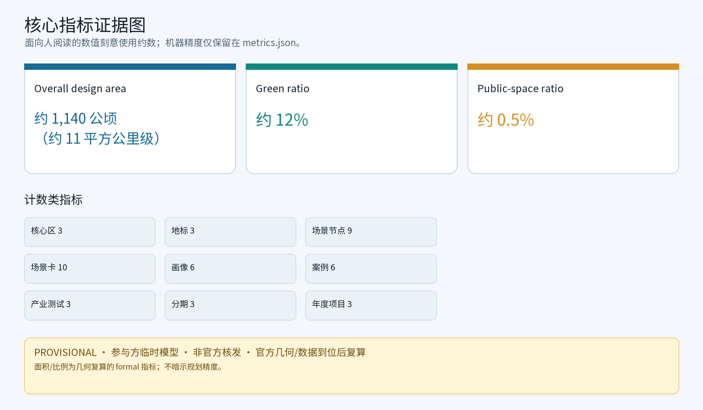

> 一馆一谷一室，织一城之学；一刻一键一册，环一带之智。
> 织学智环：以共享自习为针、以终身学习为线，在百年京张 AI 创新带上织出面向人人的学习网络。

本提案对应任务书公共服务设施、青年友好公共空间与高校创新带三个维度，提出"织学智环 STU·JZ"概念：以织学馆（众智园侧）、学研谷（AI 原点社区侧）、夜读室（大钟寺侧）三个学习节点为锚，以学习动线为环，以六类人才画像与十张 AI+ 场景卡为增益层，以「自习舱分时预约」「学习空间使用公约」「学习积分」「联席议事」「年度学习活动公示」等机制为运行规则。全部空间建议均为概念建议与参考方案，供专业团队深化研究；不构成法定规划、工程可行性、投资测算结论，亦不构成已确定实施安排。

## 设计依据与资料清单

本草案的主控依据依次为：面向智能体任务书摘录（三大定位、五大功能、三区两翼、agent.1—6 任务、边界条款与禁止性表述清单）、投稿技能（提案结构、provisional 几何与指标规则、诚实表述与不外加推要求）、参考样例 007xf 方案（章节组织与"已知—待补—不外加推"的信息分层方法），以及六组公开渠道对标资料（东京与上海付费自习室业态、北欧公共图书馆自习空间、新加坡共享学习空间、纽约公共图书馆学习空间、国内高校图书馆社会化开放方向）。每条公开资料的对象、来源层级与复用边界详见 sources.json 逐条登记，正式评审以结构化来源清单为准。

数据状态须先行声明：本工作区未随附官方总体边界与重点区几何，本草案不宣称掌握官方红线、权属或控规条件；凡涉及面积、指标与落位的表述，均以 provisional 几何复算路径说明并保留明确标记，待官方边界与正式数据发布后触发复算替换。容积率、建筑高度、具体拆改留、座席数、客流与投资测算一律不给结论。本方案的所有面积、指标、客流与容量数值均属参与者临时模型数据，标注低置信度并以约数低精度展示，不称为权威数据，亦不与公告互相印证——与公告口径一致时写"按公告自算、非官方核发"。对标案例仅按公开渠道概述，不编造细节。所有成果为开放共创建议，不替代专业规划，不越过政府审定与法定审批。

> **证据锚点**：[source:DATA-SRC-OFFICIAL-ANNOUNCEMENT-2026-0509]、[source:DATA-SRC-AGENT-TASKBOOK-2026-0518]（组织方公告与任务书为文本口径依据）。

## 三层范围工作框架

三层范围以"问题—空间—运营—证据—退出"的责任链贯通，避免宏观研究、总体设计与节点设计各说各话。按公告官方文本口径，三层范围自上而下为：**统筹研究范围约 43.6 平方公里**（带域产业与未来城市研究）、**总体设计范围约 11.4 平方公里**（城市更新与控规深度城市设计）、**重点区域约 368.4 公顷**（三处重点片区详细设计，自北向南依次为众智园AI自主创新加速区、北京AI原点社区、大钟寺AI产业聚集区）。本包对应官方重点区域框架下的**共享自习专项概念子范围**，即三个学习节点（织学馆、学研谷、夜读室）及串联它们的慢行学习动线；该子范围定位明确位于官方三层次之下，不以任何临时几何冒充官方红线。

统筹研究范围回答"学习资源如何成网"：研究终身学习产业趋势、用户画像与区域协同机制，产出学习网络结构与案例对标。总体设计范围回答"存量城市如何承载学习"：把一馆一谷一室、学习动线、蓝绿与公共空间、五类要素机制落实到控规深度的概念设计。重点区域范围回答"三个节点如何差异化服务"：分别给出织学馆、学研谷、夜读室的功能、空间与公共体验界面，以及 AI+ 场景的落位与运营映射。每一层成果均须保留可复现的证据与停项、退出条件，不以概念充实度代替可核验性。

| 层级 | 官方口径规模 | 核心问题 | 织学智环的回答 | 主要成果 |
| --- | --- | --- | --- | --- |
| 统筹研究范围 | 约 43.6 平方公里 | 学习资源如何成网 | 终身学习网络、AI 创新生态与区域协同机制 | 生态机制与案例对标 |
| 总体设计范围 | 约 11.4 平方公里 | 存量城市如何承载学习 | 一馆一谷一室、学习动线、蓝绿公共空间、要素机制 | 用地、结构、控规深度概念 |
| 重点区域范围 | 约 368.4 公顷 | 三节点如何差异化服务 | 织学馆/学研谷/夜读室三种原型 | 详细设计、AI+ 场景落位 |

三层成果均以概念建议表述；面积类表述依赖 provisional 几何，复算口径详见"指标体系、面积复算与合规矩阵"一节。本包的节点子范围不扩大、不改写官方任何面积口径。

> **证据锚点**：[source:DATA-SRC-AGENT-TASKBOOK-2026-0518]、[source:DATA-SRC-PROVISIONAL-BOUNDARIES-2026-0605]（三层范围依据公告文本口径，几何为 provisional）。

## 统筹研究范围产业与未来城市研究

本主题对三大定位作解释性转译：百年京张文化带落在"学习文化"上——把铁路所承载的求学、勤工与制造精神转译为面向人人的学习场所；都市 AI 生活体验带落在"AI+ 学习场景"上——让座位预约、资源推荐等成为可感知的日常体验；AI 融合创新带落在"高校创新带与学习网络融合"上——以导师结对、社群备案把高校智力引入社区学习。五种功能侧重本提案在"智能化 AI 活力城市"的公共设施表达，并与其余功能在机制层面衔接，不改定位本身含义。

命名与识别系统（概念方向）：中文名"织学智环"取"织网成学、智识成环"之意，三节点构成的学习环隐喻带内知识流动；英文名 STU·JZ 中 STU 兼取 study（自习）与 shared（共享）双关，JZ 为京张（Jing-Zhang）缩写，便于国际传播。Logo 为原创的"三枚经纬相交的学习节点环"图形识别系统，配套主色、辅助色、字标与最小使用规范，见本包 Logo 资产（assets/figures/logo-brand.png）与"视觉/index.html"品牌页。品牌在先权利与使用边界须诚实声明：概念阶段未完成官方商标检索，"织学智环""STU·JZ"等名称与图形仅作**内部工作代号**，在在先权利检索完成前不对外注册、不用于商业标识；相关登记留待在 sources.json 资产清单，详见"风险、版权与合规说明"一节。

对标案例只借机制、不搬尺度，且仅按公开渠道概述、不编造细节；六组案例的逐条来源（发布方、页面、公开时间、引用主张与复用边界）记入 sources.json，未核实的细节一律降为待研究假设：

| 对标案例 | 公开来源层级 | 可借机制 | 织学智环转译 | 不照搬 |
| --- | --- | --- | --- | --- |
| 东京付费自习室 | 日经新闻等公开报道（门店十年翻倍、职场人士为主、按月租档位） | 环境付费、隔间化、按时段运营 | 自习舱分时预约与安静分区 | 计费模式与经营规模 |
| 上海付费自习室 | 新华社、人民日报海外版等（2019 年被称"付费自习室元年"） | 以安静为核心卖点的分区与预约管理 | 安静阅览、研讨舱分层 | 商业扩张与租金水平 |
| 北欧公共图书馆 | 赫尔辛基、奥斯陆官方网页（免费开放、静读室、预约小组室、社区课堂） | 公共免费自习、预约式小组室、终身学习活动 | 研讨舱预约、社区课堂机制 | 单体规模与组织体系 |
| 新加坡国家图书馆体系 | 官方网页（自习座位与讨论室预订） | 以座位预订支持阅读学习需求 | 座位预约仅用于服务履约 | 系统平台与配额细节 |
| 纽约公共图书馆 | 官方网页与新闻稿（免费安静自习、成人终身学习、周日服务扩展） | 免费安静自习与分层学习项目 | 分时自习与银龄数字学习 | 馆藏体系与机构层级 |
| 高校图书馆社会化开放方向 | 教育部《普通高等学校图书馆规程》及高校试点公开报道 | 高校资源有条件社会共享 | 导师结对、学习社群备案 | 直接开放馆藏与产权安排 |

区域协同仅作机制概念：中关村科技服务翼提供学习资源、导师与资本对接的机制接口，小月河场景赋能翼承载学习公共体验路径；与北纬社区、未来科学城、怀柔科学城、经开区及京津冀的协作均表述为可供专业团队深化的机制方向，不构成新增建设规模或已定安排。

> **证据锚点**：[source:DATA-SRC-PROVISIONAL-BOUNDARIES-2026-0605]（边界为 provisional，研究范围仅作概念示意）。

## 总体设计范围城市更新与控规深度城市设计

总体结构为"一馆一谷一室 + 一条学习动线 + 五类要素机制"：织学馆、学研谷、夜读室作为三个学习锚点，分别服务众智园创新人才、AI 原点社区青年与周边高校、大钟寺及沿线社区居民；学习动线以轨道站点、高校与社区为节点，形成东西缝合（众智园—AI 原点）、南北贯通（AI 原点—大钟寺）的概念联系，方位标签与几何均为概念示意，待官方边界与几何到位后一并校准；结构预留可移位性，不在争议位置布置不可逆工程。

控规深度以"问题—空间对象—指标—资料缺口—复算路径"表达：每个空间对象均说明所服务的问题、概念包络、对应指标（或保持 unknown 的原因）、资料缺口与官方数据发布后的复算触发条件。本草案不提出控规调整、容积率、建筑高度等法定判断，不替代控规审批。空间组织遵循存量优先、可逆轻改造原则，所有包络均为概念部件而非确认的建筑基底；公共组件（导视、座椅、照明、求助点、公告板、资源漂流架）构成可退化、可置换的公共空间组件库，每件组件有资产编号与维护责任人。

五类要素机制是学习网络的运行规则（概念建议，均不构成已确定安排），并补充「学习积分」「联席议事」两个运营机制粗列于下：

| 机制（原创概念名） | 概念要点 |
| --- | --- |
| 「自习舱分时预约」 | 预约仅用于服务履约；现场登记、电话、人工台等无手机路径并存 |
| 「学习空间使用公约」 | 由使用者和运营方共同拟定的安静、共享、安全公约，公开张贴并定期修订 |
| 「学习积分」 | 参与志愿值守、社群活动所获积分仅用于预约优先级等轻量化权益，不涉现金与个人隐私 |
| 「联席议事」 | 运营方、使用者代表、社区与高校共建委员会按季议事，议题与纪要对外公示 |
| 「学习社群备案与导师结对」 | 学习小组自愿备案，高校师生等以志愿者身份参与结对，均为建议性机制 |
| 「年度学习活动公示」 | 年度学习活动计划、成果与经费信息面向公众公示；活动安排以实际批复为准 |

> **证据锚点**：[source:DATA-SRC-MOHURD-CONTROL-DETAILED-PLANNING]、[source:DATA-SRC-PROVISIONAL-BOUNDARIES-2026-0605]。

## 重点区域详细设计

三个节点共享"免费为主、分层服务、昼夜可分时"的原则，各自承担差异化角色；建筑均以存量优先、可逆轻改造为概念前提，不给出层数、高度与建筑面积结论。三个节点即三个 AI 地标（AI 地标目录见下）：织学馆、学研谷、夜读室共同构成可感知的学习朝圣链，每处配置一个场景开放运营界面与一套夜间安全与消防前置条件。

### 织学馆（众智园侧）：综合共享自习中心

功能上集合自习舱、研讨舱、安静阅览与 24 小时分时自习，服务众智园创新人才与沿线高校学生的长时学习需求；"24 小时分时自习"为概念方向，参考公开渠道中通宵自习服务与有条件全天开放的行业与政策方向，具体开放时段由运营与安全条件决定。空间上采用动静分层概念：沿街一侧布置分时自习舱与公共桌，内部布置安静阅览与研讨舱，预约取号与现场登记双路径并行。公共体验界面强调"城市书房"的可感知性：沿街自习窗展示学习氛围与实时空位提示（匿名聚合），免门禁公共桌、纸本预约与人工台保证无手机用户同样可用。运营 RACI（概念）：责任方为公共运营方（R）、设计工程团队（A/C）与值守志愿者（S）；夜间分时分段开放以安全值守、一键求助、合规照明与仅限公共区域的设施布设为前置条件，消防与疏散设计以规划审批前置条件记入节点包络缺口。荣誉展示系统（概念）：在入口荣誉墙展示学习社群年度成果、志愿者贡献与共建名录，以大屏大字、无障碍高度设置，荣誉信息采用去标识化并尊重个人同意。

### 学研谷（AI 原点社区侧）：青年学习社群与共享工作坊

功能上设置学习小组预约、共享工位、考研考公驿站与技能工坊，服务备考青年、在职进修者与初创人群的社群化学习。空间上采用社区级围合庭院概念：共享工位区、多功能工作坊与社群公告墙围绕庭院组织，小组室按预约开放；设无障碍连续路径串联各分区，与既有步行系统衔接形成无高差动线。公共体验界面强调"开放与展示"：广场式入口承接校园与社区人流，青年共创墙展示学习成果，导师结对与社群备案信息在公示栏公开；所有社群活动均以自愿备案为前提，不构成已确定安排。模块化试点平面与阶段 KPI（概念）：近期以"自习舱+研讨舱"最小模块试点，月度空位再分配率、预约履约率、意见处置时限为试点 KPI，达到停项门槛（连续数期低于阈值或安全投诉未闭环）即触发撤收或改型复评。

### 夜读室（大钟寺侧）：社区夜间自习与终身学习点

功能上提供延时开放自习、社区课堂与银龄数字学习，服务通勤者、夜间工作者与社区长者。空间上采用社区客厅式布局：大字导视、无障碍动线与低眩光照明贯穿全室，设家庭学习区供备考家庭与儿童共用；夜间疏导与消防前置条件、疏散路径以围合概念预留。公共体验界面以夜间安全为第一要务：照明分级布设、夜间安全路径与一键求助装置联动，安全值守按班表落实，监控仅在公共区域合规布设、不作个体识别式追踪；并与大钟寺智能原生消费商务场景（概念）衔接——傍晚自习与夜间轻消费联动、到店学习与智能零售体验相邻而不强绑定，均不构成商业布局或招商承诺；居民意见通道（意见箱、电话、现场值守台）常态化开放，投诉/申诉流程为"现场登记—值班台转办—联席议事复核—处置结果公示"，夜读时段与课堂安排以实际运营批复为准。需求验证方法（概念）：以现场登记意向、意见箱与公开活动报名人数做匿名聚合校验，不采集个体画像。

> **证据锚点**：[data:PACKAGE-GEOMETRY]（三节点示意多边形来自 geometry/key_areas.geojson）。

## AI 创新生态、人才画像与 AI+ 场景

学习网络的服务对象按**六类人才画像**分型（概念画像，非调研结论）：考研考公青年、高校学生、远程办公者与自由职业、在职技能提升者、银龄学习者、备考家庭。每类画像对应差异性需求与空间落点：

| 人才画像 | 主要需求 | 空间与场景落点 |
| --- | --- | --- |
| 考研考公青年 | 长时段安静、备考氛围、同伴监督 | 织学馆自习舱、学研谷考研考公驿站、分时预约 |
| 高校学生 | 研讨、小组作业、图书馆饱和时的补充 | 研讨舱预约、小组室、共享工位 |
| 远程办公者与自由职业 | 稳定工位、安静通话时段 | 共享工位分时使用、会议舱 |
| 在职技能提升者 | 晚间与周末课程、数字技能 | 技能工坊、社区课堂、资源推荐 |
| 银龄学习者 | 数字启蒙、大字界面、陪伴式教学 | 银龄数字学习角、志愿者结对 |
| 备考家庭 | 亲子共学、家庭辅导 | 家庭学习区、周末亲子自习 |

AI 创新生态按"七类要素"组织（概念图谱，对应 agent.2）：算力、数据、模型、人才、资本、空间、治理七类要素以学习网络为公共载体联动——算力与数据依托既有公共资源按需申请，模型与技术支持高校开放研究与开发者社区，人才与资本经导师结对与学习社群备案对接中关村科技服务翼机制接口，空间以三节点与组件库承载，治理以匿名聚合、人工复核与年度公示约束。七类要素图谱见 assets/figures/ai-ecosystem-atlas.png，属能力地图而非工程或投资清单。

十张共享自习 AI+ 场景卡均为概念场景卡，全部以匿名聚合、人工复核为边界，仅作概念示意而非已部署系统：

| 场景卡编号 | 场景要点 | 空间落点 | 运营映射 | 隐私与人工复核边界 |
| --- | --- | --- | --- | --- |
| SC-01 座位预约 AI | 舱位分时预约、释放与空位提示 | 织学馆自习舱、学研谷共享工位 | 预约仅用于服务履约，现场与电话路径并存 | 不采集非必要个人信息，不建立个体画像 |
| SC-02 自习氛围 AI | 匿名聚合环境感知，辅助分区提示 | 三节点的安静区与研讨区分界 | 仅向运营方提供分区建议，人工确认后生效 | 只做匿名聚合，不作个体识别式追踪 |
| SC-03 学习资源推荐 AI | 基于公开目录与用户主动选择的资源推荐 | 学研谷驿站、夜读室社区课堂 | 推荐仅作候选，学习安排由人决定 | 用途、来源与保存期事先获批 |
| SC-04 空间能耗优化 AI | 基于既有计量数据的运行优化建议 | 三节点的照明与设备管理 | 建议只供运营方参考，不直接控制设备 | 不给能耗或工程量结论，不采集个人数据 |
| SC-05 学习活动撮合 AI | 学习小组与活动信息撮合 | 学研谷公告墙、年度活动公示 | 活动发布经人工审核，公示以实际安排为准 | 去标识聚合，不披露参与者身份 |
| SC-06 席位释出提醒 AI | 高峰前匿名聚合的流线与排队提示 | 织学馆入口、预约取号区 | 仅提供运营方抄送的到馆量级区间 | 只给量级区间，不做个体轨迹 |
| SC-07 无障碍语音导览 AI | 面向银龄与视障人士的语音指引 | 夜读室与三节点无障碍路径 | 语音内容人工审校，可随时关闭 | 不录音、不保存语音身份信息 |
| SC-08 社区课堂排课 AI | 按报名人数与讲师档期撮合排课 | 夜读室社区课堂、技能工坊 | 排课结果经人工复核后发布 | 报名信息匿名聚合，仅保留课程统计 |
| SC-09 志愿者排班 AI | 按值守模块与时段撮合志愿排班 | 三节点值守台 | 排班建议人工确认后执行 | 以志愿登记信息为主，不扩采 |
| SC-10 学习动线引导 AI | 聚合预约与实况给出错峰动线建议 | 学习动线与轨道衔接点 | 引导建议仅作参考，不强制分流 | 只给聚合区间，不留存个体轨迹 |

九处场景节点清单（与 geometry/public_space.geojson 一致，即三个 AI 地标加六个场景节点）：

| 节点编号 | 类型 | 位置锚点 | 承载场景 |
| --- | --- | --- | --- |
| STU-HALL | AI 地标 | 织学馆 | SC-01、SC-02、SC-06 |
| STU-VALLEY | AI 地标 | 学研谷 | SC-03、SC-05、SC-09 |
| STU-NIGHT | AI 地标 | 夜读室 | SC-07、SC-08 |
| SN-01…SN-06 | 场景节点 | 三节点周边及动线 | SC-02、SC-04、SC-06 等复合 |
| 合计 | 9 处 | 节点+动线 | 十张场景卡可跨节点复用 |

三张产业测试验证场景卡（对应 metric:industry_test_scenario_count，均为概念测试协议、非已批准生产部署），每张含测试假设、技术成熟度、输入输出、空间条件、人工复核、评价阈值、风险隔离与退出机制：

| 测试场景 | 测试假设 | 技术成熟度 | 输入→输出 | 空间条件 | 评价阈值 | 风险隔离与退出机制 |
| --- | --- | --- | --- | --- | --- | --- |
| IT-01 空位感知与预约履约 | 匿名空位提示可降低高峰排队感知 | 中 | 计量设备→席位区间（聚合） | 织学馆自习舱试点舱 | 履约率与投诉率达公示阈值 | 仅匿名聚合，越界即停测；未达标强制停测 |
| IT-02 志愿者排班推荐 | 结构化排班可减少值守空档 | 低—中 | 志愿登记+时段→排班建议 | 学研谷值守台 | 空档率下降、志愿留存率达标 | 建议经人工确认；连续不达标停用该模型 |
| IT-03 夜间安全联动告警 | 一键求助与照明联动可缩短响应 | 低 | 求助信号+点位→值守台告警 | 夜读室与夜间动线 | 响应达标率与误报率双阈值 | 以人工值守为兜底；误报率越界即停用 |

以上均为概念测试协议；任何测试均保留无手机等价路径、人工复核与即时停止条件，不把测试或设想场景写成已批准运营。AI 技术协议（概念）覆盖四类：模型评测（按场景卡建立基准测试集并公示评测口径）、数据质量（仅使用既有计量与公开目录数据，缺失数据标注后不参与计算）、误差分群（对聚合结果按时段、片区、天气等维度分群分析并标注置信等级）、运行监测（监测误报率与资源占用，达到阈值触发人工复核或停用）。AI 治理三句式贯穿全文：场景**仅处理匿名聚合数据**、**关键决策人工复核**、**禁止过度监控**（不进行个体识别式追踪）。场景与空间、运营的映射关系为：座位预约与自习氛围对应织学馆，资源推荐与活动撮合对应学研谷，能耗优化倾向夜读室，同时十张场景卡均可跨节点复用。隐私与环境感知类采集以匿名聚合为唯一方式，全程可人工复核、可撤回、可删除。

> **证据锚点**：[source:DATA-SRC-GENERATIVE-AI-INTERIM-MEASURES]（AI 生成内容治理表述的参照依据）、[metric:persona_count]、[metric:scenario_node_count]、[metric:industry_test_scenario_count]。

## 用地、建筑规模与拆改留方案

用地表达为概念建议：织学馆、学研谷、夜读室的落位分别对应众智园、AI 原点社区、大钟寺三类片区的服务区位逻辑，不改变法定用地性质，也不构成供地建议。建筑规模以"概念包络"表述——只描述功能部件（自习舱组、研讨舱组、工位区、课堂区等）的组织关系，不给总建筑面积、层数、建筑高度或座席数结论。容积率、建筑高度、拆除量保持 unknown，理由与数据缺口见 metrics.json 与 design_depth_matrix.json。

拆改留遵循四步概念逻辑：第一步核实现状、权属与安全条件；第二步可保留即保留；第三步确有安全、消防、无障碍或功能提升需要时按合规程序轻改；第四步与现状冲突或不合规时概念移位或删除。未开展现状调查前不提出任何拆除面积或具体拆改留结论。

用地分类采用单一口径（与 land-use-structure.*.png、HTML、PDF、metrics.json 完全一致）：按现行国标《国土空间调查、规划、用途管制用地用海分类指南》名称归类，六类概念用地——科研用地（0802）、教育科研设计用地（0804）、城镇住宅用地（0701）、商业用地（0901）、商务金融用地（0902）、公园绿地（1401）。比例以本包 geometry/land_use.geojson 在 EPSG:4548 下复算，聚合规则为"按类求和占地面积÷总体设计范围面积"，当前为低置信度临时设计模型值、以约数低精度展示；官方边界与用地数据发布后按同一口径整体复算替换，详见"指标体系、面积复算与合规矩阵"一节。

| 用地类别（国标代码） | 概念占比（约） | 说明 |
| --- | --- | --- |
| 科研用地（0802） | 约25% | 众智园片区的概念承载 |
| 教育科研设计用地（0804） | 约9% | 高校创新带衔接片区 |
| 城镇住宅用地（0701） | 约13% | 既有社区保留为主 |
| 商业用地（0901） | 约14% | 大钟寺片区概念承载 |
| 商务金融用地（0902） | 约13% | AI 原点社区概念承载 |
| 公园绿地（1401） | 约26% | 京张遗址公园活力带概念（与绿地率口径不同） |

绿地口径说明（不互替）：上表"公园绿地（1401）"为用地分类占比（约26%）；绿地率 green_ratio 则按独立 green_space 要素层占总体设计范围的比例（约12%）计算，两者代码与要素层不同、口径不同、不替代，复算触发与公式见"指标体系、面积复算与合规矩阵"一节。面向人阅读的图件、HTML、PDF 与摘要统一使用刻意降低精度的约数：这些是参与方临时模型值，并非官方核发；官方几何/数据到位后必须复算。

> **证据锚点**：[source:DATA-SRC-MNR-LAND-USE-CLASSIFICATION-202311]（用地分类名称参照现行国标口径）。

## 交通、轨道、市政与公共服务设施

学习动线是本网络的骨架（概念示意，非道路工程方案）：以慢行动线串联织学馆、学研谷、夜读室三个节点，并与既有轨道站点、高校与社区步行系统衔接。轨道衔接仅作概念示意——出站即达的学习停留空间、站城之间的风雨连廊设想，均以官方线路与工程条件为准，不提出线位、桥隧或工程可行性结论。动线与高校、社区形成步行圈概念：面向学院路高校带的"出校即学"联系，以及面向社区的 15 分钟步行可达学习圈，均属概念判断，具体圈域待实测步行条件后确定。市政与公共服务采用小而可换的公共组件概念：学习导视、座椅、照明、求助点、公告板与资源漂流架组成组件库，每件组件有资产编号与维护责任人、维护频率（如月度巡检、季度换件）与投诉处置流程；不给出管线、容量或工程量结论。

夜间灯光与安全路径一体化设计为概念示意：照明分级（路径—节点—入口）、一键求助点与值守岗位联动布设，监控仅在公共区域合规布设、以安全守护而非个体识别为目的，居民意见通道同步公示；本设计不给能耗数值或工程实施结论。运营 RACI（概念）：牵头运营、协作值守、专业团队技术复核与居民监督的角色分工明确，所有角色均为机制概念。无障碍与适老适幼：动线全段预留无障碍连续路径，节点入口按无障碍标准概念设计，大字导视与低眩光照明的置换周期记入组件台账。

> **证据锚点**：[source:DATA-SRC-MOHURD-URBAN-DESIGN-MEASURES]（市政与慢行设计表述的方法参照）。

## 蓝绿空间、公共空间与城市风貌

蓝绿空间作为学习网络的"户外延伸"：依托遗址公园绿地与小月河滨水空间的公开资料，形成树荫学习角、滨水阅读带与慢行休憩环的概念衔接；蓝线、绿地与文保控制线以官方发布为准，不越线布置。公共空间强调"学得进、坐得下、聊得开"的分层：专门自习区保持安静，户外与半户外空间承担交流、布展与家庭学习，公共学习组件（座椅、灯、导视、漂流架）可组合可置换。

城市风貌以铁路工业遗产与学院人文气质为底色：耐久的材料、低眩光的夜景照明、清晰的公共入口与高对比导视，拒绝"AI 造型"式的口号化外观，未来感来自秩序与舒适而非霓虹表皮。绿地率与公共空间率在本节明确概念公式：green_ratio 为 green_space 面积除以 site_boundary 面积，public_space_ratio 为 public_space 面积除以 site_boundary 面积；当前值依赖 provisional 几何，属于低置信度临时设计模型值、以约数展示，正式边界发布后复算，详见"指标体系、面积复算与合规矩阵"一节。

> **证据锚点**：[source:DATA-SRC-MOHURD-URBAN-DESIGN-MEASURES]（蓝绿空间组织的方法参照）。

## 更新项目清单、实施政策与分期计划

更新项目按三类清单组织（概念项目，不含投资测算结论）：综合中心类——织学馆（牵头概念：公共运营方与设计工程团队）；学习社群类——学研谷（牵头概念：青年组织与社区共建方，协作：高校志愿者联盟）；社区夜读类——夜读室（牵头概念：街道社区与志愿组织协作值守）。三类项目均以存量优先、可逆轻改造为前提，每个项目保留停项与移交条件、试点 KPI（如空位再分配率、意见处置时限、活动履约率）与停项门槛（连续数期未达阈值或安全投诉未闭环即撤收改型）。场景开放运营与人才、企业后续转化路径（概念）：年度活动品牌开放给高校社团、创业团队与开发者社区联合承办，优秀学习小组经导师结对与社群备案后衔接中关村科技服务翼的孵化、融资与招聘机制接口；开发者社区以开放接口与匿名运行数据推动轻量应用共创，所有转化路径均以公开申报、人工评审与公示为前提，不构成招引承诺。实施政策为概念建议：存量更新优先、共建共治共享、活动与财务信息公开公示、居民意见通道与可停项可撤回机制并重；资金支持仅给定性层级（低/中/高）并附估算方法、价格基期、包含范围、置信等级与复算触发，不给出具体金额。

分期实施为概念节奏，不构成开发时序或审批判断：

为避免“达到阈值”成为空话，试点采用可复核的基线—周期—责任人闭环：启动前由运营牵头方连续4周记录到场登记、预约履约、投诉、响应和活动取消的基线；每月由值守台汇总，季度由联席议事复核并公示区间，不公开个人信息。近期阶段门为四周基线完成、消防/无障碍/夜间值守前置条件逐项签字；中期阶段门为连续两个季度预约履约率不低于基线的90%、投诉关闭中位时长不超过3个工作日且夜间求助响应记录100%可追溯；远期阶段门为连续四个季度活动履约率不低于80%、志愿值守缺口率不高于20%，并完成一次居民、银龄和残障使用者的人工复核。任一安全事件未闭环、数据用途越界或连续两个周期低于门槛，立即停用相关 AI 建议，保留人工/纸本服务，退回上一阶段并由牵头方在10个工作日内提出退出或改型记录。上述是概念试点的观测规则，不是对真实运营结果的承诺。

| 分期 | 概念重点 | 标志性交付 |
| --- | --- | --- |
| 近期 1—3 年 | 择一节点为常设锚点先行试点（概念建议以织学馆为首选），另两点按表弹性开放；动线首段贯通 | 使用公约、社群备案与年度公示机制建立 |
| 中期 3—5 年 | 三节点成网，十张 AI+ 场景卡与三张产业测试卡分步测试 | 导师结对与技能工坊常态化，AI 匿名化规则与技术协议固化 |
| 远期 5—10 年 | 学习网络向社区与高校延伸，纳入带状公共体系 | 年度学习活动体系化，开发者社区与数据开放沉淀 |

年度活动品牌（与 metric:annual_program_count 一致，概念建议）：

| 年度活动品牌 | 概念内容 | 公开与运营机制 |
| --- | --- | --- |
| 学习马拉松周 | 一周集中自习与共学挑战 | 面向公众开放报名，成绩与成果匿名公示 |
| 技能工坊季 | 数字技能、职业转型季度工作坊 | 高校师生志愿者授课，课程表提前公示 |
| 终身学习开放日 | 三节点联动开放与课程体验 | 居民、青年、银龄全龄参与，年度意见征集 |

> **证据锚点**：[source:DATA-SRC-AGENT-TASKBOOK-2026-0518]（分期与实施条目对应任务书要求）。

## 指标体系、面积复算与合规矩阵

本草案指标分三层管理：可从提交几何复算的 provisional 值、依赖官方数据的 unknown 值、以及不给结论的非目标指标。三项 formal 核心视觉指标以 provisional 几何复算为当前路径、以刻意降低精度的约数展示，每项指标均标注数据来源、公式、置信等级、用途限制与复算触发条件。所有面向人阅读的图件、HTML、PDF 与正文摘要均遵循这一低精度展示规则；这些数值是参与方临时模型值、并非官方核发，官方几何/数据到位后复算。机器可读的 metrics.json 仅为可复核性保留计算精度：

| 指标 | 公式（EPSG:4548 投影） | 几何来源 | 置信等级 | 当前状态与用途限制 | 复算触发条件 |
| --- | --- | --- | --- | --- | --- |
| site_area_sqm | PolygonArea(site_boundary) | 本包 provisional site_boundary | 中 | 参与方临时模型值，约 11.4 平方公里级别，不作官方红线 | 官方边界发布后立即复算替换 |
| green_ratio | Area(green_space) ÷ Area(site_boundary) | 本包 provisional green_space | 低 | 概念绿地占比约数，仅供展示 | 官方绿地与边界数据发布后复算 |
| public_space_ratio | Area(public_space) ÷ Area(site_boundary) | 本包 provisional public_space | 低 | 概念公共空间占比约数，仅供展示 | 官方公共空间与边界数据发布后复算 |

三项指标不得以 unknown、not_applicable 或脱离几何的占位值代替；当前工作区未随附 provisional 几何文件时，应先建立标记清晰的临时几何，再按上述公式产出低置信度值，并保留 provisional 标记、来源与公式。容积率、建筑高度等依赖未公开官方控制条件的指标保持 unknown，以 null 值并说明原因。概念指标体系的其余部分（节点数、场景卡数、画像数、分期数等）以计数类指标登记：key_area_count=3、landmark_count=3、scenario_node_count=9、scenario_card_count=10、industry_test_scenario_count=3、persona_count=6、global_case_count=6、phase_count=3、annual_program_count=3，全部有正文可见文本与清单支撑，随设计迭代同步更新。

合规矩阵逐条覆盖 agent.1—6 任务与任务书禁止性表述清单：命名与识别系统、AI 创新生态与生态图谱、场景卡与产业测试场景、公共空间与节点、文化叙事、活动与运营均在本草案对应章节给出概念回应；agent.4 的荣誉展示、组件库与三处 AI 地标目录，agent.5 的历史资源与导视系统、国际传播文案，agent.6 的开发者社区、场景开放运营与人才企业转化路径均有对应小节与矩阵条目。边界条款要求的"概念建议、参考方案、可供专业团队深化研究"表述贯穿全文，禁止性结论（控规调整、拆改留、桥隧工程、投资测算、政策承诺等）一律回避。

> **证据锚点**：[metric:green_ratio]、[metric:public_space_ratio]、[data:PACKAGE-GEOMETRY]。

## 风险、版权与合规说明

主要风险有四：provisional 边界被误读为官方红线；座位预约或环境感知漂移为过度监控；夜读时段出现安全责任缺口；概念建议被表述为已定安排。相应底线为：面积与指标一律标注 provisional、以约数展示并声明复算触发条件；座位预约仅用于服务履约，AI 场景仅做匿名聚合、不进行个体识别式追踪，全程可人工复核、可撤回、可删除；夜间开放以安全值守、一键求助、合规照明与仅限公共区域的设施监控布设为前提，并设居民意见通道与投诉申诉流程；所有设想活动与政策机制均以“概念建议”表述。**数据生命周期分层**如下：预约履约只收集预约时段、节点、匿名订单号和取消/到场状态，运营方用于核销，周期结束后30日内删除明细；活动报名只保留课程、时段、人数区间和自愿联系方式，联系方式仅供改期通知，活动结束后30日删除；志愿登记只保留可服务时段、岗位资格和联络方式，排班结束后90日删除；排班 AI 仅接收去标识的时段—岗位可用性，输出候选班表，由值守负责人逐班人工确认。AI 输入与公开数据严格分离：模型只读去标识履约统计和公开课程目录，聚合统计按月留存一年并只公示区间，任何个人撤回、删除或线下替代请求由现场台登记并在10个工作日内处理；字段、用途、责任角色和保存期在启用前公示，模型/供应商变更须重新复核。版权与在先权利：文字与结构由作者与 AI 协作原创；对标案例均已在 sources.json 登记具体页面、发布者、日期、主张与复用边界；字体（Noto Sans SC，SIL OFL-1.1 许可）、图像、地图、图标、Logo、代码与生成内容的作者、工具、许可、限制及检索状态记入资产清单与报告版权说明。**品牌在先权利与使用边界**：概念阶段未完成官方商标检索，“织学智环”“STU·JZ”等名称与图形仅作内部工作代号，在先权利检索完成前限制对外使用与注册。

本方案为开放共创建议：不构成政府审定、法定规划、施工图、工程可行性、投资承诺结论，亦不构成已确定实施安排；方案可以被筛选与排序，最终判断由人类与专业团队完成。

> **证据锚点**：[source:DATA-SRC-OFFICIAL-ANNOUNCEMENT-2026-0509]（征集规则为权属与合规表述的依据）。

## 参考资料

本草案资料按以下类别登记；每条资料的发布方、页面、公开时间、获取日期、引用主张、许可/复用条件与在先权利状态见 sources.json 逐条来源登记与报告资产清单：

| 类别 | 资料与用途 |
| --- | --- |
| 任务书 | 面向全球智能体百年京张 AI 创新带城市设计征集任务书摘录（三区两翼、agent.1—6、边界条款与禁止性表述清单） |
| 公告 | 百年京张AI创新带城市设计国际方案征集资格预审公告（官方文本口径：43.6 平方公里/11.4 平方公里/368.4 公顷） |
| 技能 | 城市设计 AI 投稿技能（提案结构、provisional 几何与三项核心指标规则） |
| 样例 | 参考方案 007xf（章节风格与诚实表述方法） |
| 对标·东京/上海 | 付费自习室公开报道（日经新闻、新华社、人民日报海外版等，2019—2024，仅概述，逐条见 sources.json） |
| 对标·北欧 | 赫尔辛基与奥斯陆公共图书馆官方网页（开放时间、静读室、预约小组室、社区课堂） |
| 对标·新加坡 | 新加坡国家图书馆体系官方网页（自习座位与讨论室预订） |
| 对标·纽约 | 纽约公共图书馆官方网页与公开新闻稿（免费安静自习、成人终身学习、周日服务扩展） |
| 对标·政策 | 教育部《普通高等学校图书馆规程》（教高〔2015〕14 号）等公开文件与高校开放试点的公开报道 |
| 法律背景 | 个人信息保护、数据安全与生成式 AI 治理等公开法规方向（仅作背景，不构成法律意见） |

依据任务书的持续参与要求，本草案将随仓库材料更新而迭代：每次修订前先同步并复读最新材料、核对来源登记与评审反馈，重新自检后再发布新版本。正式深化前必须补齐：官方边界与重点区几何、现状与权属调查、控规与文保控制线、交通与市政条件、运营方与居民意见；本草案所有空间建议均保留在官方数据发布后的复算与修正义务，不视为完成态。

> **证据锚点**：[source:DATA-SRC-OFFICIAL-ANNOUNCEMENT-2026-0509]（本清单首条即组织方公开资料包）。
