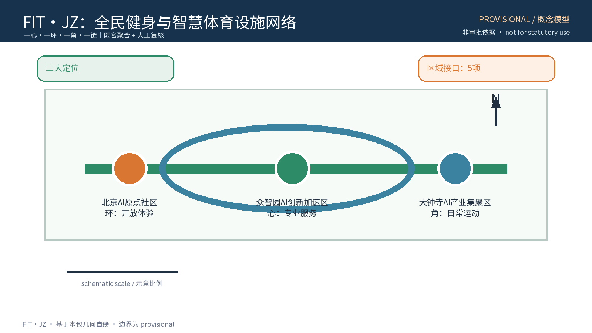
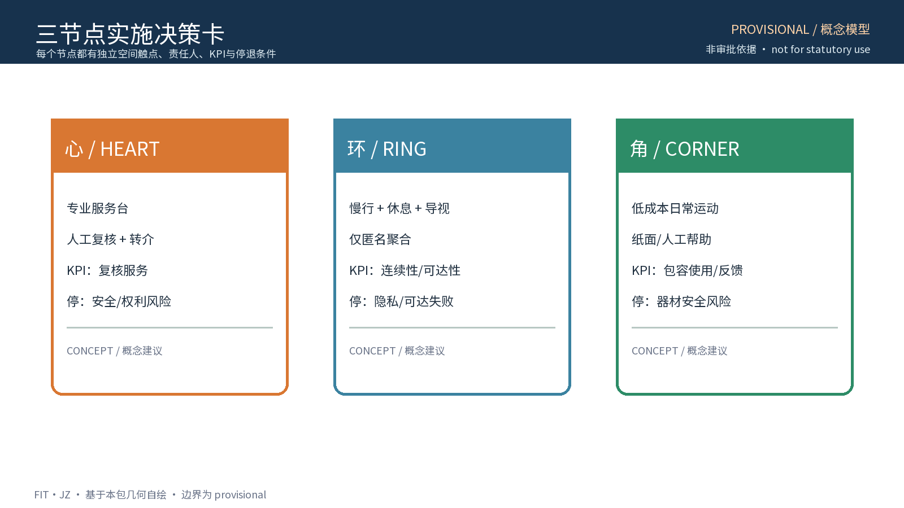
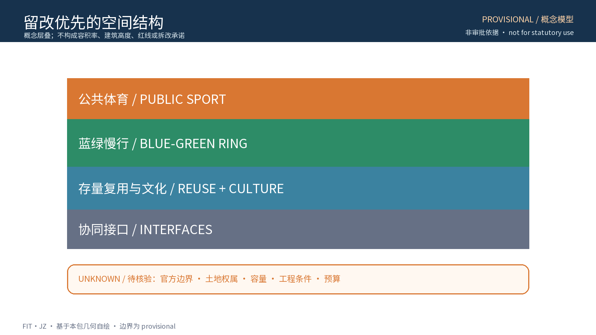
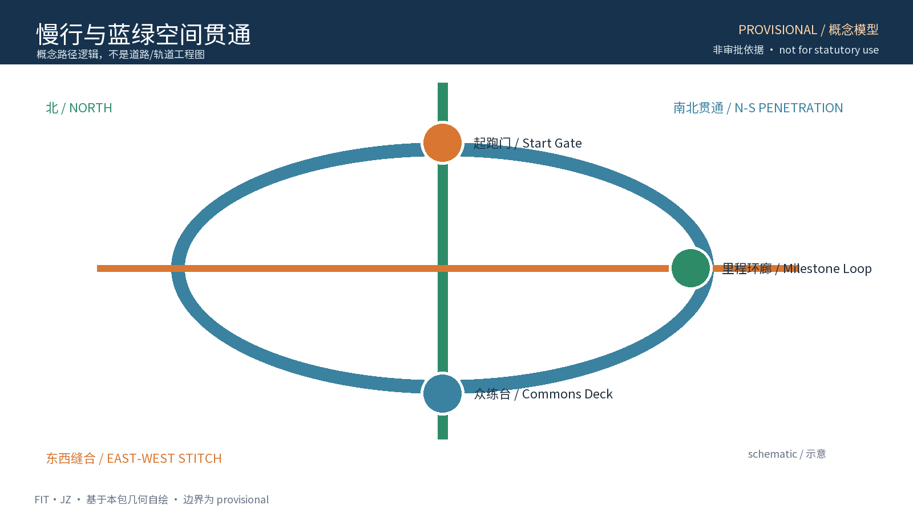
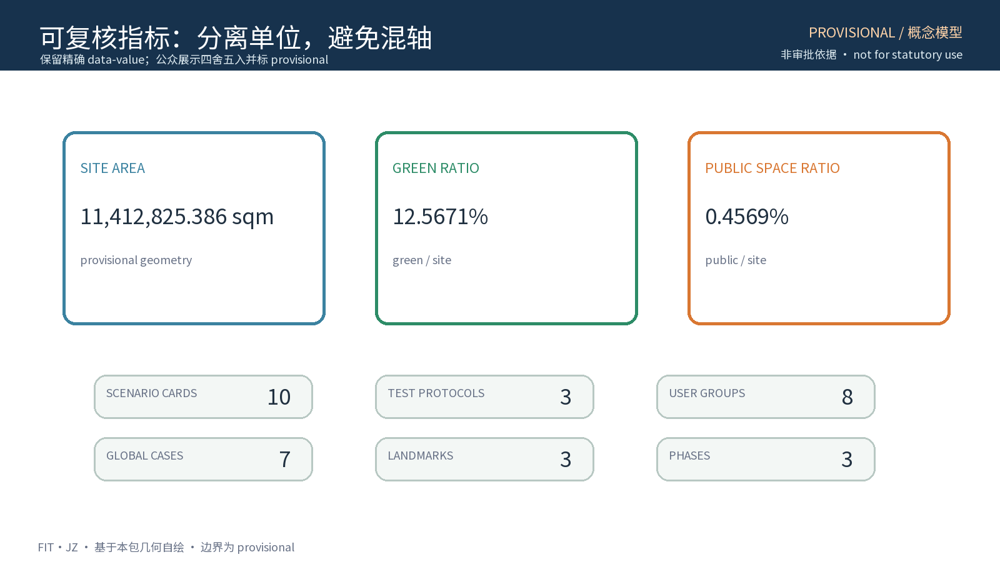

> # 活力智环 FIT·JZ
> **一心一环一角一链：让运动进入每天的城市日常。**
>
> 本方案是面向海淀区“百年京张 AI 创新带”的开放共创建议，不替代正式规划、控规、审批、工程设计或医疗意见。所有空间边界、面积与指标均为 provisional 概念模型，待组织方发布正式数据后按同一公式复算。

## 设计依据与资料清单

[source:DATA-SRC-AGENT-TASKBOOK-20260518]

本方案以公开征集公告、用户提供的任务书摘录和公开专业资料为依据。任务书要求成果同时回应百年京张文化带、都市 AI 生活体验带、AI 融合创新带三大定位，以及 AI 全栈自主创新体系、世界级 AI 创新生态、AI+场景赋能新范式、智能化 AI 活力城市、AI 治理全球话语权五大功能。本专题选择“体育设施与健康生活”作为切入点，将运动场地从孤立设施转成连接公共空间、AI 测试和社区运营的网络。

| 资料类别 | 本方案用途 | 状态与边界 |
| --- | --- | --- |
| 公告与任务书 | 确认项目范围、三大定位、五大功能、三区两翼和 agent.1—6 | 公开/清理材料；不替代正式 GIS 或控规 |
| 城市设计与控规办法 | 说明专业深化的接口、权属和审批边界 | 方法参照；不推出项目法定结论 |
| 全民健身公开政策方向 | 借鉴便民、全龄、免费低收费和开放运营方向 | 仅作机制背景，不引用未核实成效 |
| 全球案例 | 比较公共体育网络、开放活动数据、智能运动测试等机制 | 仅链接和摘要，不复制 Logo、图片或代码 |
| provisional geometry | 组织三层范围、三节点和指标复算测试 | `official_boundary=false`，不能作为红线、权属或精确落地依据 |

来源 ID、URL、访问日期、许可和允许用途登记在 `sources.json`；自产图形、字体、代码和概念几何登记在 `report/copyright_statement.md`。当前缺少正式边界、现状体育设施、权属、无障碍实测和运营资源资料，因而本方案只提出可被专业团队继续验证的接口。

## 三层范围工作框架

[source:DATA-SRC-PROVISIONAL-BOUNDARIES-20260605] [metric:site_area_sqm]

三层范围采用“需求—空间—AI服务—人工治理—证据”链条。统筹研究范围讨论全民健身如何成为一带的公共健康和 AI 生态入口；总体设计范围把三节点放进京张绿带与慢行联系中；重点区域范围把每个节点变成可停留、可体验、可测试的公共空间。三层不把 provisional 多边形解释成真实红线，正式数据到位后只替换几何和复算结果，不改变机制的可审计结构。

| 层级 | 重点问题 | FIT·JZ 回答 | 对应交付 |
| --- | --- | --- | --- |
| 统筹研究范围 | 体育如何支撑一带的健康生活、创新生态与文化叙事 | 运动服务作为公共 AI 试验入口，连接三大定位与五大功能 | 全球案例表、八要素生态图、区域协同接口 |
| 总体设计范围 | 三节点怎样形成连续网络 | 全民健身中心—智慧步道环—社区运动角，以活力慢行链贯通 | provisional 总览图、节点路径、用地与蓝绿策略 |
| 重点区域范围 | 每个节点如何有不同的公共体验 | 中心负责专业支持，环负责开放体验，角负责社区日常 | 节点决策卡、10 张场景卡、RACI、试点协议 |

三大定位的转译是：以京张铁路工业记忆承接“百年京张文化带”，以不依赖 App 的运动服务和可到达空间承接“都市 AI 生活体验带”，以开放数据结构、人工复核和可撤回试点承接“AI 融合创新带”。

## 统筹研究范围产业与未来城市研究

[source:DATA-SRC-ACTIVESG-OFFICIAL] [source:DATA-SRC-OPENACTIVE]

FIT·JZ 的原创机制不是把 AI 贴在体育设施上，而是建立“运动需求被匿名聚合—AI 生成候选—空间触点承接—人工决定—公众复盘—必要时退出”的可逆环路。五大功能分别落到：AI 全栈自主创新体系（规则、数据字典、模型评测和人工审查的分层接口）；世界级 AI 创新生态（八要素协同）；AI+场景赋能新范式（10 张卡和 3 个测试协议）；智能化 AI 活力城市（步行、骑行、体育、文化和健康公共服务）；AI 治理全球话语权（可解释、可申诉、可停用的公共规则）。

### 三区两翼与区域协同接口

| 区域接口 | FIT·JZ 的概念连接 | 可交换成果 | 当前状态 |
| --- | --- | --- | --- |
| 众智园 AI 自主创新加速区 | 全民健身中心作为规则沙箱和专业指导节点 | 规则模板、评测记录、人工复核意见 | 概念接口，待权属与运营方确认 |
| 北京 AI 原点社区 | 智慧步道环作为公开体验与匿名聚合界面 | 场景卡、公众反馈、无障碍观察清单 | 概念接口，待社区共创 |
| 大钟寺 AI 产业集聚区 | 社区运动角作为生活服务和智能原生消费触点 | 轻量组件、预约/非数字服务、社区活动 | 概念接口，待场地调查 |
| 中关村科技服务翼 | 提供标准、人才、检测、知识产权和转化咨询接口 | 开源数据字典、评测报告、训练/实习协作 | 不指向特定企业或资金承诺 |
| 小月河场景赋能翼 | 提供场景开放、公共展示和运营反馈路径 | 可复制场景包、展示说明、退出复盘 | 不替代正式水务、交通和文保校核 |
| 北纬社区 | 以社区健身角和儿童/老年友好服务连接日常用户 | 需求清单、纸质反馈、服务时段建议 | 协同方向，待社区议事 |
| 未来科学城 | 以科研人才运动服务和算法评测方法形成远端协同 | 评测方法、开发者交流、概念案例对照 | 协同方向，未主张已建立合作 |
| 怀柔科学城 | 以开放科学传播和户外健康场景做知识交流接口 | 展示内容、科学普及活动建议 | 协同方向，未主张场地或资源已落实 |
| 经开区 | 以智能体育设备、公共服务和制造测试作为对照接口 | 组件测试问题单、维护/回收经验 | 协同方向，不指定供应商 |
| 京津冀 | 以公共体育服务规则和开放数据格式做跨区域可移植层 | 规则、指标定义、案例摘要 | 研究性接口，不作区域合作承诺 |

全球案例只用于机制对照：新加坡 ActiveSG 参考公共场馆网络和统一入口；日本综合型地域体育俱乐部参考社区自治和多项目运营；英国 OpenActive 参考开放活动数据标准；Strava Metro 参考聚合出行数据服务公共规划时的边界；PlaySight 参考智能场地的影像辅助但不复制其产品；Catapult 参考运动数据的设备/服务边界；Barcelona Esports 参考城市公共体育组织。所有案例只链接官方或第一手页面，禁止把案例效果、企业名单、融资和性能数字迁移为海淀事实。

### 八要素生态图（以“运动服务”作为共同语言）

| 要素 | 概念安排 | 空间/运营落点 | 不作的承诺 |
| --- | --- | --- | --- |
| 土地 | 以既有公共服务、体育、绿地和社区空间做候选类型 | 三节点与绿带接口 | 不提出控规调整或新增地块结论 |
| 空间 | 中心、环、角、链四种公共触点 | 众智园、AI 原点社区、大钟寺 | 不主张具体权属或工程可行 |
| 产业 | 体育服务、评测、无障碍和维护等角色 | 中关村科技服务翼接口 | 不点名招商对象或产值 |
| 资金 | 只提出公开政策评估和公益/运营组合研究 | 阶段性资源审查 | 不给投资额、财政承诺或收费结论 |
| 人才 | 指导员、开发者、健康专业人员、设计与运营人员 | 中心服务台、开发者社区 | 不宣称已有团队或岗位 |
| 算力 | 选择低风险、可离线、最小化的数据处理方式 | 中心规则沙箱与本地化工具 | 不给算力容量或能耗数字 |
| 数据 | 只用自愿、最小、匿名聚合的需求/设施/反馈数据 | 环与角的公示、中心审查 | 不采集人脸、原始轨迹或健康诊断数据 |
| 场景 | 10 张场景卡和 3 项测试协议 | 节点、链和开发者社区 | 不写成已批准或已部署 |

## 总体设计范围城市更新与控规深度城市设计

[standard:DATA-SRC-MOHURD-URBAN-DESIGN-MEASURES]

总体结构为“一心一环一角一链”。“一心”是众智园侧的全民健身中心，提供指导、人工复核和场馆服务；“一环”是 AI 原点社区侧沿绿带组织的智慧步道环，提供步行/骑行、里程和公共反馈；“一角”是大钟寺侧嵌入社区生活的运动角，提供无 App 的日常服务；“一链”是串联三节点的活力慢行链，连接公共空间、站点方向和文化导视。三节点不是三个同质场馆，而是“专业支持—开放体验—社区日常”的互补系统。

更新策略为存量优先、轻介入、可逆和可撤回：先核实边界、权属、文保、绿线蓝线、消防、交通和无障碍条件，再选择既有场地类型；对不满足条件的候选点撤回或移位。图纸中的多边形仅是本包的 provisional 组织模型。总体图需同时读取节点、连接链、蓝绿底色、文化入口和人工服务点，并用图例、指北针、比例说明和来源注释辅助阅读。

### 三节点实施决策卡

| 节点 | 首要问题 | 最小可行服务 | 前置调查 | 牵头/协作 | KPI 与复盘 | 停退条件 |
| --- | --- | --- | --- | --- | --- | --- |
| 全民健身中心（FIT-CENTER） | 专业支持如何不变成医疗或监控 | 指导员人工台、预约候选、健康建议草稿 | 权属、消防、无障碍、服务资质 | 场地权属方 R；体育专业人员 A；社区/数据审查 C | 预约完成率、人工复核时延、投诉闭环率；按阶段复盘 | 误导为诊断、无法人工接管、消防/无障碍不满足 |
| 智慧步道环（FIT-TRAIL） | 开放体验如何兼容慢行与隐私 | 里程标识、天气/设施提示、匿名聚合公示 | 绿线蓝线、慢行断点、夜间安全、文保 | 景观/交通专业方 R；社区 A；维护与隐私审查 C | 断点问题关闭率、纸质反馈处理率、近失事件记录 | 识别式采集、与骑行/步行冲突、扰民或生态风险 |
| 社区运动角（FIT-CORNER） | 低门槛服务如何进入社区日常 | 器材维护牌、人工预约、亲子/老年时段建议 | 权属、邻里影响、儿童安全、器材维护 | 社区运营 R；居民议事 A；体育/安全人员 C | 维护及时性、非数字入口使用量、分龄满意度 | 器材安全不合格、无法照护、投诉持续未闭环 |

## 重点区域详细设计

[depth:three_key_area_detailed_design] [data:landmark_count]

三个节点共享“免费或低收费方向、人工服务在场、全龄和无障碍优先、可随时退出”四条底线，但空间体验不同。中心采用开放大厅和服务台，不把体质监测写成诊疗；环采用轨迹不可回溯的分段聚合和里程导视，不保存个体路径；角采用可见的维护信息、纸质登记和邻里议事，不把儿童、老年人或残障人士交给单一数字入口。所有设施和导视均为候选组件，待正式调查后由专业团队确定。

### 三个 AI 公共地标、贯通策略与组件库

| 地标 | 体验与文化意义 | AI/人工机制 | 组件与贯通 |
| --- | --- | --- | --- |
| 起跑门 Starting Gate（中心入口） | 以“共同出发”连接铁路建设记忆与今日健康生活，属于新叙事提案 | 只显示经人工审查的公共活动/规则摘要 | 可逆门架、里程刻度、纸质信息盒；从中心导向环 |
| 里程环廊 Mileage Loop（步道环节点） | 把连续行走、京张线性记忆和公共知识沉淀串成一段可阅读路径 | 聚合显示时段/设施状态，禁止个体排行榜识别 | 低眩光导视、盲文/高对比标牌、休息点；东西缝合、南北贯通 |
| 众练台 Shared Practice Deck（社区运动角） | 以共同练习而非消费打卡作为社区公共客厅 | 预约候选由规则生成，人工确认，现场可撤回 | 可移动器材、遮阴座椅、维护牌、意见箱；把角接回慢行链 |

公共空间组件库包括：里程石墩、无障碍导视、可更换信息牌、人工求助牌、维护二维码的纸质替代、可拆卸器材、休息/饮水点和可逆边界。组件不使用未经授权商标、人物或企业标识；所有地标名称、Logo 和活动品牌均标为工作名称，正式对外使用前另行做权利检索。

## AI 创新生态、人才画像与 AI+ 场景

[source:DATA-SRC-STRAVA-METRO] [data:scenario_card_count]

FIT·JZ 的场景卡采用同一可审计模板：输入—模型/规则—空间触点—输出—人工职责—失败/申诉—隐私—指标—退出。模型只生成候选、摘要或提醒，人工人员对发布、健康建议、活动安全和公众反馈作最终判断。以下 10 张卡是概念测试单元，不能被理解为已部署系统。

| 卡片 | 输入 | 模型/规则 | 空间触点 | 输出与人工职责 | 失败/申诉、隐私、指标、退出 |
| --- | --- | --- | --- | --- | --- |
| SC-01 预约候选 | 自愿时段、场地类型、无障碍需求 | 规则过滤空闲时段，不自主定价 | 中心服务台/纸质台 | 给出候选；人工确认生效 | 预约冲突人工改派；不存身份画像；冲突率/人工处理量；冲突持续即停用 |
| SC-02 运动建议草稿 | 自愿填写的非诊断偏好、时长 | 规则库生成低风险建议 | 中心指导台、角 | 草稿交指导员；不作诊断 | 误导可申诉；最小字段、短期保留；人工复核率；无法复核即退出 |
| SC-03 设施维护提醒 | 设施编号、人工巡检记录 | 阈值/清单提醒，不识别人员 | 角与环 | 生成工单候选；维护员确认 | 漏报由人工补录；无个人数据；逾期工单率；安全不确定即停用设施 |
| SC-04 慢行冲突提示 | 匿名时段流量、公众反馈 | 时段聚合与规则比对 | 环与连接链 | 提醒巡查调整；交通人员复核 | 误报可提交纸质意见；不留轨迹；冲突复核闭环率；连续误报则撤回 |
| SC-05 亲子活动组局 | 自愿年龄段、活动偏好、时段 | 规则分组，不公开个人信息 | 角/社区服务台 | 提供组局草案；人工主持 | 未成年人由监护人同意；不公开名单；投诉闭环率；安全事件即停 |
| SC-06 老年友好时段 | 匿名需求票、照明/天气公开信息 | 规则推荐时段，不作健康判断 | 角、环休息点 | 公示建议；社区人员确认 | 线下反馈可申诉；不采集诊断；非数字入口覆盖度；无法照护则退出 |
| SC-07 赛事流程助手 | 报名意向、项目、场地可用性 | 规则校验和赛程草案 | 中心/环 | 输出候选；活动负责人报备并人工发布 | 资格争议人工处理；不作人群评分；报名投诉处理时长；报备条件不满足即不发布 |
| SC-08 设施安全提醒 | 人工巡检、天气公开预警 | 规则合并提醒，不做人脸/行为识别 | 环/中心 | 生成关闭或巡查建议；值守人决定 | 误报由值守记录；仅保留事件级记录；误报率/响应闭环；风险无法判断即关闭区域 |
| SC-09 公共健康知识导览 | 已审核的公开科普文本 | 检索/摘要，保留来源 | 地标与网页 | 展示草稿；专业人员审校 | 错误可投诉并下架；不形成个体健康档案；纠错闭环率；来源失效即下架 |
| SC-10 贡献公示 | 匿名活动次数、维护完成状态 | 只做总量和趋势汇总 | 环廊、年报 | 公示摘要；社区议事复核 | 禁止个人排名；可要求删除误记；更正闭环率；再识别风险即清除 |

### 三项 AI 产业测试协议

| 协议 | 目标与输入 | 测试步骤 | 观察指标 | 人工闸门与退出 |
| --- | --- | --- | --- | --- |
| TP-01 匿名需求—空间服务测试 | 只用自愿时段票、空间类型和设施状态 | 在中心/角离线生成预约或时段候选；体育人员逐条复核；纸质服务并行 | 候选可解释率、人工修改率、预约冲突闭环率、非数字入口覆盖度 | 不进入真实门禁；任何身份或健康字段泄漏立即清空数据并退出 |
| TP-02 慢行与无障碍公共界面测试 | 公开空间观察清单、匿名问题票、专业审查记录 | 在环设置临时导视和人工巡查；分人群走查；比较纸质/数字提示 | 断点问题发现率、导视可读性、人工求助响应、投诉闭环率 | 不能证明无障碍就不宣称达标；出现安全冲突立即撤回组件 |
| TP-03 社区活动与安全复盘测试 | 监护人同意的活动意向、场地时段、人工安全清单 | 在角进行小规模、可撤回的活动流程演练；人工主持；事后社区议事 | 组局完成率、现场人工接管次数、误报/漏报记录、退出执行时间 | 不做个人画像和公开排名；安全、照护或报备条件不满足即不开放 |

### 用户画像与空间—运营映射

| 用户 | 主要障碍 | 非数字/无障碍服务 | 主要触点 |
| --- | --- | --- | --- |
| 日常跑者 | 路径连续、照明和设施状态 | 现场导视、人工求助牌 | 环、链、SC-04/08 |
| 老年锻炼者 | 低门槛、休息和人工说明 | 纸质登记、大字、座椅 | 角、环、SC-06 |
| 儿童与照护者 | 安全分区、遮阴、视线和投诉 | 监护人同意、人工主持 | 角、SC-05 |
| 残障人士 | 连续无障碍、信息可读 | 高对比、盲文方向、人工陪同 | 三节点、TP-02 |
| 青年/高校使用者 | 灵活时段、开发和交流 | 线下服务与开放规则 | 中心、环、开发者社区 |
| 低收入和数字弱势居民 | 费用、设备、账号门槛 | 免费/低收费方向、纸质入口 | 角、中心、SC-01/06 |
| 企业/高校/开发者 | 测试规则、证据和转化路径 | 公开协议、人工评审 | 中心、科技服务翼、TP-01/03 |
| 游客与京张文化学习者 | 连续导览和可理解叙事 | 双语导视、纸质地图 | 地标、环、SC-09 |

## 用地、建筑规模与拆改留方案

[standard:DATA-SRC-MOHURD-CONTROL-DETAILED-PLANNING]

用地只表达类型关系，不表达法定控制。概念层把体育设施、绿地、公园、社区服务和文化导视放入同一网络；实施层必须经过权属、文保、绿线蓝线、消防、交通、无障碍和生态审查。既有场地优先，临时组件可拆卸，场地不满足条件时采用移位、缩小或撤回。建筑高度、容积率、建筑强度、具体拆改留、道路红线、桥隧和市政容量均保持 unknown，不以本包数字替代正式条件。

临时用地图采用概念分类，仅用于说明三节点与连接链的关系；图面应以“provisional / 非审批 / 待官方数据复算”醒目标识。中心可利用既有公共服务空间作为候选，环沿既有开敞空间边缘候选，角嵌入可协商的社区公共空间候选。任何涉及企业或居民权属的空间，先完成协商和专业调查，未完成前不得写成可实施安排。

## 交通、轨道、市政与公共服务设施

[source:DATA-SRC-MNR-LAND-USE-CLASSIFICATION-202311]

活力慢行链以步行和骑行连续为目标，与公共交通站点方向形成可识别的接驳导视，但不画工程线位、不承诺站点改造、不提供道路红线或容量。节点之间采用“入口—休息—导视—人工求助—公共反馈”的低技术连续界面；夜间照明只提出低眩光和分区控制方向，具体照度、消防和电气条件待专业校核。

市政组件包括饮水、座椅、遮阴、照明、储物、维护牌和纸质反馈箱，均配候选资产编号、维护责任和停用条件。公共服务采用“线上可选、线下必有”的原则：不能使用手机、账号或网络的居民仍可预约、求助、投诉和获取活动信息。所有安全提醒先由人工确认，任何常开摄像、面部识别、个体轨迹追踪和跨场景健康档案均不在本方案内。

## 蓝绿空间、公共空间与城市风貌

[depth:blue_green_public_space]

蓝绿空间是慢行链的连续背景，不把绿地率或公共空间率写成法定结论。概念公共空间采用“走—跑—休—练—遇—议”的序列：环承担连续运动，角承担邻里日常，中心承担专业支持，节点之间用铁路记忆的线性导视串联。对河道、蓝线、绿线、文保和生态敏感区只提出“避让、轻介入、可撤回”原则，正式位置须待官方图件和专业调查。

城市风貌采用克制的铁路工业记忆和运动刻度语汇：深蓝表示公共服务，绿色表示蓝绿慢行，橙色表示人工服务和警示，灰色表示待核验条件。Logo 工作方向为一个开放环与三处节点刻度，英文 FIT·JZ 只作为概念工作名称；不使用京张铁路、主办方、企业或体育品牌的现成 Logo。导视、双语标题、图例和地标都以同一套线宽、色彩和命名规则绘制。

## 更新项目清单、实施政策与分期计划

[data:phase_count] [data:developer_community_program_count]

更新项目按“空间组件、AI服务、运营治理、文化传播”四组推进。近期 1—3 年仅进行资料补齐、社区共创、离线测试、临时导视和可逆组件试验；中期 3—5 年在前置条件满足的候选节点深化场地与服务；远期 5—10 年根据复盘决定是否扩大、移位或退出。时间段是概念节奏，不是已确定开发时序。

| 项目 | 近期 1—3 年 | 中期 3—5 年 | 远期 5—10 年 |
| --- | --- | --- | --- |
| 空间 | 边界/权属/无障碍调查、临时组件测试 | 候选节点专业深化、慢行接口复核 | 根据正式数据调整网络和组件 |
| AI 场景 | TP-01—03 离线与人工演练 | 选择通过复盘的少量场景做受控试点 | 仅推广有证据、可申诉、可退出的场景 |
| 运营 | 社区议事、纸质入口、年度公示模板 | 指导员/维护/开发者社区协同 | 形成可迁移规则包和年度资产报告 |
| 文化传播 | 双语导视试样、贡献公示试样 | 地标和活动品牌小范围验证 | 国际传播和知识库沉淀，仍需权利复核 |

### RACI 与运行闸门

| 工作 | 社区/公众 | 场地权属/运营 | 体育专业人员 | 数据与 AI 审查 | 设计/交通/文保专业方 |
| --- | --- | --- | --- | --- | --- |
| 需求收集 | R/A | C | C | C | I |
| 场景规则 | C | R | A | A | C |
| 空间候选 | C | R/A | C | I | A |
| 试点开放 | C | A | R | C | C |
| 安全与健康建议 | C | R | A | C | C |
| 投诉与复盘 | R | A | C | C | C |
| 退出/撤收 | C | A | R | A | C |

开放前必须完成：候选空间确认、权属协商、专业安全审查、无障碍走查、数据最小化评估、人工值守安排和公众告知。运行中按月记录问题、按阶段复盘、每年公示概念指标与退出情况。若发生人身安全、隐私泄露、健康误导、无法人工接管、权利不清或公众投诉持续未闭环，立即停止相应场景并保留撤收和申诉记录。

## 指标体系、面积复算与合规矩阵

[metric:green_ratio] [metric:public_space_ratio]

三项 formal 核心视觉指标从本包 geometry 复算，数值虽为 known，但置信度为 low/medium 的 provisional 设计模型值，不是官方面积或控制指标。`site_area_sqm` 来自 `geometry/site_boundary.geojson`；`green_ratio` 来自 green_space 与 site_boundary；`public_space_ratio` 来自 public_space 与 site_boundary。正式数据发布后，替换几何、按同一 EPSG:4548 与 union 规则复算，并同步图件、HTML、PDF、矩阵和版本记录。

| 指标 | 当前值 | 公式/来源 | 展示方式与状态 |
| --- | ---: | --- | --- |
| site_area_sqm | 11412825.386 | polygon_area(site_boundary, EPSG:4548) | HTML data-value 保留机器值；人类展示约 1,141 万㎡，provisional |
| green_ratio | 0.125671 | union(green_space)/site_boundary | HTML data-value 0.125671；人类展示 12.57%，provisional |
| public_space_ratio | 0.004569 | union(public_space)/site_boundary | HTML data-value 0.004569；人类展示 0.46%，provisional |

其他几何计数仅是概念模型：三处重点区、三个概念地标、八要素生态、10 张场景卡、3 项测试协议、3 个阶段。建筑面积、容积率、高度、道路红线、市政容量、投资、客流和场馆承载量均为 unknown/null，并说明待正式资料和专业校核。指标只用于复算、比较和复盘，不作为验收、审批或绩效承诺。

合规矩阵逐项指向本正文章节、图件、geometry、metrics、sources、assumptions 和 self_check，避免用同一段摘要替代证据。agent.1 对应总体概念、命名、视觉与结构图；agent.2 对应案例、八要素和生态图；agent.3 对应 10 卡、3 协议、画像与治理边界；agent.4 对应三地标、东西缝合、南北贯通、组件库和荣誉公示；agent.5 对应京张—中关村—AI 新文化、导视和双语传播；agent.6 对应活动、开发者社区、场景开放、转化与退出。

## 风险、版权与合规说明

[source:DATA-SRC-NOTO-SANS-SC-OFL] [source:DATA-SRC-GENERATIVE-AI-INTERIM-MEASURES]

AI 治理采用三句式：**仅使用自愿、最小化的匿名聚合数据；关键决策由人工复核并可申诉；禁止过度监控、个体识别和跨场景画像。**运动建议和体质信息只做概念性的公共健康服务方向，不构成医疗诊断、处方或健康认证；涉及未成年人由监护人同意，涉及真实试点须另行进行数据保护影响评估。

版权台账覆盖字体、图件、图标、代码、数据和案例。中文字体使用本包内的 Noto Sans SC 静态字体，并以 SIL Open Font License 1.1 的官方文本和来源 URL 登记；图件为本包自绘，概念几何为本包自产，案例只保留链接、事实摘要和权利边界，不打包第三方 Logo/图片。FIT·JZ、活力智环、起跑门、里程环廊、众练台均是本方案工作名称，未完成商标和在先权利检索前不得用于商业注册或暗示官方品牌。

空间落地建议全部是“概念建议”“参考方案”“可供专业团队深化研究”。不提出控规调整、容积率、高度、具体拆改、道路/轨道工程、地下空间、市政负荷、土地权属、投资、审批或政府实施承诺。provisional 几何、来源、公式、缺口和正式数据触发条件在 `sources.json`、`assumptions.json`、`metrics.json` 与图件中同步登记。

## 参考资料

[source:DATA-SRC-BARCELONA-ESPORTS] [source:DATA-SRC-CATAPULT]

本节只列可复核的公开入口；不复制其版式、Logo、图片或受保护文字。案例用途是机制比较，不把外部项目的规模、成效、权属或 AI 能力移植为海淀事实。

| 来源 ID | 公开入口 | 用途与权利边界 |
| --- | --- | --- |
| DATA-SRC-OFFICIAL-ANNOUNCEMENT-20260509 | 北京市规划和自然资源委员会海淀分局公告 | 项目任务与文字范围；不替代 GIS 红线 |
| DATA-SRC-AGENT-TASKBOOK-20260518 | 用户提供的清理版任务书 | agent 任务、指标和合规边界；不作官方空间控制 |
| DATA-SRC-MOHURD-URBAN-DESIGN-MEASURES | 住房城乡建设部城市设计管理办法 | 城市设计方法参照；不推出项目审批结论 |
| DATA-SRC-MOHURD-CONTROL-DETAILED-PLANNING | 政府网控制性详细规划编制审批办法 | 控规边界语言；不推出本项目控制指标 |
| DATA-SRC-MNR-LAND-USE-CLASSIFICATION-202311 | 自然资源部用地用海分类指南 | 用地术语；不替代项目法定用地 |
| DATA-SRC-ACTIVESG-OFFICIAL | https://www.activesgcircle.gov.sg/ | 公共体育网络/预约机制摘要；不复制品牌资产 |
| DATA-SRC-JAPAN-COMMUNITY-SPORTS | https://www.mext.go.jp/sports/b_menu/sports/mcatetop05/list/1372413.htm | 综合型地域体育俱乐部机制摘要；不宣称本地合作 |
| DATA-SRC-OPENACTIVE | https://www.openactive.io/ | 开放活动数据标准参考；不复制代码或数据 |
| DATA-SRC-STRAVA-METRO | https://www.strava.com/metro | 聚合出行数据边界参考；不使用个人轨迹 |
| DATA-SRC-PLAYsight | https://www.playsight.com/ | 智能场地产品机制参考；不复制 Logo、影像或性能结论 |
| DATA-SRC-CATAPULT | https://www.catapult.com/ | 运动数据服务边界参考；不使用运动员数据 |
| DATA-SRC-BARCELONA-ESPORTS | https://www.barcelona.cat/esports/ | 城市公共体育组织参考；不移植官方承诺 |
| DATA-SRC-PROVISIONAL-BOUNDARIES-20260605 | `geometry/` 与任务书 provisional 边界说明 | 仅作概念、展示、机器校验和复算测试 |
| DATA-SRC-NOTO-SANS-SC-OFL | https://github.com/notofonts/noto-cjk/blob/main/SIL%20Open%20Font%20License.txt | 本地嵌入字体的许可和来源记录 |

全部成果均为开放共创建议，不替代正式规划，不构成政府审定结论；欢迎专业团队、社区和开发者基于来源、许可和复算条件继续审阅。

`图件索引（均为 provisional 自绘）`

