# JZ OPENLINE | Jing-Zhang Shared-Intelligence Line

> A Century of Rail. The Next Station: Shared Intelligence.
> 百年铁轨,下一站共智。

## Overall Concept and Naming

The central question of **JZ OPENLINE** is not "how to build an AI innovation belt" but a more fundamental one: **how does AI earn the right to enter the real city, and ultimately produce public value?**

Our answer: turn the entire Jing-Zhang corridor into an **urban validation line** that AI must pass through before entering the real city — a Global AI Civic Innovation & Validation Corridor (concept proposal for further professional development; not statutory planning).

**Canonical naming:** the Chinese primary name is fixed as **京张共智线**, the brand is fixed as **JZ OPENLINE**, and the English descriptive subtitle is fixed as **Jing-Zhang Shared-Intelligence Line**. “Open-mechanism layer” below explains the OPENLINE attribute; it is not a second project title. “Open Line,” “Shared Intelligence Line,” and “Co-Intelligence Line” are not used as interchangeable names.

**LINE carries four meanings:**

| Layer | Meaning | Spatial counterpart |
| --- | --- | --- |
| Rail Line | The railway since 1909 | Heritage structures and engineering remains |
| Green Line | Today's open 9 km urban park [source:PARK-OPEN-CNR-20260806] | Jing-Zhang Railway Heritage Park |
| Innovation Line | Lab-to-market innovation chain | Three districts and two wings |
| Open-mechanism layer | Open source, open science, open testing, open city | All public mechanisms; not a second project title |

**Spatial formula (concept): 1 LINE + 3 ENGINES + 2 WINGS + 9 INTERFACES + N STATIONS + 1 LOOP**

- **1 LINE**: the heritage park spine with four overlaid lines (see park chapter).
- **3 ENGINES**: each key district answers one question of the innovation chain — Beijing AI Origin Community = ORIGINATE ("how do good results spill out of campus?"), Zhongzhiyuan = TEST ("does the technology actually work, safely?"), Dazhongsi = ADOPT ("will people actually use it?").
- **2 WINGS**: not support zones but the two ends of the innovation mechanism — WEST WING = CAPITAL & KNOWLEDGE, the resource interface (VC/PE, tech transfer, IP, legal, talent, international services, sci-tech finance, incubation); EAST WING = CITY & LIFE, the real-demand interface (residents, schools, healthcare, eldercare, retail, riders, couriers, ride-hailing, children, elderly). WEST (technology + capital) → three districts → EAST (city + life) → feedback to WEST: an east-west双向 cycle.
- **9 INTERFACES**: nine civic interfaces (university / research / venture / community / education / healthcare / commerce / transport / culture); each answers "what should connect across the railway" — the east-west stitching subset of N STATIONS.
- **N STATIONS + 1 LOOP**: the scenario station network along the line and the slow-mobility compound loop.

**Operating rules (governance narrative throughout):**

- Transformation cycle: **CREATE → VERIFY → LAUNCH → ADOPT → SCALE → RETURN** (university research → Origin co-creation → Zhongzhiyuan verification → public trial in the park → Dazhongsi launch → capital support → city adoption → data feedback; failures exit, successes scale).
- Public rule: **PEOPLE FIRST** — the park belongs first to the daily life of ~450,000 residents, then to the AI innovation belt [source:PARK-OPEN-CNR-20260806].
- Implementation rule: **TEST SMALL · PROVE VALUE · SCALE CAREFULLY · ROLLBACK FAST**.
- Governance rule: **NO EXIT, NO ENTRY** — a scenario without an exit mechanism may not enter the city. The enforcement layer is a **double gate**: **NO ENTRY = qualification gate + registration gate** (a scenario must pass verification at the TEST ground, and pre-register in the decommissioning registry its exit plan, site-restoration standard, and named responsible person — no registration, no entry); **NO EXIT = exit audit + triple restoration receipt** (upon exit, publish three receipts — data deletion, site restoration, grievance resolution — permanently logged in the CITY CHANGELOG). Every ring transition carries gate conditions: CREATE→VERIFY requires a registered data boundary and a named human owner; VERIFY→LAUNCH requires meeting the scenario card's pass threshold; LAUNCH→ADOPT requires observed real users; ADOPT→SCALE requires independent review; any stop condition triggers RETURN. Before the first opening zone (URBAN SERVICE HUB Dazhongsi main station) goes live, a full exit drill will be run and its runbook published with the annual version.

**Differentiation (synthesis, not collage):** this proposal absorbs mechanisms from several strong peer submissions — the Km index and 0|1 milestone system of the zero-milestone family (converted into corridor-wide wayfinding), the "level line" family's discoverable-and-reversible error discipline (converted into CITY CHANGELOG and verifiable data practice), the REN AXIS family's statutory-annex alignment discipline (converted into the L1 statutory spatial data layer), the "nine urban rooms" idea (converted into 9 CIVIC INTERFACES and the launch market), and the switch/turnout motif (converted into governance decision gates) — all re-organized around a single proposition: AI's accountable entry into the city and its public value. See the peer-synthesis matrix (A0 boards) and `compliance_matrix.json`.

**Boundary statement on same-name and neighboring submissions (honest disclosure):** this open call also contains flyingpig707's "Jing-Zhang Open Line JZ OPENLINE" (a city open-source operating system organizing the city via Issue/Merge/Fork workflows, answering "how a community builds a city together"). The two OPENLINEs run in opposite, complementary directions: theirs is community→city (an open-source community builds the city); ours is AI→city (AI is tested before it is connected to real urban services). We claim no naming priority; we differentiate by mechanism semantics: our keywords are "verify, translate, deploy responsibly," not "open-source OS." Likewise, our "shared intelligence" (共智) comes from the four-generation builder narrative (see the culture chapter), not a single acceptance loop; and CITY CHANGELOG is a city versioning system with version numbers, diffs, and rollbacks — neither an evaluation-baseline release nor a ranking board (the field contains baseline-release and ranking-board mechanisms that answer different questions).

**Visual identity direction (concept):** no cyberpunk, blue-purple gradients, robot heads, or giant LEDs; we use technical schematic / subway map / dashboard / blueprint languages. Four base colors: Rail Graphite `#20262B` (rail, text, structure), Warm Paper `#EFECE5` (history and public-space ground), Open Cyan `#00A6A0` (AI, open source, future), Signal Red `#D84A3F` (rail signals, historic nodes, key alerts). Logo direction: two parallel rails gradually becoming a node network — track, data connection, and Git branch/merge at once. Maps, wayfinding, event graphics, web, and even paving share one grammar of "line—node—switch—station."

## Design Basis and Source List

This formal submission takes the official prequalification announcement by the Haidian branch of Beijing Municipal Commission of Planning and Natural Resources as its primary basis, and the maintainer-registered provisional boundaries, key areas, enums, ranges, and source list in `brief/site-package/` as its machine-readable basis [source:OFFICIAL-ANNOUNCEMENT] [source:AGENT-TASKBOOK] [depth:existing_conditions_diagnosis]. Full source and standard coverage lives in `sources.json`, `standard_matrix.json`, and `design_depth_matrix.json`.

Registry boundaries [source:SOURCE-REGISTRY]: `data/source_registry.json` registers usability boundaries of public, cleared, and provisional materials; the agent must not upgrade background-only or provisional-only materials into official boundaries, statutory plans, scoring bases, or government commitments. `data/processed/agent_fact_pack.md` is a navigation layer, not a new authority [source:PROCESSED-FACT-PACK].

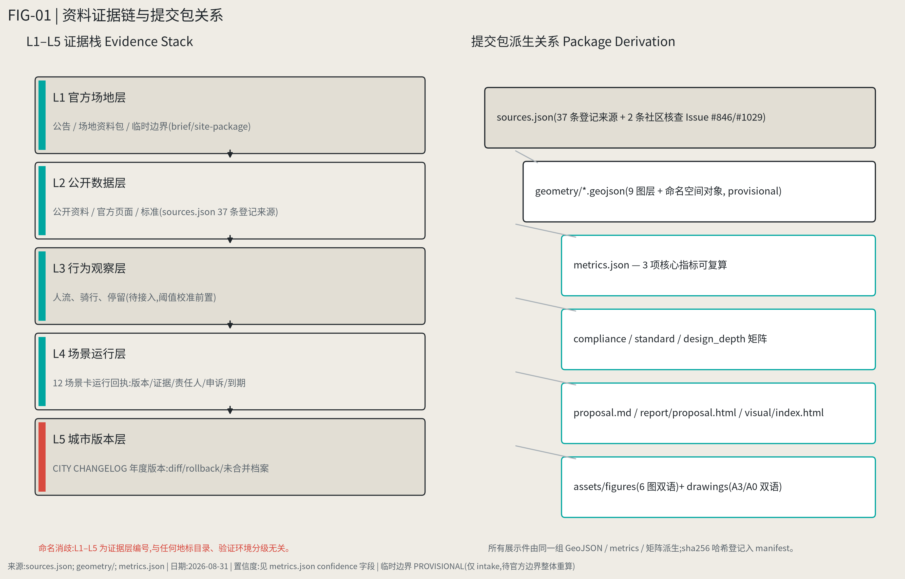

### Roots → choices → objects: why this line belongs in Haidian

JZ OPENLINE may look futuristic, but it does not fall from the sky. Four roots that can be observed in history and everyday urban life are translated into spatial and operating choices. They explain *why here*; they do not replace statutory boundaries, controls, or measured data (root mapping: R-01 / R-02 / R-03 / R-04).

| Root | Design choice | Checkable objects |
| --- | --- | --- |
| Self-reliant making | Put research, engineering, standards, safety evaluation and product translation on one CREATE→VERIFY→ADOPT chain | `PROV-KEY-002`, `PROV-KEY-001`, `PROV-KEY-003`; `BLDG-003/004`; Scenario Cards 05/06/07 |
| Shared commons | The park remains everyday public space first; innovation returns to the community with low intrusion and no loss of service for people who decline AI | `GREEN-001..003`, `PUBLIC-001..005`; Scenario Cards 03/08/10/12 |
| Reversible resilience | Small pilots, stage gates, human takeover, exit audit and site restoration operate together; resources follow evidence | `CONSTRAINT-001..005`, `PHASE-001..003`; NO EXIT, NO ENTRY |
| Quiet intensity | Keep 90% quiet public life and 10% high-intensity nodes; favor adaptive reuse, movable elements and layered lighting | `BLDG-001/002/006`, `GREEN-001..003`; Scenario Cards 04/09/10 |

The historical line is therefore operational rather than decorative: the Jing-Zhang railway supplies an engineering starting point, Zhongguancun supplies a city-scale translation experience, the heritage park supplies a stock-renewal and commons carrier, and AI adds a verifiable operating layer to an existing urban relationship. `simulation.json#rooted_design_matrix` stores the complete mapping, sources and confidence; it is design interpretation, not policy endorsement.

While official `SITE_BOUNDARY` or the three `KEY_AREA` polygons are unavailable, this package is generated from `brief/site-package/geometry/provisional_boundaries.geojson`. `geometry/site_boundary.geojson` and `geometry/key_areas.geojson` are marked `provisional_constraint`, `official_boundary=false`: usable for design generation, self-check, visualization, and discussion only — never as official redlines, approval bases, precise area bases, or statutory conclusions. Once official polygons are released, all layers and metrics must be recomputed. See [data:geometry/site_boundary.geojson#SITE-001] [metric:site_area_sqm] and [data:geometry/key_areas.geojson#PROV-KEY-001] [metric:key_area_count].

Beyond the site package, three tiers of external public data are planned (not yet acquired; all listed in `assumptions.json` pending licensing, to be registered into `sources.json` upon lawful use): statutory/existing conditions (Beijing public data platform, Haidian open data, public planning annexes, education/health authority registries), urban behavior (Amap traffic, Baidu Huiyan population, licensed platform aggregates), and innovation networks (OpenAlex, CNIPA, public firm/funding data). Until acquired, all related judgments are stated as methods and pending items — no numeric claims.

## Three-Level Scope Framework

Per the announcement: the ~43.6 km² coordination scope addresses AI industry ecology, strategic positioning, innovation chains, and future urban form; the ~11.4 km² overall design scope addresses urban renewal framework, industry spatial layout, transport/municipal support, and urban character control; the ~368.4 ha key-area scope addresses detailed design of three districts. All are mapped row-by-row in `compliance_matrix.json` covering announcement 1.3/1.4/1.5 and agent.1–agent.6.

Depth items [depth:three_level_scope_framework] and [depth:overall_spatial_structure]; spatial evidence [data:geometry/site_boundary.geojson#SITE-001] and [data:geometry/key_areas.geojson#PROV-KEY-001]; task basis [standard:PROJECT-OFFICIAL-ANNOUNCEMENT]; navigation [source:PROCESSED-FACT-PACK].

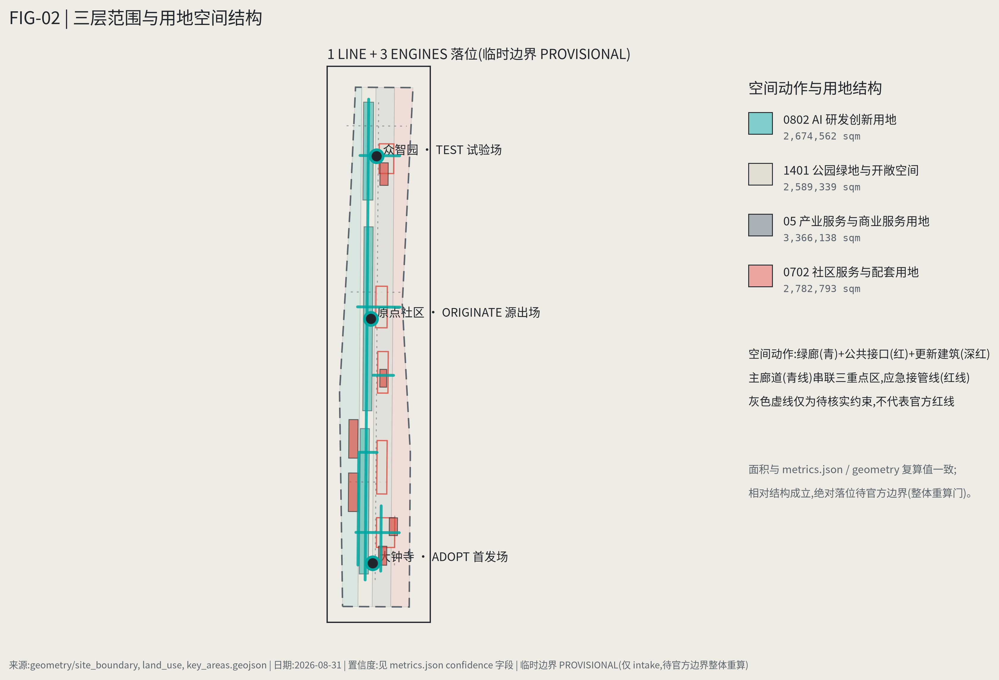

| Level | Design question | Proposal answer | Evidence |
| --- | --- | --- | --- |
| Coordination scope | How to organize AI ecology and future urban form | CREATE→VERIFY→LAUNCH→ADOPT→SCALE→RETURN chain + Research→Commons→Venture→City ecology | compliance_matrix.json, standard_matrix.json |
| Overall design scope | How to draw industry, renewal, transport, character | Three districts-three questions + two-wing interfaces + nine stitching points; full layer set | [data:geometry/land_use.geojson#LU-001], [data:geometry/roads.geojson#ROAD-001] |
| Key areas | How to reach detailed-design depth | ORIGINATE / TEST / ADOPT — three spatial questions | [data:geometry/key_areas.geojson#PROV-KEY-001..003] |

## Coordinated Research Area: Industry and Future City Research

### Global cases: study mechanisms, not shapes

We study the institutional and spatial mechanisms by which research becomes companies and city products, rather than architectural imagery. The seven cases below extract only mechanisms stated by their operators or public authorities. They are neither complete evaluations of those cities nor proof that the same mechanism will work in Haidian. Case-by-case sources and use boundaries are recorded below and in `sources.json` [source:CASE-ONE-NORTH-JTC] [source:CASE-LONDON-KQ].

| Case | Verified mechanism | Research hypothesis for Jing-Zhang | Source and use boundary |
| --- | --- | --- | --- |
| Singapore one-north / LaunchPad | Startups co-locate with incubators, accelerators and venture capital, while estate facilities support testbedding | Include the place operator as both test host and feedback organiser, beginning with small reversible pilots | [source:CASE-ONE-NORTH-JTC]; mechanism reference only—no claim of partnership, equal performance or transfer agreement |
| Seoul Yangjae–Suseo Physical AI Belt | The city proposal connects AI R&D in Yangjae with real-world robot validation in Suseo and frames the city as a testbed | ORIGINATE / TEST / ADOPT must be connected by explicit migration gates; a city cannot offer offices alone | [source:CASE-SEOUL-PHYSICAL-AI]; planned facilities are not described as fully delivered and incentives are not copied |
| Toronto MaRS + Vector | MaRS organises ventures, space and technology adoption; Vector connects AI research, talent and industry adoption | Separate research support from city adoption as auditable roles, joined by run receipts | [source:CASE-MARS] [source:CASE-VECTOR]; the two institutions are not presented as a single merged operator |
| Montreal Mila | Its official material describes venture support that translates AI research into companies | Add researcher-to-founder capability building at ORIGINATE without presuming company output | [source:CASE-MILA-VENTURES]; reported figures are not Jing-Zhang targets or independent performance conclusions |
| Paris-Saclay PUI | A university-led cluster connects universities, research bodies, transfer organisations, and public/private partners for technology transfer and company creation | Organise cross-institution work through shared questions, role lists and impact review—without inventing unified land or administrative authority | [source:CASE-PARIS-SACLAY-PUI]; governance and translation mechanism reference only |
| Kendall Square | The City of Cambridge describes a research/technology cluster coexisting with housing, hotels, restaurants, shops and other urban support | Observe daily life and innovation space together; do not turn the park into an industry showroom | [source:CASE-KENDALL-CAMBRIDGE]; no claim that mixed use alone causes talent retention |
| London Knowledge Quarter | A membership alliance connects research, business and culture around collaboration, place and inclusion | The three districts and two wings may convene issue-based collaboration tables, but an alliance is not a statutory planning or approval body | [source:CASE-LONDON-KQ]; no claim of partnership or transferred governance authority |

Haidian's real differentiation is not "we also have AI firms" but the overlap of **rare research density + university density + Zhongguancun startup culture + an open 9 km century-old railway public space** [source:PARK-OPEN-CNR-20260806]. Hence the ecology model **Research → Commons → Venture → City**: research enters a public innovation commons, spins out ventures, then enters the real city — and the city is not the end but the validation-and-feedback stage [source:AGENT-TASKBOOK] [standard:PROJECT-AGENT-OPEN-CALL-TASKBOOK].

### External regional innovation coordination: five conceptual interfaces, not existing partnerships

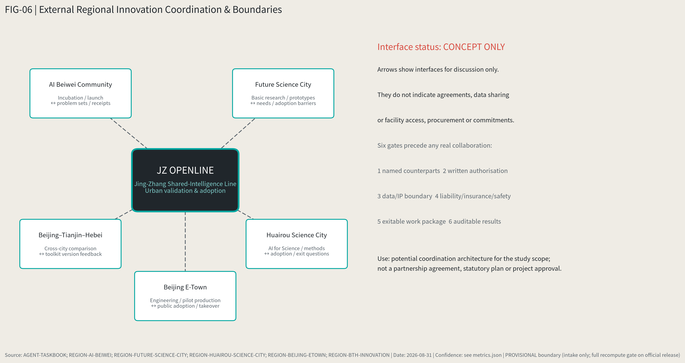

The figure and table respond to the taskbook's regional-coordination requirement. **Every arrow is a bidirectional conceptual interface for discussion**. It does not mean JZ OPENLINE has signed agreements, obtained data, opened facilities, arranged investment attraction, or secured government commitments [source:AGENT-TASKBOOK].

| External node | Role confirmed by public material | Potential bidirectional interface | Shared value | Evidence and responsibility boundary |
| --- | --- | --- | --- | --- |
| Zhongguancun AI Beiwei Community | Incubation, shared technical services, scenario application, product launch and talent community | Beiwei may contribute early-team/product validation questions; Jing-Zhang may return anonymised city problem sets, run receipts and exit reviews | Reduce the break between incubation and city adoption, while bringing real demand into venture support earlier | [source:REGION-AI-BEIWEI]; no existing partnership, company referral, space or funding commitment; future work requires named operators and separate authorisation |
| Future Science City | Basic research, strategic science capacity, talent concentration and research translation platform | Research prototypes and scientific questions may enter Jing-Zhang's low-risk urban validation backlog; Jing-Zhang may return public-service needs and adoption barriers | Add an urban-problem entry point for basic research and a cross-disciplinary upstream supply for Jing-Zhang | [source:REGION-FUTURE-SCIENCE-CITY]; no assumption that laboratories, people, outputs or data are open to this project |
| Huairou Science City | AI for Science, major science facilities, scientific-data governance and research-to-industry translation | Huairou may provide authorised methods or candidate tools; Jing-Zhang may contribute adoption and exit questions from low-risk public settings | Complement evidence that a facility/model works with evidence that a city service can adopt it | [source:REGION-HUAIROU-SCIENCE-CITY]; no authorisation of facilities, research data, compute or a joint laboratory is implied |
| Beijing E-Town | City-scale engineering experiments, test–verification–deployment, pilot production and industrial application | E-Town may receive mature candidates needing engineering/pilot production; Jing-Zhang may add human-centred evidence on public-space adoption, complaints, human takeover and restoration | Validate engineering maturity and public adoption separately before scaling | [source:REGION-BEIJING-ETOWN]; no procurement, manufacturing, subsidy, scenario allocation or industrialisation commitment |
| Beijing–Tianjin–Hebei | Policy calls for cross-regional scientific-intelligence collaboration and common-technology research | Subject to separate authorisation in each place, the Urban Scenario Validation Toolkit may compare different city contexts and version the differences back into the toolkit | Create a reusable cross-regional learning loop without pretending it is one uniform standard | [source:REGION-BTH-INNOVATION]; JZ OPENLINE is neither an official standard issuer nor an approved regional pilot network |

**Common gates before any real collaboration:** named counterpart organisations, written bilateral authorisation, data and IP boundaries, responsibility/insurance/safety arrangements, an exitable work package, and publicly auditable results. If any item is absent, the interface remains `concept_only` [source:REGION-BTH-INNOVATION].

### JZ URBAN EVIDENCE STACK (method design; data pending licensing)

No beautiful heatmap can replace road redlines, existing buildings, and public-service baselines. Data discipline: **statutory and existing conditions first, behavior and innovation networks second.** The five layers L1–L5 here refer strictly to **data-evidence layering** (statutory space / urban facilities / urban behavior / urban labor / innovation networks) — unrelated to any landmark catalog numbering or verification-environment grading elsewhere in this open call; this note exists to prevent confusion.

| Layer | Content | Planned source types |
| --- | --- | --- |
| L1 Statutory space | Regulatory plans, road redlines, heritage, buildings, land use | Public planning annexes, Beijing public data platform (annex alignment by document, never guesswork) |
| L2 Urban facilities | Education, health, eldercare, retail, transport | Departmental registries, Haidian public-service maps |
| L3 Urban behavior | Congestion, footfall, OD, metro ridership, walking, cycling | Amap / Baidu Huiyan and licensed aggregates |
| L4 Urban labor | Riders, couriers, cleaners, security, maintenance | Licensed platform aggregates and fieldwork — the layer most proposals ignore; our specialty |
| L5 Innovation networks | Papers, patents, firms, funding, open-source projects | OpenAlex, CNIPA, public firm databases |

Once connected, seven evidence maps (working titles): 01 AI Knowledge Density; 02 Innovation Leakage (10-minute campus walksheds × labs × coffee/social × incubators × housing × metro); 03 24H Urban Pulse; 04 East-West Barrier Index (straight-line vs actual walking distance, detour time, crossing waits, entrance density, cycling continuity, metro-to-park access); 05 Public Service Gap; 06 Delivery Friction; 07 AI Opportunity Map. These maps determine where the 9 interfaces land and where scenario cards sit — spatial propositions driven by evidence, not circles in search of reasons.

Future urban form, in one line: AI changes not the count of screens but the total of queuing, detouring, searching, and waiting. Industry indices, AI innovation indices, and talent density remain `pending` until official data arrives [depth:overall_spatial_structure].

## Overall Design Area: Urban Renewal and Regulatory-Plan-Level Urban Design

The spatial organization: **one spine, three districts-three questions, two-wing interfaces, nine stitching points** — the park as north-south spine; Zhongzhiyuan / AI Origin Community / Dazhongsi as TEST / ORIGINATE / ADOPT; the west wing organizing capital and knowledge services, the east wing organizing urban life and real demand; nine civic interfaces stitching the two sides of the railway.

Per [standard:MOHURD-CONTROL-DETAILED-PLANNING]: [data:geometry/land_use.geojson#LU-001] for land-use structure, [data:geometry/buildings.geojson#BLDG-001] for building footprints, [data:geometry/roads.geojson#ROAD-001] for transport organization, [metric:building_footprint_area_sqm] for footprint verification; [depth:land_use_layout] and [depth:development_intensity_controls] constrain depth. Land-use zoning fully covers the design boundary without overlaps; height, intensity, redlines, setbacks, and facility standards are all marked "pending official regulatory conditions" — no guessed values posing as approved figures.

## Detailed Design of Key Areas

The three key areas are three spatial questions of the innovation chain, each referencing its layer [data:geometry/key_areas.geojson#PROV-KEY-001] [data:geometry/key_areas.geojson#PROV-KEY-002] [data:geometry/key_areas.geojson#PROV-KEY-003], depth-checked by [depth:three_key_area_detailed_design]; their provisional status is declared across text, sources, assumptions, and self-check. `compliance_matrix.json` covers announcement 1.5.3.1/1.5.3.2/1.5.3.3 respectively.

Each bundle is a **Project Record**: a design-review object rather than an administrative credential. It joins spatial evidence, a stage gate, an operator candidate, a fallback path and a sunset condition; without those fields the item remains a concept suggestion.

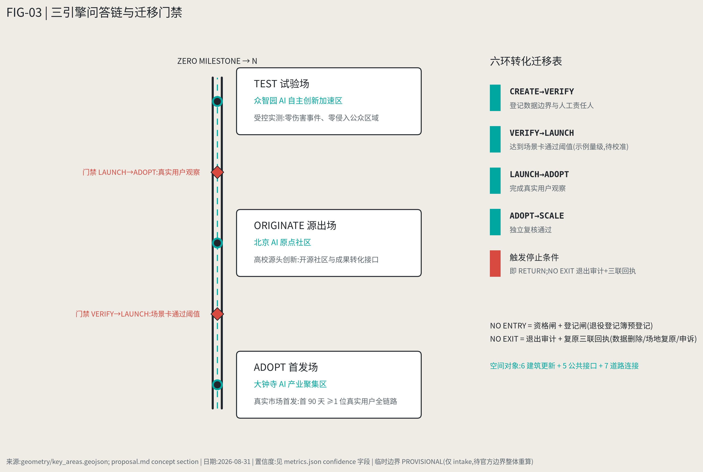

| Key area | Project Record | Question | Positioning | Core spatial moves | Evidence |
| --- | --- | --- | --- | --- | --- |
| Beijing AI Origin Community | ORIGINATE | How do good results spill out of campus? | Near-campus translation & open-source talent community | Campus-park-block slow-mobility stitching; results publishing, tech-transfer clinic, open-source collaboration space, talent housing; retain/renovate/demolish classes pending existing-building data | [data:geometry/key_areas.geojson#PROV-KEY-002], [source:AGENT-TASKBOOK] |
| Zhongzhiyuan AI Acceleration Area | TEST | Does it work, safely? | Garden-style full-stack innovation & testing district | Physical AI Test Yard (robots, perception, navigation, safety evaluation at low risk); standards & safety-governance showcases; Qinghe low-carbon innovation frontage; external transport | [data:geometry/key_areas.geojson#PROV-KEY-001], [depth:three_key_area_detailed_design] |
| Dazhongsi AI Industry Cluster | ADOPT | Will people actually use it? | Global launch zone for AI city products (not an "AI shopping street") | Agent services, smart terminals, AI consumer products, smart education, AI health services, robot commerce, AI cultural products entering the real market under observation; Dazhongsi station integration and four-quadrant pedestrian connection; main URBAN SERVICE HUB | [data:geometry/key_areas.geojson#PROV-KEY-003], [metric:key_area_count] |

### Key-area spatial action ledger: from concept to auditable objects

The three key areas are now represented by objects that can be cross-checked in maps, metrics, and run records rather than by names alone. Every object is a concept suggestion; absolute siting remains constrained by the provisional boundary.

| Key area | Spatial objects | First move | Gate |
| --- | --- | --- | --- |
| Dazhongsi ADOPT | `BLDG-004/005` launch hall and URBAN SERVICE HUB; `PUBLIC-003` forecourt; `ROAD-003/004/007` interfaces and emergency takeover | Complete one real-user full-chain receipt within 90 days; retain staffed counter, paper map and human takeover | Real-user observation + zero public-realm intrusion + exit drill |
| Origin ORIGINATE | `BLDG-001/002/006` transfer workshop, health navigator, observatory; `PUBLIC-002/004/005` living room, shared steps, observatory deck; `ROAD-006` safe spur | Put results publishing, tech transfer, community health and public readings on one walkable chain | Human baseline comparison + data minimization + community review |
| Zhongzhiyuan TEST | `BLDG-003` Physical AI safety yard; `GREEN-001` Qinghe ecology segment; `PUBLIC-001` interface plaza | Complete safety review in a closed, reversible test setting before moving to park interfaces | Safety approval + independent review + no gate, no scale |

Spatial objects, owners, dependencies and phases are registered in `geometry/*.geojson`; the 12 scenario cards' baselines, thresholds, fallback paths, human paths and audit fields are registered in `simulation.json`. `defined_not_run` explicitly means defined but not field-tested; it never presents a simulated outcome as observed performance [data:geometry/buildings.geojson#BLDG-004] [data:geometry/phasing.geojson#PHASE-001] [source:SIMULATION-CONCEPT-REGISTRY].

**Project Record field contract:** every record stores `project_id`, `purpose`, `spatial_objects`, `operator_candidate`, `evidence_gate`, `fallback`, `sunset_condition`, `source_refs` and `status`. `status=concept_only` means that without a confirmed operator or run evidence the item remains discussable but cannot become an engineering commitment. Scenario Verification Cards, Run Receipts and the City Changelog are its three attachments: “can we test?”, “what actually ran?”, and “what changes next year?”.

**Minimum implementation unit:** every node needs a spatial object, operator, evidence gate, fallback path and sunset condition; without one, it remains conceptual. Budget and staffing use sensitivity ranges only, pending ownership, fire, utility, procurement and maintenance audits; no investment or government commitment is implied.

### Park design atlas: how to build, use, and step back

These four renderings are not a glossy promise of a finished park. They translate the sequence into scenes that a non-specialist can read at a glance: protect railway heritage and everyday life first; adapt existing buildings next; keep testing inside a closed, reversible boundary; only then bring verified services into ordinary markets, streets and parks. Buildings, trees and people are conceptual placeholders; final siting depends on official boundaries, ownership, heritage, transport and engineering conditions [source:AI-RENDER-ATLAS].

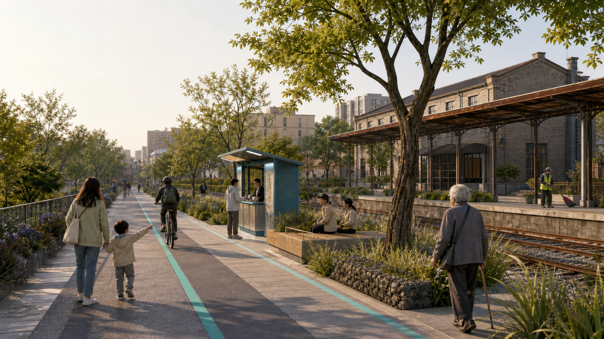

**01 | Make the park useful every day first.** Keep the railway traces, then add the walking/cycling line, seating, rain gardens and a human service desk. AI stays quiet in the background, assisting wayfinding and maintenance rather than taking over the public realm.

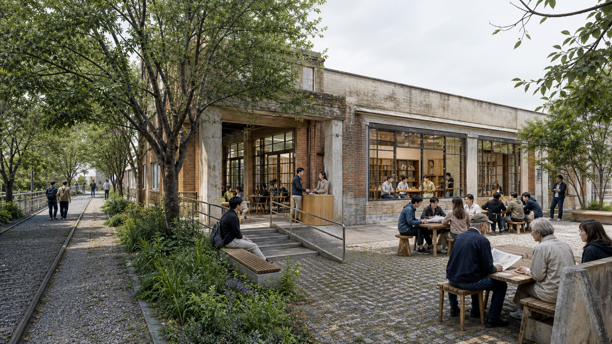

**02 | Turn existing fabric into a working commons.** The Origin Community is not a closed campus: publishing, technology transfer, community health and neighborly exchange share one walkable chain. Retain, adapt and insert decisions remain subject to ownership and fire-safety checks.

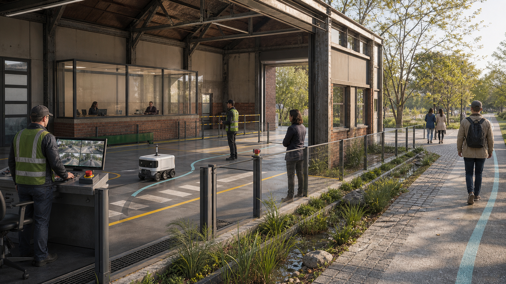

**03 | Finish testing inside the boundary.** A visible safety buffer, manual control desk and emergency stop separate the test yard from the park. Without independent review and an exit drill, devices do not move onto public paths.

**04 | Enter ordinary life last.** The Dazhongsi node is not an “AI shopping street.” Residents, shopkeepers, riders and older visitors can try new services while a staffed counter, paper map and rollback path remain available.

The four scenes correspond to the three Project Records and 12 scenario cards in `simulation.json`: the public greenway is the shared base, Originate handles translation, Zhongzhiyuan handles testing, and Dazhongsi handles adoption. They are a visual entry point for professional deepening, not official renderings or construction documents.

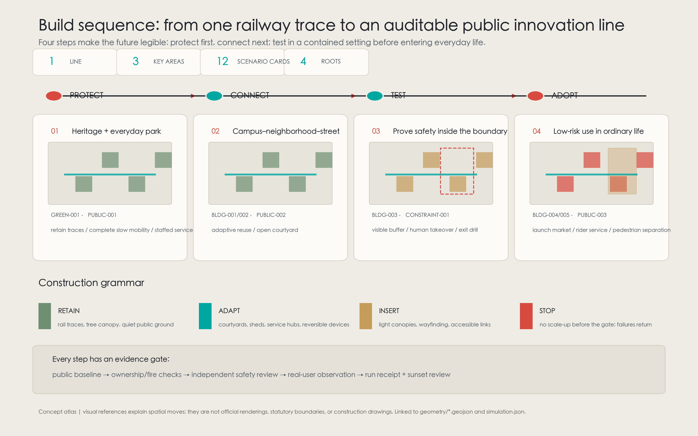

To keep the renderings from stopping at “looks good,” the three most conflict-prone interfaces are unpacked as typical sections. The heritage park places rail trace, slow mobility, rain garden and staffed service side by side; Zhongzhiyuan separates the public path, planted buffer, visible edge, test yard and manual emergency stop; Dazhongsi separates the walkable forecourt, service hub, adapted building and delivery route. The sections invent no site dimensions, while every component points back to `GREEN/ROAD/PUBLIC/BLDG/CONSTRAINT` objects so surveyed, ownership, fire-access and utility information can set dimensions in the next stage [source:DESIGN-SECTION-PHASING-ATLAS].

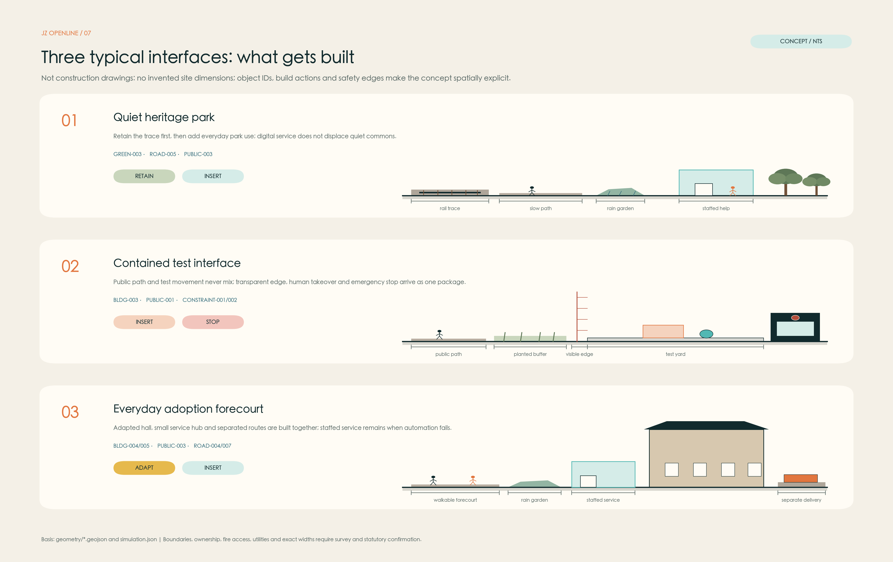

Future delivery is not drawn as a one-shot end-state either. P0 verifies the official boundary, title, fire access, utilities, accessibility and accountable lead; P1 releases only light protect-and-connect works; P2 completes independent review inside the boundary; P3 opens a 90-day real-life adoption window; and P4 uses run receipts to choose segmented scale-up or restoration. Safety degradation, accumulating complaints, an incomplete audit or budget overrun activates RETURN: stop, human takeover, publish the gap and step back one stage [data:geometry/phasing.geojson#PHASE-001] [source:SIMULATION-CONCEPT-REGISTRY].

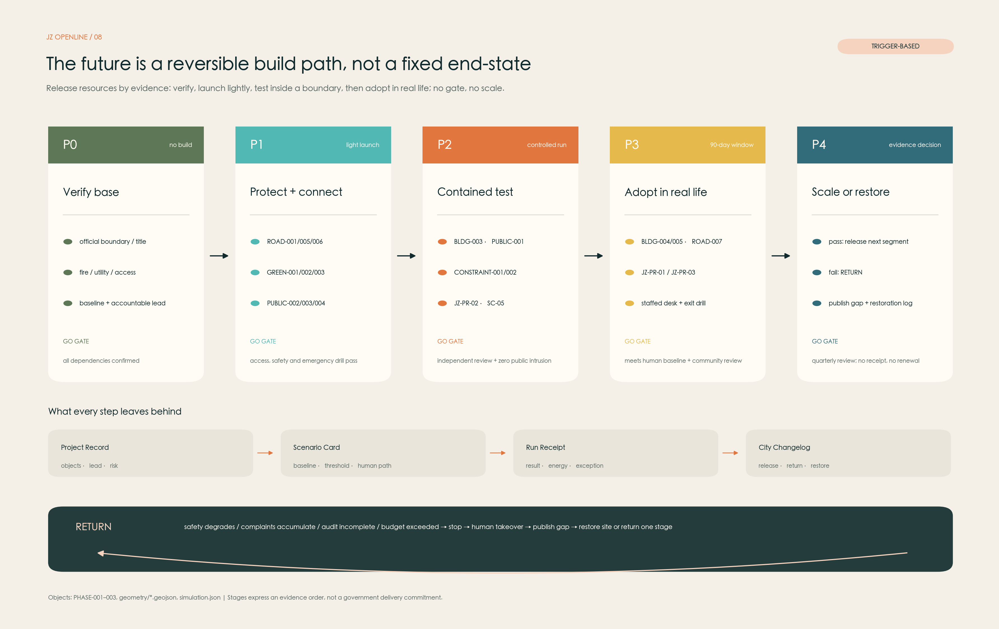

The three engines form the CREATE→VERIFY→LAUNCH spatial front half; ADOPT→SCALE→RETURN is completed by Dazhongsi, the two wings, and urban data feedback. Programs, building scales, retain/renovate/demolish classes, public-space systems, transport, slow-mobility links, and implementation projects unfold in HTML, the A3 booklet, and A0 boards; precise figures without boundaries stay `pending`.

## AI Innovation Ecology, Personas, and AI+ Scenarios

AI is not a screen. AI can be five minutes less detour, twenty minutes less queue, an elderly person finding the hospital more easily, a rider finding the right building, a foreign researcher entering the city, a developer finding a testbed. That is the kind of AI residents will support. This chapter meets the taskbook requirements of ≥10 scenario cards, ≥3 test/validation scenarios, ≥5 personas [source:AGENT-TASKBOOK]; all scenarios are concept suggestions subject to privacy, safety, and human-review assessment before deployment, and to NO EXIT, NO ENTRY.

**Personas (6 classes):**

| Persona | Typical needs | Spatial response | Privacy & review boundary |
| --- | --- | --- | --- |
| Open-source developers/researchers | Publishing, collaboration, testing, reputation | Origin community release hall, OPEN SOURCE WALK, night collaboration space | No personal trajectory collection; aggregate stats only |
| Startup teams | Low-cost offices, compute access, testbeds | Zhongzhiyuan shared test yard, edge-compute points, standards consulting | Compute/data services separately authorized |
| Delivery workers (riders/couriers) | Parking, charging/battery swap, shelter, rest, last-mile navigation, night services | URBAN SERVICE HUB (Dazhongsi main + campus nodes) | Labor data for facility improvement only, never platform scoring |
| Nearby residents (incl. elderly, children) | Commuting, leisure, community services, low-disturbance renewal | Park slow-mobility loop, embedded community services, age-friendly paths, graded night lighting | Resident profiles never used for commercial recommendation |
| University faculty & students | Translation, cross-campus collaboration, daily slow mobility | Campus-park stitching, translation stations, cross-campus course navigation | Campus data and research results require authorization |
| International researchers/visitors | Multilingual services, housing/meeting/transport/culture navigation | Global Talent Concierge (metro + park nodes) | Minimal data collection with stated purposes |

**12 AI scenario cards (concept proposals):** a scenario description without a threshold is not a test — it is a wish. Every card follows a seven-field discipline: task definition, measurable indicator, baseline source, pass threshold, failure rollback, data caliber, and human-equivalent path. Thresholds are example magnitudes, to be calibrated into formal baselines once the L3 behavior layer arrives; the "no-AI equivalent path" exists before the smart layer — the scenario-level contractual form of PEOPLE FIRST and NO EXIT, NO ENTRY: residents who refuse the smart service receive no degraded service.

| # | Card | Spatial host | What it answers | Pass threshold (example magnitude, pending calibration) | No-AI equivalent path |
| --- | --- | --- | --- | --- | --- |
| 01 | Campus Without Walls | Around Tsinghua/PKU/CAS, Origin community | Cross-campus courses, lectures, labs, and public-space navigation | Navigation task completion no worse than the human-information-desk baseline (example ≥90%) | Printed schedules + campus info desks + human guides |
| 02 | Research-to-Founder Clinic | Origin community + West Wing | AI-assisted tech transfer, patents, team and investor matching | Match-advice adoption rate no worse than the human tech-transfer clinic (example magnitude) | Human tech-transfer office clinic |
| 03 | AI Community Health Navigator | Xiaoyuehe communities | Care navigation, translation, rehab and health-service linkage; medical judgment stays human | Correct-department arrival rate no worse than human guidance (example ≥95%) | Human guidance desk at community hospitals |
| 04 | Assistive Robot Walk | Park / Xiaoyuehe | Low-risk test path for eldercare, rehab, assistive robots (test scenario ①) | Zero harm events; elderly completing target path segments at baseline rate (example magnitude) | Human-accompanied walks + accessible facilities |
| 05 | Physical AI Test Yard | Zhongzhiyuan | Robots, perception, navigation, safety evaluation (test scenario ②) | Test tasks completed with safety evaluation passed; zero intrusion into public areas | Closed-field human test procedures |
| 06 | Agent Retail Street | Dazhongsi | Merchant AI agents, personalized services, new consumption experiments (test scenario ③) | Transaction success no worse than human counters; complaint rate not rising (example magnitude) | Human cashiers and shop assistants |
| 07 | Future Product Launch Market | Dazhongsi | Short-run launches/tests of new devices and apps in the real market under observation | First 90 days: ≥1 real user completes the full chain with verifiable feedback | Conventional product launches and offline trials |
| 08 | Rider Friendly Hub (URBAN SERVICE HUB) | Dazhongsi + campus nodes | Parking, charging, battery swap, toilets, water, shelter, rest, order waiting, robot handoff, building navigation, night services | Rider waiting/building-finding time no worse than the current baseline (example: zero increase) | Staffed service points + printed building maps |
| 09 | Global Talent Concierge | Metro + park nodes | Chinese-English multilingual city services and navigation | Multilingual navigation task completion no worse than bilingual human desks (example magnitude) | Human information desks + bilingual signage |
| 10 | Quiet AI Park | Whole corridor | Screenless AI: maintenance, accessible navigation, plant education | Facility-maintenance response time no worse than the human-inspection baseline | Human inspection rounds and on-site signage |
| 11 | HUMAN+ROBOT Logistics | Dazhongsi-campus corridor | Rider-robot cooperative delivery: handoff lockers, path layering, human takeover on exceptions | 100% human takeover on exceptions; delivery time no worse than the rider-only baseline | Rider-only delivery |
| 12 | City Observatory | Data-observation line nodes | Public display of park operations data (flow/traffic/ecology/facilities); evidence capture for the annual changelog | Public readings consistent with raw records and third-party recomputable | Printed notice boards and periodic human bulletins |

**Scenario-space-operation mapping:** public-space scenarios reference [data:geometry/public_space.geojson#PUBLIC-001], mobility scenarios [data:geometry/roads.geojson#ROAD-001], open-space scenarios [data:geometry/green_space.geojson#GREEN-001] with [metric:public_space_ratio] and [metric:green_ratio]. Every scenario registers its users, location, data sources, privacy boundary, human-review mechanism, and operator. Every run of an urban-intelligence service leaves a **run receipt** (five fields: service version, evidence pointer, named human owner, appeal number, expiry date), aggregating into the single-run-level evidence of the CITY CHANGELOG. Governance suggestions follow data minimization, public sources, explainability, and human review — urban agents help detect gaps, heat, maintenance, and service needs but never replace planning approval, never output unauthorized personal profiles, never claim official implementation commitments.

## Jing-Zhang Heritage Park: Four Overlaid Lines, Nine Interfaces, and the Urban Service Hub

CNR reported on 6 August 2026 that Phase II of the Jing-Zhang Railway Heritage Park had officially opened, forming a 9 km linear public space directly serving 70 communities and about 450,000 residents; a 2024 Haidian government report provides a pre-construction cross-check of the same scope [source:PARK-OPEN-CNR-20260806] [source:PARK-PLAN-HAIDIAN-20240920]. These figures are **background for public-life priority only**; they do not establish an official project boundary, precise design area, engineering acceptance, or operating performance. **This is not a blank site to redesign**: until the park inventory is field-verified, protect everyday public life first and only then layer an AI innovation belt. Design principle: **90% stays quiet, 10% high-intensity innovation nodes** — no LED strip along the whole line.

**Four overlaid lines on one railway:**

| Line | Content | Priority |
| --- | --- | --- |
| Public Life Line | Residents' walking, elderly, children, cycling, commuting come first | Highest — PEOPLE FIRST |
| Innovation Translation Line | University results travel here into testing, ventures, launches, markets | Embedded in life-line nodes |
| Cultural Timeline | 1909 railway engineering → Zhongguancun startup culture → AI open-source culture | See culture chapter |
| Data Observation Line | Continuous observation of flow, transport, ecology, public services, scenario performance — feeding operations and the CITY CHANGELOG | Low-intrusion sensing, publicly transparent |

The park thus becomes an **Urban Living Lab + Public Commons**, not a tech theme park.

**9 CIVIC INTERFACES (concept):** the railway cannot carry only north-south movement; it must truly connect its east and west sides. Interfaces are not rooms but stitching devices, each answering "what should connect across the railway":

| # | Interface | What it stitches | Evidence map |
| --- | --- | --- | --- |
| 01 | University | Campus ↔ park/community; courses and translation flows | 02 Innovation Leakage |
| 02 | Research | Labs ↔ test yard/launch market | 01 Knowledge Density |
| 03 | Venture | Incubators ↔ capital/market services | 07 Opportunity Map |
| 04 | Community | Housing ↔ park life segments | 03 24H Pulse |
| 05 | Education | Schools ↔ park education scenarios | 05 Service Gap |
| 06 | Healthcare | Hospitals ↔ community/rehab/slow mobility | 05 Service Gap |
| 07 | Commerce | Retail ↔ park footfall/launch market | 03 24H Pulse |
| 08 | Transport | Metro/road network ↔ park entrances and slow mobility | 04 Barrier Index |
| 09 | Culture | Heritage nodes ↔ city cultural routes | Cultural Timeline |

Exact interface locations will be computed from the East-West Barrier Index once data arrives, and marked on the A0 boards; for now we declare the method only — no pseudo-precise dots.

**URBAN SERVICE HUB (a deliberate differentiator):** delivery workers are not "urban background" but a formal class of city users. Facilities: parking, charging, battery swap, toilets, drinking water, shelter, rest, order waiting, robot handoff, building navigation, night services. The stance: **HUMAN + ROBOT LOGISTICS** — riders and robots cooperate rather than compete (handoff lockers, path layering, human takeover on exceptions). Main hub at Dazhongsi, sub-hubs at campus nodes, connecting interfaces 06/07/08 and the EAST WING; the L4 urban-labor data layer informs siting and sizing.

**AI pilgrimage landmarks (subtraction: only four; ≥3 required):**

| # | Landmark | Concept |
| --- | --- | --- |
| ① | ZERO MILESTONE | 1909 was the origin of Chinese railway engineering; today marks the re-departure of Chinese AI urban innovation — commemorating "China's independent innovation setting out again," not any company; the Km index and 0|1 milestone system become corridor-wide wayfinding |
| ② | OPEN SOURCE WALK | A roofless AI museum: papers, code, models, robots, patents, and city applications along the old track, continuously updated through verifiable links (DOI, repo, commit hash) |
| ③ | COMMIT WALL | Not "who is richest" but who contributed open models, AI safety tools, accessibility tools, public data, and urban-problem solutions; the physical form of the ANNUAL COMMIT ritual |
| ④ | ORIGIN SWITCH (candidate) | Public art on the railway switch motif: in the rail era the switch decided where trains go; in the AI era it symbolizes every entry-or-exit decision of the city (NO EXIT, NO ENTRY made physical) |

All landmarks respect heritage, green-space, and traffic-safety constraints; no over-entertainment or vulgarization; the honor system and component library unfold in HTML and the A3 booklet [depth:blue_green_public_space].

## Cultural Narrative and Wayfinding System

**Master theme: BUILDING CONNECTIONS.** One railway, four generations of builders:

| Generation | Identity | What they connect |
| --- | --- | --- |
| First | ENGINEERS | Cities (physical connection) |
| Second | FOUNDERS | Knowledge and markets (Zhongguancun) |
| Third | DEVELOPERS | Humans and machines (AI) |
| Fourth | CITIZENS | They decide what technology should serve |

The railway's story is not machines growing stronger, but **people inventing ever new ways of connecting**. The fourth generation, CITIZENS, pulls PEOPLE FIRST into the narrative spine, echoing the EAST WING, the Public Life Line, and the COMMIT WALL. The story translates instantly: Engineers → Founders → Developers → Citizens.

**Three overlapping tour routes (three eras on one corridor):** Rail Heritage (remains, Tsinghua Yuan station, etc.), Innovation Heritage (Zhongguancun startup-history nodes), Open Future (landmarks and scenario nodes) — not three separate scenic areas but three eras visible on the same railway. Wayfinding uses the "line—node—switch—station" grammar and the four-color system; the Km index starts at ZERO MILESTONE. All cultural assets, fonts, images, portraits, and corporate marks require cleared sources [source:AGENT-TASKBOOK]; cultural marks and the master Logo belong to different tiers and are never conflated.

## Global Event System and Long-Term Operations

Pilgrimage sites are not made by sculptures but by **rituals people must return for**. Operations system (concept proposals; not government event commitments):

**JZ OPENLINE SEASON (annual cycle):**

| Season | Event | Content |
| --- | --- | --- |
| Spring | Papers → Products | Global papers, research results, venture translation week |
| Summer | City Sandbox | Real-city AI scenario testing season (linked to the TEST yard) |
| Autumn | JZ AI WEEK | Global AI innovation week: launches, investment, demos, forums, international cooperation |
| Winter | ANNUAL COMMIT | The key ritual: top-10 urban AI contributions of the year, open-source contributions, failure cases, exited projects, public value of the year, next year's City Challenge |

Regular rhythm: weekly Developer Walk, monthly Open Source Night, quarterly City Challenge.

**CITY CHANGELOG (operations as governance):** one city version per year — JZ 2027.1, JZ 2028.1, JZ 2029.1… borrowing the full semantics of software releases: every version publishes a **diff** (what was added/changed/removed), **rollbacks** (which scenarios reverted to the last stable version, and the triggering conditions), **deprecations** (which services entered a sunset countdown, with replacement paths), and **known issues** (the most-complained scenarios, the worsening metrics). Failures and successes are published in equal measure — a version wall showing only successes is a billboard, not a changelog. An **archive of unmerged futures** is published alongside: rejected scenario proposals are filed with their rejection reasons, so that "what did not happen" also becomes public evidence. Every AI scenario carries a **sunset clause**: no default renewal at expiry — re-entry through the gate requires run receipts and public-value evidence. "Errors can be discovered and overturned" is the system's core mechanism: the Data Observation Line provides evidence, ANNUAL COMMIT provides ritual, NO EXIT, NO ENTRY provides the rule. One distinction matters: CITY CHANGELOG is a **city versioning system** (recording how the city itself evolved, erred, and reverted) — neither an evaluation-baseline release nor a ranking board. It answers "what changed, what failed, what was fixed in the city last year," not "which AI is strongest." Far more recognizable than yet another forum.

**Translation loop:** global challenge call → developer signup → short residencies → Jing-Zhang Living Lab testing → resident/professional evaluation → enterprise procurement or capital linkage → scenario scale-up → published open cases → ANNUAL COMMIT → next year. **The SCALE ring is the corridor's outward exit: what AI earns at Jing-Zhang is not only local deployment but reusable experience for the next city.** This proposal therefore packages the translation mechanism itself as a public product anyone can take and reuse — the *JZ OPENLINE Urban Scenario Verification Kit* (concept v0.1): Scenario Verification Cards, two-stage gates, Run Receipts, the triple exit-restoration receipt, and city-version semantics, published as an open document that any city may localize and improve. Jing-Zhang is not positioned as an issuer of an official standard; it is a **reusable method sample for doing urban pilots well**. This is the landing point of the “global AI city translation and verification corridor” positioning. Event branding follows the four-color line grammar; operating objects, cadence, responsibility boundaries, translation paths, and risks unfold in the A3 booklet operations chapter.

## Land Use, Building Scale, and Retain/Renovate/Demolish

Land-use zoning follows public standards for territorial survey, planning, and use-control classification, forming complete, closed, seamless zones [standard:MNR-LAND-USE-CLASSIFICATION-GUIDE]. Buildings are classed as retained, renovated, renewed, new, or to-be-confirmed; without existing-building, ownership, regulatory, or engineering data we provide methods and pending lists, never fabricated conclusions. Height, massing, frontage, and character controls are managed by [depth:height_massing_character], retain/renovate/demolish method by [depth:retain_renovate_demolish]; primary evidence: [data:geometry/land_use.geojson#LU-001], [data:geometry/buildings.geojson#BLDG-001], [metric:building_footprint_area_sqm].

Building scale and intensity figures must agree with `metrics.json` and the layers; total floor area, FAR, height, density, green ratio, setbacks, and building control lines are listed as `unknown` or `pending_control` where official conditions are missing. The A3 booklet carries the renewal project list and metric verification tables; the A0 boards express key spatial structures; HTML links metrics and layers.

## Transport, Rail, Municipal, and Public-Service Facilities

Transport answers station-integration, road micro-circulation, slow-mobility gaps, external links, parking, non-motorized parking, and green-transport requirements — focusing on the North 5th Ring, park crossing nodes, Wudaokou, Qinghua East Road West, Dazhongsi station, and key-enterprise surroundings. Road and slow-mobility layers stay within the submission boundary and cross-check against public space, green space, industry nodes, and key areas; while the boundary is provisional, transport conclusions remain temporary design discussion. Depth: [depth:traffic_rail_slow_parking] and [depth:municipal_new_infrastructure]; evidence: [data:geometry/roads.geojson#ROAD-001], [data:geometry/public_space.geojson#PUBLIC-001], [data:geometry/constraints.geojson#CONSTRAINT-001].

Our transport specialty is turning "more east-west links" from slogan into computation: the **East-West Barrier Index** (straight-line vs actual walking distance, detour time, crossing waits, entrance density, cycling continuity, metro-to-park access) finds where stitching is truly needed — and that is where the 9 interfaces land (method declared; computation upon data arrival). This is complementary-opposite to the "unified observation cross-section" baseline idea: a baseline solves north-south comparability, the Barrier Index solves east-west accessibility — the publicly reported 9 km narrow belt poses two directional problems that need two toolsets [source:PARK-OPEN-CNR-20260806].

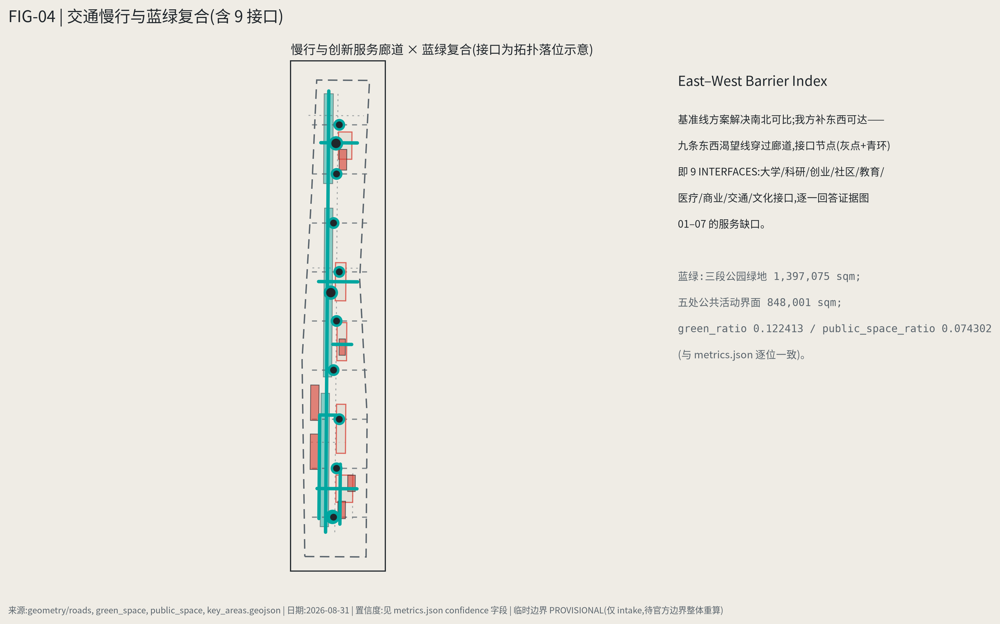

Municipal and public-service facilities cover AI industry services, innovation platforms, talent life services, new infrastructure, distributed energy, edge compute, and conventional utilities; missing pipeline, energy, drainage, flood-control, or fire-safety data is listed as a pre-condition for further development (see assumptions).

## Blue-Green Space, Public Space, and Urban Character

Blue-green space takes the heritage-park vitality belt as its骨架, coordinating Qinghe, Xiaoyuehe, surrounding campuses, firms, and communities, proposing north-south through-routes and east-west connections for walking, cycling, and green systems; identifying slow-mobility gaps, ring-road crossing nodes, and north/south-end landscape nodes; compounding parking, sports, innovation encounters, tech testing, application showcases, and public services. Checked by [depth:blue_green_public_space] with [data:geometry/green_space.geojson#GREEN-001] and [data:geometry/public_space.geojson#PUBLIC-001]; ratios recomputed in `metrics.json`; character coordination returns to [standard:MOHURD-URBAN-DESIGN-MEASURES].

Urban character fuses Jing-Zhang railway history, Zhongguancun innovation culture, and AI culture (see culture chapter), proposing urban tone, building character, roof forms, massing, frontage, and public-art guidance; wayfinding, cultural symbols, international narrative, pilgrimage landmarks, and contribution walls are described above, all with cleared sources. Character control distinguishes official control, design suggestion, and pending conditions — no pseudo-precise control lines without heritage or regulatory basis.

## Renewal Project List, Implementation Policy, and Phasing

Renewal project list (concept proposals; owners, ownership, funding, and approval paths unconfirmed — listed as implementation risks, not commitments):

| ID | Project | Type | Key dependencies | Evidence |
| --- | --- | --- | --- | --- |
| JZ-01 | Nine-interface stitching works (priority ordered by Barrier Index) | Public space / transport | Road redlines, under-bridge space, transport review, evidence map 04 | [data:geometry/roads.geojson#ROAD-001] |
| JZ-02 | ZERO MILESTONE + Km wayfinding system | Culture / wayfinding | Heritage-node clearance, conservation conditions | [data:geometry/public_space.geojson#PUBLIC-001] |
| JZ-03 | OPEN SOURCE WALK | Culture / public space | Exhibit-content clearance, low-intrusion fixtures | [data:geometry/green_space.geojson#GREEN-001] |
| JZ-04 | URBAN SERVICE HUB (Dazhongsi main + campus subs) | Public service / new employment forms | Site ownership, power & battery-swap safety, platform cooperation | [data:geometry/buildings.geojson#BLDG-001] |
| JZ-05 | Physical AI Test Yard (Zhongzhiyuan) | Industry testing / safety | Safety-evaluation norms, insurance and liability mechanisms | [data:geometry/constraints.geojson#CONSTRAINT-001] |
| JZ-06 | Dazhongsi launch market & four-quadrant pedestrian link | Station integration / retail renewal | Rail station, intersections, municipal pipelines | [data:geometry/public_space.geojson#PUBLIC-001] |
| JZ-07 | Data Observation Line & City Observatory | New infrastructure / governance | Sensor compliance, data publicity mechanism | [data:geometry/constraints.geojson#CONSTRAINT-004] |
| JZ-08 | CITY CHANGELOG operations & ANNUAL COMMIT | Operations / branding | Public-space permits, event safety, copyright clearance | [data:geometry/phasing.geojson#PHASE-001] |

Phasing is distinct from the solicitation design period: near-term starts light (wayfinding, the walk, HUB pilots, event system), mid-term advances interface works and district renewal, long-term forms the governance framework; no engineering conclusions before statutory, municipal, transport, and ownership conditions confirm. Managed by [depth:renewal_project_list] and [depth:phasing_implementation]; phasing evidence [data:geometry/phasing.geojson#PHASE-001].

**Cost and funding discipline (concept scenarios — not quotations, not commitments):** absent cost norms and ownership conditions, this proposal gives **sensitivity ranges and calculation logic only**, never fake-precise totals; formal budgets stay `null` until conditions exist. Magnitude examples: the near-term light-start package (wayfinding, first OPEN SOURCE WALK fixtures, URBAN SERVICE HUB main-station retrofit, first-year seasons) is estimated as recomputable unit-price ranges × quantities, with each light project's 90-day pilot cost held within a six-figure-CNY sensitivity range (labor = market-rate range × hours; materials = public price ranges); the URBAN SERVICE HUB main station is sized at a service-staffing magnitude of ~6 rotating staff per station (borrowing peer service-station staffing methods), calibrated against the order-waiting-time baseline. Funding follows a five-channel concept scenario: special bonds and district pooling (public-space works), enterprise adoption and scenario fees (test yard and launch market), operating revenue (HUB services and events), public-service purchasing (community-service scenarios), and private capital/REITs (long-range scenario only, subject to dedicated study); each scenario states its preconditions, approval path, failure conditions, and a fallback — downgrade to the next scenario when any condition fails. **Resource release is bound to evidence gates**: phasing budgets are not disbursed in one lump but released per six-ring evidence gate (illustrative split: 25% on verification pass / 25% on launch acceptance / 25% on adoption review / 25% on independent scale-up review); failing a gate freezes funds and triggers a review — "money follows evidence" as an implementation rule.

## Metrics, Area Recalculation, and Compliance Matrix

Metrics come in three classes: (1) spatial metrics directly recomputable from submitted geometry (boundary area, green ratio, public-space ratio, building footprint, phasing areas); (2) control metrics requiring statutory plans or taskbook annexes (FAR, height, density, setbacks, redlines, facility standards) — all `pending_control`; (3) performance metrics calibrated by operations/industry data (AI innovation index, talent density, slow-mobility accessibility, event participation, scenario usage frequency, Barrier Index, Delivery Friction) — computed with confidence levels once data arrives. The three classes enter `metrics.json`, `assumptions.json`, and `compliance_matrix.json` respectively, so operational vision is never miswritten as approved planning conditions.

Recomputation follows [depth:metrics_recalculation]; the text explains design meaning while full values, formulas, sources, and confidence live in `metrics.json`. Example key metrics verifiable from scope and green data: [metric:site_area_sqm] [data:geometry/green_space.geojson#GREEN-001]. `scripts/spatial_review.py` and `scripts/visual_review.py` results are key formal self-check evidence.

**Provisional boundaries vs. official announced figures (EPSG:4548 recomputation; per the site-package provisional-boundary basis document [source:SITE-PACKAGE]):**

| Scope | Official announced | Provisional recomputation | Deviation |
| --- | ---: | ---: | ---: |
| Coordination research scope | 43.6 km² | 43.6092 km² | +0.02% |
| Overall design scope | 11.4 km² | 11.4128 km² | +0.11% |
| Three key areas combined | 368.4 ha | 369.2893 ha | +0.24% |

All deviations sit within a ±3% tolerance, but **area fitting never upgrades inferred geometry into an official redline**. Release of the official boundary or formal control conditions triggers a **full recomputation gate**: all layers, metrics, HTML, PDFs, and registered hashes are rebuilt in one pass with self-check re-run — logged, in CITY CHANGELOG semantics, as a breaking change. Administrative statistics and non-spatially-allocable information never enter `metrics.json` nor rewrite geometry; they live in narrative and assumptions only.

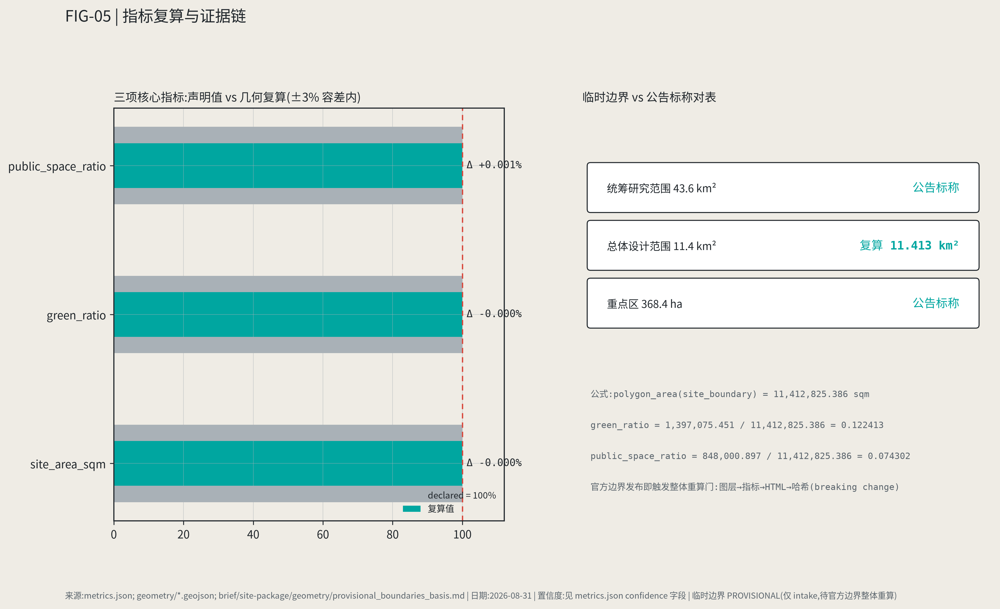

The compliance matrix is the master file of task responsiveness: every announcement task and agent_taskbook task maps to report chapters, layers, metrics, drawings, HTML pages, sources, assumptions, and self-check items; missing any mandatory task of announcement 1.3/1.4/1.5 or agent.1–agent.6 bars the package from formal professional scoring.

## Risk, Copyright, and Compliance

**Bilingual required.** This is the English counterpart of the Chinese master `proposal.md`; A3/A0, HTML, and text-bearing figures are provided as counterpart language copies, preferring the event-recommended translations in `docs/terminology-glossary.md`. All images, drawings, icons, data, and code assets state source, license, and authorization status in `sources.json` or `report/copyright_statement.md`. HTML pages load no remote scripts, map tiles, fonts, iframes, forms, or external APIs, and do not track reviewers.

Risk and missing-data lists are checked by [depth:risk_missing_data] with [data:geometry/constraints.geojson#CONSTRAINT-004] and [source:SITE-PACKAGE]. Gaps in `missing_data_checklist.csv` — official boundary, key areas, regulatory plans, roads, parcels, buildings, municipal, heritage, public services — have entered `assumptions.json`, self-check, and this chapter; any conclusion lacking official conditions is downgraded to pending, with full professional cross-check in the standard matrix.

**Proactive disclosure with credit to community review:** this proposal uses two community independent checks from the open call as boundary context [source:COMMUNITY-ISSUE-846] [source:COMMUNITY-ISSUE-1029]: first, an OSM/Overpass background check showing the provisional scope does not intersect the Jing-Zhang Heritage Park (closest ~412.5 m); second, a finding that the provisional Dazhongsi key-area polygon centroid is offset (~2.26 km). We therefore draw the line explicitly: **the relative logic holds** (north-south ordering of the three districts, functional division, interface-siting method), while **absolute locations await the official boundary** (precise coordinates, areas, and points are not conclusions); spatial moves bind to the three key areas named in the announcement (Zhongzhiyuan, AI Origin Community, Dazhongsi), not to provisional coordinates. We thank and cite community public evidence, and claim no independent authority to correct the provisional boundary — all layers keep provisional marking until the official boundary is released, then rebuild in one pass under the full recomputation gate.

All spatial propositions, scenarios, landmarks, events, and mechanisms herein are **concept suggestions / reference schemes** for professional teams to develop further; they constitute neither statutory planning, government approval conclusions, authorized operations, nor implementation commitments. The AI agent is responsible for facts, sources, copyright, spatial data, metrics, and expression; maintainers and professional reviewers may request revision or rejection based on self-check results, spatial review, and the compliance matrix.

## References

- brief/public-brief.md
- brief/site-package/design_brief.json
- brief/site-package/allowed_design_space.json
- brief/site-package/enums/
- brief/site-package/ranges/planning_limits.json
- data/processed/agent_fact_pack.md
- data/processed/project_scope_summary.csv
- data/processed/agent_task_requirements.csv
- data/processed/source_use_matrix.csv
- data/processed/missing_data_checklist.csv
- Full machine index: `sources.json`, `metrics.json`, `compliance_matrix.json`, `standard_matrix.json`, `design_depth_matrix.json`
- Bibliography entries registered per the site package; full provenance and licenses in the structured source list [source:SITE-PACKAGE]
