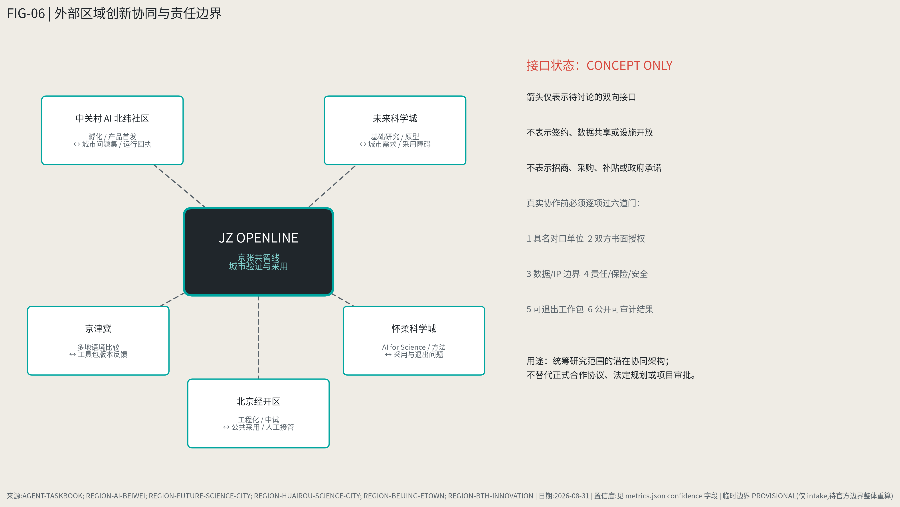
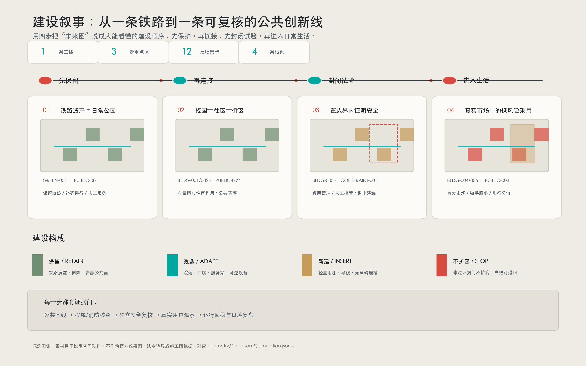
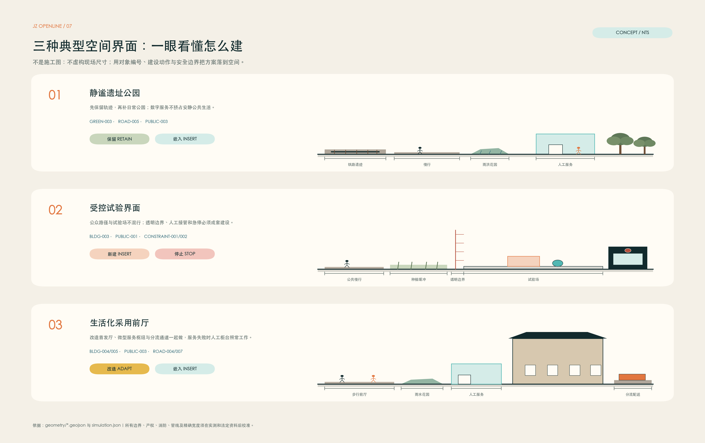
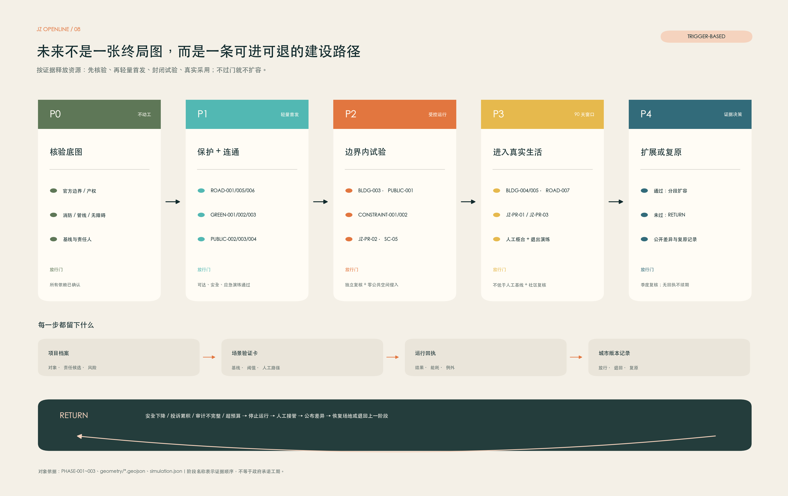

# JZ OPENLINE 京张共智线

> 百年铁轨,下一站共智。
> A Century of Rail. The Next Station: Shared Intelligence.

## 总体概念与命名体系

**JZ OPENLINE|京张共智线** 的总命题不是"建设一条 AI 创新带",而是回答一个更根本的问题:**AI 如何获得进入真实城市的资格,并最终产生公共价值?**

我们的回答:让整条京张成为 AI 进入真实城市之前必须经过的一条**城市验证线**——全球 AI 城市转化与验证走廊(概念建议,供专业团队深化研究,不替代法定规划)。

**唯一规范命名:** 中文主名称固定为**京张共智线**，品牌名固定为 **JZ OPENLINE**，英文描述性副标题固定为 **Jing-Zhang Shared-Intelligence Line**。下文“开放机制层”仅解释 OPENLINE 的开放属性，不作为第二个项目名称；不再交替使用“开放线”“共享情报线”或“共同情报线”。

**OPENLINE 的 LINE 有四层含义:**

| 层 | 含义 | 空间对应 |
| --- | --- | --- |
| Rail Line | 1909 年以来的铁路 | 遗址本体与工程遗存 |
| Green Line | 今天已开放的 9 公里城市公园 [source:PARK-OPEN-CNR-20260806] | 京张铁路遗址公园活力带 |
| Innovation Line | 从实验室到市场的创新链 | 三区两翼产业空间 |
| 开放机制层 | 开源、开放科学、开放测试、开放城市 | 全部公共机制；不是项目第二名称 |

**空间结构公式(概念建议):1 LINE + 3 ENGINES + 2 WINGS + 9 INTERFACES + N STATIONS + 1 LOOP**

- **1 LINE**:京张遗址公园主轴,四线叠合(见"京张遗址公园"章)。
- **3 ENGINES**:三处重点区域各回答创新链一个问题——北京 AI 原点社区 = ORIGINATE|源出场("好成果如何溢出校园?")、众智园 = TEST|试验场("技术真的可行、安全吗?")、大钟寺 = ADOPT|首发场("人们真的愿意用吗?")。
- **2 WINGS**:两翼不是配套区,是创新机制两端——西翼 WEST WING = CAPITAL & KNOWLEDGE|资源接口(VC/PE、技术转移、知识产权、法律、人才、国际服务、科技金融、孵化);东翼 EAST WING = CITY & LIFE|真实需求接口(居民、学校、医疗、养老、商业、骑手、快递、网约车、儿童、老人)。WEST(技术+资本)→ 三区 → EAST(城市+生活)→ 反馈回 WEST,形成东西双向循环。
- **9 INTERFACES**:九个城市接口(01 大学/02 科研/03 创业/04 社区/05 教育/06 医疗/07 商业/08 交通/09 文化),每个接口回答"铁路两侧什么东西应该发生连接",是 N STATIONS 中的东西缝合型站台。
- **N STATIONS + 1 LOOP**:沿线场景站台网络与慢行复合环。

**运行规则(治理叙事,贯穿全方案):**

- 转化六环:**CREATE → VERIFY → LAUNCH → ADOPT → SCALE → RETURN**(大学提出技术 → AI 原点共创 → 众智园验证 → 京张公园公共试用 → 大钟寺首发 → 资本支持 → 城市采用 → 数据反馈;失败就退出,成功再推广)。
- 公共规则:**PEOPLE FIRST**——公园首先是约 45 万居民的日常,然后才是 AI 创新带 [source:PARK-OPEN-CNR-20260806]。
- 实施规则:**TEST SMALL · PROVE VALUE · SCALE CAREFULLY · ROLLBACK FAST**。
- 治理规则:**NO EXIT, NO ENTRY**——没有退出机制的场景,不得进入城市。执行层是**双闸**:**NO ENTRY = 资格闸 + 登记闸**(场景须在 TEST 试验场通过验证,并在退役登记簿预先登记退出方案、场地复原标准与具名责任人,未登记不进场);**NO EXIT = 退出审计 + 复原三联回执**(退出时公开数据删除、场地复原、申诉处理三项回执,进入 CITY CHANGELOG 永久留痕)。六环迁移均带门禁条件:CREATE→VERIFY 须登记数据边界与人工责任人;VERIFY→LAUNCH 须达到场景卡通过阈值;LAUNCH→ADOPT 须完成真实用户观察;ADOPT→SCALE 须独立复核;任何一环触发停止条件即 RETURN。首开区(URBAN SERVICE HUB 大钟寺主站)落地前将进行一次完整退出演练,runbook 随年度版本公开。

**与同类方案的差异化定位(取长补短,非拼贴):** 本方案吸收公开征集中若干优秀投稿的机制——zero-milestone 系的 Km 索引/0|1 里程碑(转化为全线导视逻辑)、"水准线"系的错误可被发现并推翻(转化为 CITY CHANGELOG 与可验证数据纪律)、REN AXIS 系的法定规划附件对位纪律(转化为 L1 法定空间数据层)、"万象工场"系的九间城市房(转化为 9 CIVIC INTERFACES 与首发场)、"转辙"系的道岔母题(转化为治理决策门)——但所有机制最终围绕同一命题组织:AI 的城市准入与公共价值。完整对照见"竞品取长补短矩阵"(A0 展板)与 `compliance_matrix.json`。

**同名与近邻方案的边界声明(诚实披露):** 本次征集中另有 flyingpig707 的「京张开源线 JZ OPENLINE」(城市开源操作系统,以 Issue/Merge/Fork 工作流组织城市,回答"社区如何共同建设城市")。两个 OPENLINE 方向相反、互为补充:对方是 community→city(开源社区建设城市),我方是 AI→city(AI 经验证获得进入真实城市的资格)。我方不主张名称优先权,以机制语义区隔:本方案的关键词是"验证、准入、转化",而非"开源操作系统"。同理,我方"共智"取自四代建造者的共同智造(见文化叙事章),不是单一验收环;CITY CHANGELOG 是带版本号、diff 与 rollback 的城市版本系统,不是评测基准发布,也不是评价榜单(征集场上另有基准发布类与榜单类机制,各回答不同问题)。

**视觉识别方向(概念建议):** 不采用赛博朋克、蓝紫渐变、机器人头像与巨型 LED;采用 technical schematic / subway map / dashboard / blueprint 表达。四个基础色:Rail Graphite `#20262B`(铁路、文字、基础结构)、Warm Paper `#EFECE5`(历史与公共空间底色)、Open Cyan `#00A6A0`(AI、开源、未来场景)、Signal Red `#D84A3F`(铁路信号、历史节点、重点提示)。Logo 方向:两根平行铁轨渐变为节点网络——既像轨道,也像数据连接,也像 Git branch/merge。地图、导视、活动视觉、网页与地面铺装共用同一套"线路—节点—道岔—站台"语法。

## 设计依据与资料清单

本 formal 方案以北京市规划和自然资源委员会海淀分局发布的《百年京张AI创新带城市设计国际方案征集资格预审公告》为第一依据,并以 `brief/site-package/` 中经维护者登记的临时粗略边界、重点区域、枚举、指标和来源清单为机器可读依据 [source:OFFICIAL-ANNOUNCEMENT] [source:AGENT-TASKBOOK] [depth:existing_conditions_diagnosis]。完整来源和标准覆盖分别保存在 `sources.json`、`standard_matrix.json` 与 `design_depth_matrix.json`。

资料登记表的使用边界如下 [source:SOURCE-REGISTRY]:data/source_registry.json 登记公开、清权与临时资料的用途边界;agent 不得把 background_only 或 provisional_only 资料升级为 official boundary、法定控规、正式评分依据或政府实施承诺。`data/processed/agent_fact_pack.md` 是阅读导航层,不是新的权威来源 [source:PROCESSED-FACT-PACK]。

### 根系—选择—对象:为什么这条线在海淀成立

JZ OPENLINE 看起来超前,但不从空中落下。它把四种可以在历史和日常中被看见的根系,翻译成空间与运行选择；根系只解释“为什么是这里”,不替代法定边界、控规或实测数据（根系映射：R-01 / R-02 / R-03 / R-04）。

| 根系 | 设计选择 | 可复核对象 |
| --- | --- | --- |
| 自立 | 把研究、工程、标准、安全评价和产品转化放进同一条 CREATE→VERIFY→ADOPT 链 | `PROV-KEY-002`、`PROV-KEY-001`、`PROV-KEY-003`；`BLDG-003/004`；场景验证卡 05/06/07 |
| 共享 | 公园先是居民日常公共空间,创新以低侵入方式回到社区,拒绝智能服务不降低服务水平 | `GREEN-001..003`、`PUBLIC-001..005`；场景卡 03/08/10/12 |
| 韧性 | 小步试验、阶段门、人工接管、退出审计和场地复原同时存在,资源按证据释放 | `CONSTRAINT-001..005`、`PHASE-001..003`；NO EXIT, NO ENTRY |
| 节制 | 90% 安静公共生活、10% 高强度节点,优先存量更新、可移动设施和分级照明 | `BLDG-001/002/006`、`GREEN-001..003`；场景卡 04/09/10 |

历史线索也因此不只是展板：京张铁路提供工程连接的起点,中关村提供成果转化的城市经验,遗址公园提供存量更新与公共共享的载体,AI 只在这条已有的城市关系上增加可验证的运行层。`simulation.json#rooted_design_matrix` 保存完整映射、来源和置信度；这些内容是设计解释,不是政策背书。

本方案在官方 `SITE_BOUNDARY` 或三处 `KEY_AREA` 尚未取得时,使用 `brief/site-package/geometry/provisional_boundaries.geojson` 生成临时 formal 包。提交包中的 `geometry/site_boundary.geojson` 与 `geometry/key_areas.geojson` 均标注为 `provisional_constraint`、`official_boundary=false`,只能用于方案生成、自检、可视化和设计讨论,不能作为 official redline、审批依据、精确面积依据或法定控制结论。替换 official polygons 后,site boundary、key areas、land use、roads、green space、public space、buildings、phasing 和 metrics 均需重算。边界解释可回到总体范围图层和面积复算 [data:geometry/site_boundary.geojson#SITE-001] [metric:site_area_sqm],三处重点区由独立图层和数量指标核对 [data:geometry/key_areas.geojson#PROV-KEY-001] [metric:key_area_count]。

除场地包外,本方案规划(尚未取用)三层外部公开数据,全部进入 `assumptions.json` 待授权清单,取用时按许可登记进 `sources.json`:法定与现状层(北京公共数据开放平台、海淀开放数据、规自委公开图则、教育/卫健部门公开机构名录)、城市行为层(高德交通态势、百度慧眼人流、经许可的平台聚合数据)、创新网络层(OpenAlex 开放科研数据、CNIPA 专利检索、公开企业/投融资信息)。在取得之前,正文所有相关判断只写方法与待校准项,不写数值结论。

## 三层范围工作框架

方案按照公告确定的三个层次组织工作:统筹研究范围(约 43.6 平方公里)关注 AI 产业生态、战略定位、创新链和未来城市形态;总体设计范围(约 11.4 平方公里)关注城市更新总体框架、产业空间布局、交通市政支撑和城市风貌控制;重点区域范围(约 368.4 公顷)关注三处详细设计地区的功能业态、建筑规模、拆改留分类、公共空间连通和交通组织。三层范围在 `compliance_matrix.json` 中逐条映射,保证公告 1.3、1.4、1.5 与 agent.1-agent.6 的必选任务都有章节、图层、指标、图纸和 HTML 证据。

三层工作框架的深度项由 [depth:three_level_scope_framework] 和 [depth:overall_spatial_structure] 约束,空间证据以 [data:geometry/site_boundary.geojson#SITE-001] 与 [data:geometry/key_areas.geojson#PROV-KEY-001] 为准,任务依据以 [standard:PROJECT-OFFICIAL-ANNOUNCEMENT] 为准,范围索引以 [source:PROCESSED-FACT-PACK] 为导航。

| 层级 | 设计问题 | 方案回答 | 数据落点 |
| --- | --- | --- | --- |
| 统筹研究范围 | AI 产业生态和未来城市形态如何组织 | "CREATE→VERIFY→LAUNCH→ADOPT→SCALE→RETURN"转化链 + Research→Commons→Venture→City 创新生态 | compliance_matrix.json、standard_matrix.json |
| 总体设计范围 | 产业空间、城市更新、交通市政和风貌如何落图 | 三区两翼 + 九接口空间结构;用地、建筑、道路、绿地、公共空间和分期图层共同表达 | [data:geometry/land_use.geojson#LU-001]、[data:geometry/roads.geojson#ROAD-001] |
| 重点区域范围 | 三处片区如何达到详细设计深度 | ORIGINATE 源出场 / TEST 试验场 / ADOPT 首发场,分别回答创新链三问 | [data:geometry/key_areas.geojson#PROV-KEY-001]、[data:geometry/key_areas.geojson#PROV-KEY-002]、[data:geometry/key_areas.geojson#PROV-KEY-003] |

## 统筹研究范围产业与未来城市研究

### 全球案例研究:研究机制,不研究造型

我们不研究"谁的建筑最酷",而研究"科研到底通过什么制度和空间机制变成企业与城市产品"。七个案例仅提取已由案例运营者或政府页面明确说明的机制；它们不是完整城市评价，也不证明同一机制在海淀必然有效。逐案来源和用途边界见下表及 `sources.json` [source:CASE-ONE-NORTH-JTC] [source:CASE-LONDON-KQ]。

| 案例 | 已核实机制 | 转译为京张的研究假设 | 来源与使用边界 |
| --- | --- | --- | --- |
| Singapore one-north / LaunchPad | 初创企业与孵化器、加速器、VC 共址，并以园区设施开展 testbedding | 把空间运营方纳入“测试载体+反馈组织者”，但先从小尺度可逆试验开始 | [source:CASE-ONE-NORTH-JTC]；只学机制，不声称合作、绩效等同或移植协议 |
| Seoul Yangjae–Suseo Physical AI Belt | 官方方案把 Yangjae 的 AI 研发与 Suseo 的机器人实景验证相连，并提出城市级 testbed | ORIGINATE / TEST / ADOPT 三引擎之间须有明确迁移门，城市不能只提供办公室 | [source:CASE-SEOUL-PHYSICAL-AI]；规划中的设施不写成已全部建成，亦不复制激励政策 |
| Toronto MaRS + Vector | MaRS 组织创业、空间与技术采用；Vector 连接 AI 研究、人才与产业采用 | 把“研究支持”和“城市采用”分成可审计角色，再用运行回执衔接 | [source:CASE-MARS] [source:CASE-VECTOR]；两机构并非被表述为一个合并运营主体 |
| Montreal Mila | 官方资料说明其以创业支持把 AI 研究转化为企业 | 在 ORIGINATE 阶段加入研究者到创业者的能力转换，而不预设公司产出 | [source:CASE-MILA-VENTURES]；报道数字不作为京张目标或独立绩效结论 |
| Paris-Saclay PUI | 大学牵头连接高校、科研机构、转移组织和公共/私人伙伴，覆盖技术转移与企业创建 | 以“共同议题+角色清单+影响复盘”组织跨机构协作，不虚构统一土地或行政权 | [source:CASE-PARIS-SACLAY-PUI]；只作治理与转化机制参照 |
| Kendall Square | 市政府页面确认科研/科技集群与住宅、酒店、餐饮、商店等城市支持功能并存 | 人才城区需把日常生活和创新空间同时纳入观察，不把公园只当产业展厅 | [source:CASE-KENDALL-CAMBRIDGE]；不宣称混合功能单独导致人才留存 |
| London Knowledge Quarter | 成员联盟连接研究、商业、文化，并把协作、场所和包容列为共同议题 | 三区两翼可设议题型协作桌，但不把联盟当成法定规划或审批主体 | [source:CASE-LONDON-KQ]；不声称合作或移交治理权 |

海淀真正的差异化不是"我们也有 AI 企业",而是**科研、高校、中关村创业文化与已开放的 9 公里百年铁路公共空间**四者叠加 [source:PARK-OPEN-CNR-20260806]。因此本方案提出的生态模型是 **Research → Commons → Venture → City**:科研进入公共创新共同体(Commons),再产生企业(Venture),再进入真实城市(City)——城市不是终点,而是验证与反哺环节 [source:AGENT-TASKBOOK] [standard:PROJECT-AGENT-OPEN-CALL-TASKBOOK]。

### 外部区域创新协同：五类概念接口，不是既有合作

下图与表响应任务书的区域创新协同要求。**所有箭头均为待讨论的双向概念接口**，不表示 JZ OPENLINE 已与相关地区签约、共享数据、开放设施、安排招商或取得政府承诺 [source:AGENT-TASKBOOK]。

| 外部节点 | 公开资料确认的角色 | 可讨论的双向接口 | 共同价值 | 证据与责任边界 |
| --- | --- | --- | --- | --- |
| 中关村 AI 北纬社区 | 孵化、共享技术服务、场景应用、产品首发与人才社区 | 北纬社区可提出早期团队/产品验证问题；京张可回传匿名化城市问题集、运行回执与退出复盘 | 减少“孵化完成—城市不会用”的断点，并让真实需求更早进入创业辅导 | [source:REGION-AI-BEIWEI]；无现成合作、企业导流、空间或资金承诺，未来由双方具名运营主体另行授权 |
| 未来科学城 | 基础研究、战略科技力量、人才集聚与成果转化主平台 | 研究原型和科学问题可进入京张的低风险城市验证题库；京张可回传公共服务需求与采用障碍 | 为基础研究增加城市问题入口，为京张增加跨学科上游供给 | [source:REGION-FUTURE-SCIENCE-CITY]；不推定实验室、人才、成果或数据向本项目开放 |
| 怀柔科学城 | AI for Science、大科学装置、科学数据治理和研究—产业转化 | 怀柔可提供经授权的研究方法/候选工具；京张可提供低风险公共场景中的采用与退出问题 | 让“设施/模型可用”与“城市服务可采用”形成两种互补证据 | [source:REGION-HUAIROU-SCIENCE-CITY]；不代表装置、科研数据、算力或联合实验室已获授权 |
| 北京经开区 | 城市级工程实验、测试—验证—推广、中试与产业应用 | 经开区可承接需工程化/中试的成熟候选；京张可补充以人为本的公共空间采用、投诉、人工接管与复原证据 | 工程成熟度和公共采用度分工验证，减少过早规模化 | [source:REGION-BEIJING-ETOWN]；不构成采购、制造、补贴、场景配给或产业化承诺 |
| 京津冀 | 政策提出跨区域科学智能协同与共性技术攻关 | 经各地分别授权后，可用《城市场景验证工具包》比较不同城市语境，并把差异反馈为工具包版本 | 形成可复用而不伪装成统一标准的跨区域学习回路 | [source:REGION-BTH-INNOVATION]；JZ OPENLINE 不是官方标准发布者，也不是已批准的区域试点网络 |

**进入真实协作的共同前置门:** 具名对口单位、双方书面授权、数据和知识产权边界、责任/保险/安全安排、可退出的工作包、公开可审计结果。任一项缺失，接口保持 `concept_only` [source:REGION-BTH-INNOVATION]。

### JZ URBAN EVIDENCE STACK:五层城市证据栈(方法设计,数据待授权接入)

再漂亮的人流热力图都不能替代道路红线、建筑现状和公共服务底数。本方案的数据纪律是**先补法定与现状,再接行为与创新**。五层证据栈 L1–L5 特指**数据证据分层**(法定空间/城市设施/城市行为/城市劳动/创新网络),与征集场上任何地标目录编号或验证环境分级无关,仅此声明以免混淆。五层证据栈(概念建议,数据接入计划见 assumptions;接入后支撑 7 张证据图):

| 层 | 内容 | 计划来源类型 |
| --- | --- | --- |
| L1 法定空间 | 控规、道路红线、文保、建筑、用地 | 规自委公开图则、北京公共数据平台(规划附件必须对位,不靠推测) |
| L2 城市设施 | 教育、医疗、养老、商业、交通设施 | 部门公开名录、海淀公共服务地图 |
| L3 城市行为 | 拥堵、人流、OD、地铁客流、步行、骑行 | 高德/百度慧眼等经许可 API 与聚合数据 |
| L4 城市劳动 | 骑手、快递、保洁、安保、维护 | 经许可的平台聚合与实地调研——多数方案忽视的一层,本方案特色 |
| L5 创新网络 | 论文、专利、企业、投融资、开源项目 | OpenAlex、CNIPA、公开企业数据库 |

接入后产出 7 张证据图(暂定名):01 AI Knowledge Density 科研知识密度、02 Innovation Leakage 科研成果溢出点(高校 10 分钟步行圈 × 实验室 × 咖啡社交 × 孵化器 × 居住 × 地铁)、03 24H Urban Pulse 24 小时城市脉搏、04 East-West Barrier Index 东西缝合障碍指数(直线距离/实际步行距离、绕行时间、过街等待、入口密度、自行车连续性、地铁到站可达性)、05 Public Service Gap 公共服务缺口、06 Delivery Friction 配送摩擦指数、07 AI Opportunity Map AI 场景机会地图。这些图直接决定 9 个接口的落位与场景卡选址——空间构想由证据驱动,而非先画圈再找理由。

未来城市形态判断:AI 改变的不是屏幕数量,而是排队、绕行、寻找与等待的总量——老人更容易找到医院、骑手更容易找到楼、外国研究者更容易进入城市、开发者更容易找到测试环境。产业战略指标、AI 创新指数、人才密度等在取得正式数据前一律标注 pending,不编造 [depth:overall_spatial_structure]。

## 总体设计范围城市更新与控规深度城市设计

总体设计范围要求达到控制性详细规划的城市设计深度。本方案的空间组织为**一带主轴、三区三问、两翼接口、九点缝合**:京张遗址公园为南北主轴;众智园、AI 原点社区、大钟寺分别承担 TEST、ORIGINATE、ADOPT 功能;西翼(中关村方向)组织资本与知识服务,东翼(小月河方向)组织城市生活与真实需求;九个城市接口缝合铁路东西两侧。

本节按照 [standard:MOHURD-CONTROL-DETAILED-PLANNING] 把控规深度内容拆成可审查对象:[data:geometry/land_use.geojson#LU-001] 表达用地结构,[data:geometry/buildings.geojson#BLDG-001] 表达建筑基底,[data:geometry/roads.geojson#ROAD-001] 表达交通组织,[metric:building_footprint_area_sqm] 用于复核建筑基底面积,[depth:land_use_layout] 与 [depth:development_intensity_controls] 约束成果深度。用地分区完整覆盖设计边界且无重叠;涉及建筑高度、开发强度、道路红线、退线和设施标准的内容,在官方控制条件取得前一律写为"待正式控规条件确认",不以推测值冒充审定指标。

交通、轨道、市政和配套设施围绕轨道站点一体化、道路微循环、非机动车停放、停车供给、创新服务平台、人才生活服务、新型基础设施、分布式能源和端侧算力展开,空间布局与实施路径见"交通"章;低效空间识别、更新项目清单与承载力评估见"更新项目清单"章。

## 重点区域详细设计:三引擎问答链

三处重点区域不是三个地块,而是创新链在空间上的三次追问。每区必须引用对应图层 [data:geometry/key_areas.geojson#PROV-KEY-001] [data:geometry/key_areas.geojson#PROV-KEY-002] [data:geometry/key_areas.geojson#PROV-KEY-003],并由 [depth:three_key_area_detailed_design] 检查深度;边界为 provisional 的事实已在正文、sources、assumptions 和 self_check 中声明。`compliance_matrix.json` 分别覆盖公告 1.5.3.1、1.5.3.2、1.5.3.3。

| 重点片区 | 单字名 | 回答的问题 | 设计定位 | 核心空间动作 | 证据引用 |
| --- | --- | --- | --- | --- | --- |
| 北京 AI 原点社区 | ORIGINATE|源出场 | 好成果如何溢出校园? | 近校成果转化与开源人才社区 | 校区-园区-街区慢行缝合;成果发布、技术转移门诊、开源协作空间、人才居住配套;拆改留分类待现状建筑数据校准 | [data:geometry/key_areas.geojson#PROV-KEY-002]、[source:AGENT-TASKBOOK] |
| 众智园 AI 自主创新加速区 | TEST|试验场 | 技术真的可行、安全吗? | 花园型全栈自主创新与测试街区 | Physical AI Test Yard(机器人、感知、导航、安全评价低风险实测);标准制定与安全治理展示;清河低碳创新界面;对外交通组织 | [data:geometry/key_areas.geojson#PROV-KEY-001]、[depth:three_key_area_detailed_design] |
| 大钟寺 AI 产业聚集区 | ADOPT|首发场 | 人们真的愿意用吗? | 全球 AI 城市产品首发区(非"AI 商业街") | Agent 服务、智能终端、AI 消费产品、智能教育、AI 健康服务、机器人商业、AI 文化产品在此进入真实市场并被观测;大钟寺站一体化与路口四象限步行连通;URBAN SERVICE HUB 主站 | [data:geometry/key_areas.geojson#PROV-KEY-003]、[metric:key_area_count] |

### 重点区空间动作台账:从概念到可复核对象

三处重点区不再只由名称和概念描述,而由一组可以在地图、指标和运行记录中互相校核的对象组成。这里统一使用**重点区项目档案(Project Record)**,它是设计审查对象而不是行政证照；对象均为概念建议,其绝对落位仍受 provisional 边界约束。

| 重点区 | 项目档案与空间对象 | 先做什么 | 通过什么门 |
| --- | --- | --- | --- |
| 大钟寺 ADOPT | `BLDG-004/005` 首发厅与 URBAN SERVICE HUB、`PUBLIC-003` 首发前厅、`ROAD-003/004/007` 接口与应急接管线 | 90 天内完成一条真实用户全链路回执;保持人工柜台、纸质地图和人工接管 | 真实用户观察 + 零公共空间侵入 + 退出演练 |
| AI 原点 ORIGINATE | `BLDG-001/002/006` 转化工坊、健康导航、城市观测站; `PUBLIC-002/004/005` 邻里客厅、共享台阶、观测台; `ROAD-006` 安全支路 | 把成果发布、技术转移、社区健康和公开读数放到同一条步行链 | 人工基线对比 + 数据最小化 + 社区复核 |
| 众智园 TEST | `BLDG-003` 物理 AI 安全测试场、`GREEN-001` 清河创新生态段、`PUBLIC-001` 接口广场 | 先在封闭、可复原的试验环境完成安全评价,再向公园接口迁移 | 安全评价通过 + 独立复核 + 未过门不扩容 |

空间对象与责任、依赖和阶段同步写入 `geometry/*.geojson`;12 张场景卡的基线、阈值、回退、人工路径和审计字段写入 `simulation.json`。其中 `defined_not_run` 明确表示“已定义、尚未实测”,不把模拟结果冒充现场绩效 [data:geometry/buildings.geojson#BLDG-004] [data:geometry/phasing.geojson#PHASE-001] [source:SIMULATION-CONCEPT-REGISTRY]。

**项目档案字段契约:**每一份档案固定记录 `project_id`、`purpose`、`spatial_objects`、`operator_candidate`、`evidence_gate`、`fallback`、`sunset_condition`、`source_refs` 和 `status`。`status=concept_only` 表示缺少正式责任或运行证据时只能讨论,不能进入工程承诺；场景验证卡、运行回执和城市版本记录是档案的三个附属件,分别回答“能不能试”“试过什么”“下一版改什么”。

**实施最小单元:**每个节点必须同时具备空间对象、运营主体、证据门、回退路径和日落条件;缺少任一项就停留在概念层。预算和编制只采用敏感性区间,待权属、消防、管线、采购与维护审计后再定,不构成投资或政府承诺。

### 公园设计图集：把“怎么建、怎么用、怎么退”放到一张图里

下面四张渲染不是把未来想象成一张漂亮效果图，而是把建设动作翻译成人能直接读懂的空间画面：先把铁路遗产和日常生活留住，再做存量建筑适应性再利用；试验必须在可封闭、可复原的边界内进行；最后才把经过验证的服务放进普通人的市场、街道和公园。画面中的具体建筑、树木和人物均为概念表达，真正落位以正式边界、权属、文保、交通和工程条件为准 [source:AI-RENDER-ATLAS]。

**01｜先把公园建成“可用的日常”。** 铁路遗存不被抹平，慢行线、座椅、雨洪花园和人工服务台先到位；AI 只做看不见的导航和维护辅助，不抢走公共空间。

**02｜再把存量建筑变成“能一起工作”的院落。** 原点社区不是封闭园区，而是把发布、技术转移、社区健康和邻里交流放在一条可步行的公共链上；保留、改造和新插入的界面都要先过权属与消防核查。

**03｜测试先在边界内完成。** 测试场与公园之间有看得见的安全缓冲、人工控制台和紧急停止；不满足独立复核和退出演练，就不把设备推向公共路径。

**04｜最后才进入真实生活。** 大钟寺节点的重点不是造一条“AI 商业街”，而是让居民、商户、骑手和老人都能在人工柜台、纸质地图和可回退服务仍然存在的前提下，低风险地试用新服务。

四张图对应 `simulation.json` 的三份项目档案和 12 张场景卡：公共绿廊是共享底座，原点社区承担源出，众智园承担试验，大钟寺承担采用。它们是空间叙事与专业团队深化的入口，不是官方效果图或施工图。

为了避免效果图停留在“看起来不错”，三类最容易发生冲突的空间被进一步拆成典型剖面：遗址公园把铁路轨迹、慢行、雨洪花园与人工服务并排讲清；众智园把公众路径、种植缓冲、透明边界、试验场和人工急停分开；大钟寺把步行前厅、服务枢纽、改造建筑与配送通道分流。剖面不虚构现场米数，但每个构件都回指 `GREEN/ROAD/PUBLIC/BLDG/CONSTRAINT` 对象，方便下一阶段接实测、权属、消防和管线资料后定尺深化 [source:DESIGN-SECTION-PHASING-ATLAS]。

未来建设也不被画成一次到位的终局。P0 先核验正式边界、权属、消防、管线、无障碍和责任人；P1 只释放保护与连通的轻量项目；P2 在边界内完成独立复核；P3 才进入 90 天真实采用窗口；P4 根据运行回执选择分段扩容或复原。任何阶段出现安全下降、投诉累积、审计不完整或超预算，都沿 RETURN 路径停止、人工接管、公布差异并退回上一阶段 [data:geometry/phasing.geojson#PHASE-001] [source:SIMULATION-CONCEPT-REGISTRY]。

三引擎共同构成 CREATE→VERIFY→LAUNCH 的空间前段;ADOPT→SCALE→RETURN 则由大钟寺、两翼与城市数据反馈完成。功能业态、建筑规模、拆改留分类、公共空间系统、交通组织、慢行连通和实施项目在 HTML、A3 文册与 A0 展板中展开;暂无边界的精确指标一律 pending。

## AI 创新生态、人才画像与 AI+ 场景

AI 不是屏幕。AI 可以是少绕 5 分钟路、少排 20 分钟队、老人更容易找到医院、骑手更容易找到楼、外国研究者更容易进入城市、开发者更容易找到测试环境——这种 AI,居民才会支持。本节满足任务书"≥10 张场景卡、≥3 个测试验证场景、≥5 类用户画像"要求 [source:AGENT-TASKBOOK];场景均为概念建议,落地前须通过隐私、安全与人工复核评估,并遵守 NO EXIT, NO ENTRY(无退出机制不得进入)。

**用户画像(6 类,≥5 要求):**

| 用户画像 | 典型需求 | 空间响应 | 隐私与复核边界 |
| --- | --- | --- | --- |
| 开源开发者/研究者 | 发布、协作、测试、社区声誉 | 原点社区开源发布厅、OPEN SOURCE WALK、夜间协作空间 | 不采集个人行为轨迹;活动数据只聚合统计 |
| 初创团队 | 低成本办公、算力入口、产品试验场 | 众智园共享测试场、端侧算力服务点、标准治理咨询 | 算力与数据服务另行授权 |
| 城市配送劳动者(骑手/快递员) | 停车、充换电、避雨休息、末端导航、夜间服务 | URBAN SERVICE HUB(大钟寺主站 + 校园节点) | 劳动数据只用于设施改善,不用于平台考核 |
| 周边居民(含老人、儿童) | 通勤、休闲、社区服务、低扰动更新 | 公园慢行环、社区服务嵌入、适老路径、夜间照明分级 | 居民画像不用于商业推荐 |
| 高校师生 | 成果转化、跨校协作、日常慢行 | 校区-园区慢行缝合、成果转化驿站、跨校课程导航 | 校园数据与科研成果需授权 |
| 国际研究者/访客 | 多语服务、住房/会议/交通/文化导航 | Global Talent Concierge(地铁+公园节点) | 最小化数据采集,明示用途 |

**12 张 AI 场景卡(概念建议;≥10 要求):** 没有阈值的场景描述不构成验证——只是愿景。每张卡遵守七字段纪律:任务定义、可测指标、基线来源、通过阈值、失败回退、数据口径、人工等价路径。阈值为示例量级,待 L3 行为层数据接入后校准为正式基线;"无 AI 等价路径"先于智能层存在,是 PEOPLE FIRST 与 NO EXIT, NO ENTRY 在场景级的合同化——拒绝智能服务的居民不降低服务水平。

| # | 场景卡 | 空间载体 | 回答什么 | 通过阈值(示例量级,待校准) | 无 AI 等价路径 |
| --- | --- | --- | --- | --- | --- |
| 01 | Campus Without Walls 无墙校园 | 清北科周边、原点社区 | 跨校课程、讲座、实验室与公共空间智能导航 | 导航任务完成率不劣于人工问询基线(示例 ≥90%) | 纸质课表 + 校园问询处 + 人工导览 |
| 02 | Research-to-Founder Clinic 科研创业门诊 | 原点社区+西翼 | AI 辅助技术转移、专利、团队与投资匹配 | 匹配建议采纳率不劣于人工技术转移门诊(示例量级) | 技术转移办公室人工门诊 |
| 03 | AI Community Health Navigator | 小月河社区 | 就医导航、翻译、康复与健康服务连接;医疗判断保留人工 | 到达正确科室成功率不劣于人工导医(示例 ≥95%) | 社区医院人工导医台 |
| 04 | Assistive Robot Walk | 京张公园/小月河 | 适老、康复、辅助机器人低风险实测路径(测试场景①) | 零伤害事件;老人独立完成目标步道段比例达基线(示例量级) | 人工陪护散步 + 无障碍设施 |
| 05 | Physical AI Test Yard | 众智园 | 机器人、感知、导航、安全评价测试(测试场景②) | 测试任务完成且安全评价通过,零侵入公众区域 | 封闭场地人工测试流程 |
| 06 | Agent Retail Street | 大钟寺 | 商户 AI Agent、个性化服务与新型消费实验(测试场景③) | 交易成功率不劣于人工柜台、投诉率不上升(示例量级) | 人工收银与店员服务 |
| 07 | Future Product Launch Market | 大钟寺 | 新终端、新应用短期首发/测试,进入真实市场并被观测 | 首 90 天 ≥1 位真实用户完成全链路并留可核验反馈 | 常规新品发布与线下试用 |
| 08 | Rider Friendly Hub(URBAN SERVICE HUB) | 大钟寺+校园节点 | 停车、充换电、厕所、饮水、避雨、休息、订单等待、机器人交接、楼栋导航、夜间服务 | 骑手等待/找楼时间不劣于现状基线(示例:零增加) | 人工值守服务点 + 纸质楼栋图 |
| 09 | Global Talent Concierge | 地铁+公园节点 | 中英多语城市服务与住房/会议/交通/文化导航 | 多语导航任务完成率不劣于双语人工服务台(示例量级) | 人工问询与双语标识 |
| 10 | Quiet AI Park | 京张全线 | 环境维护、无障碍导航、植物教育等"无屏幕 AI" | 设施维护响应时长不劣于人工巡检基线 | 人工巡检与现场标识 |
| 11 | HUMAN+ROBOT Logistics | 大钟寺-校园走廊 | 骑手与机器人协作配送:交接柜、路径分层、异常接管人工 | 异常人工接管率 100%;配送时效不劣于纯骑手基线 | 纯人工配送 |
| 12 | City Observatory 城市观测站 | 数据观察线节点 | 公园运行数据(人流/交通/生态/设施)公开展示与年度 changelog 证据采集 | 公开读数与原始记录一致、第三方可复算 | 纸质公示栏与定期人工公报 |

**场景-空间-运营映射:** 公共空间场景引用 [data:geometry/public_space.geojson#PUBLIC-001],慢行与交通场景引用 [data:geometry/roads.geojson#ROAD-001],开放空间场景引用 [data:geometry/green_space.geojson#GREEN-001] 和 [metric:public_space_ratio]、[metric:green_ratio]。每个场景须登记服务对象、空间位置、数据来源、隐私边界、人工复核机制和运营主体;每次城市智能运行留一张**运行回执**(服务版本、证据指向、人工责任人、申诉编号、到期日五字段),汇聚为 CITY CHANGELOG 的单次运行级证据。治理建议遵守数据最小化、公开来源、可解释和人工复核原则——城市智能体辅助识别断点、热力、维护与服务需求,但不替代规划审批、不输出未经授权的个人画像、不声称官方实施承诺。

## 京张遗址公园:四线叠合、九接口与城市服务枢纽

央广网 2026 年 8 月 6 日报道京张铁路遗址公园二期正式建成开放，公园形成 9 公里带状公共空间，直接服务 70 个社区、约 45 万居民；海淀区政府 2024 年公开报道提供了建设前的同口径交叉核对 [source:PARK-OPEN-CNR-20260806] [source:PARK-PLAN-HAIDIAN-20240920]。这些数字**只用于公共生活背景，不用于推导官方边界、精确设计面积、工程验收或运营绩效**。因此绝不能按空地重新设计:在公园现状和设施清单完成现场核验前,先把日常公共生活作为保护优先级,再叠加 AI 创新带。设计原则:**90% 保持安静,10% 高强度创新节点**,不一路 LED 屏。

**四线叠合——同一条铁路上叠四条线:**

| 线 | 内容 | 优先级 |
| --- | --- | --- |
| 公共生活线 | 居民散步、老人、儿童、骑行、通勤首先成立 | 最高,PEOPLE FIRST |
| 创新转化线 | 高校成果沿此进入测试、创业、首发和市场 | 嵌入生活线节点 |
| 文化时间线 | 1909 铁路工程文化 → 中关村创业文化 → AI 开源文化 | 见文化叙事章 |
| 数据观察线 | 持续观测人流、交通、生态、公共服务和场景运行效果,反哺运营与 CITY CHANGELOG | 低侵入传感,公开透明 |

由此,公园本身成为 **Urban Living Lab + Public Commons**,而不是科技主题乐园。

**9 CIVIC INTERFACES|九个城市接口(概念建议):** 铁路不能只有南北运动,还须把东西两侧真正连接起来。接口不是房间,是"缝合装置",每个回答"铁路两侧什么东西应该发生连接":

| # | 接口 | 缝合内容 | 证据图支撑 |
| --- | --- | --- | --- |
| 01 | 大学接口 | 校园 ↔ 公园/社区,课程与成果转化流动 | 02 Innovation Leakage |
| 02 | 科研接口 | 实验室 ↔ 测试场/首发场 | 01 Knowledge Density |
| 03 | 创业接口 | 孵化器 ↔ 资本/市场服务 | 07 Opportunity Map |
| 04 | 社区接口 | 居住区 ↔ 公园生活段 | 03 24H Pulse |
| 05 | 教育接口 | 学校 ↔ 公园教育场景 | 05 Service Gap |
| 06 | 医疗接口 | 医院 ↔ 社区/康复/慢行 | 05 Service Gap |
| 07 | 商业接口 | 商业 ↔ 公园客流/首发场 | 03 24H Pulse |
| 08 | 交通接口 | 地铁站/路网 ↔ 公园入口与慢行 | 04 Barrier Index |
| 09 | 文化接口 | 遗产节点 ↔ 城市文化动线 | 文化时间线 |

接口精确落位由 04 East-West Barrier Index 等证据图计算决定(直线距离/实际步行距离、绕行时间、过街等待、入口密度、自行车连续性、地铁到站可达性),待数据接入后在 A0 展板标注;当前仅作方法声明,不画伪精确点位。

**URBAN SERVICE HUB(差异化重点):** 配送者不是"城市背景",而是一类正式城市使用者。设施清单:停车、充电、换电、厕所、饮水、避雨、休息、订单等待、机器人交接、楼栋导航、夜间服务。叙事立场:**HUMAN + ROBOT LOGISTICS**——骑手与机器人不是竞争,而是协作(机器人交接柜、路径分层、异常接管人工)。主站落大钟寺,分站落校园节点,接入 06/07/08 接口与 EAST WING;L4 城市劳动数据层为其选址与规模提供依据。

**AI 朝圣地标体系(做减法,只设 4 个,≥3 要求):**

| # | 地标 | 概念 |
| --- | --- | --- |
| ① | ZERO MILESTONE|零号里程碑 | 1909 是中国铁路工程的原点,今天是中国 AI 城市创新的再出发——纪念"中国自主创新不断重新出发",而非任何公司;Km 索引与 0|1 里程碑体系转化为全线导视逻辑 |
| ② | OPEN SOURCE WALK|开源散步道 | 没有屋顶的 AI 博物馆:论文、代码、模型、机器人、专利、城市应用沿旧轨布点,经 DOI、repo、commit hash 等可验证链接持续更新 |
| ③ | COMMIT WALL|全球 AI 贡献墙 | 不写"谁最有钱",写谁贡献了开源模型、AI 安全工具、无障碍工具、公共数据、城市问题解决方案;年度 ANNUAL COMMIT 仪式的实体 |
| ④ | ORIGIN SWITCH|原点道岔(候选) | 以铁路道岔为母题的公共艺术:铁路时代道岔决定列车去向,AI 时代道岔象征城市的每一次准入/退出决策(NO EXIT, NO ENTRY 的实体化) |

地标均须遵守文保、绿地、交通安全约束,拒绝过度娱乐化、网红化;荣誉展示与组件库在 HTML 与 A3 文册展开 [depth:blue_green_public_space]。

## 文化叙事与导视系统

**总主题:BUILDING CONNECTIONS。** 一条铁路,四代建造者:

| 代 | 身份 | 连接什么 |
| --- | --- | --- |
| 第一代 | ENGINEERS|工程师 | 连接城市(物理连接) |
| 第二代 | FOUNDERS|创业者 | 连接知识与市场(中关村) |
| 第三代 | DEVELOPERS|开发者 | 连接人与机器(AI) |
| 第四代 | CITIZENS|市民 | 决定技术应该服务什么 |

铁路的故事不是机器越来越强,而是**人不断创造新的连接方式**。第四代 CITIZENS 把 PEOPLE FIRST 拉进叙事主线,与 EAST WING、公共生活线、COMMIT WALL 互为印证。这一叙事对外国人同样清晰:Engineers → Founders → Developers → Citizens。

**三条重叠导览线(同一走廊上的三个时代):** Rail Heritage|铁路工程线(遗存、清华园火车站等)、Innovation Heritage|中关村创新线(创业史节点)、Open Future|AI 开源未来线(地标与场景节点)。不是三个独立景区,而是在同一条铁路上看到三个时代。导视标识沿用"线路—节点—道岔—站台"语法与四色系统;Km 索引起自 ZERO MILESTONE。所有文化素材、字体、图像、肖像与企业标识须有清权来源 [source:AGENT-TASKBOOK];文化标识与整体 Logo 分属不同层级,不混淆。

## 全球活动体系与长期运营

朝圣地不是靠雕塑形成的,而是靠**人必须定期回来参加的仪式**形成的。运营体系(概念建议,不构成政府活动承诺):

**JZ OPENLINE SEASON|京张共智季(年度循环):**

| 季 | 活动 | 内容 |
| --- | --- | --- |
| 春 | Papers → Products | 全球论文、科研成果、创业转化周 |
| 夏 | City Sandbox | AI 城市真实场景测试季(对接 TEST 试验场) |
| 秋 | JZ AI WEEK | 全球 AI 创新周:产品首发、投资、Demo、论坛、国际合作 |
| 冬 | ANNUAL COMMIT | 年度仪式(最重要):年度十大城市 AI 贡献、年度开源贡献、年度失败案例、年度退出项目、年度公共价值、下一年度城市 Challenge |

常态化节奏:每周 Developer Walk、每月 Open Source Night、每季度 City Challenge。

**CITY CHANGELOG|城市版本系统(运营即治理):** 一年一个城市版本——JZ 2027.1、JZ 2028.1、JZ 2029.1……借用完整的软件发版语义:每个版本公开 **diff**(新增/变更/撤掉了什么)、**rollback**(哪些场景被回滚到上一稳定版、触发条件是什么)、**deprecation**(哪些服务进入淘汰倒计时、替代路径是什么)、**known issues**(哪些投诉最多、哪些指标恶化了)。失败与成功等量公示——只展示成功的版本墙是广告牌,不是 changelog。**未合并未来档案**同步公开:被否决的场景提案连同否决理由归档可查,让"没有发生的事"也成为公共证据。每个 AI 场景带**日落条款**:到期不默认续期,须凭运行回执与公共价值证据重新过闸。"错误可以被发现并推翻"是系统的核心机制:数据观察线提供证据,Annual Commit 提供仪式,NO EXIT, NO ENTRY 提供规则。需要区分:CITY CHANGELOG 是**城市版本系统**(记录城市自身的演化与回滚),不是评测基准发布,也不是评价榜单——它回答"城市去年变了什么、错了什么、改了什么",而不是"哪个 AI 最强"。这比单纯办论坛有辨识度得多。

**转化闭环:** 全球征题 → 开发者报名 → 短期驻留 → 京张 Living Lab 测试 → 居民/专业机构评价 → 企业采购或资本连接 → 城市场景扩大 → 发布开放案例 → Annual Commit → 下一年继续。**SCALE 环是整条走廊的外向出口:AI 在京张获得的不只是本地落地,而是进入下一座城市的可复用经验。** 因此本方案把转化机制本身封装为一件可取走即用的公共产品——《JZ OPENLINE 城市场景验证工具包》(概念 v0.1):场景验证卡、双阶段门、运行回执、退出复原三联、城市版本语义,五件套以开放文档形式发布,任何城市可以免费本地化并回馈改进。京张由此不是“城市试验规则的发行方”,而是**把城市试验做成可复用方法样本**——这正是“全球 AI 城市转化与验证走廊”定位的落点。活动品牌视觉沿用四色与线路语法;运营对象、频率、责任边界、转化路径与风险在 A3 文册运营章展开。

## 用地、建筑规模与拆改留方案

用地方案依据国土空间调查、规划、用途管制分类等公开标准表达,形成完整、闭合、无缝的用地分区 [standard:MNR-LAND-USE-CLASSIFICATION-GUIDE]。建筑方案区分保留、改造、更新、新建或待确认对象;在缺少现状建筑、权属、控规和工程条件时,只提出方法和待校准清单,不编造拆改留结论。建筑高度、体量、界面和风貌控制由 [depth:height_massing_character] 管理,拆改留方法由 [depth:retain_renovate_demolish] 管理,主要证据是 [data:geometry/land_use.geojson#LU-001]、[data:geometry/buildings.geojson#BLDG-001] 和 [metric:building_footprint_area_sqm]。

建筑规模和强度指标必须与 `metrics.json` 和图层一致;总建筑规模、容积率、建筑高度、建筑密度、绿地率、退线和建筑控制线在缺少官方条件时列为 unknown 或 pending_control。A3 文册给出更新项目清单和指标复核表,A0 展板表达关键空间结构,HTML 提供指标和图层联动查看。

## 交通、轨道、市政与公共服务设施

交通方案回应轨道站点一体化、道路微循环、慢行断点、对外交通、停车、非机动车停放和绿色交通系统要求,重点覆盖北五环、遗址公园跨环路节点、五道口、清华东路西口、大钟寺站及重点企业周边联系。道路和慢行图层保持在提交边界内,并与公共空间、绿地、产业节点和重点片区相互校核;边界为 provisional 时,交通结论仅作临时设计讨论。专业深度由 [depth:traffic_rail_slow_parking] 与 [depth:municipal_new_infrastructure] 约束,图层证据引用 [data:geometry/roads.geojson#ROAD-001]、[data:geometry/public_space.geojson#PUBLIC-001] 和 [data:geometry/constraints.geojson#CONSTRAINT-001]。

本方案的交通研究特色是把"增加东西联系"从口号变成计算:**East-West Barrier Index** 用直线距离/实际步行距离、绕行时间、过街等待、入口密度、自行车连续性、地铁站到公园可达性找出真正需要"缝"的位置——9 个接口的落位即由此决定(数据接入后计算,当前为方法声明)。这与"统一观测断面"类基准线思路对立互补:基准线解决南北向的可比性,缝合指数解决东西向的可达性——已开放的 9 公里窄带 [source:PARK-OPEN-CNR-20260806],两个方向的问题需要两套工具。

市政和公共服务设施覆盖 AI 产业服务设施、创新服务平台、人才生活服务、新型基础设施、分布式能源、端侧算力和传统市政融合;缺少管线、能源、排水、防洪、消防等工程资料时,列为正式深化前置条件,见 assumptions。

## 蓝绿空间、公共空间与城市风貌

蓝绿空间以京张遗址公园活力带为骨架,统筹清河、小月河、周边高校、企业、社区出行需求,提出南北贯通、东西连通的步道、骑行道和绿色空间体系;识别慢行断点、上跨环路节点、公园南北端景观节点,提出停车、体育、创新交往、科技测试、应用展示和公共服务复合利用策略。蓝绿公共空间由设计深度项和图层共同校核 [depth:blue_green_public_space] [data:geometry/green_space.geojson#GREEN-001] [data:geometry/public_space.geojson#PUBLIC-001],比例复算保存在 `metrics.json`;城市风貌统筹回到 [standard:MOHURD-URBAN-DESIGN-MEASURES]。

城市风貌融合京张铁路历史文化、中关村创新文化和 AI 创新文化(见文化叙事章),提出城市基调、建筑风貌、屋顶形态、体量、界面和公共艺术引导;导视标识、文化符号、国际传播叙事、朝圣地标、贡献墙见前文,所有品牌、字体、图像、肖像和企业标识必须有清权来源。风貌控制分清官方管控、设计建议和待确认条件,严禁在没有文保或控规依据时给出伪精确控制线。

## 更新项目清单、实施政策与分期计划

更新项目清单(概念建议;责任主体、权属、资金与审批路径均未确认,列为实施风险而非承诺):

| 项目编号 | 项目名称 | 类型 | 主要依赖 | 证据引用 |
| --- | --- | --- | --- | --- |
| JZ-01 | 九接口缝合工程(优先级由 Barrier Index 排序) | 公共空间/交通 | 道路红线、桥下空间、交通组织复核、04 号证据图 | [data:geometry/roads.geojson#ROAD-001] |
| JZ-02 | ZERO MILESTONE + Km 导视系统 | 文化/导视 | 遗产节点清权、文保条件 | [data:geometry/public_space.geojson#PUBLIC-001] |
| JZ-03 | OPEN SOURCE WALK 开源散步道 | 文化/公共空间 | 展陈内容清权、低侵入设施 | [data:geometry/green_space.geojson#GREEN-001] |
| JZ-04 | URBAN SERVICE HUB(大钟寺主站+校园分站) | 公共服务/新就业形态 | 场地权属、电力与换电安全、平台协作 | [data:geometry/buildings.geojson#BLDG-001] |
| JZ-05 | Physical AI Test Yard(众智园) | 产业测试/安全 | 安全评价规范、保险与责任机制 | [data:geometry/constraints.geojson#CONSTRAINT-001] |
| JZ-06 | 大钟寺首发场与四象限步行连通 | 轨道一体化/商业更新 | 轨道站点、道路交叉口、市政管线 | [data:geometry/public_space.geojson#PUBLIC-001] |
| JZ-07 | 数据观察线与 City Observatory | 新基建/治理 | 传感合规、数据公开机制 | [data:geometry/constraints.geojson#CONSTRAINT-004] |
| JZ-08 | CITY CHANGELOG 运营体系与 ANNUAL COMMIT | 运营/品牌 | 公共空间许可、活动安全、版权清权 | [data:geometry/phasing.geojson#PHASE-001] |

分期与征集设计周期区分:近期以轻量设施、运营活动和服务平台启动(导视、散步道、HUB 试点、活动体系),中期推进接口工程与片区更新,长期形成治理框架;正式控规、市政、交通和权属条件确认前不进入工程结论。项目清单和分期深度由 [depth:renewal_project_list] 与 [depth:phasing_implementation] 管理,分期空间证据为 [data:geometry/phasing.geojson#PHASE-001]。

**成本与资金纪律(概念情景,非报价、非承诺):** 在缺少概算定额与权属条件时,本方案只给**敏感性区间与测算逻辑**,不给假精确总数,正式预算在条件具备前保持 null。量级示例:近期轻量启动包(导视系统、OPEN SOURCE WALK 首批布点、URBAN SERVICE HUB 主站改造、四季活动首年运营)按可复算的单价区间×数量级估算,单个轻量项目的 90 天试点成本控制在十万级敏感性区间内(人力按市场区间×工时复算,物料按公开报价区间);URBAN SERVICE HUB 主站按"每站约 6 人班制轮岗"的服务编制量级测算(吸收同类方案的服务站编制方法),随订单等待时长基线数据校准。资金来源按五渠汇流概念情景组织:专项债与片区统筹(公共空间工程)、企业认养与场景付费(试验场与首发场)、运营收入(HUB 服务与活动)、公共服务购买(社区服务类场景)、社会资本/REITs 方向(仅作远期情景,须专项论证);每个情景写明前提条件、审批路径、失败条件与备选方案,任一条件不满足即降级到下一情景。**资源释放与证据门绑定**:分期预算不一次性拨付,按六环证据门分段释放(示例比例:验证通过 25% / 首发达标 25% / 采用复核 25% / 规模化独立评审 25%),未过门即冻结并触发复盘——把"钱跟着证据走"写成实施规则。

## 指标体系、面积复算与合规矩阵

指标体系分三类:第一类是可由提交几何直接复算的空间指标(边界面积、绿地比例、公共空间比例、建筑基底面积、分期面积);第二类是需要官方控规或任务书附件支撑的管控指标(容积率、建筑高度、建筑密度、退线、道路红线、设施标准),一律 pending_control;第三类是需要运营或产业数据持续校准的绩效指标(AI 创新指数、人才密度、慢行可达性、活动参与度、场景使用频次、Barrier Index、Delivery Friction 等),待数据接入后计算并标注置信度。三类指标分别进入 `metrics.json`、`assumptions.json` 和 `compliance_matrix.json`,避免把运营愿景误写成审定规划条件。

指标复算遵循统一设计深度要求 [depth:metrics_recalculation];正文解释设计含义,完整数值、公式、来源文件和置信度保存在 `metrics.json`。示例关键指标可由总体范围和绿地数据复核 [metric:site_area_sqm] [data:geometry/green_space.geojson#GREEN-001]。`scripts/spatial_review.py` 和 `scripts/visual_review.py` 的结果是 formal 自检的重要证据。

**临时边界与公告标称值对表(EPSG:4548 复算,依据场地包临时边界推定文档 [source:SITE-PACKAGE]):**

| 范围 | 公告标称 | 临时要素复算 | 相对偏差 |
| --- | ---: | ---: | ---: |
| 统筹研究范围 | 43.6 km² | 43.6092 km² | +0.02% |
| 总体设计范围 | 11.4 km² | 11.4128 km² | +0.11% |
| 三处重点区合计 | 368.4 ha | 369.2893 ha | +0.24% |

偏差全部在 ±3% 容差内,但**面积拟合不把推定几何升级为官方红线**。官方边界或正式控制条件发布即触发**整体重算门**:全部图层、指标、HTML、PDF 与登记哈希一次性重建并重跑自检,版本在 CITY CHANGELOG 语义下记为一次 breaking change。行政统计与不可空间落位的信息不进入 metrics.json、不改写几何,只进入叙事与 assumptions。

合规矩阵是任务响应性的主控文件:每条公告任务和 agent_taskbook 任务对应到报告章节、图层、指标、图纸、HTML 页面、来源、假设和自检项;未能覆盖公告 1.3、1.4、1.5 或 agent.1-agent.6 任一必选任务,方案不得进入 formal professional scoring。

## 风险、版权与合规说明

**要求双语言。** 本主文件为中文,完整英文对照见 `proposal.en.md`;A3/A0、HTML 和含文字图件均已提供对应语言副本,译法优先使用 `docs/terminology-glossary.md` 的赛事推荐译法。所有图片、图纸、图标、数据和代码资产在 `sources.json` 或 `report/copyright_statement.md` 中说明来源、许可和授权状态。HTML 页面不加载远程脚本、远程地图瓦片、远程字体、iframe、表单或外部 API,不跟踪评审者行为。

风险和缺资料清单由风险深度项、约束图层和场地包共同校核 [depth:risk_missing_data] [data:geometry/constraints.geojson#CONSTRAINT-004] [source:SITE-PACKAGE]。`missing_data_checklist.csv` 列出的 official boundary、key area、控规、道路、地块、建筑、市政、文保和公共服务缺口已进入 `assumptions.json`、自检和本章;任何缺少官方条件的结论均降级为待确认事项,完整专业核对保存在标准矩阵中。

**社区核查的主动披露与致谢:** 本方案使用两项公开征集中的社区独立核查作为边界语境 [source:COMMUNITY-ISSUE-846] [source:COMMUNITY-ISSUE-1029]:其一,基于 OSM/Overpass 的背景核对显示临时边界与京张铁路遗址公园存在距离(最近约 412.5m,不相交);其二,大钟寺重点区临时多边形的质心被指存在偏移(约 2.26km)。因此本方案明确分界:**相对逻辑成立**(三区南北顺序、功能分工、接口落位方法),**绝对落位待官方边界**(精确坐标、面积、点位不作为结论);空间动作绑定公告命名的三处重点区(众智园、AI 原点社区、大钟寺),而非临时坐标。我们感谢并引用社区公共证据,不主张对临时边界的独立修正权——官方边界发布前,所有图层保持 provisional 标记;发布后按整体重算门一次性重建。

本方案的全部空间构想、场景、地标、活动与机制均为**概念建议/参考方案**,可供专业团队深化研究;不构成法定规划、政府审定结论、已批准运营安排或实施承诺。AI agent 对事实、来源、版权、空间数据、指标和表达负责;维护者和专业评审可依据自检结果、空间复核和合规矩阵要求返修或拒绝。

## 参考资料

- brief/public-brief.md
- brief/site-package/design_brief.json
- brief/site-package/allowed_design_space.json
- brief/site-package/enums/
- brief/site-package/ranges/planning_limits.json
- data/processed/agent_fact_pack.md
- data/processed/project_scope_summary.csv
- data/processed/agent_task_requirements.csv
- data/processed/source_use_matrix.csv
- data/processed/missing_data_checklist.csv
- 完整机器索引:见 `sources.json`、`metrics.json`、`compliance_matrix.json`、`standard_matrix.json` 与 `design_depth_matrix.json`
- 本节书目入口依据场地包登记,完整出处和许可见结构化来源清单 [source:SITE-PACKAGE]
