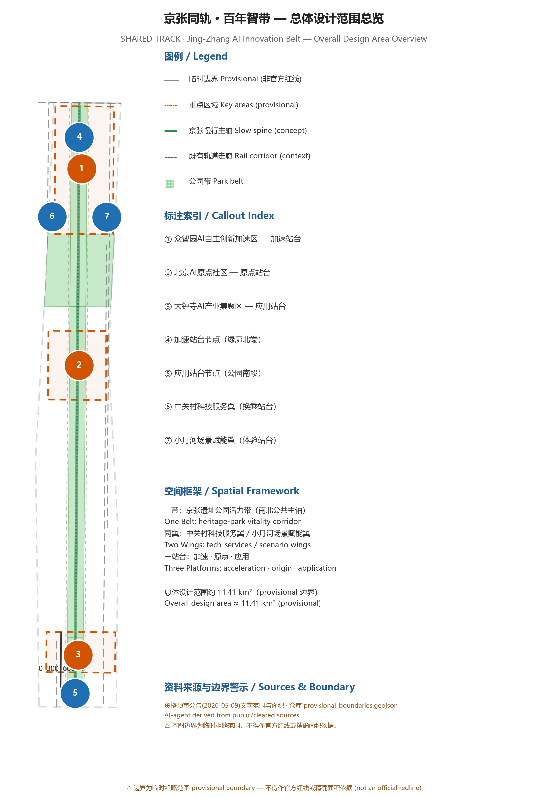
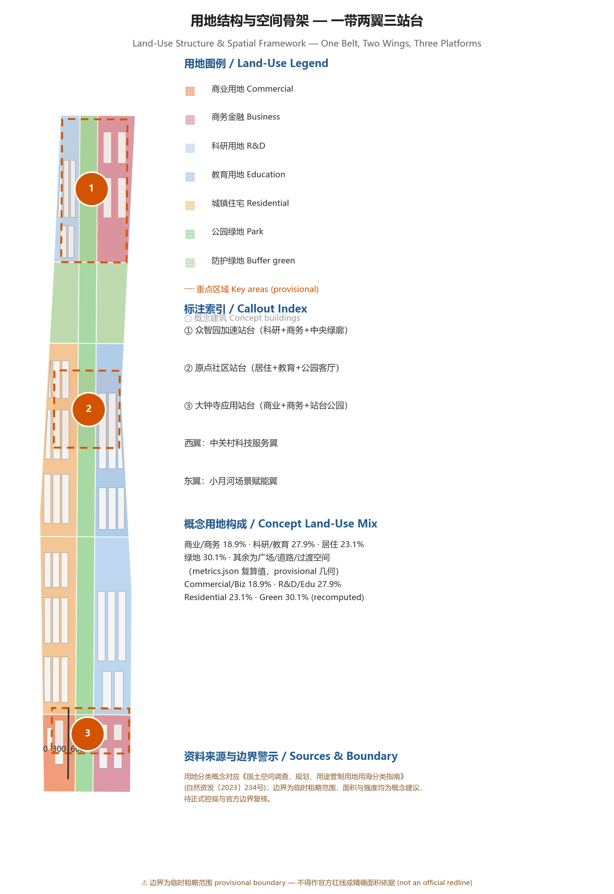
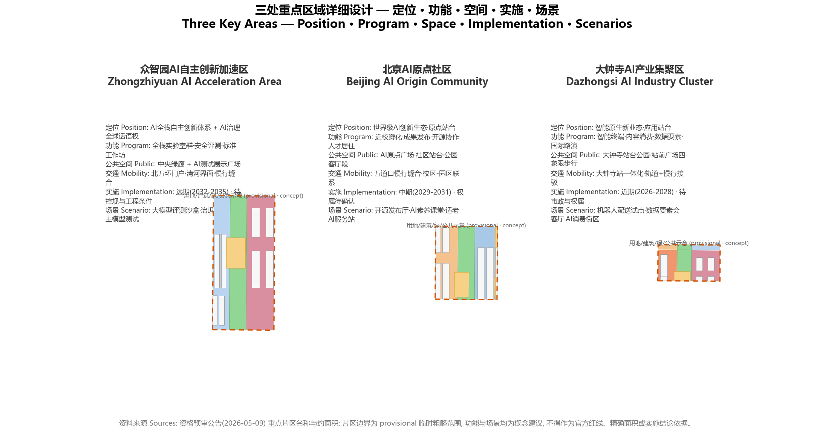
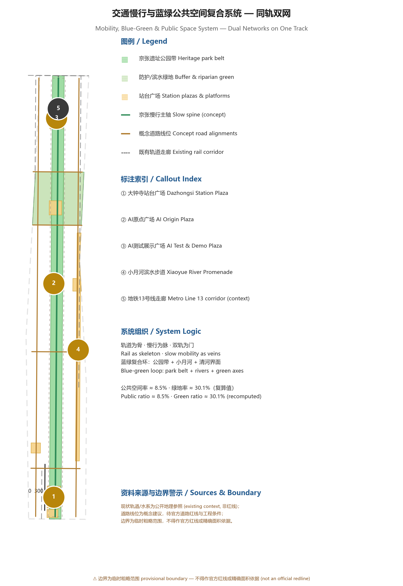
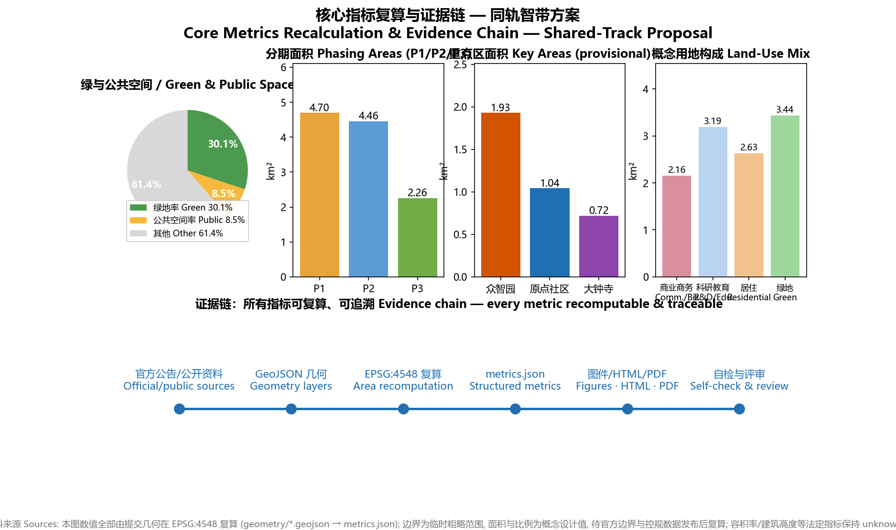

# Shared Track · Centennial AI Belt — An Inclusive Dual-Track Urban Design for the Jing-Zhang AI Innovation Belt

## Design Basis and Source List

This proposal is organized around the Qualification Pre-Announcement for the International Urban Design Competition of the Centennial Jing-Zhang AI Innovation Belt, issued by the Haidian Branch of the Beijing Municipal Commission of Planning and Natural Resources (2026-05-09), with the open-call taskbook for global agents (2026-05-18, user-provided and cleared) as the agent-task basis. It reads the repository `brief/site-package/` design brief, allowed design space, enums, planning limits, standards and schemas [source:SRC-OFFICIAL-ANNOUNCEMENT] [source:SRC-AGENT-TASKBOOK] [source:SRC-SITE-PACKAGE]. Data-usage boundaries follow `data/source_registry.json`: formal-ready sources support design judgments, provisional-only sources are used only for generation, visualization and design discussion, and no background or provisional material may be upgraded into official redlines, statutory controls or implementation commitments [source:SRC-SOURCE-REGISTRY].

All spatial outputs derive from the maintainer-defined provisional rough boundaries inferred from the announcement's textual extent and area (overall design area ≈ 11.4 km²) and the three provisional key-area polygons, verified under EPSG:4548 [source:SRC-PROVISIONAL-BOUNDARIES]. These geometries are labeled `provisional_constraint` only; they are not official redlines, approval bases, precise-area bases or statutory controls. When official polygons are released, land use, buildings, roads, green space, public space, phasing and all area metrics must be recalculated from the official geometry [data:geometry/site_boundary.geojson#SITE-001] [metric:site_area_sqm]. All building height, FAR, road alignment, land ownership and retain/renovate/demolish statements in this proposal are **concept suggestions** for professional teams to deepen; they are not government-approved conclusions.

The cultural narrative uses public historical materials: the Beijing Municipal Archives' photographic album of the Jing-Zhang railway construction and Tsinghua University's records of Qinghuayuan Station and its community [source:SRC-JINGZHANG-HISTORY-ARCHIVES] [source:SRC-TSINGHUA-QINGHUAYUAN-STATION]. Industrial context cites Haidian's "1+X+1" industrial-system release and the Beijing Science Commission's public report on the "three areas and two wings" [source:SRC-HAIDIAN-1X1] [source:SRC-BJ-KW-THREE-AREAS-WINGS]. The governance mechanism is anchored in the Barrier-Free Environment Law of the PRC (effective 2023-09-01), Article 39 on on-site guidance and human-operated service, and the Interim Measures for the Management of Generative AI Services (effective 2023-08-15), Articles 14-15 on content handling and complaint channels; the State Council's 2020 Document No. 45 (running traditional and smart service channels in parallel) serves only as background_only policy context and is not a site-specific statutory control [standard:BARRIER-FREE-ENVIRONMENT-LAW] [standard:GENERATIVE-AI-INTERIM-MEASURES] [standard:ELDERLY-SMART-TECH-PLAN-2020-45].

## Three-Level Scope Framework

The proposal follows the announcement's three scopes: the coordinated research area of ≈ 43.6 km², which addresses the AI ecosystem, future urban form and regional synergy; the overall design area of ≈ 11.4 km² at regulatory-plan-level urban design depth; and the key detailed-design area of ≈ 368.4 ha covering the three key areas at comprehensive-implementation-plan depth [source:SRC-OFFICIAL-ANNOUNCEMENT] [metric:site_area_sqm]. The three levels translate "industry strategy → spatial structure → parcel design" step by step; task mapping is recorded in `compliance_matrix.json`, and depth requirements in the `three_level_scope_framework` and `overall_spatial_structure` items of `design_depth_matrix.json` [depth:three_level_scope_framework] [depth:overall_spatial_structure].

The three scopes share one set of provisional rough geometry: the overall boundary `SITE-001` and the three key areas `PROV-KEY-001/002/003` come from the repository's provisional file; their areas are consistency checks against the announcement's approximate values, not official precise values [data:geometry/key_areas.geojson#PROV-KEY-001] [source:SRC-PROVISIONAL-BOUNDARIES]. After official boundaries are released, the three scope areas, key-area areas, green and public-space ratios and all related metrics must be recalculated; until then, figures in this text are stated as "concept values under provisional rough geometry." The coordinated research area has no independent polygon; its conclusions rely on the announcement's textual extent as spatial reference only.

The spatial framework is named "**One Belt, Two Wings, Three Platforms**": the Belt is the Jing-Zhang heritage-park vitality corridor (the north-south public spine); the Wings are the Zhongguancun tech-services wing to the west and the Xiaoyue River scenario-empowerment wing to the east (east-west axis); the Three Platforms are the Zhongzhiyuan "Acceleration Platform", the AI Origin community "Origin Platform" and the Dazhongsi "Application Platform". Community platforms along the Belt and Wings form a "platform network" [data:geometry/land_use.geojson#LU-002] [data:geometry/roads.geojson#ROAD-001]. This structure turns the three theme belts (Centennial Jing-Zhang Culture Belt, Urban AI Living-Experience Belt, AI Integration and Innovation Belt) into visible, reviewable and phaseable spatial objects rather than slogans.

## Coordinated Research Area: Industry and Future City Research

The coordinated research answers three questions: how to organize a world-class AI innovation ecosystem, how future urban form adapts to AI as new productive force, and why global AI talent would choose this place. The 43.6 km² area is organized as a five-loop innovation chain — "university seeding, open-source collaboration, enterprise conversion, public experience, international communication" — with differentiated synergy toward the Beiwu community area, Future Science City, Huairou Science City, the economic-development zone and the Beijing-Tianjin-Hebei region [source:SRC-BJ-KW-THREE-AREAS-WINGS] [source:SRC-HAIDIAN-1X1]. The three positionings (Centennial Jing-Zhang Culture Belt, Urban AI Living-Experience Belt, AI Integration and Innovation Belt) and the five functions (AI full-stack independent innovation system, world-class AI innovation ecosystem, new AI+ scenario-empowerment paradigm, intelligent vibrant AI city, global AI-governance discourse) form a three-tier response chain: positioning shapes character, functions shape mechanisms, space carries both [standard:PROJECT-AGENT-OPEN-CALL-TASKBOOK].

Six global cases inform the ecosystem design. King's Cross, London, shows that a railway-heritage corridor can be regenerated into a technology cluster; Kendall Square, Boston, builds one of the world's densest innovation districts around MIT; one-north, Singapore, mixes workplaces, housing and ecology for life-science and digital economies [source:SRC-CASE-KINGS-CROSS] [source:SRC-CASE-KENDALL-SQUARE] [source:SRC-CASE-ONENORTH]. Yunqi Town, Hangzhou, accumulates an ecosystem through developer conferences and scenario opening; Adlershof, Berlin, is a research-institute-driven science city; Shibuya, Tokyo, carries content and creative industries through TOD renewal — these three represent scenario-opening, institute-driven and rail-TOD modes respectively [source:SRC-CASE-YUNQI] [source:SRC-CASE-ADLERSHOF] [source:SRC-CASE-SHIBUYA]. Four transferable mechanisms are drawn: heritage activation (King's Cross, Adlershof), anchor institutions (Kendall Square, Adlershof), open scenario operation (Yunqi, one-north) and rail TOD renewal (King's Cross, Shibuya).

Naming and visual identity: the master name is "**Shared Track**" (Chinese: 京张同轨; communication short form: SHARED TRACK · Jing-Zhang AI Belt), drawn from the Jing-Zhang railway's parallel tracks — parallel, non-substituting, ridable by everyone. The "=" sign is both a rail cross-section and an equal sign, forming the core brand symbol: the upper rail is steel (Jing-Zhang railway culture), the lower rail is a dotted circuit (Zhongguancun innovation culture), and the open space between them is the flow of the new AI culture (openness and movement). The visual system adopts the "steel and light" city character: steel grey and ochre red (rail rust) express the honest construction of industrial heritage, AI-belt electric blue expresses the transparency of data and intelligence, and warm human orange expresses inclusion. The logo direction, signage symbols and component library are concept suggestions for professional teams [depth:overall_spatial_structure]. The naming system uses the "platform" series: Acceleration Platform (Zhongzhiyuan), Origin Platform (AI Origin community), Application Platform (Dazhongsi), Interchange Platform (Zhongguancun tech-services wing), Experience Platform (Xiaoyue River scenario wing), and "community platforms" for neighborhood public spaces.

Future-city hypothesis: an AI city is not an "all-automated city" but a "**city ridable by everyone**" — technology adapts to people, not the reverse. Three spatial strategies follow: first, **dual-track parallelism** — every AI scenario must keep a human/traditional parallel channel (see governance mechanism); second, **platform-style public space** — public spaces are treated as "platforms" where everyone can board and alight, with standardized barrier-free and age-friendly components; third, **scenarios as infrastructure** — AI testing, demonstration and operation scenarios are embedded in land use and renewal projects as urban infrastructure [standard:MOHURD-URBAN-DESIGN-MEASURES].

## Overall Design Area: Urban Renewal and Regulatory-Plan-Level Urban Design

The spatial structure of the overall design area (11.4 km²) is "**One Belt, Two Wings, Three Platforms, with a blue-green slow-mobility loop**". The Belt: the Jing-Zhang heritage-park vitality corridor links, south to north, the Dazhongsi station park, the middle park section, the Origin community living-room section, the north park section and the Zhongzhiyuan central green corridor, running parallel to the Metro Line 13 corridor (existing rail, context reference) [data:geometry/green_space.geojson#GREEN-002] [data:geometry/constraints.geojson#CONST-RAIL-001]. The Wings: the western Zhongguancun tech-services wing carries factor allocation, IP and capital services; the eastern Xiaoyue River scenario wing carries AI scenario testing and vibrant-city functions. The three Platforms are the three key areas; the blue-green slow-mobility loop is formed by the park belt, the Xiaoyue River riparian belt, the Qing River frontage and cross-street slow corridors [data:geometry/roads.geojson#ROAD-001] [metric:green_ratio].

The land-use structure is a conceptual zoning: park green (1401) forms a continuous north-south green corridor; commercial (0901) and business/finance (0902) concentrate at Dazhongsi and along the wings; R&D (0802) concentrates at Zhongzhiyuan and the Xiaoyue River wing; education (0804) sits in the campus-adjacent block; residential (0701) lies in the western communities; buffer green (1402) lines the east and west edges. Fifteen land-use units fully cover the submitted boundary without gaps or overlaps [data:geometry/land_use.geojson#LU-003] [metric:land_use_area_sqm] [depth:land_use_layout]. Land-use codes conceptually follow the national classification guide for territorial-space survey, planning and use control; they replace no statutory use control [standard:MNR-LAND-USE-CLASSIFICATION-GUIDE].

The urban-renewal framework follows "**retain first, renovate second, build as supplement**": the Jing-Zhang heritage corridor and the courtyard texture of existing campuses and institutions form the retention base; inefficient industrial space and street frontages are renovated; innovation carriers and platform public spaces are conceptually added. For regulatory-plan-depth content, all indicators involving FAR, building height, building density, setbacks and road redlines are marked `unknown` pending approved regulatory-plan conditions, because the public task package provides none; this proposal never passes off speculative values as approved indicators [depth:development_intensity_controls] [metric:floor_area_ratio]. Forty-five concept building footprints of about 2.64 million m² express spatial massing and renewal logic as design illustration only — not a commitment to construction scale [data:geometry/buildings.geojson#BLDG-001] [metric:building_footprint_area_sqm].

The renewal project list, functional mix and comprehensive-capacity analysis are detailed in Chapter 10 and `phasing.geojson`; height, massing and character control strategy (gradient along the park belt, landmark nodes at platforms, low-rise transitions along the heritage corridor) is a concept suggestion pending heritage-protection and regulatory-plan conditions [depth:height_massing_character] [data:geometry/phasing.geojson#PHASE-P1].

## Detailed Design of Key Areas

Each of the three key areas reaches a readable mini-scheme of "positioning + spatial structure + building renewal + slow mobility + public space + AI scenarios + implementation risks", all as concept suggestions [depth:three_key_area_detailed_design]. The key-area boundaries are provisional rough polygons; areas, functional mixes and project placements in this chapter are directional design only [data:geometry/key_areas.geojson#PROV-KEY-001].

**Zhongzhiyuan AI Acceleration Area (≈ 192.1 ha, Acceleration Platform)**: positioned to carry the AI full-stack independent innovation system and global AI-governance discourse. Spatial structure: "central green corridor + two side blocks" — the western full-stack innovation lab block (R&D 0802), the eastern HQ and accelerator block (business/finance 0902), and the central green corridor doubling as an AI test and demonstration field (1401) [data:geometry/land_use.geojson#LU-013] [metric:zhongzhiyuan_area_sqm]. Building renewal mixes new build and retrofit, with concept massing stepping down toward the green corridor; public space comprises the AI test and demonstration plaza and the Qing River frontage; mobility relies on the North 5th Ring gateway and the west-wing connector, with slow mobility sewn to the whole belt through the north park section. AI scenarios include the LLM evaluation sandbox, governance showcase, and autonomous-model test field (industry test/validation scenarios). Implementation risks: gateway traffic organization at the North 5th Ring, Qing River blue-line and flood-control conditions, and regulatory-plan intensity conditions all await confirmation; the area enters the long-term phase (2032-2035) [data:geometry/phasing.geojson#PHASE-P3].

**Beijing AI Origin Community (≈ 104.3 ha, Origin Platform)**: positioned as a campus-adjacent community for a world-class AI innovation ecosystem. Spatial structure: "western residential + eastern education + central park living room" — the western residential block (0701), the eastern campus-adjacent education and research block (0804), and the central park section with the AI Origin Plaza carrying release events, open-source collaboration and public experience [data:geometry/key_areas.geojson#PROV-KEY-002] [data:geometry/public_space.geojson#PUBLIC-003] [metric:origin_community_area_sqm]. Building renewal is mainly retention and micro-renewal, emphasizing slow-mobility stitching between campus, park and streets and TOD integration at Wudaokou station. AI scenarios include the open-source release hall, AI literacy classrooms, and age-friendly AI service stations. Implementation risks: campus boundaries and land ownership, ground-floor program guidance, and station-integration schemes all await confirmation; the area enters the mid-term phase (2029-2031) [data:geometry/phasing.geojson#PHASE-P2].

**Dazhongsi AI Industry Cluster (≈ 72.0 ha, Application Platform)**: positioned as an urban block for native-smart new business forms. Spatial structure: "station park + consumption block + digital-business block" — the western smart-consumption block (0901), the central Dazhongsi station park (1401), and the eastern digital-business block (0902) [data:geometry/land_use.geojson#LU-001] [metric:dazhongsi_area_sqm]. The core spatial move is four-quadrant pedestrian connectivity around Dazhongsi station and the composite use of the station-front plaza (public space, rail interchange, temporary exhibitions) [data:geometry/public_space.geojson#PUBLIC-001]. AI scenarios include the robot-delivery pilot, the data-factor salon, and the AI consumption experience block (industry test/validation scenarios). Implementation risks: station integration, municipal utilities and commercial renewal ownership await confirmation; the area enters the near-term phase (2026-2028) [data:geometry/phasing.geojson#PHASE-P1].

## AI Innovation Ecosystem, Personas, and AI+ Scenarios

The AI ecosystem rests on four pillars — "**full-stack autonomy, open-source collaboration, scenario opening, governance discourse**" — corresponding to the system, ecosystem, paradigm, vibrancy and discourse functions [standard:PROJECT-AGENT-OPEN-CALL-TASKBOOK]. The organization of ecosystem factors (land, space, industry, capital, talent, compute, data, scenarios) is stated entirely as concept suggestions: for example, "compute stations" as prototypes of new infrastructure combining edge compute with public services, and the "data-factor salon" as a compliant, authorized city-level interface for data circulation. None of these constitute policy commitments or confirmed arrangements [depth:municipal_new_infrastructure].

User personas (7): ① retired resident Aunt Zhang — needs voice-first, human-parallel life services; ② visually impaired young developer Chen — needs barrier-free wayfinding and perceivable digital interfaces; ③ primary pupil Duoduo — needs AI literacy education and safe public AI experiences; ④ returnee AI engineer Alex — needs startup space, community belonging and international exchange; ⑤ courier/rider Master Li — needs career paths and rest stations that coexist with delivery robots; ⑥ small merchant Sister Wang — needs low-cost digitalization and native-smart business upgrading; ⑦ graduate student Xiao Lin — needs scenario testing, data compliance and conversion pathways. Persona-to-space mapping follows the table below and the scenario cards [source:SRC-AGENT-TASKBOOK].

AI scenario cards (12, including 4 industry test/validation scenarios; all are concept suggestions; operation requires separate authorization and approval):

| # | Scenario card | Spatial carrier | Users | Operational data & privacy boundary | Human review & operator |
| --- | --- | --- | --- | --- | --- |
| S01 | Open-source release hall | Origin community, AI Origin Plaza | Developers, startups | Aggregate event data; no personal behavior tracking | Human review of releases; community operator |
| S02 | AI literacy classroom (Track Classroom) | Origin community education block | Students, residents, seniors | Public content; anonymized learning data | Teachers/volunteers teach; education institutions |
| S03 | Age-friendly AI service station | Community platforms (Zhichun Rd etc.) | Senior residents | Voice interaction without identity storage | Human counter in parallel (a self-imposed dual-track principle of this proposal; the human-service requirement of Art. 39 of the Barrier-Free Environment Law applies only to statutorily enumerated public-service venues such as medical, social-security, financial and utility-payment services) [standard:BARRIER-FREE-ENVIRONMENT-LAW] |
| S04 | AI health station | Community platforms + health facilities | Residents | Health data localized; no third-party sharing | Medical staff review; AI assists triage only |
| S05 | LLM evaluation sandbox (test/validation) | Zhongzhiyuan central green corridor | Model firms, researchers | Controlled test data; de-identified | Human spot-check of results; professional evaluators |
| S06 | Governance showcase (test/validation) | Zhongzhiyuan governance block | Public, firms, regulators | Synthetic demonstration data | Human approval of display content |
| S07 | Autonomous-model test field (test/validation) | Zhongzhiyuan west block | Firms | Controlled on-site collection | Safety officers on site; permits required |
| S08 | Robot-delivery pilot (test/validation) | Dazhongsi block | Merchants, residents, riders | Aggregated route statistics; no personal locations publicized | Pilot filing and human supervision; operator |
| S09 | Data-factor salon | Dazhongsi digital-business block | Firms, intermediaries | Compliant, auditable, minimal | Legal & compliance human review |
| S10 | AI slow-mobility navigation | Jing-Zhang slow spine | All people | Explainable signage; low-intrusion sensing; no individual identification | Human patrols and citizen feedback channels |
| S11 | Native-smart consumption block | Dazhongsi consumption block | Consumers, merchants | Authorized consumption data; opt-out available | Merchant operation + block charter |
| S12 | Jing-Zhang digital-twin museum | Park cultural nodes | Public, visitors | Public archives and synthetic reconstruction; no face capture | Human approval of content; cultural operator [source:SRC-JINGZHANG-HISTORY-ARCHIVES] |

All cards follow common boundaries: data minimization, public sources, explainability, human review; no privacy violation, excessive surveillance or non-reviewable scenarios; immature technology is not presented as deployable at scale; test scenarios are not presented as approved operations [standard:GENERATIVE-AI-INTERIM-MEASURES]. Scenario nodes enter the `SCENARIO_NODE`/`AI_SERVICE_ZONE` concept layers and the compliance matrix so reviewers can check scenario-space-metric correspondences [metric:public_space_count].

## Land Use, Building Scale, and Retain-Renovate-Demolish Strategy

The zoning (15 units) and concept buildings (45) are generated from the same geometry; areas and ratios are recomputable from the GeoJSON [data:geometry/land_use.geojson#LU-007] [data:geometry/buildings.geojson#BLDG-001]. Concept land mix: commercial and business/finance ≈ 2.16 million m² (≈ 18.9%), R&D and education ≈ 3.19 million m² (≈ 27.9%), residential ≈ 2.63 million m² (≈ 23.1%) [metric:commercial_land_area_sqm] [metric:research_education_land_area_sqm] [metric:residential_land_area_sqm]. Park and buffer green ≈ 3.44 million m² with a green ratio of ≈ 30.1% [metric:green_ratio], with the remainder being plazas, roads and transition spaces. The mix balances four categories of public-interest space — industry, housing, green and public — and all figures are concept values under provisional geometry, consistent with the unique metrics table in the metrics chapter across text, figures, HTML and PDFs.

The retain/renovate/demolish logic is a **concept classification** without parcel-level conclusions: retain — the Jing-Zhang heritage corridor frontage, campus and institution courtyards, and quality residential clusters; renovate — inefficient industrial space, street frontages and public-space quality; build — innovation carriers, platform public spaces and necessary mobility facilities (concept locations); pending — parcels involving ownership, regulatory-plan, heritage or engineering conditions are listed as pending confirmation [depth:retain_renovate_demolish]. Statutory indicators (FAR, height, density, setbacks) remain `unknown`; reasons and recalculation paths are recorded in `assumptions.json` and `metrics.json` [metric:building_height_m] [depth:development_intensity_controls]. Concept building massing expresses spatial relationships only; it is neither approved construction scale nor any investment or engineering-feasibility conclusion.

## Transport, Rail, Municipal Infrastructure, and Public Services

The mobility strategy is "**rail as skeleton, slow mobility as veins, dual-track as gateways**": the Metro Line 13 corridor (context reference) organizes interchange at the three platforms; the Jing-Zhang slow spine is the north-south walking and cycling artery; cross-street connectors organize the micro-network; the west/east wing longitudinal connectors disperse motorized traffic [data:geometry/roads.geojson#ROAD-001] [data:geometry/constraints.geojson#CONST-RAIL-001] [depth:traffic_rail_slow_parking]. Slow-mobility gap-stitching focuses on the North 5th Ring crossing, the Dazhongsi station four quadrants and the Wudaokou area; parking and non-motorized-vehicle organization follow concept suggestions of "rail interchange + centralized parking + shared-bike geo-fencing", pending official data on facilities and road redlines [metric:road_centerline_length_m].

Municipal and new infrastructure adopt a concept skeleton of "**edge compute, distributed energy, digital-twin base**": AI scenario nodes deploy edge compute and privacy-preserving terminals; public spaces pilot photovoltaic seating and smart light poles (concept prototypes only, no engineering-feasibility commitment); professional calculations of utilities, fire, flood control and energy loads are prerequisites for formal deepening [depth:municipal_new_infrastructure]. Public-service facilities follow the "platform network": each community platform provides a human service corner (dual-track parallel), barrier-free and age-friendly facilities, and shared innovation services (meeting rooms, test equipment, legal and IP consultation stations); service radii and facility standards await the official public-facility special plan.

## Blue-Green Network, Public Space, and Urban Character

The blue-green network is organized as "**one corridor, two rivers, three belts**": the corridor is the Jing-Zhang heritage-park vitality belt (a ≈ 9 km concept continuous green corridor with five park segments of ≈ 2.5 million m²); the two rivers are the Qing River frontage and the Xiaoyue River riparian belt; the three belts are the western and eastern buffer greens and the cross-street green axes [data:geometry/green_space.geojson#GREEN-002] [metric:green_space_area_sqm] [depth:blue_green_public_space]. The concept green ratio of ≈ 30.1% supports a "green at the window, parks on foot" quality of life for talent, while contributing stormwater retention and heat-island mitigation (engineering conditions pending professional assessment).

The public-space system is the "**platform network**": eight platform plazas and promenades of ≈ 0.97 million m² (public-space ratio ≈ 8.5%), including the Dazhongsi station plaza, the AI Origin Plaza, the AI test-and-demo plaza, the north and south gateway plazas, community platform plazas and the Xiaoyue River promenade [data:geometry/public_space.geojson#PUBLIC-001] [metric:public_space_ratio]. The platform component library (concept): zero-level-change paving, continuous tactile paving, age-friendly seating, human service corners, readable information screens (text + voice dual channel), barrier-free restrooms and baby-care facilities. Component standards follow this proposal's self-imposed dual-track principle; where human-service requirements apply to statutorily enumerated public-service venues (medical, social-security, financial, utility-payment), they correspond to the boundary of Article 39 of the Barrier-Free Environment Law; State Council Document No. 45 (2020) serves only as background_only policy context for running traditional and smart services in parallel [standard:BARRIER-FREE-ENVIRONMENT-LAW] [standard:ELDERLY-SMART-TECH-PLAN-2020-45].

Urban character and AI pilgrimage landmarks (4, all concept suggestions): ① **Platform Zero** (Origin community) — an AI-origin timeline installation commemorating the spiritual succession from the Jing-Zhang railway to Zhongguancun, doubling as a release stage; ② **Jing-Zhang Medal Honor Gallery** (Zhongzhiyuan) — an honor-display system built from rail spikes and signal elements, showcasing open-source achievements of developers and contributors, echoing the tradition of "engrave your GitHub ID on the century-old line"; ③ **Dazhongsi AI Time Bell** — a sound landmark of bell tones and data-flow soundscapes; hourly summaries require content approval; ④ **Signal-Dialogue Installation** (park belt) — public art where red-green signals interact with pedestrians, meaning "dialogue between people and AI". The "steel and light" character is applied as concept norms for signage, paving, furniture and lighting; the cultural signage system is managed separately from the belt's overall Logo system to avoid confusion [depth:height_massing_character] [source:SRC-TSINGHUA-QINGHUAYUAN-STATION].

## Renewal Projects, Implementation Policy, and Phasing

Renewal project list (10 items; all concept suggestions; implementing entities and policies require confirmation by professional teams and competent authorities):

| No. | Project | Type | Phase | Key dependencies |
| --- | --- | --- | --- | --- |
| JZ-01 | Dazhongsi station park & station-front plaza | Public space / rail integration | Near-term | Station scheme, municipal utilities |
| JZ-02 | Dazhongsi station four-quadrant walkability | Mobility | Near-term | Intersections, municipal conditions |
| JZ-03 | Community platform network (first 3) | Public space / public service | Near-term | Ownership, barrier-free acceptance standards |
| JZ-04 | Jing-Zhang slow spine gap stitching | Public space / mobility | Near+mid-term | Crossing nodes, traffic review |
| JZ-05 | Origin community campus-adjacent conversion street | Urban renewal / industry service | Mid-term | Campus boundary, ownership, ground-floor mix |
| JZ-06 | AI Origin Plaza & release hall | Public space / industry service | Mid-term | Land conditions, operator |
| JZ-07 | Xiaoyue River promenade completion | Blue-green space | Mid-term | River blue line, flood conditions |
| JZ-08 | Zhongzhiyuan central green corridor & test field | Blue-green / industry testing | Long-term | Qing River frontage, safety & evaluation norms |
| JZ-09 | Zhongzhiyuan full-stack innovation block renewal | Urban renewal / industry | Long-term | Regulatory-plan intensity, ownership, engineering |
| JZ-10 | Edge compute & dual-track service pilot | New infrastructure | Near-term pilot | Energy, compute, safety, operator |

Implementation-policy suggestions (concept): the "**Dual-Track Parallel Service Charter**" — a higher design principle voluntarily adopted by this proposal: before any public-facing AI scenario goes live it must pass four checks: human parallel channel, barrier-free accessibility, privacy minimization, and human review. Where the human-service boundary aligns with public law (e.g., venues enumerated in Article 39 of the Barrier-Free Environment Law), statutory requirements apply; for all other scenarios the human channel is this proposal's voluntary commitment, not a general legal obligation. "Platform admission" — AI installations in public space must pass content approval and the security-assessment/filing boundary review; "scenario opening" — open scenarios in graded sandbox-pilot-regular operation, with test scenarios never presented as approved operations; "contribution memory" — developer and contributor honors enter the Jing-Zhang Medal system as long-term brand assets [standard:GENERATIVE-AI-INTERIM-MEASURES] [source:SRC-AGENT-TASKBOOK].

Phasing: the near-term start-up phase (2026-2028; Dazhongsi and Zhichun Road section) prioritizes scenarios, station parks and dual-track service pilots; the mid-term renewal phase (2029-2031; Origin community and north park) prioritizes campus-adjacent conversion and slow-mobility stitching; the long-term phase (2032-2035; Zhongzhiyuan) prioritizes the full-stack innovation block and test field; the three phases cover ≈ 4.70/4.46/2.26 million m² [data:geometry/phasing.geojson#PHASE-P1] [metric:phasing_area_sqm]. The competition window (deadline Aug 31) is clearly distinguished from implementation phasing: this submission is conceptual design; implementation requires statutory procedures and professional deepening.

Long-term operation (taskbook agent.6): annual event system (concept) — spring "Jing-Zhang AI Developer Week" (open-source hackathon and code contributions), summer "Global AI Innovation Belt Forum" (international communication and attraction), autumn "Scenario Opening Season" (sandbox and pilot open days), winter "Platform Zero New Year · AI Culture Festival" (public experience and honor awards). Brand IP and developer community: the "Shared Track" IP and dual-track symbol extend event visuals; the developer community runs on a "contribution points → Jing-Zhang Medal → honor display" mechanism; scenario-open operation runs a closed loop of "application, review, permit, evaluation"; international communication and conversion pathways are built through forums, workshops and bilingual content as long-term cooperation channels. All events, funds, investment attraction and policy arrangements are concept suggestions and are not stated as confirmed arrangements [source:SRC-AGENT-TASKBOOK] [depth:renewal_project_list].

## Metrics, Area Recalculation, and Compliance Matrix

The indicator system has three classes: **spatial** (recomputed from submitted geometry under EPSG:4548) — total area ≈ 1,141.3 ha, green ratio ≈ 30.1%, public-space ratio ≈ 8.5% [metric:site_area_sqm] [metric:green_ratio] [metric:public_space_ratio]; building footprint ≈ 264 ha [metric:building_footprint_area_sqm], with phasing areas summing to the submitted boundary [metric:phasing_area_sqm]; **control** (dependent on official regulatory planning) — FAR, height, density, setbacks and road redlines are uniformly `unknown` with reasons recorded [metric:floor_area_ratio]; **performance** (calibrated in operation) — the AI innovation index, talent density, scenario usage frequency and event participation are operational indicators and are not written into approved conclusions. The compliance, standard and depth matrices in `compliance_matrix.json`, `standard_matrix.json` and `design_depth_matrix.json` cover all announcement tasks 1.3/1.4/1.5 and all agent tasks agent.1-agent.6; failure to cover any mandatory task means incompleteness [depth:metrics_recalculation].

The recalculation chain: `geometry/*.geojson` → EPSG:4548 area computation → `metrics.json` → consistent display in figures/HTML/PDF; the four-gate self-check (deterministic validation, spatial review, visual review, professional evidence review) is recorded in `self_check.json`. The three formal core visual metrics (site area, green ratio, public-space ratio) are known finite values recomputable from geometry and consistent with the `data-value` declarations in `visual/index.html`; concept values produced from provisional geometry keep their provisional labels, sources, formulas and recalculation triggers after official data is released [source:SRC-PROVISIONAL-BOUNDARIES].

**Unique metrics table** (all texts, figures, HTML and PDFs in this version adopt the following authoritative values recomputed from the submitted geometry; any other value appearing in any carrier shall defer to this table):

| Metric | Authoritative value (recomputed) | Unit | Source |
| --- | --- | --- | --- |
| Overall design area | 11,412,825 | m² (≈ 11.41 km²) | geometry/site_boundary.geojson |
| Green area / green ratio | 3,437,066 / 0.301 | m² / ratio | geometry/green_space.geojson |
| Public-space area / ratio | 970,363 / 0.085 | m² / ratio | geometry/public_space.geojson |
| Commercial & business land | 2,155,015 (18.9%) | m² | geometry/land_use.geojson |
| R&D & education land | 3,189,324 (27.9%) | m² | geometry/land_use.geojson |
| Residential land | 2,631,451 (23.1%) | m² | geometry/land_use.geojson |
| Building footprint | 2,641,273 | m² | geometry/buildings.geojson |
| Phase areas P1/P2/P3 | 4,696,450 / 4,457,162 / 2,259,238 | m² | geometry/phasing.geojson |
| FAR / height etc. statutory | unknown (pending official controls) | — | metrics.json |

## Risk, Copyright, and Compliance

Risks and missing-data list (see `assumptions.json` and the `risk_missing_data` item of `design_depth_matrix.json`) [depth:risk_missing_data]: ① official boundary and key-area polygons are missing — all area metrics await recalculation; ② regulatory-plan conditions are missing — FAR/height/density/setback remain unknown; ③ ownership and existing-building data are missing — retain/renovate/demolish is concept-classification only; ④ engineering conditions are missing — no feasibility conclusions on municipal works, bridges/tunnels or underground space; ⑤ heritage-protection boundaries are missing — the heritage-corridor character zone is a concept sketch only [source:SRC-PROVISIONAL-BOUNDARIES].

Copyright and compliance: this proposal uses only public or cleared materials; Jing-Zhang railway history cites the Beijing Municipal Archives' photographic album and Tsinghua University's Qinghuayuan Station records; cases cite the institutions' official sites and public pages; all are registered in `sources.json` with use boundaries [source:SRC-JINGZHANG-HISTORY-ARCHIVES] [source:SRC-CASE-KINGS-CROSS]. The proposal does not claim or disclose non-public planning drawings, non-public spatial data, internal control indicators or personal privacy information; it provides no official approvals, approved regulatory plans, final land ownership, confirmed construction scale or implementation commitments; all content involving specific building intensity, building height, road alignments and land ownership is explicitly labeled as concept suggestions. Where OpenStreetMap public data is used as base-map reference, ODbL attribution requirements are respected [source:SRC-OSM-COPYRIGHT]. AI-generated content (this proposal is entirely agent-generated) follows the generation-disclosure principle; tools, models and limitations are recorded in `agent.json` and `report/copyright_statement.md`; any quotation of official pages is subject to the official page, with local snapshots for offline retrieval only [standard:GENERATIVE-AI-INTERIM-MEASURES].

### Data Dependencies and Deepening Pathways (honest statement of the impact boundary of missing data)

This proposal is concept-level. The data gaps below define what the proposal "can achieve now" versus what it "could achieve once the data arrives"; the two are strictly distinguished and the former is never presented as the latter:

| Missing data | What the proposal can achieve now (concept stage) | What becomes possible once the data arrives (deepening effect) |
| --- | --- | --- |
| Official SITE_BOUNDARY / KEY_AREA / research-area polygons (GIS/CAD/PDF + CRS) | Concept spatial structure and design intent on provisional geometry; indicative areas | All area metrics precisely recalculated under EPSG:4548 from official geometry; statutory area basis and formal-review-ready expressions |
| Approved regulatory-plan controls (FAR, building height, density, setbacks, road redlines, public-facility standards) | Indicators remain `unknown` without fabricated approved values; concept massing relations and intensity direction only | Parcel-level FAR and total floor area, height zoning and skyline control, setback and street-interface control, road-redline and network-density verification, facility standards and service radii — upgrading this proposal from "concept intensity" to **regulatory-plan-depth, reviewable urban design deliverables** |
| Land ownership, parcel boundaries, verified existing-building surveys | Retain/renovate/demolish as concept classification only (retain/renovate/build/pending), never parcel-level conclusions | **Parcel-level retain/renovate/demolish conclusions**, renewal project sequencing and accountable implementing entities, and the basis for cost estimation and property-coordination mechanisms |
| Municipal utilities, fire safety, flood control, energy loads, bridges/tunnels, underground space | Concept municipal skeleton and new-infrastructure directions only; no feasibility conclusions | **Engineering-feasibility judgments**, municipal capacity and energy-load verification, and engineering bases for phasing and investment sequencing |
| Official heritage-protection scope and control zones along the Jing-Zhang corridor | Heritage-corridor character zone as concept sketch; height strategy as directional suggestion | Height and character controls acquire a **statutory basis**, forming a heritage-coordinated special control |

These dependencies are registered in `assumptions.json` (A-BOUNDARY-001 / A-CONTROLS-001 / A-OWNERSHIP-001 / A-ENGINEERING-001 / A-HERITAGE-001) and the `risk_missing_data` item of `design_depth_matrix.json`; each is updated per its recorded recalculation trigger when the data arrives [depth:risk_missing_data].

## References

1. Beijing Municipal Commission of Planning and Natural Resources, Haidian Branch: *Qualification Pre-Announcement for the International Urban Design Competition of the Centennial Jing-Zhang AI Innovation Belt* (2026-05-09). https://ghzrzyw.beijing.gov.cn/zhengwuxinxi/tzgg/hd/202605/t20260509_4643047.html [source:SRC-OFFICIAL-ANNOUNCEMENT]
2. *Excerpt of the Open-Call Taskbook for Global Agents on the Centennial Jing-Zhang AI Innovation Belt Urban Design* (user-provided, cleared, 2026-05-18). [source:SRC-AGENT-TASKBOOK]
3. Beijing Municipal Archives: *Photographic Album of the Jing-Zhang Railway Construction*. https://www.bjma.gov.cn/eportal/ui?pageId=371443&articleKey=372133&columnId=371459 [source:SRC-JINGZHANG-HISTORY-ARCHIVES]
4. Tsinghua University: *Qinghuayuan Station and the Tsinghua Community*. https://www.tsinghua.edu.cn/info/1182/104384.htm [source:SRC-TSINGHUA-QINGHUAYUAN-STATION]
5. Haidian District Government: *Haidian Releases the "1+X+1" Modern Industrial System Layout* (2026-03-02). https://www.bjhd.gov.cn/ztzx/2026/2026jjshgzlfzdh/yw/202603/t20260303_4806875.shtml [source:SRC-HAIDIAN-1X1]
6. Beijing Municipal Science & Technology Commission and Zhongguancun Administrative Committee: *"Three Areas and Two Wings" Build a World-Class AI Aggregation Site* (2026-04-03). https://kw.beijing.gov.cn/xwdt/kcyx/xwdtcyfz/202604/t20260403_4573808.html [source:SRC-BJ-KW-THREE-AREAS-WINGS]
7. Standing Committee of the National People's Congress: *Barrier-Free Environment Law of the PRC* (adopted 2023-06-28, effective 2023-09-01). https://www.gov.cn/yaowen/liebiao/202306/content_6888910.htm [standard:BARRIER-FREE-ENVIRONMENT-LAW]
8. Cyberspace Administration of China et al.: *Interim Measures for the Management of Generative AI Services* (effective 2023-08-15). https://www.cac.gov.cn/2023-07/13/c_1690898327029107.htm [standard:GENERATIVE-AI-INTERIM-MEASURES]
9. General Office of the State Council: *Implementation Plan on Solving the Difficulties of the Elderly in Using Smart Technology* (Guobanfa [2020] No. 45). https://www.gov.cn/zhengce/content/2020-11/24/content_5563804.htm [standard:ELDERLY-SMART-TECH-PLAN-2020-45]
10. King's Cross official site. https://www.kingscross.co.uk/ [source:SRC-CASE-KINGS-CROSS]
11. MIT News: *MIT presents updated Kendall Square Initiative plan to City of Cambridge*. https://news.mit.edu/2016/mit-presents-updated-kendall-square-initiative-plan-city-cambridge-0107 [source:SRC-CASE-KENDALL-SQUARE]
12. JTC Singapore: *LaunchPad @ one-north*. https://www.jtc.gov.sg/find-land/jtc-key-estates/launchpad [source:SRC-CASE-ONENORTH]
13. Hangzhou Municipal Bureau of Culture, Radio, TV and Tourism: *Yunqi Town*. https://wgly.hangzhou.gov.cn/art/2022/12/14/art_1229707580_58943488.html [source:SRC-CASE-YUNQI]
14. WISTA: *Technology Park Berlin Adlershof*. https://www.adlershof.de/en/science-technology/overview [source:SRC-CASE-ADLERSHOF]
15. Wikipedia: *Shibuya* (encyclopedic reference). https://en.wikipedia.org/wiki/Shibuya [source:SRC-CASE-SHIBUYA]

The complete machine index is in `sources.json`, `metrics.json`, `compliance_matrix.json`, `standard_matrix.json` and `design_depth_matrix.json`. This proposal is an open co-creation concept; it does not replace formal planning and does not constitute government-approved conclusions [source:SRC-AGENT-TASKBOOK].
