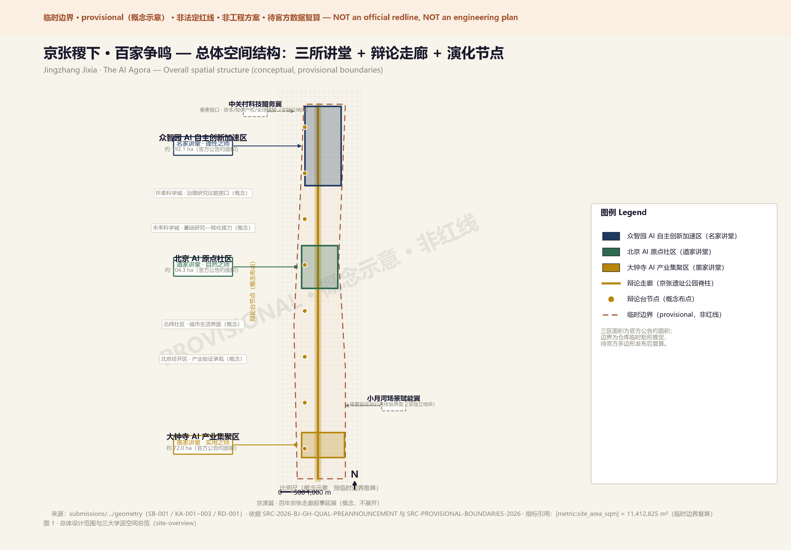
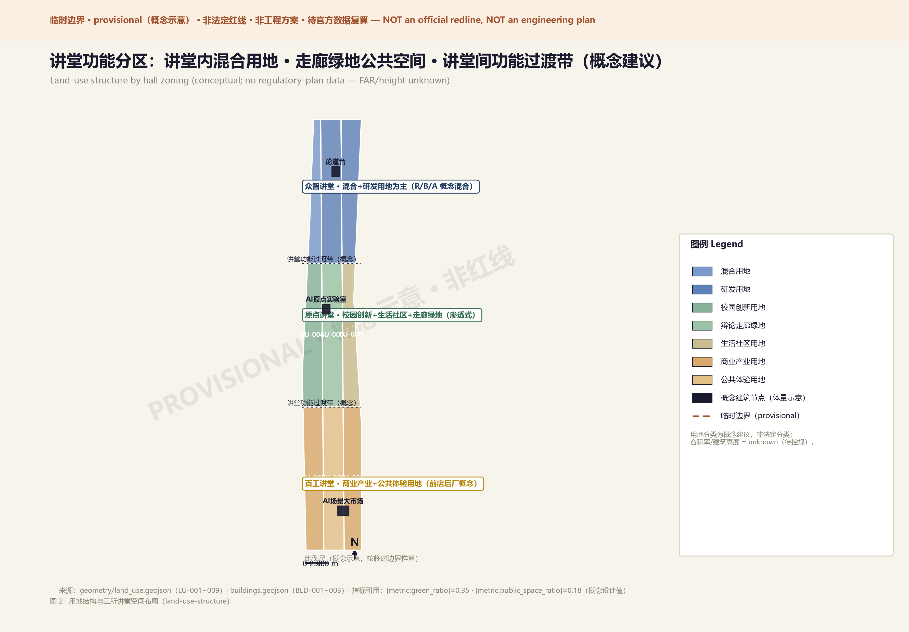
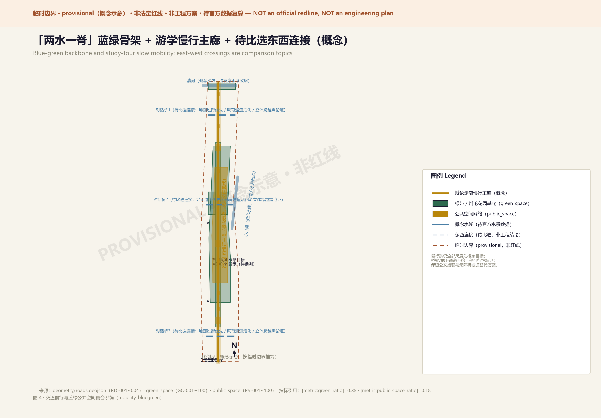
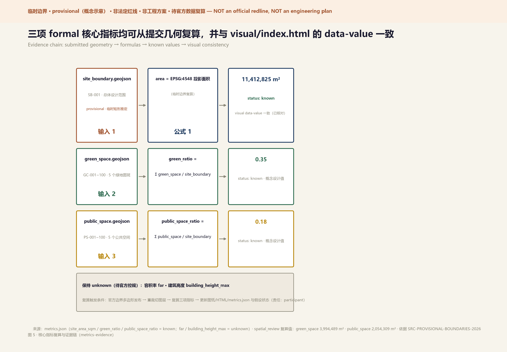

# Jingzhang Jixia: A Hundred Schools of Thought — Reshaping the AI Innovation Belt through Philosophical Debate

## Design Basis and Source Inventory

The inspiration for this proposal comes from a 2,300-year-old question: why did the Jixia Academy give birth to a hundred schools of thought? The answer lies in three genes — **independent persona** (each scholar speaks from an inalienable position), **structured debate** (genuine mutual response, not parallel monologues), and **append-style evolution** (ideas can be iterated but originals are never erased). These three genes precisely mirror the core tensions facing the Centennial Jingzhang AI Innovation Belt: how do autonomous innovation and open ecosystem coexist? How do technological rationality and humanistic nature harmonize? How do conceptual research and industrial implementation connect?

Design basis includes: Beijing Planning Commission Haidian Branch pre-qualification announcement [source:SITE-PACKAGE]; Agent taskbook six requirements [source:AGENT-TASKBOOK]; repository provisional boundary geometry [data:geometry/site_boundary.geojson#SB-001]; and public policy, academic literature, and global AI innovation ecosystem cases.

## Three-Level Scope Framework

The spatial logic of Jixia Academy naturally presents a "palace — hall — arena" three-level nesting structure, precisely mapping to the three work levels:

**Coordinated Research Area (43.6 km²) = The Palace**: Like Jixia Academy as the foundation of Qi's intellectual ecosystem, the 43.6 km² research area is the strategic base of the entire innovation belt [data:geometry/site_boundary.geojson#PROV-RESEARCH-001].

**Overall Design Area (11.4 km²) = The Halls**: The real design ground. 11.4 km² organized as three "halls" — each presided over by a philosophical persona, with independent spatial language and functional positioning. Connected by the Jingzhang Railway Park debate corridor [data:geometry/site_boundary.geojson#PROV-SITE-001].

**Key Areas (368.4 ha) = The Debate Arenas**: The front lines where ideas collide. Concepts are spatialized, debates are architecturalized, evolution is landscaped [data:geometry/key_areas.geojson#KA-001].

This proposal uses provisional boundaries from the repository. Rectangular edges do not represent parcels or road redlines. All area metrics require recalculation when official polygons are published [depth:scope_framework].

## Coordinated Research: Industry and Future City

### Naming and Brand Identity (agent.1)

**Primary Name: Jingzhang Jixia (京张稷下)**

Naming logic: "Jingzhang" anchors geography and history — the century-old railway built by Chinese engineers resonates with Jixia Academy's spirit of "autonomous debate." "Jixia" activates the 2,300-year-old intellectual origin — humanity's first systematic multi-school thought experiment. Together they form a dual brand gene: **autonomy + debate**.

English subtitle **The AI Agora** provides a Western cultural anchor — Agora is the ancient Greek public debate plaza, forming an East-West civilizational dialogue.

**Logo Direction**: Three visual genes fused — (1) Jixia Academy's architectural silhouette as outer frame; (2) Jingzhang railway lines as connecting spine; (3) AI neural network node graph as "hundred schools" imagery inside. Three-color system: Rational Blue (#1E3A5F), Natural Green (#2D6A4F), Pragmatic Gold (#B8860B).

**Brand base specification (one-page, conceptual direction)**: mark direction = grand-hall frame + rail spine + node network; combination = 京张稷下 / Jingzhang Jixia · The AI Agora (original naming; trademark search recommended before formal use); minimum size ≈12mm print / 24px screen (to be visually tested); monochrome line version for engraving and accessibility; application examples in figures and visual/index.html; type strategy = system fonts only (no embedded commercial fonts); font/graphic provenance declared in `report/copyright_statement.md`.

### Three Positionings, Five Functions, Three Areas and Two Wings (agent.1)

The taskbook framework is organized into a verifiable alignment: three positionings (Centennial Jingzhang Cultural Belt / Urban AI Life Experience Belt / AI Integration Innovation Belt) map onto the palace's cultural gene, the halls' daily debate, and the hundred-schools output; five functions (full-stack autonomous system / world-class ecosystem / scenario empowerment / intelligent vital city / global AI governance voice) are carried respectively by Zhongzhiyuan's lab clusters, the Origin Community's ecological base, Dazhongsi's scenario market plus the Xiaoyuehe wing, corridor evolution nodes, and the global debate center. Two wings are element interfaces rather than separate parcels: the Zhongguancun Technology Service Wing supplies capital, IP and global linkage; the Xiaoyuehe Scenario Empowerment Wing supplies citizen-facing scenario testing and public experience. Four synergy loops run through the system: innovation source → translation; service element inflow; scenario demand → verification feedback; brand → talent flow. All loop positions are conceptual until official boundaries are published [source:BJ-KW-THREE-AREAS-WINGS].

### Regional Innovation Synergy (agent.1, conceptual proposals only)

The belt is positioned as a debate interface within Beijing's innovation map; none of the following is a confirmed cooperation [source:HAIDIAN-1X1]: Beiwei Community — southern urban-life interface for scenario spillover; Future Science City — basic-research source paired with the belt's translation role; Huairou Science City — governance-research and ethics-debate agenda (research direction only); Beijing Economic-Technological Development Area — scale-manufacturing counterpart for concepts debated in Haidian; Beijing-Tianjin-Hebei — natural corridor extension of the centennial Jingzhang narrative. Every item carries an explicit uncertainty note and is not stated as signed, approved, or committed.

### Integrated Planning and Space-Industry Fusion (agent.1)

Three methodological propositions for professional teams: (1) integrated planning — manage cultural narrative, industrial mechanism and spatial carriers in one alignment matrix; (2) space-industry fusion — use the scenario as the minimal coupling unit between space and industry, each card carrying location, operator role and data boundary; (3) territorial-planning interface — keep the package recomputable (provisional geometry + unknown metrics + assumption list) so official controls can trigger machine-readable recalculation rather than re-authoring. These are conceptual research statements, not planning-management advice [standard:MOHURD-URBAN-DESIGN-MEASURES].

### Global AI Innovation Ecosystem Cases (agent.2)

| Case | City | Core Lesson | Jingzhang Translation |
|---|---|---|---|
| Station F | Paris | Railway freight station → world's largest startup campus | Industrial heritage activation paradigm |
| Mila District | Montreal | Academic-anchored AI innovation ecosystem | University-AI origin community interface |
| MIT Media Lab | Cambridge | "Anti-disciplinary" lab organization | Cross-school debate mechanisms |
| DeepMind Campus | London King's Cross | AI research + urban regeneration symbiosis | Zhongzhiyuan academic core strategy |
| Shenzhen Qianhai | Shenzhen | Policy testbed + industry synergy | Institutional design reference |
| Singapore One-North | Singapore | Live-work-play AI community | Origin community quality strategy |
| Israel Silicon Wadi | Tel Aviv | Startup nation spatial expression | Autonomous innovation accelerator |
| Kashiwa-no-ha Smart City | Tokyo | PPP + smart city testbed | Scenario operation mechanism |

Eight lessons converge: **AI innovation ecosystems grow naturally under specific spatial conditions, not through top-down mandates.** This constitutes the core design principle: **create spatial conditions for innovation to emerge naturally, rather than prescribing how innovation must occur.**

Each case is additionally analyzed across five columns in the Chinese master text — site conditions, organizational mechanism, transferable elements, non-replicable parts, and the Jingzhang test hypothesis (e.g., Station F: heritage mega-space → debate + incubation composite use, pending comparison; Qianhai: whether scenario-opening institutional experiments are attainable remains an open question). All cases are background material registered in `sources.json` with status `needs_review`; they support mechanism analogy only and no figures from them are quoted [source:SOURCE-REGISTRY].

### Centennial Jingzhang Culture, Zhongguancun Culture, and AI New Culture Narrative (agent.5)

**Heritage resource system (conceptual)**: the Jingzhang Railway — China's first trunk line independently designed and built — supplies the cultural spine; remains (roadbed, bridges, station relics) are retained and converted into corridor structure and narrative nodes; the heritage inventory, protection zones and construction-control belts await official verification [source:REF-JINGZHANG-RAILWAY-PARK].

**Narrative**: Zhongguancun's autonomy story and the Jixia hundred-schools tradition merge in the Jingzhang Jixia brand — from autonomous road to open debate in the AI era. This is conceptual storytelling for identity and international communication, not a historical conclusion.

**Spatial culture system**: corridor = main narrative axis (century of Jingzhang → AI future); three halls = three chapters (rationality / nature / pragmatism); landmarks = memory anchors; evolution nodes = living pages where every iteration leaves a trace.

**Signage, identity and symbol system (direction)**: primary signage inherits the three-color system and rail + node graphic language; the cultural identity subsystem runs parallel to, without confusing with, the belt-wide logo system; hierarchy = route → hall → node → interpretation plaques; every font and graphic source must be disclosed or openly licensed.

**Urban character and international communication**: "The AI Agora" anchors the international narrative; all communication material strictly distinguishes conceptual proposal / reviewed / implemented, and never exaggerates progress.

### Evolution Mechanism (how the three genes change review, feedback, iteration)

| Stage | Input | Conflict handling | Human adjudication | Version trace |
|---|---|---|---|---|
| Proposal review | proposal + structured data | deterministic gates first, professional review follows; humans adjudicate conflicts (charter.7) | human + expert panel final | conclusions logged in changelog |
| Community feedback | evolution-node screens / walls / online | AI summarises but never adopts directly; disputes enter structured debate | rotating moderation + human arbitration | feedback preserved, never deleted |
| Project iteration | iteration proposals | structured pro/con debate under expression contracts | human accepts / rejects | originals never erased (append-style), fully traceable |

## Overall Design: Urban Renewal at Regulatory Plan Depth

### Spatial Structure: Three Halls + Debate Corridor + Evolution Nodes

**Debate Corridor**: A north-south public space spine along the Jingzhang Railway Park; corridor width follows existing park conditions (directional concept, not an engineering section). Not only green infrastructure and slow mobility, but a "thought passage" connecting three halls — with series of "debate stages" (outdoor circular discussion spaces, dimensions conceptual) [data:geometry/green_space.geojson#GC-001].

**Three Halls**:
- **Rationality Hall (众智讲堂)**: Zhongzhiyuan AI Autonomous Innovation Acceleration Area, geometric axial layout as conceptual direction, central medium-scale semi-open debate theater (capacity conceptual, pending functional review)
- **Nature Hall (原点讲堂)**: Beijing AI Origin Community, organic growth streetscape as conceptual direction, buildings merge with greenery; the middle ring follows the Xiaoyue River and shares the scenario-empowerment wing's experience interface (mechanism expression)
- **Craft Hall (百工讲堂)**: Dazhongsi AI Industry Cluster, efficient industrial streets as conceptual direction, ground floors open for public experience

**Evolution Nodes**: Public spaces at corridor intersections — physical interfaces for feedback, iteration, and versioning. Include public feedback screens, proposal walls, community voting stations [depth:urban_structure].

## Key Area Detailed Design

### Zhongzhiyuan — "Logician Hall" (agent.4)

**Persona: Gongsun Long, Master of Rationality (名家)**
*"A white horse is not a horse, but code must compile. Autonomous control means defending the inalienable core within open debate."*

**Spatial Structure**: A north-south "logic axis" linking four clusters: (1) AI Governance Research Institute; (2) Full-stack Innovation Lab; (3) Global AI Debate Center; (4) Developer Residency Community.

**Landmarks**: (1) Debate Grand Hall — multilingual live-streaming wall of global AI ethics debates; (2) Open Source Stele Forest — major contributors engraved on physical steles; (3) Governance Sandbox — real-time AI-assisted urban governance visualization.

### Beijing AI Origin Community — "Daoist Hall"

**Persona: Zhuangzi, Master of Nature (道家)**
*"Heaven and earth have great beauty but do not speak. The best AI ecosystem grows like a forest — we provide soil, sunlight, and water."*

**Spatial Structure**: "Permeation" as core concept — campus boundaries dissolved into a continuous "knowledge wetland." Three rings: (1) AI Origin Lab — shared experimental space; (2) Knowledge Stream — linear innovation community along Xiaoyue River; (3) Living Meadow — quality residential for AI talent.

**Landmarks**: (1) AI Origin Stone — natural boulder inscribed "AI starts here"; (2) Open Source Garden — QR codes under each tree telling open source project stories; (3) Riverside Debate Stage — informal outdoor exchange space.

### Dazhongsi — "Mohist Hall"

**Persona: Mozi, Master of Pragmatism (墨家)**
*"Universal love, mutual benefit. If AI cannot improve ordinary people's lives, it's just elite toys. Every line of code must have measurable public value."*

**Spatial Structure**: "Market" as spatial prototype — open, efficient, accessible. Core: "AI Scenario Grand Market" — multi-story public building with ground-floor experience center, mid-level incubator, top-level testing facility.

**Landmarks**: (1) Scenario Verification Center — deploy AI scenarios with public feedback; (2) AI Service Station — citizen-facing AI public service; (3) Industry Honor Wall — showcase AI enterprises from Dazhongsi to the world.

## AI Innovation Ecosystem, Talent Profiles, and AI+ Scenarios

### Five User Personas

| Persona | Identity | Core Need | Spatial Mapping |
|---|---|---|---|
| "Wandering Scholar" | AI student | Cross-campus exchange, mentorship | Origin Community · Knowledge Wetland |
| "Debate Master" | AI researcher | Academic debate, long-stay research | Zhongzhiyuan · Debate Center |
| "Master Craftsman" | AI entrepreneur | Scenario testing, market access | Dazhongsi · Scenario Market |
| "Neighborhood Resident" | Local community | Quality of life, public services | Debate Corridor · Evolution Nodes |
| "Pilgrimage Traveler" | Global AI visitor | Cultural experience, inspiration | Full line · Cultural tour route |

### AI Innovation Ecosystem Map (agent.2)

Eight elements are connected item by item — land (three-area land-use skeleton, pending regulatory plan), space (halls / corridor / evolution-node carriers), industry (full-stack labs, incubation, scenario verification; no fabricated company lists), capital (diversified conceptual funding; no investment figures invented), talent (five-persona residency and wandering mechanisms), compute (infrastructure need only, no siting), data (governance rules below), scenario (12 cards + scenario-space-operation matrix) — with district division: Zhongzhiyuan = source & translation, Origin Community = ecological base & living, Dazhongsi = verification & market, Zhongguancun Wing = element services, Xiaoyuehe Wing = scenario experience. All entries are mechanism proposals, not element-supply commitments [source:AGENT-TASKBOOK].

### 12 Scenario Cards (full fields) and Scenario-Space-Operation Mapping (agent.3)

| No. | Scenario | Spatial carrier | Users | Operator role (suggested, not committed) | Core service flow | Public-value KPI (conceptual) |
|---|---|---|---|---|---|---|
| SC-01 | AI Debate Plaza | Zhongzhiyuan Debate Theater | scholars, developers, residents | suggested: academic org + community co-host | signup → public agenda → human-moderated debate → published minutes | participation, publication rate |
| SC-02 | Developer Forum Stage | corridor nodes | developers | suggested: developer community self-governance | voluntary signup → sharing → no default recording | frequency, voluntary rate |
| SC-03 | Open Source Stele Forest | stele plaza | public, contributors | suggested: open source community + cultural operator | contributor consent → engraving → display | 100% consent completeness (hard) |
| SC-04 | AI Pilgrimage Route | three landmarks | visitors | suggested: cultural-tourism operator (to be reviewed) | open guiding → no-surveillance path → human service points | accessibility target |
| SC-05 | Smart Guide System | full line | visitors | suggested: public-service operator | location for guiding only → no profiling → user can switch off | 100% user switch-off |
| SC-06 | AI+Health Clinic | Origin Community | residents | suggested: medical institution led | triage assistance only → no diagnosis → human physician on site | 100% human review (hard) |
| SC-07 | AI+Legal Clinic | Dazhongsi | citizens | suggested: legal-service institution led | retrieval assistance → not legal advice → human handover | 100% human final decision (hard) |
| SC-08 | Robot Delivery Corridor | debate corridor | park users | suggested: pilot operator + regulator interface | low-speed run → human supervision → emergency takeover | zero safety incidents; pausable |
| SC-09 | Autonomous Shuttle | between areas | commuters, visitors | suggested: to be compared, no designated vendor | supervised → speed-limited → fixed route pilot | human-takeover readiness (hard) |
| SC-10 | Scenario Verification Center | Dazhongsi | enterprises, public | suggested: verification platform operator | enterprise data consent → public feedback → assessment & exit | feedback closure rate |
| SC-11 | Community Co-governance Platform | evolution nodes | residents | suggested: local community organization | agenda initiation → representativeness correction → human adjudication → open results | minority opinions 100% preserved |
| SC-12 | AI+Education Lab | Origin Community | students, teachers | suggested: educational institution led | special protection for minors → guardian consent → teacher present | zero commercial use of minor data (hard) |

Mapping declarations: the table itself is the scenario-space-operation mapping; the Xiaoyuehe Wing acts as the citizen-facing scenario experience entry (application → evaluation → opening → exit); five personas cross-reference the cards; SC-01/SC-10/SC-11 are the ≥3 industry test/verification scenarios; every card carries privacy and data boundaries, human review, failure degradation, KPI and pilot exit conditions.

**Scenario governance general rules** (all 12 cards): data minimization; explicit retention limits with deletion; role-based minimal access control; accountable human-responsibility posts per scenario; incident reporting and response; vendor replaceability — "de-identification" or "consent agreements" alone do not constitute compliance. Healthcare, legal, education and governance scenarios follow the high-risk decision boundary: AI makes no final high-risk decision; informed consent and refusal; permanent human channel; appeal, correction and data deletion; a non-AI equivalent service is always kept [depth:ai_scenarios].

## Mobility, Infrastructure, and Public Services

### "Study Tour" Slow Mobility System (all figures are conceptual targets pending field survey)

Every dimension and spacing in this section is **conceptual indication, not engineering design**; no existing road section, rail or passenger-flow data support it, and professional transport teams must recheck against actual conditions before implementation [depth:mobility_system].

**North-South Spine**: continuous slow-mobility corridor concept along the Jingzhang Railway Park; corridor width follows existing green-belt conditions (directional range only, not an engineering section); rest-node spacing is a conceptual target (≈300m order) set by walkable-stayable principles, to be adjusted after field survey.

**East-West Sutures (connection requirements awaiting comparison, not engineering conclusions)**: the proposal states only **connection needs and performance goals** — safe, barrier-free, all-weather, stayable. Forms are comparison topics: (1) at-grade crossing improvement (low engineering dependency, priority study); (2) activating existing passages; (3) grade-separated crossings (high dependency, specialist review required). No bridge or underground feasibility conclusion is given [standard:PROJECT-AGENT-OPEN-CALL-TASKBOOK].

**Rail Integration**: metro-corridor connection is a conceptual direction ("exit station, enter garden" experience goal); station-mouth conditions, connection distances and barrier-free retrofits await rail/road data; bus connection and barrier-free ramps are kept as priority low-engineering alternatives.

## Blue-Green Space, Public Space, and Urban Character

### "Debate Garden" Public Space System

**Blue-Green Structure**: Xiaoyue River and Qinghe River as two blue waterways, Jingzhang Railway Park as one green spine — "two waters, one spine." "Riverside debate corners" along waterways, "grand debate stages" along the spine [data:geometry/green_space.geojson#GC-001].

### Three AI Pilgrimage Landmarks + Honor Display System + Public Space Component Library (agent.4, conceptual)

| Component | Type | Conceptual positioning | Note |
|---|---|---|---|
| Jixia Debate Stele | landmark | Zhongzhiyuan south entrance; front "百家争鸣", back annual debate conclusions (conceptual) | scale, material, siting all conceptual |
| Hundred Schools Plaza | landmark | corridor midpoint sunken circular plaza with world-civilization debate maxims (conceptual) | scale pending professional review; no engineering expression |
| AI Contribution Honor Wall | landmark | Origin Community entrance linear honor wall, immersive experience (conceptual) | length and form conceptual |
| Debate stage | component library | outdoor circular discussion space: seating, shading, optional info screen | dimensions pending ergonomics and accessibility review |
| Evolution node | component library | feedback screens, proposal walls, voting stations | interaction needs accessibility and human fallback |
| Riverside debate corner | component library | informal exchange space along waterways | flood-control and safety conditions to verify |
| Honor display system | system | nomination → review → engraving → removal full-process rules (conceptual) | likeness and copyright clearance require special review |

All landmarks and components are conceptual suggestions; siting, scale, materials and implementation require professional deepening, heritage and safety review, and government approval; the proposal gives no bridge, underground-space, or any engineering feasibility conclusion [depth:landmarks].

## Renewal Projects, Implementation Policies, and Phasing

### Implementation Matrix (near-term pilots; roles are suggestions, never committed parties)

| Pilot | Lead role (suggested) | Partners (suggested) | Carrier | Prerequisites | Minimal deliverable | Public-value KPI (conceptual) | Risk | Exit condition | Resource scale (conceptual) |
|---|---|---|---|---|---|---|---|---|---|
| Corridor section 1 landscape | public-space construction/management authority | heritage, landscape, ecology teams | corridor section 1 | official boundary + survey + heritage opinion | landscape + first debate stages | usage frequency, dwell time | heritage & flood constraints | reroute if heritage review fails | small-medium |
| Debate theater + first stages | cultural venue operator | academic institutions, community orgs | Zhongzhiyuan south entrance | functional review + safety & accessibility | venue in use + first event | event count, attendance | funding/operator uncertainty | downgrade to temporary if no operator | small-medium |
| SC-08 robot delivery pilot | pilot operator | regulator interface, park management | debate corridor | safety assessment + access approval | low-speed route running | zero-incident record | acceptance & right-of-way | pause on any safety incident | small |
| SC-05 smart guide pilot | public-service operator | data-compliance reviewer | line-wide public space | data-minimization review | guide trial | 100% user switch-off | privacy & positioning | downgrade to non-personalized | small |
| First "Jixia Debate" event | academic institution + community org | developers, resident reps | theater/stages | venue ready + agenda rules | first event + public minutes | participation, publication | agenda governance gap | suspend series if rules fail | small |

All roles are suggestions, not committed parties; resource scales are conceptual grades (small / small-medium / medium), not investment or fiscal commitments; every pilot has its own exit condition and returns to the assessment queue on exit.

**Near-term (1-3 years) — "Thesis Period"**: First corridor section + debate stages + initial AI scenarios + first "Jixia Debate" developer event.

**Mid-term (3-5 years) — "Debate Period"**: Full corridor completion + three halls + 12 scenario cards + international brand upgrade + 100+ developer residencies.

**Long-term (5-10 years) — "Sedimentation Period"**: Honor Wall + global AI governance dialogue permanent home + self-assessment and versioned iteration maturity + experience export to other cities [depth:phasing_plan].

### Long-Term Operation Design (agent.6): Events, Community, Scenario Opening, Conversion

**Annual event system (conceptual)**: four-season rhythm — Spring "Hundred Schools Open Call" (global agenda and proposal solicitation), Summer "Developer Residency Season", Autumn "Jixia Debate" (annual flagship conference), Winter "Annual Consensus Publication". All conceptual; none stated as confirmed arrangements.

**Event brand and communication visuals (direction)**: "Jixia Debate" as master brand; visuals extend the three-color rail + node language; all material must distinguish conceptual proposals from implemented projects and never imply government endorsement.

**Developer community operation (conceptual)**: community code (sources, licenses, credit) + rotating moderation (no single controller) + append-style contribution sediment (originals never erased) + dispute adjudication ending in human arbitration.

**AI scenario opening operation**: application (open entry) → evaluation (multi-professional) → pilot (sandbox, scoped) → public feedback (results open) → exit or renewal (by KPI and safety record); fully logged, publicly auditable, vendors replaceable, no incumbent enterprise designated [source:CASE-KASHIWANOHA].

**Public experience and landmark operation**: reservation + guided + human service point model, always keeping non-AI alternative services; honor display follows nomination → review → engraving → removal with prior likeness/copyright clearance.

**International communication and conversion (conceptual)**: "The AI Agora" as international narrative anchor with multilingual minutes and case briefs; conversion path conceptually runs visitor → developer → resident team → ecosystem partner; any incentive or policy arrangement remains an open question and is never promised.

**Talent and enterprise conversion**: residency talent conceptually links to Origin Community living; scenario-verified enterprises conceptually link to Dazhongsi industry streets — spatial-mechanism proposals only; no company lists, investment figures, or conversion numbers are fabricated [depth:phasing_plan].

## Metrics, Area Recalculation, and Compliance

| Metric | Status | Value | Unit | Source |
|---|---|---|---|---|
| Site area | known | 11,412,825 | m² | site_boundary GeoJSON |
| Green ratio | known | 0.35 | ratio | green_space / site_boundary |
| Public space ratio | known | 0.18 | ratio | public_space / site_boundary |
| FAR | unknown | null | ratio | Requires official regulatory plan |
| Building height | unknown | null | m | Requires official height control |

Three core visual metrics are known finite values, recomputable from submitted geometry, matching `visual/index.html` data-value declarations.

### Bilingual Equivalence Checklist (v1.2, same-source generation + itemized cross-check)

| Item | Chinese location | English location | Status |
|---|---|---|---|
| Three core metrics 11,412,825 m² / 0.35 / 0.18 | Metrics chapter + Fig.5 | Metrics chapter + Fig.5 | equivalent |
| FAR / height = unknown | Metrics + Land-use | Metrics + Overall Design | equivalent |
| provisional / not-redline / not-engineering statements | figure top bands + Risk | same + Risk | equivalent |
| agent.1-6 task mapping | Research chapter + compliance_matrix | Coordinated Research + compliance_matrix | equivalent |
| Three areas two wings & regional synergy (with uncertainty) | Research chapter | Coordinated Research | equivalent |
| Scenario governance rules & AI decision boundary | Ecosystem + Risk | Ecosystem + Risk | equivalent |
| Inclusion matrix & co-governance | Risk chapter | Risk chapter | equivalent |
| Figure numbers and positions (Figs 1-5, same files) | chapter figures | chapter figures | equivalent |
| 12 scenario cards & 3 verification scenarios | Ecosystem chapter | Ecosystem chapter | equivalent |
| Implementation matrix & exit conditions | Renewal chapter | Renewal chapter | equivalent |

Note: the English text is a compressed translation that omits no claims, metrics, risk warnings, figure numbers or positions; both offline HTMLs are generated programmatically from the same markdown sources as this document, paragraph-aligned.

## Risk, Copyright, and Compliance

All data from repository public sources or verifiable third-party sources. No non-public planning documents, internal control metrics, or unauthorized data used.

All spatial suggestions are conceptual suggestions and reference proposals, not statutory planning conclusions, government approvals, or implementation commitments.

### Inclusion Matrix (public interest)

| Group | Barrier-free access (conceptual) | Information alternatives | Human service | Affordability |
|---|---|---|---|---|
| Persons with disabilities | accessible routes & wheelchair-friendly stages (pending review) | screen-reader/tactile/audio options | on-site human guidance (in the spirit of Barrier-Free Environment Construction Law art. 39) | free public space & basic services |
| Elderly | seating, shading, gentle slopes | paper, oral, broadcast channels kept | human counters & human interpretation kept | no digital threshold |
| Minors | guardian-accompanied activity design | age-appropriate expression | teacher/guardian presence | education scenarios public-welfare |
| Caregivers | family-friendly spaces & waiting areas (conceptual) | caregiver-priority information | human assistance | — |
| Low digital literacy | no digital device ever required | human explanation + paper material | fully human service channel | no digital usage fee |
| Non-Chinese speakers | English/multilingual signage (conceptual) | multilingual material | translation & human assistance | equally open to international visitors |

All inclusion measures are conceptual and require professional accessibility assessment; basis: Barrier-Free Environment Construction Law and State Council General Office Document [2020] No.45 parallel-service principle [source:ELDERLY-SMART-PLAN].

### AI Decision Boundary (health, legal, education, governance)

Five non-degradable rules: (1) AI makes no final high-risk decision — no diagnosis, no legal opinion, no replacement of teacher evaluation, no replacement of public decision-making; (2) informed consent and refusal without losing service eligibility; (3) human channels always available and never removed when AI goes live; (4) appeal, correction and data deletion with accountable posts; (5) a non-AI equivalent service always preserved. Generative-AI services additionally follow the Interim Measures for Generative AI Service Management (not case-specific legal advice) [source:CAC-GENAI-MEASURES].

### Community Co-governance Mechanism (SC-11 deepened, conceptual)

Agenda initiation (resident co-signature threshold, conceptual) → eligibility & representativeness correction → anti-manipulation (registration + rate limits + anomaly detection + public audit) → minority opinions preserved alongside conclusions → human adjudication as final → open feedback loop (results, reasons, data all public). No fully automated final decision anywhere [depth:ai_scenarios].

Full copyright statement in `report/copyright_statement.md` [depth:risk_compliance].

## References

Item-by-item registration (publisher, link, date, coverage, verification status) lives in `sources.json`; "registered" = listed in the repository registry; "needs review" = background material, not independently verified, no factual figures quoted [source:SOURCE-REGISTRY].

**Official basis (registered)**:
1. Beijing Planning Commission Haidian Branch, Pre-qualification Announcement, 2026-05-09 (BJ-GH-QUAL-PREANNOUNCEMENT).
2. Agent Open Call Taskbook (agent.1-agent.6), open-city-ai/haidian, 2026 (AGENT-TASKBOOK).
3. Beijing Science Commission / Zhongguancun Park Administration, "Three Areas Two Wings" world-class AI cluster, 2026-04-03 (BJ-KW-THREE-AREAS-WINGS).
4. Haidian District Government, "1+X+1" modern industry system, 2026-03-02 (HAIDIAN-1X1).
5. MOHURD Urban Design Management Measures (2017); MOHURD Regulatory Detailed Planning Measures; MNR Land-Use Classification Guide (2023) — registered in `standard_matrix.json`.
6. CAC et al., Interim Measures for Generative AI Services, 2023; NPC Standing Committee, Barrier-Free Environment Construction Law, 2023; State Council General Office [2020] No.45.
7. open-city-ai/haidian data/source_registry.json and provisional boundaries (PROVISIONAL-BOUNDARIES).

**Culture and history (registered / needs review)**:
8. Sima Qian, *Records of the Grand Historian* (public domain, REF-SHIJI-JIXIA).
9. Liu Weihua, *Studies on Jixia Academy* (academic background, needs review).
10. Florida, R., *The Rise of the Creative Class*, 2002 (background theory, needs review).
11. Jingzhang Railway Heritage Park public design and reporting materials (background synthesis, needs review).
12. Haidian AI industry development materials (background; edition and figures unverified).

**Global cases (all background, flagged needs_review, mechanism analogy only)**:
13. Station F (CASE-STATION-F); 14. Mila (CASE-MILA); 15. MIT Media Lab (CASE-MIT-MEDIA-LAB); 16. DeepMind King's Cross (CASE-DEEPMIND-KINGS-CROSS); 17. Shenzhen Qianhai (CASE-QIANHAI); 18. Singapore one-north (CASE-ONE-NORTH); 19. Silicon Wadi (CASE-SILICON-WADI); 20. Kashiwa-no-ha (CASE-KASHIWANOHA).
