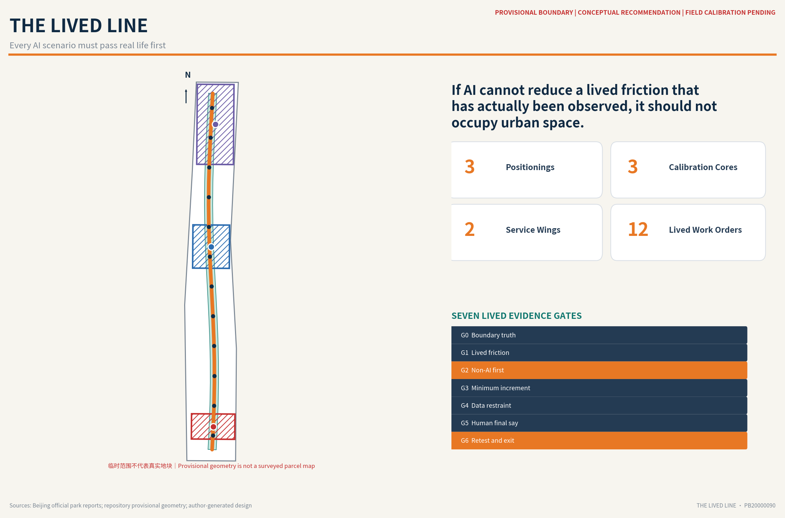
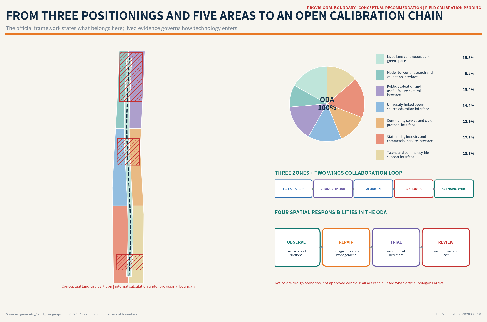
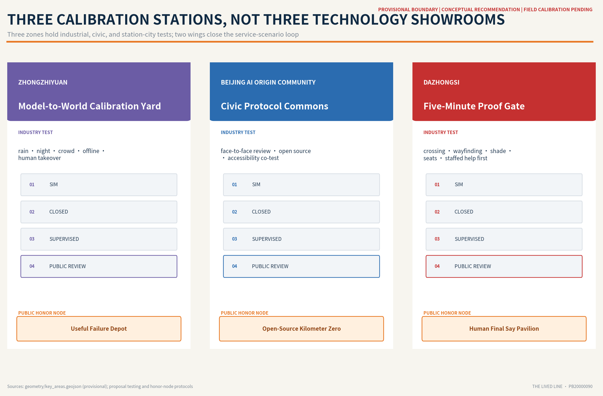
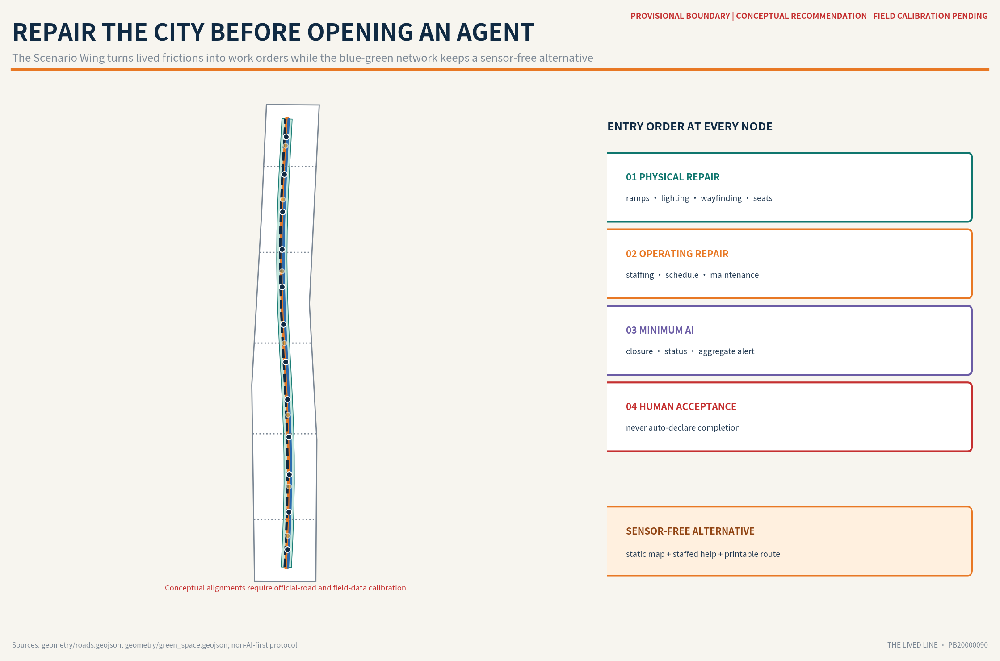
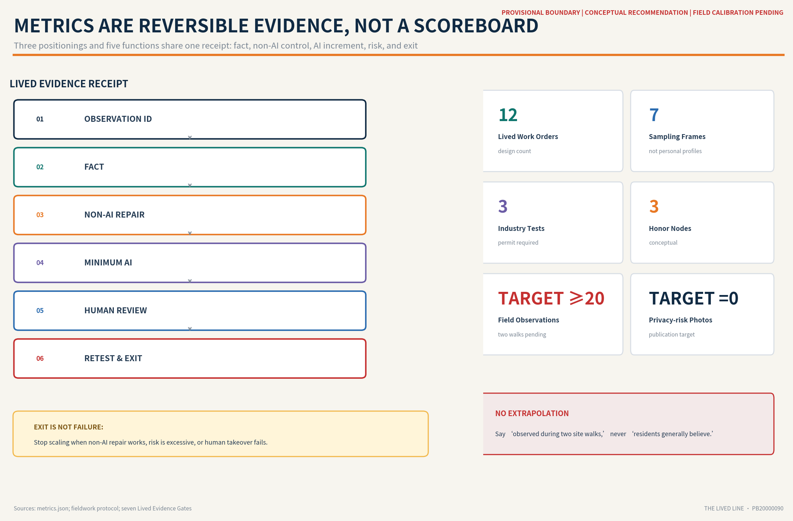

# THE LIVED LINE

> **Every AI scenario must pass real life first.** If AI cannot reduce a lived friction that has actually been observed, it should not occupy urban space.

## Design Basis and Source List

### 0. Not a larger Agent, but a stricter city

This proposal does not answer the criticism that AI agents fail to understand real human life by claiming more model capability. It answers with an urban design that can be disproved, retested, and vetoed by the public. The Centennial Jing-Zhang AI Innovation Belt should not become a corridor for displaying technical capability. It should become **public calibration infrastructure** through which the city determines whether a technology deserves to enter everyday life.

The proposal consists of one Lived Line, three Calibration Stations, twelve Lived Work Orders, three public Honor Nodes, and one Open Results Ledger:

- **One Lived Line:** the approximately 9-kilometre Jing-Zhang Railway Heritage Park becomes an everyday urban transect. It records concrete goals, obstacles, workarounds, and repair outcomes without tracking individuals. [source:BJ-JZRHP-2026]
- **Three Calibration Stations:** Zhongzhiyuan tests the passage from model to reality; the Beijing AI Origin Community hosts public protocols and human veto; Dazhongsi retests the last five minutes between station and daily destination.
- **Twelve Lived Work Orders:** each scenario states its non-AI first repair, minimum AI increment, beneficiary, potential harm, human review, and stop condition.
- **Three public Honor Nodes:** they honor open-source contributors, useful failures, and ordinary users who exercise a veto—not a company or a model.
- **One Open Results Ledger:** it publishes only aggregated, de-identified, and explainable trial receipts. Failures and stopped trials remain visible.

The official Three Positionings state what the belt carries; the Lived Line states how those contents earn permission to enter the city. The **Centennial Jing-Zhang Cultural Belt** preserves engineering memory and maintenance culture. The **Urban AI Life Experience Belt** allows ordinary people to perceive and veto public AI. The **AI Convergence and Innovation Belt** links research, incubation, capital, scenarios, and scaling. All three pass through the same seven Lived Evidence Gates instead of becoming three unrelated landscape strips. [source:AGENT-TASKBOOK]

The brand has three naming levels. The master brand is **THE LIVED LINE / 京张生活实测线**. Its spatial family consists of Calibration Station, Lived Work Order, Evidence Mile, and Open Results Ledger. Its annual event brand is **Jing-Zhang Calibration Week**. The logo direction combines two parallel railway lines with an open verification notch: the rails represent century-long engineering continuity, while the gap allows challenge, human takeover, and correction. The palette fixes Jing-Zhang rail red for memory and warning, evidence teal for passing and maintenance, night navy for the civic base, and trial amber for provisional or pending content. Only open-licensed type and original geometry are used—never corporate marks, portraits, or restricted media.

The Five Functions become visible civic interfaces. The Full-Stack Independent AI Innovation System enters edge-condition testing at Zhongzhiyuan. The World-Class AI Innovation Ecosystem enters open-source and protocol spaces in the AI Origin Community. The New AI+ Scenario Enablement Paradigm enters Xiaoyue River work orders. The Intelligent and Vibrant AI City enters Dazhongsi and corridor life services. Global Discourse on AI Governance enters the Open Results Ledger, Useful Failure Depot, and annual reauthorization. Brand, space, industry, and governance therefore use one language rather than relying on a slogan.

This is a conceptual urban-design recommendation, not an official approval, statutory plan, implementation commitment, or authorization to collect data. [standard:PROJECT-OFFICIAL-ANNOUNCEMENT] [standard:PROJECT-AGENT-OPEN-CALL-TASKBOOK]

### 1. Evidence boundaries and existing-conditions diagnosis

The announcement and official public information establish that the Jing-Zhang Railway Heritage Park extends northward from Beijing North Railway Station to the vicinity of the North Fifth Ring Road for approximately 9 kilometres. Bringing about 6 kilometres of high-speed rail underground released surface space, yet the corridor still contains breaks caused by rail lines, roads, ownership, and multi-party coordination. Around twenty universities and research institutes are located along the corridor, and park construction must proceed by segment and phase while responding to local needs. [source:BJ-JZRHP-2021] Official reporting in 2026 adds an essential everyday rhythm: about 70 communities and approximately 450,000 residents are connected to the park; residents walk in the morning, students cycle at midday, and parents and children use it in the evening. On the section between Xueyuan South Road and Zhichun Road, children climb, older people sing and dance, and runners move through the same public realm. [source:BJ-JZRHP-2026]

The primary conflict is therefore not a lack of AI. It is that **one long and narrow public corridor already carries commuting, exercise, play, social life, service work, industrial display, and heritage interpretation at the same time**. AI can only be an increment if it does not damage this existing life.

The repository currently provides only rough `provisional_constraint` geometry. The Overall Design Area and three Key-Area Detailed Design Areas in this submission are all marked `official_boundary=false`. They are used only for concept generation, deterministic checks, and later replacement. They must not be interpreted as an Official Planning Boundary, road redline, parcel boundary, or precise location. [source:BOUNDARY-SOURCE] [data:geometry/site_boundary.geojson#SITE-001] [data:geometry/key_areas.geojson#PROV-KEY-001] Public issue review has also identified a substantial positional discrepancy between the provisional Dazhongsi polygon and the actual station. This proposal therefore separates **field research at real public locations** from **provisional geometry used for package validation** and never overlays the two as a falsely precise planning drawing. [assumption:A-BOUNDARY-001]

#### 1.1 Minimum baseline from two site walks

Two site walks will be completed before finalization: one in daytime and one after sunset. The daytime walk moves from publicly accessible space around Dazhongsi Station toward the active everyday-life section between Xueyuan South Road and Zhichun Road. The night walk observes publicly open sections from the Dayuncun football field toward Qinghua East Road; if a section is closed or under construction, the route shifts to a continuously open section. No fenced or construction area is entered.

Each record distinguishes four evidence types: direct observation, a consented interview statement, public information, and AI/researcher inference. The minimum target is twenty specific observations, including at least eight at night; five anonymous consented interviews; and twenty-two original photographs containing no identifiable faces or licence plates. This evidence can only support the statement “observed during two site walks.” It cannot be extrapolated to 450,000 corridor residents. [source:FIELDWORK-PROTOCOL] [depth:existing_conditions_diagnosis]

#### 1.2 The seven Lived Evidence Gates

| Gate | Required question | If the gate fails |
| --- | --- | --- |
| G0 Boundary truth | Is the boundary official, provisional, or only described in text? | Reduce the output to a conceptual relationship diagram and make no pseudo-precise control claim. |
| G1 Lived friction | Who is trying to do what, at what moment, and which step blocks them? | Keep it as a hypothesis awaiting observation; do not add it to the scenario list. |
| G2 Non-AI first | Can signage, seating, lighting, management, or maintenance solve it? | Create a non-AI work order and do not deploy an Agent. |
| G3 Minimum increment | What is the single additional step AI provides? | Remove surplus sensing, recommendation, and automated decision-making. |
| G4 Data restraint | Can aggregated, anonymous, edge-processed, or human-generated data work? | Use a low-tech alternative or do not proceed. |
| G5 Human final say | Who can review, veto, take over, and respond to complaints? | Do not enter a public-service trial. |
| G6 Retest and exit | What are the baseline, threshold, stop condition, and offline alternative? | Do not occupy permanent space and do not scale. |

Every problem that passes G1 produces a Lived Evidence Receipt: `observation ID → fact → non-AI repair → AI increment → risk → human review → retest metric → exit outcome`. This receipt is the minimum contract between an Agent and the city.

## Three-Level Scope Framework

The Coordinated Research Area, Overall Design Area, and Key-Area Detailed Design Areas are not three sets of repetitive drawings. They hold three different validation responsibilities. [depth:three_level_scope_framework]

| Scope | Responsibility in this proposal | Auditable evidence |
| --- | --- | --- |
| Coordinated Research Area (CRA) | Reframe the innovation ecosystem from a count of companies to a chain of actors providing models, data, computing, scenarios, review, and public accountability. | Six global cases, a role chain, and an annual public calibration mechanism. |
| Overall Design Area (ODA) | Establish the Lived Line, walking and cycling plus blue-green framework, a sensor-free alternative route, and reversible trial nodes. | Land-use, road, green-space, public-space, and phasing GeoJSON plus metrics. |
| Key-Area Detailed Design Area (KDA) | Give each key area a different calibration function and validate the system through three industry tests. | Three detailed designs, operators, risks, and stop conditions. |

Within the 43.6-square-kilometre Coordinated Research Area, Three Zones and Two Wings operate as a two-way loop rather than five isolated parks. The northern **Zhongzhiyuan AI Independent Innovation Accelerator** sends foundation models, computing, data, and embodied systems into edge-condition calibration. The central **Beijing AI Origin Community** combines university research, open-source contribution, incubation, and civic protocol. The southern **Dazhongsi AI Industry Cluster** tests the five-minute landing of AI-native consumption, business, and public services. The western **Zhongguancun Technology Services Wing** provides intellectual property, standards, legal, talent, capital, and international professional services. The eastern **Xiaoyue River Scenario Enablement Wing** converts health, education, commerce, community, and park problems into testable work orders. Technology resourced by the west must face real-scenario validation in the east; problems found in the east can assemble teams across the three zones and western wing. [source:AGENT-TASKBOOK]

The spatial structure is not the familiar slogan of “three cores and one belt.” It is **an open calibration chain**: Observation Segments discover lived frictions; Non-AI Segments test low-tech repairs; Sandbox Segments host controlled trials; Review Segments disclose results and vetoes. Every segment can begin with signage, furniture, human service, and operating rules. Permanent buildings and sensing infrastructure must wait for Official Boundaries, Regulatory Detailed Planning, ownership, municipal conditions, and trial results. [data:geometry/land_use.geojson#LU-001] [data:geometry/roads.geojson#ROAD-001]

## Coordinated Research Area: Industry and Future City Research

Coordinated research does not end with a catalogue of firms and models. It identifies an accountable AI-city value chain: universities and laboratories provide research and evaluation methods; companies provide models, computing, and devices; subdistricts, campuses, and operators provide real tasks and maintenance capacity; residents and front-line workers contribute lived knowledge and veto power; and planning, mobility, accessibility, legal, and data specialists provide independent review. Its spatial form is a distributed network of test, disclosure, human-takeover, and review interfaces along the Jing-Zhang corridor rather than a closed industrial park. Industrial value is measured by the observed problem resolved, friction reduced, and responsibility taken when harm occurs—not deployment or invocation count. [depth:industry_ecosystem_mapping]

The complete innovation chain has eight hand-off stages: `basic research → open source and standards → computing and governed data → simulation and evaluation → incubation and pilot → first scenario and first user → capital and professional services → scaling and international collaboration`. Each transfer generates an auditable receipt covering intellectual property, data licence, test limits, funding type, beneficiary, maintenance duty, and rollback. Zhongzhiyuan focuses on hard-technology validation across the first to fifth stages; the AI Origin Community hosts open source, incubation, and civic protocols; the Technology Services Wing supports intellectual property, capital, and internationalization; the Scenario Enablement Wing and Dazhongsi host first scenarios and public retesting. Funding, recruitment, and procurement remain proposed mechanisms, never government commitments or settled arrangements.

Regional synergy uses a capability-exchange register rather than generic linkage. Beiwei Community may exchange developer-community practices; Future Science City and Huairou Science City may exchange basic-research and scientific-facility validation questions; Beijing E-Town may exchange manufacturing and embodied-AI engineering experience; and Beijing-Tianjin-Hebei nodes may exchange cross-regional scenarios and supply-chain problems. An item enters the annual register only when responsible parties, access conditions, and authorization are explicit. No partnership or resource commitment is claimed.

### Global cases: learn the mechanism, not the shell

| Case | Mechanism worth learning | What this proposal refuses to copy |
| --- | --- | --- |
| Helsinki AI Register | Disclose system purpose, data, logic, and feedback channels. | Treating registration alone as proof of real spatial benefit. |
| Amsterdam Algorithm Register | Build city-scale visibility and a point of responsibility for algorithms. | Treating “published” as equivalent to “legitimate.” |
| Singapore Punggol Digital District ODP | Test robots first in digital and real environments through a district digital twin. | Extending sensor density by default across all public space. |
| Seoul S-Map and digital-twin demonstrations | Simulate defined tasks such as disaster response, roads, and traffic before deciding. | Letting a high-resolution model replace low-resolution lived experience. |
| Barcelona Decidim | Make participation open-source and traceable while linking online and face-to-face processes. | Reducing participation to clicks or votes. |
| Toronto Quayside | Resolve scope, data governance, and public review before expanding innovation. | Allowing a technology vendor to define the city before public rules are mature. |

Together these cases show that transparent registers, digital twins, and open-source participation matter, but none replaces field evidence that a technology improves a concrete act of everyday life. Helsinki and Amsterdam support public registers and responsibility interfaces. [source:CASE-HELSINKI] [source:CASE-AMSTERDAM] Singapore and Seoul support simulation before entry into public space, supplemented here by retesting with ordinary users. [source:CASE-PUNGGOL] [source:CASE-SEOUL] Barcelona and Toronto show why open-source participation, scope limits, and public scrutiny must become implementation rules. [source:CASE-DECIDIM] [source:CASE-QUAYSIDE]

## Overall Design Area: Urban Renewal and Regulatory-Plan-Level Urban Design

Within the provisional boundary, the Overall Design Area uses topological consistency as its technical base and the public-life logic of the real Jing-Zhang corridor as its design evidence. It is not a continuous smart-device belt. It is a calibration chain that can be authorized segment by segment: observe, repair with low technology, run a controlled trial, and disclose the review. A primary greenway, cycle route, and sensor-free pedestrian alternative form the longitudinal framework. Transverse links connect rail stations, communities, universities, and companies. Public-service interfaces, research-validation edges, and community-life support zones cover the temporary geometry without pretending to be statutory land use. [data:geometry/land_use.geojson#LU-001] [data:geometry/roads.geojson#ROAD-001]

Urban renewal starts with existing public space and maintenance: repair wayfinding, ramps, shade, seating, lighting, parking, and staffed service before deciding whether dynamic information adds indispensable value. Information required for regulatory-plan-level decisions—Floor Area Ratio, height, coverage, setbacks, road redlines, ownership, utilities, flood control, and heritage—remains insufficient, so those fields are unknown. Once official boundaries arrive, all geometry must be recalculated in a common coordinate system, and every permanent building, sensing installation, or embodied-AI test must undergo separate planning, engineering, safety, and public review. [assumption:A-CONTROLS-001] [depth:regulatory_plan_controls]

## Detailed Design of Key Areas

### Three Calibration Stations and three public Honor Nodes

The three key-area boundaries remain provisional. The following functions and spatial relationships are conceptual recommendations for professional development, not formal parcel arrangements. [data:geometry/key_areas.geojson#PROV-KEY-001] [data:geometry/key_areas.geojson#PROV-KEY-002] [data:geometry/key_areas.geojson#PROV-KEY-003]

All three use the same detailed-design framework to state spatial components, operators, lived evidence, human takeover, risks, and stop conditions. [depth:three_key_area_detailed_design]

#### 4.1 Zhongzhiyuan: Model-to-World Calibration Yard

Zhongzhiyuan does not centre on a larger exhibition hall. Six edge conditions—rain, night, crowding, accessibility, loss of connection, and human takeover—form its industrial validation yard. Reconfigurable test courts, a low-speed co-movement loop, equipment-maintenance interfaces, and a public observation gallery are separated by default from ordinary recreational green space. Only products that pass simulation, closed-field testing, and supervised public trials receive more time or area. [standard:GENERATIVE-AI-INTERIM-MEASURES]

Honor Node 1 is the **Useful Failure Depot**. It publicly displays trials that were stopped, rolled back, or vetoed by residents, together with the reason and repair responsibility. Railway maintenance logs, signals, and mileage traditions are translated into an AI-era culture of correction.

#### 4.2 Beijing AI Origin Community: Civic Protocol Commons

The AI Origin Community places universities, open-source developers, residents, companies, and professionals at the same Scenario Permit Table. Ground-floor spaces prioritize anonymous problem submission, co-testing for accessibility, data-use notices, human-review duty desks, and open-source releases. Digital tools extend face-to-face participation rather than replace it. [source:CASE-DECIDIM]

Honor Node 2 is **Open-Source Kilometer Zero**. An updatable contribution ledger records code, data cleaning, accessibility testing, maintenance, and community coordination. It does not expose private information, unauthorized portraits, or rank individuals by influence.

#### 4.3 Dazhongsi: Five-Minute Proof Gate

Dazhongsi takes on the most demanding urban issue: the last five minutes between metro exits, four road quadrants, communities, the park, and workplaces. The order is fixed: crossings, wayfinding, shade, seating, bicycle parking, and human service points first. AI handles only dynamic information such as temporary closure, facility status, multilingual questions, and accessible-route updates. Every navigation service also provides a static map, staffed enquiry, and printable route. [depth:traffic_rail_slow_parking]

Honor Node 3 is the **Human Final Say Pavilion**. Every public AI scenario must display who is responsible, what data it uses, how to appeal, and when it will close. Public vetoes and human takeovers are made as visible as technical successes.

## AI Innovation Ecosystem, Personas, and AI+ Scenarios

The innovation ecosystem collaborates through the Lived Evidence Receipt. A scenario sponsor states the problem and non-AI baseline; the technical team declares only the minimum AI increment; the site operator declares maintenance, emergency, and human-takeover capacity; specialists review accessibility, safety, data, and spatial impacts; users participate in retesting and retain channels to appeal or veto; and the outcome enters the Open Results Ledger. The talent profile is therefore not an abstract class of “high-level talent.” It is a cross-disciplinary team of researchers, product and algorithm engineers, urban designers, accessibility testers, community coordinators, front-line maintainers, and data and legal reviewers. Every role carries an auditable responsibility, and technical credentials never substitute for lived knowledge. [depth:innovation_talent_profile]

### Street-level locations for AI+ Health, Education, and Commerce

| Scenario | Suitable space and users | Minimum input and output | Explicit exclusion |
| --- | --- | --- | --- |
| AI+ Health: primary-care service navigation | Community–park interfaces in the Xiaoyue River Scenario Enablement Wing; older people, carers, and visitors | Input official hours, accessible entrances, and human-confirmed status; output service navigation with confidence, telephone, and offline alternative | No diagnosis, high-risk triage, personal medical record, or replacement of emergency care |
| AI+ Education: open learning and research-facility explanation | Public university interfaces and the AI Origin Community; students, teachers, developers, and residents | Input cleared courses, public events, and access rules; output layered explanations, booking drafts, and accessible participation | No student profiling, automated grading, admissions judgment, or bypass of campus permissions |
| AI+ Commerce: small-business scenario partnership and AI-native service | Commercial–office–park interfaces in Dazhongsi; small firms, start-ups, customers, and service workers | Input voluntarily published needs, responsibilities, and trial periods; output a matching draft, short-term trial receipt, and human contract channel | No automated credit, discriminatory personalized pricing, exclusive recommendation, or labour-performance scoring |

All three first provide static information, a unified desk, or human coordination as the baseline. An Agent handles only the minimum increment when frequent change, cross-system explanation, or duplicate work-order clustering cannot be resolved with low technology. Qualified health staff, educators or site managers, and contracting parties retain final say over health safety, education rights, and commercial agreements.

### 5. Seven lived-user frames, not profiling labels

| Sampling frame | Real acts to observe | Prohibited inference |
| --- | --- | --- |
| Older walker | Finding seats, navigating, crossing, and joining activities. | Do not assume an older person cannot use smart technology. |
| Parent and child | Playing, caregiving, finding a toilet, and seeking help after separation. | Do not collect a child's face or construct a behavioural profile. |
| Wheelchair, mobility-aid, or stroller user | Ramps, continuous surfaces, entrances, and alternative routes. | Do not let an able-bodied observer decide accessibility for them. |
| Person walking alone at night | Choosing a route, avoiding conflict, stopping, and seeking help. | Do not reduce perceived safety to an illuminance number. |
| Cyclist and delivery or service worker | Passing, parking, resting, charging, collecting, and delivering. | Do not use observations for labour performance or credit scoring. |
| Student, developer, and start-up team | Commuting, collaborating, testing, and releasing work. | Do not prioritize industrial activity over public passage. |
| Small business, cleaner, and facility maintainer | Trading, restocking, reporting faults, and closing work orders. | Do not equate automated dispatch with completed maintenance. |

A formal scenario requires at least one concrete observation. Accessibility, children, or night-safety scenarios should include affected users in testing. [standard:BARRIER-FREE-ENVIRONMENT-LAW]

### 6. Twelve Lived Work Orders: repair the city before opening an Agent

| # | Lived friction, pending field verification | Non-AI first repair | Minimum AI increment | Retest and exit |
| --- | --- | --- | --- | --- |
| 01 | The path from metro exit to park entrance is hard to find. | Continuous wayfinding, ground marks, and staffed enquiry. | Update only temporary closures and accessible detours. | Close dynamic recommendations if misdirection does not fall. |
| 02 | Abrupt light changes and blind corners discourage stopping at night. | Repair lighting, trim obstructions, add staff and help signs. | Aggregate repair and closure information; no facial recognition. | A safety incident or privacy complaint triggers suspension. |
| 03 | Walking, cycling, and play conflict. | Separate space, slow movement, manage time, and post notices. | Notify on-site staff of aggregate conflict periods. | Return to physical separation if conflict does not fall. |
| 04 | Shade, drinking water, and rest are scarce in heat. | Trees, canopies, seats, and water points. | Publish facility status and lower-heat routes. | Collect no personal health data. |
| 05 | Toilet and drinking-point availability is uncertain. | Clear location signs and maintenance shifts. | Publish only open or fault status. | Take the data offline when it exceeds the freshness threshold. |
| 06 | Wheelchairs, mobility aids, and strollers encounter broken links. | Repair ramps, surfaces, handrails, and alternative entrances. | Crowd-verify routes, then publish after human review. | Do not launch without review by affected users. |
| 07 | Delivery workers lack short-stay and support space. | Legal stopping, rest, water, and charging points. | Show anonymous availability; no dispatch or performance scoring. | Reduce or remove the space if it blocks public passage. |
| 08 | Family help and meeting points after separation are unclear. | Identifiable meeting points, staff, and public address. | Optional multilingual help with no child recognition. | Automatically downgrade to static guidance without staff. |
| 09 | Quiet rest and group activities disturb one another. | Activity zones, schedules, and sound management. | Publish aggregate occupancy status. | Do not infer emotion or identity through cameras. |
| 10 | Small businesses and trial teams face high coordination costs. | One service window, short contracts, and clear responsibility. | Draft matches only; a person reviews every contract. | Stop automated credit, pricing, or exclusive recommendation. |
| 11 | Large events create queues and crowding. | Capacity planning, timed entry, and on-site staff. | Provide aggregate alerts to staff only. | Do not automatically deny a person access. |
| 12 | People cannot tell whether a reported fault was fixed. | A work-order ID, responsible person, and public completion criteria. | Cluster duplicates and flag overdue work. | Never mark complete before human acceptance. |

The work orders cover transport, public space, accessibility, children, night, service work, commercial services, and maintenance. They are not established resident needs. The final proposal will replace “pending” with site-walk IDs; otherwise each remains a hypothesis awaiting validation. [data:geometry/public_space.geojson#PUBLIC-001] [data:geometry/green_space.geojson#GREEN-001]

### 7. Three Testing and Validation Scenarios

#### TVS-01 Accessible Last-Mile Agent | Dazhongsi

Inputs are officially published facilities, consented route feedback, and human inspections. The output is a route with confidence and an offline alternative. The trial first compares repaired static wayfinding, then introduces a small-sample edge-navigation service. Wheelchair or mobility-aid users and transport or operations staff conduct human review. A wrong route, stale data, or failed transfer to help that reaches the stop threshold immediately removes the dynamic function.

#### TVS-02 Public-Space Maintenance Agent | Beijing AI Origin Community

Inputs are anonymous fault reports, human inspections, and a facility inventory. The output only de-duplicates reports, suggests dispatch, and flags overdue work; it cannot declare completion. A random sample stays in the human-only process as a comparison. Metrics include time from discovery to human acceptance, repeated-report rate, and false closure rate. If automatic dispatch increases front-line workload or false closure, the system returns to a conventional work-order process.

#### TVS-03 Embodied-AI Co-Movement Calibration | Zhongzhiyuan

Rain, night, wheelchair use, children, pets, connection loss, and emergency stops are tested first in a digital twin and closed field, then in a separated, supervised, low-speed loop. Ordinary park paths always retain a robot-free alternative. Boundary crossing, unexplained stopping, privacy collection, or failed human takeover triggers suspension. [source:CASE-PUNGGOL] [source:CASE-SEOUL]

All three tests require a responsible operator, insurance, data authorization, an emergency plan, and professional review. This proposal is not a testing permit.

### Public-space kit and cultural interpretation route

Public space is not filled with screens and robots. It uses six replaceable components: an **Evidence Mile Marker** showing observation ID and boundary confidence; a **Work-Order Bench** combining rest with staffed fault reporting; a **Sensor-Free Route Sign** preserving a static alternative; a **Scenario Permit Table** for face-to-face review; a **Pop-up Test Bay** containing equipment on manageable hard surfaces; and an **Open Results Board** showing passes, failures, complaints, and withdrawals together. Components start as temporary, low-cost trials and can become permanent only after accessibility, maintenance, and heritage review.

A five-stop cultural route, “from railway trust to trustworthy AI,” turns three cultures into a causal sequence: `railway mileage and signals → daily maintenance → Zhongguancun problem-driven innovation → open-source collaboration → human final say`. The Developer Walk is a working route along real work orders rather than a celebrity wall. Each stop provides Chinese, English, static graphics, and access to human interpretation. The master logo identifies the belt; the cultural wayfinding language explains railway and Zhongguancun history. They are distinct systems, not one trademark.

## Land Use, Building Scale, and Retain-Renovate-Demolish Strategy

Land use follows a conceptual structure of a continuous park framework, public-service interfaces, research and industrial validation edges, and community-life support. The partition completely covers the provisional boundary. All ratios are scenario calculations under provisional geometry, not a statutory Land-Use Plan. [standard:MNR-LAND-USE-CLASSIFICATION-GUIDE] [depth:land_use_layout] [metric:site_area_sqm]

Buildings follow “retain first, test light renovation first, demolish last.” Without an existing-building survey, structural safety assessment, ownership, heritage information, and approved Regulatory Detailed Planning, the proposal makes no building-specific Demolish–Renovate–Retain decision and commits to no Floor Area Ratio, height, coverage, or setback. Building-footprint GeoJSON shows only conceptual trial facilities and renewal interfaces; formal development requires a building-by-building review. [data:geometry/buildings.geojson#BLDG-001] [metric:building_footprint_area_sqm] [depth:retain_renovate_demolish]

The nine conceptual building footprints currently express relationships among small civic-protocol rooms, maintenance interfaces, staffed service points, and reconfigurable testing facilities; they are not additional development rights. The next stage creates a building-by-building ledger for retention, repair, adaptive reuse, limited addition, and conditional removal, recording age, ownership, structure, utilization, heritage value, carbon impact, and displacement. Demolition is considered only when structural or public-safety evidence is sufficient and an alternative has passed stakeholder review. Area calculations check package consistency and cannot justify investment or development intensity. [assumption:A-CONTROLS-001] [depth:building_scale]

## Transport, Rail, Municipal Infrastructure, and Public Services

Mobility builds on the officially reported continuous system of three paths—for walking, running, and cycling—plus green space. It adds three transverse interfaces: station to park, community to park, and university or company to park. Fixed wayfinding, continuous accessibility, and human service come first; dynamic navigation is supplementary. [source:BJ-JZRHP-2024] [data:geometry/roads.geojson#ROAD-001]

Rail interchange is observed at real, publicly accessible locations such as Dazhongsi, but it is never falsely overlaid with the misplaced provisional key-area polygon. Development requires station exits, bus stops, cycle parking, junction control, fire egress, and road-redline data to audit the five-minute walking chain segment by segment. Cross-road, cross-rail, and construction breaks are engineering or operational problems before they become navigation problems. Public services retain digital and non-digital channels: static maps, staffed enquiry, printable routes, telephone contact, and on-site help cannot be replaced by an Agent. Toilets, water, rest, child meeting, delivery stopping, and maintenance space require real flow counts, operating capacity, and professional standards. [depth:public_service_facilities]

Municipal and digital infrastructure follows minimum deployment. Power, communication, drainage, fire safety, equipment access, and offline degradation first receive named responsibilities; sensing or edge devices activate only after a non-AI baseline proves insufficient. Every device must state its purpose, owner, data category, retention period, appeal route, and removal date. The public realm is never treated as a default collection zone. Without utility routes and capacity data, device locations and engineering quantities remain unknown. [assumption:A-OPERATIONS-001] [depth:municipal_new_infrastructure]

## Blue-Green Network, Public Space, and Urban Character

The blue-green system does not turn the park into an equipment corridor. New facilities first use existing hard-surface nodes, entrances, and maintenance edges. Continuous quiet green segments retain routes without sensing, advertising, or robots. Stormwater, flood control, river boundaries, tree protection, and ecological impacts require dedicated professional development after formal engineering information becomes available. [data:geometry/green_space.geojson#GREEN-001] [metric:green_ratio] [depth:blue_green_public_space]

New Infrastructure follows “off by default, enabled by need, edge first, delete at expiry.” Each sensing device must display its purpose, responsible party, retention period, and appeal channel on site. Every public service retains a non-smart channel. If a public Generative AI service enters the site, it must operate with lawful data sources, personal-information protection, complaint channels, and Human Review. [standard:GENERATIVE-AI-INTERIM-MEASURES] [depth:municipal_new_infrastructure]

Urban character translates the railway culture of mileage, signals, inspection, and dispatch into a language that is legible, maintainable, and correctable rather than copying locomotive motifs. Observation points receive mileage-like IDs; work-order nodes display repair status; Honor Nodes disclose success, failure, and public veto. Materials should be durable, replaceable, low-glare, and readable for accessibility. Night lighting, sound, activity capacity, and planting communities require the two planned walks, seasonal survey, and specialist development. Current figures establish only the continuous green framework and public interfaces. [depth:urban_character]

## Renewal Projects, Implementation Policy, and Phasing

| Project | First action | Condition for AI entry | Main dependency |
| --- | --- | --- | --- |
| P01 Two lived-baseline walks | Observation, anonymous interviews, and original-photo archive. | AI does not generate the need. | Public access and research ethics. |
| P02 Dazhongsi wayfinding and accessibility order | Static wayfinding and a broken-link inventory. | A dynamic-information gap remains after the static repair. | Station, road, and accessibility review. |
| P03 Night repair for light, obstruction, and help | Lighting, trimming, staffing, and meeting points. | Dynamic closure information proves useful. | Park operation and fire or public-safety review. |
| P04 Origin Scenario Permit Table | Face-to-face review and paper receipts. | Responsibility, data, and exit are public. | A site and long-term operator. |
| P05 Zhongzhiyuan supervised test loop | Closed-field tests and simulation. | Insurance, emergency response, and human takeover pass. | Official Boundary, operating permit, and professional evaluation. |
| P06 Open Results Ledger and AI Register | Publish scenario, responsibility, and outcome. | No personal data; correction and appeal are available. | Data governance and maintenance budget. |
| P07 Three Honor Nodes | Temporary exhibition and annual update. | Rights-cleared content and public review. | Cultural, landscape, and copyright review. |

Phasing follows “evidence first, light and reversible, expand only after passing.” [data:geometry/phasing.geojson#PHASE-001] [depth:phasing_implementation]

1. **0–100 days: baseline and non-AI repair.** Complete field evidence, boundary verification, accessibility co-testing, and twelve work orders. Build no permanent sensing system.
2. **0–12 months: small A/B trials.** Compare signage, furniture, management, and human service with three AI increments. Publish failures and exits.
3. **1–3 years: conditional urban renewal.** Add only scenarios that pass public review and retesting to renewal projects, coordinated with formal controls, ownership, and municipal design.
4. **After year 3: annual reauthorization.** Renew, reduce, or stop each scenario based on outcomes, complaints, maintenance cost, and public value.

## Metrics, Area Recalculation, and Compliance Matrix

### Prove improvement before discussing scale

Spatial metrics are recalculated from GeoJSON in EPSG:4548. Because the boundary is provisional, absolute areas and ratios only test internal consistency. [depth:metrics_recalculation]

| Metric group | Metric | Status and interpretation |
| --- | --- | --- |
| Space | Site area, Green Ratio, Public Space Ratio, Building Footprint. | Reproducible from submitted geometry but constrained by the Provisional Boundary. |
| Design completeness | Twelve work orders, seven sampling frames, three industry tests, and three Honor Nodes. | Countable within the proposal; they are not implemented outcomes. |
| Field evidence | At least 20 observations, at least 8 at night, at least 5 consented interviews, and zero privacy-risk photographs. | Collected before finalization and never extrapolated to the total population. |
| Trial performance | Task success, human-takeover success, false closure, fault-resolution time, and accessible-route success. | All remain unknown before a baseline exists. |
| Statutory control | Floor Area Ratio, Building Height, Building Coverage Ratio, setback, and road redline. | Remain unknown without official information. |

The pass condition for an AI scenario is not that “users like it” or “usage increased.” It must reduce a specific friction relative to the non-AI baseline without creating a greater privacy, inequality, labour, or maintenance burden. Full formulas and confidence levels are in `metrics.json`. [metric:public_space_ratio] [metric:key_area_count]

### Cultural narrative and long-term operation

The Jing-Zhang Railway matters not only because of “firsts” and speed. A railway is trusted because mileage, signals, inspection, dispatch, and daily maintenance hold it together. The Lived Line translates this engineering culture into an AI urban culture: **do not worship a model that never fails; respect a system whose failures can be found, corrected, and maintained.**

Conceptual long-term operation includes a quarterly Lived Friction Open Day for anonymous issues from residents and front-line workers; a semi-annual Useful Failure Night disclosing stopped trials; and an annual Jing-Zhang Calibration Week linking Open-Source Kilometer Zero, the Useful Failure Depot, and the Human Final Say Pavilion. Activities primarily use existing public space and light installations. Frequency, organizer, security, funding, and approval all require professional development and are not government commitments. [standard:PROJECT-AGENT-OPEN-CALL-TASKBOOK]

The annual system forms a four-season loop. Quarter one runs a Lived Friction Census and compiles public work orders. Quarter two hosts an Open-Source Field School where developers and users co-test. Quarter three runs Edge Conditions Night plus a Global Scenario Challenge under night, rain, offline, and accessibility conditions. Quarter four holds Jing-Zhang Calibration Week, publishing the ledger, useful failures, and the next annual reauthorization list. The conversion path for global participants is `visitor → work-order contributor → co-tester → maintainer or independent reviewer → research or enterprise partner → accountable scenario operator`; contribution is measured by verifiable records, not exposure.

Agents may lead early planning, task decomposition, source checking, and first-pass ranking, but every output must disclose sources, confidence, and a route for objection. Multiple agents can create explainable comparisons against one rubric; conflicts of interest and model disagreement remain visible. Professionals and responsible parties keep final authority over statutory planning, funding, contracts, construction, safety, data authorization, and final selection, while human teams develop and implement engineering. The Open Results Ledger connects agent-led front-end organization to human responsibility for legal and physical consequences.

## Risk, Copyright, and Compliance

- **Spatial precision:** the Overall Design Area and all three key areas use rough provisional geometry. All design layers, metrics, figures, and drawings must be recalculated when official polygons arrive.
- **Field evidence:** before site walks are complete, all twelve frictions remain hypotheses awaiting validation; none may be described as a common resident need.
- **Privacy and safety:** collect no names, phone numbers, or affiliations. Public photographs contain no identifiable faces, children's faces, or licence plates. Night fieldwork prioritizes personal safety.
- **Statutory and engineering conditions:** Regulatory Detailed Planning, ownership, road redlines, existing buildings, municipal systems, fire safety, flood control, heritage, and operating parties remain pending or unknown when unavailable. [data:geometry/constraints.geojson#CONSTRAINTS]
- **Public interest:** no facial recognition, individual movement tracking, labour-performance scoring, child profiling, or automated denial of public service. Human channels and sensor-free routes remain available. [standard:BARRIER-FREE-ENVIRONMENT-LAW]
- **Copyright:** figures are created by the submitter from original design, repository data, and rights-cleared field material. Sources and permissions are listed in `sources.json` and `report/copyright_statement.md`.
- **Bilingual and offline:** Chinese and English text, five figures, A3/A0 drawings, and HTML keep claims, numbers, evidence, and figure positions equivalent. HTML loads no remote scripts, fonts, tiles, forms, or tracking.

The proposal does not ask an Agent to decide for the city. It proposes a harder and more implementable institutional space: AI may propose, but must produce evidence in real life; it may be tested, but a person must be able to veto it; it may scale, but must first prove that it deserves to remain.

## References

The complete machine index is provided by `sources.json`, `metrics.json`, `compliance_matrix.json`, `standard_matrix.json`, and `design_depth_matrix.json`. Competition scope, deliverables, and statutory status follow the official announcement, taskbook, and repository site package. The park's length, construction rhythm, community relationships, and everyday activities use Beijing and Haidian government sources; news descriptions never substitute for surveying or Regulatory Detailed Planning. National references cover land-use classification, accessibility, and public Generative AI services, while precise applicability still requires professional review. [source:SITE-PACKAGE] [source:SOURCE-REGISTRY] [depth:risk_missing_data]

International comparison uses official government or project pages from Helsinki, Amsterdam, Singapore, Seoul, Barcelona, and Toronto. It extracts registration, simulation, open-source participation, scope control, and public-scrutiny mechanisms without copying spatial form. Field evidence comes from this project's anonymous protocol and pending records. The final version assigns every verified friction a unique observation ID, time band, and evidence type; incomplete or uncleared material remains pending. Geometry, areas, and ratios are recalculated from the repository's provisional boundary in one projection. Their precision limit and replacement trigger appear in the assumptions register, and they are not an official redline, implementation permission, or investment commitment. [assumption:A-BOUNDARY-001] [source:FIELDWORK-PROTOCOL]
