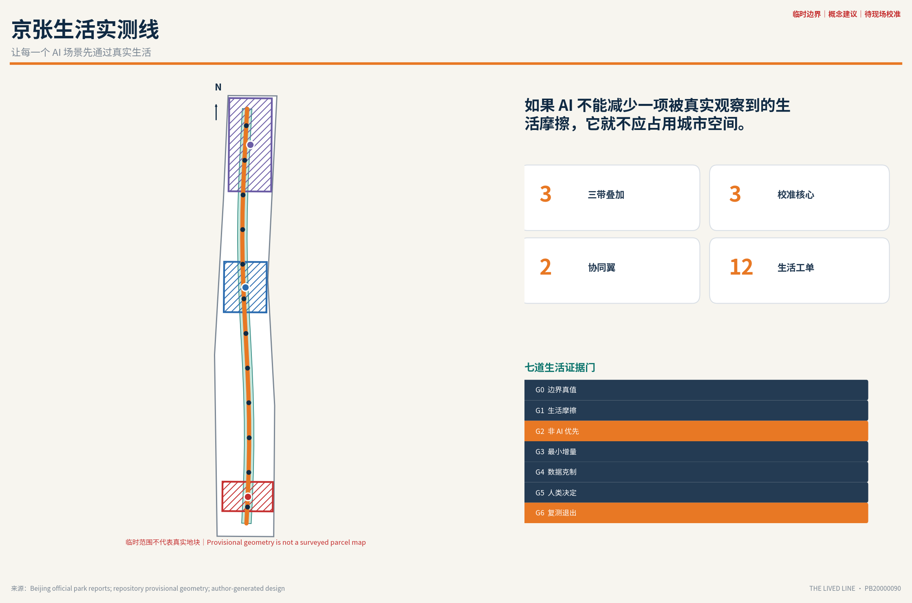
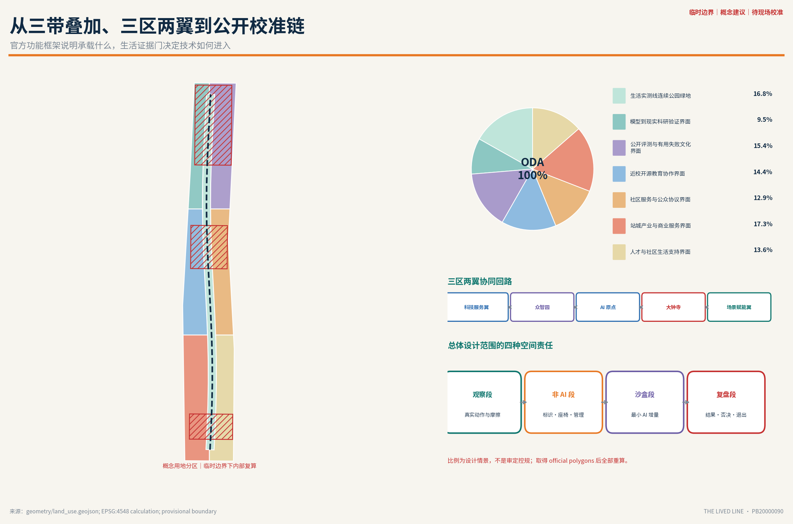
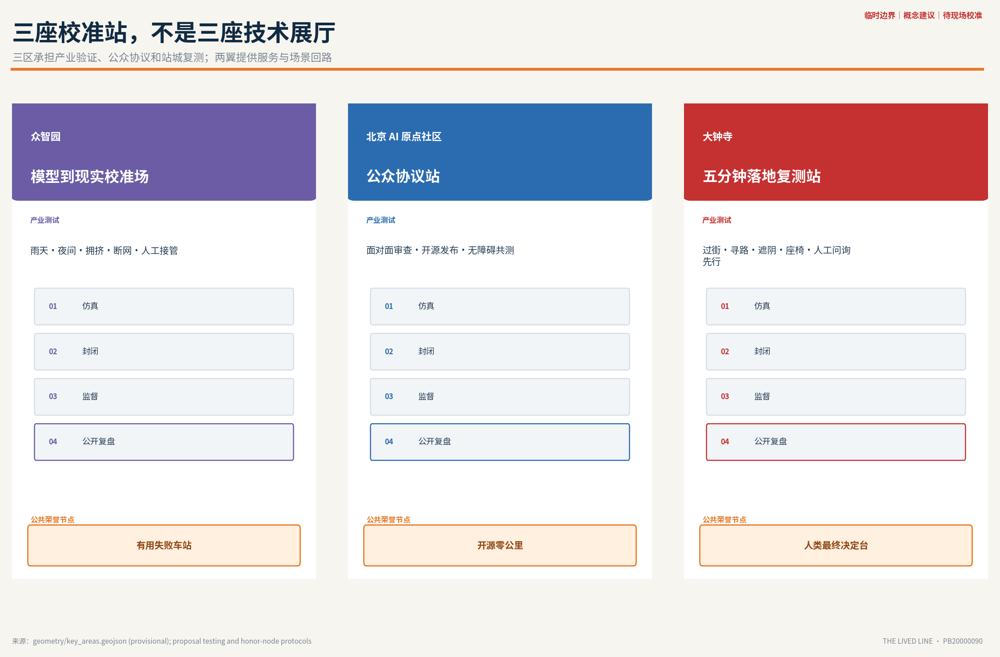
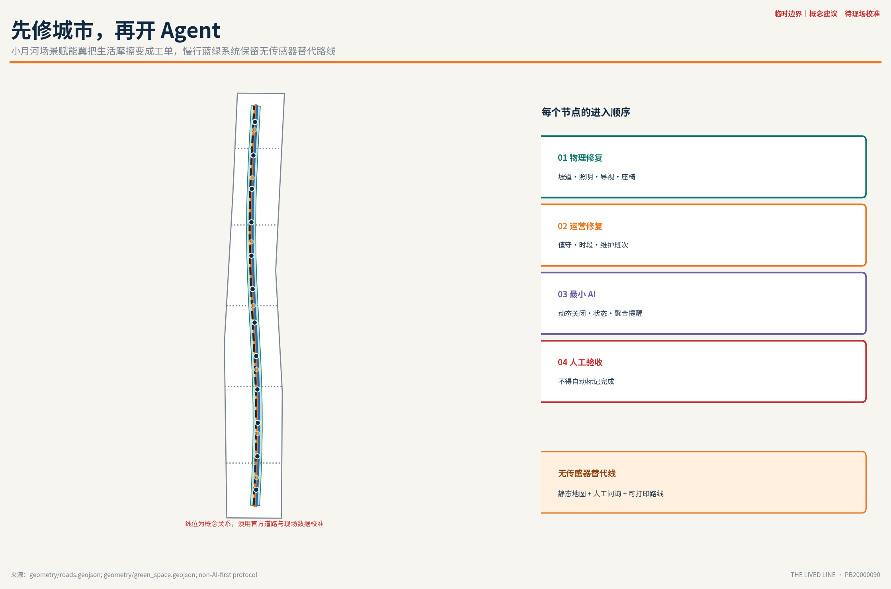
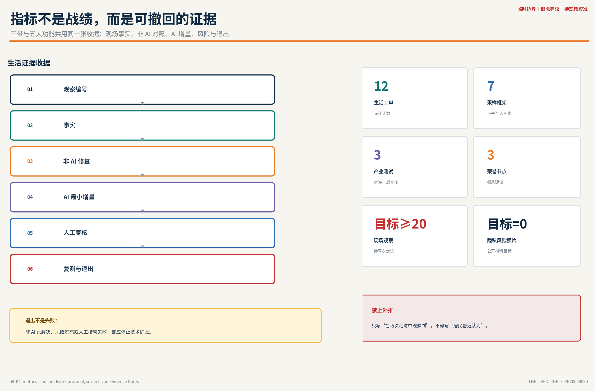

# 京张生活实测线 / THE LIVED LINE

> **让每一个 AI 场景先通过真实生活。** 如果 AI 不能减少一项被真实观察到的生活摩擦，它就不应占用城市空间。

## 设计依据与资料清单

### 0. 不是更大的 Agent，而是更严格的城市

对“AI agent 不够了解真实人类生活”的质疑，本方案不以更多模型能力辩解，而以一套可以被推翻、被复测、被公众否决的城市设计作答。百年京张 AI 创新带不应成为技术能力的陈列带，而应成为城市检验技术是否值得进入生活的**公共校准基础设施**。

方案提出“一条生活实测线、三座校准站、十二张生活工单、三处公共荣誉节点和一本公开结果账”：

- **一条生活实测线**：以约 9 公里的京张铁路遗址公园为日常样本剖面，不追踪个人，只记录具体的目标、阻碍、绕行与修复结果。[source:BJ-JZRHP-2026]
- **三座校准站**：众智园负责“模型到现实”的产业试验，北京 AI 原点社区负责“公众协议与人工否决”，大钟寺负责“站城最后一公里复测”。
- **十二张生活工单**：每个场景必须写清非 AI 首选修复、AI 最小增量、受益者、潜在伤害、人工复核和停止条件。
- **三处公共荣誉节点**：纪念开源贡献者、有价值的失败和普通使用者的否决，而不是纪念某一家公司或模型。
- **一本公开结果账**：只公布聚合、脱敏、可解释的试验收据；失败与停止也必须留痕。

官方“三带叠加”回答创新带承载什么，本方案的“生活实测线”回答这些内容如何获得进入城市的资格：**百年京张文化带**保存工程记忆与维护文化，**都市 AI 生活体验带**让普通人感知并否决公共 AI，**AI 融合创新带**连接研究、孵化、资本、场景与规模化；三者共用七道生活证据门，而不是各做一条互不相干的景观带。[source:AGENT-TASKBOOK]

品牌采用三级命名。总品牌为**京张生活实测线 / THE LIVED LINE**；空间系统为“校准站 / Calibration Station、生活工单 / Lived Work Order、证据里程 / Evidence Mile、公开结果账 / Open Results Ledger”；年度活动品牌为“京张校准周 / Jing-Zhang Calibration Week”。Logo 方向由两条平行铁路轨线与一枚开放的“校验缺口”组成：轨线代表百年工程连续性，缺口代表系统允许质疑、人工接管和修正。视觉色彩固定为京张朱红（记忆/警示）、证据青绿（通过/维护）、夜行深蓝（公共底板）和试验琥珀（临时/待复核）；只使用开放许可字体与原创几何，不调用企业 Logo、人物肖像或受限素材。

五大功能被翻译为五类可见的城市接口：AI 全栈自主创新体系进入众智园边缘条件测试；世界级 AI 创新生态进入 AI 原点社区的开源与协议空间；AI+ 场景赋能新范式进入小月河场景工单；智能化 AI 活力城市进入大钟寺和沿线生活服务；AI 治理全球话语权进入公开结果账、有用失败车站和年度再授权。这样，品牌、空间、产业与治理使用同一套语言，不靠一句口号维持一致性。

这是一项城市设计概念建议，不是官方批准、法定控规、建设承诺或数据采集授权。[standard:PROJECT-OFFICIAL-ANNOUNCEMENT] [standard:PROJECT-AGENT-OPEN-CALL-TASKBOOK]

### 1. 证据边界与现状诊断

公告与官方公开资料共同确认：京张铁路遗址公园自北京北站向北延伸至北五环附近，约 9 公里；约 6 公里高铁入地释放了地表空间，但廊道仍面对轨道、道路、权属和多主体协同造成的断点。沿线约有 20 所高校和科研院所，公园建设需分段、分期并回应周边真实需求。[source:BJ-JZRHP-2021] 2026 年官方报道又给出一个极具城市设计价值的日常节律：约 70 个社区、约 45 万居民与公园发生联系，早晨有居民散步，中午有学生骑行，傍晚有亲子活动；学院南路至知春路段已经出现儿童攀爬、老年人唱歌跳舞和跑步者并存的生活场景。[source:BJ-JZRHP-2026]

这说明场地的首要矛盾并非“缺少 AI”，而是**同一条窄长公共廊道同时承载通勤、运动、玩耍、社交、服务劳动、产业展示与遗产叙事**。AI 只有在不破坏这些已有生活的前提下，才可能成为增量。

当前仓库仅提供 `provisional_constraint` 粗略边界。提交中的总体设计范围与三处重点区均 `official_boundary=false`，仅用于概念生成、机器校验和后续替换，不得解释为官方红线、道路红线、地块边界或精确区位。[source:BOUNDARY-SOURCE] [data:geometry/site_boundary.geojson#SITE-001] [data:geometry/key_areas.geojson#PROV-KEY-001] 公开议题讨论还显示临时大钟寺范围与实际站点存在明显位置偏差，因此本方案把**真实公开地点的生活调研**与**用于过机的临时几何**明确分层，绝不把二者叠画成伪精确规划图。[assumption:A-BOUNDARY-001]

#### 1.1 两次实地调研的最小基线

正式定稿前执行两次走访：一次白天，一次日落后。白天从大钟寺站公开空间向学院南路—知春路生活活跃段移动；晚间在大运村足球场至清华东路公开开放段观察，遇关闭或施工则改走连续开放路段。只进入公开开放空间，不进入围挡或施工区。

每条记录必须区分四类证据：亲眼观察、经同意的受访者表达、公开资料、AI/研究者推断。最低目标为 20 条具体观察（其中晚间不少于 8 条）、5 份匿名同意访谈、22 张不含可识别人脸或车牌的原始照片。它们只能证明“两次走访中观察到什么”，不得外推 45 万沿线居民。[source:FIELDWORK-PROTOCOL] [depth:existing_conditions_diagnosis]

#### 1.2 七道“生活证据门”

| 门 | 必须回答的问题 | 不通过时怎么办 |
| --- | --- | --- |
| G0 边界真值 | 这是官方边界、临时边界还是仅有文字线索？ | 降级为概念关系图，不给伪精确控制结论 |
| G1 生活摩擦 | 谁在什么时刻想完成什么，被哪一步卡住？ | 保留为待观察假设，不进入场景清单 |
| G2 非 AI 优先 | 标识、座椅、照明、管理或维护能否解决？ | 建立非 AI 工单，不部署 Agent |
| G3 最小增量 | AI 只增加哪一小步价值？ | 删除多余感知、推荐和自动决策 |
| G4 数据克制 | 是否可用聚合、匿名、端侧或人工数据？ | 改用低技术方案或不做 |
| G5 人类最终决定 | 谁能复核、否决、接管和回应申诉？ | 不进入公共服务试验 |
| G6 可复测退出 | 基线、阈值、停止条件和线下替代是什么？ | 不占用永久空间，不扩大规模 |

每个通过 G1 的问题生成一张“生活证据收据”：`观察编号 → 事实 → 非 AI 修复 → AI 增量 → 风险 → 人工复核 → 复测指标 → 退出结果`。这张收据是 Agent 与城市之间的最小合同。

## 三层范围工作框架

统筹研究范围、总体设计范围和重点区域范围不是三套重复图纸，而是三个不同尺度的验证责任。[depth:three_level_scope_framework]

| 层级 | 本方案的责任 | 可交付证据 |
| --- | --- | --- |
| 统筹研究范围（CRA） | 将产业生态从“企业数量”转为“谁提供模型、数据、算力、场景、复核与公共问责” | 六个国际案例、角色链、年度公开校准机制 |
| 总体设计范围（ODA） | 形成生活实测线、慢行蓝绿骨架、无传感器替代路线和可逆试验节点 | 用地、道路、绿地、公共空间、分期 GeoJSON 与指标 |
| 重点区域范围（KDA） | 让三处片区承担不同校准职能，并用三个产业试验验证 | 三处详细设计、运营主体、风险与停止条件 |

43.6 平方公里统筹研究范围中的“三区两翼”被组织为一条双向协同回路，而不是五个孤立园区：北部**众智园 AI 自主创新加速区**把基础模型、算力、数据和具身系统送入边缘条件校准；中部**北京 AI 原点社区**把高校研究、开源贡献、孵化和公众协议汇合；南部**大钟寺 AI 产业集聚区**检验智能原生消费、商务和公共服务的五分钟落地。西侧**中关村科技服务翼**提供知识产权、标准、法律、人才、资本和国际化专业服务，东侧**小月河场景赋能翼**把医疗、教育、商业、社区与公园问题整理为可测试工单。任何从西翼获得资源的技术都必须到东翼接受真实场景验证，任何从东翼发现的问题也可反向召集三核与西翼形成解决团队。[source:AGENT-TASKBOOK]

总体空间结构不是常见的“三核一带”口号，而是**一条公开校准链**：发现生活摩擦的“观察段”、先做低技术修复的“非 AI 段”、开展受控试验的“沙盒段”、公开结果与否决的“复盘段”。所有段都可先以标识、家具、人工服务和运营规则启动，永久建筑与传感基础设施必须等待官方边界、控规、权属、市政和试验结果确认。[data:geometry/land_use.geojson#LU-001] [data:geometry/roads.geojson#ROAD-001]

## 统筹研究范围产业与未来城市研究

统筹研究不以罗列企业和模型为终点，而是识别一条可问责的 AI 城市产业链：高校与实验室提供研究和评测方法，企业提供模型、算力与设备，街道、园区和运营单位提供真实任务与维护能力，居民和一线劳动者提供使用经验与否决权，规划、交通、无障碍、法律和数据专业人员负责独立复核。空间载体不是封闭园区，而是沿京张廊道分布的测试、公开说明、人工接管和复盘节点。产业价值以“解决了什么经观察的问题、减少了多少摩擦、出现伤害时谁负责”衡量，而不是部署数量或调用次数。[depth:industry_ecosystem_mapping]

完整创新链分为八个可交接阶段：`基础研究 → 开源/标准 → 算力与合规数据 → 仿真及评测 → 孵化与小试 → 首场景/首用户 → 资本及专业服务 → 规模化与国际协作`。每次交接都生成一张可审计收据，写明知识产权、数据许可、测试边界、资金性质、受益者、维护责任和失败后的回退。众智园重点承接前三至五阶段的硬技术验证，AI 原点社区承接开源、孵化和公众协议，中关村科技服务翼承接知识产权、资本与出海服务，小月河场景赋能翼和大钟寺承接首场景与公共复测。资金支持、招商对象和采购均为建议机制，不写成政府承诺或既定安排。

区域协同采用“能力交换清单”而不是泛泛联动：北纬社区可作为开发者社区运营交流对象，未来科学城与怀柔科学城可交换基础研究和科学装置验证议题，经开区可交换制造与具身智能工程化经验，京津冀节点可交换跨区域场景和供应链问题。任何合作只有在责任主体、开放条件和授权明确后才进入年度清单；本方案不声称已建立合作关系或获得资源承诺。

### 全球案例：学习机制，不复制外壳

| 案例 | 可借鉴机制 | 本方案拒绝照搬的部分 |
| --- | --- | --- |
| 赫尔辛基 AI Register | 公开系统用途、数据、逻辑和反馈入口 | 只登记不验证真实空间效果 |
| 阿姆斯特丹 Algorithm Register | 以城市级清单建立算法可见性与责任入口 | 把“已公开”误当成“已正当” |
| 新加坡 Punggol Digital District ODP | 用数字孪生让机器人先在虚拟和真实环境测试 | 高密度传感默认扩张到所有公共空间 |
| 首尔 S-Map / 数字孪生实证 | 在灾害、道路、交通等明确任务中仿真后决策 | 用高精模型替代低精度现场体验 |
| 巴塞罗那 Decidim | 开源、可追溯，并连接线上与面对面参与 | 将居民参与简化为点击或投票 |
| 多伦多 Quayside | 在创新扩区前处理范围、数据治理与公共审查 | 在规则未成熟前由技术供应方定义城市 |

这些案例共同指向一个结论：透明登记、数字孪生和开源参与都很重要，但都不能代替“这个技术是否真的让某个具体生活动作变得更好”的现场证据。赫尔辛基与阿姆斯特丹支持公开登记和责任入口。[source:CASE-HELSINKI] [source:CASE-AMSTERDAM] 新加坡与首尔支持“先仿真、后进入真实空间”，但必须补上普通使用者的复测。[source:CASE-PUNGGOL] [source:CASE-SEOUL] 巴塞罗那和多伦多则提醒设计者，把开源参与、范围约束与公共审查写进实施制度。[source:CASE-DECIDIM] [source:CASE-QUAYSIDE]

## 总体设计范围城市更新与控规深度城市设计

总体设计范围以 provisional boundary 内部的图层一致性为技术底板，以真实京张廊道的公共生活逻辑为设计依据。空间结构不是一条连续的智能设备带，而是一条可被逐段授权的“观察—低技术修复—受控试验—公开复盘”校准链。主绿道、骑行道和无传感器步行替代线构成连续骨架，三类横向连接把轨道站点、社区与高校企业接入廊道；公共服务接口、科研验证界面和社区生活支持分区覆盖临时边界，但不冒充法定用地。[data:geometry/land_use.geojson#LU-001] [data:geometry/roads.geojson#ROAD-001]

城市更新以存量公共空间和维护流程为先：先修导视、坡道、遮阴、座椅、照明、停车和人工服务，再判断动态信息是否仍有不可替代的价值。控规深度所需的 FAR、高度、密度、退线、道路红线、权属、市政、防洪和文保资料目前不足，因此相关字段保持 unknown；正式边界到位后，全部几何须在统一坐标系复算，任何永久建筑、传感设施和具身智能测试须另行接受规划、工程、安全与公众审查。[assumption:A-CONTROLS-001] [depth:regulatory_plan_controls]

## 重点区域详细设计

### 三座校准站与三处公共荣誉节点

三处重点区的范围仍为 provisional，以下是可由专业团队深化的职能与空间关系，不是正式地块安排。[data:geometry/key_areas.geojson#PROV-KEY-001] [data:geometry/key_areas.geojson#PROV-KEY-002] [data:geometry/key_areas.geojson#PROV-KEY-003]

三处均采用同一详细设计深度框架，分别说明空间构成、运营主体、生活证据、人工接管、风险与停止条件。[depth:three_key_area_detailed_design]

#### 4.1 众智园：模型到现实校准场

众智园不以更大的展示中心为核心，而以“雨天、夜间、拥挤、无障碍、断网、人工接管”六类边缘条件构成产业验证场。空间上采用可重排测试庭院、低速共行环、设备检修界面和公众观察廊；默认不进入普通休闲绿地。只有通过虚拟仿真、封闭场测试和有监督公共试验的产品，才可获得更长时段或更大范围。[standard:GENERATIVE-AI-INTERIM-MEASURES]

荣誉节点一为**有用失败车站 / Useful Failure Depot**：公开展示被停止、回滚或被居民否决的试验，说明失败原因和修复责任。京张铁路的维护日志、信号与里程传统被转译为 AI 时代的“纠错文化”。

#### 4.2 北京 AI 原点社区：公众协议站

原点社区将高校、开源开发者、居民、企业和专业人员放在同一张“场景许可桌”上。首层空间优先承担匿名问题提交、无障碍共测、数据使用说明、人工复核值班和开源发布；线上工具只扩展面对面参与，不取代它。[source:CASE-DECIDIM]

荣誉节点二为**开源零公里 / Open-Source Kilometer Zero**：以可更新的贡献账记录代码、数据清理、无障碍测试、维护和社区协调贡献。不得展示个人隐私、未经授权肖像或按影响力排名个人。

#### 4.3 大钟寺：五分钟落地复测站

大钟寺承担最严苛的城市问题：地铁出入口、路口四象限、社区、公园与就业空间之间的最后一公里。设计顺序固定为过街、导视、遮阴、座椅、非机动车停放和人工服务点先行；AI 只处理临时关闭、设施状态、多语言问答和无障碍路线更新等动态信息。任何导航必须同时提供静态地图、人工问询和可打印路线。[depth:traffic_rail_slow_parking]

荣誉节点三为**人类最终决定台 / Human Final Say Pavilion**：每个公共 AI 场景必须在此展示“谁负责、用什么数据、如何申诉、何时关闭”；公众否决与人工接管记录与技术成功同等可见。

## AI 创新生态、人才画像与 AI+ 场景

创新生态围绕“生活证据收据”协作：场景发起者提交问题和非 AI 基线，技术团队只声明最小 AI 增量，场地运营方声明维护、应急与人工接管能力，专业人员审查无障碍、安全、数据和空间影响，使用者参与复测并保有申诉与否决权，最终结果进入公开账本。人才画像因此不是抽象的“高端人才”，而是研究者、产品和算法工程师、城市设计师、无障碍测试者、社区协调员、一线维护人员、数据与法律审查者共同组成的交叉团队。每个角色都对应一项可检查的责任，不以技术职位替代生活知识。[depth:innovation_talent_profile]

### AI+ 医疗、教育与商业的街区落点

| 场景 | 适合的空间与使用者 | 最小输入与输出 | 明确禁区 |
| --- | --- | --- | --- |
| AI+ 医疗：基层健康服务导航 | 小月河场景赋能翼的社区—公园接口；老人、照护者、临时访客 | 输入官方服务时间、无障碍入口和人工确认状态；输出带置信度的服务导航、电话和线下替代 | 不诊断、不分诊高风险病情、不读取个人病历，不以聊天替代急救 |
| AI+ 教育：开放学习与科研设施解释 | AI 原点社区及高校公共界面；学生、教师、开发者与公众 | 输入清权课程、公开活动、设施开放规则；输出分层解释、预约草案和无障碍参与方式 | 不给学生画像、自动评分或升学判断，不绕过校园权限 |
| AI+ 商业：小商户场景合伙与智能原生服务 | 大钟寺商业—办公—公园接口；小商户、创业团队、顾客与服务劳动者 | 输入自愿发布的需求、责任和试验时段；输出匹配草案、短期试验收据与人工合同入口 | 不做自动授信、个性化歧视定价、排他推荐或劳动绩效评分 |

三类场景都先提供静态信息、统一窗口或人工协调作为基线。只有频繁变化、跨系统解释或重复工单去重确实无法由低技术方案解决时，Agent 才承担最小增量；医疗安全、教育权益和商业合同的最终判断分别由有资质人员、教育/场地管理者和合同双方完成。

### 5. 七类生活使用者不是画像标签，而是采样框架

| 采样框架 | 需要观察的真实动作 | 禁止推断 |
| --- | --- | --- |
| 老年散步者 | 找座椅、识路、过街、参加活动 | 不因年龄假设不会使用智能设备 |
| 亲子与儿童 | 玩耍、看护、如厕、走失后求助 | 不采集儿童人脸或建立行为画像 |
| 轮椅/助行器/婴儿车使用者 | 坡道、连续路面、入口和替代路线 | 不由健全人代替其判断可达性 |
| 夜间独行者 | 选择路径、避让、停留、求助 | 不把“安全感”简化为照度数值 |
| 骑行者与配送服务劳动者 | 通过、停车、休息、充电、取送 | 不用于劳动绩效或信用评分 |
| 学生、开发者与初创团队 | 通勤、协作、测试、发布 | 不把产业活动优先于公共通行 |
| 小商户、保洁与设施维护人员 | 营业、补货、报修、闭环工单 | 不将自动派单等同于完成维护 |

正式场景必须至少由一次具体观察支撑；涉及无障碍、儿童或夜间安全时，应邀请相关使用者参与测试。[standard:BARRIER-FREE-ENVIRONMENT-LAW]

### 6. 十二张生活工单：先修城市，再开 Agent

| # | 生活摩擦（待走访复核） | 非 AI 首选修复 | AI 的最小增量 | 复测与退出 |
| --- | --- | --- | --- | --- |
| 01 | 地铁出口到公园入口难找 | 连续导视、地面标识、人工问询 | 只更新临时关闭和无障碍绕行 | 误导率不下降即关闭动态推荐 |
| 02 | 夜间明暗突变、转角不敢停 | 补灯、修剪遮挡、增加值守和求助标识 | 聚合报修与闭园信息，不做人脸识别 | 安全事件或隐私投诉触发停用 |
| 03 | 步行、骑行、玩耍冲突 | 分带、减速、时段管理、提示 | 向现场管理员提示冲突时段 | 不减少冲突则回到物理分流 |
| 04 | 炎热时缺遮阴、饮水和休息 | 乔木、遮棚、座椅、饮水点 | 公开设施状态和低热暴露路线 | 不收集个人健康数据 |
| 05 | 厕所、饮水点状态不确定 | 清晰位置牌与维护班次 | 仅发布开放/故障状态 | 数据过期超过阈值则下线 |
| 06 | 轮椅、助行器、婴儿车遇断点 | 坡道、路面、扶手和替代入口修复 | 众包验证路线，人工审核后发布 | 未经相关使用者复核不得上线 |
| 07 | 配送者无短暂停留与补给处 | 合法停靠、休息、饮水和充电点 | 匿名显示空闲，不做派单或绩效评分 | 影响公共通行即缩减或撤除 |
| 08 | 亲子求助和走失会合不清晰 | 明确会合点、工作人员、广播 | 可选多语言求助，不识别儿童 | 无人工值守时自动降级为静态指引 |
| 09 | 安静休息与群体活动相互干扰 | 活动分区、时间表、声环境管理 | 公开聚合占用状态 | 不设置摄像头推断情绪或身份 |
| 10 | 小商户与测试团队对接成本高 | 统一窗口、短期合同和明确责任 | 匹配需求草案，合同由人审核 | 任何自动授信、定价或排他推荐停用 |
| 11 | 大型活动排队和拥堵 | 容量计划、分时入场、现场人员 | 只给工作人员聚合预警 | 不自动拒绝个人进入 |
| 12 | 报修提交后不知道是否解决 | 工单编号、责任人、公开完成标准 | 聚类重复问题并提醒超时 | 人工验收前不得标记“已完成” |

十二张工单覆盖交通、公共空间、无障碍、儿童、夜间、服务劳动、商业服务和维护。它们不是已经证实的居民需求；正式版将用走访编号替换“待复核”，否则保留为待验证假设。[data:geometry/public_space.geojson#PUBLIC-001] [data:geometry/green_space.geojson#GREEN-001]

### 7. 三个产业测试验证场景

#### TVS-01 无障碍最后一公里 Agent｜大钟寺

输入为官方开放设施、经用户同意的路线反馈和人工巡检；输出为带置信度与线下替代的路线。先比较静态导视修复，再进行小样本端侧导航。人工复核人为无障碍使用者与交通/运营人员。若错误路线、数据过期或求助转接失败达到停止阈值，立即撤回动态功能。

#### TVS-02 公共空间维护 Agent｜北京 AI 原点社区

输入为匿名报修、人工巡检和设施台账；输出只负责去重、分派建议和超时提醒，不能自动判定“已完成”。随机抽取人工流程作为对照，比较从发现到人工验收的时间、重复报修率和误关闭率。若自动分派增加一线人员负担或误关闭，回退到普通工单系统。

#### TVS-03 具身智能共行校准｜众智园

先在数字孪生与封闭场测试雨天、夜间、轮椅、儿童、宠物、断网和紧急停车，再在隔离、有监督的低速环进行短时试验。普通公园步道始终保留无机器人替代路线。任何越界、无法解释的停留、隐私采集或人工接管失败均触发停测。[source:CASE-PUNGGOL] [source:CASE-SEOUL]

三项测试只在责任主体、保险、数据授权、应急预案和专业审查齐备后实施；本方案不构成测试许可。

### 公共空间组件库与文化导览路线

公共空间不是铺满屏幕与机器人，而由六个可替换组件构成：**证据里程牌**显示观察编号和边界置信度，**工单长椅**把休息与人工报修合并，**无传感器路线标**保证静态替代，**场景许可桌**支持面对面审查，**弹出式测试湾**把设备限制在可管理硬质界面，**公开结果牌**同时显示通过、失败、投诉与撤回。组件先以临时、低成本方式试用，经过无障碍、维护和文保审查后才可能固化。

一条“从铁路可信到 AI 可托付”的五站文化导览把三种文化连成因果关系：`铁路里程与信号 → 日常检修 → 中关村问题驱动创新 → 开源协作 → 人类最终决定`。开发者散步道不是名人墙，而是沿真实工单移动的工作路线；每站均提供中文、英文、静态图形与人工讲解入口。整体 Logo 负责识别创新带，文化导视符号负责解释铁路与中关村史，两套系统不混作一个商标。

## 用地、建筑规模与拆改留方案

用地采用“连续公园骨架 + 公共服务接口 + 科研与产业验证界面 + 社区生活支持”的概念分区，拓扑完整覆盖 provisional boundary；所有比例仅是临时边界下的情景复算，不是法定用地方案。[standard:MNR-LAND-USE-CLASSIFICATION-GUIDE] [depth:land_use_layout] [metric:site_area_sqm]

建筑坚持“保留优先、轻改先试、拆除最后”。在没有现状建筑测绘、结构安全、权属、文保和审定控规前，不给具体建筑拆改留结论，不承诺容积率、高度、密度或退线。建筑基底 GeoJSON 只表达概念性试验设施与更新接口，正式深化时必须逐栋核查。[data:geometry/buildings.geojson#BLDG-001] [metric:building_footprint_area_sqm] [depth:retain_renovate_demolish]

现阶段九个概念建筑基底用于表达小体量公众协议、设备检修、人工值守和可重排测试设施之间的关系，不代表新增建设指标。下一阶段应建立“保留—修缮—功能置换—局部加建—条件拆除”逐栋台账，记录建筑年代、产权、结构、使用率、遗产价值、碳影响和搬迁影响；只有结构安全或公共安全证据充分、且替代方案经过利益相关方审查时才讨论拆除。面积复算仅用于检查文件内部一致性，不能据此推导投资或开发强度。[assumption:A-CONTROLS-001] [depth:building_scale]

## 交通、轨道、市政与公共服务设施

交通系统以官方报道的步行、跑步、骑行“三条道路 + 绿地”连续体系为基础，增加三类横向接口：站点到公园、社区到公园、高校/企业到公园。固定导视、连续无障碍和人工服务优先；动态导航只是补充。[source:BJ-JZRHP-2024] [data:geometry/roads.geojson#ROAD-001]

轨道接驳在大钟寺等实际公开站点开展现场观察，但不与位置失真的 provisional key area 强行叠合。深化时须取得站口、公交、自行车停车、路口控制、消防疏散和道路红线资料，逐段核查五分钟步行链；跨路、跨轨和施工断点先通过工程与运营方案解决。公共服务设施坚持数字与非数字双通道：静态地图、人工问询、可打印路线、电话和现场求助不得被 Agent 替代；厕所、饮水、休息、儿童会合、配送停靠与维护空间的数量和位置均须通过真实客流、运营能力和专业规范校核。[depth:public_service_facilities]

市政与新型基础设施遵循最小部署：供电、通信、排水、消防、设备检修和断网降级先形成责任清单，传感或边缘设备只有在非 AI 基线不足时才开启。每台设备须标明用途、责任人、数据种类、保留期限、申诉入口和下线日期；不得把公共空间转化为默认采集区。缺市政管线和容量资料时不确定设备点位与工程规模。[assumption:A-OPERATIONS-001] [depth:municipal_new_infrastructure]

## 蓝绿空间、公共空间与城市风貌

蓝绿系统不把公园变成设备走廊。新增设施优先布置在已有硬质节点、入口和维护界面；连续安静绿段保留无传感器、无广告、无机器人路线。雨洪、防洪、河道蓝线、树木保护与生态影响需在正式工程资料到位后专项深化。[data:geometry/green_space.geojson#GREEN-001] [metric:green_ratio] [depth:blue_green_public_space]

新型基础设施采用“默认关闭、需求开启、端侧优先、到期删除”的规则。每个感知设备都要在现场显示用途、责任人、数据保留期限和申诉入口；公共服务同时保留非智能渠道。公共生成式 AI 服务如进入场地，应依照合法数据来源、个人信息保护、投诉渠道和人工复核要求运行。[standard:GENERATIVE-AI-INTERIM-MEASURES] [depth:municipal_new_infrastructure]

公共空间风貌从百年铁路的里程、信号、检修和调度文化提取“可读、可维护、可纠错”的语言，而不是复制机车符号。观察点使用里程式编号，工单节点显示修复状态，荣誉节点同时展示成功、失败和公众否决；材料优先耐久、可替换、低眩光且便于无障碍识别。夜间照明、声环境、活动容量和植物群落必须结合两次走访、季节性调查与专业专项深化，当前图件仅表达连续绿骨架和公共接口。[depth:urban_character]

## 更新项目清单、实施政策与分期计划

| 项目 | 第一动作 | AI 进入条件 | 主要依赖 |
| --- | --- | --- | --- |
| P01 两次生活基线走访 | 观察、匿名访谈、原图归档 | 不使用 AI 生成需求 | 公开开放与调研伦理 |
| P02 大钟寺导视与无障碍工单 | 静态导视、断点清单 | 静态修复后仍有动态信息缺口 | 站点、道路和无障碍专业复核 |
| P03 晚间“明暗—遮挡—求助”修复 | 照明、修剪、值守、会合点 | 仅在动态关闭信息确有价值时 | 公园运营、公安消防意见 |
| P04 原点公众协议桌 | 面对面审查与纸质收据 | 公开责任、数据和退出条件 | 场地与长期运营主体 |
| P05 众智园有监督测试环 | 封闭场和模拟 | 保险、应急、人工接管通过 | 官方边界、运营许可、专业评估 |
| P06 公开结果账与 AI Register | 公布场景、责任、结果 | 不含个人数据，可申诉可更正 | 数据治理与维护预算 |
| P07 三处荣誉节点 | 临时展陈和年度更新 | 内容清权、公众审阅 | 文化、景观与版权审查 |

分期逻辑为“证据先行、轻量可逆、通过再扩张”：[data:geometry/phasing.geojson#PHASE-001] [depth:phasing_implementation]

1. **0—100 天：基线与非 AI 修复。** 完成现场证据、边界核实、无障碍共测和十二张工单；不建设永久传感系统。
2. **0—12 个月：小尺度 A/B 试验。** 以标识、家具、管理、人工服务为对照，测试三项 AI 增量；公开失败和退出。
3. **1—3 年：有条件的空间更新。** 仅将通过公共审查和复测的场景写入更新项目，结合正式控规、权属和市政深化。
4. **3 年后：年度再授权。** 每个场景按结果、投诉、维护成本和公共价值决定续期、缩减或停止。

## 指标体系、面积复算与合规矩阵

### 先证明变好，再讨论规模

空间指标由 GeoJSON 在 EPSG:4548 下复算；因边界临时，其绝对面积与比例只能作为方案内部一致性检查。[depth:metrics_recalculation]

| 指标组 | 指标 | 状态与解释 |
| --- | --- | --- |
| 空间 | site area、green ratio、public-space ratio、building footprint | 可由提交几何复算，但受 provisional boundary 限制 |
| 设计完整性 | 12 张工单、7 类采样框架、3 项产业测试、3 处荣誉节点 | 方案内可计数，不代表已实施 |
| 现场证据 | ≥20 条观察、≥8 条晚间观察、≥5 份同意访谈、隐私风险照片为 0 | 正式定稿前采集；不得外推总体 |
| 试验绩效 | 任务成功率、人工接管成功率、误关闭率、报修闭环时间、无障碍路线成功率 | 基线未建立前一律 unknown |
| 法定控制 | FAR、建筑高度、密度、退线、道路红线 | 缺官方资料，保持 unknown |

每个 AI 场景的通过条件不是“用户喜欢”或“调用次数增加”，而是相对于非 AI 基线减少了具体摩擦，且没有制造更大的隐私、不平等、劳动负担或维护成本。完整公式与置信度见 `metrics.json`。[metric:public_space_ratio] [metric:key_area_count]

### 文化叙事与长期运营

京张铁路的价值不仅是“第一”与“速度”，还在于一条铁路必须依靠里程、信号、检修、调度和日复一日的维护才可信。生活实测线把这种工程文化转译为 AI 城市文化：**不崇拜永不出错的模型，尊重可被发现、被纠正、被维护的系统。**

概念性长期运营包括：每季度一次“生活摩擦开放日”，居民和一线人员提交匿名问题；每半年一次“有用失败夜”，公开被停止的试验；每年一次“京张校准周”，串联开源零公里、失败车站与人类最终决定台。活动以已有公共空间和轻量展陈为主，频率、主办方、安保、经费和审批均待专业深化，不声称已获政府承诺。[standard:PROJECT-AGENT-OPEN-CALL-TASKBOOK]

年度活动体系进一步形成四季闭环：第一季度“生活摩擦普查季”整理公开工单，第二季度“开源田野学校”让开发者与使用者共测，第三季度“边缘条件之夜 + 全球场景挑战”在夜间、雨天、断网与无障碍条件下测试，第四季度“京张校准周”公布结果账、失败案例和下一年度再授权清单。全球参与者的转化路径为`访客 → 工单贡献者 → 共测者 → 维护者/独立审查者 → 研究或企业合作方 → 有责任的场景运营者`，贡献以可验证记录而非曝光度计算。

前期规划、任务拆分、资料核查和首轮排序可由 Agent 执行，但每个结果必须给出来源、置信度和异议入口；项目评审由多个 Agent 依据统一量表生成可解释的比较记录，利益冲突和模型分歧必须公开。涉及法定规划、资金、合同、施工、安全、数据授权和最终取舍时，专业人员与责任主体保有最终决定；工程落地由人工团队深化和实施。公开结果账把“Agent 负责前期组织”与“人类负责法定及现实后果”连接起来。

## 风险、版权与合规说明

- **空间精度**：总体与三处重点区均为临时粗略几何；取得官方 polygon 后必须重算全部设计图层、指标、图件和图纸。
- **现场证据**：走访未完成前，十二项摩擦均为待验证假设；不得写成“居民普遍需要”。
- **隐私与安全**：不记录姓名、电话、单位；照片不得公开可识别人脸、儿童正脸或车牌；晚间调研安全优先。
- **法定与工程条件**：控规、权属、道路红线、现状建筑、市政、消防、防洪、文保和运营主体缺失时，相关结论保持 pending/unknown。[data:geometry/constraints.geojson#CONSTRAINTS]
- **公共利益**：不采用人脸识别、个人轨迹、劳动绩效评分、儿童画像或自动拒绝公共服务；保留人工渠道与无传感器路线。[standard:BARRIER-FREE-ENVIRONMENT-LAW]
- **版权**：图件由提交者基于自有设计、仓库数据与清权现场资料生成；来源和许可见 `sources.json` 与 `report/copyright_statement.md`。
- **双语与离线**：中英文本、五张图、A3/A0 与 HTML 保持主张、数字、证据位置一致；HTML 不加载远程脚本、字体、瓦片、表单或追踪。

本方案不以“Agent 替城市作决定”为目标。它真正提出的是一种更难、也更能落地的制度空间：AI 可以提议，但必须在真实生活中举证；可以试验，但必须有人能否决；可以扩张，但必须先证明自己值得留下。

## 参考资料

完整机器索引见 `sources.json`、`metrics.json`、`compliance_matrix.json`、`standard_matrix.json` 与 `design_depth_matrix.json`。竞赛范围、交付要求和法定属性以官方公告、任务书与仓库 site package 为准；京张铁路遗址公园的长度、建设节奏、社区联系与活动场景采用北京市和海淀区官方公开资料，不把新闻描述替代测绘或控规。用地分类、无障碍和生成式 AI 公共服务分别参照相应国家规范与法规，具体适用条款仍需专业审查。[source:SITE-PACKAGE] [source:SOURCE-REGISTRY] [depth:risk_missing_data]

国际比较仅引用赫尔辛基、阿姆斯特丹、新加坡、首尔、巴塞罗那和多伦多的政府或官方项目页面，用于提取登记、仿真、开源参与、范围约束和公共审查机制，不复制其空间形式。现场证据来源是本项目的匿名调研协议和待回填记录，正式版本将为每项已观察摩擦附唯一编号、时间段和证据类型；未完成或不能清权的材料继续标记 pending。几何、面积与比例都基于仓库 provisional boundary 在统一投影下复算，其精度限制和替换条件记录于假设表，不能解释为官方红线、建设许可或投资承诺。[assumption:A-BOUNDARY-001] [source:FIELDWORK-PROTOCOL]
