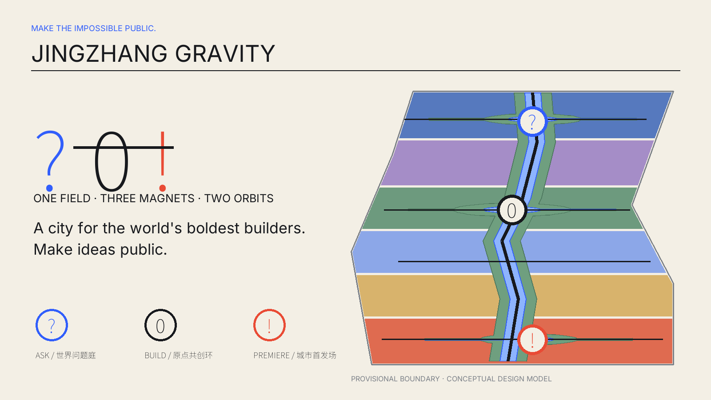
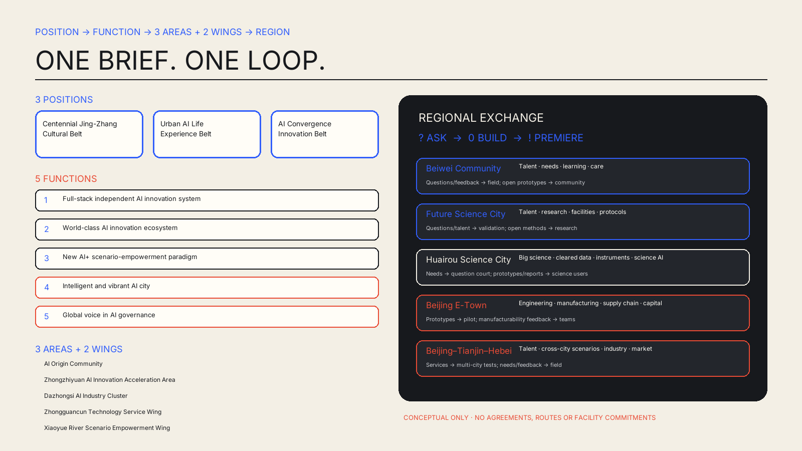
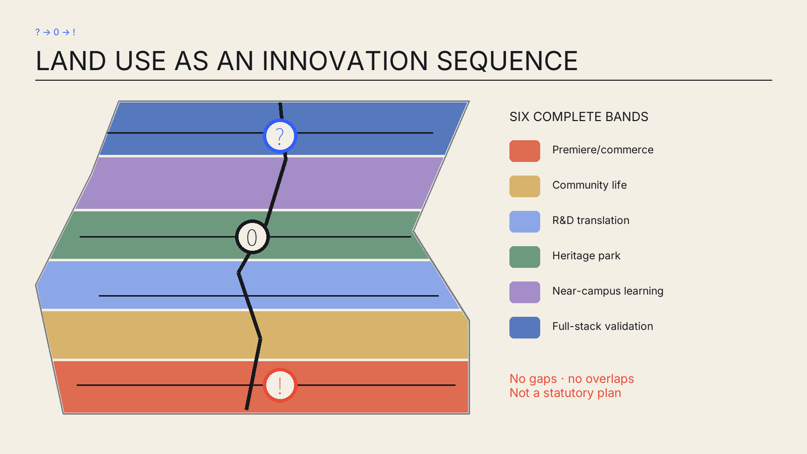
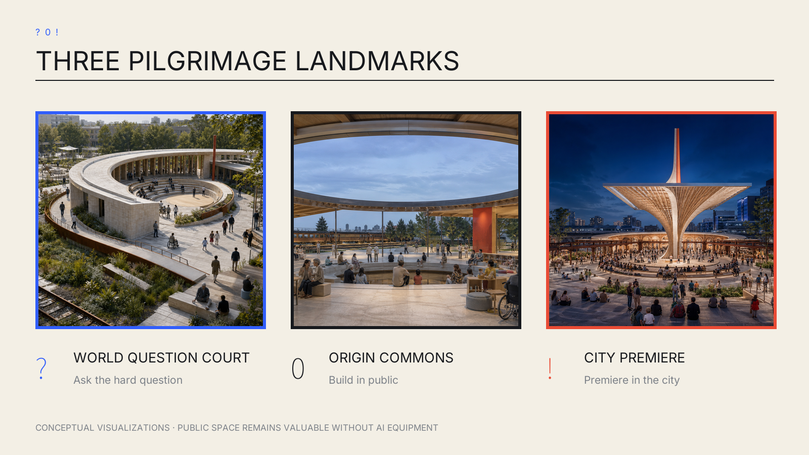
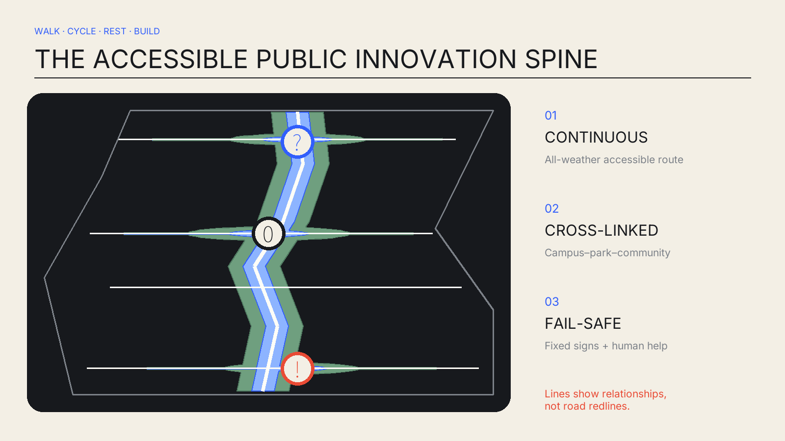
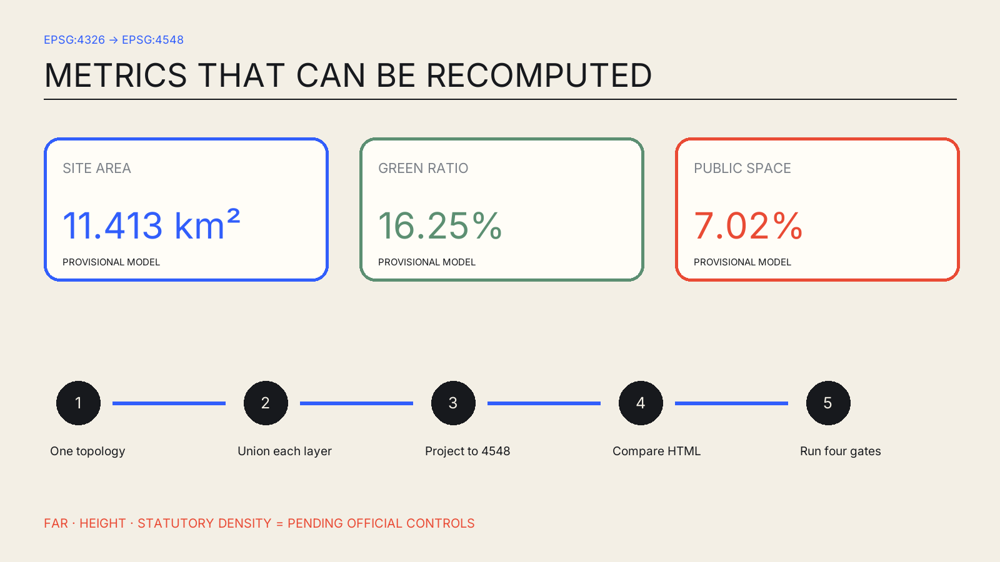

# JINGZHANG GRAVITY / 京张引力场

## Design Basis and Source List

The proposal sets an additional quality gate: surprise the world, read in three seconds as a thumbnail, explain itself in thirty seconds, and reveal the complete innovator journey in three minutes. Its name is **JINGZHANG GRAVITY**; its line is **MAKE THE IMPOSSIBLE PUBLIC. / 把不可能，做成城市日常。** The symbol `? → 0 → !` means ask a world-class question, build an open prototype at the AI origin, and premiere it in the real city. This is a spatial, operational and governance sequence—not surface branding. [source:AGENT-TASKBOOK] [standard:PROJECT-AGENT-OPEN-CALL-TASKBOOK]

The evidence base is the official announcement, cleared Agent taskbook, repository source registry, local standard snapshots and provisional geometry. As of 31 August 2026, the repository still has no trusted exact official polygon. `SITE-001` and the three key areas are low-confidence temporary bases; OSM is background context only and never supports redlines, area or planning controls. [source:OFFICIAL-ANNOUNCEMENT] [source:BOUNDARY-SOURCE] [data:geometry/site_boundary.geojson#SITE-001]

The boundary is a faint dashed constraint; the high-contrast layer is design intent. Experience images are conceptual, not factual site evidence. GeoJSON, JSON and reproducible calculations take precedence over images, HTML and PDFs.

## Three-Level Scope Framework

At the coordinated-research scale, the proposal forms a university-origin–validation–open-source–city-premiere–global-communication loop. At the overall-design scale, the railway heritage park becomes a continuous public innovation field. At key-area scale, three magnets test the interfaces of research, life and public launch. The Zhongguancun service wing supplies talent, capital, compute, data and professional services; the Xiaoyue River wing supplies lived scenarios and public feedback. [source:OFFICIAL-ANNOUNCEMENT] [depth:three_level_scope_framework]

The structure is “one field, three magnets, two orbits”: one continuous heritage park; World Question Court, Origin Commons and City Premiere; an outer orbit for research/capital/industry services and an inner orbit for residents, students and visitors. Durable civic space survives beyond screens or devices. [data:geometry/key_areas.geojson#PROV-KEY-001] [depth:overall_spatial_structure]

The taskbook's three positions, five functions and “three areas + two wings” are not parallel slogans. One `? → 0 → !` journey binds them into a spatial–operational loop. The matrix below maps every requirement to a place and an inspectable output. [source:AGENT-TASKBOOK]

| Level | Taskbook requirement | Jing-Zhang Gravity spatial–operational response | Inspectable output |
| --- | --- | --- | --- |
| Position | Centennial Jing-Zhang Cultural Belt | Railway-heritage park as a century-long civic innovation framework | Heritage narratives, open archives and year-round public life |
| Position | Urban AI Life Experience Belt | Xiaoyue River scenario wing + open ground floors at all magnets | Everyday AI experiences people can enter, choose and leave |
| Position | AI Convergence Innovation Belt | ? World Question Court → 0 Origin Commons → ! City Premiere | World questions become open prototypes and public launches |
| Function | Full-stack independent AI innovation system | Zhongzhiyuan acceleration area / World Question Court | Model evaluation, embodied safety and hardware clinic |
| Function | World-class AI innovation ecosystem | AI Origin Community / Origin Commons | Global landing, open-source collaboration and youth life |
| Function | New AI+ scenario-empowerment paradigm | Xiaoyue River wing + public spaces along the belt | Open question intake, non-AI baselines and real feedback |
| Function | Intelligent and vibrant AI city | Dazhongsi cluster / City Premiere | AI-native market, culture and Global Premiere Week |
| Function | Global voice in AI governance | Zhongzhiyuan deliberation and validation + public retrospectives | Human authority, stop conditions and published governance records |
| Three areas | AI Origin Community | 0 Origin Commons | World-class AI innovation ecosystem |
| Three areas | Zhongzhiyuan AI Innovation Acceleration Area | ? World Question Court | Full-stack innovation and AI governance |
| Three areas | Dazhongsi AI Industry Cluster | ! City Premiere | AI-native industries and services |
| Two wings | Zhongguancun Technology Service Wing | Outer orbit: talent, capital, compute, data and professional services | Global factor allocation, Zhongguancun IP and capital |
| Two wings | Xiaoyue River Scenario Empowerment Wing | Inner orbit: residents, students, visitors and lived scenarios | Scenario empowerment and a vibrant intelligent city |

Regional collaboration defines public interfaces for future discussion; it does not invent agreements, routes, procurement, investment or data licences. Each interface states its exchange objects, two-way direction, trigger and evidence status. [source:AGENT-TASKBOOK] [assumption:A-CONTROLS-001]

| Partner | Exchange objects | Direction | Trigger | Evidence status |
| --- | --- | --- | --- | --- |
| Beiwei Community | Talent, community needs, learning and care scenarios | Questions and feedback → field; open curricula and prototypes → community | Public co-creation brief + community, ethics and accessibility review | Named by taskbook; no agreement, route or facility data; conceptual interface |
| Future Science City | Talent, research questions, facilities and evaluation protocols | Questions and talent → validation; reproducible protocols and open methods → research community | Public research project or cleared facility sharing + safety/data review | Named by taskbook; no agreement or facility-sharing data; conceptual interface |
| Huairou Science City | Big-science questions, cleared data, instrument interfaces and scientific-AI validation | Questions/data needs → World Question Court; prototypes/governance reports → science users | Public data and licence + professional review | Named by taskbook; no agreement or data licence; conceptual interface |
| Beijing E-Town | Embodied-AI engineering, manufacturing, supply chain and capital | Prototypes → engineering/pilot; manufacturability feedback/capability → teams | Voluntary enterprise participation + cleared pilot + safety/procurement review | Named by taskbook; no enterprise commitment or procurement; conceptual interface |
| Beijing–Tianjin–Hebei | Talent, cross-city scenarios, industry needs and market feedback | Prototypes/services → multi-city validation; scenario feedback/industry needs → field | Public cross-regional brief + host consent + data compliance | Named by taskbook; no regional agreement or formal route; conceptual interface |

All regional relationships are conceptual interfaces responding to the taskbook. Without an agreement, formal transport route, facility-sharing evidence or host commitment, none may be represented as an existing fact.

## Coordinated Research Area: Industry and Future City Research

Jing-Zhang Gravity does not copy an “innovation-park look.” It translates seven mechanisms: research-industry adjacency, shared facilities, industrial-heritage renewal, international soft landing, open ground floors, year-round community and bookable validation. They are comparative references, not site controls.

| Case | Mechanism | Jing-Zhang translation |
| --- | --- | --- |
| Kendall Square | Research–industry–street adjacency | Put shared research facilities and public ground floors within walking distance [source:CASE-KENDALL] |
| Station F | Large shared infrastructure | Use low-threshold build tables, services and soft landing to shorten startup time [source:CASE-STATION-F] |
| Singapore one-north | Work–live–learn mix | Use two wings to add daily life and real-world scenarios, not an isolated tech park [source:CASE-ONE-NORTH] |
| King’s Cross Knowledge Quarter | Knowledge alliance and heritage renewal | Make railway heritage the shared identity and year-round civic base [source:CASE-KQ] |
| 22@Barcelona | Incremental industrial-district renewal | Use open ground floors, mixed functions and phasing for long-term change [source:CASE-22] |
| MaRS Discovery District | Research commercialization and public convening | Embed professional services in the commons [source:CASE-MARS] |
| High Tech Campus Eindhoven | Shared labs and open innovation | Make costly validation facilities bookable and auditable commons [source:CASE-HTCE] |

Together they create a public innovation chain. Questions enter World Question Court, face red-team, ethics and manufacturability checks, gather maintainers and users at Origin Commons, and meet the public and international peers at City Premiere. Failures are also reviewed openly, making the city a learning infrastructure. [depth:overall_spatial_structure] [standard:MOHURD-URBAN-DESIGN-MEASURES]

## Overall Design Area: Urban Renewal and Regulatory-Plan-Level Urban Design

All design layers derive from one provisional topology. Six complete north-south bands organize premiere/commerce, community life, R&D translation, heritage park, near-campus learning and full-stack validation. Land use covers the boundary without gaps or overlaps; green, public-space, building and phase layers derive from the same base. [data:geometry/land_use.geojson#LU-001] [depth:land_use_layout]

The interim model measures 11.413 km², with 16.25% green space and 7.02% public space. These are EPSG:4548 design-model calculations from submitted geometry—not substitutes for the announced approximate area and not statutory controls. [metric:site_area_sqm] [metric:green_ratio] [metric:public_space_ratio]

The renewal order is retain first, low-disturbance adaptation, reversible infill, and only then further review. Without ownership, existing-building, regulatory, heritage, municipal and engineering data, no real parcel receives a demolition/renovation conclusion. [standard:MOHURD-CONTROL-DETAILED-PLANNING] [depth:retain_renovate_demolish]

## Detailed Design of Key Areas

**? World Question Court (Zhongzhiyuan)** combines a curved civic forum, validation garden, hardware clinic and deliberation arcade. Walking, lunch, discussion and accessible rest come first; testing equipment is replaceable. [data:geometry/key_areas.geojson#PROV-KEY-001]

**0 Origin Commons (AI Origin)** is an open ring with a deliberately empty centre, gathering build tables, multilingual exchange, youth life, childcare and a staffed analog help desk. Visitors are not merely received; they can join immediately. [data:geometry/key_areas.geojson#PROV-KEY-002]

**! City Premiere (Dazhongsi)** uses a slender civic canopy and habitable steps to make an unmistakable silhouette. Market, culture, launch and international exchange occupy open ground floors. [data:geometry/key_areas.geojson#PROV-KEY-003]

All are conceptual suggestions requiring exact polygons, transport, ownership and engineering evidence before professional development. [depth:three_key_area_detailed_design]

## AI Innovation Ecosystem, Personas, and AI+ Scenarios

Eight personas are co-authors of the district, not traffic segments. Every scenario answers why a world-class innovator would come and what an ordinary resident gains.

| Persona | Need | Space–operation response |
| --- | --- | --- |
| Frontier researcher | Trusted evaluation, peer challenge, quiet work | World Question Court + 24/7 research commons |
| Robotics founder | Safe trials, hardware debugging, first users | Validation garden + hardware clinic + premiere |
| Open-source maintainer | Collaboration, documentation, durable community | Origin Commons + contribution rings |
| International team | Multilingual landing, short stay, partner matching | Science salon + soft-landing desk |
| Student | Learning, making, role models, affordable life | 72-hour build residency + youth living |
| Resident and carer | Low-disruption daily life, children, trusted service | Park routine + staffed desk |
| Older/disabled person | Access, traditional channels, exit rights | Continuous accessible loop + human navigation |
| Operator/reviewer | Authority, stop rights, audit trail | Scenario control + public retrospectives |

Twelve scenario cards span research, everyday life, culture and premiere. Three Testing and Validation Scenarios explicitly provide final human authority, a non-AI baseline, stop conditions and an exit path. [source:AGENT-TASKBOOK] [standard:GENERATIVE-AI-INTERIM-MEASURES]

| No. | Scenario | Place | Type | Governance and experience |
| --- | --- | --- | --- | --- |
| 01 | Open model evaluation | Zhongzhiyuan | TVS | Public benchmarks and red teams; professional release authority; human-review baseline; stop on leakage, bias or unexplained anomaly; teams may withdraw model and data. |
| 02 | Embodied-AI safety trial | Zhongzhiyuan | TVS | Graded trials in a soft-separated garden; on-site safety officer has final authority; teleoperation baseline; stop on boundary breach, link loss or human entry; physical power-off and evacuation exit. |
| 03 | AI hardware clinic | Zhongzhiyuan | SERVICE | Shared tools, repair and manufacturability advice without vendor lock-in. |
| 04 | Responsible-AI assembly | Zhongzhiyuan | CIVIC | Researchers, residents and reviewers deliberate high-impact scenarios; publish minutes with sensitive details removed. |
| 05 | 72-hour global build residency | AI Origin | BUILD | Question intake, teams, prototypes and public retrospectives, with quiet exit spaces. |
| 06 | Multilingual science salon | AI Origin | COMMUNITY | Machine translation assists only; bilingual people confirm consequential decisions; paper agenda remains. |
| 07 | Inclusive learning studio | AI Origin | LEARNING | Large type, captions, tactile models and volunteers; screen-free participation available. |
| 08 | Health and ageing navigation | AI Origin | TVS | Route/service information only; staff or clinicians decide; paper maps and staffed counter as non-AI baseline; stop on misleading or health risk; one-step human handoff and session deletion. |
| 09 | AI-native market | Dazhongsi | MARKET | Transparent prototype feedback; cash and human channels remain; no profiling without consent. |
| 10 | Railway culture co-creation | Belt | CULTURE | Oral histories and public archives without fabricated history or uncleared portraits. |
| 11 | Climate public-realm steward | Belt | CLIMATE | Public environmental data suggests shaded/rain routes; no tracking; fixed signs are fallback. |
| 12 | Global Premiere Week | Dazhongsi | EVENT | Invitation programme plus public days; publish failures and governance records; no procurement or investment promises. |

Health and ageing navigation retains staffed and paper channels. This uses the Accessibility Law only within its listed public-service contexts and treats the 2020 elderly-smart-tech plan as background, not as proof of local implementation in 2026. [standard:BARRIER-FREE-ENVIRONMENT-LAW] [source:ELDERLY-SMART-BACKGROUND]

## Land Use, Building Scale, and Retain-Renovate-Demolish Strategy

Codes follow the repository’s national classification reference: R&D 0802, education 0804, community service 0702, commerce 0901 and park green 1401. They express a reference structure, not an approved plan. [standard:MNR-LAND-USE-CLASSIFICATION-GUIDE] [data:geometry/land_use.geojson#LU-001]

Twelve building prototypes support labs, R&D, repair, deliberation, global builds, multilingual exchange, inclusive learning, youth living, market, culture, transit and launches. Their footprints are recomputable but do not represent existing parcels. FAR, height and statutory building density remain pending official data. [data:geometry/buildings.geojson#BLDG-001] [metric:building_footprint_area_sqm] [depth:height_massing_character]

## Transport, Rail, Municipal Infrastructure, and Public Services

A north-south walking–cycling–accessible spine links three cross-connections for campuses, parks, communities and transit, plus one community loop. Lines express relationships, not road redlines or engineering alignments. [data:geometry/roads.geojson#ROAD-001] [depth:traffic_rail_slow_parking]

Edge compute, repair, storage, stormwater and event power use a shared-interface/service-band concept without inventing loads or pipe capacity. Every system can be bypassed; lighting, wayfinding and emergency calls retain non-AI modes. [depth:municipal_new_infrastructure] [source:SITE-PACKAGE]

## Blue-Green Network, Public Space, and Urban Character

A narrow continuous heritage greenway, three magnet gardens and rain-garden branches form the green system. Public space is the more intensively used walking and event interface within it. They may overlap, but each metric uses union area to avoid double counting. [data:geometry/green_space.geojson#GREEN-001] [data:geometry/public_space.geojson#PUBLIC-001]

Character comes from railway carbon, paper cream, gravity blue and premiere vermilion—not temporary “future” decoration. The `?0!` line is at once identity, route, seating edge, canopy structure and event score. Replaceable plaques and public archives record contribution without locking short-lived equipment into architecture. [standard:MOHURD-URBAN-DESIGN-MEASURES] [depth:blue_green_public_space]

## Renewal Projects, Implementation Policy, and Phasing

Phase 1 uses reversible installations and operations to test the public journey; Phase 2 adapts and adds facilities only where rights and professional constraints are known; Phase 3 sustains research, events and governance. These are trigger-based suggestions, not a fixed government commitment. [data:geometry/phasing.geojson#PHASE-001] [depth:phasing_implementation]

The package includes the accessible green spine, three durable magnets, shared validation facilities, two service wings, contribution rings and Global Premiere Week. Each passes co-design, a non-AI baseline, professional review and exit planning before construction is considered. [depth:renewal_project_list] [source:AGENT-TASKBOOK]

## Metrics, Area Recalculation, and Compliance Matrix

The core geometry metrics are `site_area_sqm=11412825.386`, `green_ratio=0.162513` and `public_space_ratio=0.070219`. Exchange uses EPSG:4326; area uses EPSG:4548; green and public space are unioned before division. [metric:site_area_sqm] [depth:metrics_recalculation]

The compliance matrix covers 23 announcement and Agent requirements. Five mandatory standards are addressed and fifteen depth items are complete within current public evidence. “Complete” never promotes unknown controls into facts. [standard:PROJECT-OFFICIAL-ANNOUNCEMENT] [depth:risk_missing_data]

## Risk, Copyright, and Compliance

Boundary truth is the primary risk: the provisional polygon has documented uncertainty against OSM background checks, so every ratio, location and phase must be regenerated after official polygons arrive. Other gaps include ownership, existing conditions, heritage, transport, utilities, fire and subsurface data; scenario risks include privacy, bias, misinformation and lock-in. [source:BOUNDARY-SOURCE] [depth:risk_missing_data]

Every spatial move is an open co-creation concept, reference scheme or material for professional teams to deepen. It is not an approved plan, government decision, investment promise, confirmed event or engineering feasibility conclusion. Generated views are conceptual. Noto Sans SC and Inter are redistributed as OFL subsets; generation tools, rights and limits are recorded in the copyright statement. [source:FONT-NOTO] [source:FONT-INTER] [source:MEDIA-OPENAI]

## References

The complete source index is in `sources.json`; assumptions are in `assumptions.json`; metric definitions, methods and rounding are in `metrics.json`; and task, professional-standard and design-depth crosswalks are in the three matrices. The official announcement, cleared agent taskbook, repository registry and local standard snapshots define the assignment, professional baseline and evidence boundary. [source:SOURCE-REGISTRY] [source:OFFICIAL-ANNOUNCEMENT] [source:AGENT-TASKBOOK]

The repository's provisional boundary is used only to build a publicly recomputable conceptual design model: its areas cannot replace an official redline, statutory controls or survey data. [source:BOUNDARY-SOURCE] The seven institutional case sources—Kendall Square, Station F, one-north, King's Cross Knowledge Quarter, 22@Barcelona, MaRS and High Tech Campus Eindhoven—support mechanism translation only, never site controls or performance promises. Generated imagery communicates future experience; structured JSON and GeoJSON remain the auditable evidence. Source purpose, retrieval date, licence and limits are registered item by item.
