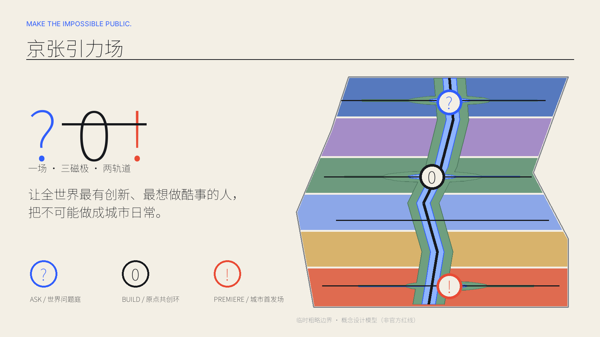
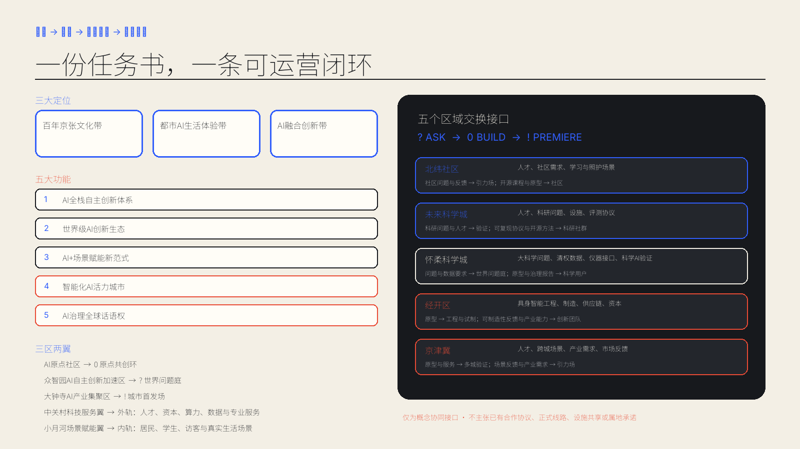
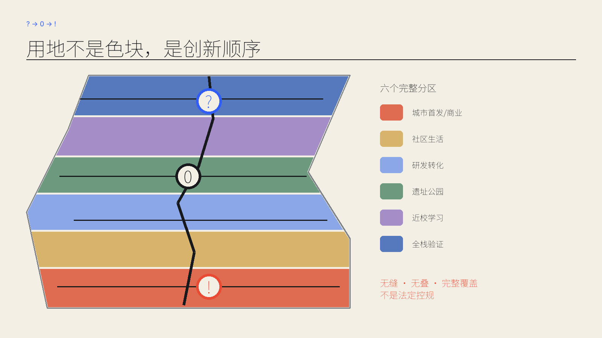
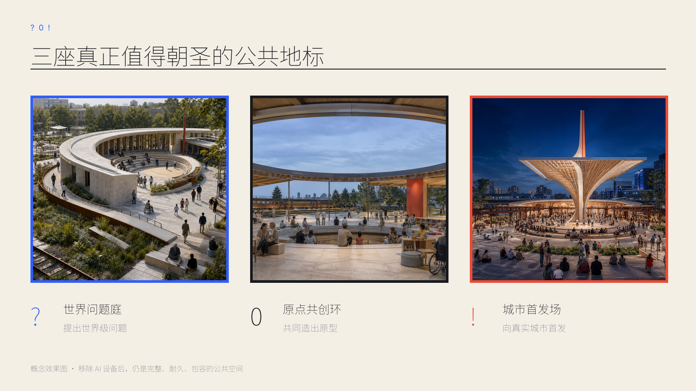
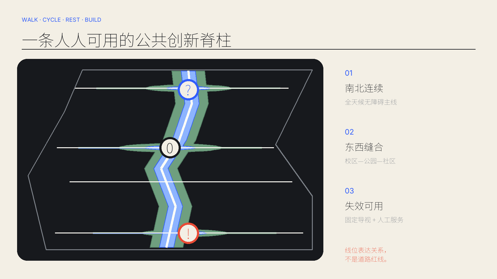
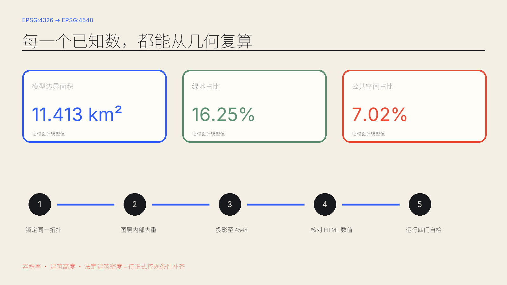

# 京张引力场 / JINGZHANG GRAVITY

## 设计依据与资料清单

本方案把“能令世界惊艳、三秒识别、三十秒理解、三分钟看见完整创新旅程”设为额外设计门槛。正式名称是**京张引力场**，传播句是 **MAKE THE IMPOSSIBLE PUBLIC. / 把不可能，做成城市日常。** 核心符号 `? → 0 → !` 分别表示提出世界级问题、在 AI 原点共同造出原型、向真实城市公开首发。它不是表面品牌包装，而是空间、运营与治理共同遵循的顺序。[source:AGENT-TASKBOOK] [standard:PROJECT-AGENT-OPEN-CALL-TASKBOOK]

依据包括官方公告、清权智能体任务书、仓库来源登记、专业标准本地快照和 provisional 边界。仓库截至 2026-08-31 仍未提供可信官方精确 polygon；`SITE-001` 与三个重点区只作为低置信度临时底板，OSM 仅用于背景关系核对，绝不用于红线、面积或控规结论。[source:OFFICIAL-ANNOUNCEMENT] [source:BOUNDARY-SOURCE] [data:geometry/site_boundary.geojson#SITE-001]

图中边界以淡色虚线出现；高对比内容是设计意图。体验效果图均标为概念表达，不是现场照片或事实证据。结构化 GeoJSON、JSON 和复算脚本优先于图片、HTML 与 PDF。

## 三层范围工作框架

统筹研究范围建立“高校策源—全栈验证—开源协作—城市首发—国际传播”的区域回路；总体设计范围把铁路遗址公园转成连续公共创新引力场；三处重点区域以不同磁极验证研发、生活和发布的空间接口。中关村科技服务翼提供人才、资本、算力、数据与专业服务，小月河场景赋能翼提供真实生活场景和公众反馈。[source:OFFICIAL-ANNOUNCEMENT] [depth:three_level_scope_framework]

空间结构是“一场、三磁极、两轨道”：一场是连续遗址公园；三磁极是世界问题庭、原点共创环、城市首发场；外轨承载研究—资本—产业专业服务，内轨承载居民—学生—访客的公共体验。三磁极不依赖大屏或霓虹，技术层可替换，公共空间骨架可持续百年。[data:geometry/key_areas.geojson#PROV-KEY-001] [depth:overall_spatial_structure]

任务书中的三大定位、五大功能和“三区两翼”不是并列口号，而是由同一条 `? → 0 → !` 旅程连接的空间—运营闭环。下表逐项对应任务要求、设计落位和可检查输出。[source:AGENT-TASKBOOK]

| 层级 | 任务书要求 | 京张引力场空间—运营响应 | 可检查输出 |
| --- | --- | --- | --- |
| 定位 | 百年京张文化带 | 铁路遗产公园作为百年公共创新骨架 | 遗产叙事、开放档案、全年公共生活 |
| 定位 | 都市AI生活体验带 | 小月河场景赋能翼 + 三磁极开放首层 | 居民可进入、可选择、可退出的日常AI体验 |
| 定位 | AI融合创新带 | ? 世界问题庭 → 0 原点共创环 → ! 城市首发场 | 从世界问题到开放原型再到城市首发 |
| 功能 | AI全栈自主创新体系 | 众智园AI自主创新加速区 / 世界问题庭 | 模型评测、具身安全、硬件诊所 |
| 功能 | 世界级AI创新生态 | AI原点社区 / 原点共创环 | 全球会客、开源协作、青年生活 |
| 功能 | AI+场景赋能新范式 | 小月河场景赋能翼 + 沿线公共空间 | 公开问题征集、无AI基线、真实反馈 |
| 功能 | 智能化AI活力城市 | 大钟寺AI产业集聚区 / 城市首发场 | AI原生市集、文化展演、全球首发周 |
| 功能 | AI治理全球话语权 | 众智园公议与验证 + 全线公开复盘 | 人工最终权限、停止条件、治理记录公开 |
| 三区 | AI原点社区 | 0 原点共创环 | 世界级AI创新生态 |
| 三区 | 众智园AI自主创新加速区 | ? 世界问题庭 | 全栈自主创新体系与AI治理 |
| 三区 | 大钟寺AI产业集聚区 | ! 城市首发场 | 智能原生新业态 |
| 两翼 | 中关村科技服务翼 | 外轨：人才、资本、算力、数据与专业服务 | 要素配置、中关村IP与资本赋能 |
| 两翼 | 小月河场景赋能翼 | 内轨：居民、学生、访客与真实生活场景 | 场景赋能与智能化AI活力城市 |

区域协同只定义可进一步洽谈的公共接口，不虚构任何协议、路线、采购、投资或数据授权。每个接口明确交换对象、双向流动、启动条件与证据状态。[source:AGENT-TASKBOOK] [assumption:A-CONTROLS-001]

| 协同对象 | 交换对象 | 方向 | 启动条件 | 证据状态 |
| --- | --- | --- | --- | --- |
| 北纬社区 | 人才、社区需求、学习与照护场景 | 社区问题与反馈 → 引力场；开源课程与原型 → 社区 | 公开共创议题 + 社区、伦理与无障碍审核 | 任务书点名；无合作协议、线路或设施数据；概念接口 |
| 未来科学城 | 人才、科研问题、设施、评测协议 | 科研问题与人才 → 验证；可复现协议与开源方法 → 科研社群 | 公开科研项目或清权设施共享 + 安全、数据审核 | 任务书点名；无合作协议或设施共享数据；概念接口 |
| 怀柔科学城 | 大科学问题、清权数据、仪器接口、科学AI验证 | 问题与数据要求 → 世界问题庭；原型与治理报告 → 科学用户 | 公开数据与许可 + 专业审查 | 任务书点名；无合作协议或数据授权；概念接口 |
| 经开区 | 具身智能工程、制造、供应链、资本 | 原型 → 工程与试制；可制造性反馈与产业能力 → 创新团队 | 企业自愿 + 清权试点 + 安全、采购边界审核 | 任务书点名；无企业承诺或采购安排；概念接口 |
| 京津冀 | 人才、跨城场景、产业需求、市场反馈 | 原型与服务 → 多城验证；场景反馈与产业需求 → 引力场 | 公开跨区域议题 + 属地同意 + 数据合规 | 任务书点名；无跨区域协议或正式路线；概念接口 |

以上区域关系均为任务书导向下的概念协同接口；没有合作协议、正式交通线路、设施共享数据或属地承诺时，不得写成既成事实。

## 统筹研究范围产业与未来城市研究

京张引力场不复制“园区形象”，只转译七个全球案例的机制：科研产业邻接、共享设施、工业遗产更新、国际软着陆、开放首层、全年社区和可预约验证。它们提供比较视角，不作为本站点法定依据。

| 案例 | 可验证机制 | 京张转译 |
| --- | --- | --- |
| Kendall Square | 科研—企业—街道紧邻 | 把共享研究设施与首层公共生活放在步行圈内 [source:CASE-KENDALL] |
| Station F | 大尺度共享基础设施 | 以低门槛共创桌、服务台和国际软着陆缩短启动时间 [source:CASE-STATION-F] |
| Singapore one-north | 工作—生活—学习复合 | 用两翼补齐人才生活与真实场景，而非孤立科技园 [source:CASE-ONE-NORTH] |
| King’s Cross Knowledge Quarter | 知识机构联盟与遗产更新 | 铁路遗产成为共同身份与全年公共文化底板 [source:CASE-KQ] |
| 22@Barcelona | 工业片区渐进更新 | 以开放首层、混合功能和分期机制承接长期变化 [source:CASE-22] |
| MaRS Discovery District | 科研商业化与公共会客 | 把专业服务嵌入共创环，形成从研究到转化的门厅 [source:CASE-MARS] |
| High Tech Campus Eindhoven | 共享实验条件与开放创新 | 把昂贵验证设施做成可预约、可审核的共同基础设施 [source:CASE-HTCE] |

七种机制合成一条“公开创新链”：全球问题通过开放征集进入世界问题庭，在共享验证设施中经历红队、伦理和可制造性检查；合格原型进入原点共创环找到维护者、用户和服务；最终在城市首发场面对公众、客户和国际同行。失败也被公开复盘，城市因此成为持续学习的基础设施。[depth:overall_spatial_structure] [standard:MOHURD-URBAN-DESIGN-MEASURES]

## 总体设计范围城市更新与控规深度城市设计

设计图层从同一 provisional 边界拓扑生成，完整分为六个南北连续用地带：城市首发与商业、社区生活、研发转化、遗址公园、近校学习、全栈验证。用地覆盖边界且无缝无叠；绿脉、公共空间、建筑原型和分期均由同一拓扑派生。[data:geometry/land_use.geojson#LU-001] [depth:land_use_layout]

临时模型面积为 11.413 km²，绿地占比 16.25%，公共空间占比 7.02%；这些是 EPSG:4548 下从提交几何复算的设计模型值，不是公告约面积的替代物，更不是法定指标。[metric:site_area_sqm] [metric:green_ratio] [metric:public_space_ratio]

更新方法以“保留优先、低扰动改造、可逆加建、必要时再论证”为序。因缺少权属、现状建筑、控规、文保、市政和工程资料，不对任何真实地块作拆改留结论；建筑基底仅表达十二类空间原型的容量关系。[standard:MOHURD-CONTROL-DETAILED-PLANNING] [depth:retain_renovate_demolish]

## 重点区域详细设计

**? 世界问题庭 / World Question Court（众智园）**：弧形论坛、验证花园、硬件诊所和公议廊共同围合一个可日常使用的花园研究场。空间先服务散步、午餐、讨论和无障碍休憩，开放模型评测与具身安全试验作为可替换技术层。[data:geometry/key_areas.geojson#PROV-KEY-001]

**0 原点共创环 / Origin Commons（AI 原点）**：一个有中心空场的开放圆环，把共创桌、多语会客、青年生活、儿童角和人工服务台置于同一屋檐。中心留白允许社区自行定义下一件酷事，是全球人才“不是被接待，而是立即加入”的入口。[data:geometry/key_areas.geojson#PROV-KEY-002]

**! 城市首发场 / City Premiere（大钟寺）**：一座细长公共雨棚和可坐可演的石阶形成清晰剪影，周边首层容纳市集、文化共创、产品首发与国际交流。它在无电子设备时仍是舒适城市客厅。[data:geometry/key_areas.geojson#PROV-KEY-003]

三处均是概念建议，须在取得官方 polygon、道路与轨道条件、权属和工程资料后由专业团队深化。[depth:three_key_area_detailed_design]

## AI 创新生态、人才画像与 AI+ 场景

八类人物不是“用户流量”，而是共同定义城市的人。每个场景同时回答两件事：为什么世界级创新者愿意来，普通居民具体得到什么。

| 人物 | 核心需要 | 空间—运营响应 |
| --- | --- | --- |
| 前沿研究者 | 可信评测、同伴批评、安静工作 | 世界问题庭 + 24/7研究客厅 |
| 机器人创业者 | 安全试验、硬件调试、首批用户 | 验证花园 + 硬件诊所 + 首发场 |
| 开源维护者 | 协作声誉、文档、稳定社群 | 原点共创环 + 贡献年轮 |
| 国际访问团队 | 多语落地、短住、伙伴匹配 | 科学会客厅 + 软着陆服务 |
| 青年学生 | 学习、实作、榜样、可负担生活 | 72小时共创营 + 青年共居 |
| 居民与照护者 | 低扰动日常、儿童友好、可信服务 | 公园日常 + 人工服务台 |
| 老年及行动不便者 | 无障碍、传统渠道、可退出 | 连续无障碍环 + 线下导航 |
| 运营与专业审核者 | 责任边界、停机权、审计记录 | 场景控制室 + 公开复盘 |

十二张场景卡覆盖研发、生活、文化和首发；前三类 Testing and Validation Scenario 均具有人工最终权限、无 AI 基线、停止条件和退出路径。[source:AGENT-TASKBOOK] [standard:GENERATIVE-AI-INTERIM-MEASURES]

| 编号 | 场景 | 位置 | 类型 | 治理与体验 |
| --- | --- | --- | --- | --- |
| 01 | 开放模型评测 | 众智园 | TVS | 公开基准与红队演练；专业审核人决定发布；保留人工评审基线；泄露、偏差或不可解释异常即停；团队可撤回模型与数据。 |
| 02 | 具身智能安全试验 | 众智园 | TVS | 软隔离花园内分级测试；现场安全员最终权限；人工遥控为无AI基线；越界、失联或人员进入即停；物理断电与人工疏散为退出路径。 |
| 03 | AI硬件诊所 | 众智园 | SERVICE | 共享工具、维修与可制造性咨询，保护商业秘密，不绑定供应商。 |
| 04 | 负责任AI公议 | 众智园 | CIVIC | 研究者、居民和审核者共同审议高影响场景，纪要公开、敏感信息脱敏。 |
| 05 | 72小时全球共创营 | AI原点 | BUILD | 从问题征集、组队、原型到公开复盘，夜间空间可控并提供安静退出区。 |
| 06 | 多语科学会客 | AI原点 | COMMUNITY | 机器翻译只作辅助，重要决定由双语人员确认，保留纸面议程。 |
| 07 | 包容性学习工坊 | AI原点 | LEARNING | 大字、字幕、触觉模型与志愿者并行，儿童和老年人可选择无屏参与。 |
| 08 | 健康与助老导航 | AI原点 | TVS | 只做路线与服务信息辅助；工作人员/医务人员最终判断；纸质地图与人工窗口为无AI基线；误导、健康风险或投诉即停；一键转人工并删除会话。 |
| 09 | AI原生市集 | 大钟寺 | MARKET | 原型在真实消费中接受透明反馈，现金/人工渠道并行，未经同意不画像。 |
| 10 | 铁路文化共创 | 沿线 | CULTURE | 以口述史与公共档案共创，不虚构历史，不使用未清权肖像。 |
| 11 | 气候公共空间助手 | 沿线 | CLIMATE | 用公开环境数据提示遮阴与雨天路线，不做个体追踪，失效时回到固定导视。 |
| 12 | 全球首发周 | 大钟寺 | EVENT | 年度邀请制+公众日，把成果、失败和治理记录一并公开，不承诺政府采购或投资。 |

健康与助老导航明确保留人工服务和纸面路线；这既回应无障碍法列举公共服务场景的人工办理边界，也把 2020 年适老政策仅作为背景参照，不把其阶段目标写成 2026 年本地落实事实。[standard:BARRIER-FREE-ENVIRONMENT-LAW] [source:ELDERLY-SMART-BACKGROUND]

## 用地、建筑规模与拆改留方案

用地编码采用仓库登记的国土空间分类：科研 0802、教育 0804、社区服务 0702、商业 0901、公园绿地 1401。分类只表达参考功能结构，不替代经批准控规。[standard:MNR-LAND-USE-CLASSIFICATION-GUIDE] [data:geometry/land_use.geojson#LU-001]

十二个建筑原型分布于三磁极，包括实验坊、研发坊、硬件诊所、公议厅、共创营、多语会客、包容学习、青年共居、市集、文化馆、接驳厅和发布工作室。其基底面积可复算，但不对应现状宗地或真实建筑；容积率、高度、法定建筑密度均保持待正式数据补齐。[data:geometry/buildings.geojson#BLDG-001] [metric:building_footprint_area_sqm] [depth:height_massing_character]

## 交通、轨道、市政与公共服务设施

南北主线是全天候步行—骑行—无障碍公共脊柱，三条东西连接在磁极处把校区、园区、社区和轨道接驳概念缝合；另设社区微循环。线位仅表达关系，不是道路红线或工程方案。[data:geometry/roads.geojson#ROAD-001] [depth:traffic_rail_slow_parking]

端侧算力、维修、储能、雨洪和活动电力采用“共享接口柜 + 可维护后勤带”的概念，不计算能源负荷或管线容量。所有设备可旁路，公共照明、导视和紧急呼叫具备非 AI 模式；工程深化须补市政、消防、防洪、轨道保护和交通资料。[depth:municipal_new_infrastructure] [source:SITE-PACKAGE]

## 蓝绿空间、公共空间与城市风貌

绿脉用窄而连续的遗址公园、三处磁极花园和东西雨洪枝条构成；公共空间是其中更高频、可无门槛使用的步行与活动界面。二者允许叠合，但分别按 union area 复算，避免重复计量。[data:geometry/green_space.geojson#GREEN-001] [data:geometry/public_space.geojson#PUBLIC-001]

城市气质不是“未来感装饰”，而是铁路炭黑、纸张米白、引力蓝和首发朱红的耐久材料秩序。`?0!` 连续线同时是标志、路线、座椅边界、雨棚骨架和活动编排；贡献展示使用可替换铭牌与公开数字档案，不把短命设备固化进建筑。[standard:MOHURD-URBAN-DESIGN-MEASURES] [depth:blue_green_public_space]

## 更新项目清单、实施政策与分期计划

概念实施分三期：第一期用可逆设施和运营验证公共旅程；第二期在权属与专业条件明确处实施共创设施和有机更新；第三期建立长期研究、活动和治理机制。分期是触发式而非固定政府承诺。[data:geometry/phasing.geojson#PHASE-001] [depth:phasing_implementation]

项目包包括：连续无障碍绿脉、三磁极公共骨架、共享验证设施、两翼服务接口、贡献年轮、年度全球首发周。每项先通过公众共创、无 AI 基线测试、专业审查和退出方案，再讨论建设。运营年历以季度问题季、月度开源夜、半年安全复盘和年度首发周组成；从访客到贡献者、从原型到城市首发都有明确转化入口。[depth:renewal_project_list] [source:AGENT-TASKBOOK]

## 指标体系、面积复算与合规矩阵

核心三指标来自提交几何：`site_area_sqm=11412825.386`、`green_ratio=0.162513`、`public_space_ratio=0.070219`。面积以 EPSG:4326 交换、EPSG:4548 复算；绿地和公共空间先 union 再除以边界面积。[metric:site_area_sqm] [depth:metrics_recalculation]

23 条合规要求覆盖公告 1.3/1.4/1.5 与 agent.1—agent.6；五项 mandatory 专业标准全部 addressed，十五项设计深度全部 complete。complete 只表示在当前公开资料条件下形成可复核概念成果，不把未知控规变成已知。[standard:PROJECT-OFFICIAL-ANNOUNCEMENT] [depth:risk_missing_data]

## 风险、版权与合规说明

最大风险是 boundary truth：provisional polygon 与背景 OSM 核对存在偏移不确定性，因此任何比例、落位和阶段都要在官方 polygon 发布后整体重算。第二类风险是权属、现状、文保、交通、市政、消防和地下条件缺失；第三类风险是场景隐私、偏差、误导和技术锁定。[source:BOUNDARY-SOURCE] [depth:risk_missing_data]

所有空间动作均为开放共创的概念建议、参考方案或可供专业团队深化研究，不替代正式规划，不构成政府审定结论、投资承诺、批准活动或工程可行性结论。生成体验图仅为概念表达。字体使用 Noto Sans SC 与 Inter 的 OFL 子集；代码、数据和生成媒体的来源、工具、许可与限制见版权声明。[source:FONT-NOTO] [source:FONT-INTER] [source:MEDIA-OPENAI]

## 参考资料

结构化来源见 `sources.json`，假设见 `assumptions.json`，指标定义、计算方法与小数精度见 `metrics.json`，任务、专业标准和设计深度的完整交叉索引分别见 `compliance_matrix.json`、`standard_matrix.json` 与 `design_depth_matrix.json`。关键项目依据是官方公告、清权智能体任务书、仓库来源登记和本地标准快照；它们决定任务范围、专业底线与证据边界。[source:SOURCE-REGISTRY] [source:OFFICIAL-ANNOUNCEMENT] [source:AGENT-TASKBOOK]

仓库提供的 provisional boundary 只用于建立一套可以公开复算的概念设计模型，并持续触发边界、面积和法定控制的“不确定”披露；其计算值不能替代官方红线、控规指标或工程测量。[source:BOUNDARY-SOURCE] Kendall Square、Station F、one-north、King's Cross Knowledge Quarter、22@Barcelona、MaRS 与 High Tech Campus Eindhoven 七个案例均引用机构官方页面，只转译科研产业邻接、共享设施、工业遗产更新、国际软着陆、开放首层和全年运营等机制，不支持本站点的空间控制或绩效保证。原创生成图仅解释未来体验，结构化 JSON/GeoJSON 才是可审计证据；每项来源的用途、检索日期、许可和限制均在来源表中逐条登记。
