# JZ RE:STACK · TRACKSIDE FUTURES

## Design Basis and Material Register

Along the Centennial Jing-Zhang cultural axis, the proposal establishes a pluggable, expandable urban platform system with embedded AI capabilities. It gives research institutions, enterprises, developers and merchants an open collaboration platform, while providing residents with convenient public services and varied activity spaces. Scientific and technological resources can gather, specialist capabilities can connect, and industry, commerce and everyday urban life can gain sustained vitality.

The Jing-Zhang Railway answered China's modernisation challenge through independent Chinese survey, design and construction. It connected distant places, but its enclosed alignment also interrupted east-west movement in the dense city. The Jing-Zhang Heritage Park has transformed that transport boundary into an open public corridor. JZ RE:STACK adds collaboration, service and experience nodes, allowing the corridor to gather, connect and distribute innovation resources. [source:OFFICIAL-ANNOUNCEMENT] [source:AGENT-TASKBOOK]

Evidence is organised in four levels. The official announcement and repository taskbook define objectives and mandatory outputs; the user-confirmed boundaries coordinate spatial representation; public plans, satellite imagery and site photographs support existing-condition interpretation; generated images communicate design intent. No statutory boundary, complete building survey, development-control data, ownership, utilities or comprehensive transport survey was supplied. These items are therefore never presented as measured facts. Full provenance, assumptions and metric status are registered in `sources.json`, `assumptions.json` and `metrics.json`. [source:SITE-PACKAGE]

The three positionings and five functions share one spatial translation. The Centennial Jing-Zhang Cultural Belt is carried by the heritage park, engineering memory and cultural interpretation. The Urban AI Life Experience Belt is carried by public service, commercial experience and resident activity plug-ins. The AI Convergent Innovation Belt is carried by collaborative development, lightweight validation and feedback. Full-stack AI autonomy is concentrated in Zhongzhiyuan; the world-class AI innovation ecosystem is organised through the AI Origin Community; AI-native business formats meet real markets in Dazhongsi. AI+ scenario enablement links all three areas to the Xiaoyuehe Scenario Empowerment Wing, while trusted AI, open audit and final human judgement support the public expression of AI governance. These requirements are implemented through one RE:STACK interface system rather than treated as parallel slogans. [source:AGENT-TASKBOOK]

## Three-Level Scope Framework

The proposal addresses three site-specific contradictions: Haidian's innovation resources are highly concentrated but cross-institutional entry points remain fragmented; feedback from research to scenarios and markets is not sufficiently visible; and the heritage park provides scarce continuous public space, while industry, commerce and everyday services need access to adjacent campuses, buildings and urban nodes in order to operate over time.

The project uses the user-confirmed working boundaries. The strategic study area and overall design area were interpreted from the announcement's written extents, satellite imagery and street maps, following road centrelines. Each key area was anchored by the elements named in the announcement, its leading function, the railway heritage and complete urban parcels, then manually calibrated to roads and geographic features. A centroid-and-square extrapolation was rejected because it can match area while omitting key elements and severing actual blocks. The result is a design-study boundary, not an organiser-issued statutory redline. [source:USER-CONFIRMED-BOUNDARY-20260826] [data:geometry/site_boundary.geojson#SITE-001]

The strategic study area tests complementarity with the Zhongguancun innovation corridor, Xueyuan Road research-industry belt, the two ring-road transport corridors and the peripheral blue-green structure. The overall design area establishes the open innovation spine, four existing cores, inserted nodes and cross-links. The key areas develop spatial structure, building interfaces, public space and implementation projects for Zhongzhiyuan, the AI Origin Community and Dazhongsi. Official geometry can replace the working boundary and trigger complete recalculation when available. [data:geometry/key_areas.geojson#KEY-001]

## Core Concept and Overall Design

RE:STACK translates the shared railway and computing meaning of a stack into an urban spatial prototype. Railway goods stacks once handled collection and transfer; technology stacks combine capabilities through interfaces. The urban RE:STACK becomes an open interface for resource access, collaboration, service delivery and continuous iteration. It is not a single monument, but a family that can enter parks, campuses, street corners, courtyards, ground floors and commercial atria.

**Recognisable in 30 seconds.** Along one side of the historic track, low platforms, dark-grey frames and warm-gold interface lights recur. A fixed AI core displays operating status; replaceable plug-ins become a co-development table in Zhongzhiyuan, a co-creation and public-service node in the Origin Community, and a product-experience and merchant interface in Dazhongsi. A conventional innovation corridor organises land and firms; a greenway organises landscape and movement; an isolated AI pavilion displays technology. JZ RE:STACK combines a heritage public corridor, open interfaces, AI capability and reversible space as one system that can be entered, called, updated and retired. Railway language is therefore an operating and spatial contract, not decoration.

Every RE:STACK has three parts. The platform base supplies structure, energy, network, lighting, accessibility and public staying space. The fixed AI core connects models, edge computing, device ports, human-Agent interfaces and manual control. Replaceable scenario plug-ins support research collaboration, lightweight validation, product display, public service, cultural activity and everyday commerce. S/M/L/XL scales range from trackside public nodes and shared collaboration spaces to co-development and lightweight validation platforms, and city-scale venues embedded in existing buildings. [data:geometry/buildings.geojson#BLDG-001]

The identity uses the same system DNA. The Chinese title and “JZ RE:STACK” both refer to interface, layering and renewal. A paired rail line and open-interface bracket form the graphic direction; warm-gold interface lighting identifies an accessible node; dark metal, clear glass and timber touchpoints establish a consistent material language. Wayfinding avoids copying corporate marks and instead states each node's scale, capability and opening status, so professionals and residents can understand what it offers, who is responsible and whether it is operating.

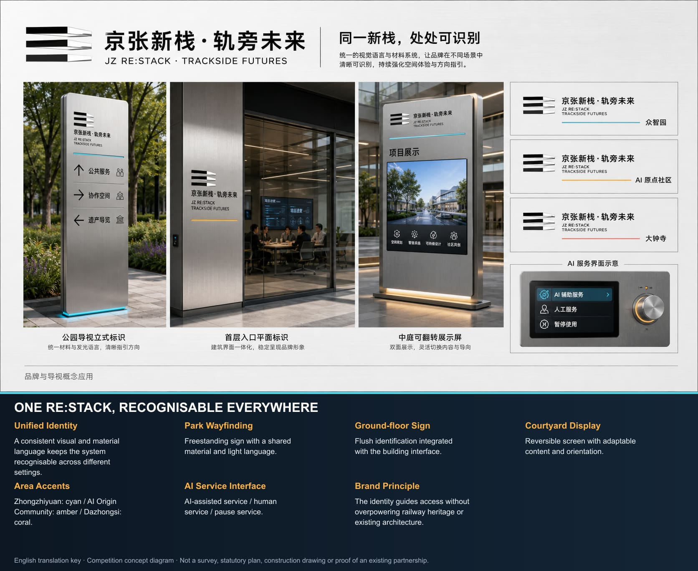

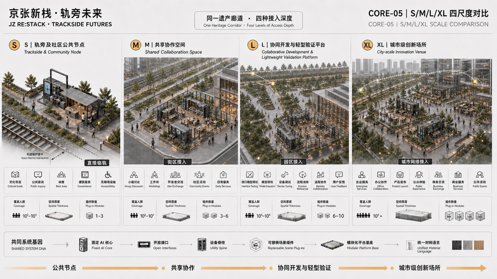

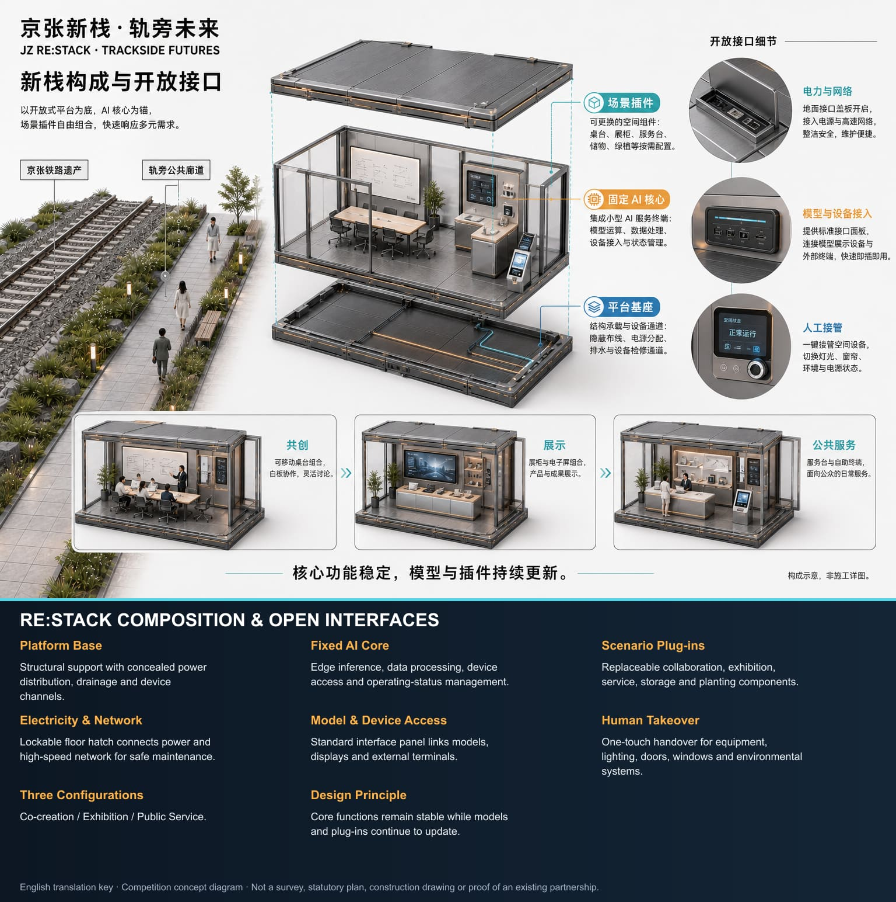

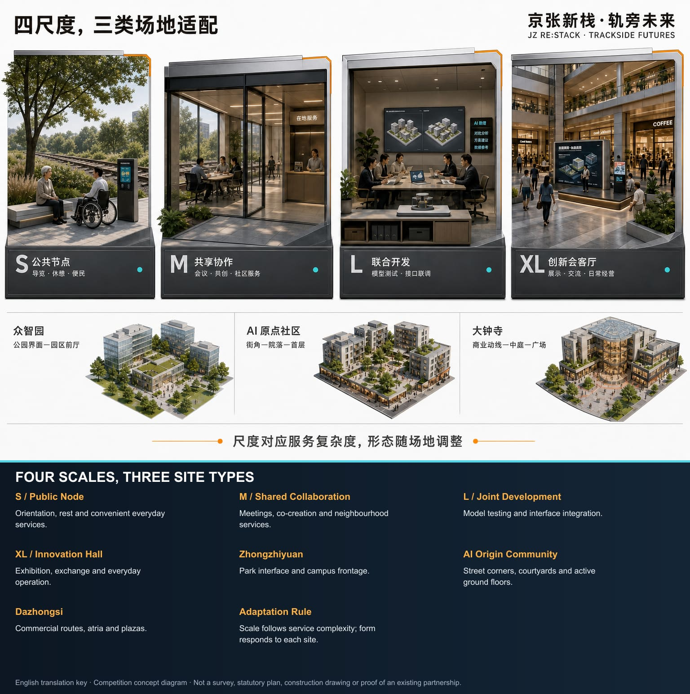

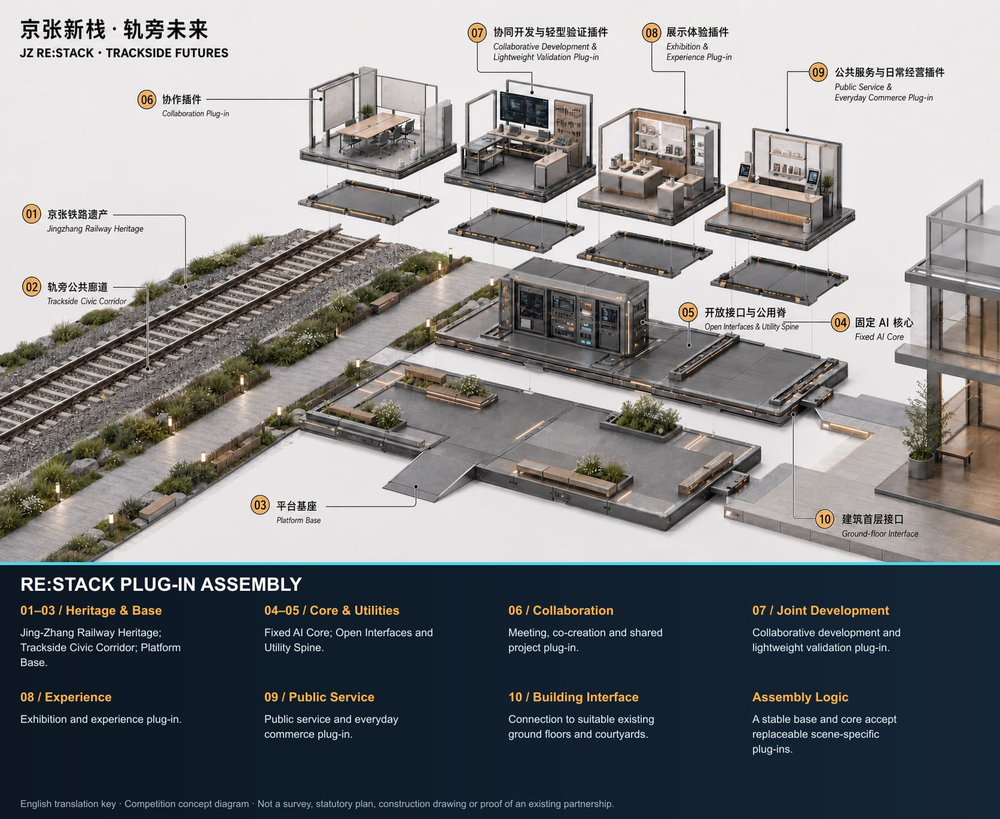

## Strategic Industry and Future-City Study

The industry position does not reproduce another high-density enterprise corridor. It supplies the missing open interfaces between research, enterprises, products, markets and urban life. The Zhongguancun corridor continues to concentrate institutions, anchor firms and professional services. The JZ RE:STACK open innovation spine brings co-development, lightweight validation, public experience, market feedback and daily services to accessible urban frontages. Its spatial identity consistently uses the platform base, fixed AI core, replaceable plug-ins and warm-gold interface light. [source:AGENT-TASKBOOK]

Six case families inform methods rather than forms: Boston Seaport shows research beside public waterfront; King's Cross combines heritage, education and long-term commerce; 22@Barcelona connects an innovation district with mixed urban life; Station F demonstrates a shared enterprise platform; Sidewalk Toronto shows why data governance and public authorisation must come first; Shenzhen Nanshan and Hangzhou Future Sci-Tech City show the value of networks connecting firms, universities, public services and city display. Together they demonstrate that innovation infrastructure needs specialist capacity, low-threshold access, real users and a durable operator. [source:JINGZHANG-RESEARCH-PACK]

RE:STACK organises seven distributed resources as a callable service directory. Rights holders, campuses and property managers confirm land and space conditions; firms and merchants submit industry needs; universities, developer communities and professional institutions connect talent; the Zhongguancun Technology Service Wing links capital, IP and professional support; computing, models and data enter the fixed AI core under explicit authorisation; and urban applications and public feedback return through the Xiaoyuehe Scenario Empowerment Wing. The system does not claim to relocate every resource. It makes the resource, responsible party, access condition, service time and exit status findable.

Regional collaboration uses four interfaces: shared directories, exchanged open challenges, referred scenarios and returned results. Public needs and capability catalogues can link to Beiwei Community, Future Science City, Huairou Science City, Beijing E-Town and Jing-Jin-Ji partners. Tasks requiring large laboratories, manufacturing or formal certification can be referred outward; suitable urban experience and market-feedback work can return to the corridor. Every real relationship must be confirmed by its participants. Concept diagrams show reachability, not pre-existing partnerships.

## Overall Design Area: Urban Renewal and Spatial Design

The spatial structure follows one consistent rule: **spine continuity, core activation, node insertion and cross-link networking**. The heritage park forms the open innovation spine. From south to north, Dazhongsi Commercial Core, Zhichun Road Public-Service Core, Wudaokou Commercial Core and Dongsheng Country-Park Green Core activate the corridor. RE:STACK nodes occupy genuinely usable public frontages and building spaces. East-west links connect the spine to Zhongguancun services, Xueyuan Road research, commercial footfall, neighbourhood life and the wider city. [data:geometry/roads.geojson#ROAD-001]

The industry logic consists of one cross-regional open innovation chain, three site-strengthened loops and one network connecting on-site and off-site resources. Its principle is: **not full-chain self-sufficiency, but full-chain accessibility**. RE:STACK organises the loop as needs aggregation, collaborative development, scenario validation and application feedback. Capital, IP, professional services, manufacturing and off-site engineering validation are found and called through open interfaces.

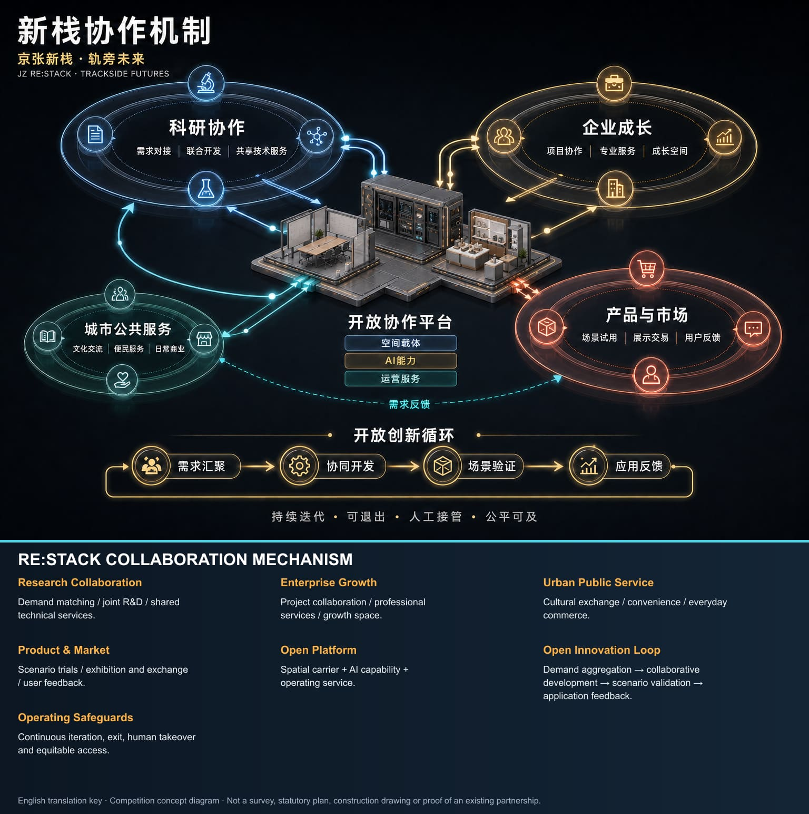

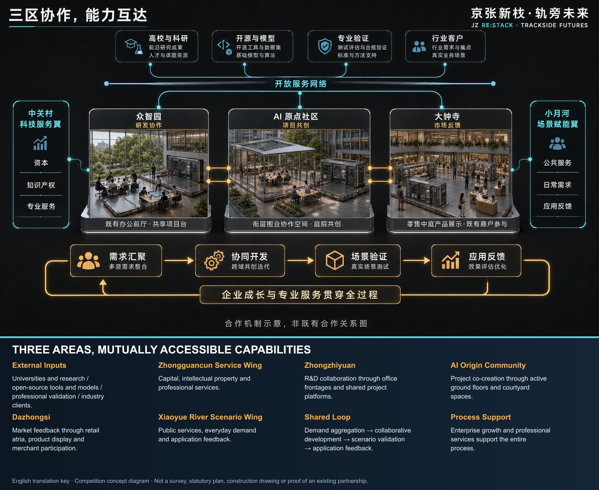

The Zhongguancun Technology Service Wing supplies capital, IP and professional services. The Xiaoyuehe Scenario Empowerment Wing links urban applications, daily needs and feedback. They form a horizontal support network with the three areas. Zhongguancun concentrates research, firms and services; the RE:STACK spine complements it through heritage public space, accessible nodes, validation, product experience and everyday urban interfaces.

Renewal begins with adaptive reuse. Walking and public frontages are improved along the spine; suitable ground floors, campus lobbies, commercial atria and managed open spaces receive RE:STACK interfaces. The proposal does not create capacity through wholesale demolition. Functional ratios, intensity, utility capacity and parking remain pending because statutory controls and ownership data are absent. The drawings show spatial relationships and renewal priorities, not control-plan amendments or engineering approvals. [data:geometry/land_use.geojson#LU-001]

## Detailed Design of the Three Key Areas

**Zhongzhiyuan** strengthens full-stack research, platform collaboration and suitable lightweight validation. Yuequan Road connects the railway-side park to the Xueyuan Road industry axis. RE:STACK focuses on campus entrances, research-building ground floors and managed shared lobbies, offering co-development, device access, exchange and public presentation for researchers, engineers, anchor firms and SMEs.

**AI Origin Community** strengthens translation, developer collaboration and enterprise growth. Cross-links meet the open innovation spine; Wudaokou Commercial Core and Zhichun Road Public-Service Core activate a network for university teams, established firms, start-ups, investors and talent households, combining collaboration, project support, training, daily service and public activity.

**Dazhongsi** strengthens product release, commercial co-creation and market feedback. The north-south spine and North Third Ring Road create a cross structure. The commercial core supports product experience, enterprise procurement, merchant co-creation, long-term display, everyday retail and public cultural activity, placing innovation in real footfall and operating conditions.

All three areas use the same review frame: positioning, structure, building interface, walking, public space, AI scenario and risk. Their working boundaries are user-confirmed; directional design remains useful, while precise construction quantities await official data. [data:geometry/key_areas.geojson#KEY-001] [data:geometry/key_areas.geojson#KEY-002] [data:geometry/key_areas.geojson#KEY-003]

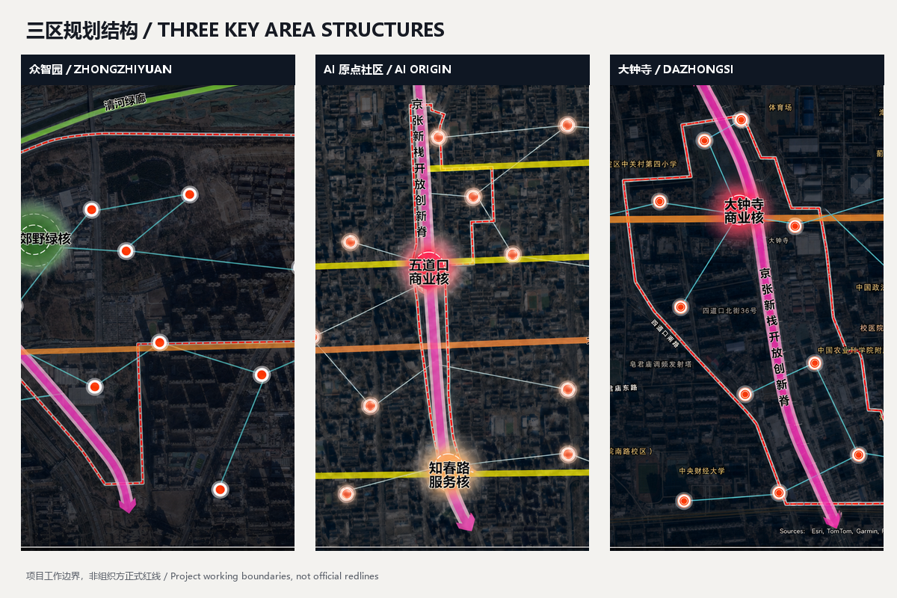

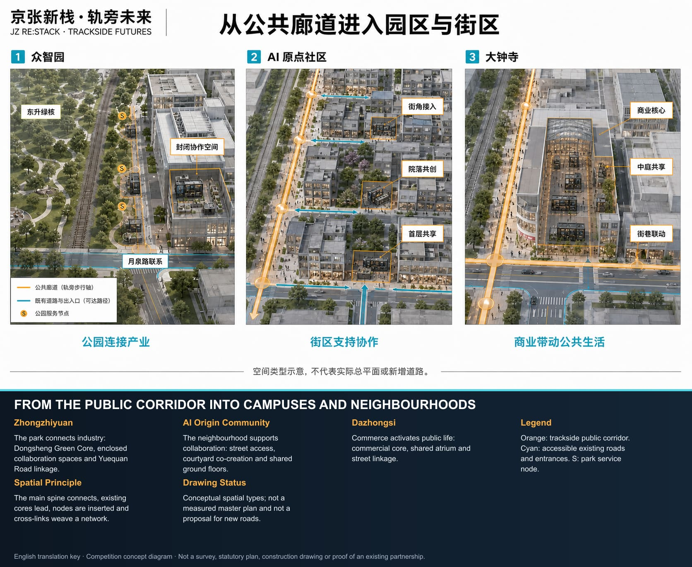

## AI Innovation Ecosystem, Personas and AI+ Scenarios

RE:STACK performs three perceptible actions. It aggregates needs and capabilities so teams, firms, merchants and service staff can find appropriate partners and space. It supports lightweight validation of software, models, interaction, low-risk robotic endpoints and product experiences in real but controlled conditions. It returns user, market, operational and public-service feedback to the next research and product cycle.

AI supports search, matching, recording and analysis. Human responsibility remains explicit for spatial access, project acceptance, publication and decisions affecting individual rights. AI capabilities iterate through limited trials, human review and gradual extension, with version records, rollback and exit conditions. Basic public services retain human and non-AI channels.

Every AI scenario follows a **one plug-in, one passport** lifecycle record. Ten auditable fields are required: service purpose, intended users, minimum data set, model and device version, physical interface, accountable human, equivalent non-AI service, trial boundary, stop/restoration trigger, and retention/publication status. The fixed AI core displays five operating states: offline/manual, sandbox, limited trial, open, and paused/retired. Movement to the next state requires human review. A missing owner, data-boundary breach, unresolved high-risk issue or failed human takeover forces the plug-in to pause and initiates removal or restoration. The passport turns pluggability, iteration and exit into inspectable records rather than slogans.

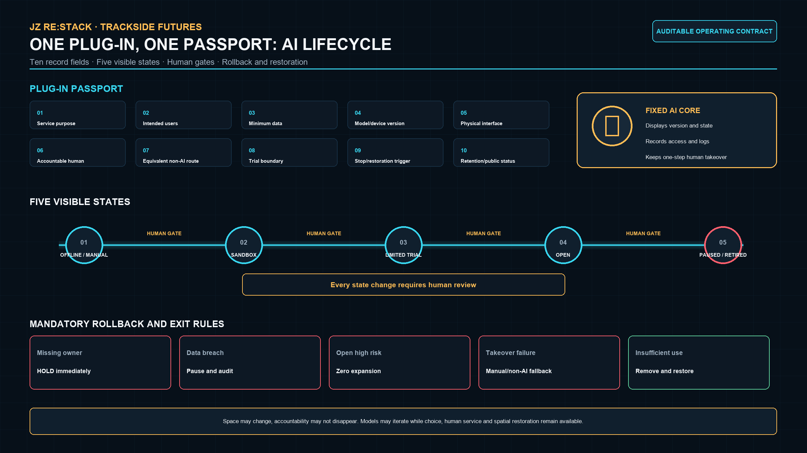

| User | Primary need | RE:STACK response | Human responsibility retained |
|---|---|---|---|
| Researchers and engineers | Cross-institutional work, devices, short projects | Capability search, collaboration and controlled validation | Research lead confirms method and result |
| Established/growing firms and developers | Clients, capital, IP, durable collaboration | Enterprise interfaces, open challenges, project rooms | Enterprise lead controls project and release |
| Merchants and enterprise buyers | Real footfall, experience and feedback | Trial, procurement experience and co-operation plug-ins | Merchant controls transaction, after-sales and claims |
| Residents and talent households | Service, learning, rest and non-AI choice | Public service, heritage, learning and activity plug-ins | On-site staff provide human and non-AI channels |
| Government, property and operators | Clear duties, booking, maintenance, safety and exit | Registry, permission, work orders and status | Responsible officer may suspend and review |

Ten scenario cards share a common record of user, space, AI capability, human responsibility and restoration on exit. [data:geometry/buildings.geojson#BLDG-001]

| # | Scenario plug-in | Priority space | AI capability | Operating and exit boundary |
|---:|---|---|---|---|
| 1 | Enterprise needs–research matching | Zhongzhiyuan M/L, Origin M | Search, matching, minutes | Both parties confirm; matches may be withdrawn |
| 2 | Model/software/interaction validation | Zhongzhiyuan L | Sandbox, version comparison, user tests | Never controls production; research lead signs off |
| 3 | Robotic endpoint short test | Controlled Zhongzhiyuan L | Device link, logs, anomaly cues | Low speed, separation, emergency stop; refer outward when needed |
| 4 | Enterprise-service Copilot | Origin M/XL | Service search and material checklist | Human adviser reviews; no approval or legal conclusion |
| 5 | Product launch, trial and feedback | Dazhongsi M/XL | Multilingual introduction, feedback clustering | Firm owns safety and after-sales; clear after event |
| 6 | Merchant co-development test | Dazhongsi S/M | Demand analysis, scheduling, anonymous statistics | Merchant completes transactions; no automated pricing or credit |
| 7 | Jing-Zhang AI heritage guide | Trackside S/M | Multilingual and accessible interpretation | Human-edited history; paper guide remains available |
| 8 | Accessible public-service navigation | Corridor S | Route and service information | Human inquiry remains; no unnecessary identity data |
| 9 | Resident learning and digital support | Neighbourhood S/M | Tiered teaching and content support | Staff support children, older people and low-digital-skill users |
| 10 | Event flow and safety review | XL venue | Aggregate warning and capacity prompts | No facial recognition or automatic enforcement; manager decides |

Scenarios 1–3 are industry validation scenarios limited to software, models, interaction, terminals and low-risk endpoint applications. They do not replace professional laboratories, production lines or statutory certification. A plug-in cannot open without a named operator, human controller, minimum-data record, version, opening hours, complaint route, exit condition and restoration plan.

## Land Use, Building Capacity and Retain–Adapt–Remove Strategy

Land use is represented as a mixed renewal structure in which innovation industry, public service, commerce and urban life support one another; it is not a new statutory land-use classification. Railway heritage, parkland, stable housing and effective industrial buildings are retained. Adaptation prioritises openable ground floors, idle lobbies, weak commercial edges and campus public space. Removal is limited to temporary or inefficient ancillary structures only after ownership, structure, fire and heritage review. New construction is principally reversible and demountable RE:STACK bases and essential service elements. [data:geometry/land_use.geojson#LU-001]

No building inventory, ownership, statutory FAR, density, height or underground-space data was supplied, so detailed quantities cannot be calculated. Based on imagery, interface types and key-area scale, the first-round use or adaptation of ground-floor/shared space is provisionally estimated at 30,000–60,000 sqm for capacity discussion only. Permanent new-build volume remains the minimum necessary. Official data will trigger a building-by-building audit of identity, ownership, floor area, structure, fire status and retain/adapt/remove/new-build category. [metric:total_floor_area_sqm]

## Mobility, Railway, Utilities and Public Services

Mobility uses existing north-south routes and verifiable east-west roads, public spaces and building passages; it does not invent roads. RE:STACK prioritises walking, cycling, bus and rail transfer, with legible entries at ring-road crossings, campus boundaries and large blocks. The Third and Fourth Ring Roads carry regional traffic; the RE:STACK corridor improves human-scale cross-links, walking continuity and public-service accessibility. [data:geometry/roads.geojson#ROAD-001]

No traffic survey, parking supply-demand data, rail ridership, utility alignment, energy capacity or communications baseline was supplied. Service radius, peak flow, parking and equipment load therefore cannot be calculated in detail. S/M nodes are intended for walking access and short stays. L/XL nodes share existing-building utilities with separate metering, isolation, network separation and manual takeover. Transport, utility, fire and property professionals must verify capacity before implementation. [source:USER-CONFIRMED-BOUNDARY-20260826]

## Blue-Green Space, Public Space and Urban Character

The heritage park is simultaneously a cultural symbol, scarce continuous public space and a physical corridor linking districts. RE:STACK sits beside rather than over the surviving railway. Spatial rhythm aligned with the track, continuous walking, protected heritage views and reversible demountable components establish a relationship without covering the heritage. Interpretation, walking, rest, cultural activity and innovation experience share one public interface. [data:geometry/green_space.geojson#GREEN-001] [data:geometry/public_space.geojson#PUBLIC-001]

Three landmark types form an updatable AI pilgrimage and honour-display system. The **Jing-Zhang Engineering Memory Stack** interprets independent engineering history and urban transformation at a representative heritage interface. The **Origin Co-creation Stack** displays open challenges, developer tools and authorised results. The **Dazhongsi Launch Stack** places products, merchant collaboration and public feedback in a real market. The same base and identity connect them, while content rather than excessive mass gives distinction. Honour displays record only verifiable contributors, versions, project links and public value, with correction and withdrawal routes; they never fabricate official awards.

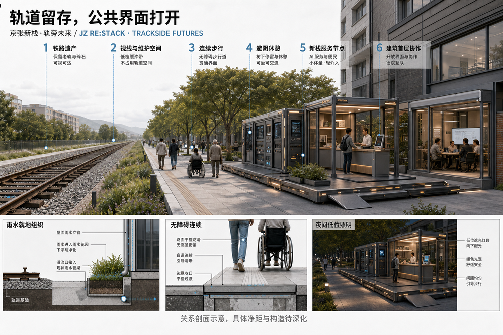

## Project List, Implementation Policy and Phasing

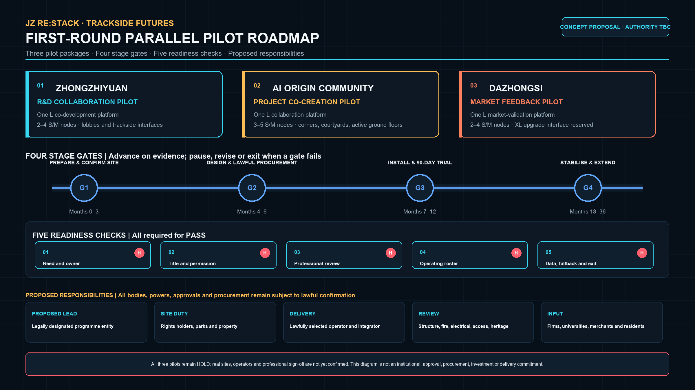

The near term uses S/M lightweight nodes and existing ground-floor interfaces at locations with clear maintenance, power, network and demand. The medium term adds L co-development and lightweight validation where sustained projects exist. The long term embeds XL city-scale venues in commercial or industrial buildings and mature node clusters. Progress depends on demand, space, equipment and responsibility, not installation count.

The proposal recommends that legally designated public-management and subdistrict actors coordinate policy and public safety. Rights holders and property managers provide rooms, access and facilities. Firms, universities, merchants and residents submit real needs. Operators manage catalogues, booking, referrals and maintenance. Technical teams remain responsible for model and product results. Specific institutions, duties, approvals, procurement and performance procedures remain subject to statutory authority and executed agreements.

The first round creates one independently reviewable pilot package in each key area rather than spreading all nodes at once: Zhongzhiyuan tests the professional interface among research ground floors, campus lobbies and trackside public entry; the AI Origin Community tests open challenges, project support and talent-life services; Dazhongsi tests product trial, merchant co-creation and customer feedback. All three pilots advance through four stages: G1 brief and site confirmation, G2 design and lawful procurement, G3 installation and a 90-day trial, and G4 stable operation and expansion. Every stage advances only when the same five HOLD/PASS readiness checks are complete.

| Stage | Core action | Proposed responsibility configuration (TBC) | Evidence for progression | Failure response |
|---|---|---|---|---|
| G1 Brief and site confirmation (months 0-3) | Confirm real need, site rights, responsibility and data boundary | Demand owner, rights holder/property and proposed operator | Five readiness checks recorded and risk list closed | Remain HOLD; do not develop or install |
| G2 Design and lawful procurement (months 4-6) | Develop design, complete professional review, bill of quantities and procurement preparation | Proposed programme entity, rights holder/property, design and procurement actors | Authority and permission confirmed, reviews closed and quotations verifiable | Revise design or pause procurement |
| G3 Installation and 90-day validation (months 7-12) | One plug-in, limited scope and staffed operation establish a real baseline | Operating and technical teams with the site-responsible party | Real use, repeated-use evidence and human review | Pause, revise or remove |
| G4 Stable operation and expansion (months 13-36) | Add compatible plug-ins, shared catalogues and traceable project referrals | Joint operating platform and district owners | No unresolved high risk; viable staff and funds; referrals traceable | Roll back, reduce hours or end interconnection |

Before opening, 100% of spaces and plug-ins must have named spatial, operational and technical owners. Every AI plug-in must have version, notice, human takeover, shutdown and restoration records. Basic public services must retain a human or non-AI route. Expansion is zero while a high-risk safety, privacy or rights issue remains unresolved. Demand response, repeat use, product improvement, merchant participation and annual attendance receive quantitative targets only after the pilot establishes a real baseline.

Each first-round pilot uses a **HOLD/PASS readiness checklist**. Five groups must be complete before PASS: a named need/challenge owner; rights-holder and property permission; structural, fire, electrical, accessibility and heritage review; operating and technical duty rosters; and a data-boundary, non-AI alternative and exit plan. Because no real site, operator or professional sign-off has yet been confirmed, all three packages remain HOLD at concept stage. This does not weaken the conceptual proposal; it prevents the work from being misread as construction-ready or already authorised.

Cost and procurement are managed in four packages: standard components, site connection, professional verification and annual operation. Platform bases, fixed AI cores and plug-ins are counted as standard units. Structure, power, network, fire, accessibility and restoration are itemised for each site. Qualified teams quote the required professional checks. Annual operation covers staff, maintenance, insurance, content and audit. Because no bill of quantities, connection survey, supplier quotations or operating contract was supplied, all cost figures below are low-confidence concept-stage ranges used only to understand implementation scale. Once sites and operators are confirmed, a bill of quantities, at least three quotations and a life-cycle cost sheet must include maintenance and removal.

### First-round Packages and Proposed Responsibility Configuration

The proposal recommends a legally designated programme entity to lead annual planning, cross-department coordination, statutory-approval coordination, funding assembly and performance review. Its organisational form could combine an innovation-belt coordinating body with a professional joint operating platform, but this proposal does not claim that any management committee or other authority has been established, approved or granted administrative power. District and subdistrict bodies may coordinate public safety, heritage, planning, construction, market regulation and resident communication within their statutory duties. Rights holders, parks and property managers confirm site rights, opening hours and facility conditions. A lawfully selected operator manages demand catalogues, booking, referrals, events, merchants and maintenance. The technical integrator manages the fixed AI core, cybersecurity, equipment, versioning and rollback. Qualified specialists complete required structural, fire, electrical, accessibility and heritage checks. Firms, universities, merchants and residents participate as challenge owners, collaborators, users and feedback providers. All named bodies, duties, approvals, procurement and performance procedures remain subject to statutory authority and executed agreements.

| First-round package | Core spatial action | Proposed lead and direct responsibility (TBC) | First-round deliverable |
|---|---|---|---|
| Co-ordination platform and open-service directory | Register needs, capabilities, sites, accountable owners and exit status across all three areas | Proposed legally designated programme entity leads; joint operator executes; relevant district and subdistrict bodies coordinate within statutory duties | One bilingual directory, opening rulebook, responsibility and version ledger |
| Zhongzhiyuan parallel pilot | One L collaboration platform in a research ground floor or campus lobby, plus 2-4 S/M nodes at trackside and Yuequan Road interfaces | Proposed programme entity convenes with park/rights holder; property, research firms and technical team implement by agreement | Closed loop for joint challenge, interface integration, lightweight validation and professional referral |
| AI Origin Community parallel pilot | One L project co-creation platform and 3-5 S/M nodes in street corners, courtyards or active ground floors | Proposed programme entity convenes with subdistrict and rights holder; operator, firms and community-service actors implement by agreement | Closed loop for open challenge, project support, talent-life service and public learning |
| Dazhongsi parallel pilot | One L market-validation platform in a commercial atrium or existing ground floor, with an XL upgrade interface and 2-4 S/M nodes | Proposed programme entity convenes with commercial rights holder/operator; merchants, firms and technical team implement by agreement | Closed loop for product trial, merchant co-creation, enterprise procurement experience and customer feedback |
| Heritage-corridor public interface | Orientation, rest, convenience and cross-connection nodes without covering railway remains | Proposed legally designated programme entity coordinates; park management, heritage specialists, subdistrict and operator collaborate within confirmed duties | Continuous public interface, heritage interpretation, accessible service and node wayfinding |

Eight handover records are required before real delivery: a site passport; title and permission record; structural/fire/electrical/accessibility/heritage checklist; data and privacy impact assessment; bill of quantities and at least three quotations; operating roster and emergency plan; plug-in passport and version ledger; and removal/restoration acceptance record. Together they convert the concept into a reviewable, procurable, operable and reversible delivery package.

### Prototype Connection Conditions and Professional Review

| Scale | Reference usable area | Estimated equipment load and network | Preferred interface | Mandatory before opening |
|---|---:|---|---|---|
| S | 20-80 sq m | 5-20 kW; 100 Mbps-1 Gbps | Trackside public space, corner or entrance | Bearing, electrical protection, accessibility, night lighting and heritage-interface review |
| M | 80-300 sq m | 20-60 kW; at least 1 Gbps | Courtyard, campus lobby or ground floor | Structure, electrical, egress, network isolation, drainage and property-maintenance plan |
| L | 300-1,000 sq m | 60-200 kW; 1-10 Gbps | Research building, shared space or commercial atrium | Separate metering, two-way egress, fire linkage, equipment-noise, data and personnel-safety review |
| XL | 1,500-5,000 sq m | 150-500 kW; 10 Gbps-class backbone | Existing industrial or commercial building and public interface | Whole-building fire, structural and MEP capacity review, operating permit, insurance and emergency plan |

These areas, loads and bandwidths are proposal-stage capacity estimates, not construction parameters. Nodes prioritise existing buildings and reversible, demountable components. Permanent foundations, major structural alteration, utility upgrades or heritage controls require separate survey, design and approval.

### Programme, Investment and Cost-effectiveness Estimate

| Period | Main task | Stage outcome |
|---|---|---|
| Months 0-3 | Collect demand, confirm site rights, select operator and inspect existing conditions | Three pilot briefs and closed risk lists |
| Months 4-6 | Develop design, complete professional review, bill of quantities and procurement | Confirm installation conditions and obtain three quotations |
| Months 7-9 | Fabricate components, connect sites, commission systems and train staff | Three parallel pilots ready for trial operation |
| Months 10-12 | 90-day limited, staffed validation | Operating baseline, issue register and expansion decision |
| Months 13-24 | Stable operation, compatible plug-ins and shared directory | Stable district services and traceable project referrals |
| Months 25-36 | Expand mature nodes, upgrade XL venues and connect external resources | Initial cross-area open-service network |

The three first-round parallel validation packages are estimated at **RMB 20-60 million** capital cost and **RMB 3-8 million** annual operation after opening. A three-year initial network of 12-18 S/M nodes, 3-5 L platforms and three XL venues in existing buildings is estimated at **RMB 100-300 million** cumulative capital cost and **RMB 15-40 million** annual operation at maturity. These low-confidence ranges exclude land acquisition, major structural reinforcement, large utility expansion and specialist heritage restoration.

After stabilisation, direct revenue from enterprise services, venues, events and brand collaboration is estimated to recover **40%-70%** of annual operating cost, compared with **20%-40%** during the pilot period. The public-service and heritage-culture balance may be supported through lawfully determined public-service procurement, park and property operation, joint enterprise challenges and social collaboration. Annual benefit references are 20,000-50,000 visits, 30-80 matched needs, 10-30 lightweight validations or product improvements, and 15-40 participating firms or merchants. These figures are not promises of investment return, transaction or attraction. Formal performance targets are confirmed after a real 90-day baseline by the legally designated performance owner under the applicable procedure and executed agreements.

Priority projects include trackside public-service access, Zhongzhiyuan co-development interfaces, Origin Community project and daily support, Dazhongsi merchant collaboration and product experience, Xiaoyuehe public experience, contribution display, node maintenance and cross-area events. [data:geometry/phasing.geojson#PHASE-001]

The annual rhythm is open challenge, collaborative development, public trial and feedback review. “JZ RE:STACK” extends into quarterly open challenges, co-development sprints, city trials and an annual Open Week. Developer communities maintain tools and lessons; operators maintain space and service; firms, researchers, merchants and residents participate as challenge owners, collaborators and users. Outcomes may become research partnerships, product improvements, procurement conversations, referrals to professional facilities or new research questions, while every investment, procurement or policy decision remains with the real responsible organisation. Bilingual cases, contributor records and reusable scenario cards become long-term brand assets. Plug-ins are reviewed annually and removed when use is insufficient, risk cannot be controlled or the responsible party exits. [data:geometry/phasing.geojson#PHASE-002]

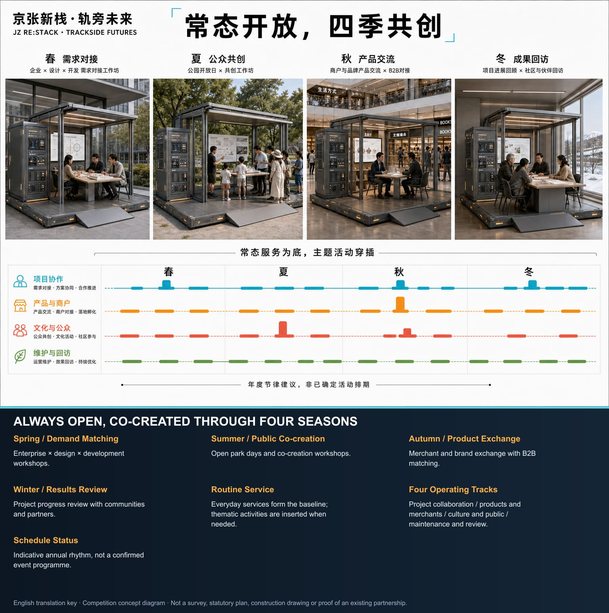

## Metrics, Area Recalculation and Compliance

No statutory boundary, complete building inventory, control intensity, ownership, utilities, full transport survey or operating baseline was supplied. Metrics depending on those inputs are formally recorded as unavailable for detailed calculation. Low-confidence references are provided only for capacity discussion and are not controls, engineering values, investments or performance promises.

The user-confirmed overall design working area recalculates to about 1,197 ha; key working areas are approximately 101 ha for Zhongzhiyuan, 71 ha for the AI Origin Community and 42 ha for Dazhongsi. Differences from announced approximate areas result from following real roads, geographic features and complete parcels. An initial capacity of 12–18 S/M nodes, 3–5 L platforms and one existing-building XL venue in each key area is a flexible operating estimate.

First-round adapted ground-floor/shared space is provisionally estimated at 30,000–60,000 sqm. Public service and everyday activity space is recommended at no less than 30% of open scenario nodes; industry collaboration, validation and display at roughly 50–60%; the remainder supports operation, equipment and flexible conversion. Walking connectivity, green ratio, FAR, density, height, parking and utility capacity require recalculation when official data arrive.

Machine metrics and operating metrics are managed separately. Geometry areas and ratios are recomputed from GeoJSON. Node counts, attendance and spatial capacity are calibrated after an operating baseline exists. Responsibility coverage, version records, manual takeover, non-AI service and high-risk closure are design gates checked before every opening. Each metric has a source, formula, confidence, recalculation trigger and updating role. [metric:site_area_sqm] [metric:green_ratio] [metric:public_space_ratio]

## Risk, Copyright and Compliance

All drawings and renderings are competition concepts, not official approvals, statutory redlines, built conditions or evidence of public consent. The user-confirmed boundaries are project working extents. Heritage limits, road redlines, controls, ownership, underground utilities, fire, flood and engineering conditions require later professional evidence. Generated visuals may infer height, facade and site detail from imagery and photographs and are not existing-condition survey evidence.

This proposal offers concept-stage spatial, technical and governance recommendations. It does not establish a government body or constitute an administrative approval, planning permission, procurement, investment, investment-attraction or implementation commitment. Responsibility diagrams are proposed configurations awaiting lawful confirmation. A real pilot may move from HOLD to PASS only after statutory authority, site rights, professional review, procurement procedure, operating agreements and public communication are in place.

AI scenarios involving faces, personal behaviour, enterprise data or commercial information use minimisation, purpose limitation, clear notice, human review and exit. Basic services retain non-AI choice. Agents cannot decide safety, approval, rights or other high-impact matters alone. Models, plug-ins and devices require version, rollback, shutdown and responsibility records.

Inclusion is an opening condition rather than the main slogan. Children, older people, disabled people, low-digital-skill residents and people without smartphones must be able to use basic services through readable signs, accessible interfaces, staff or non-AI channels. Small merchants and SMEs may apply without maintaining specialist technical teams. Urban back-end systems from which individuals cannot opt out require public notice, data minimisation, manual takeover and periodic audit.

All materials are used within their authorised scope. Provenance and use conditions for drawings, site photographs, satellite bases, public documents, generated images, sound and video are recorded in `sources.json` and `report/copyright_statement.md`. Offline HTML loads no remote script, map, font or tracker. [source:SITE-PACKAGE]

## References

- [source:OFFICIAL-ANNOUNCEMENT] Beijing Municipal Commission of Planning and Natural Resources, Haidian Branch, open-call announcement.
- [source:AGENT-TASKBOOK] `brief/site-package/agent_taskbook.json`, Agent tasks and output contract.
- [source:SITE-PACKAGE] `brief/site-package/`, public site package, standards, ranges and validation rules.
- [source:USER-CONFIRMED-BOUNDARY-20260826] User-confirmed project working boundary and provenance note.
- [source:JINGZHANG-RESEARCH-PACK] Project synthesis of public materials, site photographs, satellite imagery and existing plans.
- `sources.json`, `assumptions.json`, `metrics.json`
