# 京张新栈·轨旁未来

## 设计依据与资料清单

沿百年京张文化轴，构建一套可插接、可生长、内置 AI 能力的城市站台系统。它为科研机构、企业、开发者和商户搭建开放协作平台，也为城市居民提供便捷公共服务与多元活动空间。科创资源由此汇集，专业能力彼此衔接，沿线产业、商业与城市生活获得持续活力。

京张铁路曾以自主勘测、设计和建造回应中国现代化的时代命题。它连接远方，也曾在高密度城区形成横向阻隔。今天，京张遗址公园将交通边界转化为开放公共廊道；京张新栈则在沿线布置协作、服务和体验节点，使这条廊道进一步成为汇聚、连接和集散创新资源的城市平台。[source:OFFICIAL-ANNOUNCEMENT] [source:AGENT-TASKBOOK]

设计依据分为四级：官方公告和仓库任务书用于确认工作目标与强制成果；用户确认边界用于统一空间表达；公开规划、卫星影像和现场照片用于研判既有结构；生成图用于解释设计意图。组织方未提供法定边界、现状建筑普查、控规强度、权属、市政管线和完整交通调查，因此这些项目不得冒充实测结论。完整来源登记于 `sources.json`，假设登记于 `assumptions.json`，指标状态登记于 `metrics.json`。[source:SITE-PACKAGE]

方案对任务书的三大定位和五大功能作同一套空间转译：百年京张文化带由遗产公园、工程记忆和文化导览承载；都市 AI 生活体验带由公共服务、商业体验和居民活动插件承载；AI 融合创新带由协同开发、轻型验证和成果反馈承载。AI 全栈自主创新体系重点进入众智园，世界级 AI 创新生态重点由 AI 原点社区组织，智能原生新业态重点在大钟寺面向真实市场展开；AI+ 场景赋能贯穿三区并接入小月河场景赋能翼，可信 AI、开放审计和人类最终判断共同支撑 AI 治理的公共表达。三大定位、五大功能与三区两翼因此不是并列口号，而是由同一套新栈接口落实到不同空间和使用者。[source:AGENT-TASKBOOK]

## 三层范围工作框架

本方案同时面对三类真实矛盾：海淀科创资源高度集聚但跨机构协作入口分散；创新成果从研究到场景、市场的反馈链路不够可见；京张遗址公园提供了稀缺的连续公共空间，但产业、商业和日常服务需要进入沿线园区、建筑首层与城市节点才能长期运转。

范围采用用户确认的项目工作边界：统筹研究范围和总体设计范围依据公告文字四至，以卫星图和街道图为基础沿道路中线推演；三处重点区域以公告点名要素为锚点，兼顾主导功能、京张铁路遗址与完整用地，沿道路和地理要素手工校准。未采用“质心加面积外扩为正方形”的机械推演，因为它虽可拟合面积，却可能遗漏关键要素并割裂真实街区。该边界用于设计研究，不是组织方正式红线或审批依据。[source:USER-CONFIRMED-BOUNDARY-20260826] [data:geometry/site_boundary.geojson#SITE-001]

统筹研究范围用于判断京张新栈与中关村科创廊道、学院路科研产业带、两条环路交通廊道以及外围蓝绿体系的互补关系；总体设计范围用于落实开放创新主脊、四个既有核心、植入节点和横向联系；重点区域范围用于开展众智园、AI 原点社区和大钟寺的空间结构、建筑接入、公共空间及实施项目设计。三层范围由战略关系逐级收敛到可进入的建筑和节点，面积均以用户工作边界复算，正式红线到位后整体替换并重算。[data:geometry/key_areas.geojson#KEY-001]

## 核心概念与总体设计

“新栈”把铁路系统与计算机技术共有的“栈”转译为空间母题：铁路货栈曾承担集散与转运，技术栈负责能力叠加与接口协同；城市新栈则成为资源接入、协作发生、服务输出和持续迭代的开放接口。它不是一次性地标，而是一套可以进入公园、园区、街角、院落、建筑首层和商业中庭的空间家族。

**30 秒识别。** 沿百年轨道的一侧，一组低矮平台、深灰框架与暖金接口灯连续出现：固定 AI 核心显示开放状态，可替换插件在众智园成为联合开发台，在原点社区成为共创与公共服务节点，在大钟寺成为产品体验与商业协作界面。普通创新走廊主要组织土地和企业，普通绿道主要组织景观和慢行，孤立的 AI 展亭主要展示技术；京张新栈把遗产公共廊道、开放接口、AI 能力和可逆空间叠成一套能被进入、调用、更新和退出的城市系统。铁路语言由此不只是造型符号，而成为项目的空间与运行契约。

每个新栈由三部分构成：平台基座提供结构、能源、网络、照明、无障碍与公共停留条件；固定 AI 核心接入模型、边缘算力、设备端口、人与 Agent 协作界面及人工控制；可替换场景插件承载科研协作、轻型验证、产品展示、公共服务、文化活动和商业经营。S/M/L/XL 四种尺度从轨旁公共节点、共享协作空间、协同开发与轻型验证平台，扩展到依托既有建筑形成的城市级创新场所。[data:geometry/buildings.geojson#BLDG-001]

品牌识别延续同一系统基因：中文主名“京张新栈”和英文名“JZ RE:STACK”共同指向接口、叠加与更新；标志方向以平行轨线和开放接口括号构成可延展图形，暖金色接口灯带标识可接入节点，深灰金属、浅色玻璃和木质触点形成统一材料语言。导视不复制企业商标，而以“尺度—能力—开放状态”三级信息帮助专业使用者和城市居民判断一个节点能做什么、由谁负责、是否开放。

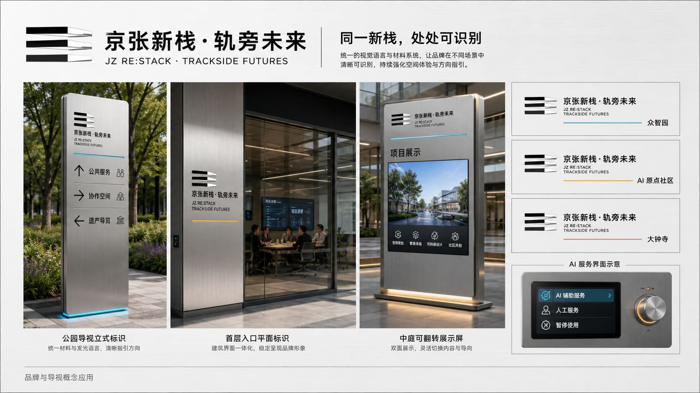

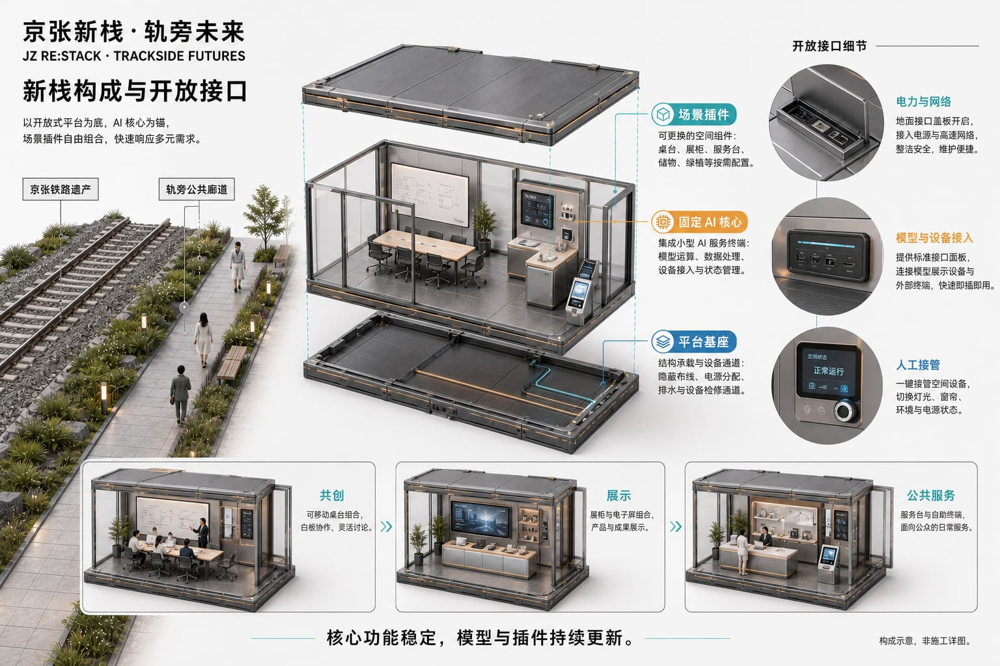

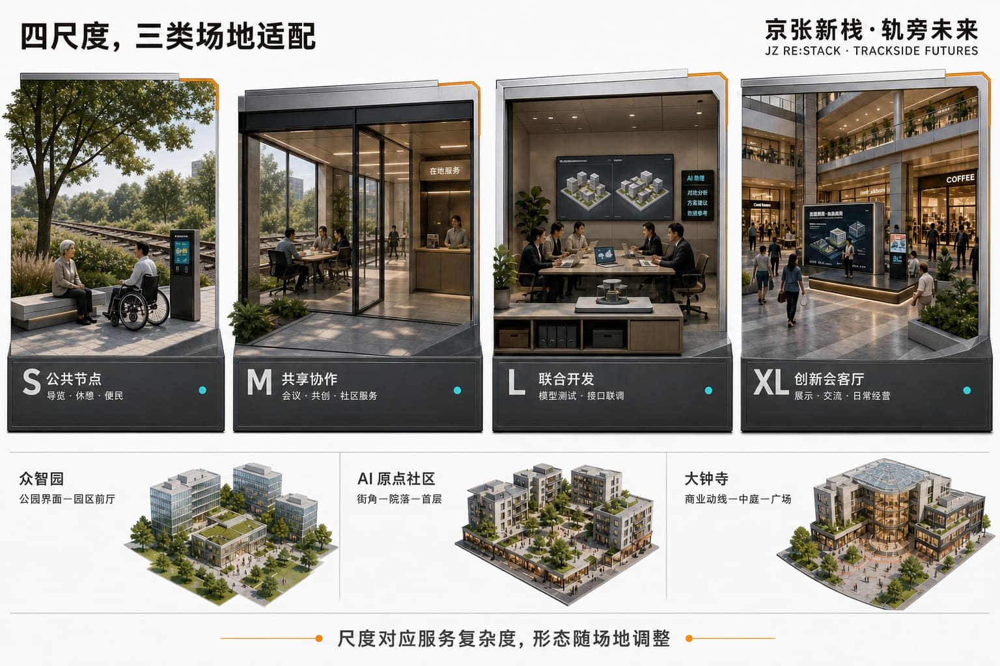

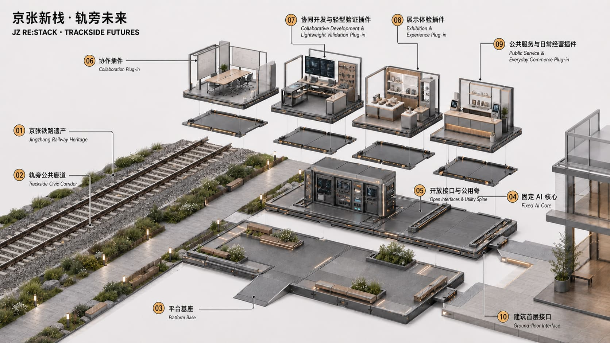

## 统筹研究范围产业与未来城市研究

产业定位不是复制一条高密度企业走廊，而是补足科研、企业、产品、市场与城市生活之间缺少的开放接口。中关村科创廊道继续承担科研机构、龙头企业和专业服务的高强度集聚；京张新栈开放创新脊依托遗产公园和沿线建筑，把协同开发、轻型验证、公共体验、市场反馈与生活服务带到可进入的城市界面。方案名与识别系统以“栈”的接口、叠加和迭代含义为核心，统一使用平台基座、固定 AI 核心、可替换场景插件及暖金色接口灯带形成视觉识别。[source:AGENT-TASKBOOK]

六类案例为方案提供方法而非形式照搬：Boston Seaport 说明科研与公众滨水空间可以并置；King's Cross 展示遗产更新、教育和商业长期运营的组合；22@Barcelona 提供创新街区与混合城市生活协同的经验；Station F 说明大型共享平台如何支撑创业与企业服务；Sidewalk Toronto 的争议提示数据治理和公众授权必须前置；深圳南山与杭州未来科技城则说明企业、高校、公共服务和城市展示需要跨园区网络化连接。其共同启示是：创新基础设施既要有专业能力，也要有低门槛入口、真实使用者和可持续运营。[source:JINGZHANG-RESEARCH-PACK]

新栈把七类分散要素组织成可调用的服务目录：土地和空间由产权方、园区与物业确认开放条件；产业需求由企业和商户提出；人才通过高校、开发者社区和专业机构进入；资金与知识产权由中关村科技服务翼连接；算力、模型与数据按授权边界接入固定 AI 核心；城市应用和公众反馈由小月河场景赋能翼及沿线节点回流。它不承诺把所有资源搬入场地，而是让资源的名称、责任人、接入条件、服务时段和退出状态可被找到。

区域协同采用“目录互认、课题互发、场景互荐、结果回流”四类接口：面向北纬社区、未来科学城、怀柔科学城、经开区和京津冀合作节点发布可公开的需求与能力目录，把需要大型实验条件、制造或专业认证的任务转介到场外，把适合城市体验和市场反馈的成果带回京张沿线。所有合作关系须由真实主体确认后登记，概念图中的网络只表达可达关系，不冒充既有合作事实。

## 总体设计范围城市更新与控规深度城市设计

空间结构遵循“主脊贯通—核心带动—节点植入—横链织网”。京张遗址公园形成开放创新主脊；由南向北，大钟寺商业核心、知春路公共服务核心、五道口商业核心和东升郊野绿核带动沿线；新栈进入真实可用的公共界面和建筑空间；东西向横链把主脊接入中关村科技服务、学院路科研产业、商业客流、社区生活与更广阔的城市网络。[data:geometry/roads.geojson#ROAD-001]

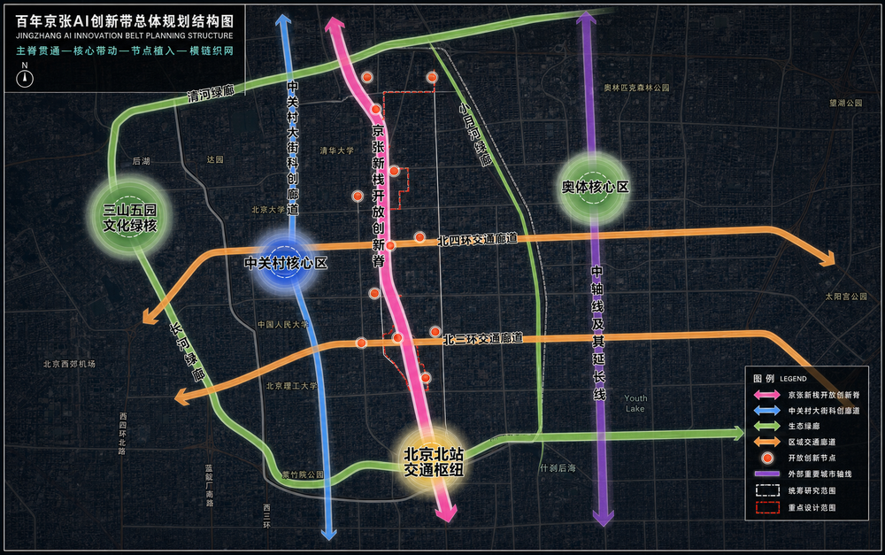

产业逻辑由“一条跨区域开放创新链、三个场地重点强化的循环、一张连接场内外资源的网络”构成。基本原则是“不追求全链自给，而追求全链可达”。新栈以“需求汇聚—协同开发—场景验证—应用反馈”组织循环；资本、知识产权、专业服务、制造和场外工程验证通过开放接口被找到、接入与调用。

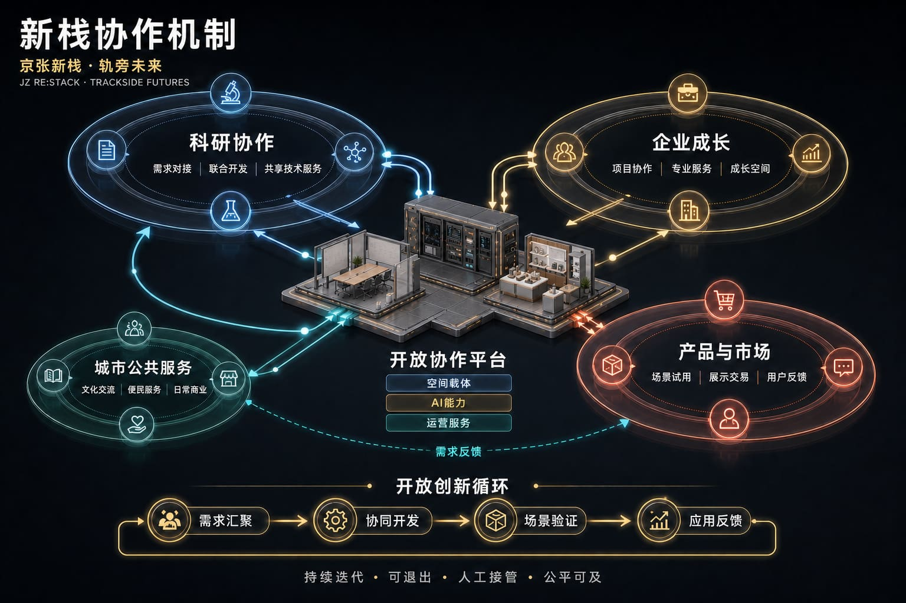

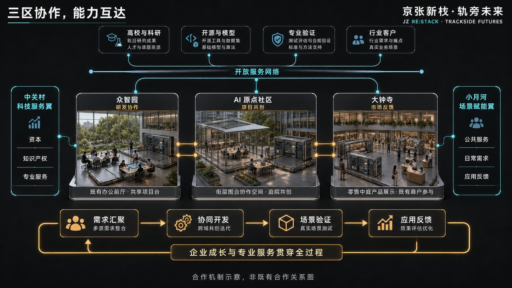

中关村科技服务翼提供资本、知识产权和专业服务，小月河场景赋能翼连接城市应用、日常需求与反馈渠道。两翼与三区形成横向支撑网络，而不是新的空间母题。中关村科创廊道偏重高密度科研、企业和专业服务集聚；京张新栈开放创新脊则以遗产公共空间、可进入节点、场景验证、产品体验和城市生活界面与其互补。

城市更新以存量适配为先：沿主脊改善步行与公共界面，在核心周边选择建筑首层、园区前厅、商业中庭和可管理开放空间接入新栈；不以大拆大建制造产业容量。由于缺少法定控规和权属数据，功能比例、建筑强度、市政承载与停车指标均作为待确认项；当前图件表达空间关系和更新优先级，不构成控规修改或工程审批结论。[data:geometry/land_use.geojson#LU-001]

## 重点区域详细设计

众智园强化全栈研发、平台协作和适宜的轻型技术验证。铁路沿线公园与学院路产业轴通过月泉路接口联系，新栈重点进入园区门户、研发建筑首层和可管理的共享前厅，为科研人员、工程师、龙头企业与中小企业提供联合开发、设备接入、成果交流和公共展示条件。

AI 原点社区强化成果转化、开发者协作和企业成长。沿开放创新主脊组织横向联系，以五道口商业核心与知春路公共服务核心带动，形成面向高校团队、现有企业、创业团队、投资及人才家庭的共享协作、项目陪伴、培训交流、生活服务和公共活动网络。

大钟寺强化产品发布、商业共创和市场反馈。以南北主脊和北三环横向交通形成十字骨架，依托商业核心组织产品体验、企业采购、商户共创、长期展示、日常零售和公共文化活动，使创新成果进入真实客流与长期经营环境。

三处重点区均执行“定位—结构—建筑接入—慢行—公共空间—AI 场景—风险”的同一框架。众智园以研发建筑和学院路资源为专业支撑、以轨旁绿地为公共入口；AI 原点社区以纵向主脊和横向协同轴连接五道口商业核心、知春路公共服务核心及多个开放节点；大钟寺以北三环和京张主脊形成十字骨架。边界属于用户确认工作范围，方向性设计有效，精确建设规模须待官方数据复核。[data:geometry/key_areas.geojson#KEY-001] [data:geometry/key_areas.geojson#KEY-002] [data:geometry/key_areas.geojson#KEY-003]

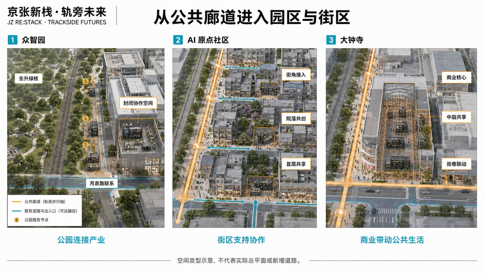

## AI 创新生态、人才画像与 AI+ 场景

新栈承担三类可感知动作：汇聚需求和能力，让团队、企业、商户与服务人员更容易找到合适伙伴和空间；在真实但可控的环境中开展软件、模型、交互、机器人末端应用和产品体验等轻型验证；把用户、市场、运营与公共服务反馈回流到下一轮研究和产品改进。

场景覆盖科研协作、Agent 共创、端侧模型与设备接入、产品发布、商户联合开发、文化导览、便民服务、无障碍支持和城市居民学习体验。AI 辅助检索、匹配、记录与分析，空间使用、项目接受、公开发布和影响个人权益的决定保留明确的人类责任人。

AI 能力按“小范围验证—人工复核—逐步扩展”迭代，保留版本记录、回退与退出条件。公共服务保留人工和非 AI 通道，不以智能终端或非必要数据授权作为获得基本服务的前提。低效、失效或产生不可接受风险的功能可暂停、替换或撤除，释放的空间恢复为通用协作、公共服务、居民活动或日常经营场所。

每个 AI 场景执行“**一插件一护照**”的生命周期登记。护照包含十项可核对字段：服务目的、目标使用者、最小数据集、模型与设备版本、物理接口、人工责任人、等效非 AI 服务、试用边界、停用与复原触发条件、记录保存与公开状态。固定 AI 核心持续显示五种运行状态：离线/人工、沙盒、限量试用、正式开放、暂停/退役。只有在人工复核通过后才能从前一状态进入下一状态；任何责任人缺失、数据越界、高风险事项未关闭或人工接管失效，均进入暂停状态并启动撤除或复原。护照使“可插接、可迭代、可退出”成为可查记录，而不是技术口号。

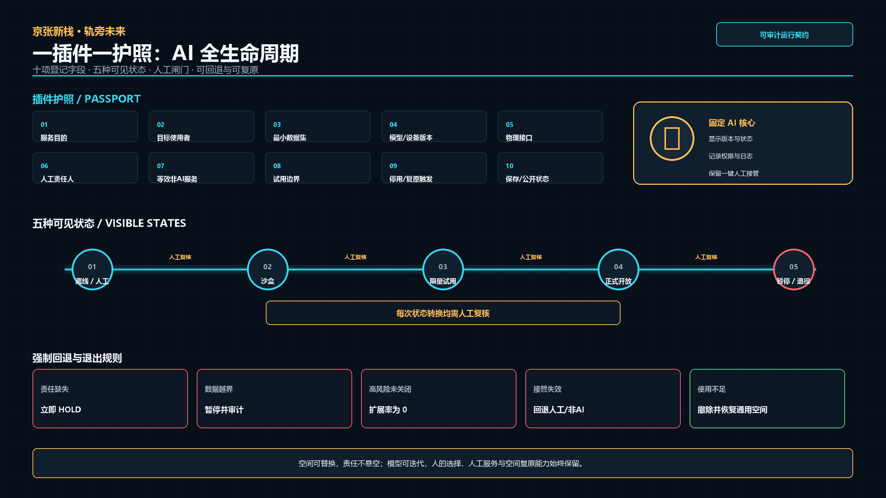

五类核心使用者被转译为可核对的服务关系：[source:AGENT-TASKBOOK]

| 使用者 | 主要需求 | 新栈响应 | 不被替代的人工责任 |
|---|---|---|---|
| 科研人员与工程师 | 跨机构协作、设备接入、短期项目空间 | 能力检索、协作插件、受控轻型验证 | 研究负责人确认方法和结果 |
| 现有企业、成长企业与开发者团队 | 客户、资本、知识产权、持续协作 | 企业服务接口、开放课题、项目房间 | 企业负责人决定项目和发布 |
| 商户与企业采购者 | 真实客流、产品体验、经营反馈 | 展示试用、采购体验、联合经营插件 | 商户负责交易、售后和承诺 |
| 城市居民与人才家庭 | 便民服务、学习活动、休憩、非 AI 选择 | 公共服务、文化导览、学习与活动插件 | 现场人员提供人工与非 AI 通道 |
| 政府、物业与运营团队 | 责任、预约、维护、安全和退出 | 统一台账、权限、工单与状态面板 | 有权暂停开放并组织专业复核 |

十张场景卡共用“对象—空间—AI 能力—人工责任—退出恢复”五项登记：[data:geometry/buildings.geojson#BLDG-001]

| # | 场景插件 | 优先空间 | AI 能力 | 运行与退出边界 |
|---:|---|---|---|---|
| 1 | 企业需求与科研能力匹配 | 众智园 M/L、原点社区 M | 检索、匹配、会议纪要 | 项目双方人工确认，误配可撤回 |
| 2 | 模型、软件与交互原型验证 | 众智园 L | 沙盒、版本比较、用户测试 | 不接管生产系统，结果由研发负责人签收 |
| 3 | 机器人末端设备短时测试 | 众智园可控 L | 设备接入、日志与异常提示 | 低速、隔离、人工急停；超范围转专业场地 |
| 4 | 企业服务 Copilot | 原点社区 M/XL | 政策与服务检索、材料清单 | 人工顾问复核，不作审批或法律结论 |
| 5 | 产品发布、试用与客户反馈 | 大钟寺 M/XL | 多语介绍、反馈聚类 | 企业负责产品安全与售后，活动后清场 |
| 6 | 商户联合开发与经营测试 | 大钟寺 S/M | 需求分析、排期与匿名统计 | 交易由商户完成，不自动定价或授信 |
| 7 | 京张遗产 AI 导览 | 轨旁 S/M | 多语讲解、无障碍内容 | 史实经人工编辑审核，可切换纸质导览 |
| 8 | 无障碍与公共服务导航 | 沿线 S | 路径与服务信息提示 | 保留人工问询，不采集非必要身份信息 |
| 9 | 居民学习与数字技能支持 | 社区 S/M | 分级教学、内容辅助 | 儿童、老人及低数字技能者可由人员陪同 |
| 10 | 活动客流与公共安全复核 | XL 活动场所 | 汇总预警、容量提示 | 不做人脸识别和自动执法，现场负责人决策 |

其中 1—3 为产业测试验证场景，限定在软件、模型、交互、终端和低风险末端应用，不替代专业实验室、制造线或法定认证。场景台账记录数据最小集、运营主体、人工责任人、版本、开放时段、投诉渠道、退出条件和空间恢复方式；没有责任人或无法提供人工接管的插件不得开放。

## 用地、建筑规模与拆改留方案

总体用地表达为科创产业、公共服务、商业和城市生活相互支持的复合更新结构，而非新的法定用地分类。保留京张遗产、公园绿地、稳定居住与有效产业建筑；改造对象优先为可开放首层、闲置前厅、低效商业界面和园区公共空间；可拆除对象仅限经产权、结构、消防与文保复核后确认的临时或低效附属构筑物；新建以可逆、可拆装的新栈基座和必要服务构件为主。[data:geometry/land_use.geojson#LU-001]

组织方未提供现状建筑清查、权属、法定容积率、建筑密度、高度和地下空间数据，因此无法详细测算拆改留面积与开发强度。依据现状影像、可接入空间类型和三处重点片区规模，暂估首轮利用或更新建筑首层及共享空间约 3—6 万平方米，仅供方案容量参考；永久新建建筑量控制在最低必要水平。待官方建筑和控规数据到位后，按“建筑编号—产权—现状面积—结构安全—消防—保留/改造/拆除/新建”逐栋复核并更新指标。[metric:total_floor_area_sqm]

## 交通、轨道、市政与公共服务设施

交通组织以现有南北主脊和可核实的东西向道路、公共空间及建筑通道为基础，不虚构道路。新栈优先服务轨旁步行、骑行、公交与轨道接驳，在跨越环路、园区边界和大型地块处形成可识别入口。北三环、北四环承担区域交通；京张新栈重点改善近人尺度的横向联系、慢行连续性和公共服务可达性。[data:geometry/roads.geojson#ROAD-001]

组织方未提供交通调查、停车供需、轨道客流、市政管线、能源容量和通信设施数据，因此相关服务半径、峰值人流、停车及设备负荷无法详细测算。参考现状道路层级和轻量节点容量，建议 S/M 节点以步行服务和短时停留为主，L/XL 节点与既有建筑市政系统共用并设置独立计量、断电、网络隔离和人工接管；具体容量仅供参考，实施前须由交通、市政、消防和物业专业复核。[source:USER-CONFIRMED-BOUNDARY-20260826]

## 蓝绿空间、公共空间与城市风貌

京张遗址公园是文化符号、稀缺的连续公共空间和串联片区的物理廊道。新栈位于轨道两侧及邻近城市空间，不覆盖遗存轨道；通过与轨道走向呼应的空间节奏、连续步行界面、清晰遗产视廊和可逆、可拆装的轻量构件建立联系。遗产展示、慢行通达、休憩交往、文化活动和创新体验在同一公共界面中协同。[data:geometry/green_space.geojson#GREEN-001] [data:geometry/public_space.geojson#PUBLIC-001]

三类标志节点构成可持续更新的 AI 朝圣与荣誉展示体系：京张工程记忆栈在代表性遗产公共界面讲述自主工程史与历次城市转型；原点共创栈展示开放课题、开发者工具和经授权的协作成果；大钟寺发布栈让产品、商户共创和公众反馈进入真实市场。三者使用同一基座和识别语言，但由内容而非夸张体量形成辨识度。荣誉展示只记录可核验的贡献者、版本、项目链接和公共价值，允许纠错和撤回，不制造未经确认的“官方荣誉”。

## 更新项目清单、实施政策与分期计划

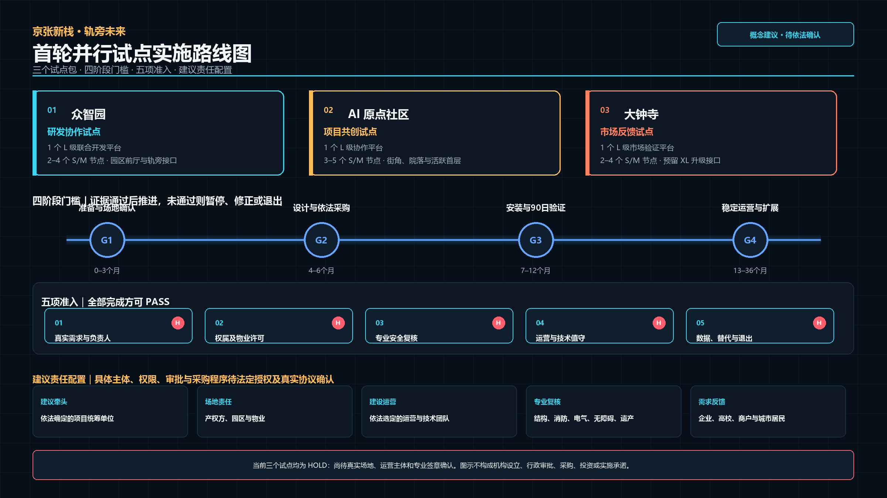

近期以 S、M 级轻量节点和既有建筑首层接入为主，选择维护责任清楚、具备供电网络和真实需求的位置开展试点；中期在持续项目需求明确的园区和共享空间配置 L 级协同开发与轻型验证平台；长期依托商业综合体、产业建筑和多个成熟节点形成 XL 级城市创新场所。阶段推进取决于需求、空间、设备与运营责任是否具备，不以装置数量作为唯一成果。

建议由依法确定的公共管理与街道协同主体承担公共安全和政策协调，空间提供方与物业负责房间、通行和设施保障，企业、高校、商户与居民共同提出真实需求，运营团队负责服务目录、预约、项目转介和维护，技术团队对模型和产品结果负责。具体机构、职责、审批、采购与绩效程序均待法定授权和真实协议确认。观察指标包括需求响应、重复使用、验证改进、商户支持、公共服务可用和运营可持续性。

首轮不是同时铺开全部节点，而是每个重点片区形成一个可独立评估的试点包：众智园验证“研发建筑首层—园区前厅—轨旁公共入口”的专业协作接口；AI 原点社区验证“开放课题—项目陪伴—人才生活服务”的持续协作接口；大钟寺验证“产品试用—商户共创—客户反馈”的市场接口。三个试点均按 G1 准备与场地确认、G2 设计与依法采购、G3 安装与 90 日验证、G4 稳定运营与扩展四个阶段推进；每一阶段只有在五项 HOLD/PASS 准入检查全部通过后方可进入下一阶段。

| 阶段 | 核心动作 | 建议责任配置（待确认） | 进入下一阶段的证据 | 失败处理 |
|---|---|---|---|---|
| G1—准备与场地确认（0—3 个月） | 确认真实需求、场地权利、责任与数据边界 | 需求方、产权/物业、拟议运营方 | 五项准入形成记录，风险清单关闭 | 保持 HOLD，不深化、不安装 |
| G2—设计与依法采购（4—6 个月） | 方案深化、专业复核、工程量清单与采购准备 | 建议统筹单位、产权/物业、专业设计与采购主体 | 权限和许可明确，专业意见闭合，报价可核验 | 修改设计或暂停采购 |
| G3—安装与 90 日验证（7—12 个月） | 单一插件、小范围、人工值守，形成真实基线 | 运营与技术团队、场地责任主体 | 有真实使用记录、复用证据和人工复盘 | 暂停、修正或撤除插件 |
| G4—稳定运营与扩展（13—36 个月） | 增加兼容插件，推进三区目录互认和项目转介 | 联合运营平台及各片区责任人 | 无未关闭高风险事项，资金和人员可持续，转介可追踪 | 回退、降低时段或终止互联 |

实施评价使用可直接检查的底线指标：开放前 100% 明确空间、运营和技术责任人；100% AI 插件具有版本、告知、人工接管、停用和空间恢复记录；基本公共服务 100% 保留人工或非 AI 方式；出现未关闭的安全、隐私或权利高风险事项时扩展率为 0。需求响应、重复使用、验证改进、商户参与和年度人次在首轮试点形成基线后再设量化提升目标，避免用无来源数字倒推绩效。

首轮试点采用 **HOLD/PASS 准入清单**。需求方和挑战负责人、场地权利人与物业许可、结构/消防/电气/无障碍/遗产专业复核、运营与技术值守名单、数据边界/非 AI 替代/退出方案五项全部具备方可标记 PASS；任一项缺失均保持 HOLD。当前方案处于概念阶段，尚无已确认的真实场地、运营者和专业签章，因此三个试点包当前均为 HOLD。这一状态不影响概念设计完整性，但明确阻止其被误读为可直接施工或开放。

成本与采购按“标准组件、场地接入、专业核查、年度运营”四个包管理。标准组件以平台基座、固定 AI 核心和插件为计量单元；场地接入单列结构、电力、网络、消防、无障碍和恢复费用；专业核查由相应资质团队报价；年度运营覆盖人员、维护、保险、内容与审计。由于缺少工程量清单、接入条件调查、供应商报价和运营合同，下列造价均为概念阶段低置信度区间，仅用于判断实施量级。场地和运营主体确认后须形成工程量清单、至少三方询价和全生命周期成本表，并把维护与撤除费用同时纳入决策。

### 首轮项目包与建议责任配置

建议由依法确定的项目统筹单位牵头年度计划、跨部门协调、依法报批协调、资金组合和绩效复核。其组织形式可参考“创新带统筹机构 + 专业联合运营平台”，但本方案不主张任何管委会或其他机构已经设立、获批或取得行政权限。街道及区级相关部门可在法定职责内协同公共安全、遗产、规划建设、市场和居民沟通；产权方、园区与物业确认场地权利、开放时段和设施条件；经依法选定的专业运营机构管理需求目录、预约、项目转介、活动、商户和维护；技术集成方管理固定 AI 核心、网络安全、设备、版本和回退；具备相应资质的结构、消防、电气、无障碍和遗产专业单位完成必要核查。企业、高校、商户和城市居民分别作为需求方、共创方、使用者和反馈方参与。具体主体、职责、审批、采购和绩效程序以法定授权及后续协议为准。

| 首轮项目包 | 核心空间动作 | 建议牵头与直接责任（待确认） | 首轮可交付成果 |
|---|---|---|---|
| 统筹平台与开放服务目录 | 建立三区统一的需求、能力、场地、责任人和退出状态台账 | 建议由依法确定的统筹单位牵头，联合运营机构执行，相关区级部门与街道依法协同 | 1 套双语目录、1 套开放规则、1 套责任与版本台账 |
| 众智园并行试点 | 研发建筑首层或园区前厅配置 1 处 L 级协同平台，轨旁及月泉路接口配置 2—4 处 S/M 节点 | 建议由统筹单位会同园区/产权方组织，物业、科研企业和技术方按协议实施 | 联合课题、接口联调、轻型验证和专业转介闭环 |
| AI 原点社区并行试点 | 街角、院落或活跃首层配置 1 处 L 级项目共创平台和 3—5 处 S/M 节点 | 建议由统筹单位会同街道及场地权利人组织，运营方、企业和社区服务主体按协议实施 | 开放课题、项目陪伴、人才生活服务和公众学习闭环 |
| 大钟寺并行试点 | 商业中庭或既有首层配置 1 处 L 级市场验证平台，预留 XL 升级接口，并配置 2—4 处 S/M 节点 | 建议由统筹单位会同商业产权/运营方组织，商户、企业和技术方按协议实施 | 产品试用、商户共创、企业采购体验和客户反馈闭环 |
| 遗产廊道公共接口 | 在不覆盖铁路遗存的前提下设置导览、休憩、便民和跨向连接节点 | 建议由依法确定的统筹单位协调，公园管理、遗产专业单位、街道和运营方按职责协作 | 连续公共界面、遗产展示、无障碍服务和节点导向系统 |

正式实施前形成八项可交接记录：场地护照，权属与许可记录，结构/消防/电气/无障碍/遗产复核表，数据与隐私影响评估，工程量清单与不少于三方询价，运营值守与应急预案，插件护照与版本台账，撤除复原验收记录。它们共同把概念方案转换为可审查、可采购、可运营、可退出的实施交接包。

### 原型接入条件与专业复核

| 尺度 | 参考使用面积 | 预估设备负荷与网络 | 优先接入位置 | 开放前必须完成 |
|---|---:|---|---|---|
| S | 20—80 m² | 5—20 kW；100 Mbps—1 Gbps | 轨旁公共空间、街角、入口 | 基础承载、触电防护、无障碍、夜间照明和遗产界面复核 |
| M | 80—300 m² | 20—60 kW；不低于 1 Gbps | 院落、园区前厅、建筑首层 | 结构、电气、消防疏散、网络隔离、排水和物业维护方案 |
| L | 300—1,000 m² | 60—200 kW；1—10 Gbps | 研发建筑、共享空间、商业中庭 | 独立计量、双路疏散、消防联动、设备噪声、数据与人员安全评估 |
| XL | 1,500—5,000 m² | 150—500 kW；10 Gbps 级主干接口 | 既有产业或商业建筑及其公共界面 | 建筑整体消防、结构与机电容量复核，运营许可、保险及应急预案 |

上述面积、负荷和带宽是方案阶段的接入容量预估，不是施工参数。所有节点优先利用既有建筑和可逆、可拆装构件；涉及永久基础、重大结构改造、市政扩容或遗产保护控制时，须另行完成勘察、设计和审批。

### 时间、投资与成本效益预估

| 时段 | 主要任务 | 阶段成果 |
|---|---|---|
| 0—3 个月 | 需求征集、场地权利确认、运营主体遴选、现状检测 | 三个试点任务书及风险清单 |
| 4—6 个月 | 方案深化、专业复核、工程量清单和采购 | 施工/安装条件确认及三方询价 |
| 7—9 个月 | 构件生产、场地接入、系统联调和人员培训 | 三个并行试点具备试运行条件 |
| 10—12 个月 | 90 日小范围人工值守验证 | 使用基线、问题清单和是否扩展的决定 |
| 13—24 个月 | 稳定运营、兼容插件增加、三区目录互认 | 片区稳定服务和可追踪项目转介 |
| 25—36 个月 | 成熟节点扩展、XL 场所升级和场外资源接入 | 初步形成跨区开放服务网络 |

首轮三个并行验证包预估建设投入约 **2,000—6,000 万元**，开放后年度运营约 **300—800 万元**；三年形成 12—18 个 S/M 节点、3—5 个 L 平台和 3 个依托既有建筑的 XL 场所，预估累计建设投入约 **1—3 亿元**、稳定期年度运营约 **1,500—4,000 万元**。以上区间不含征地拆迁、重大结构加固、大规模市政扩容和专项遗产修缮，仅供概念阶段比较。

稳定运行后，直接经营收入及企业服务、场地、活动和品牌合作收入预估可覆盖年度运营成本的 **40%—70%**；首轮试点期约为 **20%—40%**，其余公共服务和遗产文化部分可由依法确定的公共服务采购、园区和物业运营投入、企业联合课题及社会合作共同承担。年度效益参考区间为 2—5 万人次参与、30—80 项需求匹配、10—30 项轻型验证或产品改进、15—40 家企业或商户参与。上述效益不是招商、交易或投资回报承诺，正式绩效值须在 90 日试点形成真实基线后，由依法确定的绩效责任主体按法定程序和真实协议确认。

可优先实施的项目包括轨旁公共服务接入、众智园横向接续与联合开发空间、原点社区持续协作与日常支持、大钟寺商户共创与产品体验、小月河公共体验、文化贡献展示、节点维护和跨区活动承接。[data:geometry/phasing.geojson#PHASE-001]

年度活动以“开放课题—协同开发—公众试用—反馈复盘”为基本节奏，可组织开发者开放日、企业联合课题、产品体验周、遗产技术导览和居民数字技能活动。近期由小规模节点验证需求与运营责任，中期扩展稳定项目和跨区服务，长期形成三区共享目录与国际交流窗口。场景、活动和插件均实行年度评估；使用不足、风险不可控或责任主体退出时，停止服务、撤除插件并把空间恢复为通用公共或协作用途。[data:geometry/phasing.geojson#PHASE-002]

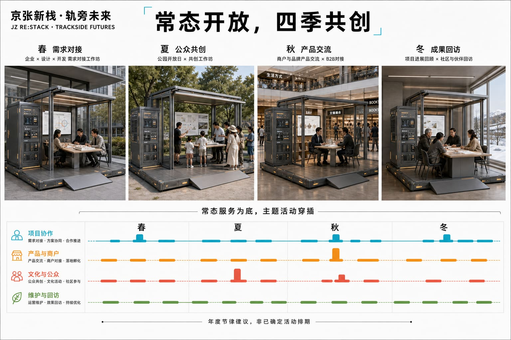

长期活动品牌沿用“JZ RE:STACK”，形成季度开放课题、协同开发冲刺、城市试用与年度 Open Week 的递进节奏。开发者社区负责工具、问题与复盘档案；片区运营者负责空间和服务；企业、科研团队、商户及城市居民分别以需求方、共创方和体验方参与。转化路径从公开问题进入匹配与试点，经人工评估后可形成研发合作、产品改进、采购洽谈、专业场地转介或下一轮研究课题；任何投资、招商、采购和政策支持仍由相应真实主体独立决定。公开成果沉淀为双语案例、贡献者记录和可复用场景卡，成为长期品牌资产而不是一次性节庆。

## 指标体系、面积复算与合规矩阵

组织方没有提供可用于精确测算的法定边界、现状建筑、控规强度、权属、市政管线、完整交通调查和运营基线。凡成果要求涉及上述数据，正式状态均记为“暂无法详细测算”；同时依据用户确认工作边界、现状影像、方案空间类型和同类项目经验给出低置信度预估，仅用于容量研判，不能作为规划管控、工程设计、投资或绩效承诺。

总体设计工作范围按用户边界复算约 1,197 公顷；三处重点工作边界约为众智园 101 公顷、AI 原点社区 71 公顷和大钟寺 42 公顷，与公告约面积存在差异，原因是本方案优先服从真实道路、地理要素和完整用地。建议初期布置 12—18 个 S/M 级节点、3—5 个 L 级平台，并在每个重点片区形成 1 处依托既有建筑的 XL 级场所；上述数量是运营容量预估，可随需求增减。

在缺少建筑清查和控规数据时，暂估首轮可利用或更新的首层及共享空间约 3—6 万平方米，新建永久建筑面积原则上控制在最低必要水平；场景开放节点中公共服务与日常活动空间占比建议不低于 30%，产业协作、验证及展示空间约占 50%—60%，其余为运营、设备与弹性转换空间。慢行连通率、绿地率、容积率、建筑密度、高度、停车和市政容量均须在取得正式资料后重新测算。

同一规则适用于成果要求中所有因组织方未提供原始数据而无法测量的指标：第一步明确缺少的数据、无法详测的原因和正式复算路径；第二步依据用户确认边界、影像判读、空间原型容量与同类项目给出低置信度参考值。参考估计包括首轮 12—18 个 S/M 节点、3—5 个 L 平台、3 个依托既有建筑的 XL 场所，稳定运营后年度参与约 2—5 万人次；以上均不是承诺值。绿地和公共空间的机器图层比例只检验提交包内部一致性，不代表现状绿地率或法定指标。[metric:site_area_sqm] [metric:green_ratio] [metric:public_space_ratio]

为避免“有指标、无责任”，机器指标与运营指标分开管理：面积和比例由 GeoJSON 自动复算；节点数量、使用人次和空间容量待真实运营基线形成后校准；责任人覆盖、版本记录、人工接管、非 AI 服务和高风险关闭则属于设计底线，可在每次开放前逐项核对。每项指标均对应数据来源、计算公式、置信度、复算触发条件和负责更新的角色。

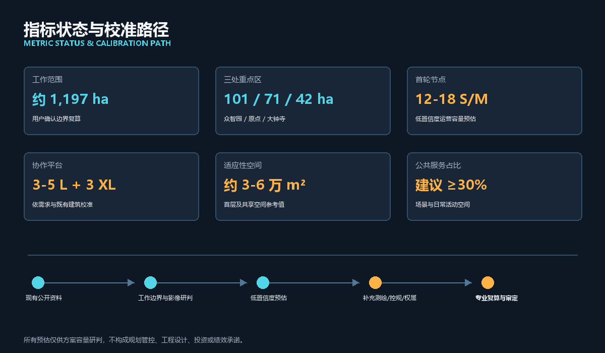

## 风险、版权与合规说明

所有设计图和效果图均为竞赛概念表达，不代表官方批准、法定规划红线、已建成状态或公众同意。用户确认边界是项目工作边界；文保范围、道路红线、控规、产权、地下管线、消防、防洪和工程条件需由后续专业资料确认。生成式效果图可能对建筑层数、立面和场地细节作示意性补充，不作为现状证据。

本方案提出的是概念阶段的空间、技术与治理建议，不构成政府机构设立、行政审批、规划许可、采购、投资、招商或实施承诺；图表中的责任配置均为待依法确认的建议模型。任何真实试点只有在法定权限、场地权利、专业复核、采购程序、运营协议与公众沟通均落实后才能由 HOLD 转为 PASS。

涉及人脸、个人行为、企业数据和商业信息的 AI 场景实行最小化收集、目的限定、清晰告知、人工复核和可退出。基本公共服务保留非 AI 选择；涉及安全、审批、权利和高影响判断的输出不得由 Agent 单独决定。模型、插件和设备应具备版本记录、回退、停用与责任追踪。

包容性作为所有插件的开放条件而非总体口号：儿童、老人、残障人士、低数字技能者和不使用智能手机的居民，应能通过可读标识、无障碍界面、现场人员或非 AI 通道获得基本服务；小商户和中小企业不因缺少专门技术团队而被排除在公开申请之外。个体无法退出的城市后台系统必须采用公共告知、数据最小化、人工接管和定期审计。

所有资料均按其授权范围使用；涉及隐私、版权、授权、边界、实施风险与合规判断的内容均登记来源并由人工复核。

图件、现场照片、卫星底图、公开资料、生成图、声音和视频的来源及使用说明登记于 `sources.json` 和 `report/copyright_statement.md`。本地 HTML 不加载远程脚本、地图、字体或跟踪服务。[source:SITE-PACKAGE]

## 参考资料

- [source:OFFICIAL-ANNOUNCEMENT] 北京市规划和自然资源委员会海淀分局，百年京张 AI 创新带城市设计国际方案征集公告。
- [source:AGENT-TASKBOOK] `brief/site-package/agent_taskbook.json`，面向 AI Agent 的任务与成果要求。
- [source:SITE-PACKAGE] `brief/site-package/`，公开场地包、枚举、标准和校验规则。
- [source:USER-CONFIRMED-BOUNDARY-20260826] 用户确认项目工作边界及边界溯源说明。
- [source:JINGZHANG-RESEARCH-PACK] 本项目对公开资料、现场照片、卫星影像和既有规划图的整理研究。
- `sources.json`、`assumptions.json`、`metrics.json`
