# 京张智脉共生带城市设计方案

> **三核 + 京张慢行脊 + 10 场景节点** — 以百年京张遗址公园为公共空间主轴，众智园、北京 AI 原点社区、大钟寺三处重点片区为创新锚点，沿慢行脊布置 10 个可运营 AI 场景，蓝绿公共空间与道路网络形成日常复合环。

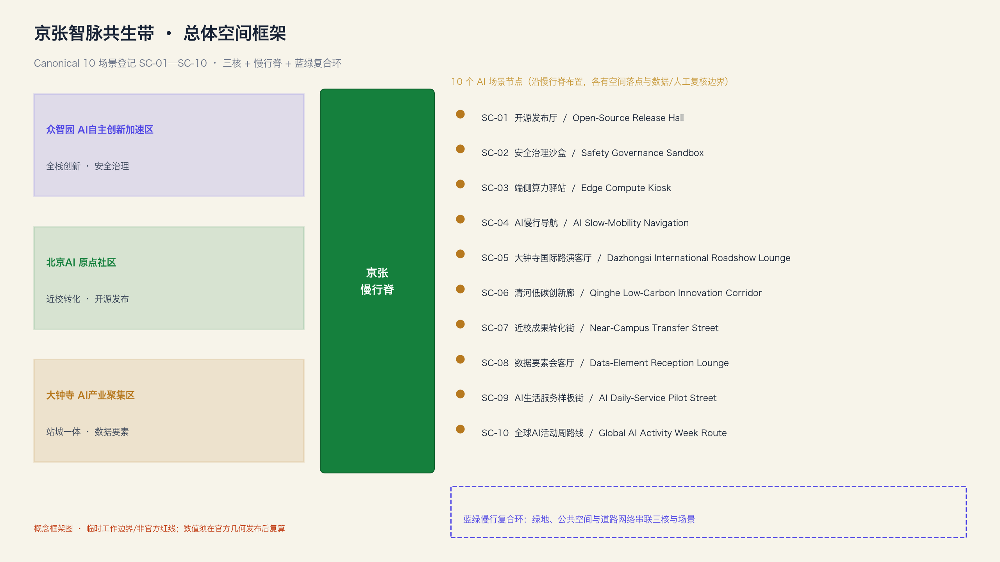

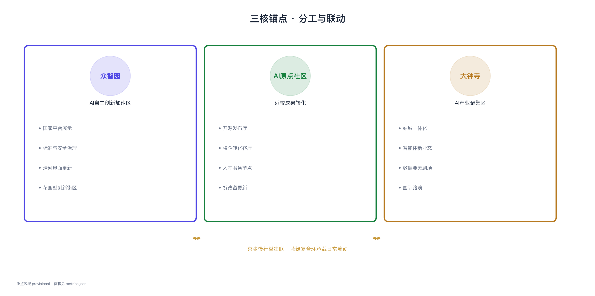

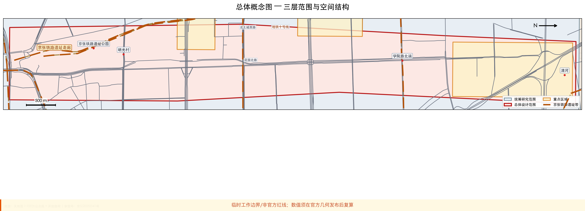

## 设计依据与资料清单

本方案以《百年京张 AI 创新带城市设计国际方案征集资格预审公告》为第一依据，机器可读证据来自 `brief/site-package/`、本包 `sources.json` 与提交包内 GeoJSON / metrics [source:OFFICIAL-ANNOUNCEMENT] [source:AGENT-TASKBOOK] [source:SITE-PACKAGE] [standard:PROJECT-OFFICIAL-ANNOUNCEMENT]。`data/source_registry.json` 只作为组织方资料登记路径被引用；评审侧提供的 `source_registry_summary` 现为 total=0，approved / background / provisional / needs-review 列表均为空，本包不复述任何 registry 计数，也不把任何条目自称 registry-approved [source:SOURCE-REGISTRY]。

**边界状态：** 组织方尚未公开精确 official polygon。本包 `geometry/site_boundary.geojson` 与三处 `key_areas.geojson` 均为 `provisional_constraint`、`official_boundary=false`，仅用于方案讨论、自检与展示；**不阻断内容评分**，正式红线到位后须重算全部几何与指标 [source:BOUNDARY-SOURCE] [source:KEY-AREA-SOURCE] [metric:site_area_sqm]。

## 总体概念

「京张智脉共生带」把公告三层范围转译为可落图、可复核的空间组织：

| 要素 | 含义 | 证据 |
| --- | --- | --- |
| **京张慢行脊** | 遗址公园连续绿廊 + 慢行主轴，串联三核与场景 | [data:geometry/green_space.geojson] [data:geometry/roads.geojson] |
| **三核** | 众智园全栈创新 / AI原点近校转化 / 大钟寺站城智能经济 | [data:geometry/key_areas.geojson#PROV-KEY-001] 等 |
| **10 场景节点** | AI+ 公共服务、产业测试与日常体验的可运营落点 | 见下文场景表、10 张 AI 场景卡 |
| **蓝绿复合环** | 绿地、公共空间与慢行网络联动 | [metric:green_ratio] [metric:public_space_ratio] |

统筹研究 **43.6 km²** → 总体设计 **11.4 km²** [metric:coordinated_research_area_sqm] [metric:overall_design_area_sqm] → 重点区域 **369.268 ha**（GeoJSON 复算 canonical；公告约 368.4 ha）三片详细设计 [metric:key_detailed_design_area_sqm] [metric:key_detailed_design_area_ha]。

## 三层范围工作框架

方案按公告三层范围组织：统筹研究 **43.6 km²** 定 AI 创新链与城市形态判断；总体设计 **11.4 km²** 把判断落实为用地、建筑、道路、绿地与公共空间图层 [metric:coordinated_research_area_sqm] [metric:overall_design_area_sqm]；重点区域 **369.268 ha**（canonical 复算，公告约 368.4 ha）三片验证建筑体量、交通组织、慢行连通与 AI 场景可实施性 [metric:key_detailed_design_area_sqm] [metric:key_detailed_design_area_ha] [data:geometry/key_areas.geojson#PROV-KEY-001]。三层在 `compliance_matrix.json` 中逐条映射公告 1.3–1.5 与 agent.1–agent.6，保证章节、图层、指标、A3/A0 与 HTML 证据闭环 [depth:three_level_scope_framework] [depth:overall_spatial_structure] [standard:MOHURD-URBAN-DESIGN-MEASURES] [standard:MOHURD-CONTROL-DETAILED-PLANNING]。

统筹研究不新增伪精确红线，而回接 [data:geometry/land_use.geojson#LU-001]、[data:geometry/public_space.geojson#PUBLIC-001] 说明产业策略如何落到可见空间结构；总体设计按 [standard:MOHURD-ARCH-DESIGN-DEPTH-2016] 把控规深度内容拆成可审查对象；现状诊断与缺资料事项以 [depth:existing_conditions_diagnosis] 约束，凡无官方控规条件处一律标注「待正式数据确认」，不以推测值冒充审定指标。

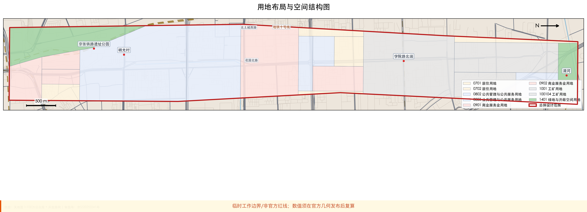

## 重点区域 · 众智园代表节点

三处重点区均达到详细设计深度。众智园以花园型全栈自主创新街区为定位，强化清河界面、产业展示与安全治理沙盒 [data:geometry/key_areas.geojson#PROV-KEY-001] [metric:zhongzhiyuan_ai_acceleration_area_sqm]。

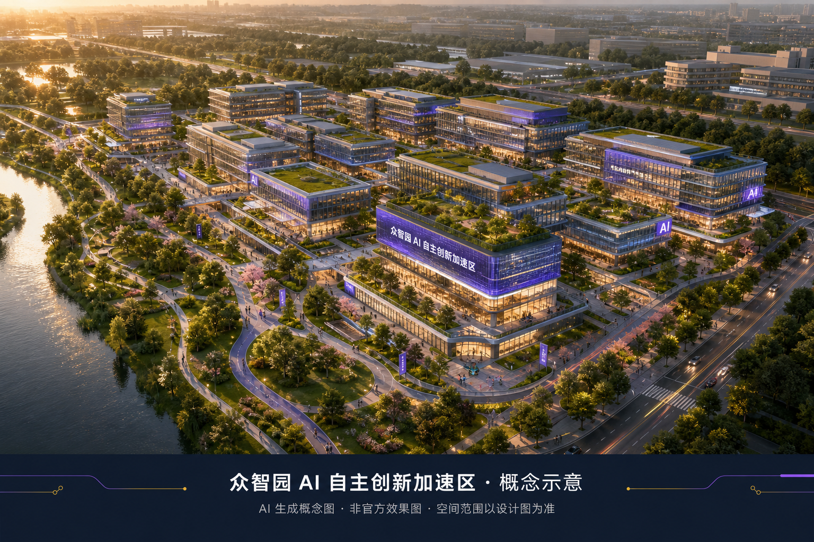

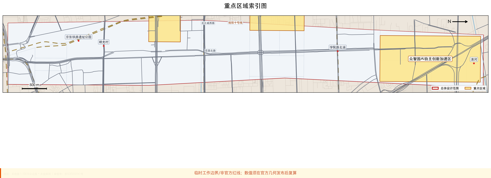

| 重点片区 | 定位 | 核心空间动作 |
| --- | --- | --- |
| 众智园 AI 自主创新加速区 | 花园型全栈创新街区 | 清河界面、标准治理、低碳交往 |
| 北京 AI 原点社区 | 近校成果转化社区 | 开源发布、校企转化、人才服务 |
| 大钟寺 AI 产业聚集区 | 站城一体智能经济 | 四象限连通、数据要素、国际路演 |

---

## 资料清单与合规证据

公开依据与证据链见开篇「设计依据与资料清单」。评审提供的 `source_registry_summary` 为 total=0，approved / background / provisional / needs-review 均为空；本包不以 registry 计数或 approved 状态作依据 [source:SOURCE-REGISTRY]。agent 不得把 background 或 provisional 资料升级为 official boundary、法定控规或正式评分依据。[source:PROCESSED-FACT-PACK] 仅为阅读导航，事实判断仍回 [source:OFFICIAL-ANNOUNCEMENT]、[source:AGENT-TASKBOOK]、[source:BOUNDARY-SOURCE] 与 [source:KEY-AREA-SOURCE]。

本包资料用途分层如下（proposal-local 声明，**不是** registry 批准）：

| 用途分层 | 条目 | 发布主体 / 访问路径 | 本包声明 |
| --- | --- | --- | --- |
| 公开原文直接引用 | OFFICIAL-ANNOUNCEMENT | 北京市规划和自然资源委员会 / https://ghzrzyw.beijing.gov.cn/zhengwuxinxi/tzgg/hd/202605/t20260509_4643047.html | 任务、范围与公告口径；不自称 registry-approved |
| 公开原文直接引用 | SITE-PACKAGE | 仓库 `brief/site-package/` | 任务书、枚举、schema、允许设计空间；不自称 registry-approved |
| 公开原文直接引用 | AGENT-TASKBOOK | `brief/site-package/agent_taskbook.json` | 六项智能体任务与边界条款；待 registry 审核 |
| 背景案例 / 设计类比 | CASE-STANFORD | Stanford OTL / https://otl.stanford.edu/ | background_case_design_analogy；非海淀实施依据 |
| 背景案例 / 设计类比 | CASE-MILA | Mila / https://mila.quebec/en | 同上 |
| 背景案例 / 设计类比 | CASE-PUNGGOL | JTC / https://www.jtc.gov.sg/punggoldigitaldistrict | 同上 |
| 背景案例 / 设计类比 | CASE-TSUKUBA | University of Tsukuba / https://www.tsukuba.ac.jp/en/ | 同上 |
| 背景案例 / 设计类比 | CASE-HETAO | 河套深港科技创新合作区深圳园区发展署 / https://htcz.sz.gov.cn/ | 同上 |
| 背景案例 / 设计类比 | CASE-KENDALL | City of Cambridge CDD / https://www.cambridgema.gov/Departments/communitydevelopment/kendallsquare | 同上 |
| 临时几何 | BOUNDARY-SOURCE | `brief/site-package/geometry/provisional_boundaries.geojson` | SITE-001 工作边界；provisional，非官方红线 |
| 临时几何 | KEY-AREA-SOURCE | 同上 | PROV-KEY-001–003；provisional，正式几何发布后复算 |
| 待 registry 审核 | SOURCE-REGISTRY | `data/source_registry.json` | 仅登记路径；当前 summary 为空，不导出 approved 状态 |
| 待 registry 审核 | PROCESSED-FACT-PACK | `data/processed/agent_fact_pack.md` | 阅读导航，非新的权威来源 |

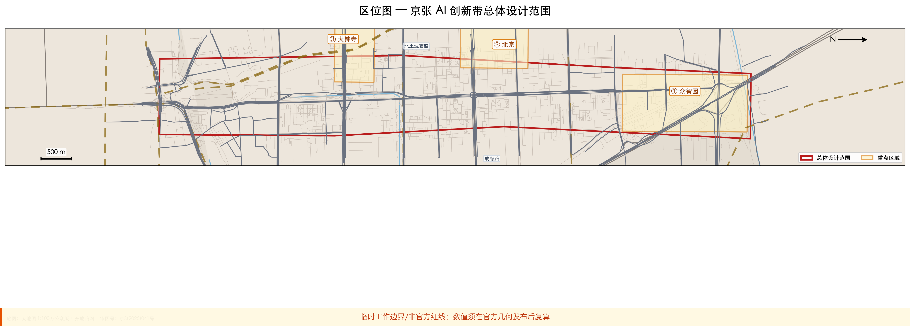

本次提交状态：**临时边界，保留精度警示并待正式数据发布后复算；不阻断内容评分**。空间结构、场景与指标均按可讨论、可复核、可替换官方边界后重算的原则写入；边界更新后须重跑脚手架、自检与图纸/HTML 生成。边界与重点区证据：[data:geometry/site_boundary.geojson#SITE-001]、[data:geometry/key_areas.geojson#PROV-KEY-001]、[metric:site_area_sqm]、[metric:key_area_count]。

## 现状参考与设计图层分工

本包严格区分 **existing_condition（现状参考）** 与 **design_proposal（概念设计）**。[data:geometry/buildings.geojson] 含 25 栋 agent 生成的概念建筑 footprint（`geometry_role=design_proposal`），**不**批量导入 OSM/Overture 数千栋现状建筑以抬高几何计数。[data:geometry/roads.geojson] 由 `scripts/clip_corridor_roads.py` 从 OSM/天地图裁切至多 120 段走廊参考线，仍标注为概念慢行/道路网络，非道路红线或实施线位。开放现状如需进一步补充，应单独以 `existing_condition` 图层或在正文/metrics 中披露来源与许可，不得与 design 图层混计。假设边界见 `A-DATA-CONTEXT-001`。

## 统筹研究范围产业与未来城市研究

统筹研究范围的核心任务是构建世界级 AI 创新生态体系。本方案梳理海淀高校院所、头部企业与算力数据要素，提出「高校策源—开源协作—企业转化—公共体验—国际传播」创新链，并配套命名系统与视觉识别方向。统筹研究范围面积 [metric:coordinated_research_area_sqm] 来自 brief 升级边界复算，与总体设计范围 [metric:overall_design_area_sqm] 形成层级对照。面向智能体任务书回应「五大功能」与「三区两翼」协同，形成可继续深化的总体空间结构图、场景开放清单与运营机制；本节以 [source:AGENT-TASKBOOK] 与 [standard:PROJECT-AGENT-OPEN-CALL-TASKBOOK] 标注任务来源，而非法定规划控制。

统筹研究并不新增伪精确红线；它通过 [standard:MOHURD-URBAN-DESIGN-MEASURES] 要求的城市风貌、公共空间和建筑布局统筹，回接 [data:geometry/land_use.geojson#LU-001]、[data:geometry/public_space.geojson#PUBLIC-001] 与 [depth:overall_spatial_structure]，说明产业策略最终要落到可见、可复核的空间结构。

未来城市形态研究回答人工智能如何改变工作、生活、社交、学习、交通和公共服务。本方案已将 AI 交通系统、连续绿色空间、创新服务设施和国际化生活工作氛围落实为 19 个用地分区、5 处绿地、5 处公共空间与 10 张场景卡所对应的功能区、节点与廊道。产业战略指标、AI 创新指数、人才密度与空间供给类型写入 `metrics.json`（known/unknown 分列）；全球 AI 创新活动、开发者社区与公共体验路线均表述为概念建议，不写成已确定的政府活动。

## 总体设计范围城市更新与控规深度城市设计

总体设计范围达到控制性详细规划的城市设计深度。本方案提出「一带三核、多点场景、蓝绿慢行复合环」总体空间结构，并以 `geometry/land_use.geojson`（[metric:land_use_feature_count] 分区）、`geometry/buildings.geojson`（[metric:building_feature_count] 体块）、`geometry/roads.geojson`（[metric:road_feature_count] 条中心线）与 `metrics.json`（26 项 EPSG:4548 复算）共同表达更新框架与产业功能比例。

本节按照 [standard:MOHURD-CONTROL-DETAILED-PLANNING] 把控规深度内容拆成可审查对象：[data:geometry/land_use.geojson#LU-001] 表达用地结构，[data:geometry/buildings.geojson#BLDG-001] 表达建筑基底，[data:geometry/roads.geojson#ROAD-001] 表达交通组织，[metric:building_footprint_area_sqm] 用于复核建筑基底面积，[depth:land_use_layout] 与 [depth:development_intensity_controls] 约束成果深度。

总体设计还必须支撑交通、轨道、市政和配套设施。本方案围绕轨道站点一体化、道路微循环、非机动车停放、创新服务平台与端侧算力提出空间布局路径；涉及开发强度、道路红线、退线和设施标准的内容，若无官方控制条件，一律标注为「待正式控规条件确认」，不以推测值冒充审定指标。

## 重点区域详细设计

重点区域详细设计是必选项。众智园片区围绕国家人工智能平台、全栈自主创新、标准制定、安全治理、产业展示与清河文化界面提出详细方案；北京AI原点社区围绕近校创新、成果转化、开源体系、品牌活动、保留与更新策略、成果发布与居住配套提出详细方案；大钟寺片区围绕智能体产业、数据要素、商业服务与大钟寺站一体化提出详细方案。

三处重点区域详细设计引用 [data:geometry/key_areas.geojson#PROV-KEY-001]、[data:geometry/key_areas.geojson#PROV-KEY-002]、[data:geometry/key_areas.geojson#PROV-KEY-003]，由 [depth:three_key_area_detailed_design] 校核深度。每处片区均有功能、建筑、交通、公共空间与实施项目证据，而非空泛「示范区」口号。

重点区放大图（带天地图/OSM 底图，provisional）：

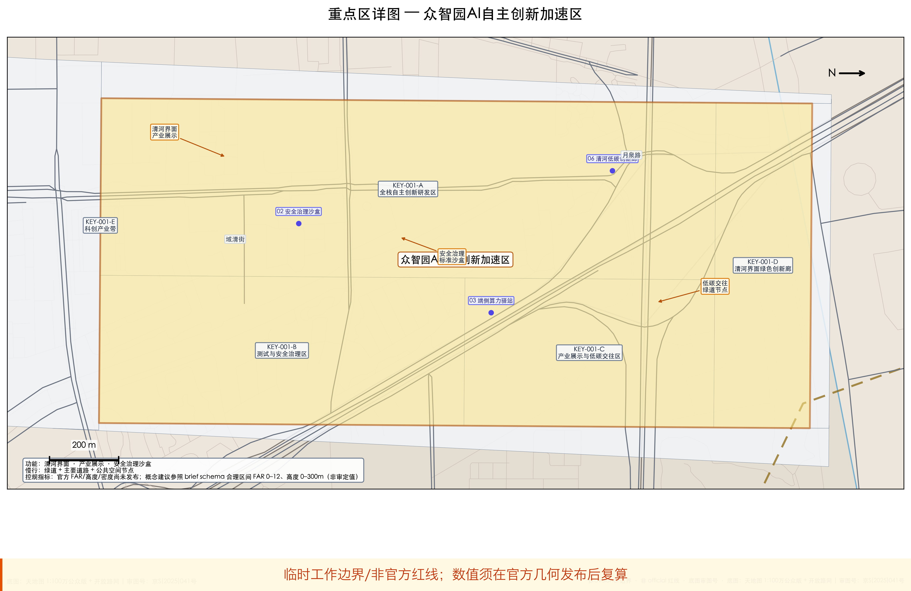

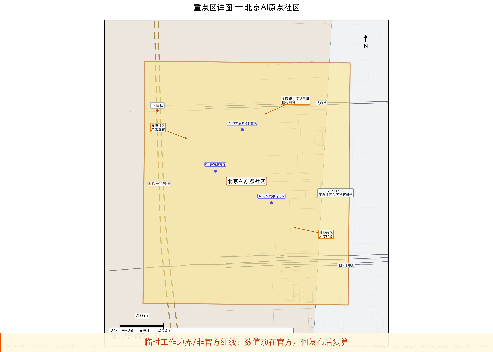

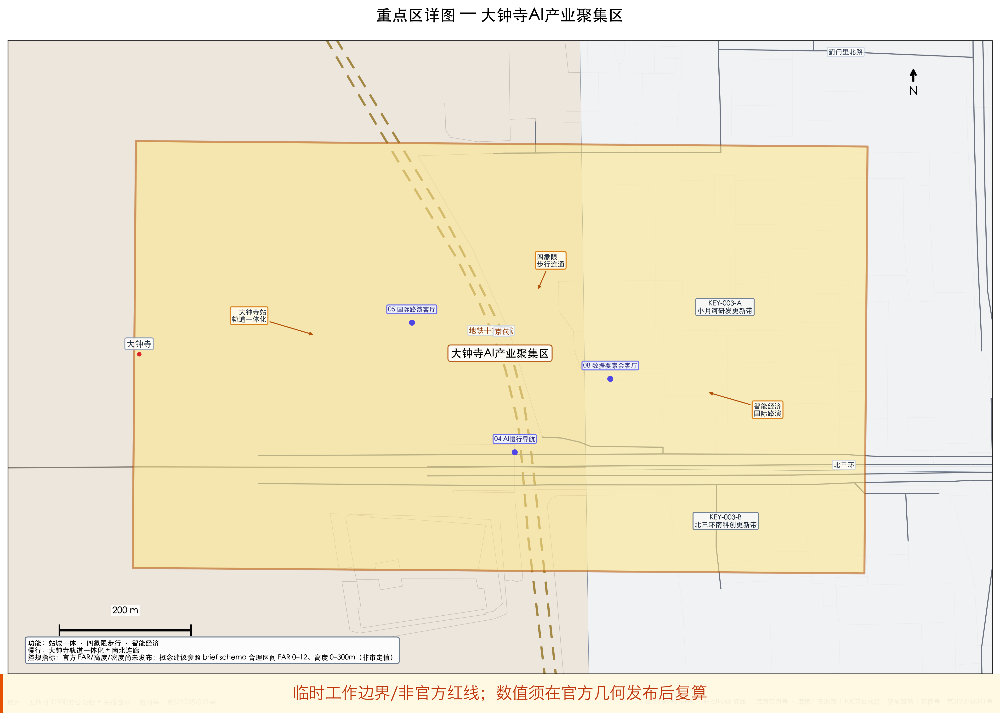

三处重点区域在 `geometry/key_areas.geojson` 中落图。设计表达包含功能业态、建设规模、建筑形态、保留与更新分类、公共空间系统、交通组织、慢行连通和实施项目清单。

| 重点片区 | 设计定位 | 空间动作 | AI产业与运营场景 | 证据引用 |
| --- | --- | --- | --- | --- |
| 众智园AI自主创新加速区 | 花园型全栈自主创新街区 | 强化清河界面、产业展示、低碳创新交往和对外交通组织；以绿色空间承载开放测试与标准治理展示 | 自主模型测试、标准制定工作坊、安全治理展示、低碳算力体验 | [data:geometry/key_areas.geojson#PROV-KEY-001]、[metric:zhongzhiyuan_ai_acceleration_area_sqm] |
| 北京AI原点社区 | 近校型成果转化与人才社区 | 组织校区、园区、街区慢行缝合；补足成果发布、人才服务、居住生活和开源协作空间 | 开源社区、成果发布、人才特区服务、近校孵化 | [data:geometry/key_areas.geojson#PROV-KEY-002]、[metric:beijing_ai_origin_community_area_sqm] |
| 大钟寺AI产业聚集区 | 城市型智能经济与国际交往街区 | 围绕大钟寺站一体化、四象限步行连通、商业服务和重点企业公共环境更新 | 智能体与智能终端展示、内容消费、数据要素与国际路演 | [data:geometry/key_areas.geojson#PROV-KEY-003]、[metric:dazhongsi_ai_industry_cluster_area_sqm] |

## AI 创新生态、人才画像与 AI+ 场景

本方案建立面向 AI 人才与企业的空间需求画像，覆盖研发办公、开源协作、成果发布、企业服务、人才居住、社交学习、消费生活、运动休闲和国际交往九类需求。10 张 AI+ 场景卡以 `compliance_matrix.json#ai_scenario_registry` 为唯一口径（SC-01 至 SC-10），分别说明服务对象、空间位置（对应 GeoJSON feature id）、数据边界、人工复核机制、运营主体与分期。

AI 场景必须落到空间和治理边界：公共空间场景引用 [data:geometry/public_space.geojson#PUBLIC-001]，慢行与交通场景引用 [data:geometry/roads.geojson#ROAD-001]，开放空间场景引用 [data:geometry/green_space.geojson#GREEN-001] 和 [metric:public_space_ratio]、[metric:green_ratio]。这些引用让评审者知道场景不是口号，而是位于具体图层和指标中的设计对象。面向智能体任务书要求不少于10张AI场景卡、不少于3个产业测试验证场景和不少于5类用户画像；本方案已将场景卡、画像表、隐私边界、人工复核和运营主体写入正文、HTML、A3/A0 和合规矩阵。

| 用户画像 | 典型需求 | 空间响应 | 自检边界 |
| --- | --- | --- | --- |
| 开源开发者 | 发布、协作、测试、社区声誉 | 原点社区开源发布厅、公共代码墙、夜间协作空间 | 不采集个人行为轨迹；活动数据只做聚合统计 |
| 初创团队 | 低成本办公、算力入口、产品试验场 | 众智园共享测试场、端侧算力服务点、标准治理咨询 | 算力和数据服务需另行授权 |
| 头部企业访客 | 展示、商务、国际接待、人才招聘 | 大钟寺国际路演客厅、轨道站点接驳、重点企业周边公共空间 | 企业标识和案例须清权 |
| 周边居民 | 通勤、休闲、社区服务、低扰动更新 | 京张遗址公园慢行环、社区服务嵌入、夜间照明和活动分级 | 不将居民画像用于商业推荐 |
| 高校师生 | 成果转化、跨校协作、日常慢行 | 校区-园区慢行缝合、成果转化驿站、AI教育体验点 | 校园数据和科研成果需授权 |

| ID | 中文名 / English | 服务对象 | 空间 feature_id | 数据边界 | 人工复核 | 运营主体 | 分期 |
| --- | --- | --- | --- | --- | --- | --- | --- |
| SC-01 | 开源发布厅 / Open-Source Release Hall | 高校师生、开源开发者、初创团队 | PUBLIC-001 | 仅授权仓库聚合统计；不采集个人行为轨迹 | 发布内容与徽章墙人工复核 | 高校—园区联合运营 | PHASE-001 |
| SC-02 | 安全治理沙盒 / Safety Governance Sandbox | 企业、标准组织、公众 | GREEN-001 | 测试数据脱敏；不展示原始日志 | 评测案例与展示轮换须人工终审 | 园区公共环境运营 | PHASE-001 |
| SC-03 | 端侧算力驿站 / Edge Compute Kiosk | 开发者、游客、维护人员 | CONSTRAINTS-001 | 不持久化用户输入；仅服务日志 | 能耗与安全审计人工复核 | 新基建与公服联合体 | PHASE-002 |
| SC-04 | AI慢行导航 / AI Slow-Mobility Navigation | 步行者、维护人员、无障碍需求者 | ROAD-001 | 不采集个人轨迹；仅聚合断点计数 | 断点候选须人工复核后生成工单 | 公共空间运营联合体 | PHASE-001 |
| SC-05 | 大钟寺国际路演客厅 / Dazhongsi International Roadshow Lounge | 企业、投资人、公众 | PUBLIC-001 | 路演材料须清权；不直播未授权内容 | 多语字幕与内容合规人工终审 | 站城一体运营 | PHASE-002 |
| SC-06 | 清河低碳创新廊 / Qinghe Low-Carbon Innovation Corridor | 企业、居民、运动者 | GREEN-001 | 仅设施运行数据；不含个人位置 | 雨季巡检与海绵设施读数人工校核 | 园区公共环境运营 | PHASE-002 |
| SC-07 | 近校成果转化街 / Near-Campus Transfer Street | 高校师生、初创团队 | BLDG-001 | 校园数据与科研成果须授权 | 法务、知识产权与路演清单人工审核 | 高校—园区联合运营 | PHASE-001 |
| SC-08 | 数据要素会客厅 / Data-Element Reception Lounge | 企业、要素平台、公众 | PUBLIC-001 | 合规授权可审计；不展示未授权商业数据 | 展示内容清权后上架 | 站城一体运营 | PHASE-002 |
| SC-09 | AI生活服务样板街 / AI Daily-Service Pilot Street | 周边居民、家庭、数字能力较弱群体 | PUBLIC-001 | 不将居民画像用于商业推荐 | 生活服务场景人工值守与非数字兜底 | 街道—社区服务商 | PHASE-003 |
| SC-10 | 全球AI活动周路线 / Global AI Activity Week Route | 开发者、游客、公众 | PHASE-001 | 预约信息最小化；活动结束删除 | 活动许可与安全方案人工审批 | 活动品牌运营 | PHASE-001 |

agent 生成的AI治理建议必须遵守数据最小化、公开来源、可解释和人工复核原则。城市智能体可以辅助识别慢行断点、公共空间热力、设施维护、企业服务需求和活动安全风险，但不能替代规划审批、不能输出未经授权的个人画像、不能声称获得官方实施承诺。所有AI场景节点应进入结构化图层或合规矩阵，便于评审者看到它们与产业、空间和公共利益之间的关系。

## 用地、建筑规模与拆改留方案

用地方案依据国土空间用途管制公开标准表达，形成完整、闭合、无缝的用地分区。建筑方案区分保留、改造、更新、新建或待确认对象，明确建筑基底、功能、规模与风貌建议层级。若缺少现状建筑与工程条件，本方案只提出方法与待校准清单，不编造实施结论。

用地分类依据 [standard:MNR-LAND-USE-CLASSIFICATION-GUIDE]，建筑体量与界面控制由 [depth:height_massing_character] 管理，保留与更新方法由 [depth:retain_renovate_demolish] 管理。主要证据为 [data:geometry/land_use.geojson#LU-101]、[data:geometry/buildings.geojson#BLDG-ZZY-01] 和 [metric:building_footprint_area_sqm]。

建筑规模指标与 `metrics.json` 和图层一致。总建筑规模、开发强度、绿地率、退线等若缺少官方条件，在指标体系中列为 unknown 或 pending_control，不用固定数值制造精确感。

## 交通、轨道、市政与公共服务设施

交通方案回应公告对轨道站点一体化、道路微循环、慢行断点与绿色交通系统的要求，重点覆盖北五环—京张跨环节点、五道口、清华东路西口、大钟寺站及重点企业周边。120 条 `ROAD_CENTERLINE` 保持在提交边界内，与公共空间、绿地及三处重点片区相互校核；provisional 边界下交通结论仅供设计讨论。

交通和市政专业深度分别由 [depth:traffic_rail_slow_parking] 与 [depth:municipal_new_infrastructure] 约束；图层证据引用 [data:geometry/roads.geojson#ROAD-001]、[data:geometry/public_space.geojson#PUBLIC-001] 和 [data:geometry/constraints.geojson#CONSTRAINTS-001]。道路红线、管线、消防和市政条件缺失时，通过 assumptions 说明待补。

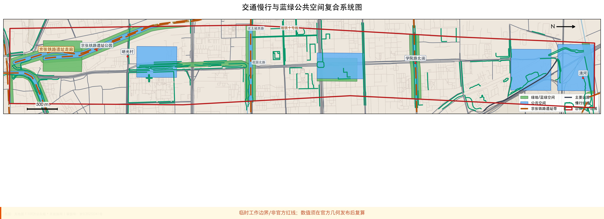

市政和公共服务设施覆盖 AI 产业服务、创新服务平台、人才生活服务、新型基础设施、分布式能源、端侧算力与传统市政融合。本方案在 JZ-05 更新项目中说明设施空间布局、服务半径与分期逻辑；管线、能源、排水、防洪、消防等工程资料缺失时列入正式深化前置条件。

## 蓝绿空间、公共空间与城市风貌

蓝绿空间以京张遗址公园活力带为骨架，统筹清河、小月河与周边高校、企业、社区出行需求，形成南北贯通、东西连通的步道、骑行道与绿色空间体系。本方案识别 3 处慢行断点（JZ-01）、2 处跨环节点与公园南/北端景观节点，并在 GREEN-001 至 GREEN-005 中落实停车、体育、创新交往与公共服务复合利用策略。

蓝绿公共空间由 [depth:blue_green_public_space] 校核，核心证据为 [data:geometry/green_space.geojson#GREEN-001]、[data:geometry/public_space.geojson#PUBLIC-001]、[metric:green_space_area_sqm]、[metric:public_space_area_sqm]、[metric:green_ratio] 和 [metric:public_space_ratio]。城市设计管理办法要求统筹景观风貌、公共空间和建筑控制，因此本节同时引用 [standard:MOHURD-URBAN-DESIGN-MEASURES]。

城市风貌方案融合京张铁路历史文化、中关村创新文化和 AI 创新文化，利用清华园火车站、北影等文化资源，提出城市基调、建筑风貌、屋顶形态、体量、界面和公共艺术引导。导视标识、文化符号、国际传播叙事与 AI 朝圣地标均须附清权来源。风貌控制分清官方管控、设计建议和待确认条件，不在无文保或控规依据时给出伪精确控制线。

## 更新项目清单、实施政策与分期计划

本方案形成 6 项可审查更新项目（JZ-01 至 JZ-06，见上表），每项说明位置、类型、功能、责任主体、依赖条件、实施阶段与风险。政策建议覆盖城市更新统筹、空间供给、运营机制、产业服务、公共参与、数据治理与产权协同。`geometry/phasing.geojson` 表达三期范围，`compliance_matrix.json` 把任务与分期、图纸挂接。

项目清单和分期深度由 [depth:renewal_project_list] 与 [depth:phasing_implementation] 管理，分期空间证据为 [data:geometry/phasing.geojson#PHASE-001]。如果没有权属、资金、实施主体和审批路径，方案必须把它写成实施风险，而不是承诺落地。

| 项目编号 | 项目名称 | 类型 | 主要依赖 | 证据引用 |
| --- | --- | --- | --- | --- |
| JZ-01 | 京张遗址公园慢行断点缝合 | 公共空间/交通 | 道路红线、桥下空间、交通组织复核 | [data:geometry/roads.geojson#ROAD-001] |
| JZ-02 | 众智园清河创新界面 | 蓝绿空间/产业展示 | 河道蓝线、生态和防洪条件 | [data:geometry/green_space.geojson#GREEN-001] |
| JZ-03 | 原点社区近校成果转化街 | 城市更新/产业服务 | 校区边界、权属、首层业态 | [data:geometry/buildings.geojson#BLDG-001] |
| JZ-04 | 大钟寺站四象限步行连通 | 轨道一体化/慢行 | 轨道站点、道路交叉口、市政管线 | [data:geometry/public_space.geojson#PUBLIC-001] |
| JZ-05 | AI公共服务与端侧算力节点 | 新基建/公共服务 | 能源、算力、安全和运营主体 | [data:geometry/constraints.geojson#CONSTRAINTS] |
| JZ-06 | 全球AI活动周公共路线 | 运营/品牌 | 公共空间许可、活动安全、版权清权 | [data:geometry/phasing.geojson#PHASE-001] |

分期与 100 天征集设计周期区分：征集周期是成果提交时限，实施分期是城市更新推进路径。本方案提出近期试点（PHASE-001，[metric:phase_001_area_sqm]）、中期更新（PHASE-002，[metric:phase_002_area_sqm]）与长期治理（PHASE-003，[metric:phase_003_area_sqm]）；三阶段 polygon 可能空间重叠，**不得**将面积简单求和。`compliance_matrix.json#operational_governance` 将 JZ-01 至 JZ-06 与四季活动体系交叉映射。轻量设施与运营活动可先启动，正式控规、市政、交通与权属确认后再深化建设。年度活动体系、开发者社区运营、场景开放日、公共体验路线与国际传播机制见 agent.6 节，含运营对象、频率、责任边界与风险说明。

## 指标体系、面积复算与合规矩阵

指标体系包含总体设计范围面积、重点区域面积、绿地与公共空间比例、建筑基底、更新项目数量、AI 场景节点、慢行连通指标、产业空间指标、人才服务指标与自检状态。所有 known 指标从 GeoJSON EPSG:4548 复算；unknown 指标给出原因与正式提交前置条件。

指标复算深度由 [depth:metrics_recalculation] 管理。本方案正文显式引用 [metric:site_area_sqm]、[metric:overall_design_area_sqm]、[metric:coordinated_research_area_sqm]、[metric:key_detailed_design_area_sqm]、[metric:zhongzhiyuan_ai_acceleration_area_sqm]、[metric:beijing_ai_origin_community_area_sqm]、[metric:dazhongsi_ai_industry_cluster_area_sqm]、[metric:key_area_count]、[metric:land_use_feature_count]、[metric:building_feature_count]、[metric:road_feature_count]、[metric:building_footprint_area_sqm]、[metric:green_space_area_sqm]、[metric:public_space_area_sqm]、[metric:green_ratio]、[metric:public_space_ratio]、[metric:phase_001_area_sqm]、[metric:phase_002_area_sqm]、[metric:phase_003_area_sqm]、[metric:phase_1_area_sqm]，并说明这些值来自 [data:geometry/site_boundary.geojson#SITE-001]、[data:geometry/key_areas.geojson#PROV-KEY-001]、[data:geometry/buildings.geojson#BLDG-001]、[data:geometry/green_space.geojson#GREEN-001]、[data:geometry/public_space.geojson#PUBLIC-001]、[data:geometry/land_use.geojson#LU-001]、[data:geometry/roads.geojson#ROAD-001] 和 [data:geometry/phasing.geojson#PHASE-001]。

**重点区域面积口径**：包内 canonical 值为 **369.268 ha**（`key_detailed_design_area_ha`，EPSG:4548 复算三片 polygon 之和）；公告文字约 **368.4 ha**（192.1+104.3+72.0）。差异来自 provisional polygon 精度，正式红线发布后须重算。`phase_1_area_sqm` 为 legacy alias，等同 `phase_001_area_sqm`（近期试点 PHASE-001）；PHASE-001/002/003 为递进实施范围，polygon **可能空间重叠**，面积**不得**跨阶段简单求和。

**绿面/公空比例口径**：`green_ratio`（0.152）与 `public_space_ratio`（0.176）为设计图层复算比，**非**审定控规绿地率或公空率 [assumption:A-CONTROLS-001]。

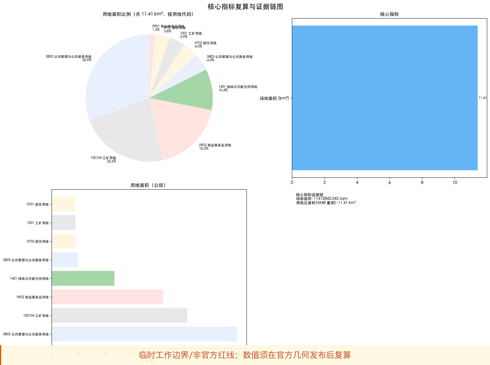

合规矩阵是任务响应性的主控文件。每条公告任务和 agent_taskbook 任务必须对应到报告章节、图层、指标、图纸、HTML 页面、来源、假设和自检项。未能覆盖公告 1.3、1.4、1.5 或 agent.1-agent.6 的任一必选任务，方案不得进入 formal professional scoring。

正式深化时，指标分为三类：第一类为可由提交几何直接复算的空间指标；第二类为需官方控规或任务书附件支撑的管控指标（开发强度、建筑限高、密度、退线、道路红线等）；第三类为需运营数据校准的绩效指标。三类指标分别进入 `metrics.json`、`assumptions.json` 和 `compliance_matrix.json`。

## 设计专项回应

本节逐条回应 [source:AGENT-TASKBOOK] 与 [standard:PROJECT-AGENT-OPEN-CALL-TASKBOOK] 的六项必选任务，所有空间落地建议均表述为概念建议或可供专业团队深化研究的参考方案，不构成法定规划结论或政府实施承诺。

### 专项一 一带总体概念与功能统筹

主名称「京张智脉共生带」。视觉识别以深蓝（#172235）与京张金（#c79838）为主色，辅以 AI 紫（#4f46e5）标识创新节点；Logo 方向为「铁路轨枕 × 神经网络节点 × 慢行环」的抽象组合，强调历史文脉与 AI 原生协作的共生关系。总体空间结构为「一带三核、多点场景、蓝绿慢行复合环」，与 [data:geometry/site_boundary.geojson#SITE-001]、[data:geometry/land_use.geojson#LU-001] 及 [depth:overall_spatial_structure] 一致。三大定位（百年京张文化带、都市AI生活体验带、AI融合创新带）与五大功能、三区两翼在 [data:geometry/key_areas.geojson#PROV-KEY-001] 至 PROV-KEY-003 中有空间落点。

### 专项二 AI 全栈自主创新与世界级生态

方案梳理 6 个全球 AI 创新生态**背景案例/设计类比**（不得升级为本项目正式规划依据）。逐项公开来源见 `sources.json`：[source:CASE-STANFORD]、[source:CASE-MILA]、[source:CASE-PUNGGOL]、[source:CASE-TSUKUBA]、[source:CASE-HETAO]、[source:CASE-KENDALL]。

| 案例 | 发布主体 | 访问路径 | 使用状态 | 仅支撑的设计类比 |
| --- | --- | --- | --- | --- |
| Stanford / 硅谷近校转化 | Stanford University OTL | https://otl.stanford.edu/ | 背景案例/设计类比 | 原点社区近校转化街 SC-07 [source:CASE-STANFORD] |
| Mila 开源协作 | Mila – Quebec AI Institute | https://mila.quebec/en | 背景案例/设计类比 | 开源发布厅 SC-01 [source:CASE-MILA] |
| Punggol Digital District | JTC Corporation | https://www.jtc.gov.sg/punggoldigitaldistrict | 背景案例/设计类比 | 产城融合节点组织 [source:CASE-PUNGGOL] |
| 筑波科学城 | University of Tsukuba | https://www.tsukuba.ac.jp/en/ | 背景案例/设计类比 | 安全治理沙盒 SC-02 [source:CASE-TSUKUBA] |
| 河套深港科创合作区 | 河套深圳园区发展署 | https://htcz.sz.gov.cn/ | 背景案例/设计类比 | 数据要素会客厅 SC-08 [source:CASE-HETAO] |
| Kendall Square | City of Cambridge CDD | https://www.cambridgema.gov/Departments/communitydevelopment/kendallsquare | 背景案例/设计类比 | 国际路演客厅 SC-05 [source:CASE-KENDALL] |

转化机制（开源贡献积分墙、标准治理工作坊、近校成果转化驿站、国际路演客厅、数据要素合规会客厅）对应 [data:geometry/public_space.geojson#PUBLIC-001] 与 [data:geometry/buildings.geojson#BLDG-001]，均为概念建议。产业测试验证场景不少于 3 个：SC-02 安全治理沙盒、SC-03 端侧算力驿站、SC-08 数据要素会客厅，见 [metric:green_ratio] 与 [depth:three_key_area_detailed_design]。

### 专项三 AI+ 场景赋能与智能化活力城市

正文已提供 10 张 AI 场景卡（canonical ID SC-01 至 SC-10，见「AI 创新生态、人才画像与 AI+ 场景」章节与 `compliance_matrix.json#ai_scenario_registry`），覆盖交通、服务、消费、医疗、教育、法律与生活服务。5 类用户画像（开源开发者、初创团队、头部企业访客、周边居民、高校师生）已映射到 [data:geometry/roads.geojson#ROAD-001]、[data:geometry/green_space.geojson#GREEN-001] 及 [metric:public_space_ratio]。城市智能体仅辅助识别慢行断点、公共空间热力与设施维护，遵守数据最小化与人工复核，不输出未授权个人画像。

### 专项四 AI 公共空间、智能原生新业态与朝圣地标

3 个 AI 朝圣地标/荣誉展示节点：（1）清华园火车站「京张 AI 记忆站」— 铁路文脉与开源贡献墙；（2）众智园「安全治理沙盒廊」— 标准制定与可信评测展示；（3）大钟寺「全球 AI 路演客厅」— 智能体与智能终端国际发布。节点空间建议位于 [data:geometry/public_space.geojson#PUBLIC-001]、[data:geometry/phasing.geojson#PHASE-001]，由 [depth:blue_green_public_space] 校核。智能原生新业态包括数据要素流通界面、内容消费体验街和端侧算力公共服务，均为概念建议。

### 专项五 百年京张文化、中关村文化与 AI 新文化融合

叙事主线「从铁轨到代码：百年京张 × 中关村创新 × AI 原生文化」。京张铁路工业遗产提供时间轴与公共艺术载体；中关村「敢为天下先」精神转译为开源协作与成果发布空间；AI 新文化以可解释、可审计、可参与为价值导向，在导视、公共艺术和活动路线中体现。文化资源引用 [source:OFFICIAL-ANNOUNCEMENT] 与 [source:PROCESSED-FACT-PACK]，不编造文保等级或审批结论。

### 专项六 全球 AI 创新活动体系与长期运营

年度活动体系包括：春季开源发布周、夏季 AI 场景开放日、秋季国际路演季、冬季开发者冬令营。开发者社区运营依托原点社区开源发布厅与线上贡献积分；场景开放运营由聚合统计与人工复核保障隐私；公共体验路线「全球 AI 活动周路线」串联 JZ-01 至 JZ-06 更新项目，见 [data:geometry/phasing.geojson#PHASE-001] 与 [depth:phasing_implementation] 及 `operational_governance.json`。国际传播与招引转化机制写为运营概念，不承诺政府活动安排或投资落地。

## 品牌识别、区域协同与运营体系

本节回应 agent.1、agent.4、agent.5、agent.6 对命名体系、区域协同、荣誉展示、组件库与长期运营的要求；结构化数据嵌入 `compliance_matrix.json`（`regional_synergy`、`component_library`、`operational_governance` 节）。

### 英文命名层级（English Naming Hierarchy）

| 层级 | 中文 | English | 用途 |
| --- | --- | --- | --- |
| 主名称 | 京张智脉共生带 | Jingzhang Intelligence Pulse Symbiosis Belt | 方案总称、国际传播 |
| 简称 | 智脉带 | JZ Pulse Belt | 导视、活动品牌 |
| 慢行主轴 | 京张慢行脊 | Jingzhang Slow-Mobility Spine | 空间结构、线路叙事 |
| 三核① | 众智园 AI 自主创新加速区 | Zhongzhiyuan AI Innovation Acceleration Zone | 重点区详图、产业展示 |
| 三核② | 北京 AI 原点社区 | Beijing AI Origin Community | 近校转化、开源社区 |
| 三核③ | 大钟寺 AI 产业聚集区 | Dazhongsi AI Industry Cluster | 站城一体、国际路演 |
| 朝圣地标 | 京张 AI 记忆站 | JZ AI Memory Station | 铁路文脉节点 |
| 活动品牌 | 全球 AI 活动周 | Global AI Activity Week | 四季活动体系总称 |

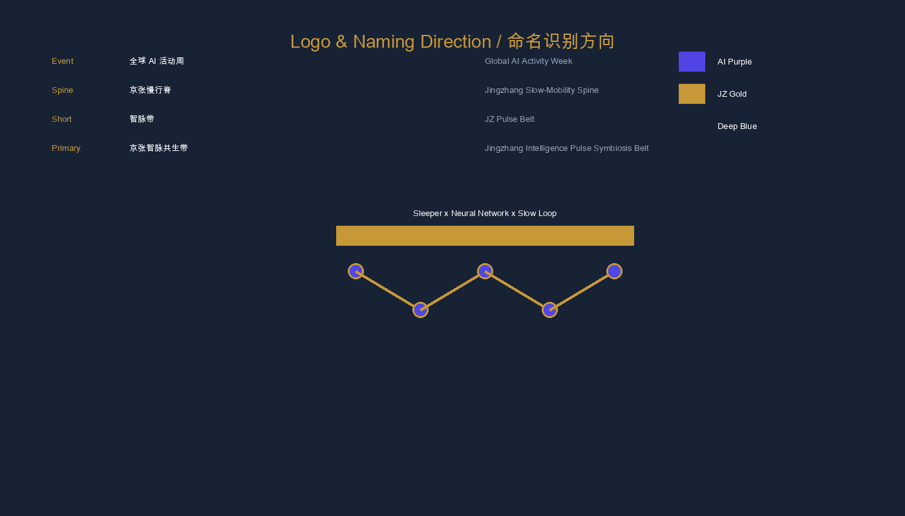

主色：深蓝 `#172235`、京张金 `#c79838`、AI 紫 `#4f46e5`。Logo 方向为「铁路轨枕 × 神经网络节点 × 慢行环」抽象组合，强调历史文脉与 AI 原生协作的共生关系 [depth:overall_spatial_structure]。识别层级区分：**带级 Logo**（智脉带总品牌）、**导视系统**（慢行脊/三核指向）、**活动子品牌**（全球 AI 活动周独立色块与标识），见图 `logo-naming-direction.png`。

### 区域创新协同

方案与北纬社区、未来科学城、怀柔科学城、北京经开区及京津冀形成创新协同回路；机制为概念建议，**不构成跨区实施承诺、投资安排或政府间协议**。完整节点定义见 `compliance_matrix.json#regional_synergy`（RS-001 至 RS-008），含 themes、inputs/outputs、spatial_interface、participants 与 disclaimer 字段。

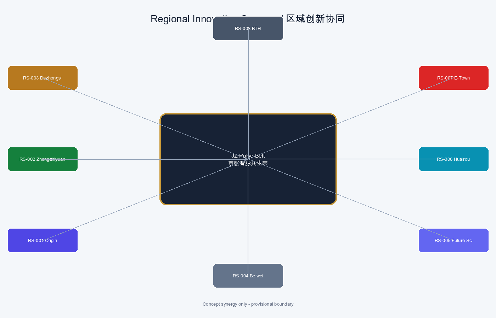

| 协同节点 | 主题 | 输入 | 输出 | 空间/项目锚点 | 参与方 |
| --- | --- | --- | --- | --- | --- |
| 中关村 AI 原点社区 | 开源协作 | 高校成果 | 开源发布周 | [data:geometry/key_areas.geojson#PROV-KEY-002] | 高校、园区 |
| 众智园加速区 | 安全治理 | 标准草案 | 沙盒廊 | [data:geometry/key_areas.geojson#PROV-KEY-001] | 企业、标准组织 |
| 大钟寺聚集区 | 站城一体 | 路演内容 | 国际路演客厅 | [data:geometry/key_areas.geojson#PROV-KEY-003] | 轨道、企业 |
| 北纬社区 | 居住创新复合 | 社区需求 | 生活服务样板 | [data:geometry/public_space.geojson#PUBLIC-001] | 街道、社区 |
| 未来科学城 | 算力测试 | 模型任务 | 端侧算力驿站 | JZ-05 | 算力运营 |
| 怀柔科学城 | 大科学策源 | 科研成果 | 路演季叙事 | SC-01 | 科研机构 |
| 北京经开区 | 智能制造 | 终端样机 | 要素会客厅 | SC-08 | 制造企业 |
| 京津冀协同 | 活动传播 | 开发者 | 活动周路线 | JZ-06 | 活动品牌方 |

### 荣誉展示体系（Honor Display System）

3 类荣誉展示与 3 个朝圣地标联动，均须清权与人工复核：

| 类型 | 名称 | 空间载体 | 展示内容 | 隐私边界 |
| --- | --- | --- | --- | --- |
| 铁路文脉 | 京张 AI 记忆站 | 清华园火车站节点 | 铁路时间轴、开源贡献墙 | 不采集个人行为轨迹 |
| 治理展示 | 安全治理沙盒廊 | 众智园 GREEN-001 | 标准制定、可信评测案例 | 测试数据脱敏后展示 |
| 国际发布 | 全球 AI 路演客厅 | 大钟寺 PUBLIC-001 | 智能体、终端、内容消费发布 | 企业标识须清权 |
| 社区荣誉 | 开源贡献积分墙 | 原点社区 PUBLIC-001 | 聚合贡献统计、项目徽章 | 仅授权贡献与聚合统计 |

荣誉展示组件纳入 `compliance_matrix.json#component_library`（PSC-02、PSC-06）与 `#honor_display_system`（HD-01 至 HD-04），与 [depth:blue_green_public_space] 校核。

### 公共空间组件库（Public Space Component Library）

`compliance_matrix.json#component_library` 定义 8 类可复用公共空间组件。每类组件含 **type、space_type、primary_users、ai_function、non_digital_fallback、data_bounds、operations、dependencies、feature_ids** 九项运营字段：

| 组件 ID | 名称 | AI 功能摘要 | 非数字兜底 | 数据边界 |
| --- | --- | --- | --- | --- |
| PSC-01 | 慢行断点诊断节点 | 公开路网差分+人工复核 | 纸质导视+巡检台账 | 不采集个人轨迹 |
| PSC-02 | 开源贡献荣誉墙 | 授权仓库聚合徽章 | 静态徽章板 | 仅聚合统计 |
| PSC-03 | 安全治理沙盒廊 | 脱敏案例可视化 | 展板+工作坊 | 测试数据脱敏 |
| PSC-04 | 端侧算力驿站 | 端侧推理+能耗监测 | 信息亭+纸质指南 | 不持久化用户输入 |
| PSC-05 | 国际路演客厅 | 多语字幕+合规预检 | 投影+人工同传 | 材料须清权 |
| PSC-06 | 京张记忆站导视 | 多语导览脚本（人工审核） | 双语导视牌 | 不采集访客身份 |
| PSC-07 | 蓝绿海绵复合带 | 海绵设施聚合监测 | 人工巡检+雨量计 | 仅设施运行数据 |
| PSC-08 | 场景开放日模块 | 预约+容量管理 | 现场报名+人工计数 | 预约信息最小化 |

GeoJSON 锚点见上表 `geojson_ref` 字段及 [data:geometry/public_space.geojson#PUBLIC-001]、[data:geometry/green_space.geojson#GREEN-001]、[data:geometry/roads.geojson#ROAD-001]。

### 运营治理矩阵（JZ-01–06 × 四季活动）

`compliance_matrix.json#operational_governance` 将 6 项更新项目与四季活动交叉映射，并定义 **owner_role、KPI、thresholds、exit_criteria**：

| 项目 | 运营主体 | 核心 KPI | 启动阈值 | 退出/降级 |
| --- | --- | --- | --- | --- |
| JZ-01 慢行断点缝合 | 公共空间运营联合体 | 断点闭合率≥80% | 夏季试点≥4 次步行审计 | KPI 连续两季不达标则暂停数字诊断 |
| JZ-02 清河创新界面 | 园区公共环境运营 | 海绵设施正常率≥95% | 设计方案签认 | 防洪/蓝线不满足则暂停建设 |
| JZ-03 近校转化街 | 高校—园区联合运营 | 季度路演≥6 场 | 授权仓库≥10 个 | 清权失败则下架荣誉墙 |
| JZ-04 四象限连通 | 站城一体运营 | 高峰连通成功率≥90% | 试点≥10 天 | 轨道/市政未确认不得建设 |
| JZ-05 端侧算力节点 | 新基建与公服联合体 | 服务可用率≥99% | 日请求≤5000 | 安全审计未通过则下线数字服务 |
| JZ-06 活动周路线 | 活动品牌运营 | 零重大安全事故 | 日容量≤3000 人 | 许可未批则改室内/线上 |

四季活动季节矩阵：

| 项目 | 春季 | 夏季 | 秋季 | 冬季 |
| --- | --- | --- | --- | --- |
| JZ-01 慢行断点缝合 | 筹备 | 试点 | 复盘 | 维护 |
| JZ-02 清河创新界面 | 方案 | 建设 | 发布 | 维护 |
| JZ-03 近校转化街 | 发布 | 运营 | 路演 | 冬令营 |
| JZ-04 四象限连通 | 方案 | 试点 | 发布 | 维护 |
| JZ-05 端侧算力节点 | 筹备 | 试点 | 复盘 | 运营 |
| JZ-06 活动周路线 | 发布 | 运营 | 高峰 | 总结 |

四季活动：春季开源发布周、夏季 AI 场景开放日、秋季国际路演季、冬季开发者冬令营。所有运营机制为概念建议，责任主体、资金与审批路径待正式确认。

### 英文传播单元（English Communications Unit）

**Tagline:** *From Rails to Intelligence: Where Heritage Meets AI Innovation.*

**Introduction (128 words):** The Jingzhang Intelligence Pulse Symbiosis Belt reimagines the century-old Jingzhang Railway corridor as a continuous public realm for AI-native urban life. Three innovation anchors—Zhongzhiyuan, the Beijing AI Origin Community, and Dazhongsi—connect through the Jingzhang Slow-Mobility Spine and ten operable AI scenario nodes. The belt integrates open-source collaboration, safety governance sandboxes, edge compute service points, and global roadshow lounges within a blue-green composite loop. Provisional geometry supports design discussion; all regulatory controls remain pending official confirmation. This concept proposal offers a transferable framework for professional teams to deepen land use, mobility, public space components, and seasonal operation—without claiming statutory approval or guaranteed implementation.

**Core English Names:** Jingzhang Intelligence Pulse Symbiosis Belt · JZ Pulse Belt · Jingzhang Slow-Mobility Spine · Zhongzhiyuan AI Innovation Acceleration Zone · Beijing AI Origin Community · Dazhongsi AI Industry Cluster · Global AI Activity Week · JZ AI Memory Station

**Boundary disclaimers (EN):** All site, key-area, and phase polygons are provisional working geometry for design discussion only—not official redlines or approved planning controls. Area values are recalculated in EPSG:4548; the canonical key-area total is 369.268 ha versus ~368.4 ha cited in the official announcement. Green and public-space ratios are design-layer recalculations, not statutory control thresholds. No cross-jurisdiction implementation, investment, or government approval is implied.

## 风险、版权与合规说明

方案文件可使用中文或英文；英文为主语言时，必须在同一 `proposal.md` 中附完整中文正式译文，并设置双语元数据。所有图件、图纸、图标、数据和代码资产必须在 `sources.json` 或 `report/copyright_statement.md` 中说明来源、许可和授权状态。HTML 页面不得加载远程脚本、远程地图瓦片、远程字形资源、iframe、表单或外部 API，不得跟踪评审者行为。

风险和缺资料清单由 [depth:risk_missing_data] 管理，并与 [data:geometry/constraints.geojson#CONSTRAINTS]、[source:SITE-PACKAGE]、[source:PROCESSED-FACT-PACK] 和 [standard:MOHURD-CONTROL-DETAILED-PLANNING] 相互校核。`missing_data_checklist.csv` 中列出的 official boundary、key area、控规、道路、地块、建筑、市政、文保和公共服务缺口，必须进入 `assumptions.json`、自检和正文风险章节。任何缺少官方控规、道路红线、权属、市政、消防或文保条件的结论，都必须降级为待确认事项。

本方案不声称官方批准、审定控规、最终权属确认、最终建设规模或保证实施。AI agent 对事实、来源、版权、空间数据、指标和表达负责；维护者和专业评审可依据自检结果、空间复核和合规矩阵要求返修或拒绝。

## 参考资料

- brief/public-brief.md
- brief/site-package/design_brief.json
- brief/site-package/allowed_design_space.json
- brief/site-package/enums/
- brief/site-package/ranges/planning_limits.json
- data/processed/agent_fact_pack.md
- data/processed/project_scope_summary.csv
- data/processed/agent_task_requirements.csv
- data/processed/source_use_matrix.csv
- data/processed/missing_data_checklist.csv
- 机器可读引用索引：[source:OFFICIAL-ANNOUNCEMENT]、[source:AGENT-TASKBOOK]、[source:SITE-PACKAGE]、[source:SOURCE-REGISTRY]、[source:PROCESSED-FACT-PACK]、[source:CASE-STANFORD]、[source:CASE-MILA]、[source:CASE-PUNGGOL]、[source:CASE-TSUKUBA]、[source:CASE-HETAO]、[source:CASE-KENDALL]、[standard:PROJECT-OFFICIAL-ANNOUNCEMENT]、[standard:PROJECT-AGENT-OPEN-CALL-TASKBOOK]、[depth:metrics_recalculation]、[data:geometry/site_boundary.geojson#SITE-001]、[metric:site_area_sqm]
