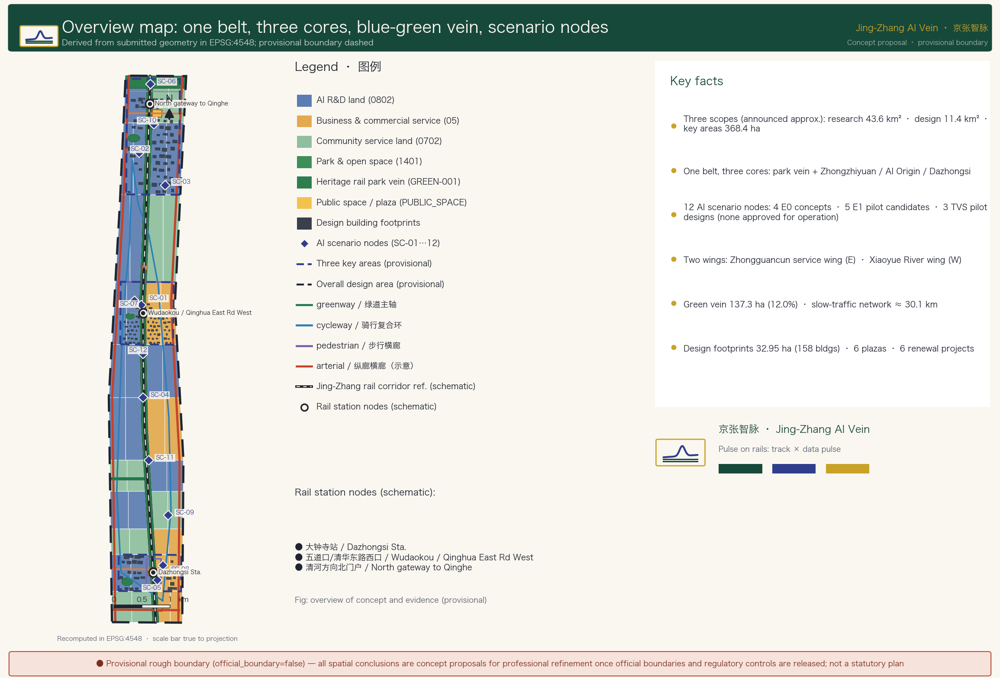
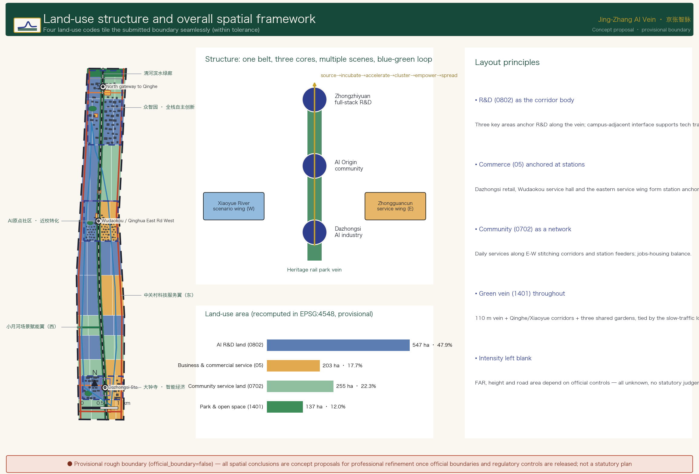
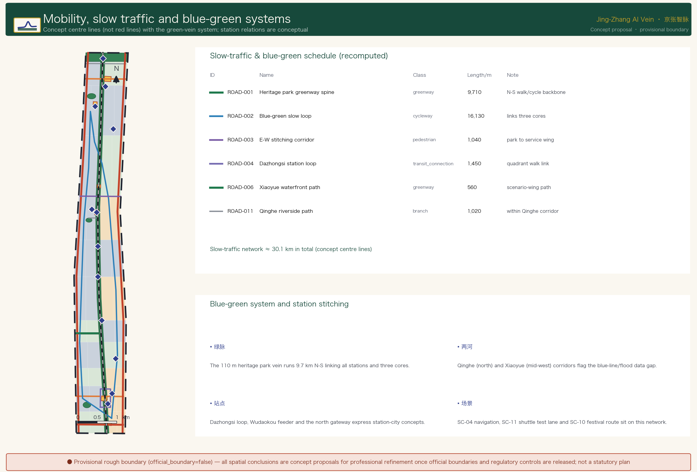
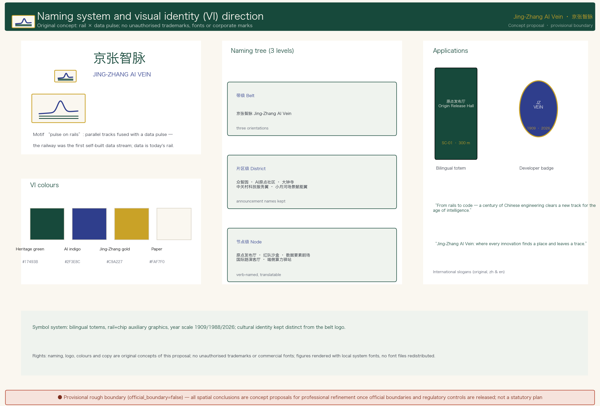
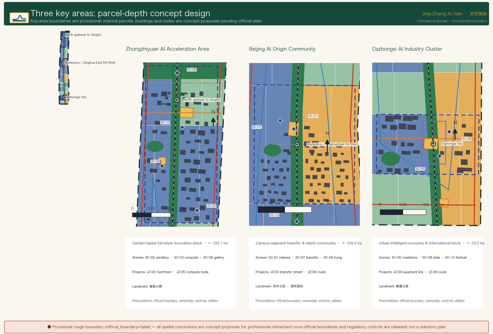
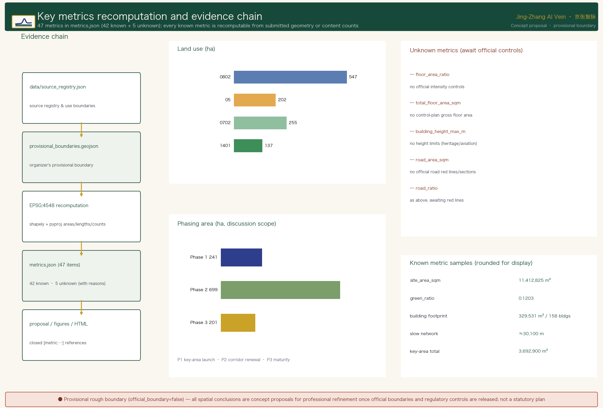

# Jing-Zhang AI Vein: Regenerating a Centennial Railway Corridor for AI Innovation

## Design Basis and Source List

This formal proposal is a submission to the *Centennial Jing-Zhang AI Innovation Belt International Urban Design Scheme Solicitation*. Its primary authority is the *Qualification Pre-Announcement for the Centennial Jing-Zhang AI Innovation Belt International Urban Design Scheme Solicitation* [source:OFFICIAL-ANNOUNCEMENT], with the agent open-call taskbook [source:AGENT-TASKBOOK], the site package `brief/site-package/` [source:SITE-PACKAGE], the central source registry [source:SOURCE-REGISTRY], and the processed fact pack [source:PROCESSED-FACT-PACK] as machine-readable dependencies. The announcement's text boundaries and approximate areas anchor the three-level scope tasks; official polygons for the three scope levels and the three key areas are not yet available, so this package uses the provisional rough boundaries in `brief/site-package/geometry/provisional_boundaries.geojson` [source:PROVISIONAL-BOUNDARIES], all labeled `provisional_constraint`, `official_boundary=false`, and `boundary_precision=provisional_rough`. They must not serve as official redlines, approval bases, or precise-area references [standard:PROJECT-OFFICIAL-ANNOUNCEMENT] [depth:existing_conditions_diagnosis].

All spatial proposals here are **conceptual recommendations / reference schemes / for further deepening by professional teams**; they do not replace formal planning and are not government-approved conclusions [standard:PROJECT-AGENT-OPEN-CALL-TASKBOOK]. Boundary interpretation returns to the overall-scope layer and area recalculation [data:geometry/site_boundary.geojson#SITE-001] [metric:site_area_sqm] (rounded to the nearest 100 m² under the provisional boundary — not precise areas); the three key areas are verified by an independent layer and quantitative metrics [data:geometry/key_areas.geojson#PROV-KEY-001] [metric:key_area_count] [metric:key_area_total_area_sqm].

Source-use boundaries [source:SOURCE-REGISTRY]:

- Formal task basis: announcement, taskbook, professional standards (Urban Design Measures, Regulatory Detailed Planning Measures, Land-Use Classification Guide), and governance regulations (Generative AI Interim Measures, Barrier-Free Environment Law).
- Background only: three-zones-two-wings, Haidian's "1+X+1" industrial system [source:THREE-AREAS-TWO-WINGS] [source:HAIDIAN-1X1], State Council Document No. 45 (2020) [source:ELDERLY-SMART-TECH-PLAN], and the public report that the control plan along the Jing-Zhang Heritage Park corridor was approved [source:BEIJING-JZ-CONTROL-PLAN-APPROVAL-20260812] — that report confirms approval in August 2026 (plan period 2024–2035) but does not disclose parcel-level indicator details on the page; status and context only, not spatial-control evidence.
- Provisional only: provisional rough boundaries [source:PROVISIONAL-BOUNDARIES] — generation, display, and intake self-check only.

## Three-Level Scope Framework

The proposal is organized on the three levels defined by the announcement [source:OFFICIAL-ANNOUNCEMENT] [depth:three_level_scope_framework]:

| Level | Announced scope | Question answered | Data anchor |
| --- | --- | --- | --- |
| Coordinated Research Area | ~43.6 km² (announcement text figure; no corresponding submitted layer) | AI industry ecology, three-zones-two-wings coordination, future urban form, naming/VI system | [source:OFFICIAL-ANNOUNCEMENT], [metric:global_case_study_count] |
| Overall Design Area | ~11.4 km² (provisional recompute 11,412,825.386 m², not an official precise area) | Urban renewal framework, land-use structure, transit-municipal, Heritage Park activity belt, urban character | [data:geometry/site_boundary.geojson#SITE-001], [data:geometry/roads.geojson#ROAD-001], [metric:renewal_project_count] |
| Key Detailed Design Area | ~368.4 ha announced; ~369.3 ha by provisional-geometry recompute (not an official precise area) [source:OFFICIAL-ANNOUNCEMENT] [source:PROVISIONAL-BOUNDARIES] | Three key areas at integrated-planning-implementation conceptual depth | [data:geometry/key_areas.geojson#PROV-KEY-001], [data:geometry/key_areas.geojson#PROV-KEY-002], [data:geometry/key_areas.geojson#PROV-KEY-003] |

The three levels are not isolated drawing sets [depth:overall_spatial_structure]: coordinated research determines innovation-chain and urban-form judgments; overall design translates them into renewal projects, spatial structure, and facility capacity; key-area detailed design validates implementability of parcels, buildings, transit, public space, and AI scenarios. All spatial conclusions are currently constrained by provisional boundaries and must be recalculated per the assumptions [data:geometry/constraints.geojson#CONSTRAINTS] once official boundaries arrive.

## Coordinated Research Area: Industry and Future City Research

### Main Name, English Name, and Naming System (agent.1 naming)

Main name: **Jing-Zhang AI Vein — One Belt, Symbiotic Innovation** (Chinese: 京张智脉 · 一带共生; abbreviation JZ-AI Vein). The name juxtaposes Jing-Zhang's railway identity with AI data flow: the rail was the first self-built data stream; data streams are today's rails. The naming system has three tiers:

1. **Belt tier**: Jing-Zhang AI Vein — commanding the three positioning pillars (Centennial Jing-Zhang Cultural Belt, Urban AI Life Experience Belt, AI Convergence Innovation Belt).
2. **Area tier**: the announcement's three key areas and two wings (Zhongzhiyuan AI Independent Innovation Acceleration Area, Beijing AI Origin Community, Dazhongsi AI Industry Cluster, Zhongguancun Technology Services Wing, Xiaoyue River Scenario Enablement Wing).
3. **Node tier**: scenarios and landmarks use action words ("Origin", "Red-Team", "Roadshow", "Theater", "Station") that translate directly and are memorable.

### Logo / Visual Identity Direction (agent.1 VI)

The Logo/VI uses the "**Pulsing Track**" motif [source:AGENT-TASKBOOK]: Jing-Zhang railway rails and an AI data-pulse curve are isomorphic, forming a rising "track—pulse" line that symbolizes a century of engineering autonomy moving toward contemporary intelligent autonomy. VI palette: **railway deep green** (heritage and ecology), **AI indigo** (innovation and compute), **Jing-Zhang gold** (commemoration and quality). The auxiliary graphic is a grid system where rail spacing and chip pinouts share geometry, usable across signage, boards, events, and digital interfaces. The naming and VI are original concepts using no unauthorized trademarks, fonts, or corporate logos [depth:height_massing_character].

The VI direction lands in visual evidence: the naming tree (belt–district–node), the colour system, bilingual totem and developer-badge applications, and the international slogans all appear in the brand-vi sheet (zh and en versions), sharing one identity system with the A3 cover and the A0 board header. The cultural identity system (station-style totems, year scale) stays clearly distinct from the belt logo system.

### Three Positioning Pillars, Five Functions, and the Three-Zones-Two-Wings Coordination Loop (agent.1 structure)

- **Three positioning pillars**: Centennial Jing-Zhang Cultural Belt; Urban AI Life Experience Belt; AI Convergence Innovation Belt.
- **Five functions**: Full-Stack Independent AI Innovation System; World-Class AI Innovation Ecosystem; AI+ Scenario Enablement Paradigm; Smart AI Vibrant City; Global Voice in AI Governance.
- **Three zones and two wings**: the three key areas, plus the Zhongguancun Technology Services Wing (global factor allocation, Zhongguancun IP and capital enablement) and the Xiaoyue River Scenario Enablement Wing (scenario enablement and an AI-vibrant city) [source:THREE-AREAS-TWO-WINGS].

The coordination loop is a six-stage closed circuit — "**source → incubate → accelerate → cluster → enable → communicate**": university sourcing (hosted by AI Origin Community) → open-source incubation (Origin) → pilot acceleration (Zhongzhiyuan) → industry clustering (Dazhongsi) → scenario enablement (Xiaoyue River wing) → service feedback (Zhongguancun wing) — a spatial loop along the Jing-Zhang corridor from the wings toward the cores [depth:overall_spatial_structure].

### Overall Spatial Structure and Regional Synergy

The overall structure is "**one belt, three cores, multi-point scenarios, and a blue-green slow-mobility composite ring**": the belt is the Jing-Zhang Heritage Park activity spine (historical and public-space main axis, north-south through); the cores are the three key areas; multi-point scenarios are twelve AI scenario nodes (4 E0 concepts, 5 E1 pilot candidates, 3 TVS pilot designs; none is an approved operation or field-validated result); the composite ring links cores, park, and wings with slow mobility and rail-station transfers [depth:blue_green_public_space]. Regional synergy is expressed only as **proposed flows** supported by registered background material: Haidian may host R&D, incubation, and testing; Future Science City and Huairou Science City are potential research-collaboration directions; the Economic-Technological Development Area is a potential engineering and manufacturing direction; Beijing-Tianjin-Hebei is a potential application and supply-chain direction; and Beiwei Community (北纬社区), a residential community along the corridor, is regarded only as a stakeholder and feedback source for the "ordinary-first" principle and community co-governance pilots (SC-09-type daily-life scenarios), with no claim of spatial division, institutional partnership, or capacity commitment [source:THREE-AREAS-TWO-WINGS] [source:HAIDIAN-1X1] [source:AGENT-TASKBOOK]. These arrows are not signed partnerships, official divisions of responsibility, or government commitments; actors, projects, capacity, and timing remain unconfirmed.

### Governing rule: ordinary first, overlay second; no G0, no light

Every AI scenario in this proposal obeys one rule that runs through the whole corridor: **the complete everyday use by ordinary people takes precedence over any AI demonstration — scenarios are switchable overlays on top of daily city life**. It becomes three checkable disciplines:

1. **No G0, no light**: before a scenario node may move from "concept" to "lit", it must pass a G0 deterministic tabletop replay (pure-function re-execution of its stated rules; zero model calls, zero field activity, zero personal data) and have its equivalent human channel in place;
2. **Failure closes only the overlay**: any stop/hold affects only that scenario; ordinary park, commute, and daily use continue uninterrupted;
3. **The three cores are non-interchangeable**: Zhongzhiyuan's "bypass testing garden", the Origin Community's "one street, two courts", and Dazhongsi's "four-quadrant commute with off-route service" are three distinct spatial mechanisms that share no common template.

Scenarios are organised on a three-step lighting ladder [metric:scenario_lighting_e0_count] [metric:scenario_lighting_e1_count] [metric:scenario_lighting_e2_count]: **E0 concept** (4 nodes, unlit, direction only), **E1 pilot-ready candidate** (5 nodes, lighting preconditions met — still not an operating approval), **E2-design pilot-design tier** (3 TVS, design depth at pilot-validation grade; a real E2 awaits field operational data — zero field-validated operations, no approved operating track record). The ladder is an evidence gate, not a schedule promise.

### Future Urban Form (agent.1 outlook)

An AI-adapted urban form answers how AI changes work, life, socializing, learning, transport, and public services: a work-housing-commerce-service mix with lifecycle space supply as the skeleton, a continuous borderless blue-green system with a composite slow-mobility ring as the daily network, and edge computing, distributed energy, and scenario access as new urban-service infrastructure [source:OFFICIAL-ANNOUNCEMENT]. These are conceptual recommendations only, not approved regulatory planning or implementation commitments [standard:MOHURD-CONTROL-DETAILED-PLANNING] [depth:development_intensity_controls].

### Global Cases and Eight Mechanisms (agent.2)

Six global AI innovation ecosystem cases are selected; each records a **primary source, core mechanism, applicability, non-transferable points, and local conversion moves** [source:AGENT-TASKBOOK] [metric:global_case_study_count]:

| Case | Primary source | Core mechanism | Applicability | Non-transferable points | Local conversion |
| --- | --- | --- | --- | --- | --- |
| Stanford Research Park, USA | Specific `About / Foundation` page [source:CASE-STANFORD-RESEARCH-PARK] | Long-term operation and community networks in a university-affiliated park | Campus-adjacent innovation and a durable operator | Land, capital, and governance conditions are not transferable | Origin campus mechanism; land/space/talent mechanisms |
| Cambridge Science Park, UK | Specific `Our Story` page [source:CASE-CAMBRIDGE-SCIENCE-PARK] | University asset platform and long-term park evolution | Dense university research base | UK land and governance structure differ | Zhongguancun Services Wing; transformation street |
| Station F, France | Specific `About` and `Programs` pages [source:CASE-STATION-F] | Multiple incubation programs and shared services on one campus | Core-city property and brand resources | Paris property and program scale are not transferable | Origin incubation cluster; talent services |
| one-north, Singapore | JTC specific `One-North` page [source:CASE-ONE-NORTH] | District-based organization of industry, research, and daily services | Coordinated development and long-term operation | Land system and government role are not transferable | Zhongzhiyuan phasing and mixed functions; land mechanism |
| Barcelona 22@, Spain | City `22@` topic entry [source:CASE-BARCELONA-22AT] | Continuing public agenda for an innovation-led renewal district | Industrial legacy and renewal demand | Scale, ownership, and statutory tools differ | Jing-Zhang renewal; low-efficiency space reuse |
| Toronto Quayside, Canada | Waterfront Toronto `Quayside` project page [source:CASE-WATERFRONT-TORONTO] | Public realm, ecology, and public participation developed together | Independent public development body and waterfront renewal | Site, procurement, and approvals differ | Public-realm-first delivery, participation records, and data minimization |

Eight mechanisms are distilled: ① land (flexible mixed use, renewal release, phased supply); ② space (shared testbeds, pilot space, public-space component library); ③ industry (AI+ vertical applications, industry map and functional mix); ④ capital (public service investment plus market funds, no promised investment figures); ⑤ talent (talent zone, housing, services); ⑥ compute (edge compute, distributed energy, no promised capacity); ⑦ data (compliant data-factor circulation, data minimization); ⑧ scenario (scenario access, testing and validation, human review and fail-closed). All are mechanism recommendations; no company lists, investment figures, or policy promises are fabricated [depth:metrics_recalculation].

**AI ecosystem map and industry-space mapping.** The six stages form a traceable workflow across figures, spatial nodes, mechanisms, and accountable roles:

| Stage | Three cores / two wings and public nodes | Main mechanisms | Operating role and auditable output |
| --- | --- | --- | --- |
| Research | AI Origin Community, campus edge, Zhongguancun Services Wing | talent, compute, space | university/research team + technical-service platform; authorized result records and open-source releases |
| Incubation | Origin transformation street and release hall | space, capital, talent | incubator + legal/investment services; admission review and service tickets |
| Testing | Zhongzhiyuan shared testbed, SC-02 sandbox, Xiaoyue River Scenario Wing | compute, data, scenario | test operator + expert panel; test plans, audit logs, closure records |
| Translation | Zhongguancun Services Wing, Origin street, Dazhongsi roadshow parlor | industry, capital, data | translation platform + professional services; matching records and compliance review |
| Scaling | Dazhongsi cluster, Zhongzhiyuan mixed carriers, external coordination directions | land, industry, space | area operator + enterprises; access review, spatial demand, and phasing list |
| Communication | Heritage Park public route, three landmarks, Global AI Week | scenario, talent, public space | public-space/event operator; event record, complaint closure, review metrics |

A stage may span several spaces, but every arrow must end at an accountable role and an auditable output. Future Science City, Huairou Science City, the Economic-Technological Development Area, and Beijing-Tianjin-Hebei are proposed coordination directions, not contracted nodes. The map is visible in the `site-overview` figure, A0-1/A0-4, A3-3, and both visual-index languages, with explicit agent.2 matrix links.

## Overall Design Area: Urban Renewal and Regulatory-Plan-Level Urban Design

The Overall Design Area uses urban renewal as its lever for 11.4 km² of regulatory-plan-depth urban design [source:OFFICIAL-ANNOUNCEMENT] [standard:MOHURD-CONTROL-DETAILED-PLANNING] [depth:land_use_layout].

### Urban Renewal Overall Framework

The renewal structure organizes along both sides of the Jing-Zhang Heritage Park and identifies three potential-renewal types: low-efficiency industrial space (industrial districts along the corridor), station-city space (around rail stations), and community-support space (residential east of the park). The framework follows "**stitch the corridor, activate the stations, improve the communities**":

- Stitch the corridor: mend low-efficiency space on both sides of the park into continuous industrial and public frontages;
- Activate stations: integrate functions around Wudaokou, Qinghua East Road West Exit, and Dazhongsi stations;
- Improve communities: balance work-housing-commerce-service and public-service supply.

Six renewal projects (JZ-01 to JZ-06) are listed in the "Renewal Projects, Implementation Policy, and Phasing" section [metric:renewal_project_count] [depth:renewal_project_list]. Demolish–renovate–retain (DRR) classification remains a method-and-pending-list only until ownership and building inventories arrive; no parcel-level DRR conclusions are specified [depth:retain_renovate_demolish].

### Land-Use Structure and Functional Layout

Land use follows the *Territorial Spatial Survey, Planning, and Use-Control Land-Sea Classification Guide* [standard:MNR-LAND-USE-CLASSIFICATION-GUIDE]; four zones tile the submitted boundary completely without overlap [data:geometry/land_use.geojson#LU-001] [metric:land_use_zone_count]:

| Code | Zone | Area (recomputed from submitted geometry) | Share of overall design area |
| --- | --- | --- | --- |
| 0802 | AI R&D innovation land | ~547 ha [metric:land_use_area_0802_sqm] | ~47.9% |
| 05 | Business and commercial-service land | ~202 ha [metric:land_use_area_05_sqm] | ~17.7% |
| 0702 | Community-service and support land | ~255 ha [metric:land_use_area_0702_sqm] | ~22.3% |
| 1401 | Park green and open space | ~137 ha [metric:land_use_area_1401_sqm] | ~12.0% |

[metric:land_use_parcel_count]: 45 land-use blocks (44 functional clusters plus one green-vein zone [data:geometry/land_use.geojson#LU-045]) tile the submitted boundary seamlessly within numeric tolerance and without overlap. The 1401 zone consists of the vein [data:geometry/green_space.geojson#GREEN-001], the Qinghe corridor [data:geometry/green_space.geojson#GREEN-002], the Xiaoyue corridor [data:geometry/green_space.geojson#GREEN-003], and three shared gardens ([data:geometry/green_space.geojson#GREEN-004], [data:geometry/green_space.geojson#GREEN-005], [data:geometry/green_space.geojson#GREEN-006]), consistent in area.

The corridor reads as a clear spatial order [data:geometry/land_use.geojson#LU-005]: **R&D (0802) is the corridor body** — the three key areas anchor innovation and extend along the vein; **commerce (05) anchors at stations** — the Dazhongsi smart-retail cluster, Wudaokou service cluster and the eastern service-wing axis carry retail, business and international exchange; **community services (0702) form a network** along the E-W stitching corridors and station feeders; **the green vein (1401) runs the full length** — a ~110 m heritage park vein linking two river corridors and three shared gardens. Proportions and the spatial model are conceptual, for professional deepening against official boundaries and controls [source:HAIDIAN-1X1] [depth:development_intensity_controls].

### Development Intensity and Building Scale (pending confirmation)

Total building scale, FAR, building height, building density, and green ratio all depend on official regulatory-plan conditions. The corridor's control plan has been approved (public report, August 2026, plan period 2024–2035 [source:BEIJING-JZ-CONTROL-PLAN-APPROVAL-20260812]), but parcel-level FAR/height details are not disclosed on public channels, so this package keeps marking them `unknown` with recalc triggers [metric:floor_area_ratio] [metric:total_floor_area_sqm] [metric:building_height_max_m]; only building coverage (indicative footprint / boundary) is recomputable from submitted geometry [metric:building_coverage_ratio]. Indicative footprints total 158 buildings over ~33.2 ha in four clusters — Zhongzhiyuan R&D [data:geometry/buildings.geojson#BLDG-001], Origin incubation [data:geometry/buildings.geojson#BLDG-002], Dazhongsi offices [data:geometry/buildings.geojson#BLDG-003], and station mixed-use [data:geometry/buildings.geojson#BLDG-004] [metric:building_count] — not an existing-building inventory [depth:height_massing_character].

## Detailed Design of Key Areas

Key-area detailed design is mandatory [source:OFFICIAL-ANNOUNCEMENT] [depth:three_key_area_detailed_design]; all three areas use provisional boundaries [data:geometry/key_areas.geojson#PROV-KEY-001] [data:geometry/key_areas.geojson#PROV-KEY-002] [data:geometry/key_areas.geojson#PROV-KEY-003].

### Zhongzhiyuan AI Independent Innovation Acceleration Area (~192.1 ha)

Positioning: **garden-type full-stack independent innovation district**. Its local prototype enters from a northern gateway and follows an "industry-display forecourt → red-team sandbox → shared test garden → Qinghe low-carbon edge" walking sequence. A north-south greenway is the spine; east-west cycling links connect the testbed, governance hall, edge-compute station, and public exchange lawn. AI nodes are SC-02, SC-03, and SC-06. Renewal projects JZ-02 and JZ-05 correspond to the prototype; the area operator manages access and asset logs, while the test operator owns test and closure records. Delivery depends on official boundaries, river blue lines, flood control, road redlines, energy, and safety conditions. The parcel-depth concept plan (key-areas figure, left inset) expresses concept relations only and cannot establish parcels, road redlines, existing buildings, or government commitments [data:geometry/green_space.geojson#GREEN-001] [data:geometry/green_space.geojson#GREEN-004] [metric:zhongzhiyuan_area_sqm].

### Beijing AI Origin Community (~104.3 ha)

Positioning: **campus-adjacent transformation and talent community**. Its local prototype enters from the rail/campus gateway and follows an "Origin release hall → transformation street → talent-service parlor → community courtyard" daily sequence. A slow-mobility cross-link joins the campus edge, incubation services, public green, and living support. AI nodes are SC-01, SC-07, and SC-09. Renewal projects JZ-03 and JZ-06 correspond to the prototype; the campus-industry platform manages authorizations and service tickets, and the street operator provides an accessible human counter. Delivery depends on ownership, existing buildings, station conditions, public-service capacity, and regulatory controls; no retain-renovate-demolish, height, or station-engineering conclusion follows [data:geometry/buildings.geojson#BLDG-001] [metric:beijing_ai_origin_community_area_sqm].

### Dazhongsi AI Industry Cluster (~72.0 ha)

Positioning: **urban smart-economy and international-exchange district**. Its local prototype enters from Dazhongsi Station and follows a day-to-night sequence of "four-quadrant pedestrian hall → Data Factor Parlor → international roadshow parlor → park event edge." The main walking loop links station access, commerce, public square, and static-traffic transfer; a cycling spur reaches Heritage Park. AI nodes are SC-05, SC-08, and SC-10. Renewal projects JZ-04 and JZ-06 correspond to the prototype; the area operator owns events and spaces, and the data operator owns authorization, audit, and delisting. Delivery depends on station conditions, road redlines, municipal utilities, ownership, green-space permission, and event safety; it cannot establish underground links, digital-asset legality, or enterprise/government commitments [data:geometry/public_space.geojson#PUBLIC-001] [data:geometry/roads.geojson#ROAD-004] [metric:dazhongsi_area_sqm].

## AI Innovation Ecosystem, Personas, and AI+ Scenarios

### User Personas (6 types, agent.3 persona)

| Persona | Typical needs | Spatial response | Data & privacy boundary |
| --- | --- | --- | --- |
| Open-source developer | Release, collaboration, testing, community reputation | Origin Release Hall, open-source contribution wall, nighttime collaboration space | No personal behavior tracking; activity data aggregate-only |
| Startup team | Low-cost office, compute access, product testbed | Zhongzhiyuan shared testbed, edge-compute station, governance consulting | Compute and data services require separate authorization |
| Leading-enterprise visitor | Display, business, international reception, recruiting | Dazhongsi Roadshow Parlor, rail transfer, public space around key enterprises | Enterprise logos and cases must be cleared |
| Surrounding resident | Commuting, leisure, community services, low-disturbance renewal | Heritage Park slow ring, embedded community services, tiered nighttime lighting | Resident profiles not used for commercial recommendation |
| University faculty/student | Achievement transformation, cross-campus collaboration, daily slow mobility | Campus-park slow-mobility stitching, transformation stations, AI education points | Campus data and research achievements require authorization |
| Older and accessibility users | Barrier-free mobility, human-service fallback, elder-friendly service | Accessible assistive terminals, parallel human counters, voice/button interaction | Dignity respected; no health or behavior profiling [source:BARRIER-FREE-ENVIRONMENT-LAW] [source:ELDERLY-SMART-TECH-PLAN] |

[metric:persona_count]

### AI Scenario Cards (12, agent.3)

Each card contains **id, user, spatial node, problem, service/interaction, required data and legal source, privacy minimization, human review / fail-closed, operating responsibility, maturity, and validation metrics** [source:AGENT-TASKBOOK] [metric:scenario_card_count]. The complete card summary follows; **SC-02, SC-08, and SC-11 are AI industry testing and validation scenarios (TVS)** [metric:testing_validation_scenario_count].

| id | Scenario | User | Spatial node | Problem → service/interaction | Data & legal source | Privacy minimization | Human review / fail-closed | Operating responsibility | Maturity | Validation metrics |
| --- | --- | --- | --- | --- | --- | --- | --- | --- | --- | --- |
| SC-01 | Origin Open-Source Release Hall | Open-source developers / universities | Origin release node | Fragmented release channels → release, code wall, mini-roadshow | Public open-source metadata; voluntarily submitted project info | Project-level aggregation only | Human review of published content | Community operator + property | Pilot-ready | Release sessions, contributions |
| SC-02【TVS】 | Red-Team Sandbox & Governance Hall | Model developers / governance bodies | Zhongzhiyuan governance hall | Safety evaluation lacks controlled environment → standards, red-team testing, display | Authorized controlled test sets | Test data stays in sandbox | Expert review of results; fail-closed | Zhongzhiyuan operator + regulator | E2-design (pilot design tier) | Evaluation tasks, pass rate |
| SC-03 | Edge Compute Station | Startups / enterprises | Overall-design nodes | Compute access is costly → shared edge compute, energy display | Authorized use; public service data | Task-level logs only | Anomaly usage human review | New-infrastructure operator | Concept | Usage, energy |
| SC-04 | AI Wayfinding for Slow Mobility | Residents / visitors | Heritage Park belt | Breakpoints hard to identify → explainable signage, low-intrusion sensing | Public road/park data | No individual trajectory collection | Prompts human-verified | Park operator | Pilot-ready | Breakpoint detection accuracy |
| SC-05 | Dazhongsi International Roadshow Parlor | Leading enterprises / overseas visitors | Dazhongsi | Lacks international exchange venue → roadshow, negotiation, media release | Public registration info | Event aggregate only | Content compliance review | Area operator | Pilot-ready | Roadshow sessions, contacts |
| SC-06 | Qinghe Low-Carbon Innovation Corridor | Enterprises / public | Zhongzhiyuan Qinghe interface | Single-function blue-green space → low-carbon display, stormwater, cycling | Public environmental data | No individual behavior collection | Facility maintenance human inspection | Area operator + ecology management | Concept | Usage frequency, green stock |
| SC-07 | Campus-Area Transformation Street | Faculty/students / startups | Origin Community | Transformation services scattered → incubation, legal, investment, display | Authorized research info | Authorized scope only | Transformation decisions human-gated | Campus-industry platform | Pilot-ready | Transformation matches |
| SC-08【TVS】 | Data Factor Parlor | Data merchants / enterprises | Dazhongsi | Data circulation compliance is hard → compliant authorization, auditable circulation demo | Registered compliant datasets (authorized) | Minimum necessary, auditable | Transaction compliance human review; delist on violation | Data-factor operator | E2-design (pilot design tier) | Circulation volume, compliance rate |
| SC-09 | AI Life-Service Model Street | Residents / older adults | Community-commerce junction | Fragmented life services → AI+ healthcare/education/legal/life services | Public service info; voluntary submission | Not used for commercial profiling | Service outcomes human-reviewed | Street operator + providers | Concept | Coverage, satisfaction |
| SC-10 | Global AI Week Route | Global participants | Belt public-space system | Fragmented event experience → walkable, shareable experience route | Public event info | Registration aggregate | Event safety human contingency | Event committee | Pilot-ready | Participation, reach |
| SC-11【TVS】 | Autonomous Shuttle Test Corridor | Automakers / developers | Transit test corridor | Open-road testing lacks controlled segment → restricted shuttle test | Public vehicle/route registration | No bystander data collection | Safety officer + remote human takeover | Transport authority + operator | E2-design (pilot design tier) | Test mileage, takeover rate |
| SC-12 | Urban Agent Operations Console | City operators | Governance hub | Fragmented public-service sensing → facility maintenance, event safety alerts | Public municipal data | Aggregate statistics only | Operational instructions human-confirmed | City operator | Concept | Alert accuracy, response time |

All cards carry content-safety and complaint-channel boundaries [source:GENERATIVE-AI-INTERIM-MEASURES] [standard:GENERATIVE-AI-INTERIM-MEASURES] and preserve accessibility and human fallback [standard:BARRIER-FREE-ENVIRONMENT-LAW]. Scenarios are not slogans: public-space scenarios anchor to [data:geometry/public_space.geojson#PUBLIC-001], slow-mobility scenarios to [data:geometry/roads.geojson#ROAD-001], open-space scenarios to [data:geometry/green_space.geojson#GREEN-001], supported by [metric:public_space_ratio] and [metric:green_ratio].

#### Testable service blueprints for the three TVS

| TVS | persona / trigger / spatial node | Frontstage → backstage and input/output | Governance, responsibility, and equivalent human service | Pilot gate, steps, and exit | Verifiable metrics and collection |
| --- | --- | --- | --- | --- | --- |
| SC-02 Red-Team Sandbox | model developer or governance practitioner; booking or human counter; Zhongzhiyuan governance hall | authorized model and test goal → isolation check, red-team run, expert review → qualified report and remediation list | controlled data stays in sandbox; minimum task logs; expert review; anomaly stops testing; on-site complaint desk/written appeal; test operator accountable and regulator involved only when lawfully authorized; staff file the same request for non-smartphone users | gate: ownership, authorized test set, safety lead, isolated environment; register → baseline → attack tests → review → result meeting; exit on unauthorized data, isolation failure, or inability to review | completion rate (work orders); severe-finding reproduction rate (review record); false-positive rate (expert labels); appeal closure time (complaint log) |
| SC-08 Data Factor Parlor | data provider/user; online appointment or counter; Dazhongsi parlor | purpose, authorization, field list → identity/authority check, minimum-field map, sandbox query, compliance review → auditable result or refusal reason | no raw-data copying; minimum result; human compliance officer; missing authority means refusal and anomaly means delisting; counter/written appeal; data operator accountable; counter staff offer the same query application | gate: lawful source, purpose limit, retention period, accountable owner; register → minimize fields → sandbox demo → review → archive; exit on withdrawal, failed audit, or purpose drift | compliance pass rate (audit forms); field-reduction rate (field map); anomaly delisting time (event log); appeal closure rate (register) |
| SC-11 Shuttle Test Corridor | R&D team, rider, and corridor public; approved test application or on-site service point; limited corridor | vehicle, route, safety-driver data → route check, pre-run inspection, geo-fenced operation, remote monitoring, incident review → mileage and takeover/stop record | no unrelated pedestrian identity; on-board safety driver and remote takeover; location, communications, or driver failure triggers stop; on-site/phone complaint and review; transport authority lawfully approves and operator executes; non-smartphone users receive equivalent on-site registration and service information | gate: statutory road-test permit, bounded conditions, insurance, emergency plan; pre-check → empty run → passenger run → review; exit on boundary breach, lost link, serious event, or excess takeover threshold | takeovers per 1,000 km (vehicle logs); minimal-risk-stop success (incident record); pre-check pass rate (checklist); complaint closure time (register) |

All three blueprints are **conceptual pilot designs**, not approved operations. Older people, disabled users, and people without smart devices can use a human counter, phone, or paper form at each node for equivalent registration, status checking, result explanation, and appeal. Choosing a human channel must not reduce service level.

#### G0 deterministic replay evidence and the no-account rights contract

To make the governance rules *checkable* rather than merely readable, each TVS completed a **G0 deterministic tabletop replay** [data:visual/assets/tvs_g0_replay_evidence.json]: the admission, review, stop, and recovery rules were implemented as pure functions and re-executed over 24 decision points [metric:tvs_g0_decision_point_count] — expected and actual decisions are produced independently by the same rule function, and **24/24 match** [metric:tvs_g0_expected_decision_match_ratio]; all four branch types are covered by decision points (stop/hold/recover/proceed = 11/4/3/6) [metric:tvs_g0_stop_recovery_branch_coverage_ratio]; all 15 stop/hold controls carry a human-review point and an equivalent human service, a **fail-closed enforcement of 15/15** [metric:tvs_g0_fail_closed_enforcement_ratio]. The replay uses zero model calls, zero field activity, and zero personal data, and claims no G1+ field evidence.

The accompanying **non-AI parity and no-account rights contract** [data:visual/assets/non_ai_parity_contract.json] writes public rights as seven checkable commitments [metric:no_account_right_count]: account-free use, no forced QR codes, non-AI same-task routes, low-disturbance operation, human stop authority, appeal and correction, and data minimisation without profiling; all twelve scenario cards carry the equivalent-human-service statement [metric:non_ai_equivalent_service_scenario_coverage_ratio]. Coverage figures are recomputed from countable in-package content only — no field or operational data.

### Scenario-Space-Operation Matrix and the Xiaoyue River Public Experience Route

The scenario-space-operation matrix maps all twelve scenarios to spatial nodes, operating responsibility, and maturity (see the table above and the A3 booklet). The **Xiaoyue River public experience route** (Xiaoyue River Scenario Enablement Wing) links SC-06 Qinghe corridor, SC-04 wayfinding, SC-09 model street, and SC-10 event-week route into a one-hour walking/cycling loop along the Xiaoyue River covering "industry display—urban life—public experience" [data:geometry/roads.geojson#ROAD-006] [depth:blue_green_public_space]. The key-area attribution in this matrix is the **single source of truth**: Zhongzhiyuan = SC-02/SC-03/SC-06; AI Origin Community = SC-01/SC-07/SC-09; Dazhongsi = SC-05/SC-08/SC-10; SC-04/SC-11 sit on the corridor-level slow-mobility and shuttle network, and SC-12 (urban agent operations console) corresponds to the governance hall in Zhongzhiyuan as a corridor-level facility, not double-counted into any single key area.

## Land Use, Building Scale, and Retain-Renovate-Demolish Strategy

Land-use classification, building scale, and DRR method are detailed in the "Overall Design Area" section [standard:MNR-LAND-USE-CLASSIFICATION-GUIDE] [depth:land_use_layout] [depth:retain_renovate_demolish]. Key points:

- 45 land-use blocks tile the boundary completely, closed and seamless, with areas recomputed from submitted geometry [data:geometry/land_use.geojson#LU-001] [data:geometry/land_use.geojson#LU-045].
- Building footprints are indicative design objects — 158 footprints, ~32.95 ha, four clusters [data:geometry/buildings.geojson#BLDG-001] [metric:building_footprint_area_sqm] [metric:building_count] — not an existing-building inventory [depth:existing_conditions_diagnosis].
- Where existing buildings, ownership, regulatory plans, and engineering conditions are missing, only methods and pending-calibration lists are offered; no DRR conclusions are fabricated [depth:development_intensity_controls].
- Building height, intensity, setback, and green ratio without official conditions are uniformly `unknown` [metric:building_height_max_m] [metric:floor_area_ratio], with pending conditions and recalc paths stated.

## Transport, Rail, Municipal Infrastructure, and Public Services

The transport plan responds to rail-station integration, road micro-circulation, slow-mobility breakpoints, external transit, parking, and bicycle parking [source:OFFICIAL-ANNOUNCEMENT] [depth:traffic_rail_slow_parking]. The road layer contains only **design centerlines (not road redlines)** [data:geometry/roads.geojson#ROAD-001]:

- Greenway spine (ROAD-001, greenway, ~9.7 km): north-south Heritage Park walking/cycling spine;
- Blue-green slow composite ring (ROAD-002, cycleway, ~16.1 km): northbound on the east, crossing the vein at north, southbound on the west, closing at south;
- East-west stitch cross-corridor (ROAD-003, pedestrian) and Dazhongsi quadrant loop (ROAD-004, transit_connection);
- Fifth Ring direction link (ROAD-005), Xizhimenwai-direction corridor (ROAD-009), Dazhongsi East Road corridor (ROAD-010), Xueyuan Road corridor (ROAD-008), and Xitucheng Road corridor (ROAD-012): skeleton axes named after announcement-sourced toponyms (concepts, not redlines);
- Xiaoyue River waterfront path (ROAD-006), Wudaokou/Qinghua-East-Road-West feeder (ROAD-007), and Qinghe riverside path (ROAD-011);
- Jing-Zhang corridor reference line (RAIL-001, EXISTING_RAIL, schematic): the spatial datum of the vein and slow network, not an engineering alignment.

The slow-traffic network totals ≈30.1 km [metric:slow_traffic_network_length_m] across 12 centre lines plus one rail reference [metric:road_centerline_count]. Road area and ratio depend on official redlines and remain `unknown` [metric:road_area_sqm] [metric:road_ratio].

Station integration (Wudaokou/Qinghua East Road West Exit, Dazhongsi, and the north gateway toward Qinghe) is conceptual, pending official road redlines, cross-sections, and engineering conditions [depth:traffic_rail_slow_parking]. Municipal and public-service facilities cover AI industry-service facilities, innovation service platforms, talent living services, new infrastructure, distributed energy, and edge computing integration [depth:municipal_new_infrastructure]; missing pipeline, fire, and flood-control data are formal deepening prerequisites, now flagged together with rail-acoustic concept reference lines and blue-line/flood gap markers [data:geometry/constraints.geojson#CONSTRAINTS-003] [data:geometry/constraints.geojson#CONSTRAINTS-004].

## Blue-Green Network, Public Space, and Urban Character

### Jing-Zhang Heritage Park Activity Belt and Blue-Green System (agent.4 public space)

Using the Heritage Park as the backbone, the plan coordinates Qinghe, Xiaoyue River, and surrounding university, enterprise, and community travel needs [source:OFFICIAL-ANNOUNCEMENT] [depth:blue_green_public_space]. Six green features and six plazas carry the system:

- Green features: the vein [data:geometry/green_space.geojson#GREEN-001], Qinghe corridor [data:geometry/green_space.geojson#GREEN-002], Xiaoyue corridor [data:geometry/green_space.geojson#GREEN-003], Zhongzhiyuan test garden [data:geometry/green_space.geojson#GREEN-004], Origin green court [data:geometry/green_space.geojson#GREEN-005], and Dazhongsi park interface [data:geometry/green_space.geojson#GREEN-006];
- Plazas: Origin Release Plaza [data:geometry/public_space.geojson#PUBLIC-001], Quadrant Walk Hall [data:geometry/public_space.geojson#PUBLIC-002], Governance Court [data:geometry/public_space.geojson#PUBLIC-003], Qinghuayuan Culture Plaza [data:geometry/public_space.geojson#PUBLIC-004], AI Week Main Lawn [data:geometry/public_space.geojson#PUBLIC-005], and the South Gateway Plaza [data:geometry/public_space.geojson#PUBLIC-006].

- **North-south through**: the greenway spine links the park's south, middle, and north segments as a continuous walking/cycling path [data:geometry/roads.geojson#ROAD-001];
- **East-west stitch**: cross-corridors link the park with both flanks and the two wings [data:geometry/roads.geojson#ROAD-003];
- **Breakpoint stitching**: conceptual optimizations for ring-road crossing nodes and slow-mobility gaps;
- **Landmark south/north ends**: signature urban landscape nodes;
- **Composite use**: parking, sports, innovation exchange, technology testing, application display, and public services; the six green features and six plazas listed above carry the system. The ~12.0% green ratio feeds [metric:green_ratio] and six plazas feed [metric:public_space_ratio] [metric:public_plaza_count], with 12 scenario nodes sited directly on them [data:geometry/public_space.geojson#SC-01] [data:geometry/public_space.geojson#SC-08] [metric:scenario_node_count].

### Dazhongsi AI-Native Consumption and Business Scenarios (agent.4 new business)

Around AI-agent, smart-terminal, and content-consumption businesses, the plan organizes a "Dazhongsi AI-native consumption quarter": smart-terminal experience stores, a content-consumption street, a data-factor theater, and an international business parlor, combined with composite green-space use and public-environment upgrades around key enterprises; all arrangements are conceptual [source:AGENT-TASKBOOK].

### AI Pilgrimage Landmarks and Honor Display System (agent.4 landmarks)

Three AI pilgrimage landmarks [metric:pilgrimage_landmark_count]:

1. **Track of a Century · Qinghuayuan Station** (cultural-origin landmark): centered on the Qinghuayuan Station heritage and Jing-Zhang railway culture, forming the historical start of the narrative; within heritage-protection limits, only conservative cultural signage and interpretation are proposed [depth:risk_missing_data].
2. **Eye of the Vein · Zhongzhiyuan** (independent-innovation landmark): a full-stack innovation exhibition hall and red-team sandbox, symbolizing "autonomy—safety—governance";
3. **Core of Data · Dazhongsi** (AI new-culture landmark): an international roadshow parlor and data-factor theater, symbolizing the international exchange of the intelligent economy.

Honor display system: along the greenway, the plan proposes an **open-source contribution wall, developer honor matrix, and maker inscriptions**, sustainably preserving contributor names, proposal records, and knowledge assets (co-creation principle 9), with a clear "memory of contribution" display boundary that collects no personal privacy.

### Reusable Public-Space Component Library (agent.4 components)

For park, station, and street levels, a reusable component library is proposed: smart benches (charging + information), public code walls, bilingual information pillars, pop-up exhibition frames, accessible assistive terminals, rain-garden units, event landmark modules, and modular roadshow stages. The library is organized as "standard + optional" parts for professional teams and operators to deepen per site.

### Urban Character and Cultural Narrative (agent.5)

Urban character fuses Jing-Zhang railway history, Zhongguancun innovation culture, and AI new culture [source:OFFICIAL-ANNOUNCEMENT] [standard:MOHURD-URBAN-DESIGN-MEASURES] [depth:height_massing_character]:

- **Narrative chain "From Rails to Code"**: Jing-Zhang railway engineering autonomy (1905–1909, designed and built by Chinese engineers led by Zhan Tianyou; Qinghuayuan Station was the first station out of Beijing) → Zhongguancun technological autonomy (from Electronics Street to the National Independent Innovation Demonstration Zone) → AI new-culture intelligent autonomy (full-stack independent innovation). Historical facts are stated conservatively from public sources, without exaggeration [depth:existing_conditions_diagnosis].
- **Wayfinding/signage/symbol system**: station-sign bilingual wayfinding, a "rail + chip" symbol system, era scales (1909 / 1988 / 2026), clearly distinguished from the belt-wide Logo system [source:AGENT-TASKBOOK].
- **Spatial carriers**: the Heritage Park narrative line, the Qinghuayuan Station node, Beijing Film Academy art resources, and the node-tier naming system.
- **International communication copy (bilingual)**:
  - Chinese: “从铁轨到代码，百年京张，正在为智能时代让出一条新路。”
  - English: *"From rails to code — a century of Chinese engineering clears a new track for the age of intelligence."*
  - Chinese: “京张智脉：让每一次创新都有处可循，有迹可证。”
  - English: *"Jing-Zhang AI Vein: where every innovation finds a place and leaves a trace."*

These are original copy ready for international communication materials.

## Renewal Projects, Implementation Policy, and Phasing

### Renewal Project List (6)

| No. | Project | Type | Key dependencies | Evidence |
| --- | --- | --- | --- | --- |
| JZ-01 | Heritage Park slow-mobility breakpoint stitching | Public space / Transit | Road redline, under-bridge space, traffic review | [data:geometry/roads.geojson#ROAD-001] |
| JZ-02 | Zhongzhiyuan Qinghe innovation interface | Blue-green / Industry display | River blue line, ecology, flood control | [data:geometry/green_space.geojson#GREEN-001] |
| JZ-03 | Origin Community campus transformation street | Urban renewal / Industry service | Campus boundary, ownership, ground-floor uses | [data:geometry/buildings.geojson#BLDG-001] |
| JZ-04 | Dazhongsi Station four-quadrant connectivity | Rail integration / Slow mobility | Rail station, intersection, municipal pipelines | [data:geometry/public_space.geojson#PUBLIC-001] |
| JZ-05 | AI public service and edge-compute nodes | New infrastructure / Public service | Energy, compute, security, operating entity | [data:geometry/constraints.geojson#CONSTRAINTS] |
| JZ-06 | Global AI Week public route | Operation / Brand | Public-space permits, event safety, copyright clearance | [data:geometry/phasing.geojson#PHASE-001] |

[metric:renewal_project_count] [depth:renewal_project_list]. Policy recommendations cover coordinated renewal implementation, spatial supply, operating mechanisms, industry services, public participation, data governance, and property-rights coordination; where ownership, funding, implementation entities, and approval pathways are missing, items are stated as implementation risks, not delivery commitments.

### Phasing and Operation System (agent.6)

The 100-day solicitation design cycle is clearly distinguished from implementation phasing [source:OFFICIAL-ANNOUNCEMENT] [depth:phasing_implementation]. Implementation runs in three phases:

- **Phase 1 · Key-area scenario launch** (~241 ha discussion scope [data:geometry/phasing.geojson#PHASE-001] [metric:phasing_phase_1_area_sqm]): the Dazhongsi and AI Origin Community key areas plus the southern vein go first, with lightweight facilities, scenario open days, the Origin Release Hall pilot, and public-route trials;
- **Phase 2 · Corridor renewal and two-wing stitching** (~699 ha [data:geometry/phasing.geojson#PHASE-002] [metric:phasing_phase_2_area_sqm]): the control plan is approved [source:BEIJING-JZ-CONTROL-PLAN-APPROVAL-20260812]; station-city integration, land renewal, and carriers on the service wing, the campus interface, and both Xiaoyue banks advance once indicator details, roads, utilities, and ownership are confirmed;
- **Phase 3 · Zhongzhiyuan maturity and the Qinghe interface** (~201 ha [data:geometry/phasing.geojson#PHASE-003] [metric:phasing_phase_3_area_sqm]): full-stack innovation carriers, the low-carbon riverfront, brand assets, the developer community, and long-term governance.

**Annual event system and brand/IP**: under the "Jing-Zhang AI Vein" mother brand, a **four-season, twelve-theme** rhythm (spring: scenario-access season; summer: developer season; autumn: roadshow and AI Week; winter: achievement release and annual forum), with the annual **Global AI Week** as the flagship IP; sub-IPs include Developer Day, Scenario Open Day, International Roadshow Season, and Jing-Zhang Culture Season. All events are **proposals**, not confirmed government events [source:AGENT-TASKBOOK].

**Developer community operations**: open-source contribution wall and honor matrix, nighttime collaboration space, points and badges (transparent, verifiable thresholds); operating responsibility is community operator + property.

**Scenario-access operations**: sandbox access control, TVS open rules (apply—evaluate—publicize—operate—review), human review and fail-closed mechanisms; TVS scenarios require security assessment and public communication before public opening [source:GENERATIVE-AI-INTERIM-MEASURES].

**Public experience and landmark operations**: pilgrimage route (Track of a Century—Eye of the Vein—Core of Data), Xiaoyue River route, and Global AI Week route; experience-route operations are premised on public-space permits and event safety.

**International communication and conversion pathways**: bilingual content and international roadshows; conversion pathways are explicit — "developer → start-up → enterprise", "enterprise → industry clustering", "talent → housing" — with review metrics (participation, conversions, satisfaction, scenario usage frequency) [depth:metrics_recalculation]. Roles, thresholds, and responsibility boundaries (operators, participants, regulators) are itemized in the A3 booklet operations chapter.

## Metrics, Area Recalculation, and Compliance Matrix

Metrics are organized in three categories, all in `metrics.json` [source:PROCESSED-FACT-PACK] [depth:metrics_recalculation]:

1. **Spatial metrics recomputed from submitted geometry (42 known in total; the directly recomputable spatial ones are grouped in five below — governance/contract known metrics live in the governance chapter)**: overall design area [metric:site_area_sqm], four land-use areas, green and public-space area/ratio [metric:green_space_area_sqm] [metric:green_ratio] [metric:public_space_area_sqm] [metric:public_space_ratio], building footprints/count/coverage [metric:building_footprint_area_sqm] [metric:building_count] [metric:building_coverage_ratio], three key-area areas [metric:zhongzhiyuan_area_sqm] [metric:beijing_ai_origin_community_area_sqm] [metric:dazhongsi_area_sqm] [metric:key_area_total_area_sqm], three phase areas [metric:phasing_phase_1_area_sqm] [metric:phasing_phase_2_area_sqm] [metric:phasing_phase_3_area_sqm], slow-network length [metric:slow_traffic_network_length_m], and content/layer counts (blocks [metric:land_use_parcel_count], key areas [metric:key_area_count], plazas [metric:public_plaza_count], scenario nodes [metric:scenario_node_count], renewal projects [metric:renewal_project_count], scenario cards [metric:scenario_card_count], TVS [metric:testing_validation_scenario_count], personas [metric:persona_count], landmarks [metric:pilgrimage_landmark_count], global cases [metric:global_case_study_count], annual themes [metric:annual_event_theme_count]; full list in metrics.json). All spatial metrics are recomputed in EPSG:4548 — areas rounded to the nearest 100 m², ratios to four decimals, each flagged `provisional_boundary_derived` with a Chinese warning field, and recalculated as a set when the provisional boundary changes.
2. **Control metrics requiring official regulatory plans or taskbook attachments (unknown, 5)**: FAR [metric:floor_area_ratio], total building scale [metric:total_floor_area_sqm], building height [metric:building_height_max_m], road area and ratio [metric:road_area_sqm] [metric:road_ratio], each with reasons and recalc triggers.
3. **Performance metrics calibrated by operations/industry data**: AI innovation index, talent density, industry-service satisfaction, slow-mobility accessibility, event participation, and scenario usage frequency — operational review metrics, not approved planning conditions.

The compliance matrix (`compliance_matrix.json`) covers all 23 mandatory tasks in announcement 1.3, 1.4, 1.5 and agent.1–agent.6, mapping each to sections, layers, metrics, drawings, HTML pages, sources, assumptions, and self-check items [standard:PROJECT-OFFICIAL-ANNOUNCEMENT]; professional standards and deliverable depth are carried by `standard_matrix.json` and `design_depth_matrix.json` [depth:metrics_recalculation].

## Risk, Copyright, and Compliance

**Bilingual contract**: Chinese is the primary narrative and English (`proposal.en.md`) is an equivalent translation; HTML, A3/A0, and text-bearing figures all provide language counterparts using the event's recommended terminology.

**Risks and data-gap list**: nine data gaps (official overall boundary, key-area boundaries, regulatory planning, roads, parcel ownership, existing buildings, heritage protection, municipal safety, public facilities) are each registered as an independent assumption in `assumptions.json` with impact, allowed uses, forbidden conclusions, source-to-fill, and recalc triggers [source:PROCESSED-FACT-PACK] [depth:risk_missing_data]. A schematic heritage concept-coordination area around the old Qinghuayuan station is registered (official heritage scope prevails) [data:geometry/constraints.geojson#CONSTRAINTS-002]. Every conclusion lacking official regulatory, road-redline, ownership, municipal, fire-safety, or heritage conditions is downgraded to a pending item [data:geometry/constraints.geojson#CONSTRAINTS].

**Quality records**: page-by-page manual readability checks, zh–en substantive parity, accessibility, and rights ledgers are registered under `visual/assets/` (manual_visual_check, parity_qa, accessibility_qa, rights_ledger, taskbook_coverage) for reviewer verification.

**Copyright and compliance**: sources, licenses, and use restrictions are fully registered in `sources.json`; fonts, dependencies, and build tools with redistribution boundaries are in `report/copyright_statement.md`. HTML pages are offline-capable with no remote dependencies, iframes, forms, APIs, or tracking. AI governance follows data minimization, public sources, explainability, and human review [source:GENERATIVE-AI-INTERIM-MEASURES]; urban agents do not replace planning approval, do not output unauthorized personal profiles, and do not claim official implementation commitments.

This proposal does not claim official approval, an approved regulatory plan, final land ownership, final construction scale, or guaranteed implementation [source:AGENT-TASKBOOK] [standard:PROJECT-AGENT-OPEN-CALL-TASKBOOK].

## References

- brief/public-brief.md, brief/site-package/design_brief.json, allowed_design_space.json, enums/, ranges/planning_limits.json, schemas/
- data/source_registry.json, data/processed/agent_fact_pack.md, project_scope_summary.csv, agent_task_requirements.csv, source_use_matrix.csv, missing_data_checklist.csv
- Complete machine indexes: `sources.json`, `metrics.json`, `compliance_matrix.json`, `standard_matrix.json`, `design_depth_matrix.json`, `self_check.json`
- Figures and drawings: `assets/figures/*.png`, `drawings/a3-booklet.pdf`, `drawings/a0-boards.pdf`, `visual/index.html`
- Bibliography and license details: [source:SITE-PACKAGE] and `report/copyright_statement.md`
