# Zipper Jingzhang

## Design Basis and Materials List

This proposal takes the *Prequalification Announcement for the International Open Call for Urban Design of the Centennial Jing-Zhang AI Innovation Belt* as its primary basis, and takes the provisional rough boundary, key areas, land-use enumerations, metric limits and source registry registered in `brief/site-package/` as its machine-readable basis; all design judgments are decomposed into traceable sources, recalculable metrics, verifiable layers and human-reviewable assumptions [source:OFFICIAL-ANNOUNCEMENT] [source:SITE-PACKAGE]. The name "Zipper Jingzhang" is at once the overall concept, the naming system and the visual identity direction: the essential difference between a zipper and "stitching" is that **a zipper can be unzipped again** — precisely carrying the core philosophy of openable heritage display; wording throughout uses "opening / interlocking / zipping" [source:AGENT-TASKBOOK].

Material use follows the two-track boundary: the official anchor track (site-package provisional boundary, area, enumerations) serves as the consistency baseline, while the existing-conditions reference track serves only as scenario prototypes and background and is never aligned directly against official geometry; background_only and provisional_only materials in `data/source_registry.json` are never upgraded into official boundaries, statutory regulatory plans or formal scoring bases [source:SOURCE-REGISTRY]. The full rationale text of the design reasoning is archived with the package at `report/design-basis-zipper-jingzhang.md` [source:DESIGN-CONCEPT-NOTE].

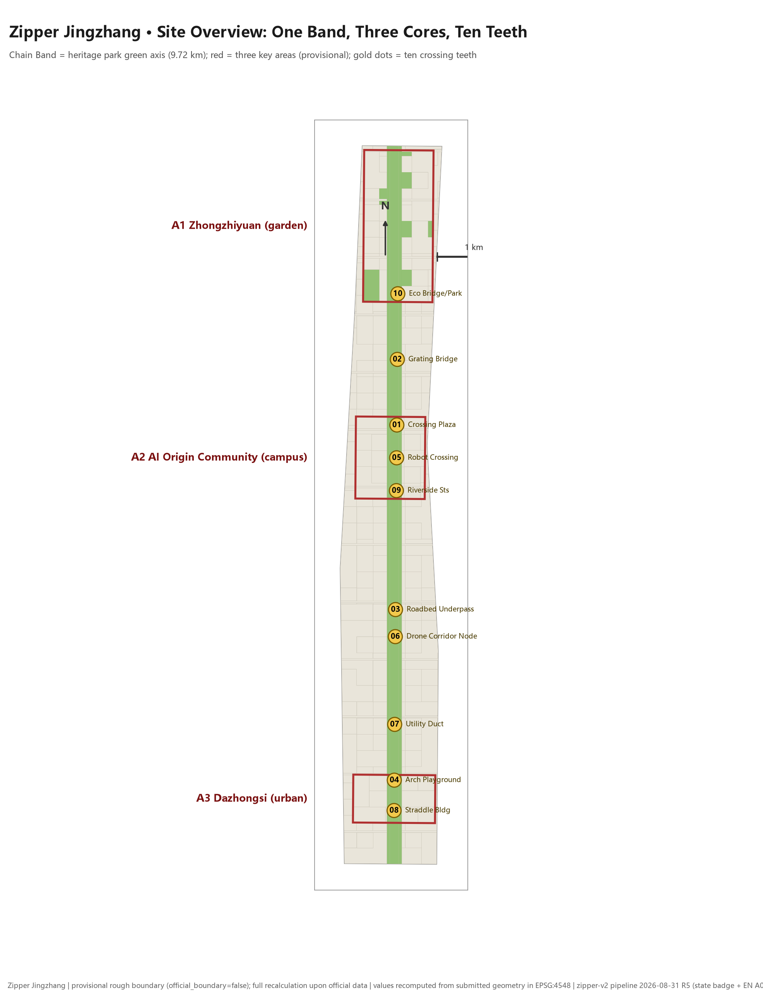

| Everyday (zipped) | Memorial (unzipped) |
| --- |
|  | 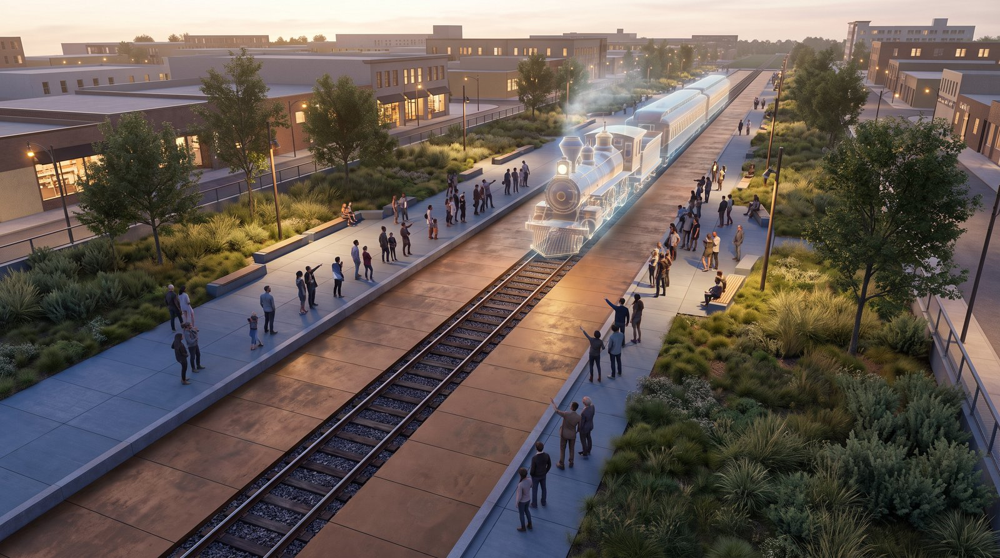 |

Before the official `SITE_BOUNDARY` and the three official `KEY_AREA` polygons are released, this package is generated from `provisional_boundaries.geojson`: `geometry/site_boundary.geojson` (SITE-001) and `geometry/key_areas.geojson` (KEY-A1/A2/A3) are both labeled `official_boundary=false`, `geometry_role=provisional_constraint` and `boundary_precision=provisional_rough`; they may be used only for proposal generation, self-checking, visualization and design discussion, and not as the official planning boundary, an approval basis, a precise-area basis or a statutory control conclusion; this data gap does not block content scoring, and once official data is released all geometry, metrics, drawings and HTML values must be recalculated [data:geometry/site_boundary.geojson#SITE-001] [source:SITE-PACKAGE].

Compliance evidence chain for generated imagery: the thirteen Ten Teeth scenario illustrations were generated with the Lovart AI free model (nano-banana-pro), prompts archived image by image under `assets/media/prompts/`; the XMP/IPTC machine-readable AI-generation markers (trainedAlgorithmicMedia) carried by the generated images are passed through and preserved during compression and transcoding, and sources and licensing are proactively declared in `sources.json` and `report/copyright_statement.md`; the illustrations serve only as design-intent expression and are kept clearly separate from the geometric evidence layers [source:AI-GENERATED-VISUALS].

## Three-Level Scope Working Framework

The proposal is organized by the three-level scope defined in the Announcement: the Coordinated Research Area of 43.6 km² addresses the AI industry ecosystem and future urban form; the Overall Design Area of 11.4 km² requires an urban renewal overall framework at Regulatory Detailed Planning depth; the Key-Area Detailed Design Area of 368.4 hectares (A1 Zhongzhiyuan AI Independent Innovation Acceleration Area 192.1 / A2 Beijing AI Origin Community 104.3 / A3 Dazhongsi AI Industry Cluster 72.0) carries out detailed design. The three levels of tasks are mapped item by item in `compliance_matrix.json` against Announcement items 1.3, 1.4, 1.5 and agent.1–agent.6 [depth:three_level_scope_framework] [standard:PROJECT-OFFICIAL-ANNOUNCEMENT].

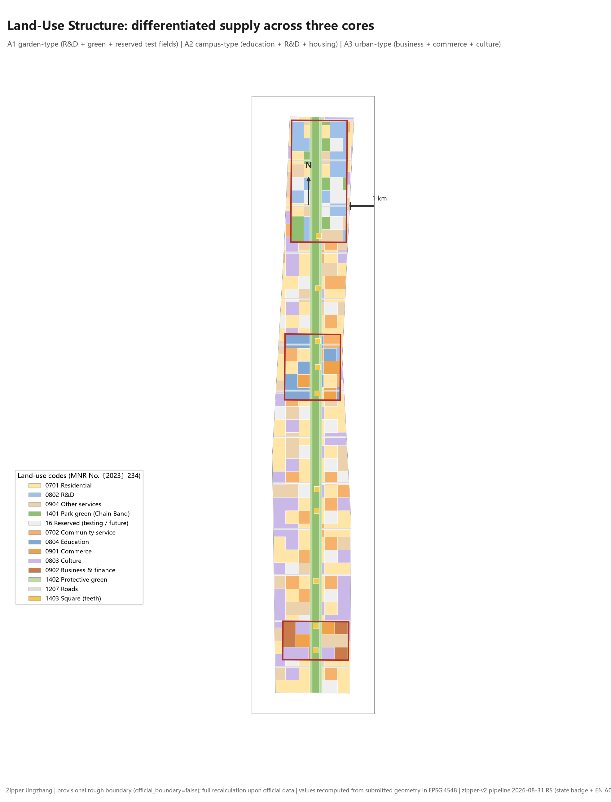

### Problem: Three Existing Openings

Organizing the Announcement text and the two-track materials yields three "openings". **Opening 1 · Corridor severance**: the Jing-Zhang Railway and its viaduct have long split the city east–west; rail crossings mean long detours, the walking and cycling network has many breakpoints, and the communities and campuses on the two sides can hardly share functions. **Opening 2 · Supply mismatch**: the three corridor segments have distinct existing fabrics — the Qinghe ecological belt, the Xueyuan Road university belt and the Dazhongsi headquarters belt — and a homogenized "innovation space" positioning cannot answer their real, differing shortcomings. **Opening 3 · Heritage isolation**: closed fencing around the track bed has degraded "protected" into "isolated"; history cannot be approached, and heritage-protection constraints deepen the severance [source:OFFICIAL-ANNOUNCEMENT] [depth:existing_conditions_diagnosis].

### Approach: Do Not Demolish, Do Not Conceal — Fit the Opening with a Zipper

**Zipper Jingzhang** does not conceal this opening; it fits the opening with a zipper that can open and close again and again. The mechanism has three components:

1. **Chain Band** — the green axis of the Jing-Zhang Railway Heritage Park (a 9.72 km north–south band of park green space in the submitted geometry), the linear skeleton that stitches six categories of connection: walking, cycling, vehicular, unmanned systems, municipal and ecological [data:geometry/land_use.geojson#LU-AXIS] [data:geometry/roads.geojson#ROAD-001];
2. **Chain Teeth** — ten rail-crossing interlocking nodes (Z-01–Z-10), typed by trackside elevation condition: "the terrain determines the tooth type, and the tooth type determines the form of ceremony"; every tooth has two states, everyday (zipped) and memorial (unzipped) [data:geometry/public_space.geojson#Z-01];
3. **Zipper Head** — the intelligent operations system that centrally schedules opening and closing along the whole line: zipped in everyday mode to serve the city's daily routine, unzipped in memorial mode to reveal the track bed and collective memory; AI is endogenous to the open–close mechanism itself, not a label attached to the proposal.

The three openings map to three sets of interlocking strategies: corridor severance → stitching by the green axis; supply mismatch → differentiated drive of one chain and three cores; heritage isolation → an openable display mechanism. The overall concept and functional coordination (agent.1) and the cultural narrative (agent.5) are both governed by this mechanism [source:AGENT-TASKBOOK].

| Level | Design Question | Zipper Jingzhang's Answer | Data Anchor |
| --- | --- | --- | --- |
| Coordinated Research Area | How to organize the AI industry ecosystem and future urban form | The "university sourcing — open-source collaboration — enterprise commercialization — public experience — international communication" innovation chain is laid out along the Chain Band | compliance_matrix.json |
| Overall Design Area | How to map the renewal framework, traffic–municipal systems and urban character | Chain Band + Ten Teeth + three-core land-use subdivision and suggested massing envelopes; all metrics recalculable | [data:geometry/land_use.geojson#LU-001] |
| Key-Area Detailed Design Area | How the three areas reach detailed-design depth | One map per area: differentiated garden-type / campus-adjacent-type / urban-type positioning with scenario placement | [data:geometry/key_areas.geojson#zhongzhiyuan_ai_acceleration_area] |

## Three Zones & Two Wings Synergy Loop: Positions × Functions

Under the zipper mechanism, the Taskbook's "three zones and two wings" form a walkable synergy loop: the three zones are three hubs on the loop, the two wings are empowerment directions running along the whole band and unfolding toward both sides of the city; the five functions are not five districts but five interlocking element flows on one and the same chain band. The loop and its flows are shown in [assets/figures/wings-synergy.en.png] (the dual-state grammar applies here too: in the everyday state the element flows run normally; during memorial states the event flows unzip and amplify) [source:AGENT-TASKBOOK]:

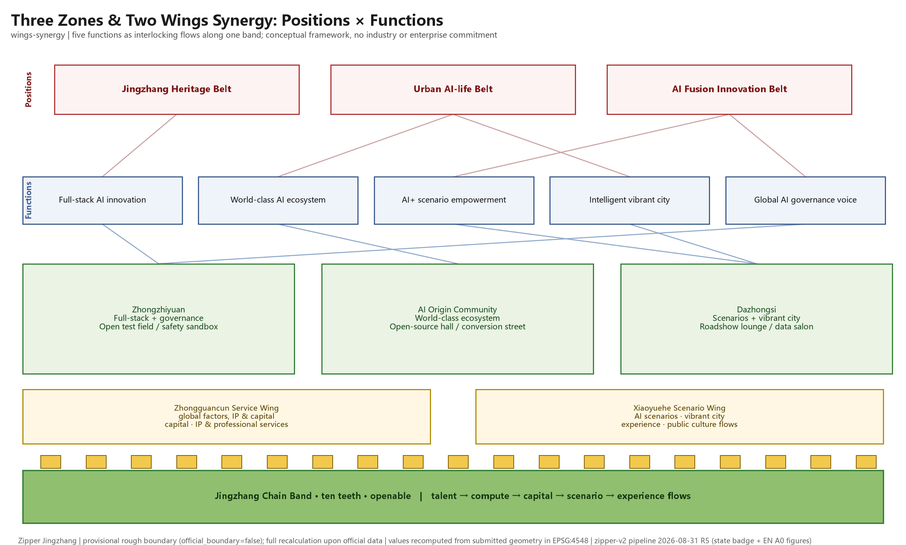

| Zone / Wing | Functions carried (five functions) | Position answered | Main element flows | Spatial carriers and evidence |
| --- | --- | --- | --- | --- |
| A1 Zhongzhiyuan AI self-innovation acceleration area | Full-stack AI innovation system; global voice in AI governance | AI fusion innovation belt | compute flow; standards and open-source collaboration flow | Open testing ground, safety governance sandbox (02★/10★), Z-02/Z-10 |
| A2 Beijing AI Origin Community | World-class AI innovation ecosystem | AI fusion innovation belt | talent flow; outcome-commercialization flow | Open-source release hall, campus-adjacent street (01/07), Z-01/Z-05 |
| A3 Dazhongsi AI industry cluster area | AI+ scenario empowerment paradigm; intelligent vibrant city | Urban AI-life belt | scenario flow; capital and international exchange flow | Roadshow lounge, data-element salon (05/08★), Z-04/Z-08 |
| Zhongguancun technology-service wing (crossing wing) | World-class AI innovation ecosystem (global allocation of factors; Zhongguancun IP and capital empowerment) | AI fusion innovation belt | capital flow; IP and professional-service flow | Conversion-street service chain, roadshow financial interface, service nodes along the band (conceptual layout) |
| Xiaoyuehe scenario-empowerment wing (crossing wing) | AI+ scenario empowerment paradigm; intelligent vibrant city | Jingzhang heritage belt / urban AI-life belt | scenario-experience flow; public cultural life flow | Xiaoyuehe—Qinghe waterfront interface (scenario 06), AI walking navigation (04), life-service street (09) |

Three engagement rules of the loop: ① the **talent–scenario flow** progresses one way "universities (around A2) → testing ground (A1) → roadshow (A3)", with chain teeth guaranteeing a walkable hop at every step; ② the **capital–IP flow** runs through all three zones via the Zhongguancun wing, with service interfaces kept at the public-space and street level and no assumption of any specific enterprise moving in; ③ the **public-experience flow** runs parallel to the heritage line via the Xiaoyuehe wing, making citizen experience the public touchpoint of all three positions. All flows are a conceptual organizational framework and constitute no industry commitment or enterprise list [source:AGENT-TASKBOOK].

## Regional Innovation Synergy Interfaces

Regional synergy is stated in four columns — exchangeable resources / corridor interface / trigger conditions / non-commitment boundary: only interface logic and trigger conditions are described; no cooperation agreements, enterprise lists or government arrangements are fabricated [source:AGENT-TASKBOOK].

| Counterpart | Exchangeable innovation resources | Corridor interface | Trigger for cooperation | Non-commitment boundary |
| --- | --- | --- | --- | --- |
| Beiwai community (adjacent) | daily-service demand, community-governance scenarios, residents' shared memory | band walking loop and embedded community services (scenario 09), east–west micro-circuit streets | scenario pilots open item by item once community co-governance is established | no change to community tenure or residential function; no relocation assumption |
| Future Science City | energy-tech and corporate R&D resources, field-trial demand in the east | northern end of the band (A1—Qinghe direction) connecting northward along the Jingzhang corridor | shared testing agreements once both sides mutually recognize open-scenario results | no assumption of new rail crossings; connections use existing corridors |
| Huairou Science City | large-scale scientific facilities and basic-research compute | conceptual compute channel from the band to the northern science corridor (scenario 03 edge-compute stations as end nodes) | once a compute service catalogue and settlement mechanism exist | no commitment on compute volume or timing |
| Beijing E-Town (economic development zone) | industrialization scenarios for autonomous driving and robotics | southern industry corridor: mutual recognition of testing standards; display interfaces of scenarios 05/08★ | joint testing once a standards-recognition framework is signed | no involvement of enterprise relocation or tax arrangements |
| Beijing–Tianjin–Hebei region | manufacturing supply, cultural visitors, application markets | the Jingzhang railway heritage line itself (toward Qinglongqiao—Zhangjiakou) as a cultural tourism corridor; regional sub-venues of the Global AI Activity Week (JZ-06) | once the activity-week regional cooperation mechanism is established | no presumption of cross-regional investment or fiscal arrangements |

Common premise of all interfaces: this band plays the "innovation organization and public display" role, and cross-regional functions rely on existing transport and cultural corridors; any cross-entity cooperation is stated as "starts after trigger", and before the trigger only an interface reservation exists [depth:overall_spatial_structure].

## Coordinated Research Area: Industry and Future City Research

The core task of the Coordinated Research Area is to build a world-class AI innovation ecosystem. The proposal organizes five links along the Chain Band — Haidian university and institute sourcing, open-source community collaboration, leading-enterprise commercialization, public-space experience and international communication: A1 hosts full-stack independent innovation and standards governance, A2 hosts campus-adjacent research commercialization and open-source releases, A3 hosts AI-native business formats and international roadshows, and the Chain Teeth carry everyday cross-access among the three cores, so that every hop of the innovation chain has a walkable spatial path [source:AGENT-TASKBOOK] [depth:overall_spatial_structure].

Naming system and visual identity direction (agent.1): Chinese name "拉链京张" (Zipper Jingzhang), English name Zipper Jingzhang; the logo direction is the **two-state open–close zipper mark** — in the everyday state the chain teeth interlock into a straight line, and in the memorial state it unzips to reveal the negative shape of the "track bed", so one symbol expresses both connection and openable display; wayfinding, event key visuals and public art share this two-state grammar. The naming answers the triple positioning of the "Centennial Jing-Zhang Culture Belt, Urban AI Life Experience Belt and AI-Integrated Innovation Belt" [source:AGENT-TASKBOOK].

The future urban form study answers how AI changes work, life, mobility and public services: unmanned delivery (Z-05), drone logistics (Z-06) and smart utility-tunnel inspection (Z-07) are embedded into the mechanism as cases of "technically real openability"; edge-computing stations, distributed energy and other new infrastructure are stated as conceptual recommendations, with operational and performance metrics awaiting calibration against real data and excluded from final review conclusions [depth:overall_spatial_structure].

## Overall Design Area: Urban Renewal and Urban Design at Regulatory Detailed Planning Depth

The Overall Design Area requires Regulatory Detailed Planning depth. `geometry/land_use.geojson` takes the Chain Band (1401 park green space), the protective band (1402 protective green space), the cross streets (1207) and the chain-tooth plazas (1403) as its skeleton and subdivides the submitted boundary completely into 44 parcels: full coverage with no gaps (pipeline self-check gap < 1 m²), no overlaps (overlap pairs > 1 m² number 0), and adjacent parcels sharing boundary coordinates [data:geometry/land_use.geojson#LU-001] [metric:land_use_parcel_count] [depth:land_use_layout].

The land-use structure answers the "supply mismatch": the three cores follow differentiated ratios — A1 garden-type (R&D 38% + park green space 22% + reserved open testing ground 22%), A2 campus-adjacent-type (education 28% + R&D 26% + residential 22% + commercial 16%), A3 urban-type (business and finance 44% + commercial 28% + culture 14%) — with the inter-core connector bands mainly residential and reserved land, all using codes registered in `enums/land_use_codes.json` [data:geometry/land_use.geojson#LU-001] [source:SITE-PACKAGE].

`geometry/buildings.geojson` provides 2,483 **suggested building massing envelopes** (height suggestions by land-use code: business at the 60 m class, R&D at the 45 m class, commercial and cultural at the 20–24 m class), all labeled `design_action=新增（建议体量包络）` — with existing buildings, property rights and RDP conditions missing, the proposal fabricates no demolish–renovate–retain conclusions and offers only a massing method and a to-be-calibrated list [data:geometry/buildings.geojson#BLDG-001] [depth:retain_renovate_demolish]. Building footprints total about 2.588 million m²; FAR, building height, building coverage ratio and setback lines remain `status=unknown`, to be filled in once official RDP conditions are released [metric:building_footprint_area_sqm] [metric:floor_area_ratio] [depth:development_intensity_controls].

Traffic organization: the Chain Band walking-and-cycling main axis (9.72 km) plus 13 east–west micro-circulation streets (24.9 km); the cross streets stop at the edge of the Chain Band — **rail-crossing connections are carried not by at-grade intersections but by the Ten Teeth** — which is the essential difference between the "zipper" and an ordinary green-belt scheme [data:geometry/roads.geojson#ROAD-001] [metric:road_total_length_m] [depth:traffic_rail_slow_parking].

The **Zipper Head · intelligent operations system** is the AI-native operations layer: it schedules the Chain Teeth open–close timetable, the order of unmanned-delivery and drone corridors, crowd flows and safety boundaries during events, and access to and replay of the open testing ground. Governance follows the four principles of data minimization, open sources, explainability and human review; the system does not replace planning approval and does not output unauthorized personal profiles [source:AGENT-TASKBOOK].

## Key-Area Detailed Design

The three key areas follow "one map per area", with detailed design reaching Integrated Planning Implementation Plan depth; each core is annotated with positioning, spatial actions, Chain Teeth and scenario placement [depth:three_key_area_detailed_design].

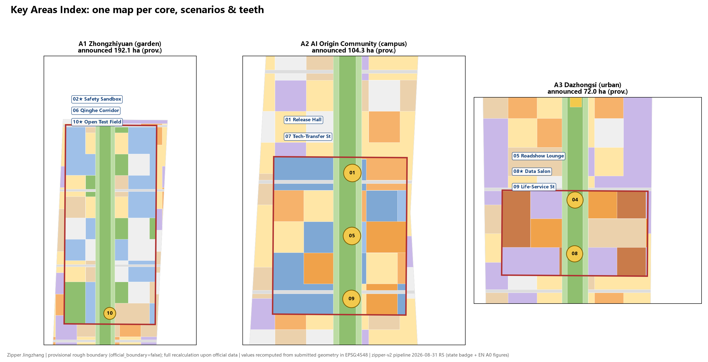

| A1 garden-type, Qinghe interface | A2 campus tech-transfer street |
| --- |
| 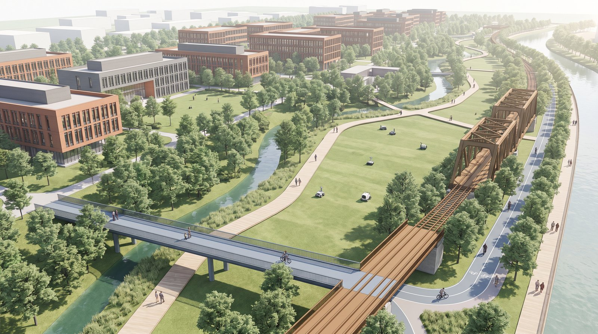 | 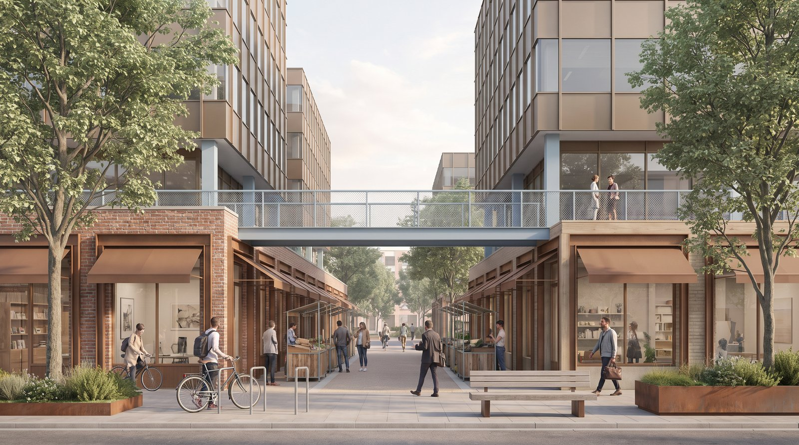 |
| A3 straddle building & station quadrants | A1 open test field, S10★ |
| --- |
|  |  |

| Key Area | Positioning | Spatial Action | Teeth / Scenario Placement | Evidence |
| --- | --- | --- | --- | --- |
| A1 Zhongzhiyuan (garden-type) | Full-stack independent innovation and open testing | Strengthen the Qinghe riverfront green space; use reserved land to host a visitable open testing ground and a standards-governance showcase | Z-02 chain-tooth footbridge, Z-10 ecological green bridge; scenarios 02★/06/10★ | [data:geometry/key_areas.geojson#zhongzhiyuan_ai_acceleration_area] |
| A2 Beijing AI Origin Community (campus-adjacent-type) | Campus-adjacent commercialization and talent community | Walking-and-cycling stitching of campus–park–block; achievement releases, commercialization services and daily-life amenities placed on both sides of the crossing | Z-01 crossing ceremony plaza, Z-05 robot passage, Z-09 two-bank commercial street; scenarios 01/07 | [data:geometry/key_areas.geojson#beijing_ai_origin_community] |
| A3 Dazhongsi (urban-type) | AI-native new business formats and international engagement | Transit-station integration and four-quadrant pedestrian connectivity; commercial vitality takes the heritage as its focal vista | Z-04 arch bridge children's playground, Z-08 rail-crossing building; scenarios 05/08★/09 | [data:geometry/key_areas.geojson#dazhongsi_ai_industry_cluster] |

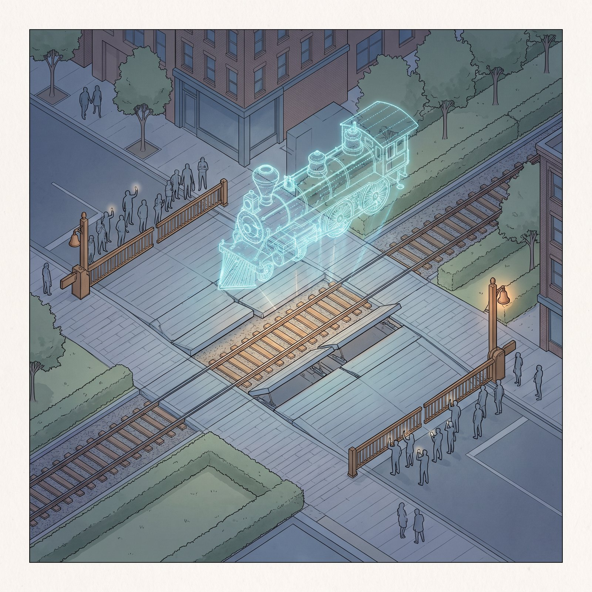

## AI Innovation Ecosystem, Talent Personas and AI-Enabled Scenarios

The spatial personas for AI talent and enterprises cover R&D offices, open-source collaboration, achievement releases, enterprise services, talent housing, social learning, consumer life and international engagement. Five user personas map card by card to spatial responses and self-check boundaries [source:AGENT-TASKBOOK]:

| User Persona | Typical Needs | Spatial Response | Self-Check Boundary |
| --- | --- | --- | --- |
| Open-source developers | Releasing, collaboration, testing, community reputation | Z-01 open-source release hall, public code wall, nighttime collaboration spaces | No personal behavior trajectories collected; event data used only in aggregate statistics |
| Startup teams | Low-cost offices, computing-power access, product testing grounds | A1 shared testing ground, edge-computing stations, standards-governance consulting | Computing and data services require separate authorization |
| Leading-enterprise visitors | Exhibition, business, international reception | A3 international roadshow lounge, rail-station shuttle connections, public space around key enterprises | Enterprise logos and cases must be rights-cleared |
| Nearby residents | Commuting, leisure, community services, low-disturbance renewal | Chain Band walking-and-cycling loop, embedded community services, tiered nighttime lighting | Resident profiles not used for commercial recommendations |
| University faculty and students | Commercialization, cross-campus collaboration, everyday walking and cycling | Campus-adjacent commercialization street, commercialization stations, AI education experience points | Campus data and research outcomes require authorization |

### Global AI Innovation Ecosystem Case Comparison and Ecosystem Map (agent.2)

Six publicly well-documented global cases are selected for mechanism comparison: only public sources, dates and transferable mechanisms are registered. All cases relate to this proposal as "mechanism references" only — none constitutes a policy precedent, and none implies that this project has received any policy, funding or tenancy arrangement [source:AGENT-TASKBOOK]:

| Case (place / time / source type) | Transferable mechanism | Differences from our A1/A2/A3 | Use and licensing note |
| --- | --- | --- | --- |
| London King's Cross railway-heritage regeneration (UK, masterplan approved 2006, phased construction from 2007; public reporting and official planning documents) | build public space on rail heritage first, introduce functions later; heritage as the public vista of an innovation district | Jingzhang is a linear stitching of an operating/closed railway corridor, while King's Cross is a node-area station-district renewal; our ten-teeth open–close mechanism is specific to live railways | mechanism description; its business mix is not copied |
| Toronto Quayside / Sidewalk Labs (Canada, 2017–2020; public reporting) | a failure lesson: urban data governance must precede technology deployment, and public trust is a precondition | our A1 safety governance sandbox (02★) absorbs this lesson directly: standards, evaluation and red-team testing come first, visitable and supervisable | mechanism lesson; no commercial citation |
| Barcelona Superblocks (Spain, from 2016; municipal public materials) | a gradual method of reallocating street space to walking and public life | our band uses the railway chain band (not the motorway grid) as the stitching skeleton, with teeth carrying rail crossings | method reference |
| Singapore one-north (phased from the 2000s; official park materials) | phased mixed "work–learn–live–play" development of an innovation district and its reserved-land mechanism | our three cores sit in an urban-renewal context; reserved land appears as the open testing ground (10★) | method reference |
| Helsinki Kalasatama (Finland, from the 2010s; municipal public materials) | smart pilots are accepted by "real resident benefit" and small steps | every scenario card in our set carries failure modes and deactivation conditions, with public benefit as the acceptance yardstick | method reference |
| Toyota Woven City (Susono, Japan, announced 2020, groundbreaking 2021, Phase 1 completed 2024; corporate official newsroom) | a corporate-built "living laboratory" closing the operations–R&D loop | our band is a public-space-led open district; the testing ground (A1) occupies reserved land only, under public supervision, not a corporate gated campus | mechanism comparison; implies no cooperation or tenancy |
| Shanghai Zhangjiang AI Island (China, in use from around 2018; public reporting) | an "island — whole-district scenarios — regional ecosystem" path of AI application clustering | our band organizes AI scenarios along a heritage linear corridor; the cultural narrative and openable display are unique dimensions | method reference |

Ecosystem map (text version): with the chain band as the axis, five actor groups form a loop — universities and institutes (sourcing) → open-source community and developers (collaborative conversion, A2) → standards and safety governance (A1, including the global-governance interface) → scenario enterprises and investment (A3, with the Zhongguancun wing supplying capital and IP services) → public experience and international communication (public space along the line + the event system). The supply mechanisms of the eight factor classes — land, space, industry, capital, talent, compute, data and scenarios — are stated as "conceptual role + trigger condition" in the corresponding element flows, all awaiting real actors to plug in [source:AGENT-TASKBOOK].

11 AI scenario cards (★ = industry testing and validation scenario; satisfying the Taskbook's ≥10 cards, ≥3 industry validations and ≥5 personas): each card specifies six elements — spatial carrier, served users, data sources, privacy boundary, human review mechanism and operating entity [source:AGENT-TASKBOOK]:

| Card | Scenario | Spatial Carrier | Related Teeth | Description |
| --- | --- | --- | --- | --- |
| 01 | Open-Source Release Hall | A2 | Z-01/Z-05 | Achievement releases, code-contribution showcases and small roadshows for universities, open-source communities and startup teams |
| 02★ | Safety Governance Sandbox | A1 | Z-02/Z-10 | Standard-setting, safety evaluation and model red-team testing translated into visitable, bookable and supervisable nodes |
| 03 | Edge-Computing Station | Nodes in the Overall Design Area | — | A new-infrastructure prototype combining public services, enterprise services and low-carbon energy (conceptual recommendation) |
| 04 | AI Walking and Cycling Navigation | Entire Chain Band | Entire line | Explainable wayfinding and low-intrusion sensing to identify walking and cycling breakpoints, crowded nodes and accessibility needs |
| 05 | Dazhongsi International Roadshow Lounge | A3 | Z-04/Z-08 | Exhibition, negotiation, media release and international exchange for agent, smart-terminal and content-consumption enterprises |
| 06 | Qinghe Low-Carbon Innovation Corridor | A1 Qinghe riverfront interface | Z-10 | A park public lounge combining green space, stormwater, walking and cycling, and AI display |
| 07 | Campus-Adjacent Commercialization Street | A2 | Z-01/Z-05 | Incubation, exhibition, legal, intellectual-property and investment–financing services placed on both sides of the crossing |
| 08★ | Data-Element Reception Room | A3 | Z-04/Z-08 | A service interface for data-element and digital-asset circulation premised on compliance, authorization and auditability |
| 09 | AI Life-Service Model Street | Community–commercial interface | Z-09 | Healthcare, education, legal and daily-life services landed in operable, small-scale blocks |
| 10★ | Independent-Model Open Testing Ground | A1 green space | Z-02/Z-10 | Open grounds for model testing, standards validation and safety assessment (carried on reserved land) |
| 11 (additional) | Global AI Events Week Route | Belt public-space system | Entire line | A walkable experience route: heritage culture → open-source community → industry display → international roadshow |

Scenario governance boundaries: the Urban Agent may assist in identifying walking and cycling breakpoints, public-space heatmaps, facility maintenance and event safety risks, but it does not replace planning approval, does not output unauthorized personal profiles and does not claim official implementation commitments; every scenario node can be located and verified against the public-space and road layers [data:geometry/public_space.geojson#PUBLIC-001] [data:geometry/roads.geojson#ROAD-001].

### Per-Card Six-Element Matrix and Technical Boundaries

A card-by-card matrix of "users — spatial carrier — data sources and status — privacy boundary — human review / takeover — operating role" (operating roles are conceptual recommendations pending real operators) [source:AGENT-TASKBOOK]:

| Card | Users (personas) | Data sources and status | Privacy boundary | Human review / takeover | Operating role (concept) |
| --- | --- | --- | --- | --- | --- |
| 01 Open-source release hall | developers / faculty / startups | event registration and publicly submitted content; on-site aggregate crowd counts (to be collected) | no personal trajectories; talks and code under author authorization | human pre-review of releases; on-site hand-over to human hosting at any time | community operator + campus co-build (TBD) |
| 02★ Safety governance sandbox | standards bodies / enterprise security teams | models under test and evaluation reports (authorized submission) | evaluation data never leaves the sandbox; reports published only desensitized | red-team testing under full human supervision; one-click termination | standards / evaluation body (TBD) |
| 03 Edge-computing station | developers / startups / public | device telemetry (to be collected); no personal data | processed at the edge; raw data never leaves the station | human approval of compute access; cut-off on anomaly | public-facility operator (TBD) |
| 04 AI walking navigation | all users | anonymized aggregate walking flows (to be collected) | no individual profiles; location data aggregated on collection | human patrol to correct guidance; switchable to static signage | band operator (TBD) |
| 05 International roadshow lounge | enterprise visitors / media / international guests | public event materials; booking information (authorized) | no recording of business talks; enterprise logos rights-cleared | bilingual hosting with human interpretation fallback | exhibition / park service provider (TBD) |
| 06 Qinghe low-carbon corridor | residents / faculty / enterprises | environmental sensing — water quality, micro-climate (to be collected) | environmental data public, contains no individuals | human monthly verification of dashboards | river authority + park co-governance (TBD) |
| 07 Campus-adjacent commercialization street | faculty / startups / service bodies | public service directories; matching records (authorized) | university research data never leaves campus | human-led matching services | commercialization service body (TBD) |
| 08★ Data-element salon | enterprises / institutions | authorized data-product catalogue and audit logs | auditable throughout; raw data never handled | human compliance review of trades; freeze on violation | data-exchange-type institution (TBD) |
| 09 AI life-service street | residents / visitors | service bookings and public merchant information | service records stay with the local merchant, off public platforms | human response to complaints; manual counter always available | street commercial operator (TBD) |
| 10★ Open model testing ground | enterprises / research institutes | test plans and replay data (authorized) | physically enclosed test area; failure cases never flow out | human test supervisors on duty; emergency stop | testing-ground operator + supervisor (TBD) |
| 11 Global AI Activity Week route | general public | aggregate event statistics (to be collected) | public filming with notice | human event-safety command system | event organizing committee (TBD) |

Technology maturity, failure modes and deactivation conditions (stated card by card per the Taskbook's rule against presenting immature technology as deployable at scale):

| Card | Maturity (conceptual rating) | Main failure mode | Deactivation / downgrade condition |
| --- | --- | --- | --- |
| 01/05/07/11 | mature (event and service operations led; AI assists only) | content compliance risk | violating content taken down immediately with human review |
| 04 | high (aggregate statistics mature; explainability of guidance to be verified) | distorted aggregates mislead | switch to static signage; advisory only |
| 03/06 | medium (facility and sensing prototypes) | unstable supply / data drift | downgrade to ordinary public service and monitoring points |
| 02★/10★ | medium-high (evaluation and testing methodologies established; siting to be verified) | test accidents, data leakage | immediate stop of testing, scene preserved, third-party investigation |
| 08★ | medium (compliance frameworks still evolving) | tenure or compliance disputes | trading interface frozen; back to human matching |

**Zipper Head governance mechanism** (matching JZ-05): ① **inputs** — only three classes: open-source data, authorized submissions and facility telemetry, each registered item by item in `sources.json`; ② **decision authority** — scheduling recommendations cover only four classes of operational affairs: the Chain Teeth open–close timetable, event safety boundaries, testing-ground access and guidance content; never planning approval, law enforcement or tenure decisions; ③ **audit logs** — every automated decision leaves a trace (input digest / rule version / output / time), logs are read-only, retained and publishable in summary; ④ **human override** — a human chief-controller post exists at the operations front line, any automated recommendation can be overridden instantly by a human, and override events enter the same audit log [source:AGENT-TASKBOOK].

## Land Use, Building Scale and the Demolish–Renovate–Retain Plan

The land-use plan is expressed under the classification of 自然资发〔2023〕234号 (MNR Document No. 234 [2023]) (code 05 wetland unused), forming complete, closed, seamless zoning; the building plan distinguishes suggested tiers by height and function. **Demolish–renovate–retain conclusions are explicitly listed as to-be-calibrated items**: lacking surveys of existing buildings, property rights and RDP conditions, the proposal provides only a "suggested massing envelope + renewal method framework" and outputs no demolish–renovate–retain list; formal deepening must be premised on official existing-building and property-rights data [standard:MNR-LAND-USE-CLASSIFICATION-GUIDE] [depth:retain_renovate_demolish] [depth:height_massing_character].

Three-category metric discipline: (1) spatial metrics are recalculated directly from the submitted geometry (13 known items in this package); (2) control metrics (FAR / height / density / setback) remain unknown while official conditions are missing; (3) performance metrics (innovation index, talent density, event participation) are operational data — continuously calibrated and never written into final review conclusions [metric:site_area_sqm] [metric:floor_area_ratio].

## Traffic, Railway, Municipal and Public Service Facilities

The traffic strategy centers on "giving rail crossings back to the Chain Teeth": the Chain Band main axis carries north–south walking and cycling, the 13 cross streets carry east–west vehicular micro-circulation, and the Ten Teeth carry all rail-crossing interlocking — walking/cycling (Z-01, Z-02), vehicular (Z-04, Z-08), unmanned systems (Z-05, Z-06) and municipal (Z-07) are absorbed tooth by tooth, avoiding conflict between at-grade intersections and the railway [data:geometry/public_space.geojson#Z-07] [depth:traffic_rail_slow_parking].

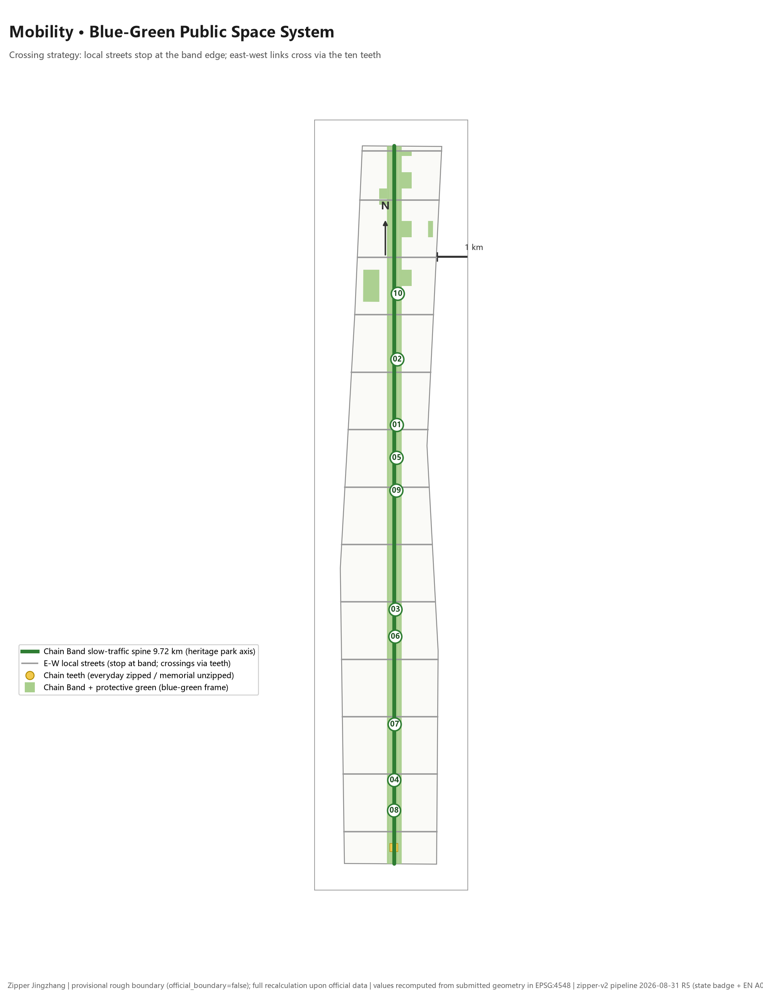

The municipal strategy takes the Z-07 utility tunnel as its prototype: a short vertical crossing of the track bed with mutually backed-up municipal lines on both sides and minimal disturbance; on open days a glass skylight reveals the track-bed cross-section. New infrastructure (edge computing, distributed energy, low-altitude corridors) is stated as conceptual recommendations, with service radii, facility standards and operating entities listed as preconditions for formal deepening; transit-station integration (Dazhongsi Station, Wudaokou node) must follow official railway and road planning-boundary data and is currently conceptual only [depth:municipal_new_infrastructure] [data:geometry/constraints.geojson#CONSTRAINTS-RAIL].

## Blue-Green Space, Public Space and Urban Character

The blue-green system takes the Chain Band as its skeleton: green space ratio 18% (Chain Band park green space + protective green belts on both sides + A1 garden-type parks) and public space ratio 0.8% (exact recomputation 0.008157, about 93,094 m²; Zipper Head operations plaza + Ten Teeth plazas), both recalculable independently from the submitted geometry under EPSG:4548 [metric:green_ratio] [metric:public_space_ratio]. The public-space organization of the Chain Band and the Ten Teeth is jointly checked against the green-space layer and the design-depth item [depth:blue_green_public_space] [data:geometry/green_space.geojson#GREEN-001].

Urban character follows the "two-state grammar": **everyday (zipped)** — the Chain Band is an everyday park, deck plates flush, robots passing through, performances on the bridges; **memorial (unzipped)** — deck plates flip to reveal the track bed, niches light up to expose the roadbed cross-section, and the hundred-drone light array forms a steam light-and-shadow train. The heritage segment follows the four principles of "setback, narrowing, detour and borrowed scenery"; character controls distinguish official controls, design suggestions and to-be-confirmed conditions, and no pseudo-precise control lines are given without a heritage-protection basis [depth:height_massing_character] [source:AGENT-TASKBOOK].

AI pilgrimage landmarks (≥3, agent.4): the **Holographic Train Crossing** (Z-01 memorial state, a holographic train carrying the city's pause for memory), the **Hundred-Drone Light Array · Steam Train** (Z-06 nighttime drone light array) and the **Glass Skylight onto the Rails** (Z-07 open day); supported by a contribution wall and honor display system recording open-source community and agent contributions. Cultural narrative (agent.5): the Centennial Jing-Zhang "memory of speed" × the Zhongguancun "memory of innovation" × the AI "open–close mechanism" are unified in the zipper grammar — memorial is not sealing away; it is a public ritual that can be unzipped again and again [source:AGENT-TASKBOOK].

### Public-Space Component Library and Honor Display System (agent.4)

The component library decomposes "AI public space" into standard components that are reusable, maintainable and accessible; all components are conceptual design recommendations and constitute no bridge, tunnel, underground-space or equipment-feasibility conclusion [source:AGENT-TASKBOOK]:

| Component type | Applicable space | Everyday (zipped) / memorial (unzipped) | Accessibility requirement | Maintenance responsibility (concept) | Maps to |
| --- | --- | --- | --- | --- | --- |
| Chain-tooth plaza cover units | the ten rail-crossing nodes | flush passage / flipped to reveal the rails | slip-resistant paving, ramped level differences, continuous tactile paving | band operator | all Z nodes |
| Open-source release stage | A2 crossing plaza | daily lectern / memorial-state broadcast tower | wheelchair ramp, sign-language position | community operator | Z-01 / S01 |
| Public code wall | A2 street interface | code display and scan-to-interact | dual-height screens, screen-reader voice | community operator | Z-01 / S01 |
| Holographic crossing installation | Z-01 track bed | invisible / holographic train in memorial state | wheelchair viewing positions, low-light-pollution limits | event committee | Z-01 landmark |
| Grille viewing steps | beside Z-02 footbridge | everyday seating / memorial-state stands | segmented handrails, fall protection | band operator | Z-02 |
| Test-viewing gallery | A1 testing-ground boundary | safety separation line / open-day guided system | protective glazing, dual-height viewing windows | testing-ground operator | Z-02/Z-10 / S10★ |
| Data-visualization light strip | nodes along the band | soft display of environmental data | tiered lighting, switchable at night | band operator | S04/S06 |
| Robot-station interface | two-bank streets and stations | delivery-robot docking and recharge | 1.5 m pedestrian lane preserved at stations | street operator | Z-05/Z-09 / S09 |

Honor display system (answering agent.4): the **contribution wall** (Z-01 plaza, physical and digital) records open-source contributors, standards participants and public-art co-creators, named by public ID with the person's authorization; **honor tiers** are organized as annual contribution / special contribution / memorial roll, refreshed centrally at each annual "unzip ceremony"; **display principles**: no naming-rights exchanges, no unauthorized portraits or enterprise logos, and any entry may be removed at the person's request. All honor content records community co-creation; it is not any award or government designation [source:AGENT-TASKBOOK].

### Inclusivity and Public Governance Matrix

Per the Taskbook's public-interest requirement, accessibility paths, non-smart alternatives, human assistance, notice and choice, complaint and redress, data retention and safety escalation are stated per group (governance mechanisms are conceptual, pending operators and administrative departments) [source:AGENT-TASKBOOK]:

| Group | Continuous accessible path | Non-smart alternative and human aid | Notice and choice | Complaint, redress and data rights | Safety escalation |
| --- | --- | --- | --- | --- | --- |
| Nearby residents | ramped band, continuous tactile paving | regular rail crossings on side streets; manual service counters | construction and events announced in advance | dual channels: sub-district office and operator | linked to community emergency system |
| Older adults | tiered seating density and handrails along the line | staffed information points; one-button call posts | large-print signage; voice announcements | assisted complaint registration | 3-minute response from nearest post (design target) |
| Children | independent slow-traffic lines and accompanied crossings | staffed supervision post at the Z-04 playground | age-appropriate event notices | parent-proxy complaint channel | missing-person broadcast mechanism |
| Persons with disabilities | tactile paving, ramps and wheelchair positions continuous through the teeth | sign-language positions, screen-reader guidance, bookable human accompaniment | optional accessible guidance | dedicated accessibility complaint entry | accessible evacuation plan |
| Low-digital-literacy users | physical interfaces retained for all services | manual counters as the default fallback; smart terminals skippable | no forced QR codes; paper equivalence | offline and proxy handling | human-first dispatch |
| Visitors | multilingual signage and walkable routes | staffed visitor center (A3, station-front) | filming notice boards; right to refuse appearance | multilingual complaint intake | multilingual emergency broadcast |

Data governance general rules: for all scenarios — minimize collection, aggregate first, register retention periods per card, and honor personal deletion requests; public perception testing with participation of older adults and persons with disabilities is a precondition of detailed design, never phrased as a verified outcome [source:AGENT-TASKBOOK].

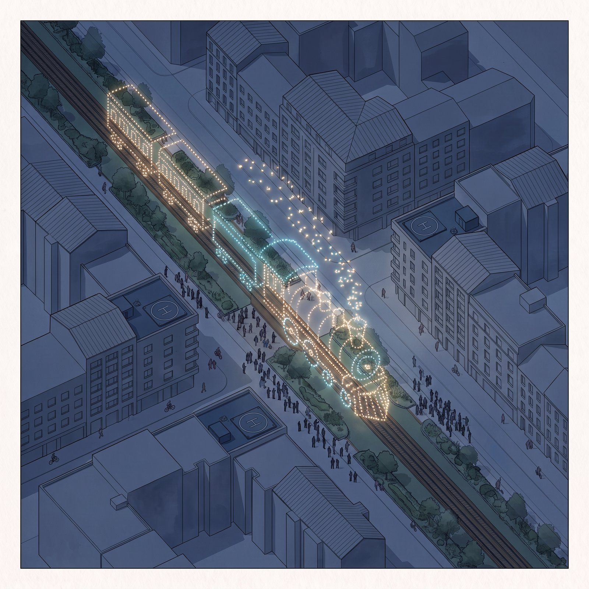

The Ten Teeth methods at a glance (applicable scenarios and the two-state mechanism; the per-tooth rationale is archived with the package at `report/design-basis-zipper-jingzhang.md`):

| Tooth | Method | Category | Everyday (zipped) | Memorial (unzipped) |
| --- | --- | --- | --- | --- |
| Z-01 | Crossing Ceremony Plaza | Transport | Deck plates flush with the rail tops for free crossing | Sunken viewing, deck plates flipped open, holographic train |
| Z-02 | Chain-Tooth Footbridge | Transport | Grated bridge crosses the cutting, sleepers readable underfoot | Performances on the deck, rolling-stock heritage exhibition in the cutting |
| Z-03 | Underpass Exhibition Gallery | Transport | Commuter underpass, niches dim | Niches light up, revealing the roadbed cross-section |
| Z-04 | Arch Bridge Children's Playground | Industry / public | Everyday use as a climbing playground | Road closed into an exhibition gallery + projected historic trains |
| Z-05 | Robot Delivery Passage | Transport (unmanned) | Delivery robots pass through the culvert | Robots line up along the rails as a "guard of honor" |
| Z-06 | Drone Corridor | Transport (airspace) | Daytime delivery formations stay unobtrusive | Hundred-drone light array forms a steam light-and-shadow train |
| Z-07 | Utility Tunnel Vertical Crossing | Municipal | Utility tunnel in operation (invisible stitching) | Open-day visits + glass skylight onto the rails |
| Z-08 | Rail-Crossing Building | Industry | Interior passage crosses the rails imperceptibly | Roof slides open, glass floor strips glow |
| Z-09 | Two-Bank Commercial Street | Industry / commercial | The railway treated as a river, both banks become streets | Commercial nightscape frames the heritage as its focal vista |
| Z-10 | Ecological Green Bridge / Ground-Level Park | Ecology | Rabbits and birds cross, green space continuous | Nature's return is the deepest memorial |

## Renewal Project List, Implementation Policies and Phasing Plan

Renewal project list (conceptual recommendations; deepening must be premised on property rights, funding, implementation entities and approval pathways) [depth:renewal_project_list]:

| Project ID | Project Name | Type | Main Dependencies | Evidence Reference |
| --- | --- | --- | --- | --- |
| JZ-01 | Chain Band walking-and-cycling main axis and breakpoint stitching (Z-01/Z-02 first) | Public space / transport | Railway authority coordination, walking and cycling flow verification | [data:geometry/roads.geojson#ROAD-001] |
| JZ-02 | A1 Qinghe low-carbon innovation interface (scenarios 06/10★) | Blue-green space / industry | River blue line, ecological and flood-control conditions | [data:geometry/green_space.geojson#GREEN-001] |
| JZ-03 | A2 campus-adjacent commercialization street (scenarios 01/07) | Urban renewal / industry services | Campus boundaries, property rights, ground-floor uses | [data:geometry/buildings.geojson#BLDG-001] |
| JZ-04 | A3 station-area four-quadrant pedestrian connectivity (Z-04/Z-08) | Transit integration / walking and cycling | Rail stations, road intersections, municipal pipelines | [data:geometry/public_space.geojson#Z-08] |
| JZ-05 | Zipper Head intelligent operations system and edge-computing nodes | New infrastructure / public services | Energy, computing power, safety and operating entities | [data:geometry/constraints.geojson#CONSTRAINTS-RAIL] |
| JZ-06 | Global AI Events Week public route (scenario 11) | Operations / branding | Public-space permits, event safety, copyright clearance | [data:geometry/phasing.geojson#PHASE-001] |

Phasing plan (three phases, conceptual recommendations) [depth:phasing_implementation] [data:geometry/phasing.geojson#PHASE-001] [metric:phase_count]: **Phase 1 · campus-adjacent launch segment** (A2 + Z-01/Z-05/Z-09) moves first with lightweight facilities, open-source events and the operations platform; **Phase 2 · station-area segment** (A3 + Z-04/Z-08 + southern connector band) advances together with station-area renewal; **Phase 3 · garden segment** (A1 + Z-02/Z-10 + northern connector band) takes up the open testing ground and ecological stitching. Deliverable submission within the open-call cycle and implementation phasing are two different things: anything involving engineering implementation must wait for confirmation of formal RDP, municipal, traffic and property-rights conditions.

### JZ-01–06 Stage-Gate Table

Every renewal project has a pass/pause gate: if the gate fails, the project shifts to the alternative path or is deferred — never pushed through; items requiring railway, heritage, municipal or tenure confirmation remain flagged for professional review [depth:renewal_project_list]:

| Project | Current evidence | Precondition | Roles (concept) | Verification output | Pass criteria | Alternative path when paused |
| --- | --- | --- | --- | --- | --- | --- |
| JZ-01 band main axis | road and land-use layers, recalculable | railway-department coordination; walking-flow verification | band operator, railway authority, traffic police | walking-flow baseline + safety plan | stitching design passes professional review | open the existing pedestrian crossings first |
| JZ-02 Qinghe interface | green-space layer and waterfront boundary | river blue-line and flood-control confirmation | river authority, landscape, park management | ecological safety assessment | positive flood-impact conclusion | observation line + science display inside the levee first |
| JZ-03 conversion street | massing envelopes and land-use codes | campus-boundary and tenure negotiation | university, commercialization body, street operator | tenure consent list + ground-floor program | written consent scope fixed by tenure holders | temporary installations and pop-up events first |
| JZ-04 station-area connectivity | public-space layer | rail-station data; intersection and utility conditions | railway, municipal, traffic police | station-area walking connectivity plan | no safety veto item in four-quadrant connectivity | optimize wayfinding of existing station passages |
| JZ-05 zipper-head system | governance mechanism and compute concept | energy and compute supply; operator in place | operator, power supplier, safety assessor | trial-run logs and audit report | four classes of operational affairs meet trial targets | manual-dispatch version first (no automated recommendations) |
| JZ-06 activity-week route | public-space system and scenario list | public-space permits, safety permits, rights clearance | organizing committee, public security, culture department | event safety and rights-clearance list | all venues fully permitted | online virtual route + single-venue small events |

### Long-Term Operations Framework (agent.6)

Long-term operations are given as a conceptual plan across six mechanisms — annual event system, developer community, scenario opening, public experience, international communication and conversion; all roles are conceptual positions, resource sources are assumptions, and KPIs are method frameworks rather than verified indicators [source:AGENT-TASKBOOK]:

| Mechanism | Annual rhythm (concept) | Brand and carrier | Roles (concept) | Resource assumption | KPI method (baseline pending) |
| --- | --- | --- | --- | --- | --- |
| Annual event system | annual "unzip ceremony" + seasonal themed events | Zipper Jingzhang event key visual (two-state grammar) | organizing committee, community, sponsor oversight | the public space's own capacity + assumed event funding | attendance, revisit rate (aggregate statistics) |
| Developer community | monthly open-source nights, quarterly hackathons | public code wall + online community | developers, universities, hosting platforms | assumed community-operation funding | contributor count, project survival rate |
| Scenario opening | annual apply–review–pilot–retrospect loop | scenario catalogue and application portal | operator, applying enterprises, supervisor | assumed scenario-carrier capacity | applications, pass rate, rectification rate |
| Public experience | regular guided tours + memorial-state open days | ten-teeth experience passport | band operator, volunteer guides | assumed volunteer system | experience completion rate, satisfaction |
| International communication | annual bilingual release + international roadshow season | A3 roadshow lounge, bilingual pages | exhibition agencies, international community | assumed channel partnerships | overseas reach, roadshow leads |
| Talent/enterprise conversion | regular commercialization matchmakers | conversion-street service chain | commercialization bodies, investment service providers | assumed pro-bono share of professional services | matchmaking count, subsequent landings (non-committal) |

Three boundaries of the operations framework: ① no exaggeration of government commitment or event effects — every activity is stated in the "envisioned – triggered – launched" three-level form; ② conversion of developers, talent and enterprises is a service path, not an investment-attraction commitment; ③ operational performance data follow the three-class metric discipline, continuously calibrated and never written into final review conclusions [source:AGENT-TASKBOOK] [metric:scenario_card_count].

## Metric System, Area Recalculation and Compliance Matrix

All known metrics are recalculated from the submitted geometry, with formulas, source files and confidence levels stored in `metrics.json`; the three core visual metrics (site_area_sqm / green_ratio / public_space_ratio) are known, bounded and recalculable, and consistent with the `data-value` attributes in `visual/index.html` [depth:metrics_recalculation]:

| Metric | Value | Recalculation Basis |
| --- | --- | --- |
| site_area_sqm | 11,412,825 m² | polygon_area(SITE-001), EPSG:4548; differs from the announced 11.40 million m² by about 0.1% (provisional coarsening error) |
| green_ratio | 18% | green space ∩ site / site |
| public_space_ratio | 0.8% (0.008157) | public space ∩ site / site |
| green_axis_length_m | 9,716.12 m | length(ROAD-001) |
| tooth_count | 10 | count(public_space.tooth_id) |
| building_footprint_area_sqm | 2,588,396 m² | Σ building envelope areas |
| land_use_parcel_count | 44 | count(land_use) (gap < 1 m², overlap pairs = 0) |
| road_total_length_m | 24,928.1 m | Σ road centerline lengths |
| key_area_count | 3 | count(KEY_AREA) |
| scenario_card_count | 11 (incl. 3★) | scenario-card count in the text |
| user_persona_count | 5 | persona count in the text |
| phase_count | 3 | count(PHASE) |
| floor_area_ratio | unknown | official RDP conditions missing |

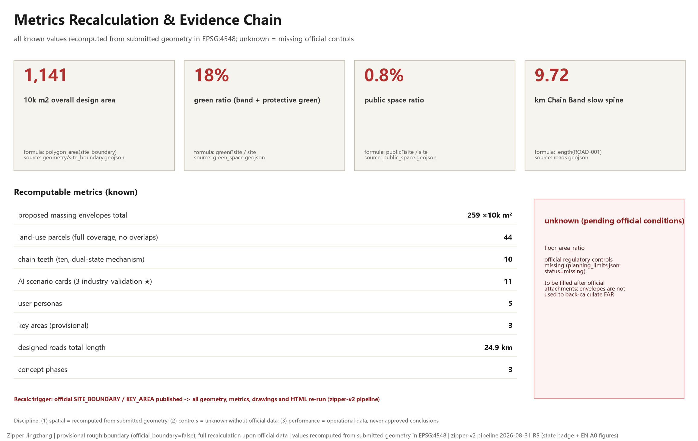

The compliance matrix maps all 23 mandatory requirements of Announcement items 1.3, 1.4 and 1.5 (including agent.1–agent.6) to sections, layers, metrics, drawings and HTML evidence; responses to professional standards are in `standard_matrix.json`, and the 15 design-depth items, all `complete`, are in `design_depth_matrix.json` [standard:PROJECT-OFFICIAL-ANNOUNCEMENT] [standard:PROJECT-AGENT-OPEN-CALL-TASKBOOK].

## Risks, Copyright and Compliance Notes

**Boundary risk**: the provisional rough boundary serves only concept generation and self-checking; the Chain Band alignment and the Ten Teeth placement are design assumptions and must be recalculated and the tooth positions reset once official rail alignments and heritage-protection control lines are released. **Control risk**: FAR, height, density, setbacks and road planning boundaries are all missing; this package keeps them unknown and lists them in `assumptions.json`. **Implementation risk**: with no property rights, funding, implementation entities or approval pathways, all projects and phases are conceptual recommendations only and constitute neither implementable commitments nor government actions [depth:risk_missing_data] [data:geometry/constraints.geojson#CONSTRAINTS-CTRL].

**Copyright and generation-method disclosure**: the Ten Teeth scenario illustrations are AI-generated (Lovart AI, free model nano-banana-pro), prompts archived image by image under `assets/media/prompts/`, with machine-readable AI-generation markers (trainedAlgorithmicMedia) passed through and preserved; the five required figures and all JSON/HTML in this package are deterministically generated from the submitted geometry by the zipper-v2 pipeline; the design-rationale text is archived with the package at `report/design-basis-zipper-jingzhang.md`. Sources and licensing status of all assets are in `sources.json` and `report/copyright_statement.md`; intellectual property of the deliverables is jointly shared per Announcement item 8.1, under the COMMUNITY-DISPLAY-ONLY license [source:AI-GENERATED-VISUALS] [source:DESIGN-CONCEPT-NOTE].

This proposal claims no official approval, no adjudicated RDP, no final land ownership, no final construction scale and no guaranteed implementation; all spatial visions are open co-creation recommendations offered for professional teams to deepen, with final judgment made by humans and professional teams.

## References

- brief/public-brief.md; brief/site-package/design_brief.json; brief/site-package/agent_taskbook.json; brief/site-package/allowed_design_space.json; brief/site-package/enums/; brief/site-package/ranges/planning_limits.json
- data/source_registry.json; data/processed/agent_fact_pack.md
- Complete machine index: `sources.json`, `metrics.json`, `compliance_matrix.json`, `standard_matrix.json`, `design_depth_matrix.json`
- Full design rationale: `report/design-basis-zipper-jingzhang.md`; Ten Teeth prompts: `assets/media/prompts/` [source:SITE-PACKAGE]
