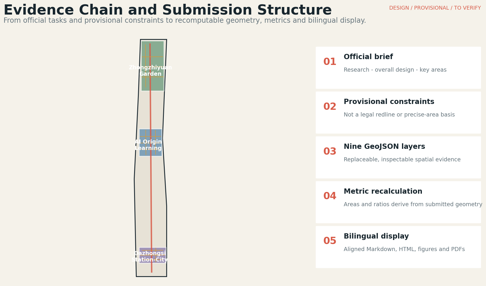
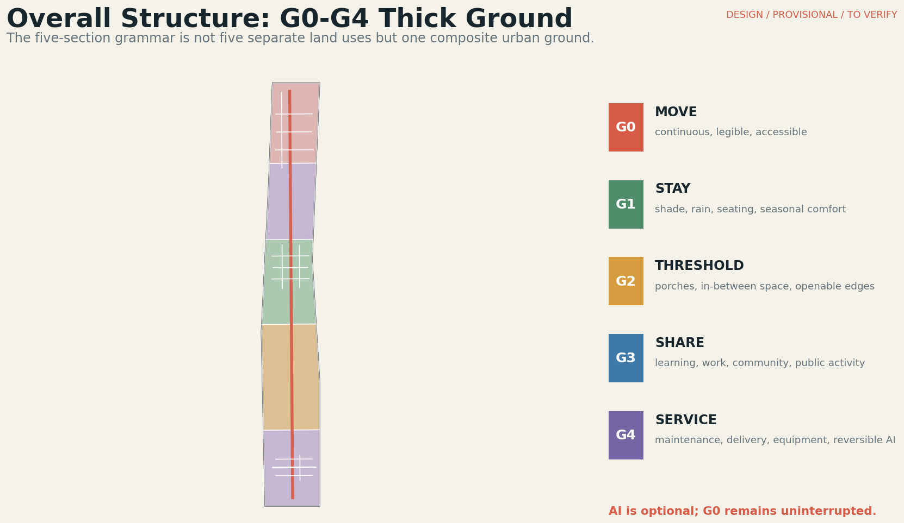
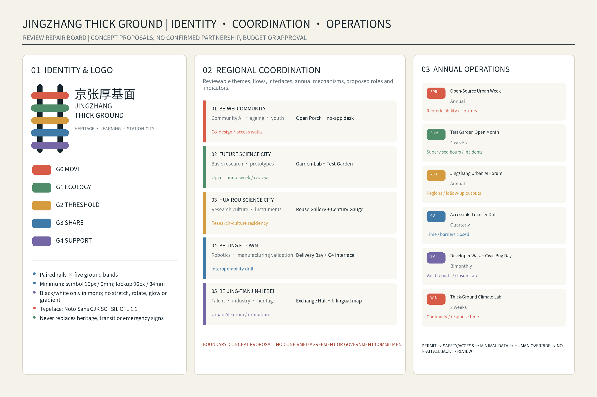
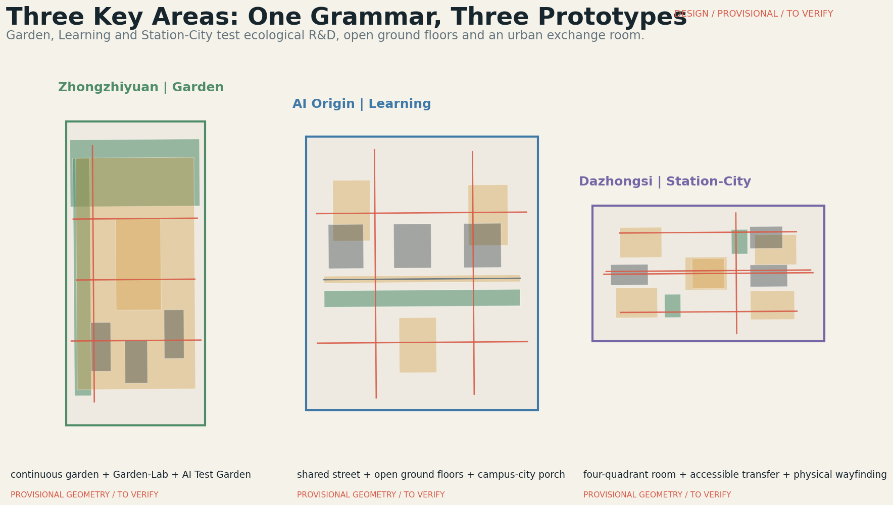
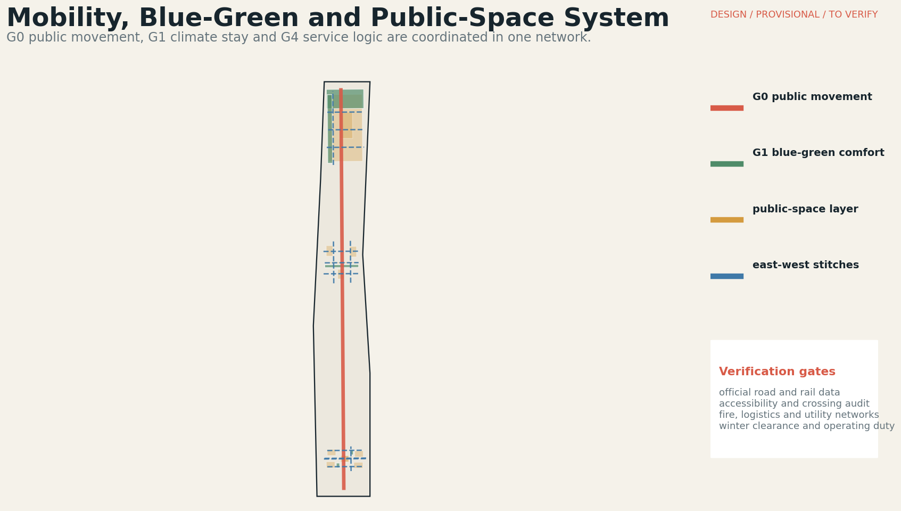
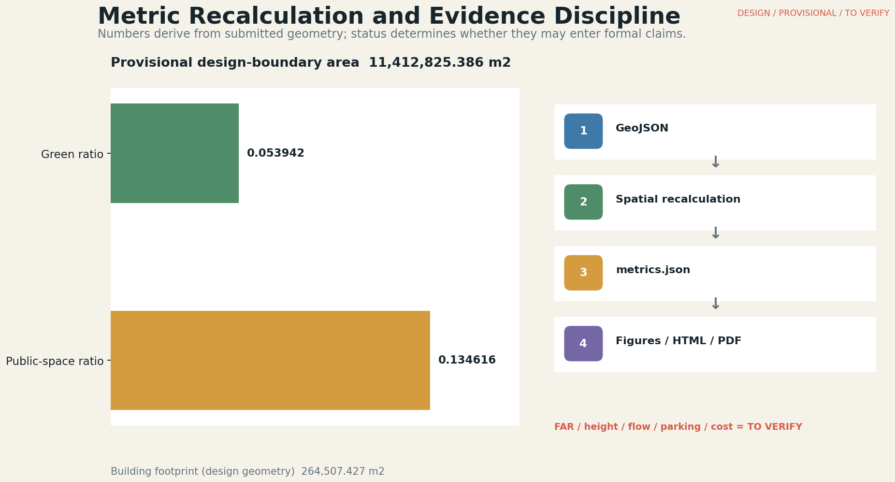

# Jingzhang Thick Ground

## Design Basis and Source List

This formal proposal takes the official project announcement and the Agent open-call taskbook as its primary briefs. The repository site package supplies the machine-readable design space, controlled vocabularies, provisional geometries, source registry and review rules. Every spatial claim is therefore separated into traceable sources, recomputable metrics, inspectable GeoJSON and assumptions requiring professional follow-up [source:OFFICIAL-ANNOUNCEMENT] [source:AGENT-TASKBOOK] [depth:existing_conditions_diagnosis].

The public package does not contain official site and key-area polygons, parcel rights, approved regulatory controls, surveyed building footprints or engineering networks. The submitted site boundary and three key areas are explicitly provisional constraints: they support design generation, visualization and internal recalculation, but are not official redlines, approval evidence or precise land-accounting bases. When official polygons arrive, land use, buildings, roads, green space, public space, phasing and all dependent metrics must be regenerated together [data:geometry/site_boundary.geojson#SITE-001] [data:geometry/key_areas.geojson#PROV-KEY-001].

## Three-Level Scope Framework

The work follows three nested scopes in the announcement. The coordinated research area addresses the 43.6 square-kilometre AI ecosystem, strategic positioning and future-city hypothesis. The overall design area addresses approximately 11.4 square kilometres around the Jingzhang Railway Heritage Park and nearby innovation districts. The three key detailed-design areas total approximately 368.4 hectares in the official written brief, while the submitted polygons remain provisional and are not used to claim exact legal areas [standard:PROJECT-OFFICIAL-ANNOUNCEMENT] [depth:three_level_scope_framework].

Thick Ground translates these scales into one method. At the research scale it links universities, firms, communities, culture and international exchange. At the overall-design scale it becomes a G0-G4 network connecting movement, climate, thresholds, shared ground floors and service support. At the key-area scale it is tested through three distinct prototypes: Garden at Zhongzhiyuan, Learning at AI Origin and Station-City at Dazhongsi. Geometry and metrics remain replaceable when official data is issued [metric:site_area_sqm] [metric:key_area_count].

## Coordinated Research Area: Industry and Future City Research

The strategic proposition is not a technology showcase but an innovation ecosystem embedded in everyday urban life. A university-originated knowledge chain connects open-source collaboration, enterprise translation, public testing, cultural communication and long-term operations. The public realm is treated as common innovation infrastructure: it must work for researchers, entrepreneurs, residents, families and first-time visitors before any app, sensor or autonomous device is enabled [source:AGENT-TASKBOOK] [standard:PROJECT-AGENT-OPEN-CALL-TASKBOOK].

### Brand and Logo Direction (agent.1)

The proposed identity converts the Jingzhang railway's paired-track memory into two continuous dark rails crossed by five coloured ground bands. It is a design deliverable for the open-call package, not an adopted government emblem or a replacement for statutory signs. The standard Chinese lockup is `京张厚基面`; the standard English lockup is `JINGZHANG THICK GROUND`; the bilingual version places Chinese above English with the descriptor `HERITAGE · LEARNING · STATION-CITY` below.

| Rule | Proposed specification | Verification boundary |
|---|---|---|
| Mark | Two rails + five G0-G4 bands; no company, university or government emblem | Concept identity; ownership and registration remain to be verified |
| Colour | G0 `#D85B48`; G1 `#4F8C69`; G2 `#D49B3F`; G3 `#3F79A8`; G4 `#7567A6`; ink `#17252D`; paper `#F5F2EA` | Preserve contrast and the G0-G4 order; do not infer regulatory zoning |
| Monochrome | 100% black, or white reversed on a single dark field | No gradients, shadows or recolouring of individual bands |
| Minimum size | Symbol only from 16 px / 6 mm; full bilingual lockup from 96 px / 34 mm | Below the threshold use the symbol or plain text, not compressed lettering |
| Typeface | The Chinese offline HTML embeds a Noto Sans CJK SC subset directly as a Data URI under SIL Open Font License 1.1; English uses a system sans-serif stack | Source and the complete licence text are recorded in `sources.json` and `report/copyright_statement.md`; no remote or standalone font file is required |
| Incorrect use | No stretching, rotation, glow, perspective distortion, unofficial partner lockups or placement over low-contrast imagery | Partner marks require separate permission and a documented clear-space rule |
| Cultural wayfinding boundary | The brand identifies this proposal and its programmes; the Jingzhang heritage wayfinding system carries historical interpretation and statutory information | The brand may support a route, but may not overwrite heritage plaques, official transit signs or emergency guidance |

### Regional Innovation Coordination Matrix (Concept Proposal)

The following matrix translates the broad regional names in the brief into reviewable interfaces. Every row is a proposed cooperation mechanism. It does not assert that any district, institution, government body or enterprise has agreed to participate.

| Partner area | Proposed theme and factor flows | Spatial interface in Jingzhang | Annual mechanism | Proposed roles | Review indicators |
|---|---|---|---|---|---|
| Beiwei Community | Community AI, ageing, youth learning; residents, needs, service protocols and feedback | Origin Open Porch + no-app service desk | Two community co-design weeks and quarterly accessibility walks | Community liaison, university facilitator, accessibility reviewer | Participation diversity; issues closed; non-digital completion rate |
| Future Science City | Basic research translation; researchers, open problems, prototypes and shared facilities | Zhongzhiyuan Garden-Lab + Test Garden booking interface | Spring open-source urban week and one joint prototype review | Proposed research liaison, test-site steward, safety reviewer | Reproducible prototypes; reviewed test hours; public-value findings |
| Huairou Science City | Scientific-instrument and research-culture exchange; methods, exhibitions and visiting teams | Adaptive-reuse innovation gallery + Century Gauge route | Autumn research-culture residency and public demonstration | Proposed curator, research liaison, public-programme steward | Visits; reusable learning modules; public comprehension feedback |
| Beijing E-Town | Robotics and manufacturing verification; devices, suppliers, safety protocols and maintenance learning | Low-speed delivery bay + G4 service interface | One supervised logistics interoperability drill each year | Proposed enterprise liaison, site operator, safety and data reviewer | Manual takeovers; protocol issues closed; non-AI continuity |
| Beijing-Tianjin-Hebei | Heritage tourism, talent and industrial collaboration; visitors, event content, referrals and comparative data | Dazhongsi Urban Exchange Hall + bilingual physical map | Annual Jingzhang Urban AI Forum and a travelling public exhibition | Proposed regional convener, host venue, translation and evaluation team | Cross-city participants; referrals followed; shared outputs; visitor comprehension |

Six global references are used as method comparators, not as transferable control standards. Barcelona 22@ informs productive heritage renewal and mixed urban fabric; Singapore one-north links research, startups and test-bedding; London Knowledge Quarter demonstrates institutional partnership; Kendall Square links research anchors, transit and daily services; High Tech Campus Eindhoven highlights shared R&D and social hubs; Jurong Innovation District separates and coordinates the movement of people, goods, data and ideas. Jingzhang extracts five lessons - open interfaces, shared facilities, public life, governable testing and continuous stewardship - while retaining Beijing-specific evidence boundaries [source:CASE-22BARCELONA] [source:CASE-ONE-NORTH] [source:CASE-KNOWLEDGE-QUARTER].

The brand direction uses the name Jingzhang Thick Ground and a five-band identity derived from G0-G4. Heritage, learning and station-city exchange become usable landmarks rather than isolated technology sculptures. The identity may guide signs, event routes and open-call materials, but it does not imply government approval or exclusive ownership of public culture [source:CASE-KENDALL-SQUARE] [source:CASE-HIGH-TECH-CAMPUS-EINDHOVEN] [source:CASE-JURONG-INNOVATION-DISTRICT].

## Overall Design Area: Urban Renewal and Regulatory-Plan-Level Urban Design

The overall structure is a north-south public mobility and heritage chain stitched east-west into campuses, enterprise compounds, neighborhoods and rail stations. The G0-G4 grammar operates in section rather than as five separate land parcels: G0 is uninterrupted public movement; G1 provides shade, ecology and stay; G2 forms porches and transition zones; G3 opens shared ground-floor programs; G4 supports maintenance, logistics and reversible AI interfaces. AI can enhance G4, but it may never interrupt the non-digital G0 baseline [depth:overall_spatial_structure] [data:geometry/roads.geojson#MOB-001].

Land use, building envelopes, public spaces and phasing are submitted as concept geometry for review and recomputation. They describe an urban-design method, not surveyed property, demolition authority or approved development capacity. FAR, height, setbacks, road redlines, building density and total floor area remain unknown until official controls and surveys are supplied. This avoids pseudo-precision while retaining a structured path toward regulatory-plan-level development [standard:MOHURD-CONTROL-DETAILED-PLANNING] [data:geometry/land_use.geojson#LU-001] [depth:development_intensity_controls].

## Detailed Design of Key Areas

Zhongzhiyuan becomes the Garden prototype. Continuous gardens, blue-green comfort routes and Garden-Lab thresholds link research buildings and public life. The flagship AI Test Garden allows low-disturbance demonstrations only with reservation, supervision, emergency stop, clear separation from children’s play and a non-AI public-garden baseline. Every building outline and intervention envelope remains conceptual pending surveyed footprints and ownership verification [data:geometry/key_areas.geojson#PROV-KEY-001] [depth:three_key_area_detailed_design].

AI Origin becomes the Learning prototype. A shared street, open ground floors, learning courtyards and campus-city porches connect research, entrepreneurship, study and neighborhood life. Dusk is the critical operating period: workspaces transition into learning and social uses while fire safety, noise, logistics, access rights and staffed service remain explicit. Dazhongsi becomes the Station-City prototype, using a four-quadrant urban room to organize arrival, waiting, meeting, community service and commercial edges. Metro exits, passenger flows and underground constraints must be replaced by official technical data [data:geometry/key_areas.geojson#PROV-KEY-002] [data:geometry/key_areas.geojson#PROV-KEY-003].

## AI Innovation Ecosystem, Personas, and AI+ Scenarios

Five personas structure design review: a young researcher needs quiet work, exchange and recovery; a startup engineer needs affordable collaboration, testing and enterprise services; an older resident needs continuous accessibility, frequent rest and staffed help; a family with children needs visible supervision and safe seasonal activity; a first-time visitor needs legible arrival, cultural orientation and multilingual assistance. Personas support co-design and accessibility review; they are not statistical profiles and cannot justify personal tracking [standard:PROJECT-AGENT-OPEN-CALL-TASKBOOK] [data:geometry/public_space.geojson#ZZY-PUB-01].

Twelve scenario cards use one sequence: WHO, WHERE, WHEN, SPACE, ACTION, AI enhancement, non-AI fallback and TEST. They are: AI Test Garden; R&D Lunch Courtyard; Blue-Green Comfort Walk; Origin Shared Street; Night Learning Corner; Campus-City Open Porch; Low-Speed Delivery Bay; 4Q Accessible Transfer; Station Meeting Room; Existing Retail Night Room; Adaptive-Reuse Innovation Gallery; and No-App Jingzhang Cultural Walk. The first, seventh and eighth are explicit industry test or validation scenarios; each requires safety review, human override, data minimization and an exit mechanism [data:geometry/green_space.geojson#ZZY-GRN-01] [data:geometry/roads.geojson#ORG-MOB-01] [metric:public_space_ratio].

Three usable landmarks support the shared identity: Century Gauge is a walkable and readable heritage timeline; Origin Open Porch is an active threshold rather than a tower; Dazhongsi Urban Exchange Hall combines canopy, physical map, seating and staffed service. Together they translate Heritage, Learning and Station-City into memorable public use. AI remains optional, and every essential task must be possible without an app.

## Land Use, Building Scale, and Retain-Renovate-Demolish Strategy

The renewal path replaces a simplistic retain-demolish binary with five evidence-led actions: retain; retrofit the ground-floor interface; repair public space; adaptively reuse; and selectively insert new construction only where a verified structural gap remains. The method begins with public ground and building interfaces before escalating to structural transformation. Parcel-level decisions require building-condition surveys, ownership, heritage value, fire and utility checks, cost, public benefit and an operating entity [standard:MNR-LAND-USE-CLASSIFICATION-GUIDE] [depth:retain_renovate_demolish].

The submitted building polygons are conceptual intervention envelopes with allowed machine-readable building types. Their recomputed footprint area is a property of the submitted design geometry, not a claim about existing or approved building stock [data:geometry/buildings.geojson#ZZY-GF-01] [metric:building_footprint_area_sqm]. Total floor area, FAR, height, density and setbacks remain unknown. Any later replacement of a footprint must trigger metric recalculation, figure refresh, report rendering and renewed self-check rather than a visual-only update.

## Transport, Rail, Municipal Infrastructure, and Public Services

G0 establishes a continuous public movement baseline linking the heritage park, three key areas, campus edges, neighborhoods and rail arrival points. East-west stitches are classified as pedestrian, local-access or greenway concepts under the current repository vocabulary. Their locations identify design questions rather than surveyed crossings or approved road projects. Accessible continuity, safe crossings, bicycle parking, service access and rail transfer must be audited in the field before geometric dimensions or capacity claims are introduced [data:geometry/roads.geojson#MOB-001] [depth:traffic_rail_slow_parking].

G4 separates maintenance, delivery, equipment and AI support from primary public movement. Low-speed robots and couriers meet at service bays instead of competing with G0; all automated operations require geofencing, speed limits, human takeover and shut-down procedures. Municipal and public-service layers must coordinate drainage, power, communications, fire access, waste and staffed assistance. Because network and utility data are missing, these are design requirements and verification tasks, not engineering commitments [data:geometry/constraints.geojson#CONSTRAINTS] [depth:municipal_new_infrastructure].

## Blue-Green Network, Public Space, and Urban Character

G1 makes climate adaptation continuous rather than decorative. Shade, winter sun, wind protection, rain shelter, seating, stormwater landscapes and seasonal maintenance are coordinated with G0 movement and G2 thresholds. Spring emphasizes reconnection and planting; summer prioritizes shade and drainage; autumn supports culture and markets; winter protects sunny, wind-sheltered and cleared walking routes. The five time points and four seasonal principles are scenarios to test, not fixed opening hours [data:geometry/green_space.geojson#ZZY-GRN-01] [depth:blue_green_public_space].

The current geometry recomputes a green ratio of 0.053942 and a public-space ratio of 0.134616 within the provisional site boundary. These values describe only the submitted concept layers and must not be presented as official existing or target ratios [metric:green_ratio] [metric:public_space_ratio]. Urban character combines Jingzhang railway heritage, Zhongguancun innovation culture and ordinary Beijing street life. Warm materials, usable porches, physical signs and tree structure take priority over oversized screens or technology monuments [standard:MOHURD-URBAN-DESIGN-MEASURES].

## Renewal Projects, Implementation Policy, and Phasing

Implementation uses three intensity levels. L1 is a light, reversible update: seats, shade, signs, surface repair, bicycle parking and small rain gardens. L2 retrofits interfaces: entrances, porches, forecourts, shared courtyards and open ground floors. L3 is structural transformation: adaptive reuse, station-city reorganization or selective new insertion. A problem that can be solved at L1 should not be automatically escalated to L3 [data:geometry/phasing.geojson#PH-01] [depth:phasing_implementation].

The project list includes the heritage-park mobility stitches, Zhongzhiyuan Garden-Lab interface, AI Origin shared street and open ground floors, Dazhongsi four-quadrant urban room, reversible AI service nodes and a no-app cultural route. Advancement between phases depends on five gates: verified public value, responsible ownership, technical safety, operating resources and user feedback. No unsupported delivery year, cost, capacity or government commitment is stated. Long-term stewardship combines district coordination, site operators, community review, annual safety audits and public reporting [depth:renewal_project_list] [source:AGENT-TASKBOOK].

### Annual Activities and Long-Term Operations Table (agent.6, Concept Proposal)

| Activity / scenario | Suggested frequency and carrier | Proposed responsible roles | Permit, safety, data and human-review prerequisites | Non-AI fallback and developer mechanism | International / conversion route | Quantified review indicators |
|---|---|---|---|---|---|---|
| Spring Open-Source Urban Week | Annual; Origin Shared Street and open ground floors | Programme convener, venue steward, community liaison, code reviewer | Venue and fire review; published code of conduct; no personal data by default; staffed moderation | Printed schedule, staffed help desk; public issue board and reproducibility clinic | Bilingual repository entry; referrals to incubators or research teams only with opt-in | Participants; reproducible contributions; issues closed; non-digital service use |
| Summer Test Garden Open Month | Annual four-week window; Zhongzhiyuan Test Garden | Test-site steward, safety officer, research liaison, accessibility reviewer | Booking, physical separation, emergency stop, weather and child-safety review; human supervision | Operates as an ordinary public garden when tests stop; weekly developer safety clinic | Bilingual demo brief; opt-in follow-up to labs or enterprises | Supervised test hours; interventions; incidents; public-value findings |
| Autumn Jingzhang Urban AI Forum | Annual; Dazhongsi Exchange Hall + heritage route | Regional convener, host venue, curator, translation team | Crowd, fire and accessibility plans; speaker and media consent; human editorial review | Physical programme and staffed interpretation; open call for civic cases | English landing page and travelling exhibition; opt-in talent and enterprise referrals | Regions represented; public sessions; qualified referrals; follow-up outputs |
| 4Q Accessible Transfer Drill | Quarterly; Dazhongsi four-quadrant node | Station liaison, accessibility reviewer, community observers, operations steward | Official interface permission before field action; route and emergency review; no biometric identification | Physical map, tactile/large-type information and staffed assistance | Publish anonymised method notes; route verified issues to responsible agencies | Completion time; barriers logged and closed; staffed-assistance availability |
| Developer Walk and Civic Bug Day | Every two months; rotating G0-G4 routes | Developer-community host, site steward, resident reviewer | Public-space permission where required; disclosure and responsible-reporting rules; human triage | Paper issue cards and telephone/desk reporting; maintain public backlog | Bilingual issue taxonomy; opt-in matching to civic-tech teams | Valid reports; closure rate; repeat contributors; accessibility issues resolved |
| Winter Thick-Ground Climate Lab | Annual two-week observation; sunny and wind-sheltered G0-G2 segments | Landscape steward, maintenance lead, climate researcher, resident panel | Weather and maintenance risk review; aggregate observations only; human interpretation | Manual counts and paper comfort diaries; open method workshop | Share a bilingual seasonal protocol; connect validated needs to design teams | Cleared-route continuity; comfort votes; response time; adopted maintenance changes |

Every public activity passes the same gates: named proposed role, site permission where applicable, safety and accessibility review, data-minimisation plan, staffed human override, non-AI continuity, incident log and post-event evaluation. This table does not claim a confirmed operator, budget, approval, annual commitment or partnership. It becomes an operating agreement only after the relevant parties accept roles, resources and liability.

## Metrics, Area Recalculation, and Compliance Matrix

Three headline metrics are known and directly recomputable from the submitted geometry: site area 11,412,825.386 square metres, green ratio 0.053942 and public-space ratio 0.134616. Building footprint area is 264,507.427 square metres and three key areas are represented. All values are properties of the provisional design package, not official regulatory statistics [metric:site_area_sqm] [metric:green_ratio] [metric:public_space_ratio].

Other controls remain unknown where evidence is absent. FAR, approved height, total floor area, parking supply, passenger flow, cost, ownership and performance targets cannot be manufactured from renderings. The compliance matrix maps official tasks 1.3, 1.4 and 1.5 and Agent tasks agent.1-agent.6 to chapters, geometry, metrics, figures, PDFs and HTML. Standards and design-depth matrices preserve exhaustive coverage without overloading the human narrative [depth:metrics_recalculation] [standard:MOHURD-CONTROL-DETAILED-PLANNING].

## Risk, Copyright, and Compliance

The proposal distinguishes four statuses: SOURCE is traceable external evidence; DESIGN is the project’s spatial or operational proposition; PROVISIONAL is concept geometry or an unresolved location; TO VERIFY requires official GIS, survey, engineering, ownership, user or operating evidence. Major risks include mistaking provisional boundaries for legal controls, treating AI-assisted perspectives as surveyed facts, introducing unlicensed logos or imagery, enabling personal tracking, and committing to operations without a responsible body [depth:risk_missing_data] [source:SITE-PACKAGE].

Text, structured data, diagrams and layouts were produced through human-directed collaboration with OpenAI GPT-5.6 Sol. AI-assisted concept images communicate design intent and do not constitute field evidence. Official-source content is cited; external case references are summarized without copying protected expression. The package uses no remote fonts, scripts, maps, trackers, forms or APIs. Asset rights and generation roles are recorded in the copyright statement and source registry [data:geometry/constraints.geojson#CONSTRAINTS] [source:OFFICIAL-ANNOUNCEMENT].

## References

Primary references are the official announcement, the Agent open-call taskbook, the repository site package and its source registry, processed fact pack, mandatory planning standards, and the six public innovation-district references. Full URLs, provenance, permitted use and limitations are stored in `sources.json`; exhaustive requirement coverage is stored in the compliance, standard and design-depth matrices [source:OFFICIAL-ANNOUNCEMENT] [source:AGENT-TASKBOOK] [source:SOURCE-REGISTRY].

The proposal’s spatial evidence is contained in the nine GeoJSON layers and the recomputation record in `metrics.json`. The two PDFs, five bilingual figures, rendered reports and offline visual interface are display layers derived from the structured submission. If a display conflicts with geometry or metrics, the structured files govern and the display must be regenerated [data:geometry/site_boundary.geojson#SITE-001] [metric:site_area_sqm].
